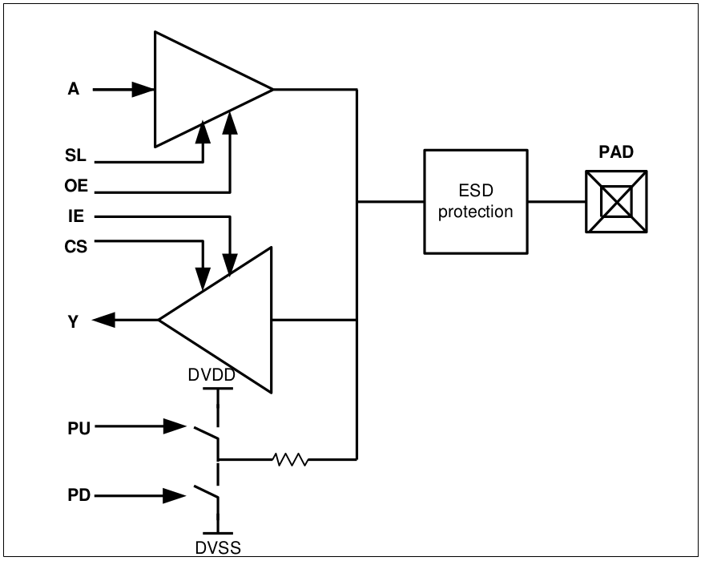

4.3 Tri-state 24mA Programmable Digital I/O Cell
================================================

.. centered::
   Figure 4.2 Functional Schematic of Tri-state Digital I/O Pad, gf180mcu_fd_io__bi_24t

The pad **gf180mcu_fd_io__bi_24t** is a 5V tri-state bi-directional I/O pad with output drive strength of 24mA. It can be programmed as CMOS input or CMOS Schmitt trigger input and with or without pull-up/down. In the fast slew mode, it can runs at a frequency of 100MHz with 50pF capacitive load. The use of the control pins PDRV0, PDRV1, SL, CS is as shown in section 4.1. The logical operation of the cell is as shown below.

**Driver Function**

 .. csv-table::
    :file: tables_clear/12_Driver_Function.csv

**Receiver Function**

 .. csv-table::
    :file: tables_clear/13_Receiver_Function.csv

