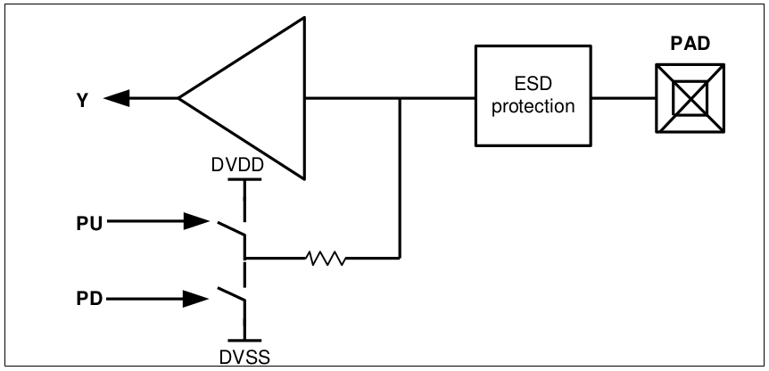
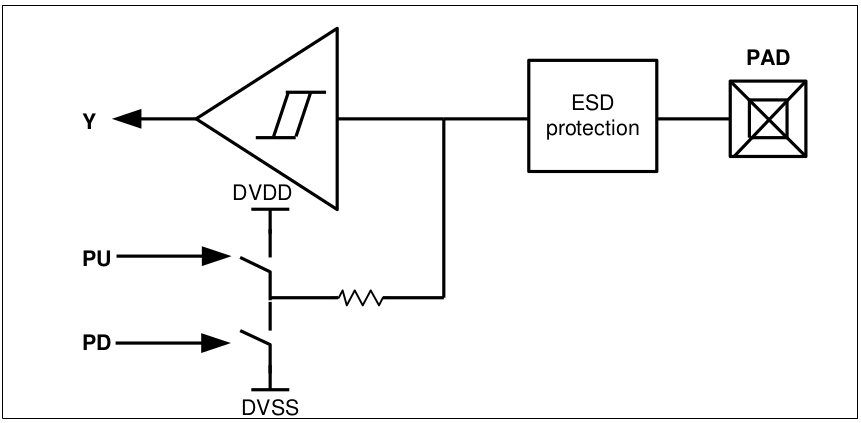

4.4 Input Only I/O Cell
=======================

.. centered::
   Figure 4.3 Functional Schematic of CMOS Input Only Pad, gf180mcu_fd_io__in_c

.. centered::
   Figure 4.4 Functional Schematic of Schmitt Trigger Input Only Pad, gf180mcu_fd_io__in_s

**gf180mcu_fd_io__in_c** and **gf180mcu_fd_io__in_s** are input only pads configured in CMOS and Schmitt trigger modes respectively. Both pads are equipped with pull-up/down programmability. The logical operation of the pad is as shown below.

 .. csv-table::
    :file: tables_clear/14_Input_IO_Cell.csv

