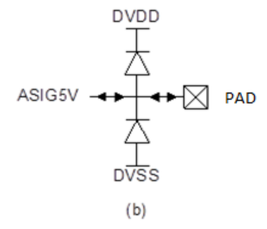
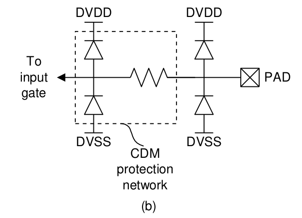

4.5 Analogue Signal Cells
=========================

The schematics for a 5.0V analogue signal pad cell is shown in Figure 5.5. The 5.0V analogue signal pad is meant for analogue circuits that use the thick-gate transistors.

.. centered::
   Figure 4.5 Functional schematic of 5V analogue signal pad (b)

.. warning::
   The analogue signal pads contain only HBM protection diodes. If they are connected to input gates, the designer needs to include CDM protection network near to these gates as shown in Figure 4.6.

.. centered::
   Figure 4.6 Illustration of CDM protection network that may be added to 5V analogue signal pad (b)

If these analog signal pads are used with internal circuit, the user must add their own secondary ESD protection adjacent to the devices of the internal circuit being protected. The perimeter of the CDM diode should be larger than 25µm. The CDM resistor should be larger than 50 and should be realized using appropriate poly resistor.

