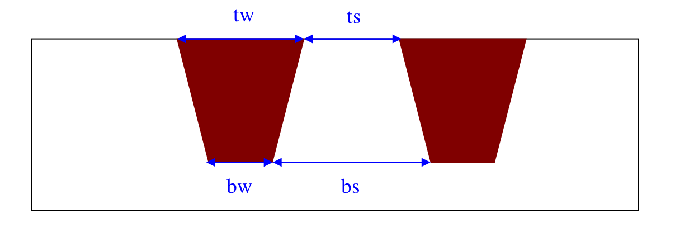

2.0 Technology PARAMETERS
=========================

Tables presented in this section represent the technology parameters used in Raphael simulation for all possible layers. The process consists of 1P3M, 1P4M, 1P5M and 1P6M flows for 6KA or 9KA top metal and without or with MIM capacitor. The parameters used for the simulation and their corresponding definitions are shown below.

This following diagram depicts the shape of the metal layers and its top (tw) and bottom (bw) dimensions are given below.

.. note::

   - W_drawn and S_draw are the EP spec values

   - W_si and S_si are the actual Si process values

   - tw and bw are the top and bottom width

   - ts and bs are the top and bottom space

In the following table the technology parameters used in Raphael_2007.09 simulation are presented. The parameters are: - Thickness of Poly, Metal, STI, Inter-metal Dielectric and Inter-layer Dielectric (ILD) as well as width and space of poly and metal layers

The simulation results for the typical case presented in this document are obtained by using the average width of tw and bw, as well as average space of ts and bs for all metal layers, focusing on dense metal lines.

.. toctree::
    :glob:

    inter_specs_2_1
    inter_specs_2_2

