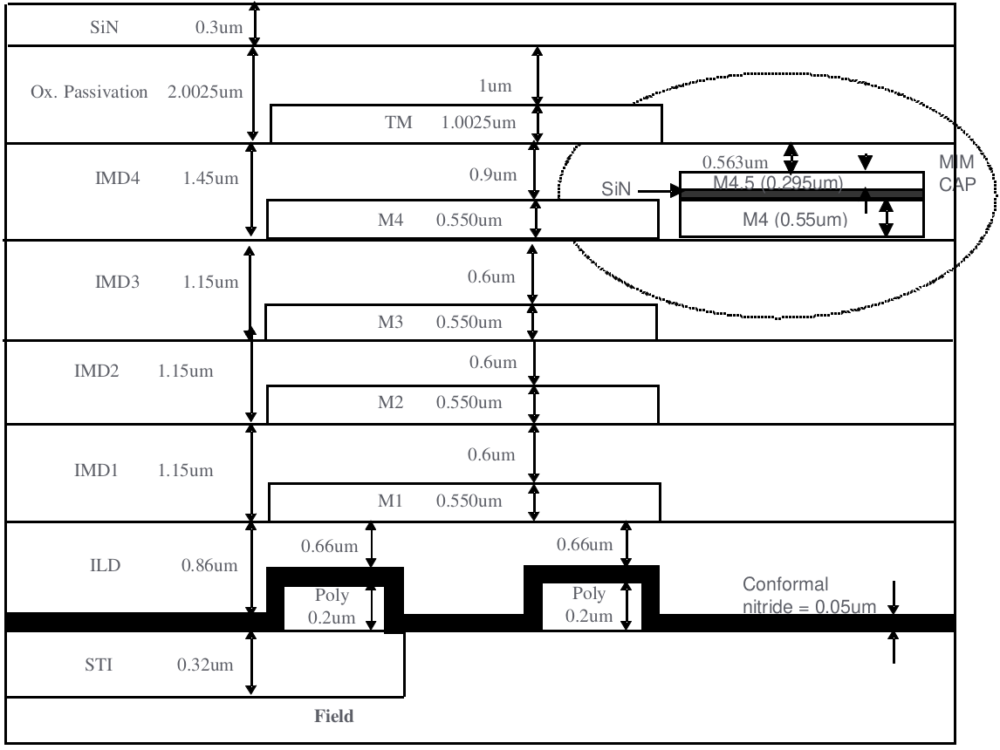

3.20 1P5M (TM 9KA with MIM Option B) Structure
==============================================

MIM was placed in between Metal4 and Metal5 (TOP Metal); SIN=0.042um for 1.5fF, SIN=0.062um for 1.0fF

