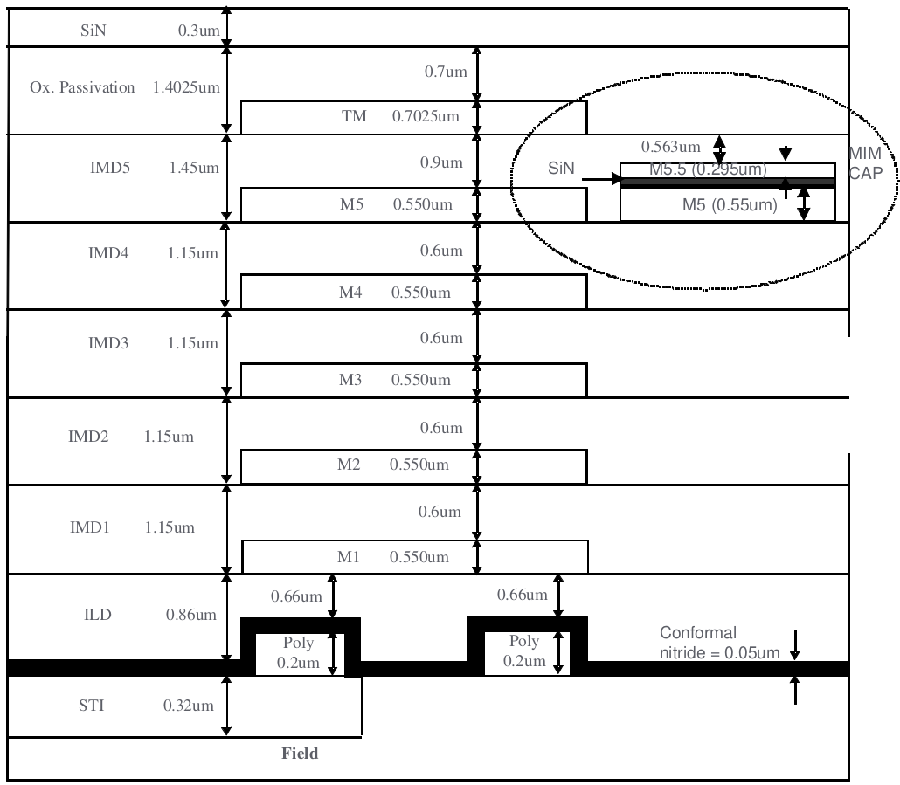

3.21 1P6M (TM 6KA with MIM Option B) Structure
==============================================

MIM was placed in between Metal5 and Metal6 (TOP Metal); SIN=0.042um for 1.5fF, SIN=0.062um for 1.0fF

