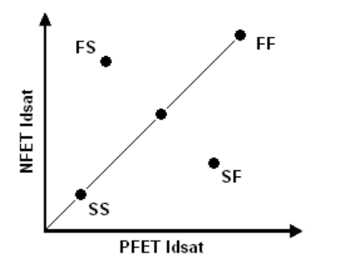

2.4 MOSFET Fixed Corner Models
------------------------------

2.4.1 Fixed Corner Methodology
..............................

This section discusses the definition of the fixed corners supplied with GlobalFoundries MOSFET models. There are many ways to define the process skew corners. Process corners of a circuit are related to the circuit design sensitivities to the process parameters, particularly in analog circuits. We are in no position to cover all the possible corners. The provided corner models are primarily for predicting static logic delay. Corner models for these devices are based entirely on line data and EP specifications of the devices. A fixed corner model is selected by including the appropriate corner library models as described and illustrated in Section 3.4.2. Each corner model has some parameters set to appropriate defined values for each corner. Currently ability to customize corner models by over-riding the defined values is not supported in this release.

2.4.2 Corner Model Definitions
..............................

.. csv-table::
   :file: tables_clear/4_Corner.csv

