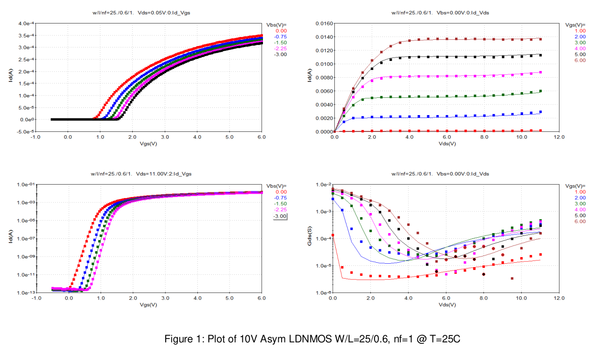
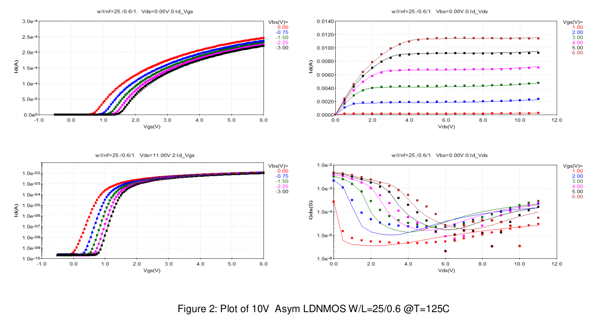
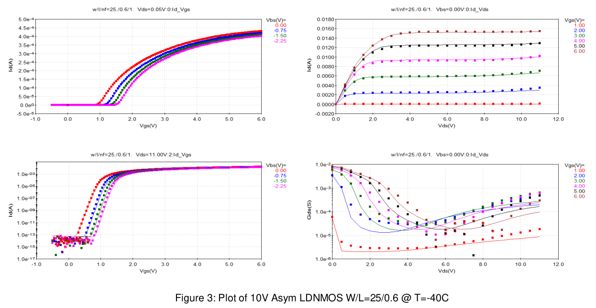
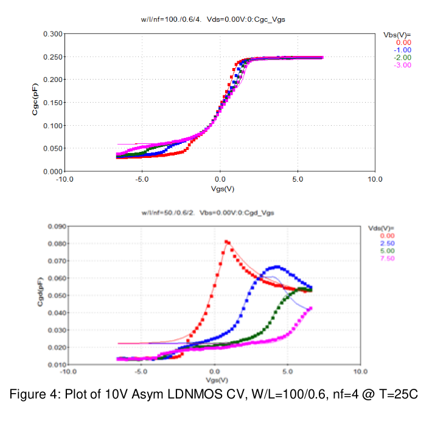
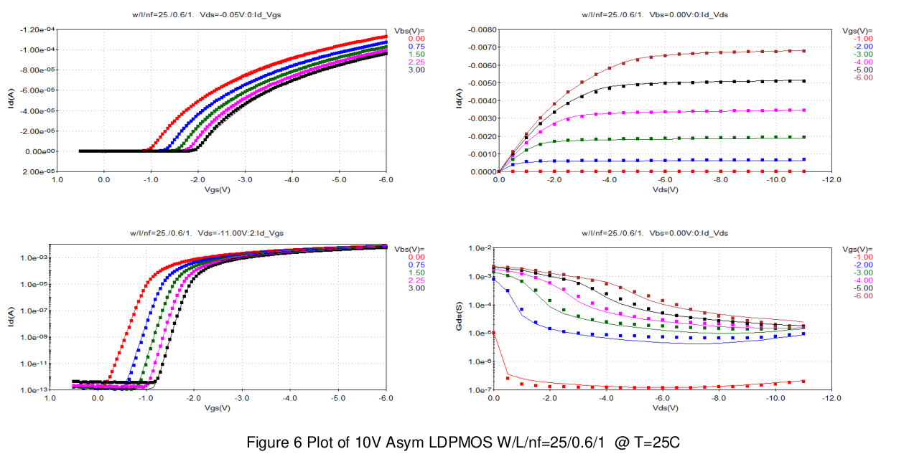
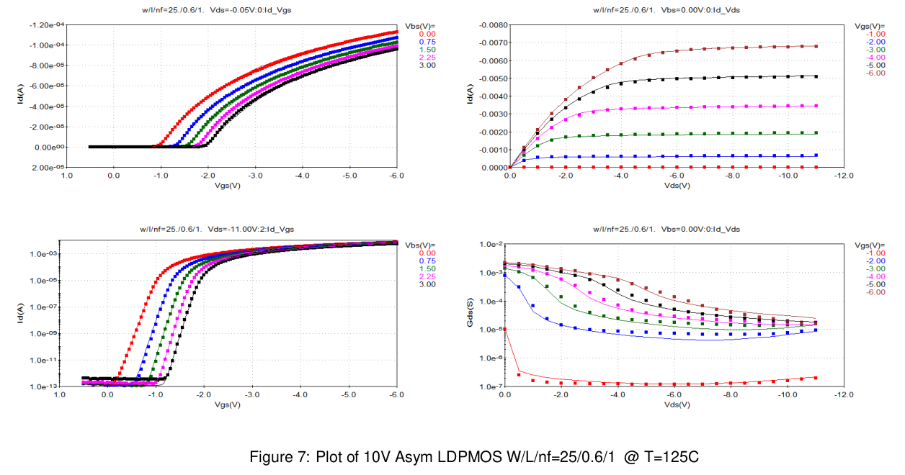
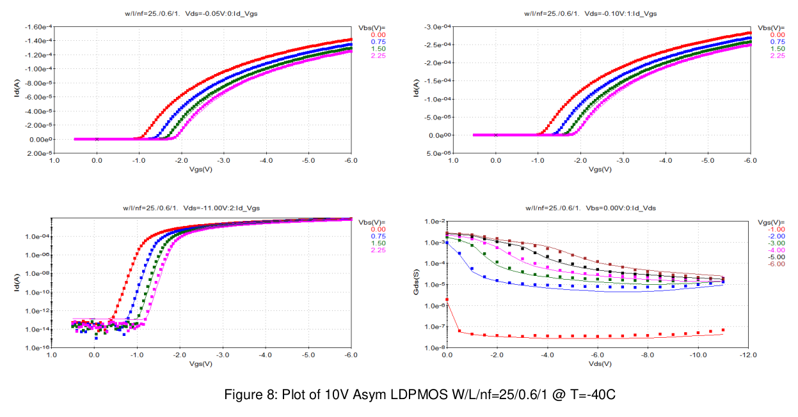
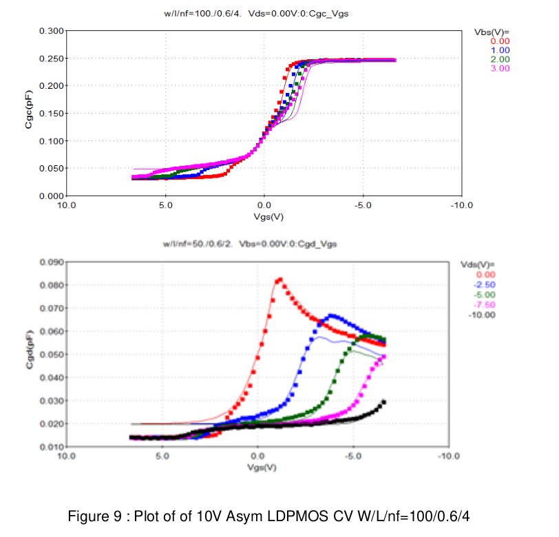
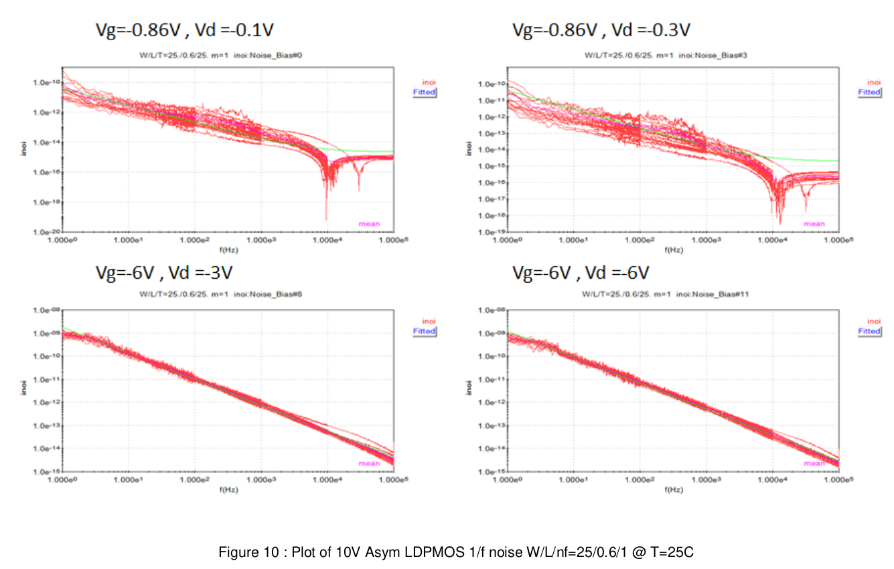

3.0 Model to Hardware Correlation
=================================

3.1 MOSFETS
-----------

3.1.1 10V Asym LDNMOS
.....................

.. image:: images/2_Correlation5.png
   :width: 600
   :align: center
   :alt: IV - Characteristics

