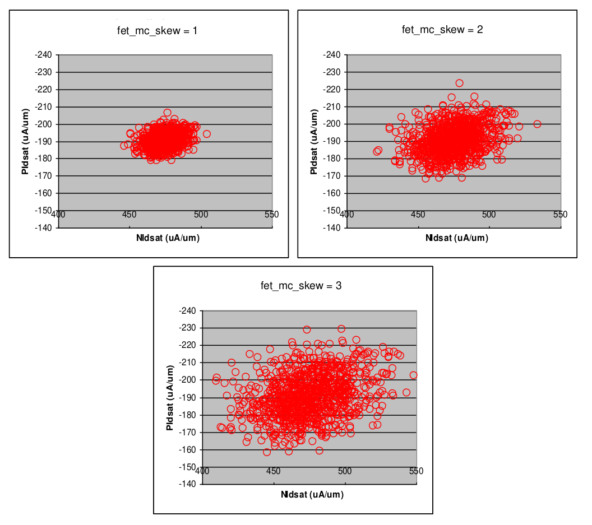

4.1 Statistical Models Syntax & Usage
=====================================

4.1.1 General Syntax
....................

The general model syntax is described below.

To run Monte Carlo simulations, designers are required to include the following elements in their netlist.

**Library invocation**:

**To be added**

**Transistor declaration:**

**To be added**

4.1.2 Parameter switches
........................

**To be added**

4.1.3 MC skew limit parameter
.............................

**To be added**

The skew parameter is used to model the tightening or loosening of manufacturing process variation. The default value of fet_mc_skew/ res_mc_skew/ cap_mc_skew is 3. Hence in the case of EP spec bound statistical (MC) models, if the actual manufacturing variation is smaller than the EP spec limit, a skew value < 3 can be used to produce a tighter Monte Carlo simulation.

The fet_mc_skew/ res_mc_skew/ cap_mc_skew parameter affects global variation only. It does not affect the mismatch simulation.

The following plots show an example of the results when fet_mc_skew is set to different values:

The value of the fet_mc_skew parameter can be any real number greater than 0. When simulating MC parallel device, in order to get consistent mismatch results, both “m” and “par” multiplicity factors parameters are needed. It must instantiated as follows:

- Xm11 2 0 0nmos_10p0_asymw=10u l=10u m=10

- Xm21 2 0 0pmos_10p0_asymw=10u l=10u m=10

