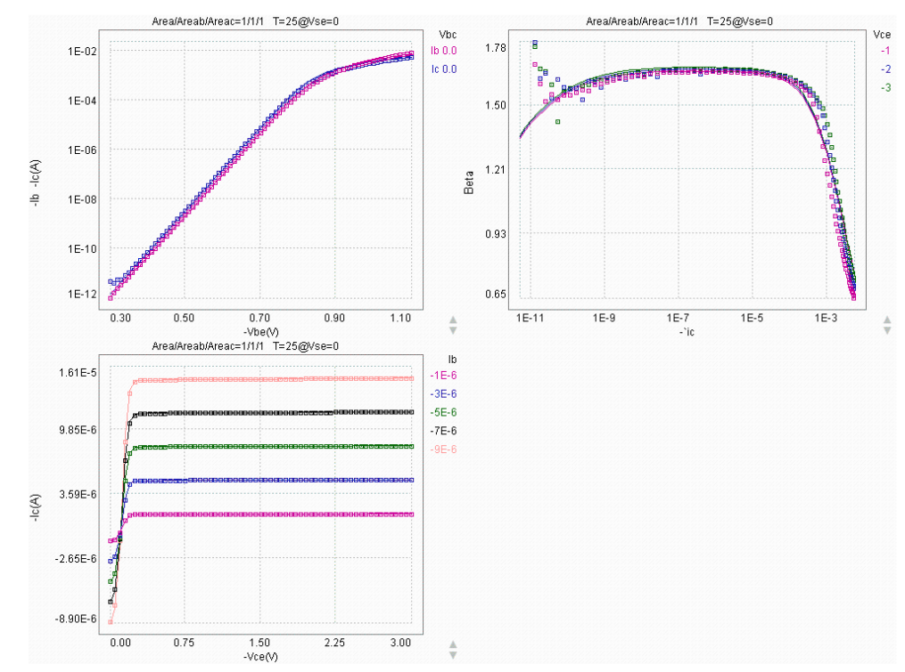
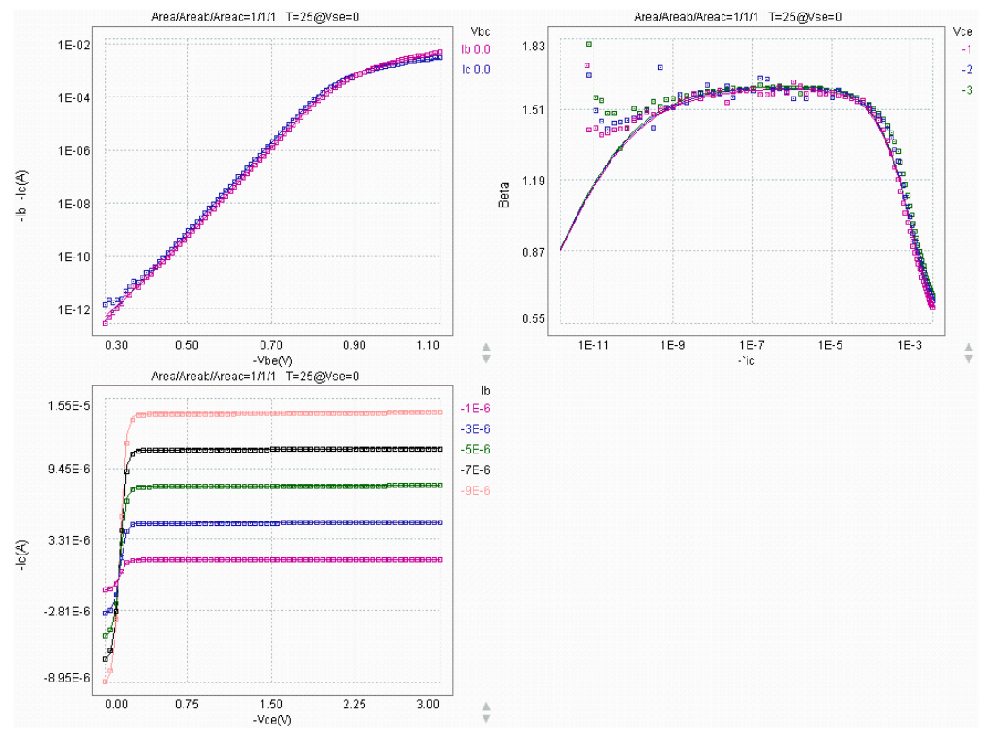
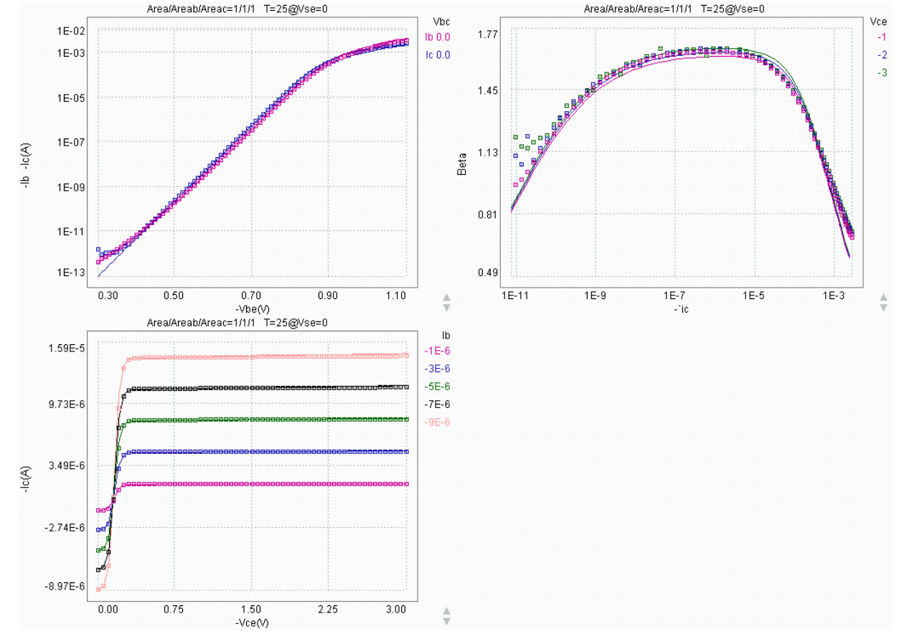
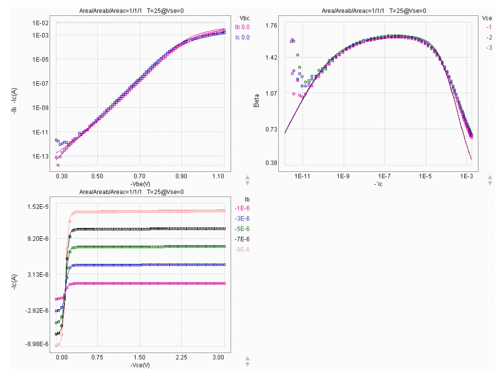
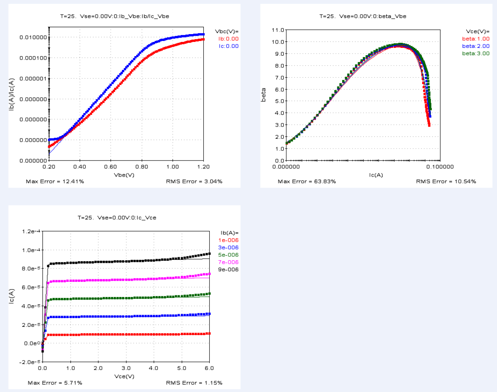
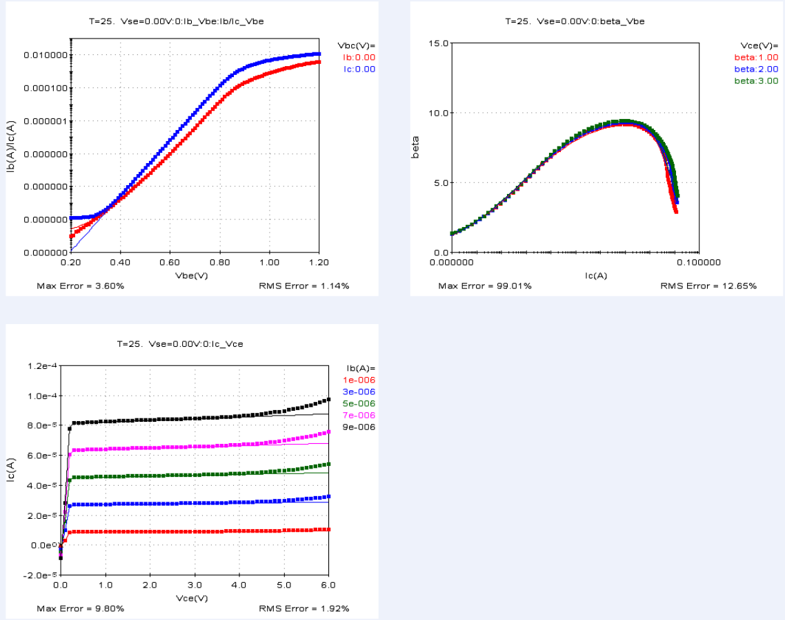
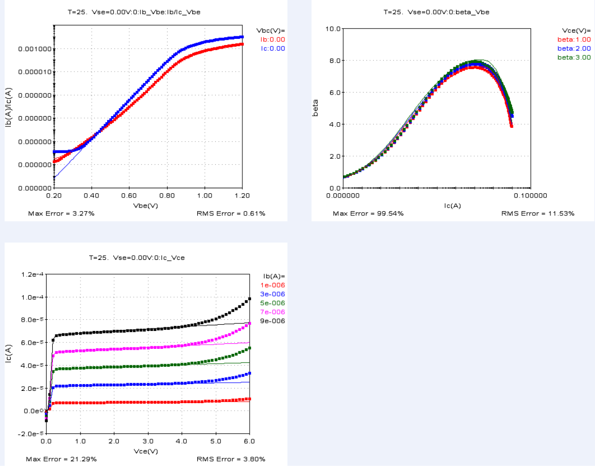
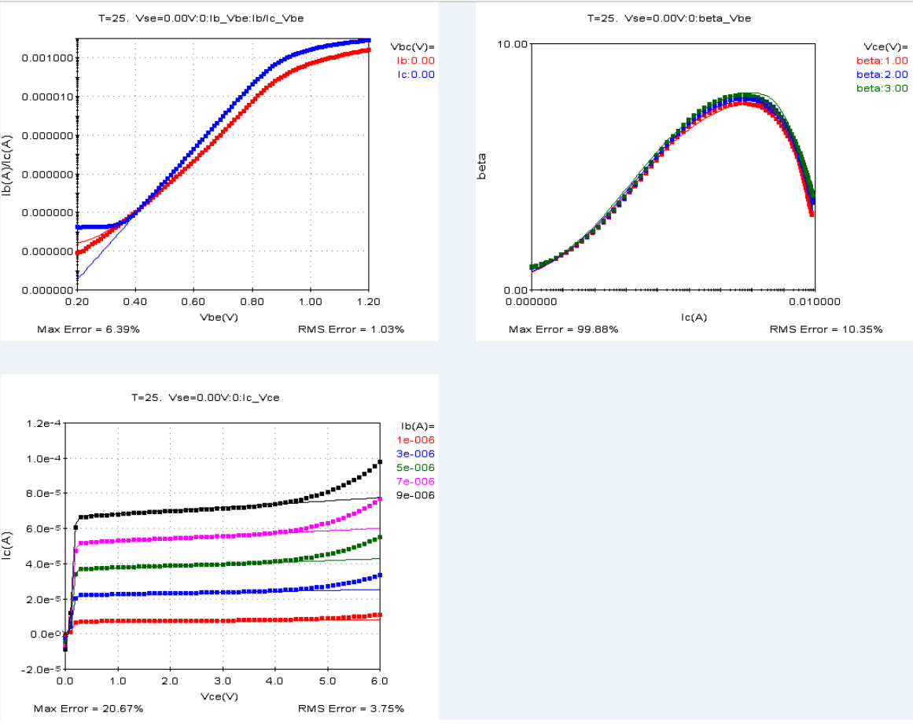
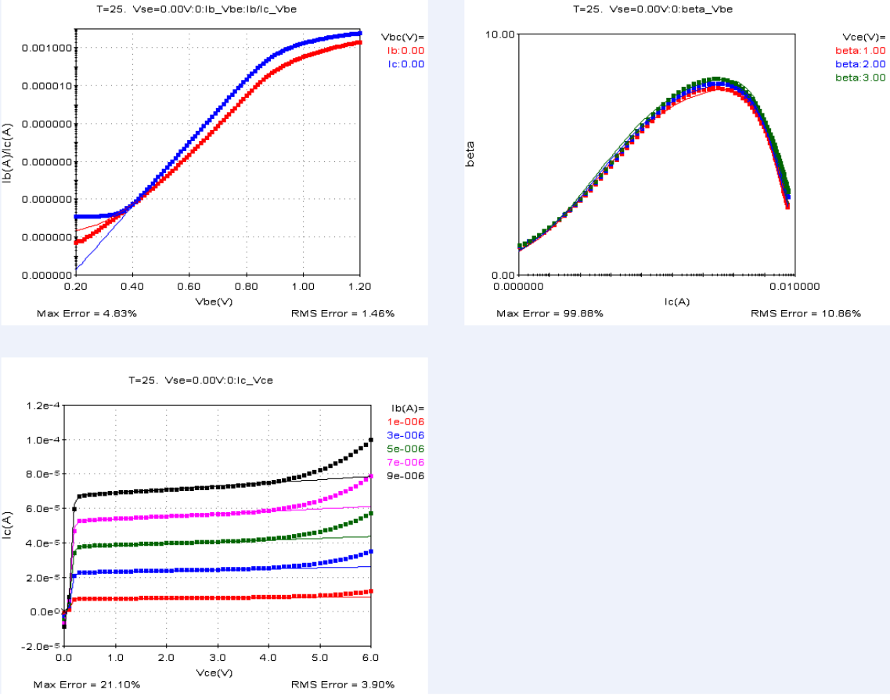
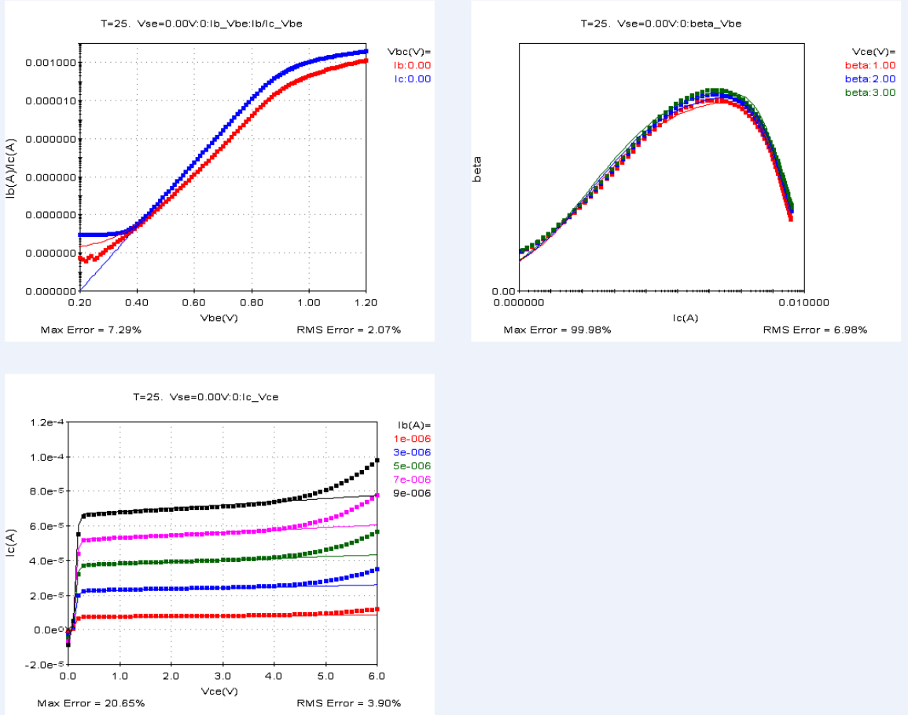

8.2 BJTs
========

8.2.1 Vertical PNP
..................

8.2.1.1 VPNP-Emitter Size 10um x 10um
"""""""""""""""""""""""""""""""""""""

8.2.1.2 VPNP-Emitter Size 5um x 5um
"""""""""""""""""""""""""""""""""""

8.2.1.3 VPNP-Emitter Size 0.42um x 10um
"""""""""""""""""""""""""""""""""""""""

8.2.1.4 VPNP-Emitter Size 0.42um x 5um
""""""""""""""""""""""""""""""""""""""

8.2.1.5 VNPN-Emitter Size 10um x 10um
"""""""""""""""""""""""""""""""""""""

8.2.1.6 VNPN-Emitter Size 5um x 5um
"""""""""""""""""""""""""""""""""""

8.2.1.7 VNPN-Emitter Size 0.54um x 16um
"""""""""""""""""""""""""""""""""""""""

8.2.1.8 VNPN-Emitter Size 0.54um x 8um
""""""""""""""""""""""""""""""""""""""

8.2.1.9 VNPN-Emitter Size 0.54um x 4um
""""""""""""""""""""""""""""""""""""""

8.2.1.10 VNPN-Emitter Size 0.54um x 2um
"""""""""""""""""""""""""""""""""""""""

