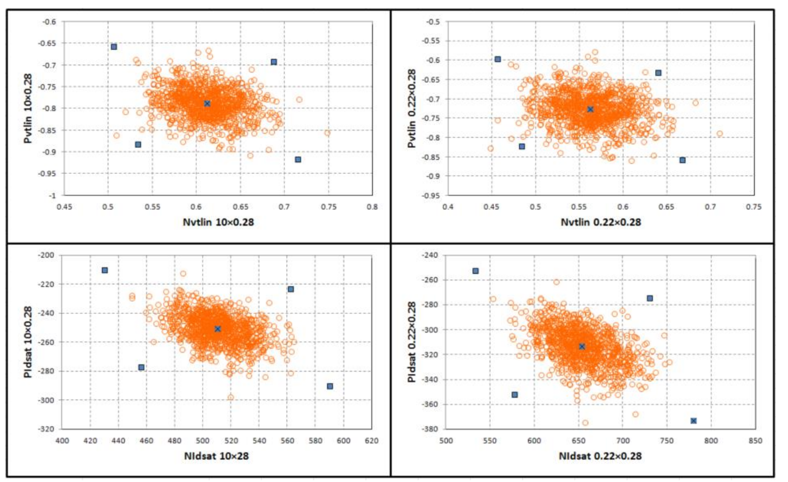
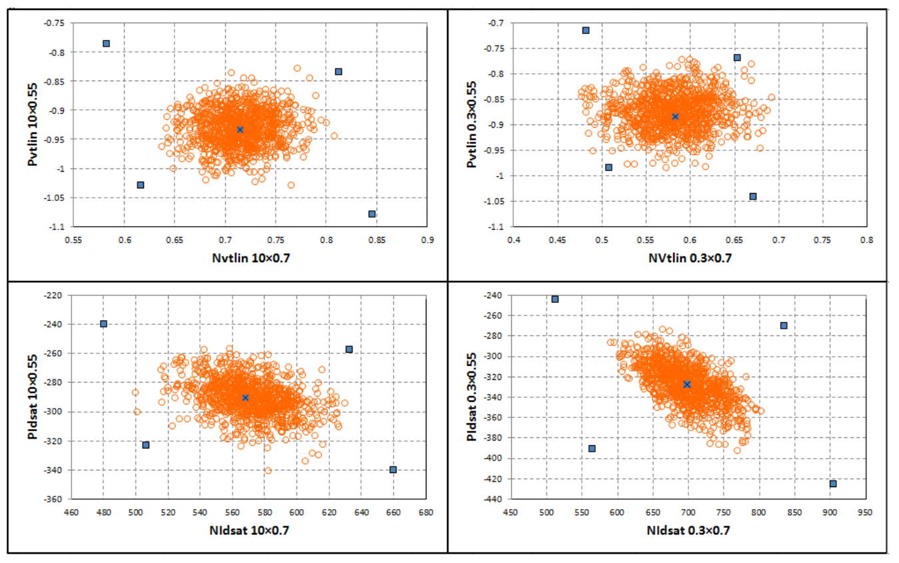
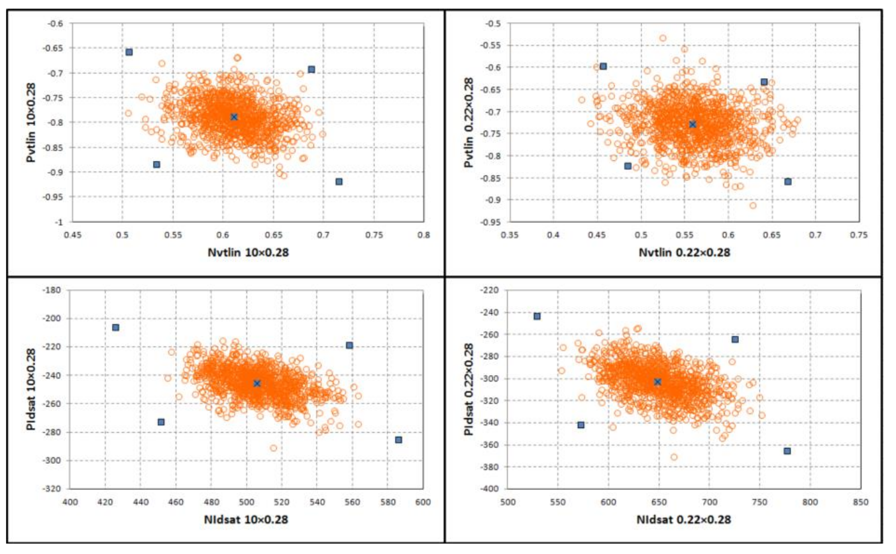
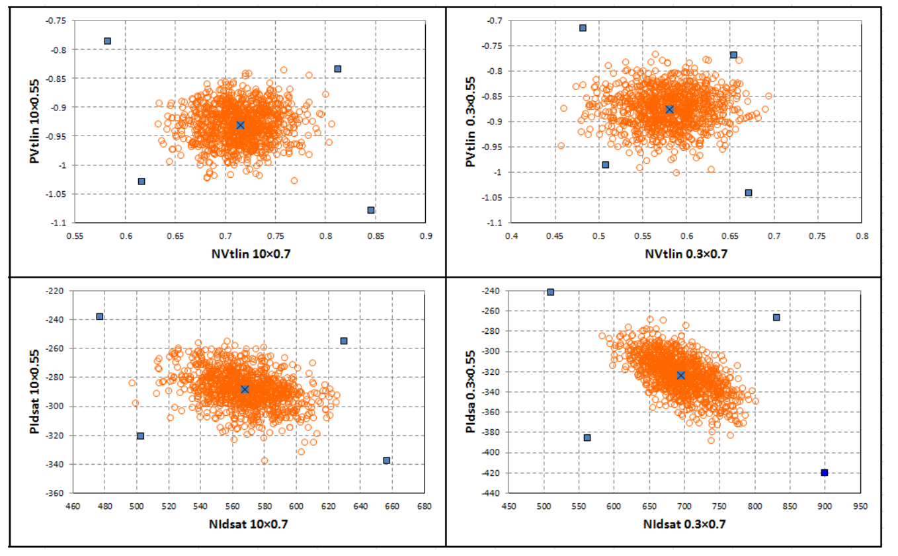

9.3 Statistical MOSFETs Modeling Results
========================================

To verify the model, Monte Carlo simulations were run and the output was compared with the measured data.

The verification plots below compare the NMOS data with the PMOS data. This plot captures 3 pieces of information: the variance of the NMOS data, the variance of the PMOS data, and the covariance of the NMOS data vs. the PMOS data.

The number of runs for each model type is 1000 runs. In normal usage though, such a large number of runs is not necessary. 100 to 200 runs would be a typical number. Certainly, for a large circuit, it may not be feasible to make a large number of Monte Carlo simulations. The following plots compare the measurement results and the simulation results. Results shown are for fet_mc_skew = 3.

9.3.1 3.3V NMOS and PMOS PROCESS MC
....................................

9.3.2 6V NMOS and PMOS PROCESS MC
..................................

9.3.3 3.3V SAB NMOS and SAB PMOS PROCESS MC
............................................

9.3.4 6V SAB NMOS and SAB PMOS PROCESS MC
..........................................

