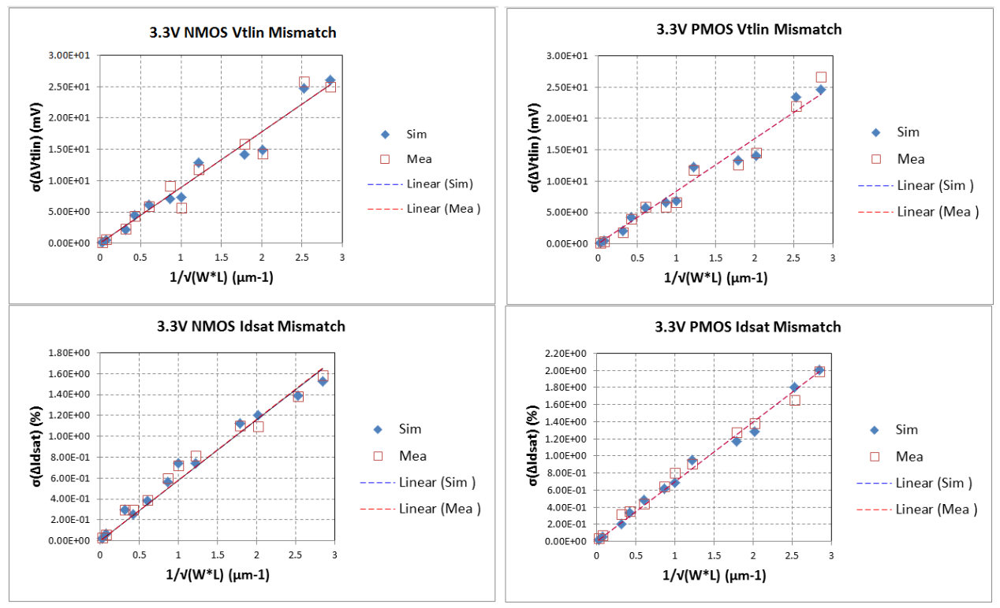
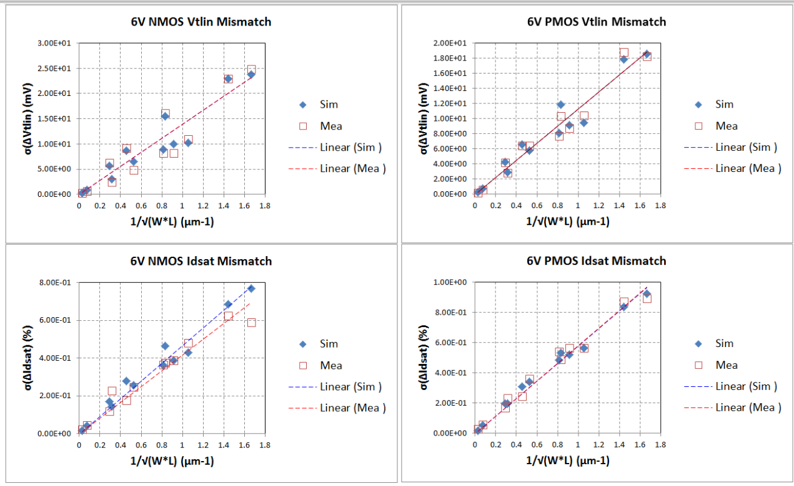

9.4 Mismatch MOSFET Modeling Results
====================================

9.4.1 3.3V NMOS and PMOS mismatch verification plots
.....................................................

Biasing Conditions (positive sign for NMOS, negative for PMOS):

- Vtlin=Vg@ Vds= 0.1V; Vt @ Id= 0.1μA*(W/L)

- Idsat=Id @Vg=3.3V, Vd= 3.3V, where Vbulk = 0V

9.4.2 6V NMOS and PMOS mismatch verification plots
...................................................

Biasing Conditions (positive sign for NMOS, negative for PMOS):

- Vtlin@ Vds= 0.1V; Vt @ Id= 0.1μA*(W/L)

- Idsat @Vg=6V, Vd= 6V, where Vbulk = 0V

