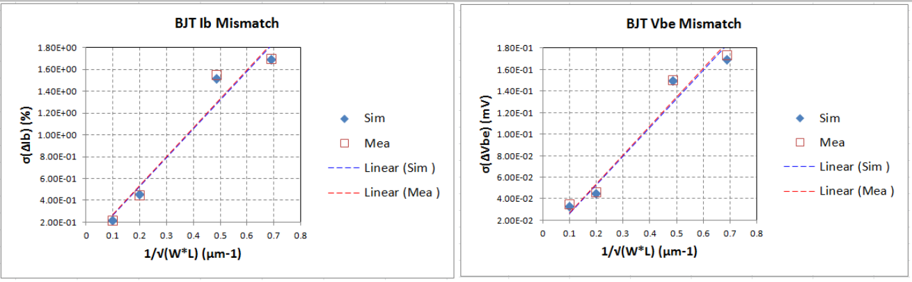

9.6 Mismatch BJT Modeling Results
=================================

The number of runs for each model type is 1000 runs. The measurement condition for Vbe is: Vc=Vb=Vsub=GND, Ie=10uA, while for Ib it is Vc=Vb=Vsub=GND, Ve = 0.7V.

