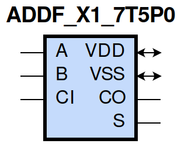
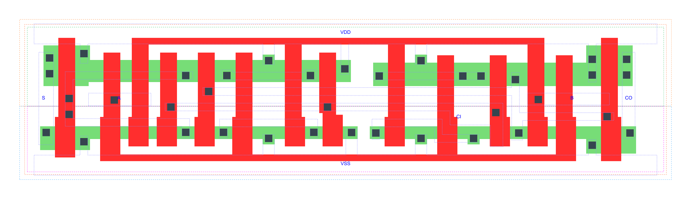

=======================================
gf180mcu_fd_sc_mcu7t5v0__addf_x1
=======================================

**gf180mcu_fd_sc_mcu7t5v0__addf_x1 symbol**

**gf180mcu_fd_sc_mcu7t5v0__addf_x1 schematic**

.. image:: sc7_sch/ADDF_X1_sch.png
    :height: 300px
    :width: 500 px
    :align: center
    :alt: gf180mcu_fd_sc_mcu7t5v0__addf_x1 schematic

**gf180mcu_fd_sc_mcu7t5v0__addf_x1 layout**

.. include:: images.rst

ADDF_X1 is a Full Adder, 1X drive strength

|
| Attributes

============= ======================
**Attribute** **Value**
area          72.441600 µm\ :sup:`2`
============= ======================

|
| OUTPUT FUNCTIONS

============== =====================
**Output Pin** **Function**
S              (A^B^CI)
CO             ((A&B)|(A&CI)|(B&CI))
============== =====================

|
| TRUTH TABLE FOR S

===== ===== ====== =====
**A** **B** **CI** **S**
1     1     1      1
1     0     0      1
0     1     0      1
0     0     1      1
1     1     0      0
1     0     1      0
0     1     1      0
0     0     0      0
===== ===== ====== =====

|
| TRUTH TABLE FOR CO

===== ===== ====== ======
**A** **B** **CI** **CO**
1     1     ?      1
1     ?     1      1
?     1     1      1
0     0     ?      0
0     ?     0      0
?     0     0      0
===== ===== ====== ======

|
| FUNCTIONAL SCHEMATIC
| |Schematic Not Available|
| PIN CAPACITANCE (pf)

======= ======== ====================
**Pin** **Type** **Capacitance (pf)**
A       input    0.0118
CI      input    0.0096
B       input    0.0114
======= ======== ====================

|
| DELAY AND OUTPUT TRANSITION TIME corresponding to min slew and load

+---------------+------------+--------------------+--------------+-------------------+----------------+---------------+
| **Input Pin** | **Output** | **When Condition** | **Tin (ns)** | **Out Load (pf)** | **Delay (ns)** | **Tout (ns)** |
+---------------+------------+--------------------+--------------+-------------------+----------------+---------------+
| A(HL)         | S(LH)      | !B&CI              | 0.0100       | 0.0010            | 0.7991         | 0.0576        |
+---------------+------------+--------------------+--------------+-------------------+----------------+---------------+
| A(HL)         | S(LH)      | B&!CI              | 0.0100       | 0.0010            | 0.7884         | 0.0549        |
+---------------+------------+--------------------+--------------+-------------------+----------------+---------------+
| A(HL)         | S(HL)      | !B&!CI             | 0.0100       | 0.0010            | 0.5793         | 0.0895        |
+---------------+------------+--------------------+--------------+-------------------+----------------+---------------+
| A(HL)         | S(HL)      | B&CI               | 0.0100       | 0.0010            | 0.4121         | 0.0670        |
+---------------+------------+--------------------+--------------+-------------------+----------------+---------------+
| A(LH)         | CO(LH)     | !B&CI              | 0.0100       | 0.0010            | 0.4022         | 0.0610        |
+---------------+------------+--------------------+--------------+-------------------+----------------+---------------+
| A(LH)         | CO(LH)     | B&!CI              | 0.0100       | 0.0010            | 0.4131         | 0.0630        |
+---------------+------------+--------------------+--------------+-------------------+----------------+---------------+
| A(LH)         | S(LH)      | !B&!CI             | 0.0100       | 0.0010            | 0.3107         | 0.0534        |
+---------------+------------+--------------------+--------------+-------------------+----------------+---------------+
| A(LH)         | S(LH)      | B&CI               | 0.0100       | 0.0010            | 0.3962         | 0.0639        |
+---------------+------------+--------------------+--------------+-------------------+----------------+---------------+
| A(HL)         | CO(HL)     | !B&CI              | 0.0100       | 0.0010            | 0.5022         | 0.0829        |
+---------------+------------+--------------------+--------------+-------------------+----------------+---------------+
| A(HL)         | CO(HL)     | B&!CI              | 0.0100       | 0.0010            | 0.4791         | 0.0761        |
+---------------+------------+--------------------+--------------+-------------------+----------------+---------------+
| A(LH)         | S(HL)      | !B&CI              | 0.0100       | 0.0010            | 0.6903         | 0.0642        |
+---------------+------------+--------------------+--------------+-------------------+----------------+---------------+
| A(LH)         | S(HL)      | B&!CI              | 0.0100       | 0.0010            | 0.6829         | 0.0668        |
+---------------+------------+--------------------+--------------+-------------------+----------------+---------------+
| CI(HL)        | S(LH)      | !A&B               | 0.0100       | 0.0010            | 0.7191         | 0.0554        |
+---------------+------------+--------------------+--------------+-------------------+----------------+---------------+
| CI(HL)        | S(LH)      | A&!B               | 0.0100       | 0.0010            | 0.7377         | 0.0576        |
+---------------+------------+--------------------+--------------+-------------------+----------------+---------------+
| CI(HL)        | CO(HL)     | !A&B               | 0.0100       | 0.0010            | 0.4149         | 0.0760        |
+---------------+------------+--------------------+--------------+-------------------+----------------+---------------+
| CI(HL)        | CO(HL)     | A&!B               | 0.0100       | 0.0010            | 0.3968         | 0.0787        |
+---------------+------------+--------------------+--------------+-------------------+----------------+---------------+
| CI(LH)        | S(HL)      | !A&B               | 0.0100       | 0.0010            | 0.6616         | 0.0682        |
+---------------+------------+--------------------+--------------+-------------------+----------------+---------------+
| CI(LH)        | S(HL)      | A&!B               | 0.0100       | 0.0010            | 0.6497         | 0.0642        |
+---------------+------------+--------------------+--------------+-------------------+----------------+---------------+
| CI(LH)        | S(LH)      | !A&!B              | 0.0100       | 0.0010            | 0.2841         | 0.0527        |
+---------------+------------+--------------------+--------------+-------------------+----------------+---------------+
| CI(LH)        | S(LH)      | A&B                | 0.0100       | 0.0010            | 0.3907         | 0.0638        |
+---------------+------------+--------------------+--------------+-------------------+----------------+---------------+
| CI(HL)        | S(HL)      | !A&!B              | 0.0100       | 0.0010            | 0.5447         | 0.0900        |
+---------------+------------+--------------------+--------------+-------------------+----------------+---------------+
| CI(HL)        | S(HL)      | A&B                | 0.0100       | 0.0010            | 0.3689         | 0.0657        |
+---------------+------------+--------------------+--------------+-------------------+----------------+---------------+
| CI(LH)        | CO(LH)     | !A&B               | 0.0100       | 0.0010            | 0.3425         | 0.0617        |
+---------------+------------+--------------------+--------------+-------------------+----------------+---------------+
| CI(LH)        | CO(LH)     | A&!B               | 0.0100       | 0.0010            | 0.3623         | 0.0611        |
+---------------+------------+--------------------+--------------+-------------------+----------------+---------------+
| B(LH)         | S(LH)      | !A&!CI             | 0.0100       | 0.0010            | 0.2922         | 0.0511        |
+---------------+------------+--------------------+--------------+-------------------+----------------+---------------+
| B(LH)         | S(LH)      | A&CI               | 0.0100       | 0.0010            | 0.3919         | 0.0638        |
+---------------+------------+--------------------+--------------+-------------------+----------------+---------------+
| B(LH)         | CO(LH)     | !A&CI              | 0.0100       | 0.0010            | 0.3778         | 0.0617        |
+---------------+------------+--------------------+--------------+-------------------+----------------+---------------+
| B(LH)         | CO(LH)     | A&!CI              | 0.0100       | 0.0010            | 0.4171         | 0.0631        |
+---------------+------------+--------------------+--------------+-------------------+----------------+---------------+
| B(HL)         | S(HL)      | !A&!CI             | 0.0100       | 0.0010            | 0.5723         | 0.0899        |
+---------------+------------+--------------------+--------------+-------------------+----------------+---------------+
| B(HL)         | S(HL)      | A&CI               | 0.0100       | 0.0010            | 0.3901         | 0.0631        |
+---------------+------------+--------------------+--------------+-------------------+----------------+---------------+
| B(HL)         | S(LH)      | !A&CI              | 0.0100       | 0.0010            | 0.7988         | 0.0577        |
+---------------+------------+--------------------+--------------+-------------------+----------------+---------------+
| B(HL)         | S(LH)      | A&!CI              | 0.0100       | 0.0010            | 0.7913         | 0.0577        |
+---------------+------------+--------------------+--------------+-------------------+----------------+---------------+
| B(HL)         | CO(HL)     | !A&CI              | 0.0100       | 0.0010            | 0.5017         | 0.0828        |
+---------------+------------+--------------------+--------------+-------------------+----------------+---------------+
| B(HL)         | CO(HL)     | A&!CI              | 0.0100       | 0.0010            | 0.4507         | 0.0777        |
+---------------+------------+--------------------+--------------+-------------------+----------------+---------------+
| B(LH)         | S(HL)      | !A&CI              | 0.0100       | 0.0010            | 0.6969         | 0.0684        |
+---------------+------------+--------------------+--------------+-------------------+----------------+---------------+
| B(LH)         | S(HL)      | A&!CI              | 0.0100       | 0.0010            | 0.6869         | 0.0671        |
+---------------+------------+--------------------+--------------+-------------------+----------------+---------------+

|
| DYNAMIC ENERGY

+---------------+--------------------+--------------+------------+-------------------+---------------------+
| **Input Pin** | **When Condition** | **Tin (ns)** | **Output** | **Out Load (pf)** | **Energy (uW/MHz)** |
+---------------+--------------------+--------------+------------+-------------------+---------------------+
| B             | !A&!CI             | 0.0100       | S(LH)      | 0.0010            | 0.0892              |
+---------------+--------------------+--------------+------------+-------------------+---------------------+
| B             | A&CI               | 0.0100       | S(LH)      | 0.0010            | 0.1345              |
+---------------+--------------------+--------------+------------+-------------------+---------------------+
| B             | !A&CI              | 0.0100       | S(LH)      | 0.0010            | 0.3430              |
+---------------+--------------------+--------------+------------+-------------------+---------------------+
| B             | A&!CI              | 0.0100       | S(LH)      | 0.0010            | 0.3302              |
+---------------+--------------------+--------------+------------+-------------------+---------------------+
| A             | !B&CI              | 0.0100       | S(LH)      | 0.0010            | 0.3450              |
+---------------+--------------------+--------------+------------+-------------------+---------------------+
| A             | B&!CI              | 0.0100       | S(LH)      | 0.0010            | 0.3283              |
+---------------+--------------------+--------------+------------+-------------------+---------------------+
| A             | !B&!CI             | 0.0100       | S(LH)      | 0.0010            | 0.1000              |
+---------------+--------------------+--------------+------------+-------------------+---------------------+
| A             | B&CI               | 0.0100       | S(LH)      | 0.0010            | 0.1175              |
+---------------+--------------------+--------------+------------+-------------------+---------------------+
| B             | !A&CI              | 0.0100       | CO(LH)     | 0.0010            | 0.1881              |
+---------------+--------------------+--------------+------------+-------------------+---------------------+
| B             | A&!CI              | 0.0100       | CO(LH)     | 0.0010            | 0.2124              |
+---------------+--------------------+--------------+------------+-------------------+---------------------+
| CI            | !A&B               | 0.0100       | S(LH)      | 0.0010            | 0.3001              |
+---------------+--------------------+--------------+------------+-------------------+---------------------+
| CI            | A&!B               | 0.0100       | S(LH)      | 0.0010            | 0.3093              |
+---------------+--------------------+--------------+------------+-------------------+---------------------+
| CI            | !A&!B              | 0.0100       | S(LH)      | 0.0010            | 0.1416              |
+---------------+--------------------+--------------+------------+-------------------+---------------------+
| CI            | A&B                | 0.0100       | S(LH)      | 0.0010            | 0.1636              |
+---------------+--------------------+--------------+------------+-------------------+---------------------+
| CI            | !A&B               | 0.0100       | CO(HL)     | 0.0010            | 0.3292              |
+---------------+--------------------+--------------+------------+-------------------+---------------------+
| CI            | A&!B               | 0.0100       | CO(HL)     | 0.0010            | 0.3365              |
+---------------+--------------------+--------------+------------+-------------------+---------------------+
| B             | !A&!CI             | 0.0100       | S(HL)      | 0.0010            | 0.4203              |
+---------------+--------------------+--------------+------------+-------------------+---------------------+
| B             | A&CI               | 0.0100       | S(HL)      | 0.0010            | 0.3388              |
+---------------+--------------------+--------------+------------+-------------------+---------------------+
| B             | !A&CI              | 0.0100       | S(HL)      | 0.0010            | 0.1986              |
+---------------+--------------------+--------------+------------+-------------------+---------------------+
| B             | A&!CI              | 0.0100       | S(HL)      | 0.0010            | 0.2156              |
+---------------+--------------------+--------------+------------+-------------------+---------------------+
| CI            | !A&B               | 0.0100       | S(HL)      | 0.0010            | 0.2161              |
+---------------+--------------------+--------------+------------+-------------------+---------------------+
| CI            | A&!B               | 0.0100       | S(HL)      | 0.0010            | 0.2076              |
+---------------+--------------------+--------------+------------+-------------------+---------------------+
| CI            | !A&!B              | 0.0100       | S(HL)      | 0.0010            | 0.3885              |
+---------------+--------------------+--------------+------------+-------------------+---------------------+
| CI            | A&B                | 0.0100       | S(HL)      | 0.0010            | 0.3292              |
+---------------+--------------------+--------------+------------+-------------------+---------------------+
| A             | !B&!CI             | 0.0100       | S(HL)      | 0.0010            | 0.4309              |
+---------------+--------------------+--------------+------------+-------------------+---------------------+
| A             | B&CI               | 0.0100       | S(HL)      | 0.0010            | 0.3807              |
+---------------+--------------------+--------------+------------+-------------------+---------------------+
| A             | !B&CI              | 0.0100       | S(HL)      | 0.0010            | 0.1891              |
+---------------+--------------------+--------------+------------+-------------------+---------------------+
| A             | B&!CI              | 0.0100       | S(HL)      | 0.0010            | 0.2027              |
+---------------+--------------------+--------------+------------+-------------------+---------------------+
| A             | !B&CI              | 0.0100       | CO(LH)     | 0.0010            | 0.1834              |
+---------------+--------------------+--------------+------------+-------------------+---------------------+
| A             | B&!CI              | 0.0100       | CO(LH)     | 0.0010            | 0.1992              |
+---------------+--------------------+--------------+------------+-------------------+---------------------+
| B             | !A&CI              | 0.0100       | CO(HL)     | 0.0010            | 0.3772              |
+---------------+--------------------+--------------+------------+-------------------+---------------------+
| B             | A&!CI              | 0.0100       | CO(HL)     | 0.0010            | 0.3568              |
+---------------+--------------------+--------------+------------+-------------------+---------------------+
| CI            | !A&B               | 0.0100       | CO(LH)     | 0.0010            | 0.2060              |
+---------------+--------------------+--------------+------------+-------------------+---------------------+
| CI            | A&!B               | 0.0100       | CO(LH)     | 0.0010            | 0.2018              |
+---------------+--------------------+--------------+------------+-------------------+---------------------+
| A             | !B&CI              | 0.0100       | CO(HL)     | 0.0010            | 0.3794              |
+---------------+--------------------+--------------+------------+-------------------+---------------------+
| A             | B&!CI              | 0.0100       | CO(HL)     | 0.0010            | 0.3581              |
+---------------+--------------------+--------------+------------+-------------------+---------------------+

|
| LEAKAGE POWER

================== ==============
**When Condition** **Power (nW)**
!A&!B&!CI          0.2906
!A&!B&CI           0.2692
!A&B&!CI           0.2841
A&!B&!CI           0.2793
!A&B&CI            0.2880
A&!B&CI            0.2841
A&B&!CI            0.2626
A&B&CI             0.2790
================== ==============

