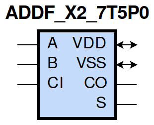
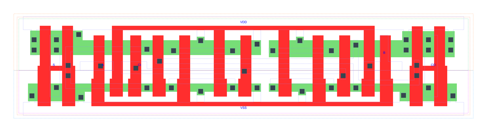

=======================================
gf180mcu_fd_sc_mcu7t5v0__addf_x2
=======================================

**gf180mcu_fd_sc_mcu7t5v0__addf_x2 symbol**

**gf180mcu_fd_sc_mcu7t5v0__addf_x2 schematic**

**gf180mcu_fd_sc_mcu7t5v0__addf_x2 layout**

.. include:: images.rst

ADDF_X2 is a Full Adder, 2X drive strength

|
| Attributes

============= ======================
**Attribute** **Value**
area          79.027200 µm\ :sup:`2`
============= ======================

|
| OUTPUT FUNCTIONS

============== =====================
**Output Pin** **Function**
S              (A^B^CI)
CO             ((A&B)|(A&CI)|(B&CI))
============== =====================

|
| TRUTH TABLE FOR S

===== ===== ====== =====
**A** **B** **CI** **S**
1     1     1      1
1     0     0      1
0     1     0      1
0     0     1      1
1     1     0      0
1     0     1      0
0     1     1      0
0     0     0      0
===== ===== ====== =====

|
| TRUTH TABLE FOR CO

===== ===== ====== ======
**A** **B** **CI** **CO**
1     1     ?      1
1     ?     1      1
?     1     1      1
0     0     ?      0
0     ?     0      0
?     0     0      0
===== ===== ====== ======

|
| FUNCTIONAL SCHEMATIC
| |image11|
| PIN CAPACITANCE (pf)

======= ======== ====================
**Pin** **Type** **Capacitance (pf)**
A       input    0.0119
CI      input    0.0096
B       input    0.0117
======= ======== ====================

|
| DELAY AND OUTPUT TRANSITION TIME corresponding to min slew and load

+---------------+------------+--------------------+--------------+-------------------+----------------+---------------+
| **Input Pin** | **Output** | **When Condition** | **Tin (ns)** | **Out Load (pf)** | **Delay (ns)** | **Tout (ns)** |
+---------------+------------+--------------------+--------------+-------------------+----------------+---------------+
| A(HL)         | S(LH)      | !B&CI              | 0.0100       | 0.0010            | 0.9474         | 0.0574        |
+---------------+------------+--------------------+--------------+-------------------+----------------+---------------+
| A(HL)         | S(LH)      | B&!CI              | 0.0100       | 0.0010            | 0.9503         | 0.0557        |
+---------------+------------+--------------------+--------------+-------------------+----------------+---------------+
| A(HL)         | S(HL)      | !B&!CI             | 0.0100       | 0.0010            | 0.6599         | 0.0955        |
+---------------+------------+--------------------+--------------+-------------------+----------------+---------------+
| A(HL)         | S(HL)      | B&CI               | 0.0100       | 0.0010            | 0.4670         | 0.0701        |
+---------------+------------+--------------------+--------------+-------------------+----------------+---------------+
| A(LH)         | CO(LH)     | !B&CI              | 0.0100       | 0.0010            | 0.4604         | 0.0587        |
+---------------+------------+--------------------+--------------+-------------------+----------------+---------------+
| A(LH)         | CO(LH)     | B&!CI              | 0.0100       | 0.0010            | 0.4767         | 0.0602        |
+---------------+------------+--------------------+--------------+-------------------+----------------+---------------+
| A(LH)         | S(LH)      | !B&!CI             | 0.0100       | 0.0010            | 0.3891         | 0.0530        |
+---------------+------------+--------------------+--------------+-------------------+----------------+---------------+
| A(LH)         | S(LH)      | B&CI               | 0.0100       | 0.0010            | 0.5072         | 0.0652        |
+---------------+------------+--------------------+--------------+-------------------+----------------+---------------+
| A(HL)         | CO(HL)     | !B&CI              | 0.0100       | 0.0010            | 0.5130         | 0.0779        |
+---------------+------------+--------------------+--------------+-------------------+----------------+---------------+
| A(HL)         | CO(HL)     | B&!CI              | 0.0100       | 0.0010            | 0.5010         | 0.0736        |
+---------------+------------+--------------------+--------------+-------------------+----------------+---------------+
| A(LH)         | S(HL)      | !B&CI              | 0.0100       | 0.0010            | 0.8370         | 0.0692        |
+---------------+------------+--------------------+--------------+-------------------+----------------+---------------+
| A(LH)         | S(HL)      | B&!CI              | 0.0100       | 0.0010            | 0.8336         | 0.0709        |
+---------------+------------+--------------------+--------------+-------------------+----------------+---------------+
| CI(HL)        | S(LH)      | !A&B               | 0.0100       | 0.0010            | 0.8908         | 0.0561        |
+---------------+------------+--------------------+--------------+-------------------+----------------+---------------+
| CI(HL)        | S(LH)      | A&!B               | 0.0100       | 0.0010            | 0.9172         | 0.0577        |
+---------------+------------+--------------------+--------------+-------------------+----------------+---------------+
| CI(HL)        | CO(HL)     | !A&B               | 0.0100       | 0.0010            | 0.4469         | 0.0735        |
+---------------+------------+--------------------+--------------+-------------------+----------------+---------------+
| CI(HL)        | CO(HL)     | A&!B               | 0.0100       | 0.0010            | 0.4309         | 0.0762        |
+---------------+------------+--------------------+--------------+-------------------+----------------+---------------+
| CI(LH)        | S(HL)      | !A&B               | 0.0100       | 0.0010            | 0.8101         | 0.0726        |
+---------------+------------+--------------------+--------------+-------------------+----------------+---------------+
| CI(LH)        | S(HL)      | A&!B               | 0.0100       | 0.0010            | 0.8031         | 0.0690        |
+---------------+------------+--------------------+--------------+-------------------+----------------+---------------+
| CI(LH)        | S(LH)      | !A&!B              | 0.0100       | 0.0010            | 0.3553         | 0.0519        |
+---------------+------------+--------------------+--------------+-------------------+----------------+---------------+
| CI(LH)        | S(LH)      | A&B                | 0.0100       | 0.0010            | 0.5031         | 0.0656        |
+---------------+------------+--------------------+--------------+-------------------+----------------+---------------+
| CI(HL)        | S(HL)      | !A&!B              | 0.0100       | 0.0010            | 0.6249         | 0.0958        |
+---------------+------------+--------------------+--------------+-------------------+----------------+---------------+
| CI(HL)        | S(HL)      | A&B                | 0.0100       | 0.0010            | 0.4263         | 0.0684        |
+---------------+------------+--------------------+--------------+-------------------+----------------+---------------+
| CI(LH)        | CO(LH)     | !A&B               | 0.0100       | 0.0010            | 0.4047         | 0.0585        |
+---------------+------------+--------------------+--------------+-------------------+----------------+---------------+
| CI(LH)        | CO(LH)     | A&!B               | 0.0100       | 0.0010            | 0.4275         | 0.0584        |
+---------------+------------+--------------------+--------------+-------------------+----------------+---------------+
| B(LH)         | S(LH)      | !A&!CI             | 0.0100       | 0.0010            | 0.3669         | 0.0511        |
+---------------+------------+--------------------+--------------+-------------------+----------------+---------------+
| B(LH)         | S(LH)      | A&CI               | 0.0100       | 0.0010            | 0.5029         | 0.0661        |
+---------------+------------+--------------------+--------------+-------------------+----------------+---------------+
| B(LH)         | CO(LH)     | !A&CI              | 0.0100       | 0.0010            | 0.4335         | 0.0586        |
+---------------+------------+--------------------+--------------+-------------------+----------------+---------------+
| B(LH)         | CO(LH)     | A&!CI              | 0.0100       | 0.0010            | 0.4827         | 0.0602        |
+---------------+------------+--------------------+--------------+-------------------+----------------+---------------+
| B(HL)         | S(HL)      | !A&!CI             | 0.0100       | 0.0010            | 0.6523         | 0.0956        |
+---------------+------------+--------------------+--------------+-------------------+----------------+---------------+
| B(HL)         | S(HL)      | A&CI               | 0.0100       | 0.0010            | 0.4477         | 0.0668        |
+---------------+------------+--------------------+--------------+-------------------+----------------+---------------+
| B(HL)         | S(LH)      | !A&CI              | 0.0100       | 0.0010            | 0.9465         | 0.0574        |
+---------------+------------+--------------------+--------------+-------------------+----------------+---------------+
| B(HL)         | S(LH)      | A&!CI              | 0.0100       | 0.0010            | 0.9624         | 0.0577        |
+---------------+------------+--------------------+--------------+-------------------+----------------+---------------+
| B(HL)         | CO(HL)     | !A&CI              | 0.0100       | 0.0010            | 0.5118         | 0.0777        |
+---------------+------------+--------------------+--------------+-------------------+----------------+---------------+
| B(HL)         | CO(HL)     | A&!CI              | 0.0100       | 0.0010            | 0.4769         | 0.0750        |
+---------------+------------+--------------------+--------------+-------------------+----------------+---------------+
| B(LH)         | S(HL)      | !A&CI              | 0.0100       | 0.0010            | 0.8383         | 0.0725        |
+---------------+------------+--------------------+--------------+-------------------+----------------+---------------+
| B(LH)         | S(HL)      | A&!CI              | 0.0100       | 0.0010            | 0.8402         | 0.0709        |
+---------------+------------+--------------------+--------------+-------------------+----------------+---------------+

|
| DYNAMIC ENERGY

+---------------+--------------------+--------------+------------+-------------------+---------------------+
| **Input Pin** | **When Condition** | **Tin (ns)** | **Output** | **Out Load (pf)** | **Energy (uW/MHz)** |
+---------------+--------------------+--------------+------------+-------------------+---------------------+
| B             | !A&!CI             | 0.0100       | S(LH)      | 0.0010            | 0.2272              |
+---------------+--------------------+--------------+------------+-------------------+---------------------+
| B             | A&CI               | 0.0100       | S(LH)      | 0.0010            | 0.3328              |
+---------------+--------------------+--------------+------------+-------------------+---------------------+
| B             | !A&CI              | 0.0100       | S(LH)      | 0.0010            | 0.5442              |
+---------------+--------------------+--------------+------------+-------------------+---------------------+
| B             | A&!CI              | 0.0100       | S(LH)      | 0.0010            | 0.5387              |
+---------------+--------------------+--------------+------------+-------------------+---------------------+
| A             | !B&CI              | 0.0100       | S(LH)      | 0.0010            | 0.5469              |
+---------------+--------------------+--------------+------------+-------------------+---------------------+
| A             | B&!CI              | 0.0100       | S(LH)      | 0.0010            | 0.5303              |
+---------------+--------------------+--------------+------------+-------------------+---------------------+
| A             | !B&!CI             | 0.0100       | S(LH)      | 0.0010            | 0.2451              |
+---------------+--------------------+--------------+------------+-------------------+---------------------+
| A             | B&CI               | 0.0100       | S(LH)      | 0.0010            | 0.3138              |
+---------------+--------------------+--------------+------------+-------------------+---------------------+
| B             | !A&CI              | 0.0100       | CO(LH)     | 0.0010            | 0.3896              |
+---------------+--------------------+--------------+------------+-------------------+---------------------+
| B             | A&!CI              | 0.0100       | CO(LH)     | 0.0010            | 0.4171              |
+---------------+--------------------+--------------+------------+-------------------+---------------------+
| CI            | !A&B               | 0.0100       | S(LH)      | 0.0010            | 0.5008              |
+---------------+--------------------+--------------+------------+-------------------+---------------------+
| CI            | A&!B               | 0.0100       | S(LH)      | 0.0010            | 0.5184              |
+---------------+--------------------+--------------+------------+-------------------+---------------------+
| CI            | !A&!B              | 0.0100       | S(LH)      | 0.0010            | 0.2748              |
+---------------+--------------------+--------------+------------+-------------------+---------------------+
| CI            | A&B                | 0.0100       | S(LH)      | 0.0010            | 0.3642              |
+---------------+--------------------+--------------+------------+-------------------+---------------------+
| CI            | !A&B               | 0.0100       | CO(HL)     | 0.0010            | 0.5396              |
+---------------+--------------------+--------------+------------+-------------------+---------------------+
| CI            | A&!B               | 0.0100       | CO(HL)     | 0.0010            | 0.5527              |
+---------------+--------------------+--------------+------------+-------------------+---------------------+
| B             | !A&!CI             | 0.0100       | S(HL)      | 0.0010            | 0.7529              |
+---------------+--------------------+--------------+------------+-------------------+---------------------+
| B             | A&CI               | 0.0100       | S(HL)      | 0.0010            | 0.5672              |
+---------------+--------------------+--------------+------------+-------------------+---------------------+
| B             | !A&CI              | 0.0100       | S(HL)      | 0.0010            | 0.4193              |
+---------------+--------------------+--------------+------------+-------------------+---------------------+
| B             | A&!CI              | 0.0100       | S(HL)      | 0.0010            | 0.4378              |
+---------------+--------------------+--------------+------------+-------------------+---------------------+
| CI            | !A&B               | 0.0100       | S(HL)      | 0.0010            | 0.4384              |
+---------------+--------------------+--------------+------------+-------------------+---------------------+
| CI            | A&!B               | 0.0100       | S(HL)      | 0.0010            | 0.4254              |
+---------------+--------------------+--------------+------------+-------------------+---------------------+
| CI            | !A&!B              | 0.0100       | S(HL)      | 0.0010            | 0.7177              |
+---------------+--------------------+--------------+------------+-------------------+---------------------+
| CI            | A&B                | 0.0100       | S(HL)      | 0.0010            | 0.5577              |
+---------------+--------------------+--------------+------------+-------------------+---------------------+
| A             | !B&!CI             | 0.0100       | S(HL)      | 0.0010            | 0.7635              |
+---------------+--------------------+--------------+------------+-------------------+---------------------+
| A             | B&CI               | 0.0100       | S(HL)      | 0.0010            | 0.6199              |
+---------------+--------------------+--------------+------------+-------------------+---------------------+
| A             | !B&CI              | 0.0100       | S(HL)      | 0.0010            | 0.4059              |
+---------------+--------------------+--------------+------------+-------------------+---------------------+
| A             | B&!CI              | 0.0100       | S(HL)      | 0.0010            | 0.4241              |
+---------------+--------------------+--------------+------------+-------------------+---------------------+
| A             | !B&CI              | 0.0100       | CO(LH)     | 0.0010            | 0.3816              |
+---------------+--------------------+--------------+------------+-------------------+---------------------+
| A             | B&!CI              | 0.0100       | CO(LH)     | 0.0010            | 0.4035              |
+---------------+--------------------+--------------+------------+-------------------+---------------------+
| B             | !A&CI              | 0.0100       | CO(HL)     | 0.0010            | 0.5863              |
+---------------+--------------------+--------------+------------+-------------------+---------------------+
| B             | A&!CI              | 0.0100       | CO(HL)     | 0.0010            | 0.5728              |
+---------------+--------------------+--------------+------------+-------------------+---------------------+
| CI            | !A&B               | 0.0100       | CO(LH)     | 0.0010            | 0.4089              |
+---------------+--------------------+--------------+------------+-------------------+---------------------+
| CI            | A&!B               | 0.0100       | CO(LH)     | 0.0010            | 0.4018              |
+---------------+--------------------+--------------+------------+-------------------+---------------------+
| A             | !B&CI              | 0.0100       | CO(HL)     | 0.0010            | 0.5901              |
+---------------+--------------------+--------------+------------+-------------------+---------------------+
| A             | B&!CI              | 0.0100       | CO(HL)     | 0.0010            | 0.5696              |
+---------------+--------------------+--------------+------------+-------------------+---------------------+

|
| LEAKAGE POWER

================== ==============
**When Condition** **Power (nW)**
!A&!B&!CI          0.3436
!A&!B&CI           0.3210
!A&B&!CI           0.3360
A&!B&!CI           0.3313
!A&B&CI            0.3399
A&!B&CI            0.3360
A&B&!CI            0.3145
A&B&CI             0.3300
================== ==============

