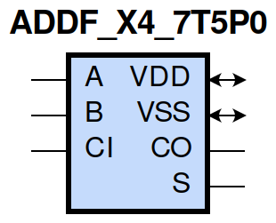
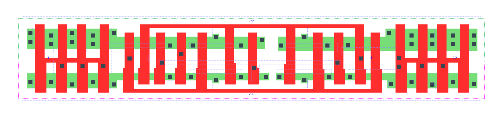

=======================================
gf180mcu_fd_sc_mcu7t5v0__addf_x4
=======================================

**gf180mcu_fd_sc_mcu7t5v0__addf_x4 symbol**

**gf180mcu_fd_sc_mcu7t5v0__addf_x4 schematic**

.. image:: sc7_sch/ADDF_X4_sch.png
    :height: 300px
    :width: 500 px
    :align: center
    :alt: gf180mcu_fd_sc_mcu7t5v0__addf_x4 schematic

**gf180mcu_fd_sc_mcu7t5v0__addf_x4 layout**

.. include:: images.rst

ADDF_X4 is a Full Adder, 4X drive strength

|
| Attributes

============= ======================
**Attribute** **Value**
area          96.588800 µm\ :sup:`2`
============= ======================

|
| OUTPUT FUNCTIONS

============== =====================
**Output Pin** **Function**
S              (A^B^CI)
CO             ((A&B)|(A&CI)|(B&CI))
============== =====================

|
| TRUTH TABLE FOR S

===== ===== ====== =====
**A** **B** **CI** **S**
1     1     1      1
1     0     0      1
0     1     0      1
0     0     1      1
1     1     0      0
1     0     1      0
0     1     1      0
0     0     0      0
===== ===== ====== =====

|
| TRUTH TABLE FOR CO

===== ===== ====== ======
**A** **B** **CI** **CO**
1     1     ?      1
1     ?     1      1
?     1     1      1
0     0     ?      0
0     ?     0      0
?     0     0      0
===== ===== ====== ======

|
| FUNCTIONAL SCHEMATIC
| |image14|
| PIN CAPACITANCE (pf)

======= ======== ====================
**Pin** **Type** **Capacitance (pf)**
A       input    0.0119
CI      input    0.0094
B       input    0.0116
======= ======== ====================

|
| DELAY AND OUTPUT TRANSITION TIME corresponding to min slew and load

+---------------+------------+--------------------+--------------+-------------------+----------------+---------------+
| **Input Pin** | **Output** | **When Condition** | **Tin (ns)** | **Out Load (pf)** | **Delay (ns)** | **Tout (ns)** |
+---------------+------------+--------------------+--------------+-------------------+----------------+---------------+
| A(HL)         | S(LH)      | !B&CI              | 0.0100       | 0.0010            | 1.4319         | 0.0788        |
+---------------+------------+--------------------+--------------+-------------------+----------------+---------------+
| A(HL)         | S(LH)      | B&!CI              | 0.0100       | 0.0010            | 1.4313         | 0.0770        |
+---------------+------------+--------------------+--------------+-------------------+----------------+---------------+
| A(HL)         | S(HL)      | !B&!CI             | 0.0100       | 0.0010            | 0.9658         | 0.1422        |
+---------------+------------+--------------------+--------------+-------------------+----------------+---------------+
| A(HL)         | S(HL)      | B&CI               | 0.0100       | 0.0010            | 0.6788         | 0.1036        |
+---------------+------------+--------------------+--------------+-------------------+----------------+---------------+
| A(LH)         | CO(LH)     | !B&CI              | 0.0100       | 0.0010            | 0.6298         | 0.0781        |
+---------------+------------+--------------------+--------------+-------------------+----------------+---------------+
| A(LH)         | CO(LH)     | B&!CI              | 0.0100       | 0.0010            | 0.6455         | 0.0794        |
+---------------+------------+--------------------+--------------+-------------------+----------------+---------------+
| A(LH)         | S(LH)      | !B&!CI             | 0.0100       | 0.0010            | 0.5535         | 0.0714        |
+---------------+------------+--------------------+--------------+-------------------+----------------+---------------+
| A(LH)         | S(LH)      | B&CI               | 0.0100       | 0.0010            | 0.7250         | 0.0906        |
+---------------+------------+--------------------+--------------+-------------------+----------------+---------------+
| A(HL)         | CO(HL)     | !B&CI              | 0.0100       | 0.0010            | 0.7088         | 0.1064        |
+---------------+------------+--------------------+--------------+-------------------+----------------+---------------+
| A(HL)         | CO(HL)     | B&!CI              | 0.0100       | 0.0010            | 0.6951         | 0.1026        |
+---------------+------------+--------------------+--------------+-------------------+----------------+---------------+
| A(LH)         | S(HL)      | !B&CI              | 0.0100       | 0.0010            | 1.2785         | 0.1050        |
+---------------+------------+--------------------+--------------+-------------------+----------------+---------------+
| A(LH)         | S(HL)      | B&!CI              | 0.0100       | 0.0010            | 1.2742         | 0.1067        |
+---------------+------------+--------------------+--------------+-------------------+----------------+---------------+
| CI(HL)        | S(LH)      | !A&B               | 0.0100       | 0.0010            | 1.3739         | 0.0774        |
+---------------+------------+--------------------+--------------+-------------------+----------------+---------------+
| CI(HL)        | S(LH)      | A&!B               | 0.0100       | 0.0010            | 1.4029         | 0.0788        |
+---------------+------------+--------------------+--------------+-------------------+----------------+---------------+
| CI(HL)        | CO(HL)     | !A&B               | 0.0100       | 0.0010            | 0.6427         | 0.1026        |
+---------------+------------+--------------------+--------------+-------------------+----------------+---------------+
| CI(HL)        | CO(HL)     | A&!B               | 0.0100       | 0.0010            | 0.6275         | 0.1056        |
+---------------+------------+--------------------+--------------+-------------------+----------------+---------------+
| CI(LH)        | S(HL)      | !A&B               | 0.0100       | 0.0010            | 1.2504         | 0.1078        |
+---------------+------------+--------------------+--------------+-------------------+----------------+---------------+
| CI(LH)        | S(HL)      | A&!B               | 0.0100       | 0.0010            | 1.2452         | 0.1049        |
+---------------+------------+--------------------+--------------+-------------------+----------------+---------------+
| CI(LH)        | S(LH)      | !A&!B              | 0.0100       | 0.0010            | 0.5192         | 0.0703        |
+---------------+------------+--------------------+--------------+-------------------+----------------+---------------+
| CI(LH)        | S(LH)      | A&B                | 0.0100       | 0.0010            | 0.7209         | 0.0905        |
+---------------+------------+--------------------+--------------+-------------------+----------------+---------------+
| CI(HL)        | S(HL)      | !A&!B              | 0.0100       | 0.0010            | 0.9332         | 0.1423        |
+---------------+------------+--------------------+--------------+-------------------+----------------+---------------+
| CI(HL)        | S(HL)      | A&B                | 0.0100       | 0.0010            | 0.6384         | 0.1023        |
+---------------+------------+--------------------+--------------+-------------------+----------------+---------------+
| CI(LH)        | CO(LH)     | !A&B               | 0.0100       | 0.0010            | 0.5722         | 0.0771        |
+---------------+------------+--------------------+--------------+-------------------+----------------+---------------+
| CI(LH)        | CO(LH)     | A&!B               | 0.0100       | 0.0010            | 0.5974         | 0.0776        |
+---------------+------------+--------------------+--------------+-------------------+----------------+---------------+
| B(LH)         | S(LH)      | !A&!CI             | 0.0100       | 0.0010            | 0.5294         | 0.0699        |
+---------------+------------+--------------------+--------------+-------------------+----------------+---------------+
| B(LH)         | S(LH)      | A&CI               | 0.0100       | 0.0010            | 0.7213         | 0.0906        |
+---------------+------------+--------------------+--------------+-------------------+----------------+---------------+
| B(LH)         | CO(LH)     | !A&CI              | 0.0100       | 0.0010            | 0.6004         | 0.0771        |
+---------------+------------+--------------------+--------------+-------------------+----------------+---------------+
| B(LH)         | CO(LH)     | A&!CI              | 0.0100       | 0.0010            | 0.6514         | 0.0790        |
+---------------+------------+--------------------+--------------+-------------------+----------------+---------------+
| B(HL)         | S(HL)      | !A&!CI             | 0.0100       | 0.0010            | 0.9591         | 0.1424        |
+---------------+------------+--------------------+--------------+-------------------+----------------+---------------+
| B(HL)         | S(HL)      | A&CI               | 0.0100       | 0.0010            | 0.6597         | 0.1009        |
+---------------+------------+--------------------+--------------+-------------------+----------------+---------------+
| B(HL)         | S(LH)      | !A&CI              | 0.0100       | 0.0010            | 1.4298         | 0.0786        |
+---------------+------------+--------------------+--------------+-------------------+----------------+---------------+
| B(HL)         | S(LH)      | A&!CI              | 0.0100       | 0.0010            | 1.4433         | 0.0795        |
+---------------+------------+--------------------+--------------+-------------------+----------------+---------------+
| B(HL)         | CO(HL)     | !A&CI              | 0.0100       | 0.0010            | 0.7060         | 0.1061        |
+---------------+------------+--------------------+--------------+-------------------+----------------+---------------+
| B(HL)         | CO(HL)     | A&!CI              | 0.0100       | 0.0010            | 0.6688         | 0.1045        |
+---------------+------------+--------------------+--------------+-------------------+----------------+---------------+
| B(LH)         | S(HL)      | !A&CI              | 0.0100       | 0.0010            | 1.2779         | 0.1077        |
+---------------+------------+--------------------+--------------+-------------------+----------------+---------------+
| B(LH)         | S(HL)      | A&!CI              | 0.0100       | 0.0010            | 1.2809         | 0.1072        |
+---------------+------------+--------------------+--------------+-------------------+----------------+---------------+

|
| DYNAMIC ENERGY

+---------------+--------------------+--------------+------------+-------------------+---------------------+
| **Input Pin** | **When Condition** | **Tin (ns)** | **Output** | **Out Load (pf)** | **Energy (uW/MHz)** |
+---------------+--------------------+--------------+------------+-------------------+---------------------+
| B             | !A&!CI             | 0.0100       | S(LH)      | 0.0010            | 0.6916              |
+---------------+--------------------+--------------+------------+-------------------+---------------------+
| B             | A&CI               | 0.0100       | S(LH)      | 0.0010            | 0.9542              |
+---------------+--------------------+--------------+------------+-------------------+---------------------+
| B             | !A&CI              | 0.0100       | S(LH)      | 0.0010            | 1.2532              |
+---------------+--------------------+--------------+------------+-------------------+---------------------+
| B             | A&!CI              | 0.0100       | S(LH)      | 0.0010            | 1.2412              |
+---------------+--------------------+--------------+------------+-------------------+---------------------+
| A             | !B&CI              | 0.0100       | S(LH)      | 0.0010            | 1.2566              |
+---------------+--------------------+--------------+------------+-------------------+---------------------+
| A             | B&!CI              | 0.0100       | S(LH)      | 0.0010            | 1.2226              |
+---------------+--------------------+--------------+------------+-------------------+---------------------+
| A             | !B&!CI             | 0.0100       | S(LH)      | 0.0010            | 0.7207              |
+---------------+--------------------+--------------+------------+-------------------+---------------------+
| A             | B&CI               | 0.0100       | S(LH)      | 0.0010            | 0.9348              |
+---------------+--------------------+--------------+------------+-------------------+---------------------+
| B             | !A&CI              | 0.0100       | CO(LH)     | 0.0010            | 1.0651              |
+---------------+--------------------+--------------+------------+-------------------+---------------------+
| B             | A&!CI              | 0.0100       | CO(LH)     | 0.0010            | 1.0931              |
+---------------+--------------------+--------------+------------+-------------------+---------------------+
| CI            | !A&B               | 0.0100       | S(LH)      | 0.0010            | 1.1945              |
+---------------+--------------------+--------------+------------+-------------------+---------------------+
| CI            | A&!B               | 0.0100       | S(LH)      | 0.0010            | 1.2229              |
+---------------+--------------------+--------------+------------+-------------------+---------------------+
| CI            | !A&!B              | 0.0100       | S(LH)      | 0.0010            | 0.7433              |
+---------------+--------------------+--------------+------------+-------------------+---------------------+
| CI            | A&B                | 0.0100       | S(LH)      | 0.0010            | 0.9852              |
+---------------+--------------------+--------------+------------+-------------------+---------------------+
| CI            | !A&B               | 0.0100       | CO(HL)     | 0.0010            | 1.2109              |
+---------------+--------------------+--------------+------------+-------------------+---------------------+
| CI            | A&!B               | 0.0100       | CO(HL)     | 0.0010            | 1.2370              |
+---------------+--------------------+--------------+------------+-------------------+---------------------+
| B             | !A&!CI             | 0.0100       | S(HL)      | 0.0010            | 1.8205              |
+---------------+--------------------+--------------+------------+-------------------+---------------------+
| B             | A&CI               | 0.0100       | S(HL)      | 0.0010            | 1.3090              |
+---------------+--------------------+--------------+------------+-------------------+---------------------+
| B             | !A&CI              | 0.0100       | S(HL)      | 0.0010            | 1.1050              |
+---------------+--------------------+--------------+------------+-------------------+---------------------+
| B             | A&!CI              | 0.0100       | S(HL)      | 0.0010            | 1.1277              |
+---------------+--------------------+--------------+------------+-------------------+---------------------+
| CI            | !A&B               | 0.0100       | S(HL)      | 0.0010            | 1.1237              |
+---------------+--------------------+--------------+------------+-------------------+---------------------+
| CI            | A&!B               | 0.0100       | S(HL)      | 0.0010            | 1.1051              |
+---------------+--------------------+--------------+------------+-------------------+---------------------+
| CI            | !A&!B              | 0.0100       | S(HL)      | 0.0010            | 1.7860              |
+---------------+--------------------+--------------+------------+-------------------+---------------------+
| CI            | A&B                | 0.0100       | S(HL)      | 0.0010            | 1.3041              |
+---------------+--------------------+--------------+------------+-------------------+---------------------+
| A             | !B&!CI             | 0.0100       | S(HL)      | 0.0010            | 1.8296              |
+---------------+--------------------+--------------+------------+-------------------+---------------------+
| A             | B&CI               | 0.0100       | S(HL)      | 0.0010            | 1.3766              |
+---------------+--------------------+--------------+------------+-------------------+---------------------+
| A             | !B&CI              | 0.0100       | S(HL)      | 0.0010            | 1.0862              |
+---------------+--------------------+--------------+------------+-------------------+---------------------+
| A             | B&!CI              | 0.0100       | S(HL)      | 0.0010            | 1.1123              |
+---------------+--------------------+--------------+------------+-------------------+---------------------+
| A             | !B&CI              | 0.0100       | CO(LH)     | 0.0010            | 1.0503              |
+---------------+--------------------+--------------+------------+-------------------+---------------------+
| A             | B&!CI              | 0.0100       | CO(LH)     | 0.0010            | 1.0795              |
+---------------+--------------------+--------------+------------+-------------------+---------------------+
| B             | !A&CI              | 0.0100       | CO(HL)     | 0.0010            | 1.2681              |
+---------------+--------------------+--------------+------------+-------------------+---------------------+
| B             | A&!CI              | 0.0100       | CO(HL)     | 0.0010            | 1.2555              |
+---------------+--------------------+--------------+------------+-------------------+---------------------+
| CI            | !A&B               | 0.0100       | CO(LH)     | 0.0010            | 1.0841              |
+---------------+--------------------+--------------+------------+-------------------+---------------------+
| CI            | A&!B               | 0.0100       | CO(LH)     | 0.0010            | 1.0707              |
+---------------+--------------------+--------------+------------+-------------------+---------------------+
| A             | !B&CI              | 0.0100       | CO(HL)     | 0.0010            | 1.2724              |
+---------------+--------------------+--------------+------------+-------------------+---------------------+
| A             | B&!CI              | 0.0100       | CO(HL)     | 0.0010            | 1.2399              |
+---------------+--------------------+--------------+------------+-------------------+---------------------+

|
| LEAKAGE POWER

================== ==============
**When Condition** **Power (nW)**
!A&!B&!CI          0.4490
!A&!B&CI           0.4249
!A&B&!CI           0.4399
A&!B&!CI           0.4352
!A&B&CI            0.4436
A&!B&CI            0.4397
A&B&!CI            0.4182
A&B&CI             0.4318
================== ==============

