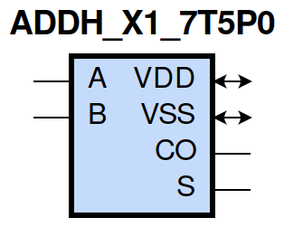
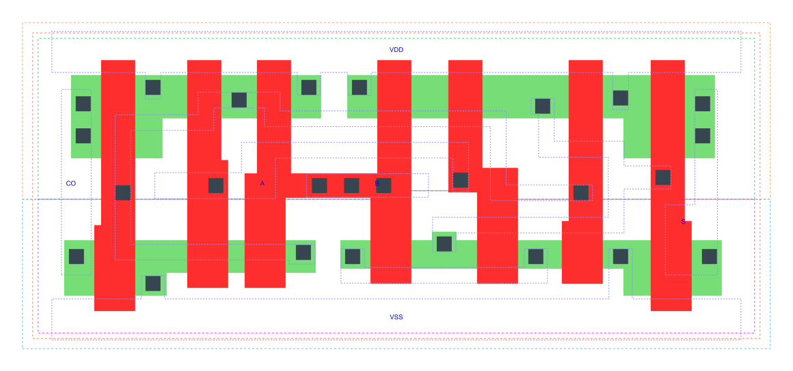

=======================================
gf180mcu_fd_sc_mcu7t5v0__addh_x1
=======================================

**gf180mcu_fd_sc_mcu7t5v0__addh_x1 symbol**

**gf180mcu_fd_sc_mcu7t5v0__addh_x1 schematic**

.. image:: sc7_sch/ADDH_X1_sch.png
    :height: 300px
    :width: 500 px
    :align: center
    :alt: gf180mcu_fd_sc_mcu7t5v0__addh_x1 schematic

**gf180mcu_fd_sc_mcu7t5v0__addh_x1 layout**

.. include:: images.rst

ADDH_X1 is a Half Adder, 1X drive strength

|
| Attributes

============= ======================
**Attribute** **Value**
area          39.513600 µm\ :sup:`2`
============= ======================

|
| OUTPUT FUNCTIONS

============== ============
**Output Pin** **Function**
CO             (A&B)
S              (A^B)
============== ============

|
| TRUTH TABLE FOR CO

===== ===== ======
**A** **B** **CO**
1     1     1
0     ?     0
?     0     0
===== ===== ======

|
| TRUTH TABLE FOR S

===== ===== =====
**A** **B** **S**
1     0     1
0     1     1
1     1     0
0     0     0
===== ===== =====

|
| FUNCTIONAL SCHEMATIC
| |image17|
| PIN CAPACITANCE (pf)

======= ======== ====================
**Pin** **Type** **Capacitance (pf)**
A       input    0.0064
B       input    0.0053
======= ======== ====================

|
| DELAY AND OUTPUT TRANSITION TIME corresponding to min slew and load

+---------------+------------+--------------------+--------------+-------------------+----------------+---------------+
| **Input Pin** | **Output** | **When Condition** | **Tin (ns)** | **Out Load (pf)** | **Delay (ns)** | **Tout (ns)** |
+---------------+------------+--------------------+--------------+-------------------+----------------+---------------+
| A(HL)         | S(LH)      | B                  | 0.0100       | 0.0010            | 0.5362         | 0.0523        |
+---------------+------------+--------------------+--------------+-------------------+----------------+---------------+
| A(HL)         | S(HL)      | !B                 | 0.0100       | 0.0010            | 0.3191         | 0.0608        |
+---------------+------------+--------------------+--------------+-------------------+----------------+---------------+
| A(LH)         | CO(LH)     | B                  | 0.0100       | 0.0010            | 0.2764         | 0.0522        |
+---------------+------------+--------------------+--------------+-------------------+----------------+---------------+
| A(LH)         | S(LH)      | !B                 | 0.0100       | 0.0010            | 0.2302         | 0.0497        |
+---------------+------------+--------------------+--------------+-------------------+----------------+---------------+
| A(HL)         | CO(HL)     | B                  | 0.0100       | 0.0010            | 0.2705         | 0.0525        |
+---------------+------------+--------------------+--------------+-------------------+----------------+---------------+
| A(LH)         | S(HL)      | B                  | 0.0100       | 0.0010            | 0.4980         | 0.0518        |
+---------------+------------+--------------------+--------------+-------------------+----------------+---------------+
| B(LH)         | S(LH)      | !A                 | 0.0100       | 0.0010            | 0.2593         | 0.0515        |
+---------------+------------+--------------------+--------------+-------------------+----------------+---------------+
| B(LH)         | CO(LH)     | A                  | 0.0100       | 0.0010            | 0.2657         | 0.0522        |
+---------------+------------+--------------------+--------------+-------------------+----------------+---------------+
| B(HL)         | S(HL)      | !A                 | 0.0100       | 0.0010            | 0.3458         | 0.0607        |
+---------------+------------+--------------------+--------------+-------------------+----------------+---------------+
| B(HL)         | S(LH)      | A                  | 0.0100       | 0.0010            | 0.4896         | 0.0509        |
+---------------+------------+--------------------+--------------+-------------------+----------------+---------------+
| B(HL)         | CO(HL)     | A                  | 0.0100       | 0.0010            | 0.2536         | 0.0495        |
+---------------+------------+--------------------+--------------+-------------------+----------------+---------------+
| B(LH)         | S(HL)      | A                  | 0.0100       | 0.0010            | 0.4860         | 0.0517        |
+---------------+------------+--------------------+--------------+-------------------+----------------+---------------+

|
| DYNAMIC ENERGY

+---------------+--------------------+--------------+------------+-------------------+---------------------+
| **Input Pin** | **When Condition** | **Tin (ns)** | **Output** | **Out Load (pf)** | **Energy (uW/MHz)** |
+---------------+--------------------+--------------+------------+-------------------+---------------------+
| B             | !A                 | 0.0100       | S(LH)      | 0.0010            | 0.1411              |
+---------------+--------------------+--------------+------------+-------------------+---------------------+
| B             | A                  | 0.0100       | S(LH)      | 0.0010            | 0.2340              |
+---------------+--------------------+--------------+------------+-------------------+---------------------+
| A             | B                  | 0.0100       | S(LH)      | 0.0010            | 0.2552              |
+---------------+--------------------+--------------+------------+-------------------+---------------------+
| A             | !B                 | 0.0100       | S(LH)      | 0.0010            | 0.1177              |
+---------------+--------------------+--------------+------------+-------------------+---------------------+
| B             | A                  | 0.0100       | CO(LH)     | 0.0010            | 0.2000              |
+---------------+--------------------+--------------+------------+-------------------+---------------------+
| B             | !A                 | 0.0100       | S(HL)      | 0.0010            | 0.2809              |
+---------------+--------------------+--------------+------------+-------------------+---------------------+
| B             | A                  | 0.0100       | S(HL)      | 0.0010            | 0.2077              |
+---------------+--------------------+--------------+------------+-------------------+---------------------+
| A             | !B                 | 0.0100       | S(HL)      | 0.0010            | 0.2650              |
+---------------+--------------------+--------------+------------+-------------------+---------------------+
| A             | B                  | 0.0100       | S(HL)      | 0.0010            | 0.2143              |
+---------------+--------------------+--------------+------------+-------------------+---------------------+
| A             | B                  | 0.0100       | CO(LH)     | 0.0010            | 0.2064              |
+---------------+--------------------+--------------+------------+-------------------+---------------------+
| B             | A                  | 0.0100       | CO(HL)     | 0.0010            | 0.2415              |
+---------------+--------------------+--------------+------------+-------------------+---------------------+
| A             | B                  | 0.0100       | CO(HL)     | 0.0010            | 0.2624              |
+---------------+--------------------+--------------+------------+-------------------+---------------------+

|
| LEAKAGE POWER

================== ==============
**When Condition** **Power (nW)**
!A&!B              0.1804
!A&B               0.2561
A&!B               0.1799
A&B                0.2660
================== ==============

