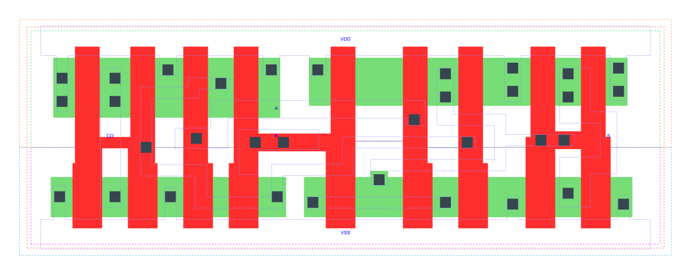

=======================================
gf180mcu_fd_sc_mcu7t5v0__addh_x2
=======================================

**gf180mcu_fd_sc_mcu7t5v0__addh_x2 symbol**

.. image:: sc7_sym/ADDH_X2_sym.png
    :height: 250px
    :width: 400 px
    :align: center
    :alt: gf180mcu_fd_sc_mcu7t5v0__addh_x2 symbol

**gf180mcu_fd_sc_mcu7t5v0__addh_x2 schematic**

.. image:: sc7_sch/ADDH_X2_sch.png
    :height: 300px
    :width: 500 px
    :align: center
    :alt: gf180mcu_fd_sc_mcu7t5v0__addh_x2 schematic

**gf180mcu_fd_sc_mcu7t5v0__addh_x2 layout**

.. include:: images.rst

ADDH_X2 is a Half Adder, 2X drive strength

|
| Attributes

============= ======================
**Attribute** **Value**
area          48.294400 µm\ :sup:`2`
============= ======================

|
| OUTPUT FUNCTIONS

============== ============
**Output Pin** **Function**
CO             (A&B)
S              (A^B)
============== ============

|
| TRUTH TABLE FOR CO

===== ===== ======
**A** **B** **CO**
1     1     1
0     ?     0
?     0     0
===== ===== ======

|
| TRUTH TABLE FOR S

===== ===== =====
**A** **B** **S**
1     0     1
0     1     1
1     1     0
0     0     0
===== ===== =====

|
| FUNCTIONAL SCHEMATIC
| |image20|
| PIN CAPACITANCE (pf)

======= ======== ====================
**Pin** **Type** **Capacitance (pf)**
A       input    0.0091
B       input    0.0078
======= ======== ====================

|
| DELAY AND OUTPUT TRANSITION TIME corresponding to min slew and load

+---------------+------------+--------------------+--------------+-------------------+----------------+---------------+
| **Input Pin** | **Output** | **When Condition** | **Tin (ns)** | **Out Load (pf)** | **Delay (ns)** | **Tout (ns)** |
+---------------+------------+--------------------+--------------+-------------------+----------------+---------------+
| A(HL)         | S(LH)      | B                  | 0.0100       | 0.0010            | 0.4484         | 0.0411        |
+---------------+------------+--------------------+--------------+-------------------+----------------+---------------+
| A(HL)         | S(HL)      | !B                 | 0.0100       | 0.0010            | 0.2895         | 0.0513        |
+---------------+------------+--------------------+--------------+-------------------+----------------+---------------+
| A(LH)         | CO(LH)     | B                  | 0.0100       | 0.0010            | 0.2503         | 0.0404        |
+---------------+------------+--------------------+--------------+-------------------+----------------+---------------+
| A(LH)         | S(LH)      | !B                 | 0.0100       | 0.0010            | 0.1977         | 0.0386        |
+---------------+------------+--------------------+--------------+-------------------+----------------+---------------+
| A(HL)         | CO(HL)     | B                  | 0.0100       | 0.0010            | 0.2148         | 0.0379        |
+---------------+------------+--------------------+--------------+-------------------+----------------+---------------+
| A(LH)         | S(HL)      | B                  | 0.0100       | 0.0010            | 0.4639         | 0.0438        |
+---------------+------------+--------------------+--------------+-------------------+----------------+---------------+
| B(LH)         | S(LH)      | !A                 | 0.0100       | 0.0010            | 0.2251         | 0.0402        |
+---------------+------------+--------------------+--------------+-------------------+----------------+---------------+
| B(LH)         | CO(LH)     | A                  | 0.0100       | 0.0010            | 0.2391         | 0.0403        |
+---------------+------------+--------------------+--------------+-------------------+----------------+---------------+
| B(HL)         | S(HL)      | !A                 | 0.0100       | 0.0010            | 0.3210         | 0.0512        |
+---------------+------------+--------------------+--------------+-------------------+----------------+---------------+
| B(HL)         | S(LH)      | A                  | 0.0100       | 0.0010            | 0.4069         | 0.0399        |
+---------------+------------+--------------------+--------------+-------------------+----------------+---------------+
| B(HL)         | CO(HL)     | A                  | 0.0100       | 0.0010            | 0.1999         | 0.0355        |
+---------------+------------+--------------------+--------------+-------------------+----------------+---------------+
| B(LH)         | S(HL)      | A                  | 0.0100       | 0.0010            | 0.4515         | 0.0437        |
+---------------+------------+--------------------+--------------+-------------------+----------------+---------------+

|
| DYNAMIC ENERGY

+---------------+--------------------+--------------+------------+-------------------+---------------------+
| **Input Pin** | **When Condition** | **Tin (ns)** | **Output** | **Out Load (pf)** | **Energy (uW/MHz)** |
+---------------+--------------------+--------------+------------+-------------------+---------------------+
| B             | !A                 | 0.0100       | S(LH)      | 0.0010            | 0.1968              |
+---------------+--------------------+--------------+------------+-------------------+---------------------+
| B             | A                  | 0.0100       | S(LH)      | 0.0010            | 0.3481              |
+---------------+--------------------+--------------+------------+-------------------+---------------------+
| A             | B                  | 0.0100       | S(LH)      | 0.0010            | 0.3839              |
+---------------+--------------------+--------------+------------+-------------------+---------------------+
| A             | !B                 | 0.0100       | S(LH)      | 0.0010            | 0.1535              |
+---------------+--------------------+--------------+------------+-------------------+---------------------+
| B             | A                  | 0.0100       | CO(LH)     | 0.0010            | 0.3353              |
+---------------+--------------------+--------------+------------+-------------------+---------------------+
| B             | !A                 | 0.0100       | S(HL)      | 0.0010            | 0.4716              |
+---------------+--------------------+--------------+------------+-------------------+---------------------+
| B             | A                  | 0.0100       | S(HL)      | 0.0010            | 0.3443              |
+---------------+--------------------+--------------+------------+-------------------+---------------------+
| A             | !B                 | 0.0100       | S(HL)      | 0.0010            | 0.4469              |
+---------------+--------------------+--------------+------------+-------------------+---------------------+
| A             | B                  | 0.0100       | S(HL)      | 0.0010            | 0.3541              |
+---------------+--------------------+--------------+------------+-------------------+---------------------+
| A             | B                  | 0.0100       | CO(LH)     | 0.0010            | 0.3453              |
+---------------+--------------------+--------------+------------+-------------------+---------------------+
| B             | A                  | 0.0100       | CO(HL)     | 0.0010            | 0.3620              |
+---------------+--------------------+--------------+------------+-------------------+---------------------+
| A             | B                  | 0.0100       | CO(HL)     | 0.0010            | 0.3988              |
+---------------+--------------------+--------------+------------+-------------------+---------------------+

|
| LEAKAGE POWER

================== ==============
**When Condition** **Power (nW)**
!A&!B              0.2318
!A&B               0.3077
A&!B               0.2320
A&B                0.3171
================== ==============

