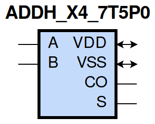
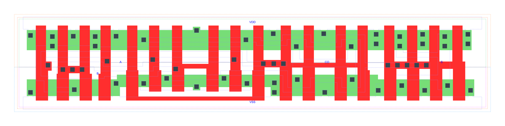

=======================================
gf180mcu_fd_sc_mcu7t5v0__addh_x4
=======================================

**gf180mcu_fd_sc_mcu7t5v0__addh_x4 symbol**

**gf180mcu_fd_sc_mcu7t5v0__addh_x4 schematic**

.. image:: sc7_sch/ADDH_X4_sch.png
    :height: 300px
    :width: 500 px
    :align: center
    :alt: gf180mcu_fd_sc_mcu7t5v0__addh_x4 schematic

**gf180mcu_fd_sc_mcu7t5v0__addh_x4 layout**

.. include:: images.rst

ADDH_X4 is a Half Adder, 4X drive strength

|
| Attributes

============= ======================
**Attribute** **Value**
area          87.808000 µm\ :sup:`2`
============= ======================

|
| OUTPUT FUNCTIONS

============== ============
**Output Pin** **Function**
CO             (A&B)
S              (A^B)
============== ============

|
| TRUTH TABLE FOR CO

===== ===== ======
**A** **B** **CO**
1     1     1
0     ?     0
?     0     0
===== ===== ======

|
| TRUTH TABLE FOR S

===== ===== =====
**A** **B** **S**
1     0     1
0     1     1
1     1     0
0     0     0
===== ===== =====

|
| FUNCTIONAL SCHEMATIC
| |image23|
| PIN CAPACITANCE (pf)

======= ======== ====================
**Pin** **Type** **Capacitance (pf)**
A       input    0.0167
B       input    0.0145
======= ======== ====================

|
| DELAY AND OUTPUT TRANSITION TIME corresponding to min slew and load

+---------------+------------+--------------------+--------------+-------------------+----------------+---------------+
| **Input Pin** | **Output** | **When Condition** | **Tin (ns)** | **Out Load (pf)** | **Delay (ns)** | **Tout (ns)** |
+---------------+------------+--------------------+--------------+-------------------+----------------+---------------+
| A(HL)         | S(LH)      | B                  | 0.0100       | 0.0010            | 0.5584         | 0.0446        |
+---------------+------------+--------------------+--------------+-------------------+----------------+---------------+
| A(HL)         | S(HL)      | !B                 | 0.0100       | 0.0010            | 0.2950         | 0.0511        |
+---------------+------------+--------------------+--------------+-------------------+----------------+---------------+
| A(LH)         | CO(LH)     | B                  | 0.0100       | 0.0010            | 0.2572         | 0.0387        |
+---------------+------------+--------------------+--------------+-------------------+----------------+---------------+
| A(LH)         | S(LH)      | !B                 | 0.0100       | 0.0010            | 0.2551         | 0.0421        |
+---------------+------------+--------------------+--------------+-------------------+----------------+---------------+
| A(HL)         | CO(HL)     | B                  | 0.0100       | 0.0010            | 0.2176         | 0.0389        |
+---------------+------------+--------------------+--------------+-------------------+----------------+---------------+
| A(LH)         | S(HL)      | B                  | 0.0100       | 0.0010            | 0.4432         | 0.0416        |
+---------------+------------+--------------------+--------------+-------------------+----------------+---------------+
| B(LH)         | S(LH)      | !A                 | 0.0100       | 0.0010            | 0.2889         | 0.0438        |
+---------------+------------+--------------------+--------------+-------------------+----------------+---------------+
| B(LH)         | CO(LH)     | A                  | 0.0100       | 0.0010            | 0.2454         | 0.0390        |
+---------------+------------+--------------------+--------------+-------------------+----------------+---------------+
| B(HL)         | S(HL)      | !A                 | 0.0100       | 0.0010            | 0.3212         | 0.0511        |
+---------------+------------+--------------------+--------------+-------------------+----------------+---------------+
| B(HL)         | S(LH)      | A                  | 0.0100       | 0.0010            | 0.5045         | 0.0432        |
+---------------+------------+--------------------+--------------+-------------------+----------------+---------------+
| B(HL)         | CO(HL)     | A                  | 0.0100       | 0.0010            | 0.2012         | 0.0360        |
+---------------+------------+--------------------+--------------+-------------------+----------------+---------------+
| B(LH)         | S(HL)      | A                  | 0.0100       | 0.0010            | 0.4303         | 0.0416        |
+---------------+------------+--------------------+--------------+-------------------+----------------+---------------+

|
| DYNAMIC ENERGY

+---------------+--------------------+--------------+------------+-------------------+---------------------+
| **Input Pin** | **When Condition** | **Tin (ns)** | **Output** | **Out Load (pf)** | **Energy (uW/MHz)** |
+---------------+--------------------+--------------+------------+-------------------+---------------------+
| B             | !A                 | 0.0100       | S(LH)      | 0.0010            | 0.4553              |
+---------------+--------------------+--------------+------------+-------------------+---------------------+
| B             | A                  | 0.0100       | S(LH)      | 0.0010            | 0.7356              |
+---------------+--------------------+--------------+------------+-------------------+---------------------+
| A             | B                  | 0.0100       | S(LH)      | 0.0010            | 0.8092              |
+---------------+--------------------+--------------+------------+-------------------+---------------------+
| A             | !B                 | 0.0100       | S(LH)      | 0.0010            | 0.3735              |
+---------------+--------------------+--------------+------------+-------------------+---------------------+
| B             | A                  | 0.0100       | CO(LH)     | 0.0010            | 0.6586              |
+---------------+--------------------+--------------+------------+-------------------+---------------------+
| B             | !A                 | 0.0100       | S(HL)      | 0.0010            | 1.0034              |
+---------------+--------------------+--------------+------------+-------------------+---------------------+
| B             | A                  | 0.0100       | S(HL)      | 0.0010            | 0.6810              |
+---------------+--------------------+--------------+------------+-------------------+---------------------+
| A             | !B                 | 0.0100       | S(HL)      | 0.0010            | 0.9540              |
+---------------+--------------------+--------------+------------+-------------------+---------------------+
| A             | B                  | 0.0100       | S(HL)      | 0.0010            | 0.7015              |
+---------------+--------------------+--------------+------------+-------------------+---------------------+
| A             | B                  | 0.0100       | CO(LH)     | 0.0010            | 0.6790              |
+---------------+--------------------+--------------+------------+-------------------+---------------------+
| B             | A                  | 0.0100       | CO(HL)     | 0.0010            | 0.7465              |
+---------------+--------------------+--------------+------------+-------------------+---------------------+
| A             | B                  | 0.0100       | CO(HL)     | 0.0010            | 0.8219              |
+---------------+--------------------+--------------+------------+-------------------+---------------------+

|
| LEAKAGE POWER

================== ==============
**When Condition** **Power (nW)**
!A&!B              0.4131
!A&B               0.5648
A&!B               0.4135
A&B                0.5846
================== ==============

