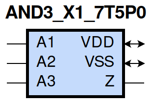
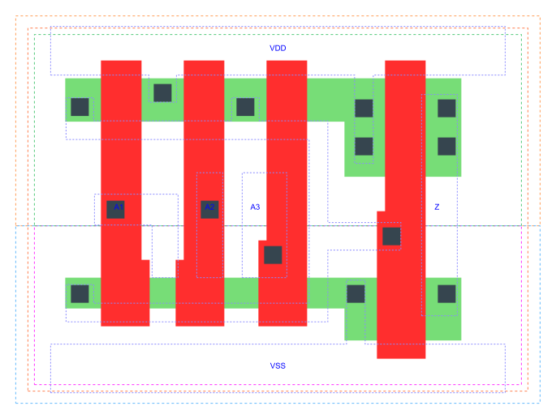

=======================================
gf180mcu_fd_sc_mcu7t5v0__and3_x1
=======================================

**gf180mcu_fd_sc_mcu7t5v0__and3_x1 symbol**

**gf180mcu_fd_sc_mcu7t5v0__and3_x1 schematic**

.. image:: sc7_sch/AND3_X1_sch.png
    :height: 300px
    :width: 500 px
    :align: center
    :alt: gf180mcu_fd_sc_mcu7t5v0__and3_x1 schematic

**gf180mcu_fd_sc_mcu7t5v0__and3_x1 layout**

.. include:: images.rst

AND3_X1 is a 3-input AND, AND(A1,A2,A3), 1X drive strength

|
| Attributes

============= ======================
**Attribute** **Value**
area          21.952000 µm\ :sup:`2`
============= ======================

|
| OUTPUT FUNCTIONS

============== ============
**Output Pin** **Function**
Z              (A1&A2&A3)
============== ============

|
| TRUTH TABLE FOR Z

====== ====== ====== =====
**A1** **A2** **A3** **Z**
1      1      1      1
0      ?      ?      0
?      0      ?      0
?      ?      0      0
====== ====== ====== =====

|
| FUNCTIONAL SCHEMATIC
| |image35|
| PIN CAPACITANCE (pf)

======= ======== ====================
**Pin** **Type** **Capacitance (pf)**
A1      input    0.0028
A2      input    0.0027
A3      input    0.0028
======= ======== ====================

|
| DELAY AND OUTPUT TRANSITION TIME corresponding to min slew and load

+---------------+------------+--------------------+--------------+-------------------+----------------+---------------+
| **Input Pin** | **Output** | **When Condition** | **Tin (ns)** | **Out Load (pf)** | **Delay (ns)** | **Tout (ns)** |
+---------------+------------+--------------------+--------------+-------------------+----------------+---------------+
| A1(LH)        | Z(LH)      | A2&A3              | 0.0100       | 0.0010            | 0.3115         | 0.0597        |
+---------------+------------+--------------------+--------------+-------------------+----------------+---------------+
| A1(HL)        | Z(HL)      | A2&A3              | 0.0100       | 0.0010            | 0.2343         | 0.0462        |
+---------------+------------+--------------------+--------------+-------------------+----------------+---------------+
| A2(HL)        | Z(HL)      | A1&A3              | 0.0100       | 0.0010            | 0.2540         | 0.0493        |
+---------------+------------+--------------------+--------------+-------------------+----------------+---------------+
| A2(LH)        | Z(LH)      | A1&A3              | 0.0100       | 0.0010            | 0.3312         | 0.0600        |
+---------------+------------+--------------------+--------------+-------------------+----------------+---------------+
| A3(LH)        | Z(LH)      | A1&A2              | 0.0100       | 0.0010            | 0.3427         | 0.0598        |
+---------------+------------+--------------------+--------------+-------------------+----------------+---------------+
| A3(HL)        | Z(HL)      | A1&A2              | 0.0100       | 0.0010            | 0.2714         | 0.0525        |
+---------------+------------+--------------------+--------------+-------------------+----------------+---------------+

|
| DYNAMIC ENERGY

+---------------+--------------------+--------------+------------+-------------------+---------------------+
| **Input Pin** | **When Condition** | **Tin (ns)** | **Output** | **Out Load (pf)** | **Energy (uW/MHz)** |
+---------------+--------------------+--------------+------------+-------------------+---------------------+
| A3            | A1&A2              | 0.0100       | Z(LH)      | 0.0010            | 0.1503              |
+---------------+--------------------+--------------+------------+-------------------+---------------------+
| A2            | A1&A3              | 0.0100       | Z(HL)      | 0.0010            | 0.2459              |
+---------------+--------------------+--------------+------------+-------------------+---------------------+
| A2            | A1&A3              | 0.0100       | Z(LH)      | 0.0010            | 0.1502              |
+---------------+--------------------+--------------+------------+-------------------+---------------------+
| A1            | A2&A3              | 0.0100       | Z(LH)      | 0.0010            | 0.1503              |
+---------------+--------------------+--------------+------------+-------------------+---------------------+
| A3            | A1&A2              | 0.0100       | Z(HL)      | 0.0010            | 0.2702              |
+---------------+--------------------+--------------+------------+-------------------+---------------------+
| A1            | A2&A3              | 0.0100       | Z(HL)      | 0.0010            | 0.2221              |
+---------------+--------------------+--------------+------------+-------------------+---------------------+
| A3(LH)        | !A1&!A2            | 0.0100       | n/a        | n/a               | -0.0172             |
+---------------+--------------------+--------------+------------+-------------------+---------------------+
| A3(LH)        | !A1&A2             | 0.0100       | n/a        | n/a               | -0.0172             |
+---------------+--------------------+--------------+------------+-------------------+---------------------+
| A3(LH)        | A1&!A2             | 0.0100       | n/a        | n/a               | -0.0172             |
+---------------+--------------------+--------------+------------+-------------------+---------------------+
| A2(LH)        | !A1&!A3            | 0.0100       | n/a        | n/a               | -0.0173             |
+---------------+--------------------+--------------+------------+-------------------+---------------------+
| A2(LH)        | !A1&A3             | 0.0100       | n/a        | n/a               | -0.0172             |
+---------------+--------------------+--------------+------------+-------------------+---------------------+
| A2(LH)        | A1&!A3             | 0.0100       | n/a        | n/a               | -0.0114             |
+---------------+--------------------+--------------+------------+-------------------+---------------------+
| A1(LH)        | !A2&!A3            | 0.0100       | n/a        | n/a               | -0.0114             |
+---------------+--------------------+--------------+------------+-------------------+---------------------+
| A1(LH)        | !A2&A3             | 0.0100       | n/a        | n/a               | -0.0114             |
+---------------+--------------------+--------------+------------+-------------------+---------------------+
| A1(LH)        | A2&!A3             | 0.0100       | n/a        | n/a               | 0.0093              |
+---------------+--------------------+--------------+------------+-------------------+---------------------+
| A3(HL)        | !A1&!A2            | 0.0100       | n/a        | n/a               | 0.0174              |
+---------------+--------------------+--------------+------------+-------------------+---------------------+
| A3(HL)        | !A1&A2             | 0.0100       | n/a        | n/a               | 0.0192              |
+---------------+--------------------+--------------+------------+-------------------+---------------------+
| A3(HL)        | A1&!A2             | 0.0100       | n/a        | n/a               | 0.0187              |
+---------------+--------------------+--------------+------------+-------------------+---------------------+
| A1(HL)        | !A2&!A3            | 0.0100       | n/a        | n/a               | 0.0194              |
+---------------+--------------------+--------------+------------+-------------------+---------------------+
| A1(HL)        | !A2&A3             | 0.0100       | n/a        | n/a               | 0.0194              |
+---------------+--------------------+--------------+------------+-------------------+---------------------+
| A1(HL)        | A2&!A3             | 0.0100       | n/a        | n/a               | 0.0193              |
+---------------+--------------------+--------------+------------+-------------------+---------------------+
| A2(HL)        | !A1&!A3            | 0.0100       | n/a        | n/a               | 0.0234              |
+---------------+--------------------+--------------+------------+-------------------+---------------------+
| A2(HL)        | !A1&A3             | 0.0100       | n/a        | n/a               | 0.0206              |
+---------------+--------------------+--------------+------------+-------------------+---------------------+
| A2(HL)        | A1&!A3             | 0.0100       | n/a        | n/a               | 0.0192              |
+---------------+--------------------+--------------+------------+-------------------+---------------------+

|
| LEAKAGE POWER

================== ==============
**When Condition** **Power (nW)**
!A1&!A2&!A3        0.1020
!A1&!A2&A3         0.1020
!A1&A2&!A3         0.1022
!A1&A2&A3          0.1033
A1&!A2&!A3         0.1426
A1&!A2&A3          0.1436
A1&A2&!A3          0.1834
A1&A2&A3           0.1537
================== ==============

