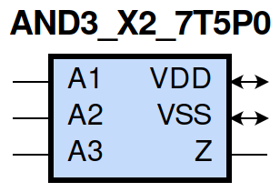
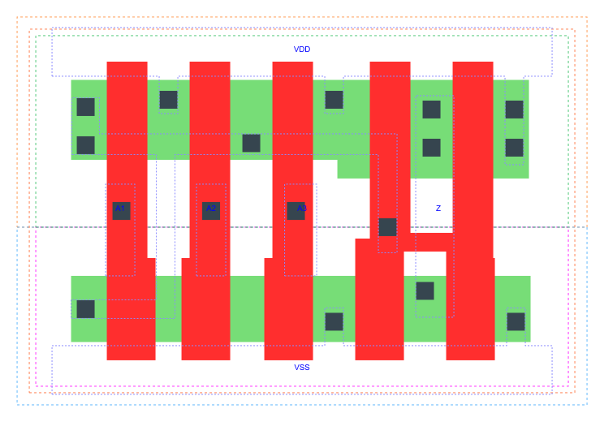

=======================================
gf180mcu_fd_sc_mcu7t5v0__and3_x2
=======================================

**gf180mcu_fd_sc_mcu7t5v0__and3_x2 symbol**

**gf180mcu_fd_sc_mcu7t5v0__and3_x2 schematic**

.. image:: sc7_sch/AND3_X2_sch.png
    :height: 300px
    :width: 500 px
    :align: center
    :alt: gf180mcu_fd_sc_mcu7t5v0__and3_x2 schematic

**gf180mcu_fd_sc_mcu7t5v0__and3_x2 layout**

.. include:: images.rst

AND3_X2 is a 3-input AND, AND(A1,A2,A3), 2X drive strength

|
| Attributes

============= ======================
**Attribute** **Value**
area          24.147200 µm\ :sup:`2`
============= ======================

|
| OUTPUT FUNCTIONS

============== ============
**Output Pin** **Function**
Z              (A1&A2&A3)
============== ============

|
| TRUTH TABLE FOR Z

====== ====== ====== =====
**A1** **A2** **A3** **Z**
1      1      1      1
0      ?      ?      0
?      0      ?      0
?      ?      0      0
====== ====== ====== =====

|
| FUNCTIONAL SCHEMATIC
| |image38|
| PIN CAPACITANCE (pf)

======= ======== ====================
**Pin** **Type** **Capacitance (pf)**
A1      input    0.0044
A2      input    0.0042
A3      input    0.0042
======= ======== ====================

|
| DELAY AND OUTPUT TRANSITION TIME corresponding to min slew and load

+---------------+------------+--------------------+--------------+-------------------+----------------+---------------+
| **Input Pin** | **Output** | **When Condition** | **Tin (ns)** | **Out Load (pf)** | **Delay (ns)** | **Tout (ns)** |
+---------------+------------+--------------------+--------------+-------------------+----------------+---------------+
| A1(LH)        | Z(LH)      | A2&A3              | 0.0100       | 0.0010            | 0.2481         | 0.0432        |
+---------------+------------+--------------------+--------------+-------------------+----------------+---------------+
| A1(HL)        | Z(HL)      | A2&A3              | 0.0100       | 0.0010            | 0.1972         | 0.0345        |
+---------------+------------+--------------------+--------------+-------------------+----------------+---------------+
| A2(HL)        | Z(HL)      | A1&A3              | 0.0100       | 0.0010            | 0.2190         | 0.0380        |
+---------------+------------+--------------------+--------------+-------------------+----------------+---------------+
| A2(LH)        | Z(LH)      | A1&A3              | 0.0100       | 0.0010            | 0.2684         | 0.0433        |
+---------------+------------+--------------------+--------------+-------------------+----------------+---------------+
| A3(LH)        | Z(LH)      | A1&A2              | 0.0100       | 0.0010            | 0.2797         | 0.0433        |
+---------------+------------+--------------------+--------------+-------------------+----------------+---------------+
| A3(HL)        | Z(HL)      | A1&A2              | 0.0100       | 0.0010            | 0.2376         | 0.0410        |
+---------------+------------+--------------------+--------------+-------------------+----------------+---------------+

|
| DYNAMIC ENERGY

+---------------+--------------------+--------------+------------+-------------------+---------------------+
| **Input Pin** | **When Condition** | **Tin (ns)** | **Output** | **Out Load (pf)** | **Energy (uW/MHz)** |
+---------------+--------------------+--------------+------------+-------------------+---------------------+
| A3            | A1&A2              | 0.0100       | Z(LH)      | 0.0010            | 0.2584              |
+---------------+--------------------+--------------+------------+-------------------+---------------------+
| A2            | A1&A3              | 0.0100       | Z(HL)      | 0.0010            | 0.4086              |
+---------------+--------------------+--------------+------------+-------------------+---------------------+
| A2            | A1&A3              | 0.0100       | Z(LH)      | 0.0010            | 0.2584              |
+---------------+--------------------+--------------+------------+-------------------+---------------------+
| A1            | A2&A3              | 0.0100       | Z(LH)      | 0.0010            | 0.2586              |
+---------------+--------------------+--------------+------------+-------------------+---------------------+
| A3            | A1&A2              | 0.0100       | Z(HL)      | 0.0010            | 0.4583              |
+---------------+--------------------+--------------+------------+-------------------+---------------------+
| A1            | A2&A3              | 0.0100       | Z(HL)      | 0.0010            | 0.3572              |
+---------------+--------------------+--------------+------------+-------------------+---------------------+
| A3(LH)        | !A1&!A2            | 0.0100       | n/a        | n/a               | -0.0316             |
+---------------+--------------------+--------------+------------+-------------------+---------------------+
| A3(LH)        | !A1&A2             | 0.0100       | n/a        | n/a               | -0.0316             |
+---------------+--------------------+--------------+------------+-------------------+---------------------+
| A3(LH)        | A1&!A2             | 0.0100       | n/a        | n/a               | -0.0316             |
+---------------+--------------------+--------------+------------+-------------------+---------------------+
| A2(LH)        | !A1&!A3            | 0.0100       | n/a        | n/a               | -0.0317             |
+---------------+--------------------+--------------+------------+-------------------+---------------------+
| A2(LH)        | !A1&A3             | 0.0100       | n/a        | n/a               | -0.0316             |
+---------------+--------------------+--------------+------------+-------------------+---------------------+
| A2(LH)        | A1&!A3             | 0.0100       | n/a        | n/a               | -0.0220             |
+---------------+--------------------+--------------+------------+-------------------+---------------------+
| A1(LH)        | !A2&!A3            | 0.0100       | n/a        | n/a               | -0.0209             |
+---------------+--------------------+--------------+------------+-------------------+---------------------+
| A1(LH)        | !A2&A3             | 0.0100       | n/a        | n/a               | -0.0209             |
+---------------+--------------------+--------------+------------+-------------------+---------------------+
| A1(LH)        | A2&!A3             | 0.0100       | n/a        | n/a               | 0.0205              |
+---------------+--------------------+--------------+------------+-------------------+---------------------+
| A3(HL)        | !A1&!A2            | 0.0100       | n/a        | n/a               | 0.0319              |
+---------------+--------------------+--------------+------------+-------------------+---------------------+
| A3(HL)        | !A1&A2             | 0.0100       | n/a        | n/a               | 0.0352              |
+---------------+--------------------+--------------+------------+-------------------+---------------------+
| A3(HL)        | A1&!A2             | 0.0100       | n/a        | n/a               | 0.0346              |
+---------------+--------------------+--------------+------------+-------------------+---------------------+
| A1(HL)        | !A2&!A3            | 0.0100       | n/a        | n/a               | 0.0363              |
+---------------+--------------------+--------------+------------+-------------------+---------------------+
| A1(HL)        | !A2&A3             | 0.0100       | n/a        | n/a               | 0.0362              |
+---------------+--------------------+--------------+------------+-------------------+---------------------+
| A1(HL)        | A2&!A3             | 0.0100       | n/a        | n/a               | 0.0361              |
+---------------+--------------------+--------------+------------+-------------------+---------------------+
| A2(HL)        | !A1&!A3            | 0.0100       | n/a        | n/a               | 0.0442              |
+---------------+--------------------+--------------+------------+-------------------+---------------------+
| A2(HL)        | !A1&A3             | 0.0100       | n/a        | n/a               | 0.0386              |
+---------------+--------------------+--------------+------------+-------------------+---------------------+
| A2(HL)        | A1&!A3             | 0.0100       | n/a        | n/a               | 0.0359              |
+---------------+--------------------+--------------+------------+-------------------+---------------------+

|
| LEAKAGE POWER

================== ==============
**When Condition** **Power (nW)**
!A1&!A2&!A3        0.1282
!A1&!A2&A3         0.1282
!A1&A2&!A3         0.1283
!A1&A2&A3          0.1284
A1&!A2&!A3         0.1682
A1&!A2&A3          0.1683
A1&A2&!A3          0.2075
A1&A2&A3           0.1800
================== ==============

