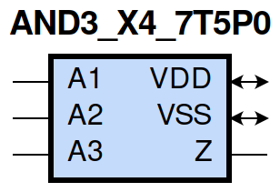
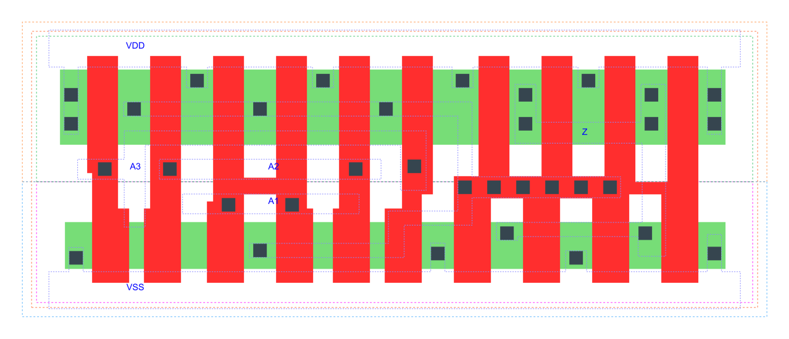

=======================================
gf180mcu_fd_sc_mcu7t5v0__and3_x4
=======================================

**gf180mcu_fd_sc_mcu7t5v0__and3_x4 symbol**

**gf180mcu_fd_sc_mcu7t5v0__and3_x4 schematic**

.. image:: sc7_sch/AND3_X4_sch.png
    :height: 300px
    :width: 500 px
    :align: center
    :alt: gf180mcu_fd_sc_mcu7t5v0__and3_x4 schematic

**gf180mcu_fd_sc_mcu7t5v0__and3_x4 layout**

.. include:: images.rst

AND3_X4 is a 3-input AND, AND(A1,A2,A3), 4X drive strength

|
| Attributes

============= ======================
**Attribute** **Value**
area          43.904000 µm\ :sup:`2`
============= ======================

|
| OUTPUT FUNCTIONS

============== ============
**Output Pin** **Function**
Z              (A1&A2&A3)
============== ============

|
| TRUTH TABLE FOR Z

====== ====== ====== =====
**A1** **A2** **A3** **Z**
1      1      1      1
0      ?      ?      0
?      0      ?      0
?      ?      0      0
====== ====== ====== =====

|
| FUNCTIONAL SCHEMATIC
| |image41|
| PIN CAPACITANCE (pf)

======= ======== ====================
**Pin** **Type** **Capacitance (pf)**
A3      input    0.0103
A2      input    0.0096
A1      input    0.0092
======= ======== ====================

|
| DELAY AND OUTPUT TRANSITION TIME corresponding to min slew and load

+---------------+------------+--------------------+--------------+-------------------+----------------+---------------+
| **Input Pin** | **Output** | **When Condition** | **Tin (ns)** | **Out Load (pf)** | **Delay (ns)** | **Tout (ns)** |
+---------------+------------+--------------------+--------------+-------------------+----------------+---------------+
| A3(LH)        | Z(LH)      | A1&A2              | 0.0100       | 0.0010            | 0.2786         | 0.0415        |
+---------------+------------+--------------------+--------------+-------------------+----------------+---------------+
| A3(HL)        | Z(HL)      | A1&A2              | 0.0100       | 0.0010            | 0.1905         | 0.0328        |
+---------------+------------+--------------------+--------------+-------------------+----------------+---------------+
| A2(HL)        | Z(HL)      | A1&A3              | 0.0100       | 0.0010            | 0.1780         | 0.0307        |
+---------------+------------+--------------------+--------------+-------------------+----------------+---------------+
| A2(LH)        | Z(LH)      | A1&A3              | 0.0100       | 0.0010            | 0.2684         | 0.0414        |
+---------------+------------+--------------------+--------------+-------------------+----------------+---------------+
| A1(LH)        | Z(LH)      | A2&A3              | 0.0100       | 0.0010            | 0.2477         | 0.0414        |
+---------------+------------+--------------------+--------------+-------------------+----------------+---------------+
| A1(HL)        | Z(HL)      | A2&A3              | 0.0100       | 0.0010            | 0.1608         | 0.0282        |
+---------------+------------+--------------------+--------------+-------------------+----------------+---------------+

|
| DYNAMIC ENERGY

+---------------+--------------------+--------------+------------+-------------------+---------------------+
| **Input Pin** | **When Condition** | **Tin (ns)** | **Output** | **Out Load (pf)** | **Energy (uW/MHz)** |
+---------------+--------------------+--------------+------------+-------------------+---------------------+
| A3            | A1&A2              | 0.0100       | Z(LH)      | 0.0010            | 0.5059              |
+---------------+--------------------+--------------+------------+-------------------+---------------------+
| A2            | A1&A3              | 0.0100       | Z(HL)      | 0.0010            | 0.7445              |
+---------------+--------------------+--------------+------------+-------------------+---------------------+
| A2            | A1&A3              | 0.0100       | Z(LH)      | 0.0010            | 0.5059              |
+---------------+--------------------+--------------+------------+-------------------+---------------------+
| A1            | A2&A3              | 0.0100       | Z(LH)      | 0.0010            | 0.5055              |
+---------------+--------------------+--------------+------------+-------------------+---------------------+
| A3            | A1&A2              | 0.0100       | Z(HL)      | 0.0010            | 0.8250              |
+---------------+--------------------+--------------+------------+-------------------+---------------------+
| A1            | A2&A3              | 0.0100       | Z(HL)      | 0.0010            | 0.6537              |
+---------------+--------------------+--------------+------------+-------------------+---------------------+
| A3(LH)        | !A1&!A2            | 0.0100       | n/a        | n/a               | -0.0786             |
+---------------+--------------------+--------------+------------+-------------------+---------------------+
| A3(LH)        | !A1&A2             | 0.0100       | n/a        | n/a               | -0.0785             |
+---------------+--------------------+--------------+------------+-------------------+---------------------+
| A3(LH)        | A1&!A2             | 0.0100       | n/a        | n/a               | -0.0785             |
+---------------+--------------------+--------------+------------+-------------------+---------------------+
| A2(LH)        | !A1&!A3            | 0.0100       | n/a        | n/a               | -0.0787             |
+---------------+--------------------+--------------+------------+-------------------+---------------------+
| A2(LH)        | !A1&A3             | 0.0100       | n/a        | n/a               | -0.0785             |
+---------------+--------------------+--------------+------------+-------------------+---------------------+
| A2(LH)        | A1&!A3             | 0.0100       | n/a        | n/a               | -0.0655             |
+---------------+--------------------+--------------+------------+-------------------+---------------------+
| A1(LH)        | !A2&!A3            | 0.0100       | n/a        | n/a               | -0.0575             |
+---------------+--------------------+--------------+------------+-------------------+---------------------+
| A1(LH)        | !A2&A3             | 0.0100       | n/a        | n/a               | -0.0575             |
+---------------+--------------------+--------------+------------+-------------------+---------------------+
| A1(LH)        | A2&!A3             | 0.0100       | n/a        | n/a               | 0.0150              |
+---------------+--------------------+--------------+------------+-------------------+---------------------+
| A3(HL)        | !A1&!A2            | 0.0100       | n/a        | n/a               | 0.0790              |
+---------------+--------------------+--------------+------------+-------------------+---------------------+
| A3(HL)        | !A1&A2             | 0.0100       | n/a        | n/a               | 0.0855              |
+---------------+--------------------+--------------+------------+-------------------+---------------------+
| A3(HL)        | A1&!A2             | 0.0100       | n/a        | n/a               | 0.0839              |
+---------------+--------------------+--------------+------------+-------------------+---------------------+
| A1(HL)        | !A2&!A3            | 0.0100       | n/a        | n/a               | 0.0873              |
+---------------+--------------------+--------------+------------+-------------------+---------------------+
| A1(HL)        | !A2&A3             | 0.0100       | n/a        | n/a               | 0.0873              |
+---------------+--------------------+--------------+------------+-------------------+---------------------+
| A1(HL)        | A2&!A3             | 0.0100       | n/a        | n/a               | 0.0871              |
+---------------+--------------------+--------------+------------+-------------------+---------------------+
| A2(HL)        | !A1&!A3            | 0.0100       | n/a        | n/a               | 0.1023              |
+---------------+--------------------+--------------+------------+-------------------+---------------------+
| A2(HL)        | !A1&A3             | 0.0100       | n/a        | n/a               | 0.0919              |
+---------------+--------------------+--------------+------------+-------------------+---------------------+
| A2(HL)        | A1&!A3             | 0.0100       | n/a        | n/a               | 0.0866              |
+---------------+--------------------+--------------+------------+-------------------+---------------------+

|
| LEAKAGE POWER

================== ==============
**When Condition** **Power (nW)**
!A1&!A2&!A3        0.2064
!A1&!A2&A3         0.2064
!A1&A2&!A3         0.2065
!A1&A2&A3          0.2069
A1&!A2&!A3         0.2864
A1&!A2&A3          0.2867
A1&A2&!A3          0.3651
A1&A2&A3           0.3107
================== ==============

