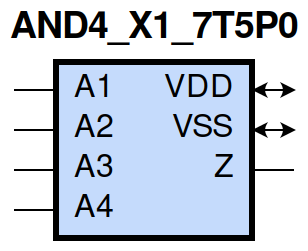
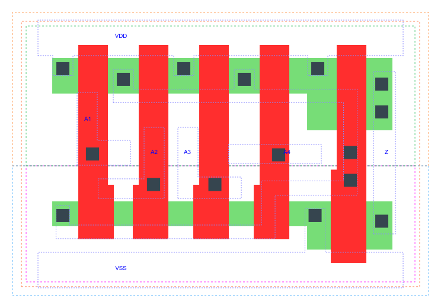

=======================================
gf180mcu_fd_sc_mcu7t5v0__and4_x1
=======================================

**gf180mcu_fd_sc_mcu7t5v0__and4_x1 symbol**

**gf180mcu_fd_sc_mcu7t5v0__and4_x1 schematic**

.. image:: sc7_sch/AND4_X1_sch.png
    :height: 300px
    :width: 500 px
    :align: center
    :alt: gf180mcu_fd_sc_mcu7t5v0__and4_x1 schematic

**gf180mcu_fd_sc_mcu7t5v0__and4_x1 layout**

.. include:: images.rst

AND4_X1 is a 4-input AND, AND(A1,A2,A3,A4), 1X drive strength

|
| Attributes

============= ======================
**Attribute** **Value**
area          24.147200 µm\ :sup:`2`
============= ======================

|
| OUTPUT FUNCTIONS

============== =============
**Output Pin** **Function**
Z              (A1&A2&A3&A4)
============== =============

|
| TRUTH TABLE FOR Z

====== ====== ====== ====== =====
**A1** **A2** **A3** **A4** **Z**
1      1      1      1      1
0      ?      ?      ?      0
?      0      ?      ?      0
?      ?      0      ?      0
?      ?      ?      0      0
====== ====== ====== ====== =====

|
| FUNCTIONAL SCHEMATIC
| |image44|
| PIN CAPACITANCE (pf)

======= ======== ====================
**Pin** **Type** **Capacitance (pf)**
A1      input    0.0030
A2      input    0.0030
A3      input    0.0030
A4      input    0.0029
======= ======== ====================

|
| DELAY AND OUTPUT TRANSITION TIME corresponding to min slew and load

+---------------+------------+--------------------+--------------+-------------------+----------------+---------------+
| **Input Pin** | **Output** | **When Condition** | **Tin (ns)** | **Out Load (pf)** | **Delay (ns)** | **Tout (ns)** |
+---------------+------------+--------------------+--------------+-------------------+----------------+---------------+
| A1(LH)        | Z(LH)      | A2&A3&A4           | 0.0100       | 0.0010            | 0.3804         | 0.0698        |
+---------------+------------+--------------------+--------------+-------------------+----------------+---------------+
| A1(HL)        | Z(HL)      | A2&A3&A4           | 0.0100       | 0.0010            | 0.2297         | 0.0452        |
+---------------+------------+--------------------+--------------+-------------------+----------------+---------------+
| A2(HL)        | Z(HL)      | A1&A3&A4           | 0.0100       | 0.0010            | 0.2495         | 0.0487        |
+---------------+------------+--------------------+--------------+-------------------+----------------+---------------+
| A2(LH)        | Z(LH)      | A1&A3&A4           | 0.0100       | 0.0010            | 0.4096         | 0.0693        |
+---------------+------------+--------------------+--------------+-------------------+----------------+---------------+
| A3(LH)        | Z(LH)      | A1&A2&A4           | 0.0100       | 0.0010            | 0.4298         | 0.0696        |
+---------------+------------+--------------------+--------------+-------------------+----------------+---------------+
| A3(HL)        | Z(HL)      | A1&A2&A4           | 0.0100       | 0.0010            | 0.2684         | 0.0515        |
+---------------+------------+--------------------+--------------+-------------------+----------------+---------------+
| A4(LH)        | Z(LH)      | A1&A2&A3           | 0.0100       | 0.0010            | 0.4409         | 0.0698        |
+---------------+------------+--------------------+--------------+-------------------+----------------+---------------+
| A4(HL)        | Z(HL)      | A1&A2&A3           | 0.0100       | 0.0010            | 0.2827         | 0.0547        |
+---------------+------------+--------------------+--------------+-------------------+----------------+---------------+

|
| DYNAMIC ENERGY

+---------------+--------------------+--------------+------------+-------------------+---------------------+
| **Input Pin** | **When Condition** | **Tin (ns)** | **Output** | **Out Load (pf)** | **Energy (uW/MHz)** |
+---------------+--------------------+--------------+------------+-------------------+---------------------+
| A3            | A1&A2&A4           | 0.0100       | Z(LH)      | 0.0010            | 0.1784              |
+---------------+--------------------+--------------+------------+-------------------+---------------------+
| A2            | A1&A3&A4           | 0.0100       | Z(HL)      | 0.0010            | 0.2663              |
+---------------+--------------------+--------------+------------+-------------------+---------------------+
| A2            | A1&A3&A4           | 0.0100       | Z(LH)      | 0.0010            | 0.1783              |
+---------------+--------------------+--------------+------------+-------------------+---------------------+
| A4            | A1&A2&A3           | 0.0100       | Z(LH)      | 0.0010            | 0.1783              |
+---------------+--------------------+--------------+------------+-------------------+---------------------+
| A1            | A2&A3&A4           | 0.0100       | Z(LH)      | 0.0010            | 0.1783              |
+---------------+--------------------+--------------+------------+-------------------+---------------------+
| A3            | A1&A2&A4           | 0.0100       | Z(HL)      | 0.0010            | 0.2935              |
+---------------+--------------------+--------------+------------+-------------------+---------------------+
| A4            | A1&A2&A3           | 0.0100       | Z(HL)      | 0.0010            | 0.3193              |
+---------------+--------------------+--------------+------------+-------------------+---------------------+
| A1            | A2&A3&A4           | 0.0100       | Z(HL)      | 0.0010            | 0.2399              |
+---------------+--------------------+--------------+------------+-------------------+---------------------+
| A3(LH)        | !A1&!A2&!A4        | 0.0100       | n/a        | n/a               | -0.0193             |
+---------------+--------------------+--------------+------------+-------------------+---------------------+
| A3(LH)        | !A1&!A2&A4         | 0.0100       | n/a        | n/a               | -0.0192             |
+---------------+--------------------+--------------+------------+-------------------+---------------------+
| A3(LH)        | !A1&A2&!A4         | 0.0100       | n/a        | n/a               | -0.0192             |
+---------------+--------------------+--------------+------------+-------------------+---------------------+
| A3(LH)        | !A1&A2&A4          | 0.0100       | n/a        | n/a               | -0.0192             |
+---------------+--------------------+--------------+------------+-------------------+---------------------+
| A3(LH)        | A1&!A2&!A4         | 0.0100       | n/a        | n/a               | -0.0193             |
+---------------+--------------------+--------------+------------+-------------------+---------------------+
| A3(LH)        | A1&!A2&A4          | 0.0100       | n/a        | n/a               | -0.0192             |
+---------------+--------------------+--------------+------------+-------------------+---------------------+
| A3(LH)        | A1&A2&!A4          | 0.0100       | n/a        | n/a               | -0.0139             |
+---------------+--------------------+--------------+------------+-------------------+---------------------+
| A2(LH)        | !A1&!A3&!A4        | 0.0100       | n/a        | n/a               | -0.0193             |
+---------------+--------------------+--------------+------------+-------------------+---------------------+
| A2(LH)        | !A1&!A3&A4         | 0.0100       | n/a        | n/a               | -0.0193             |
+---------------+--------------------+--------------+------------+-------------------+---------------------+
| A2(LH)        | !A1&A3&!A4         | 0.0100       | n/a        | n/a               | -0.0192             |
+---------------+--------------------+--------------+------------+-------------------+---------------------+
| A2(LH)        | !A1&A3&A4          | 0.0100       | n/a        | n/a               | -0.0192             |
+---------------+--------------------+--------------+------------+-------------------+---------------------+
| A2(LH)        | A1&!A3&!A4         | 0.0100       | n/a        | n/a               | -0.0131             |
+---------------+--------------------+--------------+------------+-------------------+---------------------+
| A2(LH)        | A1&!A3&A4          | 0.0100       | n/a        | n/a               | -0.0131             |
+---------------+--------------------+--------------+------------+-------------------+---------------------+
| A2(LH)        | A1&A3&!A4          | 0.0100       | n/a        | n/a               | 0.0093              |
+---------------+--------------------+--------------+------------+-------------------+---------------------+
| A1(LH)        | !A2&!A3&!A4        | 0.0100       | n/a        | n/a               | -0.0129             |
+---------------+--------------------+--------------+------------+-------------------+---------------------+
| A1(LH)        | !A2&!A3&A4         | 0.0100       | n/a        | n/a               | -0.0129             |
+---------------+--------------------+--------------+------------+-------------------+---------------------+
| A1(LH)        | !A2&A3&!A4         | 0.0100       | n/a        | n/a               | -0.0129             |
+---------------+--------------------+--------------+------------+-------------------+---------------------+
| A1(LH)        | !A2&A3&A4          | 0.0100       | n/a        | n/a               | -0.0129             |
+---------------+--------------------+--------------+------------+-------------------+---------------------+
| A1(LH)        | A2&!A3&!A4         | 0.0100       | n/a        | n/a               | 0.0097              |
+---------------+--------------------+--------------+------------+-------------------+---------------------+
| A1(LH)        | A2&!A3&A4          | 0.0100       | n/a        | n/a               | 0.0097              |
+---------------+--------------------+--------------+------------+-------------------+---------------------+
| A1(LH)        | A2&A3&!A4          | 0.0100       | n/a        | n/a               | 0.0321              |
+---------------+--------------------+--------------+------------+-------------------+---------------------+
| A3(HL)        | !A1&!A2&!A4        | 0.0100       | n/a        | n/a               | 0.0223              |
+---------------+--------------------+--------------+------------+-------------------+---------------------+
| A3(HL)        | !A1&!A2&A4         | 0.0100       | n/a        | n/a               | 0.0202              |
+---------------+--------------------+--------------+------------+-------------------+---------------------+
| A3(HL)        | !A1&A2&!A4         | 0.0100       | n/a        | n/a               | 0.0271              |
+---------------+--------------------+--------------+------------+-------------------+---------------------+
| A3(HL)        | !A1&A2&A4          | 0.0100       | n/a        | n/a               | 0.0230              |
+---------------+--------------------+--------------+------------+-------------------+---------------------+
| A3(HL)        | A1&!A2&!A4         | 0.0100       | n/a        | n/a               | 0.0246              |
+---------------+--------------------+--------------+------------+-------------------+---------------------+
| A3(HL)        | A1&!A2&A4          | 0.0100       | n/a        | n/a               | 0.0221              |
+---------------+--------------------+--------------+------------+-------------------+---------------------+
| A3(HL)        | A1&A2&!A4          | 0.0100       | n/a        | n/a               | 0.0209              |
+---------------+--------------------+--------------+------------+-------------------+---------------------+
| A4(LH)        | !A1&!A2&!A3        | 0.0100       | n/a        | n/a               | -0.0193             |
+---------------+--------------------+--------------+------------+-------------------+---------------------+
| A4(LH)        | !A1&!A2&A3         | 0.0100       | n/a        | n/a               | -0.0192             |
+---------------+--------------------+--------------+------------+-------------------+---------------------+
| A4(LH)        | !A1&A2&!A3         | 0.0100       | n/a        | n/a               | -0.0193             |
+---------------+--------------------+--------------+------------+-------------------+---------------------+
| A4(LH)        | !A1&A2&A3          | 0.0100       | n/a        | n/a               | -0.0192             |
+---------------+--------------------+--------------+------------+-------------------+---------------------+
| A4(LH)        | A1&!A2&!A3         | 0.0100       | n/a        | n/a               | -0.0193             |
+---------------+--------------------+--------------+------------+-------------------+---------------------+
| A4(LH)        | A1&!A2&A3          | 0.0100       | n/a        | n/a               | -0.0192             |
+---------------+--------------------+--------------+------------+-------------------+---------------------+
| A4(LH)        | A1&A2&!A3          | 0.0100       | n/a        | n/a               | -0.0193             |
+---------------+--------------------+--------------+------------+-------------------+---------------------+
| A1(HL)        | !A2&!A3&!A4        | 0.0100       | n/a        | n/a               | 0.0217              |
+---------------+--------------------+--------------+------------+-------------------+---------------------+
| A1(HL)        | !A2&!A3&A4         | 0.0100       | n/a        | n/a               | 0.0217              |
+---------------+--------------------+--------------+------------+-------------------+---------------------+
| A1(HL)        | !A2&A3&!A4         | 0.0100       | n/a        | n/a               | 0.0217              |
+---------------+--------------------+--------------+------------+-------------------+---------------------+
| A1(HL)        | !A2&A3&A4          | 0.0100       | n/a        | n/a               | 0.0217              |
+---------------+--------------------+--------------+------------+-------------------+---------------------+
| A1(HL)        | A2&!A3&!A4         | 0.0100       | n/a        | n/a               | 0.0216              |
+---------------+--------------------+--------------+------------+-------------------+---------------------+
| A1(HL)        | A2&!A3&A4          | 0.0100       | n/a        | n/a               | 0.0216              |
+---------------+--------------------+--------------+------------+-------------------+---------------------+
| A1(HL)        | A2&A3&!A4          | 0.0100       | n/a        | n/a               | 0.0216              |
+---------------+--------------------+--------------+------------+-------------------+---------------------+
| A2(HL)        | !A1&!A3&!A4        | 0.0100       | n/a        | n/a               | 0.0266              |
+---------------+--------------------+--------------+------------+-------------------+---------------------+
| A2(HL)        | !A1&!A3&A4         | 0.0100       | n/a        | n/a               | 0.0260              |
+---------------+--------------------+--------------+------------+-------------------+---------------------+
| A2(HL)        | !A1&A3&!A4         | 0.0100       | n/a        | n/a               | 0.0263              |
+---------------+--------------------+--------------+------------+-------------------+---------------------+
| A2(HL)        | !A1&A3&A4          | 0.0100       | n/a        | n/a               | 0.0233              |
+---------------+--------------------+--------------+------------+-------------------+---------------------+
| A2(HL)        | A1&!A3&!A4         | 0.0100       | n/a        | n/a               | 0.0214              |
+---------------+--------------------+--------------+------------+-------------------+---------------------+
| A2(HL)        | A1&!A3&A4          | 0.0100       | n/a        | n/a               | 0.0214              |
+---------------+--------------------+--------------+------------+-------------------+---------------------+
| A2(HL)        | A1&A3&!A4          | 0.0100       | n/a        | n/a               | 0.0214              |
+---------------+--------------------+--------------+------------+-------------------+---------------------+
| A4(HL)        | !A1&!A2&!A3        | 0.0100       | n/a        | n/a               | 0.0194              |
+---------------+--------------------+--------------+------------+-------------------+---------------------+
| A4(HL)        | !A1&!A2&A3         | 0.0100       | n/a        | n/a               | 0.0194              |
+---------------+--------------------+--------------+------------+-------------------+---------------------+
| A4(HL)        | !A1&A2&!A3         | 0.0100       | n/a        | n/a               | 0.0193              |
+---------------+--------------------+--------------+------------+-------------------+---------------------+
| A4(HL)        | !A1&A2&A3          | 0.0100       | n/a        | n/a               | 0.0198              |
+---------------+--------------------+--------------+------------+-------------------+---------------------+
| A4(HL)        | A1&!A2&!A3         | 0.0100       | n/a        | n/a               | 0.0193              |
+---------------+--------------------+--------------+------------+-------------------+---------------------+
| A4(HL)        | A1&!A2&A3          | 0.0100       | n/a        | n/a               | 0.0206              |
+---------------+--------------------+--------------+------------+-------------------+---------------------+
| A4(HL)        | A1&A2&!A3          | 0.0100       | n/a        | n/a               | 0.0204              |
+---------------+--------------------+--------------+------------+-------------------+---------------------+

|
| LEAKAGE POWER

================== ==============
**When Condition** **Power (nW)**
!A1&!A2&!A3&!A4    0.1019
!A1&!A2&!A3&A4     0.1019
!A1&!A2&A3&!A4     0.1019
!A1&!A2&A3&A4      0.1019
!A1&A2&!A3&!A4     0.1020
!A1&A2&!A3&A4      0.1020
!A1&A2&A3&!A4      0.1021
!A1&A2&A3&A4       0.1026
A1&!A2&!A3&!A4     0.1423
A1&!A2&!A3&A4      0.1423
A1&!A2&A3&!A4      0.1424
A1&!A2&A3&A4       0.1429
A1&A2&!A3&!A4      0.1820
A1&A2&!A3&A4       0.1825
A1&A2&A3&!A4       0.2218
A1&A2&A3&A4        0.1799
================== ==============

