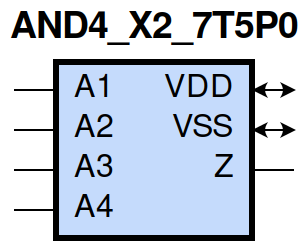
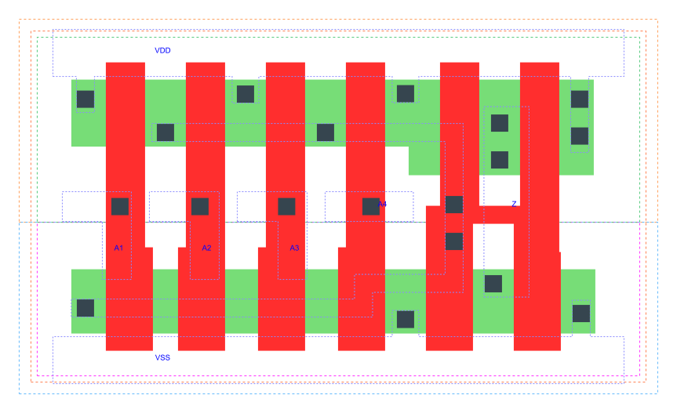

=======================================
gf180mcu_fd_sc_mcu7t5v0__and4_x2
=======================================

**gf180mcu_fd_sc_mcu7t5v0__and4_x2 symbol**

**gf180mcu_fd_sc_mcu7t5v0__and4_x2 schematic**

.. image:: sc7_sch/AND4_X2_sch.png
    :height: 300px
    :width: 500 px
    :align: center
    :alt: gf180mcu_fd_sc_mcu7t5v0__and4_x2 schematic

**gf180mcu_fd_sc_mcu7t5v0__and4_x2 layout**

.. include:: images.rst

AND4_X2 is a 4-input AND, AND(A1,A2,A3,A4), 2X drive strength

|
| Attributes

============= ======================
**Attribute** **Value**
area          28.537600 µm\ :sup:`2`
============= ======================

|
| OUTPUT FUNCTIONS

============== =============
**Output Pin** **Function**
Z              (A1&A2&A3&A4)
============== =============

|
| TRUTH TABLE FOR Z

====== ====== ====== ====== =====
**A1** **A2** **A3** **A4** **Z**
1      1      1      1      1
0      ?      ?      ?      0
?      0      ?      ?      0
?      ?      0      ?      0
?      ?      ?      0      0
====== ====== ====== ====== =====

|
| FUNCTIONAL SCHEMATIC
| |image47|
| PIN CAPACITANCE (pf)

======= ======== ====================
**Pin** **Type** **Capacitance (pf)**
A1      input    0.0042
A2      input    0.0041
A3      input    0.0041
A4      input    0.0040
======= ======== ====================

|
| DELAY AND OUTPUT TRANSITION TIME corresponding to min slew and load

+---------------+------------+--------------------+--------------+-------------------+----------------+---------------+
| **Input Pin** | **Output** | **When Condition** | **Tin (ns)** | **Out Load (pf)** | **Delay (ns)** | **Tout (ns)** |
+---------------+------------+--------------------+--------------+-------------------+----------------+---------------+
| A1(LH)        | Z(LH)      | A2&A3&A4           | 0.0100       | 0.0010            | 0.3020         | 0.0514        |
+---------------+------------+--------------------+--------------+-------------------+----------------+---------------+
| A1(HL)        | Z(HL)      | A2&A3&A4           | 0.0100       | 0.0010            | 0.2278         | 0.0391        |
+---------------+------------+--------------------+--------------+-------------------+----------------+---------------+
| A2(HL)        | Z(HL)      | A1&A3&A4           | 0.0100       | 0.0010            | 0.2534         | 0.0428        |
+---------------+------------+--------------------+--------------+-------------------+----------------+---------------+
| A2(LH)        | Z(LH)      | A1&A3&A4           | 0.0100       | 0.0010            | 0.3310         | 0.0515        |
+---------------+------------+--------------------+--------------+-------------------+----------------+---------------+
| A3(LH)        | Z(LH)      | A1&A2&A4           | 0.0100       | 0.0010            | 0.3510         | 0.0517        |
+---------------+------------+--------------------+--------------+-------------------+----------------+---------------+
| A3(HL)        | Z(HL)      | A1&A2&A4           | 0.0100       | 0.0010            | 0.2782         | 0.0462        |
+---------------+------------+--------------------+--------------+-------------------+----------------+---------------+
| A4(LH)        | Z(LH)      | A1&A2&A3           | 0.0100       | 0.0010            | 0.3624         | 0.0513        |
+---------------+------------+--------------------+--------------+-------------------+----------------+---------------+
| A4(HL)        | Z(HL)      | A1&A2&A3           | 0.0100       | 0.0010            | 0.2970         | 0.0496        |
+---------------+------------+--------------------+--------------+-------------------+----------------+---------------+

|
| DYNAMIC ENERGY

+---------------+--------------------+--------------+------------+-------------------+---------------------+
| **Input Pin** | **When Condition** | **Tin (ns)** | **Output** | **Out Load (pf)** | **Energy (uW/MHz)** |
+---------------+--------------------+--------------+------------+-------------------+---------------------+
| A3            | A1&A2&A4           | 0.0100       | Z(LH)      | 0.0010            | 0.3015              |
+---------------+--------------------+--------------+------------+-------------------+---------------------+
| A2            | A1&A3&A4           | 0.0100       | Z(HL)      | 0.0010            | 0.4432              |
+---------------+--------------------+--------------+------------+-------------------+---------------------+
| A2            | A1&A3&A4           | 0.0100       | Z(LH)      | 0.0010            | 0.3014              |
+---------------+--------------------+--------------+------------+-------------------+---------------------+
| A4            | A1&A2&A3           | 0.0100       | Z(LH)      | 0.0010            | 0.3017              |
+---------------+--------------------+--------------+------------+-------------------+---------------------+
| A1            | A2&A3&A4           | 0.0100       | Z(LH)      | 0.0010            | 0.3015              |
+---------------+--------------------+--------------+------------+-------------------+---------------------+
| A3            | A1&A2&A4           | 0.0100       | Z(HL)      | 0.0010            | 0.4988              |
+---------------+--------------------+--------------+------------+-------------------+---------------------+
| A4            | A1&A2&A3           | 0.0100       | Z(HL)      | 0.0010            | 0.5514              |
+---------------+--------------------+--------------+------------+-------------------+---------------------+
| A1            | A2&A3&A4           | 0.0100       | Z(HL)      | 0.0010            | 0.3890              |
+---------------+--------------------+--------------+------------+-------------------+---------------------+
| A3(LH)        | !A1&!A2&!A4        | 0.0100       | n/a        | n/a               | -0.0275             |
+---------------+--------------------+--------------+------------+-------------------+---------------------+
| A3(LH)        | !A1&!A2&A4         | 0.0100       | n/a        | n/a               | -0.0273             |
+---------------+--------------------+--------------+------------+-------------------+---------------------+
| A3(LH)        | !A1&A2&!A4         | 0.0100       | n/a        | n/a               | -0.0274             |
+---------------+--------------------+--------------+------------+-------------------+---------------------+
| A3(LH)        | !A1&A2&A4          | 0.0100       | n/a        | n/a               | -0.0273             |
+---------------+--------------------+--------------+------------+-------------------+---------------------+
| A3(LH)        | A1&!A2&!A4         | 0.0100       | n/a        | n/a               | -0.0275             |
+---------------+--------------------+--------------+------------+-------------------+---------------------+
| A3(LH)        | A1&!A2&A4          | 0.0100       | n/a        | n/a               | -0.0274             |
+---------------+--------------------+--------------+------------+-------------------+---------------------+
| A3(LH)        | A1&A2&!A4          | 0.0100       | n/a        | n/a               | -0.0192             |
+---------------+--------------------+--------------+------------+-------------------+---------------------+
| A2(LH)        | !A1&!A3&!A4        | 0.0100       | n/a        | n/a               | -0.0275             |
+---------------+--------------------+--------------+------------+-------------------+---------------------+
| A2(LH)        | !A1&!A3&A4         | 0.0100       | n/a        | n/a               | -0.0275             |
+---------------+--------------------+--------------+------------+-------------------+---------------------+
| A2(LH)        | !A1&A3&!A4         | 0.0100       | n/a        | n/a               | -0.0274             |
+---------------+--------------------+--------------+------------+-------------------+---------------------+
| A2(LH)        | !A1&A3&A4          | 0.0100       | n/a        | n/a               | -0.0273             |
+---------------+--------------------+--------------+------------+-------------------+---------------------+
| A2(LH)        | A1&!A3&!A4         | 0.0100       | n/a        | n/a               | -0.0177             |
+---------------+--------------------+--------------+------------+-------------------+---------------------+
| A2(LH)        | A1&!A3&A4          | 0.0100       | n/a        | n/a               | -0.0178             |
+---------------+--------------------+--------------+------------+-------------------+---------------------+
| A2(LH)        | A1&A3&!A4          | 0.0100       | n/a        | n/a               | 0.0236              |
+---------------+--------------------+--------------+------------+-------------------+---------------------+
| A1(LH)        | !A2&!A3&!A4        | 0.0100       | n/a        | n/a               | -0.0170             |
+---------------+--------------------+--------------+------------+-------------------+---------------------+
| A1(LH)        | !A2&!A3&A4         | 0.0100       | n/a        | n/a               | -0.0170             |
+---------------+--------------------+--------------+------------+-------------------+---------------------+
| A1(LH)        | !A2&A3&!A4         | 0.0100       | n/a        | n/a               | -0.0170             |
+---------------+--------------------+--------------+------------+-------------------+---------------------+
| A1(LH)        | !A2&A3&A4          | 0.0100       | n/a        | n/a               | -0.0170             |
+---------------+--------------------+--------------+------------+-------------------+---------------------+
| A1(LH)        | A2&!A3&!A4         | 0.0100       | n/a        | n/a               | 0.0246              |
+---------------+--------------------+--------------+------------+-------------------+---------------------+
| A1(LH)        | A2&!A3&A4          | 0.0100       | n/a        | n/a               | 0.0246              |
+---------------+--------------------+--------------+------------+-------------------+---------------------+
| A1(LH)        | A2&A3&!A4          | 0.0100       | n/a        | n/a               | 0.0658              |
+---------------+--------------------+--------------+------------+-------------------+---------------------+
| A3(HL)        | !A1&!A2&!A4        | 0.0100       | n/a        | n/a               | 0.0331              |
+---------------+--------------------+--------------+------------+-------------------+---------------------+
| A3(HL)        | !A1&!A2&A4         | 0.0100       | n/a        | n/a               | 0.0291              |
+---------------+--------------------+--------------+------------+-------------------+---------------------+
| A3(HL)        | !A1&A2&!A4         | 0.0100       | n/a        | n/a               | 0.0421              |
+---------------+--------------------+--------------+------------+-------------------+---------------------+
| A3(HL)        | !A1&A2&A4          | 0.0100       | n/a        | n/a               | 0.0343              |
+---------------+--------------------+--------------+------------+-------------------+---------------------+
| A3(HL)        | A1&!A2&!A4         | 0.0100       | n/a        | n/a               | 0.0372              |
+---------------+--------------------+--------------+------------+-------------------+---------------------+
| A3(HL)        | A1&!A2&A4          | 0.0100       | n/a        | n/a               | 0.0326              |
+---------------+--------------------+--------------+------------+-------------------+---------------------+
| A3(HL)        | A1&A2&!A4          | 0.0100       | n/a        | n/a               | 0.0306              |
+---------------+--------------------+--------------+------------+-------------------+---------------------+
| A4(LH)        | !A1&!A2&!A3        | 0.0100       | n/a        | n/a               | -0.0274             |
+---------------+--------------------+--------------+------------+-------------------+---------------------+
| A4(LH)        | !A1&!A2&A3         | 0.0100       | n/a        | n/a               | -0.0274             |
+---------------+--------------------+--------------+------------+-------------------+---------------------+
| A4(LH)        | !A1&A2&!A3         | 0.0100       | n/a        | n/a               | -0.0274             |
+---------------+--------------------+--------------+------------+-------------------+---------------------+
| A4(LH)        | !A1&A2&A3          | 0.0100       | n/a        | n/a               | -0.0273             |
+---------------+--------------------+--------------+------------+-------------------+---------------------+
| A4(LH)        | A1&!A2&!A3         | 0.0100       | n/a        | n/a               | -0.0274             |
+---------------+--------------------+--------------+------------+-------------------+---------------------+
| A4(LH)        | A1&!A2&A3          | 0.0100       | n/a        | n/a               | -0.0274             |
+---------------+--------------------+--------------+------------+-------------------+---------------------+
| A4(LH)        | A1&A2&!A3          | 0.0100       | n/a        | n/a               | -0.0274             |
+---------------+--------------------+--------------+------------+-------------------+---------------------+
| A1(HL)        | !A2&!A3&!A4        | 0.0100       | n/a        | n/a               | 0.0321              |
+---------------+--------------------+--------------+------------+-------------------+---------------------+
| A1(HL)        | !A2&!A3&A4         | 0.0100       | n/a        | n/a               | 0.0321              |
+---------------+--------------------+--------------+------------+-------------------+---------------------+
| A1(HL)        | !A2&A3&!A4         | 0.0100       | n/a        | n/a               | 0.0321              |
+---------------+--------------------+--------------+------------+-------------------+---------------------+
| A1(HL)        | !A2&A3&A4          | 0.0100       | n/a        | n/a               | 0.0321              |
+---------------+--------------------+--------------+------------+-------------------+---------------------+
| A1(HL)        | A2&!A3&!A4         | 0.0100       | n/a        | n/a               | 0.0319              |
+---------------+--------------------+--------------+------------+-------------------+---------------------+
| A1(HL)        | A2&!A3&A4          | 0.0100       | n/a        | n/a               | 0.0319              |
+---------------+--------------------+--------------+------------+-------------------+---------------------+
| A1(HL)        | A2&A3&!A4          | 0.0100       | n/a        | n/a               | 0.0319              |
+---------------+--------------------+--------------+------------+-------------------+---------------------+
| A2(HL)        | !A1&!A3&!A4        | 0.0100       | n/a        | n/a               | 0.0412              |
+---------------+--------------------+--------------+------------+-------------------+---------------------+
| A2(HL)        | !A1&!A3&A4         | 0.0100       | n/a        | n/a               | 0.0400              |
+---------------+--------------------+--------------+------------+-------------------+---------------------+
| A2(HL)        | !A1&A3&!A4         | 0.0100       | n/a        | n/a               | 0.0407              |
+---------------+--------------------+--------------+------------+-------------------+---------------------+
| A2(HL)        | !A1&A3&A4          | 0.0100       | n/a        | n/a               | 0.0351              |
+---------------+--------------------+--------------+------------+-------------------+---------------------+
| A2(HL)        | A1&!A3&!A4         | 0.0100       | n/a        | n/a               | 0.0317              |
+---------------+--------------------+--------------+------------+-------------------+---------------------+
| A2(HL)        | A1&!A3&A4          | 0.0100       | n/a        | n/a               | 0.0317              |
+---------------+--------------------+--------------+------------+-------------------+---------------------+
| A2(HL)        | A1&A3&!A4          | 0.0100       | n/a        | n/a               | 0.0317              |
+---------------+--------------------+--------------+------------+-------------------+---------------------+
| A4(HL)        | !A1&!A2&!A3        | 0.0100       | n/a        | n/a               | 0.0275              |
+---------------+--------------------+--------------+------------+-------------------+---------------------+
| A4(HL)        | !A1&!A2&A3         | 0.0100       | n/a        | n/a               | 0.0275              |
+---------------+--------------------+--------------+------------+-------------------+---------------------+
| A4(HL)        | !A1&A2&!A3         | 0.0100       | n/a        | n/a               | 0.0275              |
+---------------+--------------------+--------------+------------+-------------------+---------------------+
| A4(HL)        | !A1&A2&A3          | 0.0100       | n/a        | n/a               | 0.0280              |
+---------------+--------------------+--------------+------------+-------------------+---------------------+
| A4(HL)        | A1&!A2&!A3         | 0.0100       | n/a        | n/a               | 0.0275              |
+---------------+--------------------+--------------+------------+-------------------+---------------------+
| A4(HL)        | A1&!A2&A3          | 0.0100       | n/a        | n/a               | 0.0294              |
+---------------+--------------------+--------------+------------+-------------------+---------------------+
| A4(HL)        | A1&A2&!A3          | 0.0100       | n/a        | n/a               | 0.0293              |
+---------------+--------------------+--------------+------------+-------------------+---------------------+

|
| LEAKAGE POWER

================== ==============
**When Condition** **Power (nW)**
!A1&!A2&!A3&!A4    0.1282
!A1&!A2&!A3&A4     0.1282
!A1&!A2&A3&!A4     0.1282
!A1&!A2&A3&A4      0.1282
!A1&A2&!A3&!A4     0.1283
!A1&A2&!A3&A4      0.1283
!A1&A2&A3&!A4      0.1283
!A1&A2&A3&A4       0.1284
A1&!A2&!A3&!A4     0.1682
A1&!A2&!A3&A4      0.1682
A1&!A2&A3&!A4      0.1682
A1&!A2&A3&A4       0.1683
A1&A2&!A3&!A4      0.2074
A1&A2&!A3&A4       0.2075
A1&A2&A3&!A4       0.2463
A1&A2&A3&A4        0.2060
================== ==============

