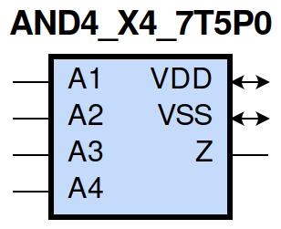

=======================================
gf180mcu_fd_sc_mcu7t5v0__and4_x4
=======================================

**gf180mcu_fd_sc_mcu7t5v0__and4_x4 symbol**

**gf180mcu_fd_sc_mcu7t5v0__and4_x4 schematic**

.. image:: sc7_sch/AND4_X4_sch.png
    :height: 300px
    :width: 500 px
    :align: center
    :alt: gf180mcu_fd_sc_mcu7t5v0__and4_x4 schematic

**gf180mcu_fd_sc_mcu7t5v0__and4_x4 layout**

.. image:: sc7_lay/AND4_X4_lay.png
    :height: 400px
    :width: 700 px
    :align: center
    :alt: gf180mcu_fd_sc_mcu7t5v0__and4_x4 layout

.. include:: images.rst

AND4_X4 is a 4-input AND, AND(A1,A2,A3,A4), 4X drive strength

|
| Attributes

============= ======================
**Attribute** **Value**
area          52.684800 µm\ :sup:`2`
============= ======================

|
| OUTPUT FUNCTIONS

============== =============
**Output Pin** **Function**
Z              (A1&A2&A3&A4)
============== =============

|
| TRUTH TABLE FOR Z

====== ====== ====== ====== =====
**A1** **A2** **A3** **A4** **Z**
1      1      1      1      1
0      ?      ?      ?      0
?      0      ?      ?      0
?      ?      0      ?      0
?      ?      ?      0      0
====== ====== ====== ====== =====

|
| FUNCTIONAL SCHEMATIC
| |image50|
| PIN CAPACITANCE (pf)

======= ======== ====================
**Pin** **Type** **Capacitance (pf)**
A4      input    0.0101
A3      input    0.0093
A1      input    0.0087
A2      input    0.0089
======= ======== ====================

|
| DELAY AND OUTPUT TRANSITION TIME corresponding to min slew and load

+---------------+------------+--------------------+--------------+-------------------+----------------+---------------+
| **Input Pin** | **Output** | **When Condition** | **Tin (ns)** | **Out Load (pf)** | **Delay (ns)** | **Tout (ns)** |
+---------------+------------+--------------------+--------------+-------------------+----------------+---------------+
| A4(LH)        | Z(LH)      | A1&A2&A3           | 0.0100       | 0.0010            | 0.3970         | 0.0534        |
+---------------+------------+--------------------+--------------+-------------------+----------------+---------------+
| A4(HL)        | Z(HL)      | A1&A2&A3           | 0.0100       | 0.0010            | 0.2261         | 0.0379        |
+---------------+------------+--------------------+--------------+-------------------+----------------+---------------+
| A3(LH)        | Z(LH)      | A1&A2&A4           | 0.0100       | 0.0010            | 0.3862         | 0.0534        |
+---------------+------------+--------------------+--------------+-------------------+----------------+---------------+
| A3(HL)        | Z(HL)      | A1&A2&A4           | 0.0100       | 0.0010            | 0.2156         | 0.0360        |
+---------------+------------+--------------------+--------------+-------------------+----------------+---------------+
| A1(LH)        | Z(LH)      | A2&A3&A4           | 0.0100       | 0.0010            | 0.3371         | 0.0534        |
+---------------+------------+--------------------+--------------+-------------------+----------------+---------------+
| A1(HL)        | Z(HL)      | A2&A3&A4           | 0.0100       | 0.0010            | 0.1838         | 0.0317        |
+---------------+------------+--------------------+--------------+-------------------+----------------+---------------+
| A2(HL)        | Z(HL)      | A1&A3&A4           | 0.0100       | 0.0010            | 0.2001         | 0.0338        |
+---------------+------------+--------------------+--------------+-------------------+----------------+---------------+
| A2(LH)        | Z(LH)      | A1&A3&A4           | 0.0100       | 0.0010            | 0.3659         | 0.0534        |
+---------------+------------+--------------------+--------------+-------------------+----------------+---------------+

|
| DYNAMIC ENERGY

+---------------+--------------------+--------------+------------+-------------------+---------------------+
| **Input Pin** | **When Condition** | **Tin (ns)** | **Output** | **Out Load (pf)** | **Energy (uW/MHz)** |
+---------------+--------------------+--------------+------------+-------------------+---------------------+
| A3            | A1&A2&A4           | 0.0100       | Z(LH)      | 0.0010            | 0.6223              |
+---------------+--------------------+--------------+------------+-------------------+---------------------+
| A2            | A1&A3&A4           | 0.0100       | Z(HL)      | 0.0010            | 0.7399              |
+---------------+--------------------+--------------+------------+-------------------+---------------------+
| A2            | A1&A3&A4           | 0.0100       | Z(LH)      | 0.0010            | 0.6221              |
+---------------+--------------------+--------------+------------+-------------------+---------------------+
| A4            | A1&A2&A3           | 0.0100       | Z(LH)      | 0.0010            | 0.6220              |
+---------------+--------------------+--------------+------------+-------------------+---------------------+
| A1            | A2&A3&A4           | 0.0100       | Z(LH)      | 0.0010            | 0.6225              |
+---------------+--------------------+--------------+------------+-------------------+---------------------+
| A3            | A1&A2&A4           | 0.0100       | Z(HL)      | 0.0010            | 0.8205              |
+---------------+--------------------+--------------+------------+-------------------+---------------------+
| A4            | A1&A2&A3           | 0.0100       | Z(HL)      | 0.0010            | 0.8949              |
+---------------+--------------------+--------------+------------+-------------------+---------------------+
| A1            | A2&A3&A4           | 0.0100       | Z(HL)      | 0.0010            | 0.6624              |
+---------------+--------------------+--------------+------------+-------------------+---------------------+
| A3(LH)        | !A1&!A2&!A4        | 0.0100       | n/a        | n/a               | -0.0715             |
+---------------+--------------------+--------------+------------+-------------------+---------------------+
| A3(LH)        | !A1&!A2&A4         | 0.0100       | n/a        | n/a               | -0.0713             |
+---------------+--------------------+--------------+------------+-------------------+---------------------+
| A3(LH)        | !A1&A2&!A4         | 0.0100       | n/a        | n/a               | -0.0714             |
+---------------+--------------------+--------------+------------+-------------------+---------------------+
| A3(LH)        | !A1&A2&A4          | 0.0100       | n/a        | n/a               | -0.0712             |
+---------------+--------------------+--------------+------------+-------------------+---------------------+
| A3(LH)        | A1&!A2&!A4         | 0.0100       | n/a        | n/a               | -0.0715             |
+---------------+--------------------+--------------+------------+-------------------+---------------------+
| A3(LH)        | A1&!A2&A4          | 0.0100       | n/a        | n/a               | -0.0713             |
+---------------+--------------------+--------------+------------+-------------------+---------------------+
| A3(LH)        | A1&A2&!A4          | 0.0100       | n/a        | n/a               | -0.0585             |
+---------------+--------------------+--------------+------------+-------------------+---------------------+
| A2(LH)        | !A1&!A3&!A4        | 0.0100       | n/a        | n/a               | -0.0715             |
+---------------+--------------------+--------------+------------+-------------------+---------------------+
| A2(LH)        | !A1&!A3&A4         | 0.0100       | n/a        | n/a               | -0.0714             |
+---------------+--------------------+--------------+------------+-------------------+---------------------+
| A2(LH)        | !A1&A3&!A4         | 0.0100       | n/a        | n/a               | -0.0714             |
+---------------+--------------------+--------------+------------+-------------------+---------------------+
| A2(LH)        | !A1&A3&A4          | 0.0100       | n/a        | n/a               | -0.0711             |
+---------------+--------------------+--------------+------------+-------------------+---------------------+
| A2(LH)        | A1&!A3&!A4         | 0.0100       | n/a        | n/a               | -0.0550             |
+---------------+--------------------+--------------+------------+-------------------+---------------------+
| A2(LH)        | A1&!A3&A4          | 0.0100       | n/a        | n/a               | -0.0550             |
+---------------+--------------------+--------------+------------+-------------------+---------------------+
| A2(LH)        | A1&A3&!A4          | 0.0100       | n/a        | n/a               | 0.0101              |
+---------------+--------------------+--------------+------------+-------------------+---------------------+
| A1(LH)        | !A2&!A3&!A4        | 0.0100       | n/a        | n/a               | -0.0544             |
+---------------+--------------------+--------------+------------+-------------------+---------------------+
| A1(LH)        | !A2&!A3&A4         | 0.0100       | n/a        | n/a               | -0.0544             |
+---------------+--------------------+--------------+------------+-------------------+---------------------+
| A1(LH)        | !A2&A3&!A4         | 0.0100       | n/a        | n/a               | -0.0544             |
+---------------+--------------------+--------------+------------+-------------------+---------------------+
| A1(LH)        | !A2&A3&A4          | 0.0100       | n/a        | n/a               | -0.0544             |
+---------------+--------------------+--------------+------------+-------------------+---------------------+
| A1(LH)        | A2&!A3&!A4         | 0.0100       | n/a        | n/a               | 0.0124              |
+---------------+--------------------+--------------+------------+-------------------+---------------------+
| A1(LH)        | A2&!A3&A4          | 0.0100       | n/a        | n/a               | 0.0125              |
+---------------+--------------------+--------------+------------+-------------------+---------------------+
| A1(LH)        | A2&A3&!A4          | 0.0100       | n/a        | n/a               | 0.0773              |
+---------------+--------------------+--------------+------------+-------------------+---------------------+
| A3(HL)        | !A1&!A2&!A4        | 0.0100       | n/a        | n/a               | 0.0804              |
+---------------+--------------------+--------------+------------+-------------------+---------------------+
| A3(HL)        | !A1&!A2&A4         | 0.0100       | n/a        | n/a               | 0.0741              |
+---------------+--------------------+--------------+------------+-------------------+---------------------+
| A3(HL)        | !A1&A2&!A4         | 0.0100       | n/a        | n/a               | 0.0948              |
+---------------+--------------------+--------------+------------+-------------------+---------------------+
| A3(HL)        | !A1&A2&A4          | 0.0100       | n/a        | n/a               | 0.0823              |
+---------------+--------------------+--------------+------------+-------------------+---------------------+
| A3(HL)        | A1&!A2&!A4         | 0.0100       | n/a        | n/a               | 0.0871              |
+---------------+--------------------+--------------+------------+-------------------+---------------------+
| A3(HL)        | A1&!A2&A4          | 0.0100       | n/a        | n/a               | 0.0797              |
+---------------+--------------------+--------------+------------+-------------------+---------------------+
| A3(HL)        | A1&A2&!A4          | 0.0100       | n/a        | n/a               | 0.0764              |
+---------------+--------------------+--------------+------------+-------------------+---------------------+
| A4(LH)        | !A1&!A2&!A3        | 0.0100       | n/a        | n/a               | -0.0713             |
+---------------+--------------------+--------------+------------+-------------------+---------------------+
| A4(LH)        | !A1&!A2&A3         | 0.0100       | n/a        | n/a               | -0.0712             |
+---------------+--------------------+--------------+------------+-------------------+---------------------+
| A4(LH)        | !A1&A2&!A3         | 0.0100       | n/a        | n/a               | -0.0713             |
+---------------+--------------------+--------------+------------+-------------------+---------------------+
| A4(LH)        | !A1&A2&A3          | 0.0100       | n/a        | n/a               | -0.0712             |
+---------------+--------------------+--------------+------------+-------------------+---------------------+
| A4(LH)        | A1&!A2&!A3         | 0.0100       | n/a        | n/a               | -0.0713             |
+---------------+--------------------+--------------+------------+-------------------+---------------------+
| A4(LH)        | A1&!A2&A3          | 0.0100       | n/a        | n/a               | -0.0712             |
+---------------+--------------------+--------------+------------+-------------------+---------------------+
| A4(LH)        | A1&A2&!A3          | 0.0100       | n/a        | n/a               | -0.0713             |
+---------------+--------------------+--------------+------------+-------------------+---------------------+
| A1(HL)        | !A2&!A3&!A4        | 0.0100       | n/a        | n/a               | 0.0789              |
+---------------+--------------------+--------------+------------+-------------------+---------------------+
| A1(HL)        | !A2&!A3&A4         | 0.0100       | n/a        | n/a               | 0.0789              |
+---------------+--------------------+--------------+------------+-------------------+---------------------+
| A1(HL)        | !A2&A3&!A4         | 0.0100       | n/a        | n/a               | 0.0789              |
+---------------+--------------------+--------------+------------+-------------------+---------------------+
| A1(HL)        | !A2&A3&A4          | 0.0100       | n/a        | n/a               | 0.0789              |
+---------------+--------------------+--------------+------------+-------------------+---------------------+
| A1(HL)        | A2&!A3&!A4         | 0.0100       | n/a        | n/a               | 0.0787              |
+---------------+--------------------+--------------+------------+-------------------+---------------------+
| A1(HL)        | A2&!A3&A4          | 0.0100       | n/a        | n/a               | 0.0786              |
+---------------+--------------------+--------------+------------+-------------------+---------------------+
| A1(HL)        | A2&A3&!A4          | 0.0100       | n/a        | n/a               | 0.0786              |
+---------------+--------------------+--------------+------------+-------------------+---------------------+
| A2(HL)        | !A1&!A3&!A4        | 0.0100       | n/a        | n/a               | 0.0934              |
+---------------+--------------------+--------------+------------+-------------------+---------------------+
| A2(HL)        | !A1&!A3&A4         | 0.0100       | n/a        | n/a               | 0.0915              |
+---------------+--------------------+--------------+------------+-------------------+---------------------+
| A2(HL)        | !A1&A3&!A4         | 0.0100       | n/a        | n/a               | 0.0927              |
+---------------+--------------------+--------------+------------+-------------------+---------------------+
| A2(HL)        | !A1&A3&A4          | 0.0100       | n/a        | n/a               | 0.0836              |
+---------------+--------------------+--------------+------------+-------------------+---------------------+
| A2(HL)        | A1&!A3&!A4         | 0.0100       | n/a        | n/a               | 0.0783              |
+---------------+--------------------+--------------+------------+-------------------+---------------------+
| A2(HL)        | A1&!A3&A4          | 0.0100       | n/a        | n/a               | 0.0783              |
+---------------+--------------------+--------------+------------+-------------------+---------------------+
| A2(HL)        | A1&A3&!A4          | 0.0100       | n/a        | n/a               | 0.0783              |
+---------------+--------------------+--------------+------------+-------------------+---------------------+
| A4(HL)        | !A1&!A2&!A3        | 0.0100       | n/a        | n/a               | 0.0717              |
+---------------+--------------------+--------------+------------+-------------------+---------------------+
| A4(HL)        | !A1&!A2&A3         | 0.0100       | n/a        | n/a               | 0.0716              |
+---------------+--------------------+--------------+------------+-------------------+---------------------+
| A4(HL)        | !A1&A2&!A3         | 0.0100       | n/a        | n/a               | 0.0716              |
+---------------+--------------------+--------------+------------+-------------------+---------------------+
| A4(HL)        | !A1&A2&A3          | 0.0100       | n/a        | n/a               | 0.0724              |
+---------------+--------------------+--------------+------------+-------------------+---------------------+
| A4(HL)        | A1&!A2&!A3         | 0.0100       | n/a        | n/a               | 0.0716              |
+---------------+--------------------+--------------+------------+-------------------+---------------------+
| A4(HL)        | A1&!A2&A3          | 0.0100       | n/a        | n/a               | 0.0747              |
+---------------+--------------------+--------------+------------+-------------------+---------------------+
| A4(HL)        | A1&A2&!A3          | 0.0100       | n/a        | n/a               | 0.0744              |
+---------------+--------------------+--------------+------------+-------------------+---------------------+

|
| LEAKAGE POWER

================== ==============
**When Condition** **Power (nW)**
!A1&!A2&!A3&!A4    0.2064
!A1&!A2&!A3&A4     0.2064
!A1&!A2&A3&!A4     0.2064
!A1&!A2&A3&A4      0.2064
!A1&A2&!A3&!A4     0.2065
!A1&A2&!A3&A4      0.2065
!A1&A2&A3&!A4      0.2066
!A1&A2&A3&A4       0.2069
A1&!A2&!A3&!A4     0.2866
A1&!A2&!A3&A4      0.2866
A1&!A2&A3&!A4      0.2867
A1&!A2&A3&A4       0.2869
A1&A2&!A3&!A4      0.3652
A1&A2&!A3&A4       0.3655
A1&A2&A3&!A4       0.4432
A1&A2&A3&A4        0.3632
================== ==============

