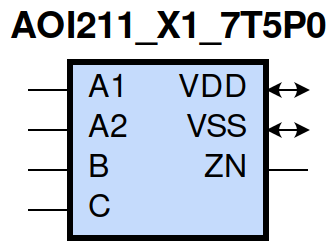
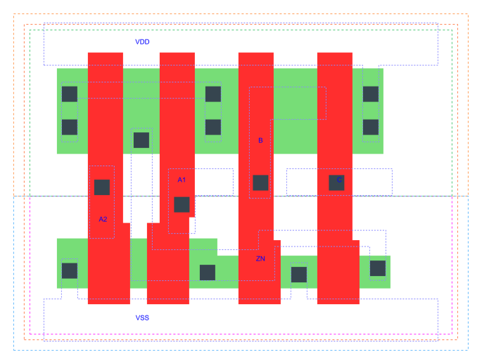

=======================================
gf180mcu_fd_sc_mcu7t5v0__aoi211_x1
=======================================

**gf180mcu_fd_sc_mcu7t5v0__aoi211_x1 symbol**

**gf180mcu_fd_sc_mcu7t5v0__aoi211_x1 schematic**

.. image:: sc7_sch/AOI211_X1_sch.png
    :height: 300px
    :width: 500 px
    :align: center
    :alt: gf180mcu_fd_sc_mcu7t5v0__aoi211_x1 schematic

**gf180mcu_fd_sc_mcu7t5v0__aoi211_x1 layout**

.. include:: images.rst

AOI211_X1 is a 2-input AND into 3-input NOR, NOR[AND(A1,A2),B,C], 1X drive strength

|
| Attributes

============= ======================
**Attribute** **Value**
area          21.952000 µm\ :sup:`2`
============= ======================

|
| OUTPUT FUNCTIONS

============== =====================================
**Output Pin** **Function**
ZN             (((!A1)&(!B)&(!C))|((!A2)&(!B)&(!C)))
============== =====================================

|
| TRUTH TABLE FOR ZN

====== ====== ===== ===== ======
**A1** **A2** **B** **C** **ZN**
0      ?      0     0     1
?      0      0     0     1
1      1      ?     ?     0
?      ?      1     ?     0
?      ?      ?     1     0
====== ====== ===== ===== ======

|
| FUNCTIONAL SCHEMATIC
| |image56|
| PIN CAPACITANCE (pf)

======= ======== ====================
**Pin** **Type** **Capacitance (pf)**
A2      input    0.0045
A1      input    0.0047
B       input    0.0040
C       input    0.0039
======= ======== ====================

|
| DELAY AND OUTPUT TRANSITION TIME corresponding to min slew and load

+---------------+------------+--------------------+--------------+-------------------+----------------+---------------+
| **Input Pin** | **Output** | **When Condition** | **Tin (ns)** | **Out Load (pf)** | **Delay (ns)** | **Tout (ns)** |
+---------------+------------+--------------------+--------------+-------------------+----------------+---------------+
| A2(HL)        | ZN(LH)     | A1&!B&!C           | 0.0100       | 0.0010            | 0.1811         | 0.1872        |
+---------------+------------+--------------------+--------------+-------------------+----------------+---------------+
| A2(LH)        | ZN(HL)     | A1&!B&!C           | 0.0100       | 0.0010            | 0.0915         | 0.0502        |
+---------------+------------+--------------------+--------------+-------------------+----------------+---------------+
| A1(HL)        | ZN(LH)     | A2&!B&!C           | 0.0100       | 0.0010            | 0.1446         | 0.1477        |
+---------------+------------+--------------------+--------------+-------------------+----------------+---------------+
| A1(LH)        | ZN(HL)     | A2&!B&!C           | 0.0100       | 0.0010            | 0.0806         | 0.0502        |
+---------------+------------+--------------------+--------------+-------------------+----------------+---------------+
| B(LH)         | ZN(HL)     | !A1&!A2&!C         | 0.0100       | 0.0010            | 0.1359         | 0.0837        |
+---------------+------------+--------------------+--------------+-------------------+----------------+---------------+
| B(LH)         | ZN(HL)     | !A1&A2&!C          | 0.0100       | 0.0010            | 0.1138         | 0.0737        |
+---------------+------------+--------------------+--------------+-------------------+----------------+---------------+
| B(LH)         | ZN(HL)     | A1&!A2&!C          | 0.0100       | 0.0010            | 0.1232         | 0.0912        |
+---------------+------------+--------------------+--------------+-------------------+----------------+---------------+
| B(HL)         | ZN(LH)     | !A1&!A2&!C         | 0.0100       | 0.0010            | 0.2075         | 0.1633        |
+---------------+------------+--------------------+--------------+-------------------+----------------+---------------+
| B(HL)         | ZN(LH)     | !A1&A2&!C          | 0.0100       | 0.0010            | 0.2343         | 0.1570        |
+---------------+------------+--------------------+--------------+-------------------+----------------+---------------+
| B(HL)         | ZN(LH)     | A1&!A2&!C          | 0.0100       | 0.0010            | 0.2817         | 0.1931        |
+---------------+------------+--------------------+--------------+-------------------+----------------+---------------+
| C(HL)         | ZN(LH)     | !A1&!A2&!B         | 0.0100       | 0.0010            | 0.2322         | 0.1630        |
+---------------+------------+--------------------+--------------+-------------------+----------------+---------------+
| C(HL)         | ZN(LH)     | !A1&A2&!B          | 0.0100       | 0.0010            | 0.2588         | 0.1572        |
+---------------+------------+--------------------+--------------+-------------------+----------------+---------------+
| C(HL)         | ZN(LH)     | A1&!A2&!B          | 0.0100       | 0.0010            | 0.3061         | 0.1933        |
+---------------+------------+--------------------+--------------+-------------------+----------------+---------------+
| C(LH)         | ZN(HL)     | !A1&!A2&!B         | 0.0100       | 0.0010            | 0.1514         | 0.0992        |
+---------------+------------+--------------------+--------------+-------------------+----------------+---------------+
| C(LH)         | ZN(HL)     | !A1&A2&!B          | 0.0100       | 0.0010            | 0.1206         | 0.0874        |
+---------------+------------+--------------------+--------------+-------------------+----------------+---------------+
| C(LH)         | ZN(HL)     | A1&!A2&!B          | 0.0100       | 0.0010            | 0.1322         | 0.1073        |
+---------------+------------+--------------------+--------------+-------------------+----------------+---------------+

|
| DYNAMIC ENERGY

+---------------+--------------------+--------------+------------+-------------------+---------------------+
| **Input Pin** | **When Condition** | **Tin (ns)** | **Output** | **Out Load (pf)** | **Energy (uW/MHz)** |
+---------------+--------------------+--------------+------------+-------------------+---------------------+
| C             | !A1&!A2&!B         | 0.0100       | ZN(LH)     | 0.0010            | 0.2371              |
+---------------+--------------------+--------------+------------+-------------------+---------------------+
| C             | !A1&A2&!B          | 0.0100       | ZN(LH)     | 0.0010            | 0.2151              |
+---------------+--------------------+--------------+------------+-------------------+---------------------+
| C             | A1&!A2&!B          | 0.0100       | ZN(LH)     | 0.0010            | 0.2503              |
+---------------+--------------------+--------------+------------+-------------------+---------------------+
| C             | !A1&!A2&!B         | 0.0100       | ZN(HL)     | 0.0010            | 0.0755              |
+---------------+--------------------+--------------+------------+-------------------+---------------------+
| C             | !A1&A2&!B          | 0.0100       | ZN(HL)     | 0.0010            | 0.0693              |
+---------------+--------------------+--------------+------------+-------------------+---------------------+
| C             | A1&!A2&!B          | 0.0100       | ZN(HL)     | 0.0010            | 0.0693              |
+---------------+--------------------+--------------+------------+-------------------+---------------------+
| A1            | A2&!B&!C           | 0.0100       | ZN(LH)     | 0.0010            | 0.1432              |
+---------------+--------------------+--------------+------------+-------------------+---------------------+
| B             | !A1&!A2&!C         | 0.0100       | ZN(HL)     | 0.0010            | 0.0532              |
+---------------+--------------------+--------------+------------+-------------------+---------------------+
| B             | !A1&A2&!C          | 0.0100       | ZN(HL)     | 0.0010            | 0.0466              |
+---------------+--------------------+--------------+------------+-------------------+---------------------+
| B             | A1&!A2&!C          | 0.0100       | ZN(HL)     | 0.0010            | 0.0466              |
+---------------+--------------------+--------------+------------+-------------------+---------------------+
| A2            | A1&!B&!C           | 0.0100       | ZN(LH)     | 0.0010            | 0.1733              |
+---------------+--------------------+--------------+------------+-------------------+---------------------+
| A1            | A2&!B&!C           | 0.0100       | ZN(HL)     | 0.0010            | 0.0044              |
+---------------+--------------------+--------------+------------+-------------------+---------------------+
| B             | !A1&!A2&!C         | 0.0100       | ZN(LH)     | 0.0010            | 0.2080              |
+---------------+--------------------+--------------+------------+-------------------+---------------------+
| B             | !A1&A2&!C          | 0.0100       | ZN(LH)     | 0.0010            | 0.1860              |
+---------------+--------------------+--------------+------------+-------------------+---------------------+
| B             | A1&!A2&!C          | 0.0100       | ZN(LH)     | 0.0010            | 0.2212              |
+---------------+--------------------+--------------+------------+-------------------+---------------------+
| A2            | A1&!B&!C           | 0.0100       | ZN(HL)     | 0.0010            | 0.0044              |
+---------------+--------------------+--------------+------------+-------------------+---------------------+
| B(HL)         | !A1&!A2&C          | 0.0100       | n/a        | n/a               | 0.0259              |
+---------------+--------------------+--------------+------------+-------------------+---------------------+
| B(HL)         | !A1&A2&C           | 0.0100       | n/a        | n/a               | 0.0258              |
+---------------+--------------------+--------------+------------+-------------------+---------------------+
| B(HL)         | A1&!A2&C           | 0.0100       | n/a        | n/a               | 0.0258              |
+---------------+--------------------+--------------+------------+-------------------+---------------------+
| B(HL)         | A1&A2&!C           | 0.0100       | n/a        | n/a               | 0.0391              |
+---------------+--------------------+--------------+------------+-------------------+---------------------+
| B(HL)         | A1&A2&C            | 0.0100       | n/a        | n/a               | 0.0229              |
+---------------+--------------------+--------------+------------+-------------------+---------------------+
| A2(LH)        | !A1&!B&!C          | 0.0100       | n/a        | n/a               | -0.0397             |
+---------------+--------------------+--------------+------------+-------------------+---------------------+
| A2(LH)        | !A1&!B&C           | 0.0100       | n/a        | n/a               | -0.0096             |
+---------------+--------------------+--------------+------------+-------------------+---------------------+
| A2(LH)        | !A1&B&!C           | 0.0100       | n/a        | n/a               | -0.0095             |
+---------------+--------------------+--------------+------------+-------------------+---------------------+
| A2(LH)        | !A1&B&C            | 0.0100       | n/a        | n/a               | -0.0095             |
+---------------+--------------------+--------------+------------+-------------------+---------------------+
| A2(LH)        | A1&!B&C            | 0.0100       | n/a        | n/a               | -0.0105             |
+---------------+--------------------+--------------+------------+-------------------+---------------------+
| A2(LH)        | A1&B&!C            | 0.0100       | n/a        | n/a               | -0.0103             |
+---------------+--------------------+--------------+------------+-------------------+---------------------+
| A2(LH)        | A1&B&C             | 0.0100       | n/a        | n/a               | -0.0104             |
+---------------+--------------------+--------------+------------+-------------------+---------------------+
| A1(LH)        | !A2&!B&!C          | 0.0100       | n/a        | n/a               | -0.0315             |
+---------------+--------------------+--------------+------------+-------------------+---------------------+
| A1(LH)        | !A2&!B&C           | 0.0100       | n/a        | n/a               | -0.0096             |
+---------------+--------------------+--------------+------------+-------------------+---------------------+
| A1(LH)        | !A2&B&!C           | 0.0100       | n/a        | n/a               | -0.0095             |
+---------------+--------------------+--------------+------------+-------------------+---------------------+
| A1(LH)        | !A2&B&C            | 0.0100       | n/a        | n/a               | -0.0095             |
+---------------+--------------------+--------------+------------+-------------------+---------------------+
| A1(LH)        | A2&!B&C            | 0.0100       | n/a        | n/a               | -0.0105             |
+---------------+--------------------+--------------+------------+-------------------+---------------------+
| A1(LH)        | A2&B&!C            | 0.0100       | n/a        | n/a               | -0.0103             |
+---------------+--------------------+--------------+------------+-------------------+---------------------+
| A1(LH)        | A2&B&C             | 0.0100       | n/a        | n/a               | -0.0103             |
+---------------+--------------------+--------------+------------+-------------------+---------------------+
| C(HL)         | !A1&!A2&B          | 0.0100       | n/a        | n/a               | 0.0391              |
+---------------+--------------------+--------------+------------+-------------------+---------------------+
| C(HL)         | !A1&A2&B           | 0.0100       | n/a        | n/a               | 0.0391              |
+---------------+--------------------+--------------+------------+-------------------+---------------------+
| C(HL)         | A1&!A2&B           | 0.0100       | n/a        | n/a               | 0.0391              |
+---------------+--------------------+--------------+------------+-------------------+---------------------+
| C(HL)         | A1&A2&!B           | 0.0100       | n/a        | n/a               | 0.0390              |
+---------------+--------------------+--------------+------------+-------------------+---------------------+
| C(HL)         | A1&A2&B            | 0.0100       | n/a        | n/a               | 0.0391              |
+---------------+--------------------+--------------+------------+-------------------+---------------------+
| A2(HL)        | !A1&!B&!C          | 0.0100       | n/a        | n/a               | 0.0430              |
+---------------+--------------------+--------------+------------+-------------------+---------------------+
| A2(HL)        | !A1&!B&C           | 0.0100       | n/a        | n/a               | 0.0102              |
+---------------+--------------------+--------------+------------+-------------------+---------------------+
| A2(HL)        | !A1&B&!C           | 0.0100       | n/a        | n/a               | 0.0102              |
+---------------+--------------------+--------------+------------+-------------------+---------------------+
| A2(HL)        | !A1&B&C            | 0.0100       | n/a        | n/a               | 0.0102              |
+---------------+--------------------+--------------+------------+-------------------+---------------------+
| A2(HL)        | A1&!B&C            | 0.0100       | n/a        | n/a               | 0.0696              |
+---------------+--------------------+--------------+------------+-------------------+---------------------+
| A2(HL)        | A1&B&!C            | 0.0100       | n/a        | n/a               | 0.0435              |
+---------------+--------------------+--------------+------------+-------------------+---------------------+
| A2(HL)        | A1&B&C             | 0.0100       | n/a        | n/a               | 0.0435              |
+---------------+--------------------+--------------+------------+-------------------+---------------------+
| B(LH)         | !A1&!A2&C          | 0.0100       | n/a        | n/a               | -0.0127             |
+---------------+--------------------+--------------+------------+-------------------+---------------------+
| B(LH)         | !A1&A2&C           | 0.0100       | n/a        | n/a               | -0.0127             |
+---------------+--------------------+--------------+------------+-------------------+---------------------+
| B(LH)         | A1&!A2&C           | 0.0100       | n/a        | n/a               | -0.0127             |
+---------------+--------------------+--------------+------------+-------------------+---------------------+
| B(LH)         | A1&A2&!C           | 0.0100       | n/a        | n/a               | -0.0286             |
+---------------+--------------------+--------------+------------+-------------------+---------------------+
| B(LH)         | A1&A2&C            | 0.0100       | n/a        | n/a               | -0.0231             |
+---------------+--------------------+--------------+------------+-------------------+---------------------+
| A1(HL)        | !A2&!B&!C          | 0.0100       | n/a        | n/a               | 0.0435              |
+---------------+--------------------+--------------+------------+-------------------+---------------------+
| A1(HL)        | !A2&!B&C           | 0.0100       | n/a        | n/a               | 0.0102              |
+---------------+--------------------+--------------+------------+-------------------+---------------------+
| A1(HL)        | !A2&B&!C           | 0.0100       | n/a        | n/a               | 0.0102              |
+---------------+--------------------+--------------+------------+-------------------+---------------------+
| A1(HL)        | !A2&B&C            | 0.0100       | n/a        | n/a               | 0.0102              |
+---------------+--------------------+--------------+------------+-------------------+---------------------+
| A1(HL)        | A2&!B&C            | 0.0100       | n/a        | n/a               | 0.0695              |
+---------------+--------------------+--------------+------------+-------------------+---------------------+
| A1(HL)        | A2&B&!C            | 0.0100       | n/a        | n/a               | 0.0435              |
+---------------+--------------------+--------------+------------+-------------------+---------------------+
| A1(HL)        | A2&B&C             | 0.0100       | n/a        | n/a               | 0.0435              |
+---------------+--------------------+--------------+------------+-------------------+---------------------+
| C(LH)         | !A1&!A2&B          | 0.0100       | n/a        | n/a               | -0.0346             |
+---------------+--------------------+--------------+------------+-------------------+---------------------+
| C(LH)         | !A1&A2&B           | 0.0100       | n/a        | n/a               | -0.0346             |
+---------------+--------------------+--------------+------------+-------------------+---------------------+
| C(LH)         | A1&!A2&B           | 0.0100       | n/a        | n/a               | -0.0346             |
+---------------+--------------------+--------------+------------+-------------------+---------------------+
| C(LH)         | A1&A2&!B           | 0.0100       | n/a        | n/a               | -0.0326             |
+---------------+--------------------+--------------+------------+-------------------+---------------------+
| C(LH)         | A1&A2&B            | 0.0100       | n/a        | n/a               | -0.0365             |
+---------------+--------------------+--------------+------------+-------------------+---------------------+

|
| LEAKAGE POWER

================== ==============
**When Condition** **Power (nW)**
!A1&!A2&!B&!C      0.1267
!A1&A2&!B&!C       0.1269
A1&!A2&!B&!C       0.1669
!A1&!A2&!B&C       0.1906
!A1&!A2&B&!C       0.1553
!A1&!A2&B&C        0.1553
!A1&A2&!B&C        0.1929
!A1&A2&B&!C        0.1576
!A1&A2&B&C         0.1576
A1&!A2&!B&C        0.1929
A1&!A2&B&!C        0.1576
A1&!A2&B&C         0.1576
A1&A2&!B&!C        0.1030
A1&A2&!B&C         0.1029
A1&A2&B&!C         0.1029
A1&A2&B&C          0.1029
================== ==============

