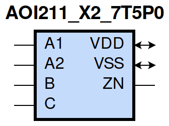
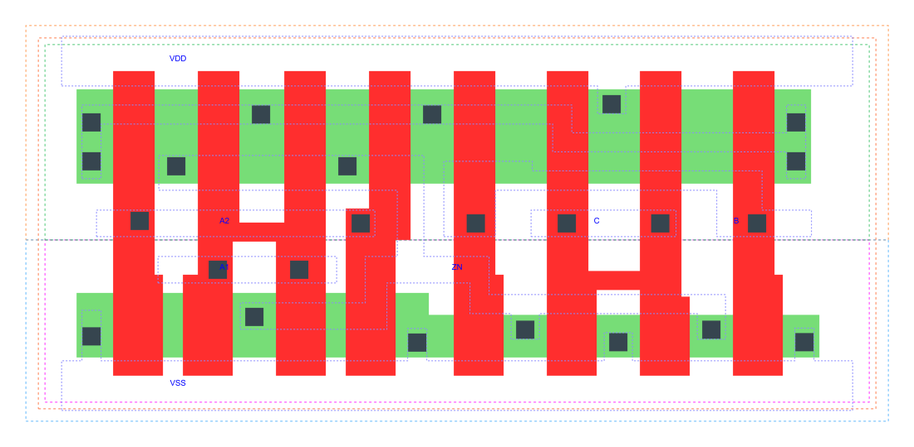

=======================================
gf180mcu_fd_sc_mcu7t5v0__aoi211_x2
=======================================

**gf180mcu_fd_sc_mcu7t5v0__aoi211_x2 symbol**

**gf180mcu_fd_sc_mcu7t5v0__aoi211_x2 schematic**

.. image:: sc7_sch/AOI211_X2_sch.png
    :height: 300px
    :width: 500 px
    :align: center
    :alt: gf180mcu_fd_sc_mcu7t5v0__aoi211_x2 schematic

**gf180mcu_fd_sc_mcu7t5v0__aoi211_x2 layout**

.. include:: images.rst

AOI211_X2 is a 2-input AND into 3-input NOR, NOR[AND(A1,A2),B,C], 2X drive strength

|
| Attributes

============= ======================
**Attribute** **Value**
area          37.318400 µm\ :sup:`2`
============= ======================

|
| OUTPUT FUNCTIONS

============== =====================================
**Output Pin** **Function**
ZN             (((!A1)&(!B)&(!C))|((!A2)&(!B)&(!C)))
============== =====================================

|
| TRUTH TABLE FOR ZN

====== ====== ===== ===== ======
**A1** **A2** **B** **C** **ZN**
0      ?      0     0     1
?      0      0     0     1
1      1      ?     ?     0
?      ?      1     ?     0
?      ?      ?     1     0
====== ====== ===== ===== ======

|
| FUNCTIONAL SCHEMATIC
| |image59|
| PIN CAPACITANCE (pf)

======= ======== ====================
**Pin** **Type** **Capacitance (pf)**
A2      input    0.0096
A1      input    0.0091
B       input    0.0085
C       input    0.0075
======= ======== ====================

|
| DELAY AND OUTPUT TRANSITION TIME corresponding to min slew and load

+---------------+------------+--------------------+--------------+-------------------+----------------+---------------+
| **Input Pin** | **Output** | **When Condition** | **Tin (ns)** | **Out Load (pf)** | **Delay (ns)** | **Tout (ns)** |
+---------------+------------+--------------------+--------------+-------------------+----------------+---------------+
| A2(HL)        | ZN(LH)     | A1&!B&!C           | 0.0100       | 0.0010            | 0.1728         | 0.1794        |
+---------------+------------+--------------------+--------------+-------------------+----------------+---------------+
| A2(LH)        | ZN(HL)     | A1&!B&!C           | 0.0100       | 0.0010            | 0.0761         | 0.0390        |
+---------------+------------+--------------------+--------------+-------------------+----------------+---------------+
| A1(HL)        | ZN(LH)     | A2&!B&!C           | 0.0100       | 0.0010            | 0.1297         | 0.1327        |
+---------------+------------+--------------------+--------------+-------------------+----------------+---------------+
| A1(LH)        | ZN(HL)     | A2&!B&!C           | 0.0100       | 0.0010            | 0.0652         | 0.0390        |
+---------------+------------+--------------------+--------------+-------------------+----------------+---------------+
| B(LH)         | ZN(HL)     | !A1&!A2&!C         | 0.0100       | 0.0010            | 0.1133         | 0.0688        |
+---------------+------------+--------------------+--------------+-------------------+----------------+---------------+
| B(LH)         | ZN(HL)     | !A1&A2&!C          | 0.0100       | 0.0010            | 0.0923         | 0.0599        |
+---------------+------------+--------------------+--------------+-------------------+----------------+---------------+
| B(LH)         | ZN(HL)     | A1&!A2&!C          | 0.0100       | 0.0010            | 0.1015         | 0.0782        |
+---------------+------------+--------------------+--------------+-------------------+----------------+---------------+
| B(HL)         | ZN(LH)     | !A1&!A2&!C         | 0.0100       | 0.0010            | 0.2020         | 0.1554        |
+---------------+------------+--------------------+--------------+-------------------+----------------+---------------+
| B(HL)         | ZN(LH)     | !A1&A2&!C          | 0.0100       | 0.0010            | 0.2278         | 0.1462        |
+---------------+------------+--------------------+--------------+-------------------+----------------+---------------+
| B(HL)         | ZN(LH)     | A1&!A2&!C          | 0.0100       | 0.0010            | 0.2833         | 0.1878        |
+---------------+------------+--------------------+--------------+-------------------+----------------+---------------+
| C(HL)         | ZN(LH)     | !A1&!A2&!B         | 0.0100       | 0.0010            | 0.2267         | 0.1555        |
+---------------+------------+--------------------+--------------+-------------------+----------------+---------------+
| C(HL)         | ZN(LH)     | !A1&A2&!B          | 0.0100       | 0.0010            | 0.2525         | 0.1463        |
+---------------+------------+--------------------+--------------+-------------------+----------------+---------------+
| C(HL)         | ZN(LH)     | A1&!A2&!B          | 0.0100       | 0.0010            | 0.3080         | 0.1878        |
+---------------+------------+--------------------+--------------+-------------------+----------------+---------------+
| C(LH)         | ZN(HL)     | !A1&!A2&!B         | 0.0100       | 0.0010            | 0.1243         | 0.0817        |
+---------------+------------+--------------------+--------------+-------------------+----------------+---------------+
| C(LH)         | ZN(HL)     | !A1&A2&!B          | 0.0100       | 0.0010            | 0.0951         | 0.0700        |
+---------------+------------+--------------------+--------------+-------------------+----------------+---------------+
| C(LH)         | ZN(HL)     | A1&!A2&!B          | 0.0100       | 0.0010            | 0.1065         | 0.0906        |
+---------------+------------+--------------------+--------------+-------------------+----------------+---------------+

|
| DYNAMIC ENERGY

+---------------+--------------------+--------------+------------+-------------------+---------------------+
| **Input Pin** | **When Condition** | **Tin (ns)** | **Output** | **Out Load (pf)** | **Energy (uW/MHz)** |
+---------------+--------------------+--------------+------------+-------------------+---------------------+
| C             | !A1&!A2&!B         | 0.0100       | ZN(LH)     | 0.0010            | 0.4575              |
+---------------+--------------------+--------------+------------+-------------------+---------------------+
| C             | !A1&A2&!B          | 0.0100       | ZN(LH)     | 0.0010            | 0.4163              |
+---------------+--------------------+--------------+------------+-------------------+---------------------+
| C             | A1&!A2&!B          | 0.0100       | ZN(LH)     | 0.0010            | 0.4933              |
+---------------+--------------------+--------------+------------+-------------------+---------------------+
| C             | !A1&!A2&!B         | 0.0100       | ZN(HL)     | 0.0010            | 0.1401              |
+---------------+--------------------+--------------+------------+-------------------+---------------------+
| C             | !A1&A2&!B          | 0.0100       | ZN(HL)     | 0.0010            | 0.1286              |
+---------------+--------------------+--------------+------------+-------------------+---------------------+
| C             | A1&!A2&!B          | 0.0100       | ZN(HL)     | 0.0010            | 0.1285              |
+---------------+--------------------+--------------+------------+-------------------+---------------------+
| A1            | A2&!B&!C           | 0.0100       | ZN(LH)     | 0.0010            | 0.2638              |
+---------------+--------------------+--------------+------------+-------------------+---------------------+
| B             | !A1&!A2&!C         | 0.0100       | ZN(HL)     | 0.0010            | 0.0979              |
+---------------+--------------------+--------------+------------+-------------------+---------------------+
| B             | !A1&A2&!C          | 0.0100       | ZN(HL)     | 0.0010            | 0.0856              |
+---------------+--------------------+--------------+------------+-------------------+---------------------+
| B             | A1&!A2&!C          | 0.0100       | ZN(HL)     | 0.0010            | 0.0856              |
+---------------+--------------------+--------------+------------+-------------------+---------------------+
| A2            | A1&!B&!C           | 0.0100       | ZN(LH)     | 0.0010            | 0.3311              |
+---------------+--------------------+--------------+------------+-------------------+---------------------+
| A1            | A2&!B&!C           | 0.0100       | ZN(HL)     | 0.0010            | 0.0081              |
+---------------+--------------------+--------------+------------+-------------------+---------------------+
| B             | !A1&!A2&!C         | 0.0100       | ZN(LH)     | 0.0010            | 0.4030              |
+---------------+--------------------+--------------+------------+-------------------+---------------------+
| B             | !A1&A2&!C          | 0.0100       | ZN(LH)     | 0.0010            | 0.3618              |
+---------------+--------------------+--------------+------------+-------------------+---------------------+
| B             | A1&!A2&!C          | 0.0100       | ZN(LH)     | 0.0010            | 0.4389              |
+---------------+--------------------+--------------+------------+-------------------+---------------------+
| A2            | A1&!B&!C           | 0.0100       | ZN(HL)     | 0.0010            | 0.0080              |
+---------------+--------------------+--------------+------------+-------------------+---------------------+
| B(HL)         | !A1&!A2&C          | 0.0100       | n/a        | n/a               | 0.0490              |
+---------------+--------------------+--------------+------------+-------------------+---------------------+
| B(HL)         | !A1&A2&C           | 0.0100       | n/a        | n/a               | 0.0488              |
+---------------+--------------------+--------------+------------+-------------------+---------------------+
| B(HL)         | A1&!A2&C           | 0.0100       | n/a        | n/a               | 0.0488              |
+---------------+--------------------+--------------+------------+-------------------+---------------------+
| B(HL)         | A1&A2&!C           | 0.0100       | n/a        | n/a               | 0.0739              |
+---------------+--------------------+--------------+------------+-------------------+---------------------+
| B(HL)         | A1&A2&C            | 0.0100       | n/a        | n/a               | 0.0399              |
+---------------+--------------------+--------------+------------+-------------------+---------------------+
| A2(LH)        | !A1&!B&!C          | 0.0100       | n/a        | n/a               | -0.0740             |
+---------------+--------------------+--------------+------------+-------------------+---------------------+
| A2(LH)        | !A1&!B&C           | 0.0100       | n/a        | n/a               | -0.0177             |
+---------------+--------------------+--------------+------------+-------------------+---------------------+
| A2(LH)        | !A1&B&!C           | 0.0100       | n/a        | n/a               | -0.0176             |
+---------------+--------------------+--------------+------------+-------------------+---------------------+
| A2(LH)        | !A1&B&C            | 0.0100       | n/a        | n/a               | -0.0176             |
+---------------+--------------------+--------------+------------+-------------------+---------------------+
| A2(LH)        | A1&!B&C            | 0.0100       | n/a        | n/a               | -0.0189             |
+---------------+--------------------+--------------+------------+-------------------+---------------------+
| A2(LH)        | A1&B&!C            | 0.0100       | n/a        | n/a               | -0.0185             |
+---------------+--------------------+--------------+------------+-------------------+---------------------+
| A2(LH)        | A1&B&C             | 0.0100       | n/a        | n/a               | -0.0185             |
+---------------+--------------------+--------------+------------+-------------------+---------------------+
| A1(LH)        | !A2&!B&!C          | 0.0100       | n/a        | n/a               | -0.0567             |
+---------------+--------------------+--------------+------------+-------------------+---------------------+
| A1(LH)        | !A2&!B&C           | 0.0100       | n/a        | n/a               | -0.0177             |
+---------------+--------------------+--------------+------------+-------------------+---------------------+
| A1(LH)        | !A2&B&!C           | 0.0100       | n/a        | n/a               | -0.0176             |
+---------------+--------------------+--------------+------------+-------------------+---------------------+
| A1(LH)        | !A2&B&C            | 0.0100       | n/a        | n/a               | -0.0176             |
+---------------+--------------------+--------------+------------+-------------------+---------------------+
| A1(LH)        | A2&!B&C            | 0.0100       | n/a        | n/a               | -0.0189             |
+---------------+--------------------+--------------+------------+-------------------+---------------------+
| A1(LH)        | A2&B&!C            | 0.0100       | n/a        | n/a               | -0.0185             |
+---------------+--------------------+--------------+------------+-------------------+---------------------+
| A1(LH)        | A2&B&C             | 0.0100       | n/a        | n/a               | -0.0185             |
+---------------+--------------------+--------------+------------+-------------------+---------------------+
| C(HL)         | !A1&!A2&B          | 0.0100       | n/a        | n/a               | 0.0735              |
+---------------+--------------------+--------------+------------+-------------------+---------------------+
| C(HL)         | !A1&A2&B           | 0.0100       | n/a        | n/a               | 0.0735              |
+---------------+--------------------+--------------+------------+-------------------+---------------------+
| C(HL)         | A1&!A2&B           | 0.0100       | n/a        | n/a               | 0.0734              |
+---------------+--------------------+--------------+------------+-------------------+---------------------+
| C(HL)         | A1&A2&!B           | 0.0100       | n/a        | n/a               | 0.0739              |
+---------------+--------------------+--------------+------------+-------------------+---------------------+
| C(HL)         | A1&A2&B            | 0.0100       | n/a        | n/a               | 0.0735              |
+---------------+--------------------+--------------+------------+-------------------+---------------------+
| A2(HL)        | !A1&!B&!C          | 0.0100       | n/a        | n/a               | 0.0815              |
+---------------+--------------------+--------------+------------+-------------------+---------------------+
| A2(HL)        | !A1&!B&C           | 0.0100       | n/a        | n/a               | 0.0183              |
+---------------+--------------------+--------------+------------+-------------------+---------------------+
| A2(HL)        | !A1&B&!C           | 0.0100       | n/a        | n/a               | 0.0184              |
+---------------+--------------------+--------------+------------+-------------------+---------------------+
| A2(HL)        | !A1&B&C            | 0.0100       | n/a        | n/a               | 0.0184              |
+---------------+--------------------+--------------+------------+-------------------+---------------------+
| A2(HL)        | A1&!B&C            | 0.0100       | n/a        | n/a               | 0.1274              |
+---------------+--------------------+--------------+------------+-------------------+---------------------+
| A2(HL)        | A1&B&!C            | 0.0100       | n/a        | n/a               | 0.0784              |
+---------------+--------------------+--------------+------------+-------------------+---------------------+
| A2(HL)        | A1&B&C             | 0.0100       | n/a        | n/a               | 0.0784              |
+---------------+--------------------+--------------+------------+-------------------+---------------------+
| B(LH)         | !A1&!A2&C          | 0.0100       | n/a        | n/a               | -0.0237             |
+---------------+--------------------+--------------+------------+-------------------+---------------------+
| B(LH)         | !A1&A2&C           | 0.0100       | n/a        | n/a               | -0.0237             |
+---------------+--------------------+--------------+------------+-------------------+---------------------+
| B(LH)         | A1&!A2&C           | 0.0100       | n/a        | n/a               | -0.0238             |
+---------------+--------------------+--------------+------------+-------------------+---------------------+
| B(LH)         | A1&A2&!C           | 0.0100       | n/a        | n/a               | -0.0525             |
+---------------+--------------------+--------------+------------+-------------------+---------------------+
| B(LH)         | A1&A2&C            | 0.0100       | n/a        | n/a               | -0.0420             |
+---------------+--------------------+--------------+------------+-------------------+---------------------+
| A1(HL)        | !A2&!B&!C          | 0.0100       | n/a        | n/a               | 0.0825              |
+---------------+--------------------+--------------+------------+-------------------+---------------------+
| A1(HL)        | !A2&!B&C           | 0.0100       | n/a        | n/a               | 0.0183              |
+---------------+--------------------+--------------+------------+-------------------+---------------------+
| A1(HL)        | !A2&B&!C           | 0.0100       | n/a        | n/a               | 0.0183              |
+---------------+--------------------+--------------+------------+-------------------+---------------------+
| A1(HL)        | !A2&B&C            | 0.0100       | n/a        | n/a               | 0.0183              |
+---------------+--------------------+--------------+------------+-------------------+---------------------+
| A1(HL)        | A2&!B&C            | 0.0100       | n/a        | n/a               | 0.1274              |
+---------------+--------------------+--------------+------------+-------------------+---------------------+
| A1(HL)        | A2&B&!C            | 0.0100       | n/a        | n/a               | 0.0783              |
+---------------+--------------------+--------------+------------+-------------------+---------------------+
| A1(HL)        | A2&B&C             | 0.0100       | n/a        | n/a               | 0.0783              |
+---------------+--------------------+--------------+------------+-------------------+---------------------+
| C(LH)         | !A1&!A2&B          | 0.0100       | n/a        | n/a               | -0.0647             |
+---------------+--------------------+--------------+------------+-------------------+---------------------+
| C(LH)         | !A1&A2&B           | 0.0100       | n/a        | n/a               | -0.0647             |
+---------------+--------------------+--------------+------------+-------------------+---------------------+
| C(LH)         | A1&!A2&B           | 0.0100       | n/a        | n/a               | -0.0647             |
+---------------+--------------------+--------------+------------+-------------------+---------------------+
| C(LH)         | A1&A2&!B           | 0.0100       | n/a        | n/a               | -0.0599             |
+---------------+--------------------+--------------+------------+-------------------+---------------------+
| C(LH)         | A1&A2&B            | 0.0100       | n/a        | n/a               | -0.0678             |
+---------------+--------------------+--------------+------------+-------------------+---------------------+

|
| LEAKAGE POWER

================== ==============
**When Condition** **Power (nW)**
!A1&!A2&!B&!C      0.2027
!A1&A2&!B&!C       0.2032
A1&!A2&!B&!C       0.2830
!A1&!A2&!B&C       0.3312
!A1&!A2&B&!C       0.2605
!A1&!A2&B&C        0.2605
!A1&A2&!B&C        0.3355
!A1&A2&B&!C        0.2649
!A1&A2&B&C         0.2649
A1&!A2&!B&C        0.3355
A1&!A2&B&!C        0.2649
A1&!A2&B&C         0.2649
A1&A2&!B&!C        0.1558
A1&A2&!B&C         0.1560
A1&A2&B&!C         0.1560
A1&A2&B&C          0.1560
================== ==============

