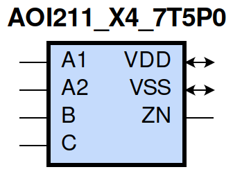
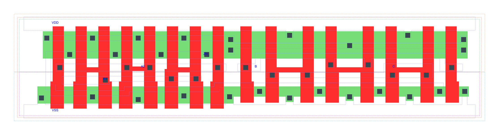

=======================================
gf180mcu_fd_sc_mcu7t5v0__aoi211_x4
=======================================

**gf180mcu_fd_sc_mcu7t5v0__aoi211_x4 symbol**

**gf180mcu_fd_sc_mcu7t5v0__aoi211_x4 schematic**

.. image:: sc7_sch/AOI211_X4_sch.png
    :height: 300px
    :width: 500 px
    :align: center
    :alt: gf180mcu_fd_sc_mcu7t5v0__aoi211_x4 schematic

**gf180mcu_fd_sc_mcu7t5v0__aoi211_x4 layout**

.. include:: images.rst

AOI211_X4 is a 2-input AND into 3-input NOR, NOR[AND(A1,A2),B,C], 4X drive strength

|
| Attributes

============= ======================
**Attribute** **Value**
area          79.027200 µm\ :sup:`2`
============= ======================

|
| OUTPUT FUNCTIONS

============== =====================================
**Output Pin** **Function**
ZN             (((!A1)&(!B)&(!C))|((!A2)&(!B)&(!C)))
============== =====================================

|
| TRUTH TABLE FOR ZN

====== ====== ===== ===== ======
**A1** **A2** **B** **C** **ZN**
0      ?      0     0     1
?      0      0     0     1
1      1      ?     ?     0
?      ?      1     ?     0
?      ?      ?     1     0
====== ====== ===== ===== ======

|
| FUNCTIONAL SCHEMATIC
| |image62|
| PIN CAPACITANCE (pf)

======= ======== ====================
**Pin** **Type** **Capacitance (pf)**
A2      input    0.0195
A1      input    0.0191
B       input    0.0169
C       input    0.0163
======= ======== ====================

|
| DELAY AND OUTPUT TRANSITION TIME corresponding to min slew and load

+---------------+------------+--------------------+--------------+-------------------+----------------+---------------+
| **Input Pin** | **Output** | **When Condition** | **Tin (ns)** | **Out Load (pf)** | **Delay (ns)** | **Tout (ns)** |
+---------------+------------+--------------------+--------------+-------------------+----------------+---------------+
| A2(HL)        | ZN(LH)     | A1&!B&!C           | 0.0100       | 0.0010            | 0.1630         | 0.1705        |
+---------------+------------+--------------------+--------------+-------------------+----------------+---------------+
| A2(LH)        | ZN(HL)     | A1&!B&!C           | 0.0100       | 0.0010            | 0.0788         | 0.0398        |
+---------------+------------+--------------------+--------------+-------------------+----------------+---------------+
| A1(HL)        | ZN(LH)     | A2&!B&!C           | 0.0100       | 0.0010            | 0.1211         | 0.1251        |
+---------------+------------+--------------------+--------------+-------------------+----------------+---------------+
| A1(LH)        | ZN(HL)     | A2&!B&!C           | 0.0100       | 0.0010            | 0.0672         | 0.0398        |
+---------------+------------+--------------------+--------------+-------------------+----------------+---------------+
| B(LH)         | ZN(HL)     | !A1&!A2&!C         | 0.0100       | 0.0010            | 0.1304         | 0.0787        |
+---------------+------------+--------------------+--------------+-------------------+----------------+---------------+
| B(LH)         | ZN(HL)     | !A1&A2&!C          | 0.0100       | 0.0010            | 0.1066         | 0.0682        |
+---------------+------------+--------------------+--------------+-------------------+----------------+---------------+
| B(LH)         | ZN(HL)     | A1&!A2&!C          | 0.0100       | 0.0010            | 0.1174         | 0.0888        |
+---------------+------------+--------------------+--------------+-------------------+----------------+---------------+
| B(HL)         | ZN(LH)     | !A1&!A2&!C         | 0.0100       | 0.0010            | 0.1919         | 0.1496        |
+---------------+------------+--------------------+--------------+-------------------+----------------+---------------+
| B(HL)         | ZN(LH)     | !A1&A2&!C          | 0.0100       | 0.0010            | 0.2156         | 0.1396        |
+---------------+------------+--------------------+--------------+-------------------+----------------+---------------+
| B(HL)         | ZN(LH)     | A1&!A2&!C          | 0.0100       | 0.0010            | 0.2689         | 0.1793        |
+---------------+------------+--------------------+--------------+-------------------+----------------+---------------+
| C(HL)         | ZN(LH)     | !A1&!A2&!B         | 0.0100       | 0.0010            | 0.2156         | 0.1494        |
+---------------+------------+--------------------+--------------+-------------------+----------------+---------------+
| C(HL)         | ZN(LH)     | !A1&A2&!B          | 0.0100       | 0.0010            | 0.2395         | 0.1396        |
+---------------+------------+--------------------+--------------+-------------------+----------------+---------------+
| C(HL)         | ZN(LH)     | A1&!A2&!B          | 0.0100       | 0.0010            | 0.2927         | 0.1794        |
+---------------+------------+--------------------+--------------+-------------------+----------------+---------------+
| C(LH)         | ZN(HL)     | !A1&!A2&!B         | 0.0100       | 0.0010            | 0.1451         | 0.0934        |
+---------------+------------+--------------------+--------------+-------------------+----------------+---------------+
| C(LH)         | ZN(HL)     | !A1&A2&!B          | 0.0100       | 0.0010            | 0.1122         | 0.0810        |
+---------------+------------+--------------------+--------------+-------------------+----------------+---------------+
| C(LH)         | ZN(HL)     | A1&!A2&!B          | 0.0100       | 0.0010            | 0.1257         | 0.1046        |
+---------------+------------+--------------------+--------------+-------------------+----------------+---------------+

|
| DYNAMIC ENERGY

+---------------+--------------------+--------------+------------+-------------------+---------------------+
| **Input Pin** | **When Condition** | **Tin (ns)** | **Output** | **Out Load (pf)** | **Energy (uW/MHz)** |
+---------------+--------------------+--------------+------------+-------------------+---------------------+
| C             | !A1&!A2&!B         | 0.0100       | ZN(LH)     | 0.0010            | 0.9630              |
+---------------+--------------------+--------------+------------+-------------------+---------------------+
| C             | !A1&A2&!B          | 0.0100       | ZN(LH)     | 0.0010            | 0.8748              |
+---------------+--------------------+--------------+------------+-------------------+---------------------+
| C             | A1&!A2&!B          | 0.0100       | ZN(LH)     | 0.0010            | 1.0335              |
+---------------+--------------------+--------------+------------+-------------------+---------------------+
| C             | !A1&!A2&!B         | 0.0100       | ZN(HL)     | 0.0010            | 0.2949              |
+---------------+--------------------+--------------+------------+-------------------+---------------------+
| C             | !A1&A2&!B          | 0.0100       | ZN(HL)     | 0.0010            | 0.2700              |
+---------------+--------------------+--------------+------------+-------------------+---------------------+
| C             | A1&!A2&!B          | 0.0100       | ZN(HL)     | 0.0010            | 0.2699              |
+---------------+--------------------+--------------+------------+-------------------+---------------------+
| A1            | A2&!B&!C           | 0.0100       | ZN(LH)     | 0.0010            | 0.5601              |
+---------------+--------------------+--------------+------------+-------------------+---------------------+
| B             | !A1&!A2&!C         | 0.0100       | ZN(HL)     | 0.0010            | 0.2108              |
+---------------+--------------------+--------------+------------+-------------------+---------------------+
| B             | !A1&A2&!C          | 0.0100       | ZN(HL)     | 0.0010            | 0.1844              |
+---------------+--------------------+--------------+------------+-------------------+---------------------+
| B             | A1&!A2&!C          | 0.0100       | ZN(HL)     | 0.0010            | 0.1847              |
+---------------+--------------------+--------------+------------+-------------------+---------------------+
| A2            | A1&!B&!C           | 0.0100       | ZN(LH)     | 0.0010            | 0.7002              |
+---------------+--------------------+--------------+------------+-------------------+---------------------+
| A1            | A2&!B&!C           | 0.0100       | ZN(HL)     | 0.0010            | 0.0160              |
+---------------+--------------------+--------------+------------+-------------------+---------------------+
| B             | !A1&!A2&!C         | 0.0100       | ZN(LH)     | 0.0010            | 0.8463              |
+---------------+--------------------+--------------+------------+-------------------+---------------------+
| B             | !A1&A2&!C          | 0.0100       | ZN(LH)     | 0.0010            | 0.7581              |
+---------------+--------------------+--------------+------------+-------------------+---------------------+
| B             | A1&!A2&!C          | 0.0100       | ZN(LH)     | 0.0010            | 0.9167              |
+---------------+--------------------+--------------+------------+-------------------+---------------------+
| A2            | A1&!B&!C           | 0.0100       | ZN(HL)     | 0.0010            | 0.0156              |
+---------------+--------------------+--------------+------------+-------------------+---------------------+
| B(HL)         | !A1&!A2&C          | 0.0100       | n/a        | n/a               | 0.0986              |
+---------------+--------------------+--------------+------------+-------------------+---------------------+
| B(HL)         | !A1&A2&C           | 0.0100       | n/a        | n/a               | 0.0982              |
+---------------+--------------------+--------------+------------+-------------------+---------------------+
| B(HL)         | A1&!A2&C           | 0.0100       | n/a        | n/a               | 0.0982              |
+---------------+--------------------+--------------+------------+-------------------+---------------------+
| B(HL)         | A1&A2&!C           | 0.0100       | n/a        | n/a               | 0.1578              |
+---------------+--------------------+--------------+------------+-------------------+---------------------+
| B(HL)         | A1&A2&C            | 0.0100       | n/a        | n/a               | 0.0866              |
+---------------+--------------------+--------------+------------+-------------------+---------------------+
| A2(LH)        | !A1&!B&!C          | 0.0100       | n/a        | n/a               | -0.1583             |
+---------------+--------------------+--------------+------------+-------------------+---------------------+
| A2(LH)        | !A1&!B&C           | 0.0100       | n/a        | n/a               | -0.0381             |
+---------------+--------------------+--------------+------------+-------------------+---------------------+
| A2(LH)        | !A1&B&!C           | 0.0100       | n/a        | n/a               | -0.0379             |
+---------------+--------------------+--------------+------------+-------------------+---------------------+
| A2(LH)        | !A1&B&C            | 0.0100       | n/a        | n/a               | -0.0379             |
+---------------+--------------------+--------------+------------+-------------------+---------------------+
| A2(LH)        | A1&!B&C            | 0.0100       | n/a        | n/a               | -0.0409             |
+---------------+--------------------+--------------+------------+-------------------+---------------------+
| A2(LH)        | A1&B&!C            | 0.0100       | n/a        | n/a               | -0.0402             |
+---------------+--------------------+--------------+------------+-------------------+---------------------+
| A2(LH)        | A1&B&C             | 0.0100       | n/a        | n/a               | -0.0402             |
+---------------+--------------------+--------------+------------+-------------------+---------------------+
| A1(LH)        | !A2&!B&!C          | 0.0100       | n/a        | n/a               | -0.1175             |
+---------------+--------------------+--------------+------------+-------------------+---------------------+
| A1(LH)        | !A2&!B&C           | 0.0100       | n/a        | n/a               | -0.0380             |
+---------------+--------------------+--------------+------------+-------------------+---------------------+
| A1(LH)        | !A2&B&!C           | 0.0100       | n/a        | n/a               | -0.0378             |
+---------------+--------------------+--------------+------------+-------------------+---------------------+
| A1(LH)        | !A2&B&C            | 0.0100       | n/a        | n/a               | -0.0378             |
+---------------+--------------------+--------------+------------+-------------------+---------------------+
| A1(LH)        | A2&!B&C            | 0.0100       | n/a        | n/a               | -0.0408             |
+---------------+--------------------+--------------+------------+-------------------+---------------------+
| A1(LH)        | A2&B&!C            | 0.0100       | n/a        | n/a               | -0.0401             |
+---------------+--------------------+--------------+------------+-------------------+---------------------+
| A1(LH)        | A2&B&C             | 0.0100       | n/a        | n/a               | -0.0401             |
+---------------+--------------------+--------------+------------+-------------------+---------------------+
| C(HL)         | !A1&!A2&B          | 0.0100       | n/a        | n/a               | 0.1573              |
+---------------+--------------------+--------------+------------+-------------------+---------------------+
| C(HL)         | !A1&A2&B           | 0.0100       | n/a        | n/a               | 0.1573              |
+---------------+--------------------+--------------+------------+-------------------+---------------------+
| C(HL)         | A1&!A2&B           | 0.0100       | n/a        | n/a               | 0.1573              |
+---------------+--------------------+--------------+------------+-------------------+---------------------+
| C(HL)         | A1&A2&!B           | 0.0100       | n/a        | n/a               | 0.1576              |
+---------------+--------------------+--------------+------------+-------------------+---------------------+
| C(HL)         | A1&A2&B            | 0.0100       | n/a        | n/a               | 0.1573              |
+---------------+--------------------+--------------+------------+-------------------+---------------------+
| A2(HL)        | !A1&!B&!C          | 0.0100       | n/a        | n/a               | 0.1735              |
+---------------+--------------------+--------------+------------+-------------------+---------------------+
| A2(HL)        | !A1&!B&C           | 0.0100       | n/a        | n/a               | 0.0397              |
+---------------+--------------------+--------------+------------+-------------------+---------------------+
| A2(HL)        | !A1&B&!C           | 0.0100       | n/a        | n/a               | 0.0398              |
+---------------+--------------------+--------------+------------+-------------------+---------------------+
| A2(HL)        | !A1&B&C            | 0.0100       | n/a        | n/a               | 0.0398              |
+---------------+--------------------+--------------+------------+-------------------+---------------------+
| A2(HL)        | A1&!B&C            | 0.0100       | n/a        | n/a               | 0.2693              |
+---------------+--------------------+--------------+------------+-------------------+---------------------+
| A2(HL)        | A1&B&!C            | 0.0100       | n/a        | n/a               | 0.1706              |
+---------------+--------------------+--------------+------------+-------------------+---------------------+
| A2(HL)        | A1&B&C             | 0.0100       | n/a        | n/a               | 0.1706              |
+---------------+--------------------+--------------+------------+-------------------+---------------------+
| B(LH)         | !A1&!A2&C          | 0.0100       | n/a        | n/a               | -0.0506             |
+---------------+--------------------+--------------+------------+-------------------+---------------------+
| B(LH)         | !A1&A2&C           | 0.0100       | n/a        | n/a               | -0.0507             |
+---------------+--------------------+--------------+------------+-------------------+---------------------+
| B(LH)         | A1&!A2&C           | 0.0100       | n/a        | n/a               | -0.0508             |
+---------------+--------------------+--------------+------------+-------------------+---------------------+
| B(LH)         | A1&A2&!C           | 0.0100       | n/a        | n/a               | -0.1133             |
+---------------+--------------------+--------------+------------+-------------------+---------------------+
| B(LH)         | A1&A2&C            | 0.0100       | n/a        | n/a               | -0.0908             |
+---------------+--------------------+--------------+------------+-------------------+---------------------+
| A1(HL)        | !A2&!B&!C          | 0.0100       | n/a        | n/a               | 0.1750              |
+---------------+--------------------+--------------+------------+-------------------+---------------------+
| A1(HL)        | !A2&!B&C           | 0.0100       | n/a        | n/a               | 0.0396              |
+---------------+--------------------+--------------+------------+-------------------+---------------------+
| A1(HL)        | !A2&B&!C           | 0.0100       | n/a        | n/a               | 0.0397              |
+---------------+--------------------+--------------+------------+-------------------+---------------------+
| A1(HL)        | !A2&B&C            | 0.0100       | n/a        | n/a               | 0.0397              |
+---------------+--------------------+--------------+------------+-------------------+---------------------+
| A1(HL)        | A2&!B&C            | 0.0100       | n/a        | n/a               | 0.2692              |
+---------------+--------------------+--------------+------------+-------------------+---------------------+
| A1(HL)        | A2&B&!C            | 0.0100       | n/a        | n/a               | 0.1705              |
+---------------+--------------------+--------------+------------+-------------------+---------------------+
| A1(HL)        | A2&B&C             | 0.0100       | n/a        | n/a               | 0.1705              |
+---------------+--------------------+--------------+------------+-------------------+---------------------+
| C(LH)         | !A1&!A2&B          | 0.0100       | n/a        | n/a               | -0.1389             |
+---------------+--------------------+--------------+------------+-------------------+---------------------+
| C(LH)         | !A1&A2&B           | 0.0100       | n/a        | n/a               | -0.1390             |
+---------------+--------------------+--------------+------------+-------------------+---------------------+
| C(LH)         | A1&!A2&B           | 0.0100       | n/a        | n/a               | -0.1390             |
+---------------+--------------------+--------------+------------+-------------------+---------------------+
| C(LH)         | A1&A2&!B           | 0.0100       | n/a        | n/a               | -0.1291             |
+---------------+--------------------+--------------+------------+-------------------+---------------------+
| C(LH)         | A1&A2&B            | 0.0100       | n/a        | n/a               | -0.1458             |
+---------------+--------------------+--------------+------------+-------------------+---------------------+

|
| LEAKAGE POWER

================== ==============
**When Condition** **Power (nW)**
!A1&!A2&!B&!C      0.3570
!A1&A2&!B&!C       0.3579
A1&!A2&!B&!C       0.5176
!A1&!A2&!B&C       0.6125
!A1&!A2&B&!C       0.4711
!A1&!A2&B&C        0.4711
!A1&A2&!B&C        0.6213
!A1&A2&B&!C        0.4801
!A1&A2&B&C         0.4801
A1&!A2&!B&C        0.6213
A1&!A2&B&!C        0.4801
A1&!A2&B&C         0.4801
A1&A2&!B&!C        0.2620
A1&A2&!B&C         0.2621
A1&A2&B&!C         0.2621
A1&A2&B&C          0.2621
================== ==============

