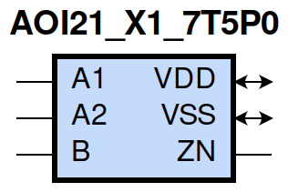
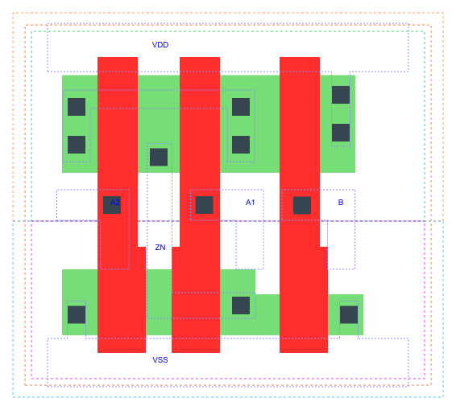

=======================================
gf180mcu_fd_sc_mcu7t5v0__aoi21_x1
=======================================

**gf180mcu_fd_sc_mcu7t5v0__aoi21_x1 symbol**

**gf180mcu_fd_sc_mcu7t5v0__aoi21_x1 schematic**

.. image:: sc7_sch/AOI21_X1_sch.png
    :height: 300px
    :width: 500 px
    :align: center
    :alt: gf180mcu_fd_sc_mcu7t5v0__aoi21_x1 schematic

**gf180mcu_fd_sc_mcu7t5v0__aoi21_x1 layout**

.. include:: images.rst

AOI21_X1 is a 2-input AND into 2-input NOR, NOR[AND(A1,A2),B], 1X drive strength

|
| Attributes

============= ======================
**Attribute** **Value**
area          17.561600 µm\ :sup:`2`
============= ======================

|
| OUTPUT FUNCTIONS

============== ===========================
**Output Pin** **Function**
ZN             (((!A1)&(!B))|((!A2)&(!B)))
============== ===========================

|
| TRUTH TABLE FOR ZN

====== ====== ===== ======
**A1** **A2** **B** **ZN**
0      ?      0     1
?      0      0     1
1      1      ?     0
?      ?      1     0
====== ====== ===== ======

|
| FUNCTIONAL SCHEMATIC
| |image65|
| PIN CAPACITANCE (pf)

======= ======== ====================
**Pin** **Type** **Capacitance (pf)**
A2      input    0.0048
A1      input    0.0049
B       input    0.0040
======= ======== ====================

|
| DELAY AND OUTPUT TRANSITION TIME corresponding to min slew and load

+---------------+------------+--------------------+--------------+-------------------+----------------+---------------+
| **Input Pin** | **Output** | **When Condition** | **Tin (ns)** | **Out Load (pf)** | **Delay (ns)** | **Tout (ns)** |
+---------------+------------+--------------------+--------------+-------------------+----------------+---------------+
| A2(HL)        | ZN(LH)     | A1&!B              | 0.0100       | 0.0010            | 0.1307         | 0.1100        |
+---------------+------------+--------------------+--------------+-------------------+----------------+---------------+
| A2(LH)        | ZN(HL)     | A1&!B              | 0.0100       | 0.0010            | 0.0738         | 0.0364        |
+---------------+------------+--------------------+--------------+-------------------+----------------+---------------+
| A1(HL)        | ZN(LH)     | A2&!B              | 0.0100       | 0.0010            | 0.0993         | 0.0801        |
+---------------+------------+--------------------+--------------+-------------------+----------------+---------------+
| A1(LH)        | ZN(HL)     | A2&!B              | 0.0100       | 0.0010            | 0.0624         | 0.0364        |
+---------------+------------+--------------------+--------------+-------------------+----------------+---------------+
| B(LH)         | ZN(HL)     | !A1&!A2            | 0.0100       | 0.0010            | 0.1150         | 0.0699        |
+---------------+------------+--------------------+--------------+-------------------+----------------+---------------+
| B(LH)         | ZN(HL)     | !A1&A2             | 0.0100       | 0.0010            | 0.0932         | 0.0601        |
+---------------+------------+--------------------+--------------+-------------------+----------------+---------------+
| B(LH)         | ZN(HL)     | A1&!A2             | 0.0100       | 0.0010            | 0.1030         | 0.0802        |
+---------------+------------+--------------------+--------------+-------------------+----------------+---------------+
| B(HL)         | ZN(LH)     | !A1&!A2            | 0.0100       | 0.0010            | 0.1203         | 0.0792        |
+---------------+------------+--------------------+--------------+-------------------+----------------+---------------+
| B(HL)         | ZN(LH)     | !A1&A2             | 0.0100       | 0.0010            | 0.1418         | 0.0834        |
+---------------+------------+--------------------+--------------+-------------------+----------------+---------------+
| B(HL)         | ZN(LH)     | A1&!A2             | 0.0100       | 0.0010            | 0.1798         | 0.1118        |
+---------------+------------+--------------------+--------------+-------------------+----------------+---------------+

|
| DYNAMIC ENERGY

+---------------+--------------------+--------------+------------+-------------------+---------------------+
| **Input Pin** | **When Condition** | **Tin (ns)** | **Output** | **Out Load (pf)** | **Energy (uW/MHz)** |
+---------------+--------------------+--------------+------------+-------------------+---------------------+
| A1            | A2&!B              | 0.0100       | ZN(LH)     | 0.0010            | 0.1176              |
+---------------+--------------------+--------------+------------+-------------------+---------------------+
| B             | !A1&!A2            | 0.0100       | ZN(HL)     | 0.0010            | 0.0531              |
+---------------+--------------------+--------------+------------+-------------------+---------------------+
| B             | !A1&A2             | 0.0100       | ZN(HL)     | 0.0010            | 0.0465              |
+---------------+--------------------+--------------+------------+-------------------+---------------------+
| B             | A1&!A2             | 0.0100       | ZN(HL)     | 0.0010            | 0.0465              |
+---------------+--------------------+--------------+------------+-------------------+---------------------+
| A2            | A1&!B              | 0.0100       | ZN(LH)     | 0.0010            | 0.1546              |
+---------------+--------------------+--------------+------------+-------------------+---------------------+
| A1            | A2&!B              | 0.0100       | ZN(HL)     | 0.0010            | 0.0038              |
+---------------+--------------------+--------------+------------+-------------------+---------------------+
| B             | !A1&!A2            | 0.0100       | ZN(LH)     | 0.0010            | 0.1837              |
+---------------+--------------------+--------------+------------+-------------------+---------------------+
| B             | !A1&A2             | 0.0100       | ZN(LH)     | 0.0010            | 0.1618              |
+---------------+--------------------+--------------+------------+-------------------+---------------------+
| B             | A1&!A2             | 0.0100       | ZN(LH)     | 0.0010            | 0.2035              |
+---------------+--------------------+--------------+------------+-------------------+---------------------+
| A2            | A1&!B              | 0.0100       | ZN(HL)     | 0.0010            | 0.0038              |
+---------------+--------------------+--------------+------------+-------------------+---------------------+
| B(HL)         | A1&A2              | 0.0100       | n/a        | n/a               | 0.0392              |
+---------------+--------------------+--------------+------------+-------------------+---------------------+
| A2(LH)        | !A1&!B             | 0.0100       | n/a        | n/a               | -0.0396             |
+---------------+--------------------+--------------+------------+-------------------+---------------------+
| A2(LH)        | !A1&B              | 0.0100       | n/a        | n/a               | -0.0096             |
+---------------+--------------------+--------------+------------+-------------------+---------------------+
| A2(LH)        | A1&B               | 0.0100       | n/a        | n/a               | -0.0103             |
+---------------+--------------------+--------------+------------+-------------------+---------------------+
| A1(LH)        | !A2&!B             | 0.0100       | n/a        | n/a               | -0.0292             |
+---------------+--------------------+--------------+------------+-------------------+---------------------+
| A1(LH)        | !A2&B              | 0.0100       | n/a        | n/a               | -0.0096             |
+---------------+--------------------+--------------+------------+-------------------+---------------------+
| A1(LH)        | A2&B               | 0.0100       | n/a        | n/a               | -0.0103             |
+---------------+--------------------+--------------+------------+-------------------+---------------------+
| A2(HL)        | !A1&!B             | 0.0100       | n/a        | n/a               | 0.0436              |
+---------------+--------------------+--------------+------------+-------------------+---------------------+
| A2(HL)        | !A1&B              | 0.0100       | n/a        | n/a               | 0.0102              |
+---------------+--------------------+--------------+------------+-------------------+---------------------+
| A2(HL)        | A1&B               | 0.0100       | n/a        | n/a               | 0.0456              |
+---------------+--------------------+--------------+------------+-------------------+---------------------+
| B(LH)         | A1&A2              | 0.0100       | n/a        | n/a               | -0.0305             |
+---------------+--------------------+--------------+------------+-------------------+---------------------+
| A1(HL)        | !A2&!B             | 0.0100       | n/a        | n/a               | 0.0441              |
+---------------+--------------------+--------------+------------+-------------------+---------------------+
| A1(HL)        | !A2&B              | 0.0100       | n/a        | n/a               | 0.0102              |
+---------------+--------------------+--------------+------------+-------------------+---------------------+
| A1(HL)        | A2&B               | 0.0100       | n/a        | n/a               | 0.0455              |
+---------------+--------------------+--------------+------------+-------------------+---------------------+

|
| LEAKAGE POWER

================== ==============
**When Condition** **Power (nW)**
!A1&!A2&!B         0.1008
!A1&A2&!B          0.1010
A1&!A2&!B          0.1409
!A1&!A2&B          0.1553
!A1&A2&B           0.1575
A1&!A2&B           0.1575
A1&A2&!B           0.1030
A1&A2&B            0.1030
================== ==============

