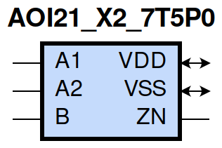
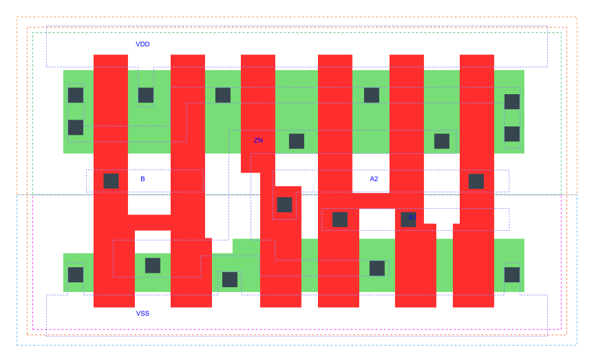

=======================================
gf180mcu_fd_sc_mcu7t5v0__aoi21_x2
=======================================

**gf180mcu_fd_sc_mcu7t5v0__aoi21_x2 symbol**

**gf180mcu_fd_sc_mcu7t5v0__aoi21_x2 schematic**

**gf180mcu_fd_sc_mcu7t5v0__aoi21_x2 layout**

.. include:: images.rst

AOI21_X2 is a 2-input AND into 2-input NOR, NOR[AND(A1,A2),B], 2X drive strength

|
| Attributes

============= ======================
**Attribute** **Value**
area          28.537600 µm\ :sup:`2`
============= ======================

|
| OUTPUT FUNCTIONS

============== ===========================
**Output Pin** **Function**
ZN             (((!A1)&(!B))|((!A2)&(!B)))
============== ===========================

|
| TRUTH TABLE FOR ZN

====== ====== ===== ======
**A1** **A2** **B** **ZN**
0      ?      0     1
?      0      0     1
1      1      ?     0
?      ?      1     0
====== ====== ===== ======

|
| FUNCTIONAL SCHEMATIC
| |image68|
| PIN CAPACITANCE (pf)

======= ======== ====================
**Pin** **Type** **Capacitance (pf)**
B       input    0.0079
A2      input    0.0098
A1      input    0.0093
======= ======== ====================

|
| DELAY AND OUTPUT TRANSITION TIME corresponding to min slew and load

+---------------+------------+--------------------+--------------+-------------------+----------------+---------------+
| **Input Pin** | **Output** | **When Condition** | **Tin (ns)** | **Out Load (pf)** | **Delay (ns)** | **Tout (ns)** |
+---------------+------------+--------------------+--------------+-------------------+----------------+---------------+
| B(LH)         | ZN(HL)     | !A1&!A2            | 0.0100       | 0.0010            | 0.1009         | 0.0597        |
+---------------+------------+--------------------+--------------+-------------------+----------------+---------------+
| B(LH)         | ZN(HL)     | !A1&A2             | 0.0100       | 0.0010            | 0.0807         | 0.0514        |
+---------------+------------+--------------------+--------------+-------------------+----------------+---------------+
| B(LH)         | ZN(HL)     | A1&!A2             | 0.0100       | 0.0010            | 0.0885         | 0.0681        |
+---------------+------------+--------------------+--------------+-------------------+----------------+---------------+
| B(HL)         | ZN(LH)     | !A1&!A2            | 0.0100       | 0.0010            | 0.1143         | 0.0746        |
+---------------+------------+--------------------+--------------+-------------------+----------------+---------------+
| B(HL)         | ZN(LH)     | !A1&A2             | 0.0100       | 0.0010            | 0.1343         | 0.0779        |
+---------------+------------+--------------------+--------------+-------------------+----------------+---------------+
| B(HL)         | ZN(LH)     | A1&!A2             | 0.0100       | 0.0010            | 0.1693         | 0.1038        |
+---------------+------------+--------------------+--------------+-------------------+----------------+---------------+
| A2(HL)        | ZN(LH)     | A1&!B              | 0.0100       | 0.0010            | 0.1208         | 0.1019        |
+---------------+------------+--------------------+--------------+-------------------+----------------+---------------+
| A2(LH)        | ZN(HL)     | A1&!B              | 0.0100       | 0.0010            | 0.0729         | 0.0353        |
+---------------+------------+--------------------+--------------+-------------------+----------------+---------------+
| A1(HL)        | ZN(LH)     | A2&!B              | 0.0100       | 0.0010            | 0.0924         | 0.0744        |
+---------------+------------+--------------------+--------------+-------------------+----------------+---------------+
| A1(LH)        | ZN(HL)     | A2&!B              | 0.0100       | 0.0010            | 0.0621         | 0.0355        |
+---------------+------------+--------------------+--------------+-------------------+----------------+---------------+

|
| DYNAMIC ENERGY

+---------------+--------------------+--------------+------------+-------------------+---------------------+
| **Input Pin** | **When Condition** | **Tin (ns)** | **Output** | **Out Load (pf)** | **Energy (uW/MHz)** |
+---------------+--------------------+--------------+------------+-------------------+---------------------+
| A1            | A2&!B              | 0.0100       | ZN(LH)     | 0.0010            | 0.2374              |
+---------------+--------------------+--------------+------------+-------------------+---------------------+
| B             | !A1&!A2            | 0.0100       | ZN(HL)     | 0.0010            | 0.1009              |
+---------------+--------------------+--------------+------------+-------------------+---------------------+
| B             | !A1&A2             | 0.0100       | ZN(HL)     | 0.0010            | 0.0879              |
+---------------+--------------------+--------------+------------+-------------------+---------------------+
| B             | A1&!A2             | 0.0100       | ZN(HL)     | 0.0010            | 0.0879              |
+---------------+--------------------+--------------+------------+-------------------+---------------------+
| A2            | A1&!B              | 0.0100       | ZN(LH)     | 0.0010            | 0.3051              |
+---------------+--------------------+--------------+------------+-------------------+---------------------+
| A1            | A2&!B              | 0.0100       | ZN(HL)     | 0.0010            | 0.0101              |
+---------------+--------------------+--------------+------------+-------------------+---------------------+
| B             | !A1&!A2            | 0.0100       | ZN(LH)     | 0.0010            | 0.3729              |
+---------------+--------------------+--------------+------------+-------------------+---------------------+
| B             | !A1&A2             | 0.0100       | ZN(LH)     | 0.0010            | 0.3290              |
+---------------+--------------------+--------------+------------+-------------------+---------------------+
| B             | A1&!A2             | 0.0100       | ZN(LH)     | 0.0010            | 0.4060              |
+---------------+--------------------+--------------+------------+-------------------+---------------------+
| A2            | A1&!B              | 0.0100       | ZN(HL)     | 0.0010            | 0.0099              |
+---------------+--------------------+--------------+------------+-------------------+---------------------+
| B(HL)         | A1&A2              | 0.0100       | n/a        | n/a               | 0.0786              |
+---------------+--------------------+--------------+------------+-------------------+---------------------+
| A2(LH)        | !A1&!B             | 0.0100       | n/a        | n/a               | -0.0789             |
+---------------+--------------------+--------------+------------+-------------------+---------------------+
| A2(LH)        | !A1&B              | 0.0100       | n/a        | n/a               | -0.0188             |
+---------------+--------------------+--------------+------------+-------------------+---------------------+
| A2(LH)        | A1&B               | 0.0100       | n/a        | n/a               | -0.0204             |
+---------------+--------------------+--------------+------------+-------------------+---------------------+
| A1(LH)        | !A2&!B             | 0.0100       | n/a        | n/a               | -0.0618             |
+---------------+--------------------+--------------+------------+-------------------+---------------------+
| A1(LH)        | !A2&B              | 0.0100       | n/a        | n/a               | -0.0188             |
+---------------+--------------------+--------------+------------+-------------------+---------------------+
| A1(LH)        | A2&B               | 0.0100       | n/a        | n/a               | -0.0203             |
+---------------+--------------------+--------------+------------+-------------------+---------------------+
| A2(HL)        | !A1&!B             | 0.0100       | n/a        | n/a               | 0.0864              |
+---------------+--------------------+--------------+------------+-------------------+---------------------+
| A2(HL)        | !A1&B              | 0.0100       | n/a        | n/a               | 0.0201              |
+---------------+--------------------+--------------+------------+-------------------+---------------------+
| A2(HL)        | A1&B               | 0.0100       | n/a        | n/a               | 0.0833              |
+---------------+--------------------+--------------+------------+-------------------+---------------------+
| B(LH)         | A1&A2              | 0.0100       | n/a        | n/a               | -0.0601             |
+---------------+--------------------+--------------+------------+-------------------+---------------------+
| A1(HL)        | !A2&!B             | 0.0100       | n/a        | n/a               | 0.0873              |
+---------------+--------------------+--------------+------------+-------------------+---------------------+
| A1(HL)        | !A2&B              | 0.0100       | n/a        | n/a               | 0.0201              |
+---------------+--------------------+--------------+------------+-------------------+---------------------+
| A1(HL)        | A2&B               | 0.0100       | n/a        | n/a               | 0.0833              |
+---------------+--------------------+--------------+------------+-------------------+---------------------+

|
| LEAKAGE POWER

================== ==============
**When Condition** **Power (nW)**
!A1&!A2&!B         0.1514
!A1&A2&!B          0.1519
A1&!A2&!B          0.2317
!A1&!A2&B          0.2605
!A1&A2&B           0.2651
A1&!A2&B           0.2651
A1&A2&!B           0.1560
A1&A2&B            0.1560
================== ==============

