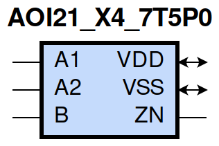
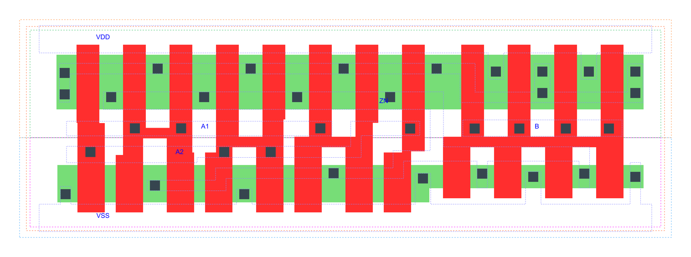

=======================================
gf180mcu_fd_sc_mcu7t5v0__aoi21_x4
=======================================

**gf180mcu_fd_sc_mcu7t5v0__aoi21_x4 symbol**

**gf180mcu_fd_sc_mcu7t5v0__aoi21_x4 schematic**

.. image:: sc7_sch/AOI21_X4_sch.png
    :height: 300px
    :width: 500 px
    :align: center
    :alt: gf180mcu_fd_sc_mcu7t5v0__aoi21_x4 schematic

**gf180mcu_fd_sc_mcu7t5v0__aoi21_x4 layout**

.. include:: images.rst

AOI21_X4 is a 2-input AND into 2-input NOR, NOR[AND(A1,A2),B], 4X drive strength

|
| Attributes

============= ======================
**Attribute** **Value**
area          52.684800 µm\ :sup:`2`
============= ======================

|
| OUTPUT FUNCTIONS

============== ===========================
**Output Pin** **Function**
ZN             (((!A1)&(!B))|((!A2)&(!B)))
============== ===========================

|
| TRUTH TABLE FOR ZN

====== ====== ===== ======
**A1** **A2** **B** **ZN**
0      ?      0     1
?      0      0     1
1      1      ?     0
?      ?      1     0
====== ====== ===== ======

|
| FUNCTIONAL SCHEMATIC
| |image71|
| PIN CAPACITANCE (pf)

======= ======== ====================
**Pin** **Type** **Capacitance (pf)**
A2      input    0.0198
A1      input    0.0195
B       input    0.0152
======= ======== ====================

|
| DELAY AND OUTPUT TRANSITION TIME corresponding to min slew and load

+---------------+------------+--------------------+--------------+-------------------+----------------+---------------+
| **Input Pin** | **Output** | **When Condition** | **Tin (ns)** | **Out Load (pf)** | **Delay (ns)** | **Tout (ns)** |
+---------------+------------+--------------------+--------------+-------------------+----------------+---------------+
| A2(HL)        | ZN(LH)     | A1&!B              | 0.0100       | 0.0010            | 0.1216         | 0.1010        |
+---------------+------------+--------------------+--------------+-------------------+----------------+---------------+
| A2(LH)        | ZN(HL)     | A1&!B              | 0.0100       | 0.0010            | 0.0681         | 0.0320        |
+---------------+------------+--------------------+--------------+-------------------+----------------+---------------+
| A1(HL)        | ZN(LH)     | A2&!B              | 0.0100       | 0.0010            | 0.0904         | 0.0716        |
+---------------+------------+--------------------+--------------+-------------------+----------------+---------------+
| A1(LH)        | ZN(HL)     | A2&!B              | 0.0100       | 0.0010            | 0.0572         | 0.0321        |
+---------------+------------+--------------------+--------------+-------------------+----------------+---------------+
| B(LH)         | ZN(HL)     | !A1&!A2            | 0.0100       | 0.0010            | 0.1064         | 0.0632        |
+---------------+------------+--------------------+--------------+-------------------+----------------+---------------+
| B(LH)         | ZN(HL)     | !A1&A2             | 0.0100       | 0.0010            | 0.0852         | 0.0537        |
+---------------+------------+--------------------+--------------+-------------------+----------------+---------------+
| B(LH)         | ZN(HL)     | A1&!A2             | 0.0100       | 0.0010            | 0.0946         | 0.0729        |
+---------------+------------+--------------------+--------------+-------------------+----------------+---------------+
| B(HL)         | ZN(LH)     | !A1&!A2            | 0.0100       | 0.0010            | 0.1107         | 0.0726        |
+---------------+------------+--------------------+--------------+-------------------+----------------+---------------+
| B(HL)         | ZN(LH)     | !A1&A2             | 0.0100       | 0.0010            | 0.1296         | 0.0752        |
+---------------+------------+--------------------+--------------+-------------------+----------------+---------------+
| B(HL)         | ZN(LH)     | A1&!A2             | 0.0100       | 0.0010            | 0.1671         | 0.1028        |
+---------------+------------+--------------------+--------------+-------------------+----------------+---------------+

|
| DYNAMIC ENERGY

+---------------+--------------------+--------------+------------+-------------------+---------------------+
| **Input Pin** | **When Condition** | **Tin (ns)** | **Output** | **Out Load (pf)** | **Energy (uW/MHz)** |
+---------------+--------------------+--------------+------------+-------------------+---------------------+
| A1            | A2&!B              | 0.0100       | ZN(LH)     | 0.0010            | 0.4823              |
+---------------+--------------------+--------------+------------+-------------------+---------------------+
| B             | !A1&!A2            | 0.0100       | ZN(HL)     | 0.0010            | 0.1874              |
+---------------+--------------------+--------------+------------+-------------------+---------------------+
| B             | !A1&A2             | 0.0100       | ZN(HL)     | 0.0010            | 0.1614              |
+---------------+--------------------+--------------+------------+-------------------+---------------------+
| B             | A1&!A2             | 0.0100       | ZN(HL)     | 0.0010            | 0.1611              |
+---------------+--------------------+--------------+------------+-------------------+---------------------+
| A2            | A1&!B              | 0.0100       | ZN(LH)     | 0.0010            | 0.6271              |
+---------------+--------------------+--------------+------------+-------------------+---------------------+
| A1            | A2&!B              | 0.0100       | ZN(HL)     | 0.0010            | 0.0149              |
+---------------+--------------------+--------------+------------+-------------------+---------------------+
| B             | !A1&!A2            | 0.0100       | ZN(LH)     | 0.0010            | 0.7461              |
+---------------+--------------------+--------------+------------+-------------------+---------------------+
| B             | !A1&A2             | 0.0100       | ZN(LH)     | 0.0010            | 0.6592              |
+---------------+--------------------+--------------+------------+-------------------+---------------------+
| B             | A1&!A2             | 0.0100       | ZN(LH)     | 0.0010            | 0.8215              |
+---------------+--------------------+--------------+------------+-------------------+---------------------+
| A2            | A1&!B              | 0.0100       | ZN(HL)     | 0.0010            | 0.0145              |
+---------------+--------------------+--------------+------------+-------------------+---------------------+
| B(HL)         | A1&A2              | 0.0100       | n/a        | n/a               | 0.1547              |
+---------------+--------------------+--------------+------------+-------------------+---------------------+
| A2(LH)        | !A1&!B             | 0.0100       | n/a        | n/a               | -0.1557             |
+---------------+--------------------+--------------+------------+-------------------+---------------------+
| A2(LH)        | !A1&B              | 0.0100       | n/a        | n/a               | -0.0366             |
+---------------+--------------------+--------------+------------+-------------------+---------------------+
| A2(LH)        | A1&B               | 0.0100       | n/a        | n/a               | -0.0398             |
+---------------+--------------------+--------------+------------+-------------------+---------------------+
| A1(LH)        | !A2&!B             | 0.0100       | n/a        | n/a               | -0.1198             |
+---------------+--------------------+--------------+------------+-------------------+---------------------+
| A1(LH)        | !A2&B              | 0.0100       | n/a        | n/a               | -0.0366             |
+---------------+--------------------+--------------+------------+-------------------+---------------------+
| A1(LH)        | A2&B               | 0.0100       | n/a        | n/a               | -0.0397             |
+---------------+--------------------+--------------+------------+-------------------+---------------------+
| A2(HL)        | !A1&!B             | 0.0100       | n/a        | n/a               | 0.1718              |
+---------------+--------------------+--------------+------------+-------------------+---------------------+
| A2(HL)        | !A1&B              | 0.0100       | n/a        | n/a               | 0.0394              |
+---------------+--------------------+--------------+------------+-------------------+---------------------+
| A2(HL)        | A1&B               | 0.0100       | n/a        | n/a               | 0.1572              |
+---------------+--------------------+--------------+------------+-------------------+---------------------+
| B(LH)         | A1&A2              | 0.0100       | n/a        | n/a               | -0.1180             |
+---------------+--------------------+--------------+------------+-------------------+---------------------+
| A1(HL)        | !A2&!B             | 0.0100       | n/a        | n/a               | 0.1737              |
+---------------+--------------------+--------------+------------+-------------------+---------------------+
| A1(HL)        | !A2&B              | 0.0100       | n/a        | n/a               | 0.0393              |
+---------------+--------------------+--------------+------------+-------------------+---------------------+
| A1(HL)        | A2&B               | 0.0100       | n/a        | n/a               | 0.1572              |
+---------------+--------------------+--------------+------------+-------------------+---------------------+

|
| LEAKAGE POWER

================== ==============
**When Condition** **Power (nW)**
!A1&!A2&!B         0.2532
!A1&A2&!B          0.2541
A1&!A2&!B          0.4138
!A1&!A2&B          0.4711
!A1&A2&B           0.4801
A1&!A2&B           0.4801
A1&A2&!B           0.2619
A1&A2&B            0.2619
================== ==============

