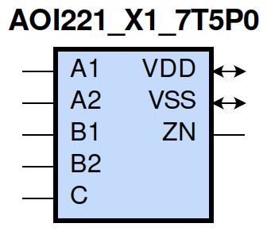
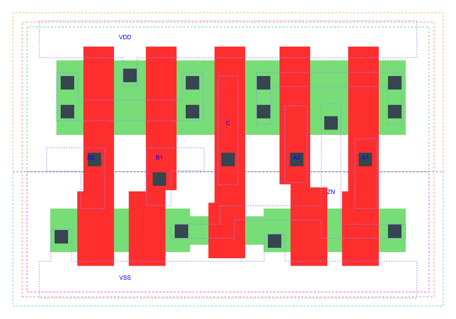

=======================================
gf180mcu_fd_sc_mcu7t5v0__aoi221_x1
=======================================

**gf180mcu_fd_sc_mcu7t5v0__aoi221_x1 symbol**

**gf180mcu_fd_sc_mcu7t5v0__aoi221_x1 schematic**

.. image:: sc7_sch/AOI221_X1_sch.png
    :height: 300px
    :width: 500 px
    :align: center
    :alt: gf180mcu_fd_sc_mcu7t5v0__aoi221_x1 schematic

**gf180mcu_fd_sc_mcu7t5v0__aoi221_x1 layout**

.. include:: images.rst

AOI221_X1 is a two 2-input AND into 3-input NOR, NOR[AND(A1,A2),AND(B1,B2),C], 1X drive strength

|
| Attributes

============= ======================
**Attribute** **Value**
area          24.147200 µm\ :sup:`2`
============= ======================

|
| OUTPUT FUNCTIONS

+----------------+-------------------------------------------------------------------------------+
| **Output Pin** | **Function**                                                                  |
+----------------+-------------------------------------------------------------------------------+
| ZN             | (((!A1)&(!B1)&(!C))|((!A1)&(!B2)&(!C))|((!A2)&(!B1)&(!C))|((!A2)&(!B2)&(!C))) |
+----------------+-------------------------------------------------------------------------------+

|
| TRUTH TABLE FOR ZN

====== ====== ====== ====== ===== ======
**A1** **A2** **B1** **B2** **C** **ZN**
0      ?      0      ?      0     1
0      ?      ?      0      0     1
?      0      0      ?      0     1
?      0      ?      0      0     1
1      1      ?      ?      ?     0
?      ?      1      1      ?     0
?      ?      ?      ?      1     0
====== ====== ====== ====== ===== ======

|
| FUNCTIONAL SCHEMATIC
| |image74|
| PIN CAPACITANCE (pf)

======= ======== ====================
**Pin** **Type** **Capacitance (pf)**
B2      input    0.0043
B1      input    0.0045
C       input    0.0040
A2      input    0.0046
A1      input    0.0046
======= ======== ====================

|
| DELAY AND OUTPUT TRANSITION TIME corresponding to min slew and load

+---------------+------------+--------------------+--------------+-------------------+----------------+---------------+
| **Input Pin** | **Output** | **When Condition** | **Tin (ns)** | **Out Load (pf)** | **Delay (ns)** | **Tout (ns)** |
+---------------+------------+--------------------+--------------+-------------------+----------------+---------------+
| B2(HL)        | ZN(LH)     | !A1&!A2&B1&!C      | 0.0100       | 0.0010            | 0.2966         | 0.1974        |
+---------------+------------+--------------------+--------------+-------------------+----------------+---------------+
| B2(HL)        | ZN(LH)     | !A1&A2&B1&!C       | 0.0100       | 0.0010            | 0.3327         | 0.1973        |
+---------------+------------+--------------------+--------------+-------------------+----------------+---------------+
| B2(HL)        | ZN(LH)     | A1&!A2&B1&!C       | 0.0100       | 0.0010            | 0.3794         | 0.2333        |
+---------------+------------+--------------------+--------------+-------------------+----------------+---------------+
| B2(LH)        | ZN(HL)     | !A1&!A2&B1&!C      | 0.0100       | 0.0010            | 0.1769         | 0.1178        |
+---------------+------------+--------------------+--------------+-------------------+----------------+---------------+
| B2(LH)        | ZN(HL)     | !A1&A2&B1&!C       | 0.0100       | 0.0010            | 0.1413         | 0.1034        |
+---------------+------------+--------------------+--------------+-------------------+----------------+---------------+
| B2(LH)        | ZN(HL)     | A1&!A2&B1&!C       | 0.0100       | 0.0010            | 0.1541         | 0.1250        |
+---------------+------------+--------------------+--------------+-------------------+----------------+---------------+
| B1(HL)        | ZN(LH)     | !A1&!A2&B2&!C      | 0.0100       | 0.0010            | 0.2648         | 0.1669        |
+---------------+------------+--------------------+--------------+-------------------+----------------+---------------+
| B1(HL)        | ZN(LH)     | !A1&A2&B2&!C       | 0.0100       | 0.0010            | 0.2952         | 0.1610        |
+---------------+------------+--------------------+--------------+-------------------+----------------+---------------+
| B1(HL)        | ZN(LH)     | A1&!A2&B2&!C       | 0.0100       | 0.0010            | 0.3429         | 0.1970        |
+---------------+------------+--------------------+--------------+-------------------+----------------+---------------+
| B1(LH)        | ZN(HL)     | !A1&!A2&B2&!C      | 0.0100       | 0.0010            | 0.1662         | 0.1175        |
+---------------+------------+--------------------+--------------+-------------------+----------------+---------------+
| B1(LH)        | ZN(HL)     | !A1&A2&B2&!C       | 0.0100       | 0.0010            | 0.1302         | 0.1039        |
+---------------+------------+--------------------+--------------+-------------------+----------------+---------------+
| B1(LH)        | ZN(HL)     | A1&!A2&B2&!C       | 0.0100       | 0.0010            | 0.1431         | 0.1258        |
+---------------+------------+--------------------+--------------+-------------------+----------------+---------------+
| C(HL)         | ZN(LH)     | !A1&!A2&!B1&!B2    | 0.0100       | 0.0010            | 0.1707         | 0.1261        |
+---------------+------------+--------------------+--------------+-------------------+----------------+---------------+
| C(HL)         | ZN(LH)     | !A1&!A2&!B1&B2     | 0.0100       | 0.0010            | 0.2050         | 0.1665        |
+---------------+------------+--------------------+--------------+-------------------+----------------+---------------+
| C(HL)         | ZN(LH)     | !A1&!A2&B1&!B2     | 0.0100       | 0.0010            | 0.2446         | 0.1967        |
+---------------+------------+--------------------+--------------+-------------------+----------------+---------------+
| C(HL)         | ZN(LH)     | !A1&A2&!B1&!B2     | 0.0100       | 0.0010            | 0.1980         | 0.1286        |
+---------------+------------+--------------------+--------------+-------------------+----------------+---------------+
| C(HL)         | ZN(LH)     | !A1&A2&!B1&B2      | 0.0100       | 0.0010            | 0.2334         | 0.1611        |
+---------------+------------+--------------------+--------------+-------------------+----------------+---------------+
| C(HL)         | ZN(LH)     | !A1&A2&B1&!B2      | 0.0100       | 0.0010            | 0.2804         | 0.1971        |
+---------------+------------+--------------------+--------------+-------------------+----------------+---------------+
| C(HL)         | ZN(LH)     | A1&!A2&!B1&!B2     | 0.0100       | 0.0010            | 0.2375         | 0.1583        |
+---------------+------------+--------------------+--------------+-------------------+----------------+---------------+
| C(HL)         | ZN(LH)     | A1&!A2&!B1&B2      | 0.0100       | 0.0010            | 0.2805         | 0.1972        |
+---------------+------------+--------------------+--------------+-------------------+----------------+---------------+
| C(HL)         | ZN(LH)     | A1&!A2&B1&!B2      | 0.0100       | 0.0010            | 0.3272         | 0.2332        |
+---------------+------------+--------------------+--------------+-------------------+----------------+---------------+
| C(LH)         | ZN(HL)     | !A1&!A2&!B1&!B2    | 0.0100       | 0.0010            | 0.1362         | 0.0847        |
+---------------+------------+--------------------+--------------+-------------------+----------------+---------------+
| C(LH)         | ZN(HL)     | !A1&!A2&!B1&B2     | 0.0100       | 0.0010            | 0.1364         | 0.0850        |
+---------------+------------+--------------------+--------------+-------------------+----------------+---------------+
| C(LH)         | ZN(HL)     | !A1&!A2&B1&!B2     | 0.0100       | 0.0010            | 0.1459         | 0.1017        |
+---------------+------------+--------------------+--------------+-------------------+----------------+---------------+
| C(LH)         | ZN(HL)     | !A1&A2&!B1&!B2     | 0.0100       | 0.0010            | 0.1141         | 0.0746        |
+---------------+------------+--------------------+--------------+-------------------+----------------+---------------+
| C(LH)         | ZN(HL)     | !A1&A2&!B1&B2      | 0.0100       | 0.0010            | 0.1146         | 0.0745        |
+---------------+------------+--------------------+--------------+-------------------+----------------+---------------+
| C(LH)         | ZN(HL)     | !A1&A2&B1&!B2      | 0.0100       | 0.0010            | 0.1239         | 0.0921        |
+---------------+------------+--------------------+--------------+-------------------+----------------+---------------+
| C(LH)         | ZN(HL)     | A1&!A2&!B1&!B2     | 0.0100       | 0.0010            | 0.1235         | 0.0921        |
+---------------+------------+--------------------+--------------+-------------------+----------------+---------------+
| C(LH)         | ZN(HL)     | A1&!A2&!B1&B2      | 0.0100       | 0.0010            | 0.1238         | 0.0922        |
+---------------+------------+--------------------+--------------+-------------------+----------------+---------------+
| C(LH)         | ZN(HL)     | A1&!A2&B1&!B2      | 0.0100       | 0.0010            | 0.1342         | 0.1095        |
+---------------+------------+--------------------+--------------+-------------------+----------------+---------------+
| A2(HL)        | ZN(LH)     | A1&!B1&!B2&!C      | 0.0100       | 0.0010            | 0.1646         | 0.1549        |
+---------------+------------+--------------------+--------------+-------------------+----------------+---------------+
| A2(HL)        | ZN(LH)     | A1&!B1&B2&!C       | 0.0100       | 0.0010            | 0.1806         | 0.1884        |
+---------------+------------+--------------------+--------------+-------------------+----------------+---------------+
| A2(HL)        | ZN(LH)     | A1&B1&!B2&!C       | 0.0100       | 0.0010            | 0.2265         | 0.2281        |
+---------------+------------+--------------------+--------------+-------------------+----------------+---------------+
| A2(LH)        | ZN(HL)     | A1&!B1&!B2&!C      | 0.0100       | 0.0010            | 0.0927         | 0.0511        |
+---------------+------------+--------------------+--------------+-------------------+----------------+---------------+
| A2(LH)        | ZN(HL)     | A1&!B1&B2&!C       | 0.0100       | 0.0010            | 0.0927         | 0.0511        |
+---------------+------------+--------------------+--------------+-------------------+----------------+---------------+
| A2(LH)        | ZN(HL)     | A1&B1&!B2&!C       | 0.0100       | 0.0010            | 0.0986         | 0.0670        |
+---------------+------------+--------------------+--------------+-------------------+----------------+---------------+
| A1(HL)        | ZN(LH)     | A2&!B1&!B2&!C      | 0.0100       | 0.0010            | 0.1341         | 0.1231        |
+---------------+------------+--------------------+--------------+-------------------+----------------+---------------+
| A1(HL)        | ZN(LH)     | A2&!B1&B2&!C       | 0.0100       | 0.0010            | 0.1448         | 0.1489        |
+---------------+------------+--------------------+--------------+-------------------+----------------+---------------+
| A1(HL)        | ZN(LH)     | A2&B1&!B2&!C       | 0.0100       | 0.0010            | 0.1907         | 0.1897        |
+---------------+------------+--------------------+--------------+-------------------+----------------+---------------+
| A1(LH)        | ZN(HL)     | A2&!B1&!B2&!C      | 0.0100       | 0.0010            | 0.0818         | 0.0512        |
+---------------+------------+--------------------+--------------+-------------------+----------------+---------------+
| A1(LH)        | ZN(HL)     | A2&!B1&B2&!C       | 0.0100       | 0.0010            | 0.0818         | 0.0512        |
+---------------+------------+--------------------+--------------+-------------------+----------------+---------------+
| A1(LH)        | ZN(HL)     | A2&B1&!B2&!C       | 0.0100       | 0.0010            | 0.0876         | 0.0670        |
+---------------+------------+--------------------+--------------+-------------------+----------------+---------------+

|
| DYNAMIC ENERGY

+---------------+--------------------+--------------+------------+-------------------+---------------------+
| **Input Pin** | **When Condition** | **Tin (ns)** | **Output** | **Out Load (pf)** | **Energy (uW/MHz)** |
+---------------+--------------------+--------------+------------+-------------------+---------------------+
| C             | !A1&!A2&!B1&!B2    | 0.0100       | ZN(LH)     | 0.0010            | 0.2096              |
+---------------+--------------------+--------------+------------+-------------------+---------------------+
| C             | !A1&!A2&!B1&B2     | 0.0100       | ZN(LH)     | 0.0010            | 0.2096              |
+---------------+--------------------+--------------+------------+-------------------+---------------------+
| C             | !A1&!A2&B1&!B2     | 0.0100       | ZN(LH)     | 0.0010            | 0.2446              |
+---------------+--------------------+--------------+------------+-------------------+---------------------+
| C             | !A1&A2&!B1&!B2     | 0.0100       | ZN(LH)     | 0.0010            | 0.1878              |
+---------------+--------------------+--------------+------------+-------------------+---------------------+
| C             | !A1&A2&!B1&B2      | 0.0100       | ZN(LH)     | 0.0010            | 0.1877              |
+---------------+--------------------+--------------+------------+-------------------+---------------------+
| C             | !A1&A2&B1&!B2      | 0.0100       | ZN(LH)     | 0.0010            | 0.2227              |
+---------------+--------------------+--------------+------------+-------------------+---------------------+
| C             | A1&!A2&!B1&!B2     | 0.0100       | ZN(LH)     | 0.0010            | 0.2229              |
+---------------+--------------------+--------------+------------+-------------------+---------------------+
| C             | A1&!A2&!B1&B2      | 0.0100       | ZN(LH)     | 0.0010            | 0.2229              |
+---------------+--------------------+--------------+------------+-------------------+---------------------+
| C             | A1&!A2&B1&!B2      | 0.0100       | ZN(LH)     | 0.0010            | 0.2577              |
+---------------+--------------------+--------------+------------+-------------------+---------------------+
| C             | !A1&!A2&!B1&!B2    | 0.0100       | ZN(HL)     | 0.0010            | 0.0534              |
+---------------+--------------------+--------------+------------+-------------------+---------------------+
| C             | !A1&!A2&!B1&B2     | 0.0100       | ZN(HL)     | 0.0010            | 0.0538              |
+---------------+--------------------+--------------+------------+-------------------+---------------------+
| C             | !A1&!A2&B1&!B2     | 0.0100       | ZN(HL)     | 0.0010            | 0.0539              |
+---------------+--------------------+--------------+------------+-------------------+---------------------+
| C             | !A1&A2&!B1&!B2     | 0.0100       | ZN(HL)     | 0.0010            | 0.0468              |
+---------------+--------------------+--------------+------------+-------------------+---------------------+
| C             | !A1&A2&!B1&B2      | 0.0100       | ZN(HL)     | 0.0010            | 0.0473              |
+---------------+--------------------+--------------+------------+-------------------+---------------------+
| C             | !A1&A2&B1&!B2      | 0.0100       | ZN(HL)     | 0.0010            | 0.0474              |
+---------------+--------------------+--------------+------------+-------------------+---------------------+
| C             | A1&!A2&!B1&!B2     | 0.0100       | ZN(HL)     | 0.0010            | 0.0469              |
+---------------+--------------------+--------------+------------+-------------------+---------------------+
| C             | A1&!A2&!B1&B2      | 0.0100       | ZN(HL)     | 0.0010            | 0.0474              |
+---------------+--------------------+--------------+------------+-------------------+---------------------+
| C             | A1&!A2&B1&!B2      | 0.0100       | ZN(HL)     | 0.0010            | 0.0474              |
+---------------+--------------------+--------------+------------+-------------------+---------------------+
| A1            | A2&!B1&!B2&!C      | 0.0100       | ZN(LH)     | 0.0010            | 0.1440              |
+---------------+--------------------+--------------+------------+-------------------+---------------------+
| A1            | A2&!B1&B2&!C       | 0.0100       | ZN(LH)     | 0.0010            | 0.1440              |
+---------------+--------------------+--------------+------------+-------------------+---------------------+
| A1            | A2&B1&!B2&!C       | 0.0100       | ZN(LH)     | 0.0010            | 0.1794              |
+---------------+--------------------+--------------+------------+-------------------+---------------------+
| B2            | !A1&!A2&B1&!C      | 0.0100       | ZN(LH)     | 0.0010            | 0.2959              |
+---------------+--------------------+--------------+------------+-------------------+---------------------+
| B2            | !A1&A2&B1&!C       | 0.0100       | ZN(LH)     | 0.0010            | 0.2740              |
+---------------+--------------------+--------------+------------+-------------------+---------------------+
| B2            | A1&!A2&B1&!C       | 0.0100       | ZN(LH)     | 0.0010            | 0.3089              |
+---------------+--------------------+--------------+------------+-------------------+---------------------+
| B1            | !A1&!A2&B2&!C      | 0.0100       | ZN(LH)     | 0.0010            | 0.2659              |
+---------------+--------------------+--------------+------------+-------------------+---------------------+
| B1            | !A1&A2&B2&!C       | 0.0100       | ZN(LH)     | 0.0010            | 0.2440              |
+---------------+--------------------+--------------+------------+-------------------+---------------------+
| B1            | A1&!A2&B2&!C       | 0.0100       | ZN(LH)     | 0.0010            | 0.2796              |
+---------------+--------------------+--------------+------------+-------------------+---------------------+
| A2            | A1&!B1&!B2&!C      | 0.0100       | ZN(LH)     | 0.0010            | 0.1740              |
+---------------+--------------------+--------------+------------+-------------------+---------------------+
| A2            | A1&!B1&B2&!C       | 0.0100       | ZN(LH)     | 0.0010            | 0.1741              |
+---------------+--------------------+--------------+------------+-------------------+---------------------+
| A2            | A1&B1&!B2&!C       | 0.0100       | ZN(LH)     | 0.0010            | 0.2088              |
+---------------+--------------------+--------------+------------+-------------------+---------------------+
| B1            | !A1&!A2&B2&!C      | 0.0100       | ZN(HL)     | 0.0010            | 0.0925              |
+---------------+--------------------+--------------+------------+-------------------+---------------------+
| B1            | !A1&A2&B2&!C       | 0.0100       | ZN(HL)     | 0.0010            | 0.0863              |
+---------------+--------------------+--------------+------------+-------------------+---------------------+
| B1            | A1&!A2&B2&!C       | 0.0100       | ZN(HL)     | 0.0010            | 0.0863              |
+---------------+--------------------+--------------+------------+-------------------+---------------------+
| A1            | A2&!B1&!B2&!C      | 0.0100       | ZN(HL)     | 0.0010            | 0.0070              |
+---------------+--------------------+--------------+------------+-------------------+---------------------+
| A1            | A2&!B1&B2&!C       | 0.0100       | ZN(HL)     | 0.0010            | 0.0070              |
+---------------+--------------------+--------------+------------+-------------------+---------------------+
| A1            | A2&B1&!B2&!C       | 0.0100       | ZN(HL)     | 0.0010            | 0.0069              |
+---------------+--------------------+--------------+------------+-------------------+---------------------+
| B2            | !A1&!A2&B1&!C      | 0.0100       | ZN(HL)     | 0.0010            | 0.0926              |
+---------------+--------------------+--------------+------------+-------------------+---------------------+
| B2            | !A1&A2&B1&!C       | 0.0100       | ZN(HL)     | 0.0010            | 0.0863              |
+---------------+--------------------+--------------+------------+-------------------+---------------------+
| B2            | A1&!A2&B1&!C       | 0.0100       | ZN(HL)     | 0.0010            | 0.0863              |
+---------------+--------------------+--------------+------------+-------------------+---------------------+
| A2            | A1&!B1&!B2&!C      | 0.0100       | ZN(HL)     | 0.0010            | 0.0069              |
+---------------+--------------------+--------------+------------+-------------------+---------------------+
| A2            | A1&!B1&B2&!C       | 0.0100       | ZN(HL)     | 0.0010            | 0.0069              |
+---------------+--------------------+--------------+------------+-------------------+---------------------+
| A2            | A1&B1&!B2&!C       | 0.0100       | ZN(HL)     | 0.0010            | 0.0069              |
+---------------+--------------------+--------------+------------+-------------------+---------------------+
| A1(LH)        | !A2&!B1&!B2&!C     | 0.0100       | n/a        | n/a               | -0.0315             |
+---------------+--------------------+--------------+------------+-------------------+---------------------+
| A1(LH)        | !A2&!B1&B2&!C      | 0.0100       | n/a        | n/a               | -0.0315             |
+---------------+--------------------+--------------+------------+-------------------+---------------------+
| A1(LH)        | !A2&B1&!B2&!C      | 0.0100       | n/a        | n/a               | -0.0315             |
+---------------+--------------------+--------------+------------+-------------------+---------------------+
| A1(LH)        | !A2&!B1&!B2&C      | 0.0100       | n/a        | n/a               | -0.0094             |
+---------------+--------------------+--------------+------------+-------------------+---------------------+
| A1(LH)        | !A2&!B1&B2&C       | 0.0100       | n/a        | n/a               | -0.0094             |
+---------------+--------------------+--------------+------------+-------------------+---------------------+
| A1(LH)        | !A2&B1&!B2&C       | 0.0100       | n/a        | n/a               | -0.0094             |
+---------------+--------------------+--------------+------------+-------------------+---------------------+
| A1(LH)        | !A2&B1&B2&!C       | 0.0100       | n/a        | n/a               | -0.0094             |
+---------------+--------------------+--------------+------------+-------------------+---------------------+
| A1(LH)        | !A2&B1&B2&C        | 0.0100       | n/a        | n/a               | -0.0094             |
+---------------+--------------------+--------------+------------+-------------------+---------------------+
| A1(LH)        | A2&!B1&!B2&C       | 0.0100       | n/a        | n/a               | -0.0103             |
+---------------+--------------------+--------------+------------+-------------------+---------------------+
| A1(LH)        | A2&!B1&B2&C        | 0.0100       | n/a        | n/a               | -0.0103             |
+---------------+--------------------+--------------+------------+-------------------+---------------------+
| A1(LH)        | A2&B1&!B2&C        | 0.0100       | n/a        | n/a               | -0.0102             |
+---------------+--------------------+--------------+------------+-------------------+---------------------+
| A1(LH)        | A2&B1&B2&!C        | 0.0100       | n/a        | n/a               | -0.0102             |
+---------------+--------------------+--------------+------------+-------------------+---------------------+
| A1(LH)        | A2&B1&B2&C         | 0.0100       | n/a        | n/a               | -0.0103             |
+---------------+--------------------+--------------+------------+-------------------+---------------------+
| C(HL)         | !A1&!A2&B1&B2      | 0.0100       | n/a        | n/a               | 0.0406              |
+---------------+--------------------+--------------+------------+-------------------+---------------------+
| C(HL)         | !A1&A2&B1&B2       | 0.0100       | n/a        | n/a               | 0.0404              |
+---------------+--------------------+--------------+------------+-------------------+---------------------+
| C(HL)         | A1&!A2&B1&B2       | 0.0100       | n/a        | n/a               | 0.0404              |
+---------------+--------------------+--------------+------------+-------------------+---------------------+
| C(HL)         | A1&A2&!B1&!B2      | 0.0100       | n/a        | n/a               | 0.0392              |
+---------------+--------------------+--------------+------------+-------------------+---------------------+
| C(HL)         | A1&A2&!B1&B2       | 0.0100       | n/a        | n/a               | 0.0392              |
+---------------+--------------------+--------------+------------+-------------------+---------------------+
| C(HL)         | A1&A2&B1&!B2       | 0.0100       | n/a        | n/a               | 0.0392              |
+---------------+--------------------+--------------+------------+-------------------+---------------------+
| C(HL)         | A1&A2&B1&B2        | 0.0100       | n/a        | n/a               | 0.0220              |
+---------------+--------------------+--------------+------------+-------------------+---------------------+
| B2(LH)        | !A1&!A2&!B1&!C     | 0.0100       | n/a        | n/a               | -0.0392             |
+---------------+--------------------+--------------+------------+-------------------+---------------------+
| B2(LH)        | !A1&A2&!B1&!C      | 0.0100       | n/a        | n/a               | -0.0392             |
+---------------+--------------------+--------------+------------+-------------------+---------------------+
| B2(LH)        | A1&!A2&!B1&!C      | 0.0100       | n/a        | n/a               | -0.0392             |
+---------------+--------------------+--------------+------------+-------------------+---------------------+
| B2(LH)        | !A1&!A2&!B1&C      | 0.0100       | n/a        | n/a               | -0.0390             |
+---------------+--------------------+--------------+------------+-------------------+---------------------+
| B2(LH)        | !A1&!A2&B1&C       | 0.0100       | n/a        | n/a               | -0.0337             |
+---------------+--------------------+--------------+------------+-------------------+---------------------+
| B2(LH)        | !A1&A2&!B1&C       | 0.0100       | n/a        | n/a               | -0.0390             |
+---------------+--------------------+--------------+------------+-------------------+---------------------+
| B2(LH)        | !A1&A2&B1&C        | 0.0100       | n/a        | n/a               | -0.0338             |
+---------------+--------------------+--------------+------------+-------------------+---------------------+
| B2(LH)        | A1&!A2&!B1&C       | 0.0100       | n/a        | n/a               | -0.0390             |
+---------------+--------------------+--------------+------------+-------------------+---------------------+
| B2(LH)        | A1&!A2&B1&C        | 0.0100       | n/a        | n/a               | -0.0338             |
+---------------+--------------------+--------------+------------+-------------------+---------------------+
| B2(LH)        | A1&A2&!B1&!C       | 0.0100       | n/a        | n/a               | -0.0390             |
+---------------+--------------------+--------------+------------+-------------------+---------------------+
| B2(LH)        | A1&A2&!B1&C        | 0.0100       | n/a        | n/a               | -0.0390             |
+---------------+--------------------+--------------+------------+-------------------+---------------------+
| B2(LH)        | A1&A2&B1&!C        | 0.0100       | n/a        | n/a               | -0.0319             |
+---------------+--------------------+--------------+------------+-------------------+---------------------+
| B2(LH)        | A1&A2&B1&C         | 0.0100       | n/a        | n/a               | -0.0345             |
+---------------+--------------------+--------------+------------+-------------------+---------------------+
| A2(HL)        | !A1&!B1&!B2&!C     | 0.0100       | n/a        | n/a               | 0.0430              |
+---------------+--------------------+--------------+------------+-------------------+---------------------+
| A2(HL)        | !A1&!B1&B2&!C      | 0.0100       | n/a        | n/a               | 0.0430              |
+---------------+--------------------+--------------+------------+-------------------+---------------------+
| A2(HL)        | !A1&B1&!B2&!C      | 0.0100       | n/a        | n/a               | 0.0430              |
+---------------+--------------------+--------------+------------+-------------------+---------------------+
| A2(HL)        | !A1&!B1&!B2&C      | 0.0100       | n/a        | n/a               | 0.0101              |
+---------------+--------------------+--------------+------------+-------------------+---------------------+
| A2(HL)        | !A1&!B1&B2&C       | 0.0100       | n/a        | n/a               | 0.0101              |
+---------------+--------------------+--------------+------------+-------------------+---------------------+
| A2(HL)        | !A1&B1&!B2&C       | 0.0100       | n/a        | n/a               | 0.0101              |
+---------------+--------------------+--------------+------------+-------------------+---------------------+
| A2(HL)        | !A1&B1&B2&!C       | 0.0100       | n/a        | n/a               | 0.0101              |
+---------------+--------------------+--------------+------------+-------------------+---------------------+
| A2(HL)        | !A1&B1&B2&C        | 0.0100       | n/a        | n/a               | 0.0101              |
+---------------+--------------------+--------------+------------+-------------------+---------------------+
| A2(HL)        | A1&!B1&!B2&C       | 0.0100       | n/a        | n/a               | 0.0425              |
+---------------+--------------------+--------------+------------+-------------------+---------------------+
| A2(HL)        | A1&!B1&B2&C        | 0.0100       | n/a        | n/a               | 0.0425              |
+---------------+--------------------+--------------+------------+-------------------+---------------------+
| A2(HL)        | A1&B1&!B2&C        | 0.0100       | n/a        | n/a               | 0.0425              |
+---------------+--------------------+--------------+------------+-------------------+---------------------+
| A2(HL)        | A1&B1&B2&!C        | 0.0100       | n/a        | n/a               | 0.0830              |
+---------------+--------------------+--------------+------------+-------------------+---------------------+
| A2(HL)        | A1&B1&B2&C         | 0.0100       | n/a        | n/a               | 0.0425              |
+---------------+--------------------+--------------+------------+-------------------+---------------------+
| B1(HL)        | !A1&!A2&!B2&!C     | 0.0100       | n/a        | n/a               | 0.0433              |
+---------------+--------------------+--------------+------------+-------------------+---------------------+
| B1(HL)        | !A1&A2&!B2&!C      | 0.0100       | n/a        | n/a               | 0.0434              |
+---------------+--------------------+--------------+------------+-------------------+---------------------+
| B1(HL)        | A1&!A2&!B2&!C      | 0.0100       | n/a        | n/a               | 0.0434              |
+---------------+--------------------+--------------+------------+-------------------+---------------------+
| B1(HL)        | !A1&!A2&!B2&C      | 0.0100       | n/a        | n/a               | 0.0393              |
+---------------+--------------------+--------------+------------+-------------------+---------------------+
| B1(HL)        | !A1&!A2&B2&C       | 0.0100       | n/a        | n/a               | 0.0394              |
+---------------+--------------------+--------------+------------+-------------------+---------------------+
| B1(HL)        | !A1&A2&!B2&C       | 0.0100       | n/a        | n/a               | 0.0393              |
+---------------+--------------------+--------------+------------+-------------------+---------------------+
| B1(HL)        | !A1&A2&B2&C        | 0.0100       | n/a        | n/a               | 0.0394              |
+---------------+--------------------+--------------+------------+-------------------+---------------------+
| B1(HL)        | A1&!A2&!B2&C       | 0.0100       | n/a        | n/a               | 0.0392              |
+---------------+--------------------+--------------+------------+-------------------+---------------------+
| B1(HL)        | A1&!A2&B2&C        | 0.0100       | n/a        | n/a               | 0.0394              |
+---------------+--------------------+--------------+------------+-------------------+---------------------+
| B1(HL)        | A1&A2&!B2&!C       | 0.0100       | n/a        | n/a               | 0.0392              |
+---------------+--------------------+--------------+------------+-------------------+---------------------+
| B1(HL)        | A1&A2&!B2&C        | 0.0100       | n/a        | n/a               | 0.0393              |
+---------------+--------------------+--------------+------------+-------------------+---------------------+
| B1(HL)        | A1&A2&B2&!C        | 0.0100       | n/a        | n/a               | 0.0393              |
+---------------+--------------------+--------------+------------+-------------------+---------------------+
| B1(HL)        | A1&A2&B2&C         | 0.0100       | n/a        | n/a               | 0.0394              |
+---------------+--------------------+--------------+------------+-------------------+---------------------+
| B2(HL)        | !A1&!A2&!B1&!C     | 0.0100       | n/a        | n/a               | 0.0429              |
+---------------+--------------------+--------------+------------+-------------------+---------------------+
| B2(HL)        | !A1&A2&!B1&!C      | 0.0100       | n/a        | n/a               | 0.0429              |
+---------------+--------------------+--------------+------------+-------------------+---------------------+
| B2(HL)        | A1&!A2&!B1&!C      | 0.0100       | n/a        | n/a               | 0.0429              |
+---------------+--------------------+--------------+------------+-------------------+---------------------+
| B2(HL)        | !A1&!A2&!B1&C      | 0.0100       | n/a        | n/a               | 0.0393              |
+---------------+--------------------+--------------+------------+-------------------+---------------------+
| B2(HL)        | !A1&!A2&B1&C       | 0.0100       | n/a        | n/a               | 0.0393              |
+---------------+--------------------+--------------+------------+-------------------+---------------------+
| B2(HL)        | !A1&A2&!B1&C       | 0.0100       | n/a        | n/a               | 0.0393              |
+---------------+--------------------+--------------+------------+-------------------+---------------------+
| B2(HL)        | !A1&A2&B1&C        | 0.0100       | n/a        | n/a               | 0.0393              |
+---------------+--------------------+--------------+------------+-------------------+---------------------+
| B2(HL)        | A1&!A2&!B1&C       | 0.0100       | n/a        | n/a               | 0.0393              |
+---------------+--------------------+--------------+------------+-------------------+---------------------+
| B2(HL)        | A1&!A2&B1&C        | 0.0100       | n/a        | n/a               | 0.0393              |
+---------------+--------------------+--------------+------------+-------------------+---------------------+
| B2(HL)        | A1&A2&!B1&!C       | 0.0100       | n/a        | n/a               | 0.0393              |
+---------------+--------------------+--------------+------------+-------------------+---------------------+
| B2(HL)        | A1&A2&!B1&C        | 0.0100       | n/a        | n/a               | 0.0393              |
+---------------+--------------------+--------------+------------+-------------------+---------------------+
| B2(HL)        | A1&A2&B1&!C        | 0.0100       | n/a        | n/a               | 0.0392              |
+---------------+--------------------+--------------+------------+-------------------+---------------------+
| B2(HL)        | A1&A2&B1&C         | 0.0100       | n/a        | n/a               | 0.0393              |
+---------------+--------------------+--------------+------------+-------------------+---------------------+
| A1(HL)        | !A2&!B1&!B2&!C     | 0.0100       | n/a        | n/a               | 0.0435              |
+---------------+--------------------+--------------+------------+-------------------+---------------------+
| A1(HL)        | !A2&!B1&B2&!C      | 0.0100       | n/a        | n/a               | 0.0435              |
+---------------+--------------------+--------------+------------+-------------------+---------------------+
| A1(HL)        | !A2&B1&!B2&!C      | 0.0100       | n/a        | n/a               | 0.0435              |
+---------------+--------------------+--------------+------------+-------------------+---------------------+
| A1(HL)        | !A2&!B1&!B2&C      | 0.0100       | n/a        | n/a               | 0.0101              |
+---------------+--------------------+--------------+------------+-------------------+---------------------+
| A1(HL)        | !A2&!B1&B2&C       | 0.0100       | n/a        | n/a               | 0.0101              |
+---------------+--------------------+--------------+------------+-------------------+---------------------+
| A1(HL)        | !A2&B1&!B2&C       | 0.0100       | n/a        | n/a               | 0.0101              |
+---------------+--------------------+--------------+------------+-------------------+---------------------+
| A1(HL)        | !A2&B1&B2&!C       | 0.0100       | n/a        | n/a               | 0.0101              |
+---------------+--------------------+--------------+------------+-------------------+---------------------+
| A1(HL)        | !A2&B1&B2&C        | 0.0100       | n/a        | n/a               | 0.0101              |
+---------------+--------------------+--------------+------------+-------------------+---------------------+
| A1(HL)        | A2&!B1&!B2&C       | 0.0100       | n/a        | n/a               | 0.0425              |
+---------------+--------------------+--------------+------------+-------------------+---------------------+
| A1(HL)        | A2&!B1&B2&C        | 0.0100       | n/a        | n/a               | 0.0425              |
+---------------+--------------------+--------------+------------+-------------------+---------------------+
| A1(HL)        | A2&B1&!B2&C        | 0.0100       | n/a        | n/a               | 0.0425              |
+---------------+--------------------+--------------+------------+-------------------+---------------------+
| A1(HL)        | A2&B1&B2&!C        | 0.0100       | n/a        | n/a               | 0.0830              |
+---------------+--------------------+--------------+------------+-------------------+---------------------+
| A1(HL)        | A2&B1&B2&C         | 0.0100       | n/a        | n/a               | 0.0424              |
+---------------+--------------------+--------------+------------+-------------------+---------------------+
| B1(LH)        | !A1&!A2&!B2&!C     | 0.0100       | n/a        | n/a               | -0.0312             |
+---------------+--------------------+--------------+------------+-------------------+---------------------+
| B1(LH)        | !A1&A2&!B2&!C      | 0.0100       | n/a        | n/a               | -0.0312             |
+---------------+--------------------+--------------+------------+-------------------+---------------------+
| B1(LH)        | A1&!A2&!B2&!C      | 0.0100       | n/a        | n/a               | -0.0312             |
+---------------+--------------------+--------------+------------+-------------------+---------------------+
| B1(LH)        | !A1&!A2&!B2&C      | 0.0100       | n/a        | n/a               | -0.0390             |
+---------------+--------------------+--------------+------------+-------------------+---------------------+
| B1(LH)        | !A1&!A2&B2&C       | 0.0100       | n/a        | n/a               | -0.0337             |
+---------------+--------------------+--------------+------------+-------------------+---------------------+
| B1(LH)        | !A1&A2&!B2&C       | 0.0100       | n/a        | n/a               | -0.0390             |
+---------------+--------------------+--------------+------------+-------------------+---------------------+
| B1(LH)        | !A1&A2&B2&C        | 0.0100       | n/a        | n/a               | -0.0337             |
+---------------+--------------------+--------------+------------+-------------------+---------------------+
| B1(LH)        | A1&!A2&!B2&C       | 0.0100       | n/a        | n/a               | -0.0390             |
+---------------+--------------------+--------------+------------+-------------------+---------------------+
| B1(LH)        | A1&!A2&B2&C        | 0.0100       | n/a        | n/a               | -0.0337             |
+---------------+--------------------+--------------+------------+-------------------+---------------------+
| B1(LH)        | A1&A2&!B2&!C       | 0.0100       | n/a        | n/a               | -0.0390             |
+---------------+--------------------+--------------+------------+-------------------+---------------------+
| B1(LH)        | A1&A2&!B2&C        | 0.0100       | n/a        | n/a               | -0.0390             |
+---------------+--------------------+--------------+------------+-------------------+---------------------+
| B1(LH)        | A1&A2&B2&!C        | 0.0100       | n/a        | n/a               | -0.0319             |
+---------------+--------------------+--------------+------------+-------------------+---------------------+
| B1(LH)        | A1&A2&B2&C         | 0.0100       | n/a        | n/a               | -0.0344             |
+---------------+--------------------+--------------+------------+-------------------+---------------------+
| C(LH)         | !A1&!A2&B1&B2      | 0.0100       | n/a        | n/a               | -0.0117             |
+---------------+--------------------+--------------+------------+-------------------+---------------------+
| C(LH)         | !A1&A2&B1&B2       | 0.0100       | n/a        | n/a               | -0.0117             |
+---------------+--------------------+--------------+------------+-------------------+---------------------+
| C(LH)         | A1&!A2&B1&B2       | 0.0100       | n/a        | n/a               | -0.0117             |
+---------------+--------------------+--------------+------------+-------------------+---------------------+
| C(LH)         | A1&A2&!B1&!B2      | 0.0100       | n/a        | n/a               | -0.0295             |
+---------------+--------------------+--------------+------------+-------------------+---------------------+
| C(LH)         | A1&A2&!B1&B2       | 0.0100       | n/a        | n/a               | -0.0291             |
+---------------+--------------------+--------------+------------+-------------------+---------------------+
| C(LH)         | A1&A2&B1&!B2       | 0.0100       | n/a        | n/a               | -0.0291             |
+---------------+--------------------+--------------+------------+-------------------+---------------------+
| C(LH)         | A1&A2&B1&B2        | 0.0100       | n/a        | n/a               | -0.0223             |
+---------------+--------------------+--------------+------------+-------------------+---------------------+
| A2(LH)        | !A1&!B1&!B2&!C     | 0.0100       | n/a        | n/a               | -0.0397             |
+---------------+--------------------+--------------+------------+-------------------+---------------------+
| A2(LH)        | !A1&!B1&B2&!C      | 0.0100       | n/a        | n/a               | -0.0397             |
+---------------+--------------------+--------------+------------+-------------------+---------------------+
| A2(LH)        | !A1&B1&!B2&!C      | 0.0100       | n/a        | n/a               | -0.0397             |
+---------------+--------------------+--------------+------------+-------------------+---------------------+
| A2(LH)        | !A1&!B1&!B2&C      | 0.0100       | n/a        | n/a               | -0.0094             |
+---------------+--------------------+--------------+------------+-------------------+---------------------+
| A2(LH)        | !A1&!B1&B2&C       | 0.0100       | n/a        | n/a               | -0.0094             |
+---------------+--------------------+--------------+------------+-------------------+---------------------+
| A2(LH)        | !A1&B1&!B2&C       | 0.0100       | n/a        | n/a               | -0.0094             |
+---------------+--------------------+--------------+------------+-------------------+---------------------+
| A2(LH)        | !A1&B1&B2&!C       | 0.0100       | n/a        | n/a               | -0.0094             |
+---------------+--------------------+--------------+------------+-------------------+---------------------+
| A2(LH)        | !A1&B1&B2&C        | 0.0100       | n/a        | n/a               | -0.0094             |
+---------------+--------------------+--------------+------------+-------------------+---------------------+
| A2(LH)        | A1&!B1&!B2&C       | 0.0100       | n/a        | n/a               | -0.0102             |
+---------------+--------------------+--------------+------------+-------------------+---------------------+
| A2(LH)        | A1&!B1&B2&C        | 0.0100       | n/a        | n/a               | -0.0102             |
+---------------+--------------------+--------------+------------+-------------------+---------------------+
| A2(LH)        | A1&B1&!B2&C        | 0.0100       | n/a        | n/a               | -0.0102             |
+---------------+--------------------+--------------+------------+-------------------+---------------------+
| A2(LH)        | A1&B1&B2&!C        | 0.0100       | n/a        | n/a               | -0.0102             |
+---------------+--------------------+--------------+------------+-------------------+---------------------+
| A2(LH)        | A1&B1&B2&C         | 0.0100       | n/a        | n/a               | -0.0102             |
+---------------+--------------------+--------------+------------+-------------------+---------------------+

|
| LEAKAGE POWER

================== ==============
**When Condition** **Power (nW)**
!A1&!A2&!B1&!B2&!C 0.1262
!A1&!A2&!B1&B2&!C  0.1264
!A1&!A2&B1&!B2&!C  0.1664
!A1&A2&!B1&!B2&!C  0.1264
!A1&A2&!B1&B2&!C   0.1266
!A1&A2&B1&!B2&!C   0.1666
A1&!A2&!B1&!B2&!C  0.1664
A1&!A2&!B1&B2&!C   0.1666
A1&!A2&B1&!B2&!C   0.2066
!A1&!A2&!B1&!B2&C  0.1553
!A1&!A2&!B1&B2&C   0.1553
!A1&!A2&B1&!B2&C   0.1553
!A1&!A2&B1&B2&!C   0.2092
!A1&!A2&B1&B2&C    0.1554
!A1&A2&!B1&!B2&C   0.1576
!A1&A2&!B1&B2&C    0.1576
!A1&A2&B1&!B2&C    0.1576
!A1&A2&B1&B2&!C    0.2114
!A1&A2&B1&B2&C     0.1576
A1&!A2&!B1&!B2&C   0.1576
A1&!A2&!B1&B2&C    0.1576
A1&!A2&B1&!B2&C    0.1576
A1&!A2&B1&B2&!C    0.2114
A1&!A2&B1&B2&C     0.1576
A1&A2&!B1&!B2&!C   0.1030
A1&A2&!B1&!B2&C    0.1029
A1&A2&!B1&B2&!C    0.1030
A1&A2&!B1&B2&C     0.1029
A1&A2&B1&!B2&!C    0.1030
A1&A2&B1&!B2&C     0.1029
A1&A2&B1&B2&!C     0.1030
A1&A2&B1&B2&C      0.1030
================== ==============

