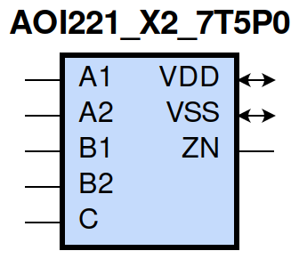
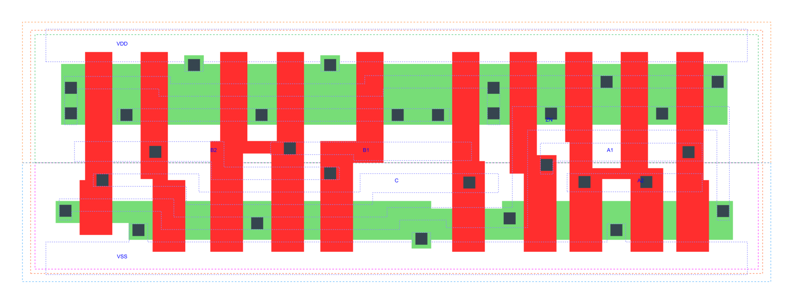

=======================================
gf180mcu_fd_sc_mcu7t5v0__aoi221_x2
=======================================

**gf180mcu_fd_sc_mcu7t5v0__aoi221_x2 symbol**

**gf180mcu_fd_sc_mcu7t5v0__aoi221_x2 schematic**

.. image:: sc7_sch/AOI221_X2_sch.png
    :height: 300px
    :width: 500 px
    :align: center
    :alt: gf180mcu_fd_sc_mcu7t5v0__aoi221_x2 schematic

**gf180mcu_fd_sc_mcu7t5v0__aoi221_x2 layout**

.. include:: images.rst

AOI221_X2 is a two 2-input AND into 3-input NOR, NOR[AND(A1,A2),AND(B1,B2),C], 2X drive strength

|
| Attributes

============= ======================
**Attribute** **Value**
area          50.489600 µm\ :sup:`2`
============= ======================

|
| OUTPUT FUNCTIONS

+----------------+-------------------------------------------------------------------------------+
| **Output Pin** | **Function**                                                                  |
+----------------+-------------------------------------------------------------------------------+
| ZN             | (((!A1)&(!B1)&(!C))|((!A1)&(!B2)&(!C))|((!A2)&(!B1)&(!C))|((!A2)&(!B2)&(!C))) |
+----------------+-------------------------------------------------------------------------------+

|
| TRUTH TABLE FOR ZN

====== ====== ====== ====== ===== ======
**A1** **A2** **B1** **B2** **C** **ZN**
0      ?      0      ?      0     1
0      ?      ?      0      0     1
?      0      0      ?      0     1
?      0      ?      0      0     1
1      1      ?      ?      ?     0
?      ?      1      1      ?     0
?      ?      ?      ?      1     0
====== ====== ====== ====== ===== ======

|
| FUNCTIONAL SCHEMATIC
| |image77|
| PIN CAPACITANCE (pf)

======= ======== ====================
**Pin** **Type** **Capacitance (pf)**
B2      input    0.0092
C       input    0.0092
B1      input    0.0088
A1      input    0.0094
A2      input    0.0087
======= ======== ====================

|
| DELAY AND OUTPUT TRANSITION TIME corresponding to min slew and load

+---------------+------------+--------------------+--------------+-------------------+----------------+---------------+
| **Input Pin** | **Output** | **When Condition** | **Tin (ns)** | **Out Load (pf)** | **Delay (ns)** | **Tout (ns)** |
+---------------+------------+--------------------+--------------+-------------------+----------------+---------------+
| B2(HL)        | ZN(LH)     | !A1&!A2&B1&!C      | 0.0100       | 0.0010            | 0.3271         | 0.2180        |
+---------------+------------+--------------------+--------------+-------------------+----------------+---------------+
| B2(HL)        | ZN(LH)     | !A1&A2&B1&!C       | 0.0100       | 0.0010            | 0.3693         | 0.2186        |
+---------------+------------+--------------------+--------------+-------------------+----------------+---------------+
| B2(HL)        | ZN(LH)     | A1&!A2&B1&!C       | 0.0100       | 0.0010            | 0.4204         | 0.2581        |
+---------------+------------+--------------------+--------------+-------------------+----------------+---------------+
| B2(LH)        | ZN(HL)     | !A1&!A2&B1&!C      | 0.0100       | 0.0010            | 0.1727         | 0.1163        |
+---------------+------------+--------------------+--------------+-------------------+----------------+---------------+
| B2(LH)        | ZN(HL)     | !A1&A2&B1&!C       | 0.0100       | 0.0010            | 0.1373         | 0.1018        |
+---------------+------------+--------------------+--------------+-------------------+----------------+---------------+
| B2(LH)        | ZN(HL)     | A1&!A2&B1&!C       | 0.0100       | 0.0010            | 0.1500         | 0.1238        |
+---------------+------------+--------------------+--------------+-------------------+----------------+---------------+
| C(HL)         | ZN(LH)     | !A1&!A2&!B1&!B2    | 0.0100       | 0.0010            | 0.1908         | 0.1381        |
+---------------+------------+--------------------+--------------+-------------------+----------------+---------------+
| C(HL)         | ZN(LH)     | !A1&!A2&!B1&B2     | 0.0100       | 0.0010            | 0.2299         | 0.1828        |
+---------------+------------+--------------------+--------------+-------------------+----------------+---------------+
| C(HL)         | ZN(LH)     | !A1&!A2&B1&!B2     | 0.0100       | 0.0010            | 0.2757         | 0.2176        |
+---------------+------------+--------------------+--------------+-------------------+----------------+---------------+
| C(HL)         | ZN(LH)     | !A1&A2&!B1&!B2     | 0.0100       | 0.0010            | 0.2228         | 0.1409        |
+---------------+------------+--------------------+--------------+-------------------+----------------+---------------+
| C(HL)         | ZN(LH)     | !A1&A2&!B1&B2      | 0.0100       | 0.0010            | 0.2631         | 0.1769        |
+---------------+------------+--------------------+--------------+-------------------+----------------+---------------+
| C(HL)         | ZN(LH)     | !A1&A2&B1&!B2      | 0.0100       | 0.0010            | 0.3176         | 0.2184        |
+---------------+------------+--------------------+--------------+-------------------+----------------+---------------+
| C(HL)         | ZN(LH)     | A1&!A2&!B1&!B2     | 0.0100       | 0.0010            | 0.2661         | 0.1735        |
+---------------+------------+--------------------+--------------+-------------------+----------------+---------------+
| C(HL)         | ZN(LH)     | A1&!A2&!B1&B2      | 0.0100       | 0.0010            | 0.3151         | 0.2164        |
+---------------+------------+--------------------+--------------+-------------------+----------------+---------------+
| C(HL)         | ZN(LH)     | A1&!A2&B1&!B2      | 0.0100       | 0.0010            | 0.3690         | 0.2580        |
+---------------+------------+--------------------+--------------+-------------------+----------------+---------------+
| C(LH)         | ZN(HL)     | !A1&!A2&!B1&!B2    | 0.0100       | 0.0010            | 0.1296         | 0.0824        |
+---------------+------------+--------------------+--------------+-------------------+----------------+---------------+
| C(LH)         | ZN(HL)     | !A1&!A2&!B1&B2     | 0.0100       | 0.0010            | 0.1299         | 0.0824        |
+---------------+------------+--------------------+--------------+-------------------+----------------+---------------+
| C(LH)         | ZN(HL)     | !A1&!A2&B1&!B2     | 0.0100       | 0.0010            | 0.1395         | 0.1001        |
+---------------+------------+--------------------+--------------+-------------------+----------------+---------------+
| C(LH)         | ZN(HL)     | !A1&A2&!B1&!B2     | 0.0100       | 0.0010            | 0.1078         | 0.0729        |
+---------------+------------+--------------------+--------------+-------------------+----------------+---------------+
| C(LH)         | ZN(HL)     | !A1&A2&!B1&B2      | 0.0100       | 0.0010            | 0.1081         | 0.0732        |
+---------------+------------+--------------------+--------------+-------------------+----------------+---------------+
| C(LH)         | ZN(HL)     | !A1&A2&B1&!B2      | 0.0100       | 0.0010            | 0.1176         | 0.0916        |
+---------------+------------+--------------------+--------------+-------------------+----------------+---------------+
| C(LH)         | ZN(HL)     | A1&!A2&!B1&!B2     | 0.0100       | 0.0010            | 0.1171         | 0.0905        |
+---------------+------------+--------------------+--------------+-------------------+----------------+---------------+
| C(LH)         | ZN(HL)     | A1&!A2&!B1&B2      | 0.0100       | 0.0010            | 0.1174         | 0.0904        |
+---------------+------------+--------------------+--------------+-------------------+----------------+---------------+
| C(LH)         | ZN(HL)     | A1&!A2&B1&!B2      | 0.0100       | 0.0010            | 0.1281         | 0.1085        |
+---------------+------------+--------------------+--------------+-------------------+----------------+---------------+
| B1(HL)        | ZN(LH)     | !A1&!A2&B2&!C      | 0.0100       | 0.0010            | 0.2897         | 0.1826        |
+---------------+------------+--------------------+--------------+-------------------+----------------+---------------+
| B1(HL)        | ZN(LH)     | !A1&A2&B2&!C       | 0.0100       | 0.0010            | 0.3244         | 0.1765        |
+---------------+------------+--------------------+--------------+-------------------+----------------+---------------+
| B1(HL)        | ZN(LH)     | A1&!A2&B2&!C       | 0.0100       | 0.0010            | 0.3775         | 0.2162        |
+---------------+------------+--------------------+--------------+-------------------+----------------+---------------+
| B1(LH)        | ZN(HL)     | !A1&!A2&B2&!C      | 0.0100       | 0.0010            | 0.1609         | 0.1166        |
+---------------+------------+--------------------+--------------+-------------------+----------------+---------------+
| B1(LH)        | ZN(HL)     | !A1&A2&B2&!C       | 0.0100       | 0.0010            | 0.1253         | 0.1026        |
+---------------+------------+--------------------+--------------+-------------------+----------------+---------------+
| B1(LH)        | ZN(HL)     | A1&!A2&B2&!C       | 0.0100       | 0.0010            | 0.1381         | 0.1246        |
+---------------+------------+--------------------+--------------+-------------------+----------------+---------------+
| A1(HL)        | ZN(LH)     | A2&!B1&!B2&!C      | 0.0100       | 0.0010            | 0.1423         | 0.1334        |
+---------------+------------+--------------------+--------------+-------------------+----------------+---------------+
| A1(HL)        | ZN(LH)     | A2&!B1&B2&!C       | 0.0100       | 0.0010            | 0.1530         | 0.1609        |
+---------------+------------+--------------------+--------------+-------------------+----------------+---------------+
| A1(HL)        | ZN(LH)     | A2&B1&!B2&!C       | 0.0100       | 0.0010            | 0.2057         | 0.2090        |
+---------------+------------+--------------------+--------------+-------------------+----------------+---------------+
| A1(LH)        | ZN(HL)     | A2&!B1&!B2&!C      | 0.0100       | 0.0010            | 0.0803         | 0.0512        |
+---------------+------------+--------------------+--------------+-------------------+----------------+---------------+
| A1(LH)        | ZN(HL)     | A2&!B1&B2&!C       | 0.0100       | 0.0010            | 0.0803         | 0.0512        |
+---------------+------------+--------------------+--------------+-------------------+----------------+---------------+
| A1(LH)        | ZN(HL)     | A2&B1&!B2&!C       | 0.0100       | 0.0010            | 0.0861         | 0.0680        |
+---------------+------------+--------------------+--------------+-------------------+----------------+---------------+
| A2(HL)        | ZN(LH)     | A1&!B1&!B2&!C      | 0.0100       | 0.0010            | 0.1757         | 0.1692        |
+---------------+------------+--------------------+--------------+-------------------+----------------+---------------+
| A2(HL)        | ZN(LH)     | A1&!B1&B2&!C       | 0.0100       | 0.0010            | 0.1920         | 0.2053        |
+---------------+------------+--------------------+--------------+-------------------+----------------+---------------+
| A2(HL)        | ZN(LH)     | A1&B1&!B2&!C       | 0.0100       | 0.0010            | 0.2450         | 0.2514        |
+---------------+------------+--------------------+--------------+-------------------+----------------+---------------+
| A2(LH)        | ZN(HL)     | A1&!B1&!B2&!C      | 0.0100       | 0.0010            | 0.0912         | 0.0512        |
+---------------+------------+--------------------+--------------+-------------------+----------------+---------------+
| A2(LH)        | ZN(HL)     | A1&!B1&B2&!C       | 0.0100       | 0.0010            | 0.0912         | 0.0512        |
+---------------+------------+--------------------+--------------+-------------------+----------------+---------------+
| A2(LH)        | ZN(HL)     | A1&B1&!B2&!C       | 0.0100       | 0.0010            | 0.0971         | 0.0680        |
+---------------+------------+--------------------+--------------+-------------------+----------------+---------------+

|
| DYNAMIC ENERGY

+---------------+--------------------+--------------+------------+-------------------+---------------------+
| **Input Pin** | **When Condition** | **Tin (ns)** | **Output** | **Out Load (pf)** | **Energy (uW/MHz)** |
+---------------+--------------------+--------------+------------+-------------------+---------------------+
| C             | !A1&!A2&!B1&!B2    | 0.0100       | ZN(LH)     | 0.0010            | 0.4707              |
+---------------+--------------------+--------------+------------+-------------------+---------------------+
| C             | !A1&!A2&!B1&B2     | 0.0100       | ZN(LH)     | 0.0010            | 0.4706              |
+---------------+--------------------+--------------+------------+-------------------+---------------------+
| C             | !A1&!A2&B1&!B2     | 0.0100       | ZN(LH)     | 0.0010            | 0.5453              |
+---------------+--------------------+--------------+------------+-------------------+---------------------+
| C             | !A1&A2&!B1&!B2     | 0.0100       | ZN(LH)     | 0.0010            | 0.4299              |
+---------------+--------------------+--------------+------------+-------------------+---------------------+
| C             | !A1&A2&!B1&B2      | 0.0100       | ZN(LH)     | 0.0010            | 0.4299              |
+---------------+--------------------+--------------+------------+-------------------+---------------------+
| C             | !A1&A2&B1&!B2      | 0.0100       | ZN(LH)     | 0.0010            | 0.5049              |
+---------------+--------------------+--------------+------------+-------------------+---------------------+
| C             | A1&!A2&!B1&!B2     | 0.0100       | ZN(LH)     | 0.0010            | 0.5006              |
+---------------+--------------------+--------------+------------+-------------------+---------------------+
| C             | A1&!A2&!B1&B2      | 0.0100       | ZN(LH)     | 0.0010            | 0.5005              |
+---------------+--------------------+--------------+------------+-------------------+---------------------+
| C             | A1&!A2&B1&!B2      | 0.0100       | ZN(LH)     | 0.0010            | 0.5752              |
+---------------+--------------------+--------------+------------+-------------------+---------------------+
| C             | !A1&!A2&!B1&!B2    | 0.0100       | ZN(HL)     | 0.0010            | 0.0945              |
+---------------+--------------------+--------------+------------+-------------------+---------------------+
| C             | !A1&!A2&!B1&B2     | 0.0100       | ZN(HL)     | 0.0010            | 0.0953              |
+---------------+--------------------+--------------+------------+-------------------+---------------------+
| C             | !A1&!A2&B1&!B2     | 0.0100       | ZN(HL)     | 0.0010            | 0.0954              |
+---------------+--------------------+--------------+------------+-------------------+---------------------+
| C             | !A1&A2&!B1&!B2     | 0.0100       | ZN(HL)     | 0.0010            | 0.0824              |
+---------------+--------------------+--------------+------------+-------------------+---------------------+
| C             | !A1&A2&!B1&B2      | 0.0100       | ZN(HL)     | 0.0010            | 0.0834              |
+---------------+--------------------+--------------+------------+-------------------+---------------------+
| C             | !A1&A2&B1&!B2      | 0.0100       | ZN(HL)     | 0.0010            | 0.0835              |
+---------------+--------------------+--------------+------------+-------------------+---------------------+
| C             | A1&!A2&!B1&!B2     | 0.0100       | ZN(HL)     | 0.0010            | 0.0826              |
+---------------+--------------------+--------------+------------+-------------------+---------------------+
| C             | A1&!A2&!B1&B2      | 0.0100       | ZN(HL)     | 0.0010            | 0.0835              |
+---------------+--------------------+--------------+------------+-------------------+---------------------+
| C             | A1&!A2&B1&!B2      | 0.0100       | ZN(HL)     | 0.0010            | 0.0835              |
+---------------+--------------------+--------------+------------+-------------------+---------------------+
| A1            | A2&!B1&!B2&!C      | 0.0100       | ZN(LH)     | 0.0010            | 0.3167              |
+---------------+--------------------+--------------+------------+-------------------+---------------------+
| A1            | A2&!B1&B2&!C       | 0.0100       | ZN(LH)     | 0.0010            | 0.3168              |
+---------------+--------------------+--------------+------------+-------------------+---------------------+
| A1            | A2&B1&!B2&!C       | 0.0100       | ZN(LH)     | 0.0010            | 0.3924              |
+---------------+--------------------+--------------+------------+-------------------+---------------------+
| B2            | !A1&!A2&B1&!C      | 0.0100       | ZN(LH)     | 0.0010            | 0.6394              |
+---------------+--------------------+--------------+------------+-------------------+---------------------+
| B2            | !A1&A2&B1&!C       | 0.0100       | ZN(LH)     | 0.0010            | 0.5988              |
+---------------+--------------------+--------------+------------+-------------------+---------------------+
| B2            | A1&!A2&B1&!C       | 0.0100       | ZN(LH)     | 0.0010            | 0.6689              |
+---------------+--------------------+--------------+------------+-------------------+---------------------+
| B1            | !A1&!A2&B2&!C      | 0.0100       | ZN(LH)     | 0.0010            | 0.5746              |
+---------------+--------------------+--------------+------------+-------------------+---------------------+
| B1            | !A1&A2&B2&!C       | 0.0100       | ZN(LH)     | 0.0010            | 0.5338              |
+---------------+--------------------+--------------+------------+-------------------+---------------------+
| B1            | A1&!A2&B2&!C       | 0.0100       | ZN(LH)     | 0.0010            | 0.6056              |
+---------------+--------------------+--------------+------------+-------------------+---------------------+
| A2            | A1&!B1&!B2&!C      | 0.0100       | ZN(LH)     | 0.0010            | 0.3770              |
+---------------+--------------------+--------------+------------+-------------------+---------------------+
| A2            | A1&!B1&B2&!C       | 0.0100       | ZN(LH)     | 0.0010            | 0.3771              |
+---------------+--------------------+--------------+------------+-------------------+---------------------+
| A2            | A1&B1&!B2&!C       | 0.0100       | ZN(LH)     | 0.0010            | 0.4515              |
+---------------+--------------------+--------------+------------+-------------------+---------------------+
| B1            | !A1&!A2&B2&!C      | 0.0100       | ZN(HL)     | 0.0010            | 0.1654              |
+---------------+--------------------+--------------+------------+-------------------+---------------------+
| B1            | !A1&A2&B2&!C       | 0.0100       | ZN(HL)     | 0.0010            | 0.1539              |
+---------------+--------------------+--------------+------------+-------------------+---------------------+
| B1            | A1&!A2&B2&!C       | 0.0100       | ZN(HL)     | 0.0010            | 0.1541              |
+---------------+--------------------+--------------+------------+-------------------+---------------------+
| A1            | A2&!B1&!B2&!C      | 0.0100       | ZN(HL)     | 0.0010            | 0.0086              |
+---------------+--------------------+--------------+------------+-------------------+---------------------+
| A1            | A2&!B1&B2&!C       | 0.0100       | ZN(HL)     | 0.0010            | 0.0086              |
+---------------+--------------------+--------------+------------+-------------------+---------------------+
| A1            | A2&B1&!B2&!C       | 0.0100       | ZN(HL)     | 0.0010            | 0.0086              |
+---------------+--------------------+--------------+------------+-------------------+---------------------+
| B2            | !A1&!A2&B1&!C      | 0.0100       | ZN(HL)     | 0.0010            | 0.1655              |
+---------------+--------------------+--------------+------------+-------------------+---------------------+
| B2            | !A1&A2&B1&!C       | 0.0100       | ZN(HL)     | 0.0010            | 0.1540              |
+---------------+--------------------+--------------+------------+-------------------+---------------------+
| B2            | A1&!A2&B1&!C       | 0.0100       | ZN(HL)     | 0.0010            | 0.1540              |
+---------------+--------------------+--------------+------------+-------------------+---------------------+
| A2            | A1&!B1&!B2&!C      | 0.0100       | ZN(HL)     | 0.0010            | 0.0085              |
+---------------+--------------------+--------------+------------+-------------------+---------------------+
| A2            | A1&!B1&B2&!C       | 0.0100       | ZN(HL)     | 0.0010            | 0.0085              |
+---------------+--------------------+--------------+------------+-------------------+---------------------+
| A2            | A1&B1&!B2&!C       | 0.0100       | ZN(HL)     | 0.0010            | 0.0085              |
+---------------+--------------------+--------------+------------+-------------------+---------------------+
| A1(LH)        | !A2&!B1&!B2&!C     | 0.0100       | n/a        | n/a               | -0.0566             |
+---------------+--------------------+--------------+------------+-------------------+---------------------+
| A1(LH)        | !A2&!B1&B2&!C      | 0.0100       | n/a        | n/a               | -0.0566             |
+---------------+--------------------+--------------+------------+-------------------+---------------------+
| A1(LH)        | !A2&B1&!B2&!C      | 0.0100       | n/a        | n/a               | -0.0566             |
+---------------+--------------------+--------------+------------+-------------------+---------------------+
| A1(LH)        | !A2&!B1&!B2&C      | 0.0100       | n/a        | n/a               | -0.0173             |
+---------------+--------------------+--------------+------------+-------------------+---------------------+
| A1(LH)        | !A2&!B1&B2&C       | 0.0100       | n/a        | n/a               | -0.0173             |
+---------------+--------------------+--------------+------------+-------------------+---------------------+
| A1(LH)        | !A2&B1&!B2&C       | 0.0100       | n/a        | n/a               | -0.0173             |
+---------------+--------------------+--------------+------------+-------------------+---------------------+
| A1(LH)        | !A2&B1&B2&!C       | 0.0100       | n/a        | n/a               | -0.0172             |
+---------------+--------------------+--------------+------------+-------------------+---------------------+
| A1(LH)        | !A2&B1&B2&C        | 0.0100       | n/a        | n/a               | -0.0173             |
+---------------+--------------------+--------------+------------+-------------------+---------------------+
| A1(LH)        | A2&!B1&!B2&C       | 0.0100       | n/a        | n/a               | -0.0177             |
+---------------+--------------------+--------------+------------+-------------------+---------------------+
| A1(LH)        | A2&!B1&B2&C        | 0.0100       | n/a        | n/a               | -0.0177             |
+---------------+--------------------+--------------+------------+-------------------+---------------------+
| A1(LH)        | A2&B1&!B2&C        | 0.0100       | n/a        | n/a               | -0.0177             |
+---------------+--------------------+--------------+------------+-------------------+---------------------+
| A1(LH)        | A2&B1&B2&!C        | 0.0100       | n/a        | n/a               | -0.0178             |
+---------------+--------------------+--------------+------------+-------------------+---------------------+
| A1(LH)        | A2&B1&B2&C         | 0.0100       | n/a        | n/a               | -0.0177             |
+---------------+--------------------+--------------+------------+-------------------+---------------------+
| C(HL)         | !A1&!A2&B1&B2      | 0.0100       | n/a        | n/a               | 0.0742              |
+---------------+--------------------+--------------+------------+-------------------+---------------------+
| C(HL)         | !A1&A2&B1&B2       | 0.0100       | n/a        | n/a               | 0.0739              |
+---------------+--------------------+--------------+------------+-------------------+---------------------+
| C(HL)         | A1&!A2&B1&B2       | 0.0100       | n/a        | n/a               | 0.0739              |
+---------------+--------------------+--------------+------------+-------------------+---------------------+
| C(HL)         | A1&A2&!B1&!B2      | 0.0100       | n/a        | n/a               | 0.0733              |
+---------------+--------------------+--------------+------------+-------------------+---------------------+
| C(HL)         | A1&A2&!B1&B2       | 0.0100       | n/a        | n/a               | 0.0733              |
+---------------+--------------------+--------------+------------+-------------------+---------------------+
| C(HL)         | A1&A2&B1&!B2       | 0.0100       | n/a        | n/a               | 0.0733              |
+---------------+--------------------+--------------+------------+-------------------+---------------------+
| C(HL)         | A1&A2&B1&B2        | 0.0100       | n/a        | n/a               | 0.0371              |
+---------------+--------------------+--------------+------------+-------------------+---------------------+
| B2(LH)        | !A1&!A2&!B1&!C     | 0.0100       | n/a        | n/a               | -0.0720             |
+---------------+--------------------+--------------+------------+-------------------+---------------------+
| B2(LH)        | !A1&A2&!B1&!C      | 0.0100       | n/a        | n/a               | -0.0720             |
+---------------+--------------------+--------------+------------+-------------------+---------------------+
| B2(LH)        | A1&!A2&!B1&!C      | 0.0100       | n/a        | n/a               | -0.0720             |
+---------------+--------------------+--------------+------------+-------------------+---------------------+
| B2(LH)        | !A1&!A2&!B1&C      | 0.0100       | n/a        | n/a               | -0.0717             |
+---------------+--------------------+--------------+------------+-------------------+---------------------+
| B2(LH)        | !A1&!A2&B1&C       | 0.0100       | n/a        | n/a               | -0.0615             |
+---------------+--------------------+--------------+------------+-------------------+---------------------+
| B2(LH)        | !A1&A2&!B1&C       | 0.0100       | n/a        | n/a               | -0.0717             |
+---------------+--------------------+--------------+------------+-------------------+---------------------+
| B2(LH)        | !A1&A2&B1&C        | 0.0100       | n/a        | n/a               | -0.0615             |
+---------------+--------------------+--------------+------------+-------------------+---------------------+
| B2(LH)        | A1&!A2&!B1&C       | 0.0100       | n/a        | n/a               | -0.0717             |
+---------------+--------------------+--------------+------------+-------------------+---------------------+
| B2(LH)        | A1&!A2&B1&C        | 0.0100       | n/a        | n/a               | -0.0615             |
+---------------+--------------------+--------------+------------+-------------------+---------------------+
| B2(LH)        | A1&A2&!B1&!C       | 0.0100       | n/a        | n/a               | -0.0718             |
+---------------+--------------------+--------------+------------+-------------------+---------------------+
| B2(LH)        | A1&A2&!B1&C        | 0.0100       | n/a        | n/a               | -0.0717             |
+---------------+--------------------+--------------+------------+-------------------+---------------------+
| B2(LH)        | A1&A2&B1&!C        | 0.0100       | n/a        | n/a               | -0.0570             |
+---------------+--------------------+--------------+------------+-------------------+---------------------+
| B2(LH)        | A1&A2&B1&C         | 0.0100       | n/a        | n/a               | -0.0628             |
+---------------+--------------------+--------------+------------+-------------------+---------------------+
| A2(HL)        | !A1&!B1&!B2&!C     | 0.0100       | n/a        | n/a               | 0.0796              |
+---------------+--------------------+--------------+------------+-------------------+---------------------+
| A2(HL)        | !A1&!B1&B2&!C      | 0.0100       | n/a        | n/a               | 0.0796              |
+---------------+--------------------+--------------+------------+-------------------+---------------------+
| A2(HL)        | !A1&B1&!B2&!C      | 0.0100       | n/a        | n/a               | 0.0796              |
+---------------+--------------------+--------------+------------+-------------------+---------------------+
| A2(HL)        | !A1&!B1&!B2&C      | 0.0100       | n/a        | n/a               | 0.0176              |
+---------------+--------------------+--------------+------------+-------------------+---------------------+
| A2(HL)        | !A1&!B1&B2&C       | 0.0100       | n/a        | n/a               | 0.0176              |
+---------------+--------------------+--------------+------------+-------------------+---------------------+
| A2(HL)        | !A1&B1&!B2&C       | 0.0100       | n/a        | n/a               | 0.0176              |
+---------------+--------------------+--------------+------------+-------------------+---------------------+
| A2(HL)        | !A1&B1&B2&!C       | 0.0100       | n/a        | n/a               | 0.0176              |
+---------------+--------------------+--------------+------------+-------------------+---------------------+
| A2(HL)        | !A1&B1&B2&C        | 0.0100       | n/a        | n/a               | 0.0176              |
+---------------+--------------------+--------------+------------+-------------------+---------------------+
| A2(HL)        | A1&!B1&!B2&C       | 0.0100       | n/a        | n/a               | 0.0767              |
+---------------+--------------------+--------------+------------+-------------------+---------------------+
| A2(HL)        | A1&!B1&B2&C        | 0.0100       | n/a        | n/a               | 0.0767              |
+---------------+--------------------+--------------+------------+-------------------+---------------------+
| A2(HL)        | A1&B1&!B2&C        | 0.0100       | n/a        | n/a               | 0.0767              |
+---------------+--------------------+--------------+------------+-------------------+---------------------+
| A2(HL)        | A1&B1&B2&!C        | 0.0100       | n/a        | n/a               | 0.1508              |
+---------------+--------------------+--------------+------------+-------------------+---------------------+
| A2(HL)        | A1&B1&B2&C         | 0.0100       | n/a        | n/a               | 0.0767              |
+---------------+--------------------+--------------+------------+-------------------+---------------------+
| B1(HL)        | !A1&!A2&!B2&!C     | 0.0100       | n/a        | n/a               | 0.0802              |
+---------------+--------------------+--------------+------------+-------------------+---------------------+
| B1(HL)        | !A1&A2&!B2&!C      | 0.0100       | n/a        | n/a               | 0.0801              |
+---------------+--------------------+--------------+------------+-------------------+---------------------+
| B1(HL)        | A1&!A2&!B2&!C      | 0.0100       | n/a        | n/a               | 0.0802              |
+---------------+--------------------+--------------+------------+-------------------+---------------------+
| B1(HL)        | !A1&!A2&!B2&C      | 0.0100       | n/a        | n/a               | 0.0722              |
+---------------+--------------------+--------------+------------+-------------------+---------------------+
| B1(HL)        | !A1&!A2&B2&C       | 0.0100       | n/a        | n/a               | 0.0721              |
+---------------+--------------------+--------------+------------+-------------------+---------------------+
| B1(HL)        | !A1&A2&!B2&C       | 0.0100       | n/a        | n/a               | 0.0722              |
+---------------+--------------------+--------------+------------+-------------------+---------------------+
| B1(HL)        | !A1&A2&B2&C        | 0.0100       | n/a        | n/a               | 0.0721              |
+---------------+--------------------+--------------+------------+-------------------+---------------------+
| B1(HL)        | A1&!A2&!B2&C       | 0.0100       | n/a        | n/a               | 0.0721              |
+---------------+--------------------+--------------+------------+-------------------+---------------------+
| B1(HL)        | A1&!A2&B2&C        | 0.0100       | n/a        | n/a               | 0.0721              |
+---------------+--------------------+--------------+------------+-------------------+---------------------+
| B1(HL)        | A1&A2&!B2&!C       | 0.0100       | n/a        | n/a               | 0.0722              |
+---------------+--------------------+--------------+------------+-------------------+---------------------+
| B1(HL)        | A1&A2&!B2&C        | 0.0100       | n/a        | n/a               | 0.0722              |
+---------------+--------------------+--------------+------------+-------------------+---------------------+
| B1(HL)        | A1&A2&B2&!C        | 0.0100       | n/a        | n/a               | 0.0731              |
+---------------+--------------------+--------------+------------+-------------------+---------------------+
| B1(HL)        | A1&A2&B2&C         | 0.0100       | n/a        | n/a               | 0.0721              |
+---------------+--------------------+--------------+------------+-------------------+---------------------+
| B2(HL)        | !A1&!A2&!B1&!C     | 0.0100       | n/a        | n/a               | 0.0798              |
+---------------+--------------------+--------------+------------+-------------------+---------------------+
| B2(HL)        | !A1&A2&!B1&!C      | 0.0100       | n/a        | n/a               | 0.0798              |
+---------------+--------------------+--------------+------------+-------------------+---------------------+
| B2(HL)        | A1&!A2&!B1&!C      | 0.0100       | n/a        | n/a               | 0.0798              |
+---------------+--------------------+--------------+------------+-------------------+---------------------+
| B2(HL)        | !A1&!A2&!B1&C      | 0.0100       | n/a        | n/a               | 0.0723              |
+---------------+--------------------+--------------+------------+-------------------+---------------------+
| B2(HL)        | !A1&!A2&B1&C       | 0.0100       | n/a        | n/a               | 0.0721              |
+---------------+--------------------+--------------+------------+-------------------+---------------------+
| B2(HL)        | !A1&A2&!B1&C       | 0.0100       | n/a        | n/a               | 0.0723              |
+---------------+--------------------+--------------+------------+-------------------+---------------------+
| B2(HL)        | !A1&A2&B1&C        | 0.0100       | n/a        | n/a               | 0.0721              |
+---------------+--------------------+--------------+------------+-------------------+---------------------+
| B2(HL)        | A1&!A2&!B1&C       | 0.0100       | n/a        | n/a               | 0.0723              |
+---------------+--------------------+--------------+------------+-------------------+---------------------+
| B2(HL)        | A1&!A2&B1&C        | 0.0100       | n/a        | n/a               | 0.0721              |
+---------------+--------------------+--------------+------------+-------------------+---------------------+
| B2(HL)        | A1&A2&!B1&!C       | 0.0100       | n/a        | n/a               | 0.0722              |
+---------------+--------------------+--------------+------------+-------------------+---------------------+
| B2(HL)        | A1&A2&!B1&C        | 0.0100       | n/a        | n/a               | 0.0723              |
+---------------+--------------------+--------------+------------+-------------------+---------------------+
| B2(HL)        | A1&A2&B1&!C        | 0.0100       | n/a        | n/a               | 0.0732              |
+---------------+--------------------+--------------+------------+-------------------+---------------------+
| B2(HL)        | A1&A2&B1&C         | 0.0100       | n/a        | n/a               | 0.0721              |
+---------------+--------------------+--------------+------------+-------------------+---------------------+
| A1(HL)        | !A2&!B1&!B2&!C     | 0.0100       | n/a        | n/a               | 0.0805              |
+---------------+--------------------+--------------+------------+-------------------+---------------------+
| A1(HL)        | !A2&!B1&B2&!C      | 0.0100       | n/a        | n/a               | 0.0805              |
+---------------+--------------------+--------------+------------+-------------------+---------------------+
| A1(HL)        | !A2&B1&!B2&!C      | 0.0100       | n/a        | n/a               | 0.0805              |
+---------------+--------------------+--------------+------------+-------------------+---------------------+
| A1(HL)        | !A2&!B1&!B2&C      | 0.0100       | n/a        | n/a               | 0.0176              |
+---------------+--------------------+--------------+------------+-------------------+---------------------+
| A1(HL)        | !A2&!B1&B2&C       | 0.0100       | n/a        | n/a               | 0.0176              |
+---------------+--------------------+--------------+------------+-------------------+---------------------+
| A1(HL)        | !A2&B1&!B2&C       | 0.0100       | n/a        | n/a               | 0.0176              |
+---------------+--------------------+--------------+------------+-------------------+---------------------+
| A1(HL)        | !A2&B1&B2&!C       | 0.0100       | n/a        | n/a               | 0.0175              |
+---------------+--------------------+--------------+------------+-------------------+---------------------+
| A1(HL)        | !A2&B1&B2&C        | 0.0100       | n/a        | n/a               | 0.0176              |
+---------------+--------------------+--------------+------------+-------------------+---------------------+
| A1(HL)        | A2&!B1&!B2&C       | 0.0100       | n/a        | n/a               | 0.0767              |
+---------------+--------------------+--------------+------------+-------------------+---------------------+
| A1(HL)        | A2&!B1&B2&C        | 0.0100       | n/a        | n/a               | 0.0767              |
+---------------+--------------------+--------------+------------+-------------------+---------------------+
| A1(HL)        | A2&B1&!B2&C        | 0.0100       | n/a        | n/a               | 0.0767              |
+---------------+--------------------+--------------+------------+-------------------+---------------------+
| A1(HL)        | A2&B1&B2&!C        | 0.0100       | n/a        | n/a               | 0.1508              |
+---------------+--------------------+--------------+------------+-------------------+---------------------+
| A1(HL)        | A2&B1&B2&C         | 0.0100       | n/a        | n/a               | 0.0767              |
+---------------+--------------------+--------------+------------+-------------------+---------------------+
| B1(LH)        | !A1&!A2&!B2&!C     | 0.0100       | n/a        | n/a               | -0.0516             |
+---------------+--------------------+--------------+------------+-------------------+---------------------+
| B1(LH)        | !A1&A2&!B2&!C      | 0.0100       | n/a        | n/a               | -0.0516             |
+---------------+--------------------+--------------+------------+-------------------+---------------------+
| B1(LH)        | A1&!A2&!B2&!C      | 0.0100       | n/a        | n/a               | -0.0516             |
+---------------+--------------------+--------------+------------+-------------------+---------------------+
| B1(LH)        | !A1&!A2&!B2&C      | 0.0100       | n/a        | n/a               | -0.0718             |
+---------------+--------------------+--------------+------------+-------------------+---------------------+
| B1(LH)        | !A1&!A2&B2&C       | 0.0100       | n/a        | n/a               | -0.0616             |
+---------------+--------------------+--------------+------------+-------------------+---------------------+
| B1(LH)        | !A1&A2&!B2&C       | 0.0100       | n/a        | n/a               | -0.0718             |
+---------------+--------------------+--------------+------------+-------------------+---------------------+
| B1(LH)        | !A1&A2&B2&C        | 0.0100       | n/a        | n/a               | -0.0616             |
+---------------+--------------------+--------------+------------+-------------------+---------------------+
| B1(LH)        | A1&!A2&!B2&C       | 0.0100       | n/a        | n/a               | -0.0718             |
+---------------+--------------------+--------------+------------+-------------------+---------------------+
| B1(LH)        | A1&!A2&B2&C        | 0.0100       | n/a        | n/a               | -0.0616             |
+---------------+--------------------+--------------+------------+-------------------+---------------------+
| B1(LH)        | A1&A2&!B2&!C       | 0.0100       | n/a        | n/a               | -0.0718             |
+---------------+--------------------+--------------+------------+-------------------+---------------------+
| B1(LH)        | A1&A2&!B2&C        | 0.0100       | n/a        | n/a               | -0.0718             |
+---------------+--------------------+--------------+------------+-------------------+---------------------+
| B1(LH)        | A1&A2&B2&!C        | 0.0100       | n/a        | n/a               | -0.0570             |
+---------------+--------------------+--------------+------------+-------------------+---------------------+
| B1(LH)        | A1&A2&B2&C         | 0.0100       | n/a        | n/a               | -0.0629             |
+---------------+--------------------+--------------+------------+-------------------+---------------------+
| C(LH)         | !A1&!A2&B1&B2      | 0.0100       | n/a        | n/a               | -0.0215             |
+---------------+--------------------+--------------+------------+-------------------+---------------------+
| C(LH)         | !A1&A2&B1&B2       | 0.0100       | n/a        | n/a               | -0.0216             |
+---------------+--------------------+--------------+------------+-------------------+---------------------+
| C(LH)         | A1&!A2&B1&B2       | 0.0100       | n/a        | n/a               | -0.0216             |
+---------------+--------------------+--------------+------------+-------------------+---------------------+
| C(LH)         | A1&A2&!B1&!B2      | 0.0100       | n/a        | n/a               | -0.0527             |
+---------------+--------------------+--------------+------------+-------------------+---------------------+
| C(LH)         | A1&A2&!B1&B2       | 0.0100       | n/a        | n/a               | -0.0521             |
+---------------+--------------------+--------------+------------+-------------------+---------------------+
| C(LH)         | A1&A2&B1&!B2       | 0.0100       | n/a        | n/a               | -0.0521             |
+---------------+--------------------+--------------+------------+-------------------+---------------------+
| C(LH)         | A1&A2&B1&B2        | 0.0100       | n/a        | n/a               | -0.0401             |
+---------------+--------------------+--------------+------------+-------------------+---------------------+
| A2(LH)        | !A1&!B1&!B2&!C     | 0.0100       | n/a        | n/a               | -0.0727             |
+---------------+--------------------+--------------+------------+-------------------+---------------------+
| A2(LH)        | !A1&!B1&B2&!C      | 0.0100       | n/a        | n/a               | -0.0727             |
+---------------+--------------------+--------------+------------+-------------------+---------------------+
| A2(LH)        | !A1&B1&!B2&!C      | 0.0100       | n/a        | n/a               | -0.0727             |
+---------------+--------------------+--------------+------------+-------------------+---------------------+
| A2(LH)        | !A1&!B1&!B2&C      | 0.0100       | n/a        | n/a               | -0.0173             |
+---------------+--------------------+--------------+------------+-------------------+---------------------+
| A2(LH)        | !A1&!B1&B2&C       | 0.0100       | n/a        | n/a               | -0.0173             |
+---------------+--------------------+--------------+------------+-------------------+---------------------+
| A2(LH)        | !A1&B1&!B2&C       | 0.0100       | n/a        | n/a               | -0.0173             |
+---------------+--------------------+--------------+------------+-------------------+---------------------+
| A2(LH)        | !A1&B1&B2&!C       | 0.0100       | n/a        | n/a               | -0.0172             |
+---------------+--------------------+--------------+------------+-------------------+---------------------+
| A2(LH)        | !A1&B1&B2&C        | 0.0100       | n/a        | n/a               | -0.0173             |
+---------------+--------------------+--------------+------------+-------------------+---------------------+
| A2(LH)        | A1&!B1&!B2&C       | 0.0100       | n/a        | n/a               | -0.0177             |
+---------------+--------------------+--------------+------------+-------------------+---------------------+
| A2(LH)        | A1&!B1&B2&C        | 0.0100       | n/a        | n/a               | -0.0177             |
+---------------+--------------------+--------------+------------+-------------------+---------------------+
| A2(LH)        | A1&B1&!B2&C        | 0.0100       | n/a        | n/a               | -0.0177             |
+---------------+--------------------+--------------+------------+-------------------+---------------------+
| A2(LH)        | A1&B1&B2&!C        | 0.0100       | n/a        | n/a               | -0.0178             |
+---------------+--------------------+--------------+------------+-------------------+---------------------+
| A2(LH)        | A1&B1&B2&C         | 0.0100       | n/a        | n/a               | -0.0177             |
+---------------+--------------------+--------------+------------+-------------------+---------------------+

|
| LEAKAGE POWER

================== ==============
**When Condition** **Power (nW)**
!A1&!A2&!B1&!B2&!C 0.2026
!A1&!A2&!B1&B2&!C  0.2031
!A1&!A2&B1&!B2&!C  0.2830
!A1&A2&!B1&!B2&!C  0.2031
!A1&A2&!B1&B2&!C   0.2035
!A1&A2&B1&!B2&!C   0.2835
A1&!A2&!B1&!B2&!C  0.2830
A1&!A2&!B1&B2&!C   0.2835
A1&!A2&B1&!B2&!C   0.3634
!A1&!A2&!B1&!B2&C  0.2604
!A1&!A2&!B1&B2&C   0.2604
!A1&!A2&B1&!B2&C   0.2604
!A1&!A2&B1&B2&!C   0.3683
!A1&!A2&B1&B2&C    0.2604
!A1&A2&!B1&!B2&C   0.2648
!A1&A2&!B1&B2&C    0.2648
!A1&A2&B1&!B2&C    0.2648
!A1&A2&B1&B2&!C    0.3725
!A1&A2&B1&B2&C     0.2647
A1&!A2&!B1&!B2&C   0.2648
A1&!A2&!B1&B2&C    0.2648
A1&!A2&B1&!B2&C    0.2647
A1&!A2&B1&B2&!C    0.3725
A1&!A2&B1&B2&C     0.2647
A1&A2&!B1&!B2&!C   0.1557
A1&A2&!B1&!B2&C    0.1563
A1&A2&!B1&B2&!C    0.1557
A1&A2&!B1&B2&C     0.1563
A1&A2&B1&!B2&!C    0.1557
A1&A2&B1&!B2&C     0.1563
A1&A2&B1&B2&!C     0.1563
A1&A2&B1&B2&C      0.1563
================== ==============

