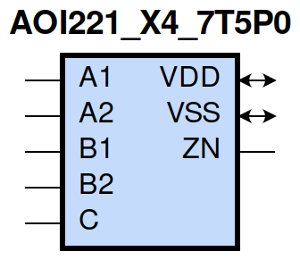
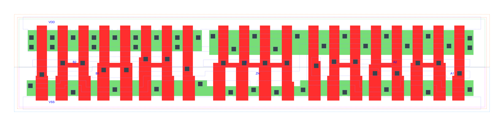

=======================================
gf180mcu_fd_sc_mcu7t5v0__aoi221_x4
=======================================

**gf180mcu_fd_sc_mcu7t5v0__aoi221_x4 symbol**

**gf180mcu_fd_sc_mcu7t5v0__aoi221_x4 schematic**

**gf180mcu_fd_sc_mcu7t5v0__aoi221_x4 layout**

.. include:: images.rst

AOI221_X4 is a two 2-input AND into 3-input NOR, NOR[AND(A1,A2),AND(B1,B2),C], 4X drive strength

|
| Attributes

============= ======================
**Attribute** **Value**
area          87.808000 µm\ :sup:`2`
============= ======================

|
| OUTPUT FUNCTIONS

+----------------+-------------------------------------------------------------------------------+
| **Output Pin** | **Function**                                                                  |
+----------------+-------------------------------------------------------------------------------+
| ZN             | (((!A1)&(!B1)&(!C))|((!A1)&(!B2)&(!C))|((!A2)&(!B1)&(!C))|((!A2)&(!B2)&(!C))) |
+----------------+-------------------------------------------------------------------------------+

|
| TRUTH TABLE FOR ZN

====== ====== ====== ====== ===== ======
**A1** **A2** **B1** **B2** **C** **ZN**
0      ?      0      ?      0     1
0      ?      ?      0      0     1
?      0      0      ?      0     1
?      0      ?      0      0     1
1      1      ?      ?      ?     0
?      ?      1      1      ?     0
?      ?      ?      ?      1     0
====== ====== ====== ====== ===== ======

|
| FUNCTIONAL SCHEMATIC
| |image80|
| PIN CAPACITANCE (pf)

======= ======== ====================
**Pin** **Type** **Capacitance (pf)**
B2      input    0.0172
B1      input    0.0179
C       input    0.0154
A1      input    0.0197
A2      input    0.0188
======= ======== ====================

|
| DELAY AND OUTPUT TRANSITION TIME corresponding to min slew and load

+---------------+------------+--------------------+--------------+-------------------+----------------+---------------+
| **Input Pin** | **Output** | **When Condition** | **Tin (ns)** | **Out Load (pf)** | **Delay (ns)** | **Tout (ns)** |
+---------------+------------+--------------------+--------------+-------------------+----------------+---------------+
| B2(HL)        | ZN(LH)     | !A1&!A2&B1&!C      | 0.0100       | 0.0010            | 0.3133         | 0.2141        |
+---------------+------------+--------------------+--------------+-------------------+----------------+---------------+
| B2(HL)        | ZN(LH)     | !A1&A2&B1&!C       | 0.0100       | 0.0010            | 0.3493         | 0.2110        |
+---------------+------------+--------------------+--------------+-------------------+----------------+---------------+
| B2(HL)        | ZN(LH)     | A1&!A2&B1&!C       | 0.0100       | 0.0010            | 0.4050         | 0.2537        |
+---------------+------------+--------------------+--------------+-------------------+----------------+---------------+
| B2(LH)        | ZN(HL)     | !A1&!A2&B1&!C      | 0.0100       | 0.0010            | 0.1574         | 0.1033        |
+---------------+------------+--------------------+--------------+-------------------+----------------+---------------+
| B2(LH)        | ZN(HL)     | !A1&A2&B1&!C       | 0.0100       | 0.0010            | 0.1256         | 0.0901        |
+---------------+------------+--------------------+--------------+-------------------+----------------+---------------+
| B2(LH)        | ZN(HL)     | A1&!A2&B1&!C       | 0.0100       | 0.0010            | 0.1380         | 0.1122        |
+---------------+------------+--------------------+--------------+-------------------+----------------+---------------+
| B1(HL)        | ZN(LH)     | !A1&!A2&B2&!C      | 0.0100       | 0.0010            | 0.2732         | 0.1769        |
+---------------+------------+--------------------+--------------+-------------------+----------------+---------------+
| B1(HL)        | ZN(LH)     | !A1&A2&B2&!C       | 0.0100       | 0.0010            | 0.3020         | 0.1672        |
+---------------+------------+--------------------+--------------+-------------------+----------------+---------------+
| B1(HL)        | ZN(LH)     | A1&!A2&B2&!C       | 0.0100       | 0.0010            | 0.3598         | 0.2100        |
+---------------+------------+--------------------+--------------+-------------------+----------------+---------------+
| B1(LH)        | ZN(HL)     | !A1&!A2&B2&!C      | 0.0100       | 0.0010            | 0.1456         | 0.1040        |
+---------------+------------+--------------------+--------------+-------------------+----------------+---------------+
| B1(LH)        | ZN(HL)     | !A1&A2&B2&!C       | 0.0100       | 0.0010            | 0.1136         | 0.0906        |
+---------------+------------+--------------------+--------------+-------------------+----------------+---------------+
| B1(LH)        | ZN(HL)     | A1&!A2&B2&!C       | 0.0100       | 0.0010            | 0.1261         | 0.1127        |
+---------------+------------+--------------------+--------------+-------------------+----------------+---------------+
| C(HL)         | ZN(LH)     | !A1&!A2&!B1&!B2    | 0.0100       | 0.0010            | 0.1740         | 0.1293        |
+---------------+------------+--------------------+--------------+-------------------+----------------+---------------+
| C(HL)         | ZN(LH)     | !A1&!A2&!B1&B2     | 0.0100       | 0.0010            | 0.2150         | 0.1772        |
+---------------+------------+--------------------+--------------+-------------------+----------------+---------------+
| C(HL)         | ZN(LH)     | !A1&!A2&B1&!B2     | 0.0100       | 0.0010            | 0.2632         | 0.2138        |
+---------------+------------+--------------------+--------------+-------------------+----------------+---------------+
| C(HL)         | ZN(LH)     | !A1&A2&!B1&!B2     | 0.0100       | 0.0010            | 0.2004         | 0.1295        |
+---------------+------------+--------------------+--------------+-------------------+----------------+---------------+
| C(HL)         | ZN(LH)     | !A1&A2&!B1&B2      | 0.0100       | 0.0010            | 0.2420         | 0.1675        |
+---------------+------------+--------------------+--------------+-------------------+----------------+---------------+
| C(HL)         | ZN(LH)     | !A1&A2&B1&!B2      | 0.0100       | 0.0010            | 0.2989         | 0.2107        |
+---------------+------------+--------------------+--------------+-------------------+----------------+---------------+
| C(HL)         | ZN(LH)     | A1&!A2&!B1&!B2     | 0.0100       | 0.0010            | 0.2461         | 0.1643        |
+---------------+------------+--------------------+--------------+-------------------+----------------+---------------+
| C(HL)         | ZN(LH)     | A1&!A2&!B1&B2      | 0.0100       | 0.0010            | 0.2980         | 0.2102        |
+---------------+------------+--------------------+--------------+-------------------+----------------+---------------+
| C(HL)         | ZN(LH)     | A1&!A2&B1&!B2      | 0.0100       | 0.0010            | 0.3548         | 0.2538        |
+---------------+------------+--------------------+--------------+-------------------+----------------+---------------+
| C(LH)         | ZN(HL)     | !A1&!A2&!B1&!B2    | 0.0100       | 0.0010            | 0.1301         | 0.0802        |
+---------------+------------+--------------------+--------------+-------------------+----------------+---------------+
| C(LH)         | ZN(HL)     | !A1&!A2&!B1&B2     | 0.0100       | 0.0010            | 0.1305         | 0.0803        |
+---------------+------------+--------------------+--------------+-------------------+----------------+---------------+
| C(LH)         | ZN(HL)     | !A1&!A2&B1&!B2     | 0.0100       | 0.0010            | 0.1404         | 0.0991        |
+---------------+------------+--------------------+--------------+-------------------+----------------+---------------+
| C(LH)         | ZN(HL)     | !A1&A2&!B1&!B2     | 0.0100       | 0.0010            | 0.1084         | 0.0703        |
+---------------+------------+--------------------+--------------+-------------------+----------------+---------------+
| C(LH)         | ZN(HL)     | !A1&A2&!B1&B2      | 0.0100       | 0.0010            | 0.1089         | 0.0704        |
+---------------+------------+--------------------+--------------+-------------------+----------------+---------------+
| C(LH)         | ZN(HL)     | !A1&A2&B1&!B2      | 0.0100       | 0.0010            | 0.1187         | 0.0899        |
+---------------+------------+--------------------+--------------+-------------------+----------------+---------------+
| C(LH)         | ZN(HL)     | A1&!A2&!B1&!B2     | 0.0100       | 0.0010            | 0.1183         | 0.0896        |
+---------------+------------+--------------------+--------------+-------------------+----------------+---------------+
| C(LH)         | ZN(HL)     | A1&!A2&!B1&B2      | 0.0100       | 0.0010            | 0.1187         | 0.0896        |
+---------------+------------+--------------------+--------------+-------------------+----------------+---------------+
| C(LH)         | ZN(HL)     | A1&!A2&B1&!B2      | 0.0100       | 0.0010            | 0.1302         | 0.1089        |
+---------------+------------+--------------------+--------------+-------------------+----------------+---------------+
| A1(HL)        | ZN(LH)     | A2&!B1&!B2&!C      | 0.0100       | 0.0010            | 0.1339         | 0.1235        |
+---------------+------------+--------------------+--------------+-------------------+----------------+---------------+
| A1(HL)        | ZN(LH)     | A2&!B1&B2&!C       | 0.0100       | 0.0010            | 0.1462         | 0.1536        |
+---------------+------------+--------------------+--------------+-------------------+----------------+---------------+
| A1(HL)        | ZN(LH)     | A2&B1&!B2&!C       | 0.0100       | 0.0010            | 0.2017         | 0.2029        |
+---------------+------------+--------------------+--------------+-------------------+----------------+---------------+
| A1(LH)        | ZN(HL)     | A2&!B1&!B2&!C      | 0.0100       | 0.0010            | 0.0741         | 0.0458        |
+---------------+------------+--------------------+--------------+-------------------+----------------+---------------+
| A1(LH)        | ZN(HL)     | A2&!B1&B2&!C       | 0.0100       | 0.0010            | 0.0741         | 0.0458        |
+---------------+------------+--------------------+--------------+-------------------+----------------+---------------+
| A1(LH)        | ZN(HL)     | A2&B1&!B2&!C       | 0.0100       | 0.0010            | 0.0798         | 0.0625        |
+---------------+------------+--------------------+--------------+-------------------+----------------+---------------+
| A2(HL)        | ZN(LH)     | A1&!B1&!B2&!C      | 0.0100       | 0.0010            | 0.1701         | 0.1609        |
+---------------+------------+--------------------+--------------+-------------------+----------------+---------------+
| A2(HL)        | ZN(LH)     | A1&!B1&B2&!C       | 0.0100       | 0.0010            | 0.1898         | 0.2014        |
+---------------+------------+--------------------+--------------+-------------------+----------------+---------------+
| A2(HL)        | ZN(LH)     | A1&B1&!B2&!C       | 0.0100       | 0.0010            | 0.2455         | 0.2488        |
+---------------+------------+--------------------+--------------+-------------------+----------------+---------------+
| A2(LH)        | ZN(HL)     | A1&!B1&!B2&!C      | 0.0100       | 0.0010            | 0.0857         | 0.0458        |
+---------------+------------+--------------------+--------------+-------------------+----------------+---------------+
| A2(LH)        | ZN(HL)     | A1&!B1&B2&!C       | 0.0100       | 0.0010            | 0.0857         | 0.0458        |
+---------------+------------+--------------------+--------------+-------------------+----------------+---------------+
| A2(LH)        | ZN(HL)     | A1&B1&!B2&!C       | 0.0100       | 0.0010            | 0.0913         | 0.0625        |
+---------------+------------+--------------------+--------------+-------------------+----------------+---------------+

|
| DYNAMIC ENERGY

+---------------+--------------------+--------------+------------+-------------------+---------------------+
| **Input Pin** | **When Condition** | **Tin (ns)** | **Output** | **Out Load (pf)** | **Energy (uW/MHz)** |
+---------------+--------------------+--------------+------------+-------------------+---------------------+
| C             | !A1&!A2&!B1&!B2    | 0.0100       | ZN(LH)     | 0.0010            | 0.9070              |
+---------------+--------------------+--------------+------------+-------------------+---------------------+
| C             | !A1&!A2&!B1&B2     | 0.0100       | ZN(LH)     | 0.0010            | 0.9073              |
+---------------+--------------------+--------------+------------+-------------------+---------------------+
| C             | !A1&!A2&B1&!B2     | 0.0100       | ZN(LH)     | 0.0010            | 1.0661              |
+---------------+--------------------+--------------+------------+-------------------+---------------------+
| C             | !A1&A2&!B1&!B2     | 0.0100       | ZN(LH)     | 0.0010            | 0.8195              |
+---------------+--------------------+--------------+------------+-------------------+---------------------+
| C             | !A1&A2&!B1&B2      | 0.0100       | ZN(LH)     | 0.0010            | 0.8194              |
+---------------+--------------------+--------------+------------+-------------------+---------------------+
| C             | !A1&A2&B1&!B2      | 0.0100       | ZN(LH)     | 0.0010            | 0.9784              |
+---------------+--------------------+--------------+------------+-------------------+---------------------+
| C             | A1&!A2&!B1&!B2     | 0.0100       | ZN(LH)     | 0.0010            | 0.9762              |
+---------------+--------------------+--------------+------------+-------------------+---------------------+
| C             | A1&!A2&!B1&B2      | 0.0100       | ZN(LH)     | 0.0010            | 0.9763              |
+---------------+--------------------+--------------+------------+-------------------+---------------------+
| C             | A1&!A2&B1&!B2      | 0.0100       | ZN(LH)     | 0.0010            | 1.1349              |
+---------------+--------------------+--------------+------------+-------------------+---------------------+
| C             | !A1&!A2&!B1&!B2    | 0.0100       | ZN(HL)     | 0.0010            | 0.1944              |
+---------------+--------------------+--------------+------------+-------------------+---------------------+
| C             | !A1&!A2&!B1&B2     | 0.0100       | ZN(HL)     | 0.0010            | 0.1964              |
+---------------+--------------------+--------------+------------+-------------------+---------------------+
| C             | !A1&!A2&B1&!B2     | 0.0100       | ZN(HL)     | 0.0010            | 0.1968              |
+---------------+--------------------+--------------+------------+-------------------+---------------------+
| C             | !A1&A2&!B1&!B2     | 0.0100       | ZN(HL)     | 0.0010            | 0.1682              |
+---------------+--------------------+--------------+------------+-------------------+---------------------+
| C             | !A1&A2&!B1&B2      | 0.0100       | ZN(HL)     | 0.0010            | 0.1705              |
+---------------+--------------------+--------------+------------+-------------------+---------------------+
| C             | !A1&A2&B1&!B2      | 0.0100       | ZN(HL)     | 0.0010            | 0.1708              |
+---------------+--------------------+--------------+------------+-------------------+---------------------+
| C             | A1&!A2&!B1&!B2     | 0.0100       | ZN(HL)     | 0.0010            | 0.1684              |
+---------------+--------------------+--------------+------------+-------------------+---------------------+
| C             | A1&!A2&!B1&B2      | 0.0100       | ZN(HL)     | 0.0010            | 0.1708              |
+---------------+--------------------+--------------+------------+-------------------+---------------------+
| C             | A1&!A2&B1&!B2      | 0.0100       | ZN(HL)     | 0.0010            | 0.1707              |
+---------------+--------------------+--------------+------------+-------------------+---------------------+
| A1            | A2&!B1&!B2&!C      | 0.0100       | ZN(LH)     | 0.0010            | 0.6396              |
+---------------+--------------------+--------------+------------+-------------------+---------------------+
| A1            | A2&!B1&B2&!C       | 0.0100       | ZN(LH)     | 0.0010            | 0.6399              |
+---------------+--------------------+--------------+------------+-------------------+---------------------+
| A1            | A2&B1&!B2&!C       | 0.0100       | ZN(LH)     | 0.0010            | 0.8013              |
+---------------+--------------------+--------------+------------+-------------------+---------------------+
| B2            | !A1&!A2&B1&!C      | 0.0100       | ZN(LH)     | 0.0010            | 1.2402              |
+---------------+--------------------+--------------+------------+-------------------+---------------------+
| B2            | !A1&A2&B1&!C       | 0.0100       | ZN(LH)     | 0.0010            | 1.1524              |
+---------------+--------------------+--------------+------------+-------------------+---------------------+
| B2            | A1&!A2&B1&!C       | 0.0100       | ZN(LH)     | 0.0010            | 1.3082              |
+---------------+--------------------+--------------+------------+-------------------+---------------------+
| B1            | !A1&!A2&B2&!C      | 0.0100       | ZN(LH)     | 0.0010            | 1.1000              |
+---------------+--------------------+--------------+------------+-------------------+---------------------+
| B1            | !A1&A2&B2&!C       | 0.0100       | ZN(LH)     | 0.0010            | 1.0124              |
+---------------+--------------------+--------------+------------+-------------------+---------------------+
| B1            | A1&!A2&B2&!C       | 0.0100       | ZN(LH)     | 0.0010            | 1.1725              |
+---------------+--------------------+--------------+------------+-------------------+---------------------+
| A2            | A1&!B1&!B2&!C      | 0.0100       | ZN(LH)     | 0.0010            | 0.7759              |
+---------------+--------------------+--------------+------------+-------------------+---------------------+
| A2            | A1&!B1&B2&!C       | 0.0100       | ZN(LH)     | 0.0010            | 0.7762              |
+---------------+--------------------+--------------+------------+-------------------+---------------------+
| A2            | A1&B1&!B2&!C       | 0.0100       | ZN(LH)     | 0.0010            | 0.9346              |
+---------------+--------------------+--------------+------------+-------------------+---------------------+
| B1            | !A1&!A2&B2&!C      | 0.0100       | ZN(HL)     | 0.0010            | 0.3249              |
+---------------+--------------------+--------------+------------+-------------------+---------------------+
| B1            | !A1&A2&B2&!C       | 0.0100       | ZN(HL)     | 0.0010            | 0.2998              |
+---------------+--------------------+--------------+------------+-------------------+---------------------+
| B1            | A1&!A2&B2&!C       | 0.0100       | ZN(HL)     | 0.0010            | 0.2999              |
+---------------+--------------------+--------------+------------+-------------------+---------------------+
| A1            | A2&!B1&!B2&!C      | 0.0100       | ZN(HL)     | 0.0010            | 0.0175              |
+---------------+--------------------+--------------+------------+-------------------+---------------------+
| A1            | A2&!B1&B2&!C       | 0.0100       | ZN(HL)     | 0.0010            | 0.0175              |
+---------------+--------------------+--------------+------------+-------------------+---------------------+
| A1            | A2&B1&!B2&!C       | 0.0100       | ZN(HL)     | 0.0010            | 0.0173              |
+---------------+--------------------+--------------+------------+-------------------+---------------------+
| B2            | !A1&!A2&B1&!C      | 0.0100       | ZN(HL)     | 0.0010            | 0.3244              |
+---------------+--------------------+--------------+------------+-------------------+---------------------+
| B2            | !A1&A2&B1&!C       | 0.0100       | ZN(HL)     | 0.0010            | 0.2996              |
+---------------+--------------------+--------------+------------+-------------------+---------------------+
| B2            | A1&!A2&B1&!C       | 0.0100       | ZN(HL)     | 0.0010            | 0.2997              |
+---------------+--------------------+--------------+------------+-------------------+---------------------+
| A2            | A1&!B1&!B2&!C      | 0.0100       | ZN(HL)     | 0.0010            | 0.0171              |
+---------------+--------------------+--------------+------------+-------------------+---------------------+
| A2            | A1&!B1&B2&!C       | 0.0100       | ZN(HL)     | 0.0010            | 0.0171              |
+---------------+--------------------+--------------+------------+-------------------+---------------------+
| A2            | A1&B1&!B2&!C       | 0.0100       | ZN(HL)     | 0.0010            | 0.0172              |
+---------------+--------------------+--------------+------------+-------------------+---------------------+
| A1(LH)        | !A2&!B1&!B2&!C     | 0.0100       | n/a        | n/a               | -0.1183             |
+---------------+--------------------+--------------+------------+-------------------+---------------------+
| A1(LH)        | !A2&!B1&B2&!C      | 0.0100       | n/a        | n/a               | -0.1183             |
+---------------+--------------------+--------------+------------+-------------------+---------------------+
| A1(LH)        | !A2&B1&!B2&!C      | 0.0100       | n/a        | n/a               | -0.1183             |
+---------------+--------------------+--------------+------------+-------------------+---------------------+
| A1(LH)        | !A2&!B1&!B2&C      | 0.0100       | n/a        | n/a               | -0.0370             |
+---------------+--------------------+--------------+------------+-------------------+---------------------+
| A1(LH)        | !A2&!B1&B2&C       | 0.0100       | n/a        | n/a               | -0.0370             |
+---------------+--------------------+--------------+------------+-------------------+---------------------+
| A1(LH)        | !A2&B1&!B2&C       | 0.0100       | n/a        | n/a               | -0.0370             |
+---------------+--------------------+--------------+------------+-------------------+---------------------+
| A1(LH)        | !A2&B1&B2&!C       | 0.0100       | n/a        | n/a               | -0.0370             |
+---------------+--------------------+--------------+------------+-------------------+---------------------+
| A1(LH)        | !A2&B1&B2&C        | 0.0100       | n/a        | n/a               | -0.0370             |
+---------------+--------------------+--------------+------------+-------------------+---------------------+
| A1(LH)        | A2&!B1&!B2&C       | 0.0100       | n/a        | n/a               | -0.0401             |
+---------------+--------------------+--------------+------------+-------------------+---------------------+
| A1(LH)        | A2&!B1&B2&C        | 0.0100       | n/a        | n/a               | -0.0401             |
+---------------+--------------------+--------------+------------+-------------------+---------------------+
| A1(LH)        | A2&B1&!B2&C        | 0.0100       | n/a        | n/a               | -0.0402             |
+---------------+--------------------+--------------+------------+-------------------+---------------------+
| A1(LH)        | A2&B1&B2&!C        | 0.0100       | n/a        | n/a               | -0.0398             |
+---------------+--------------------+--------------+------------+-------------------+---------------------+
| A1(LH)        | A2&B1&B2&C         | 0.0100       | n/a        | n/a               | -0.0402             |
+---------------+--------------------+--------------+------------+-------------------+---------------------+
| C(HL)         | !A1&!A2&B1&B2      | 0.0100       | n/a        | n/a               | 0.1243              |
+---------------+--------------------+--------------+------------+-------------------+---------------------+
| C(HL)         | !A1&A2&B1&B2       | 0.0100       | n/a        | n/a               | 0.1239              |
+---------------+--------------------+--------------+------------+-------------------+---------------------+
| C(HL)         | A1&!A2&B1&B2       | 0.0100       | n/a        | n/a               | 0.1239              |
+---------------+--------------------+--------------+------------+-------------------+---------------------+
| C(HL)         | A1&A2&!B1&!B2      | 0.0100       | n/a        | n/a               | 0.1572              |
+---------------+--------------------+--------------+------------+-------------------+---------------------+
| C(HL)         | A1&A2&!B1&B2       | 0.0100       | n/a        | n/a               | 0.1570              |
+---------------+--------------------+--------------+------------+-------------------+---------------------+
| C(HL)         | A1&A2&B1&!B2       | 0.0100       | n/a        | n/a               | 0.1570              |
+---------------+--------------------+--------------+------------+-------------------+---------------------+
| C(HL)         | A1&A2&B1&B2        | 0.0100       | n/a        | n/a               | 0.0818              |
+---------------+--------------------+--------------+------------+-------------------+---------------------+
| B2(LH)        | !A1&!A2&!B1&!C     | 0.0100       | n/a        | n/a               | -0.1328             |
+---------------+--------------------+--------------+------------+-------------------+---------------------+
| B2(LH)        | !A1&A2&!B1&!C      | 0.0100       | n/a        | n/a               | -0.1328             |
+---------------+--------------------+--------------+------------+-------------------+---------------------+
| B2(LH)        | A1&!A2&!B1&!C      | 0.0100       | n/a        | n/a               | -0.1328             |
+---------------+--------------------+--------------+------------+-------------------+---------------------+
| B2(LH)        | !A1&!A2&!B1&C      | 0.0100       | n/a        | n/a               | -0.1325             |
+---------------+--------------------+--------------+------------+-------------------+---------------------+
| B2(LH)        | !A1&!A2&B1&C       | 0.0100       | n/a        | n/a               | -0.1126             |
+---------------+--------------------+--------------+------------+-------------------+---------------------+
| B2(LH)        | !A1&A2&!B1&C       | 0.0100       | n/a        | n/a               | -0.1325             |
+---------------+--------------------+--------------+------------+-------------------+---------------------+
| B2(LH)        | !A1&A2&B1&C        | 0.0100       | n/a        | n/a               | -0.1126             |
+---------------+--------------------+--------------+------------+-------------------+---------------------+
| B2(LH)        | A1&!A2&!B1&C       | 0.0100       | n/a        | n/a               | -0.1325             |
+---------------+--------------------+--------------+------------+-------------------+---------------------+
| B2(LH)        | A1&!A2&B1&C        | 0.0100       | n/a        | n/a               | -0.1126             |
+---------------+--------------------+--------------+------------+-------------------+---------------------+
| B2(LH)        | A1&A2&!B1&!C       | 0.0100       | n/a        | n/a               | -0.1326             |
+---------------+--------------------+--------------+------------+-------------------+---------------------+
| B2(LH)        | A1&A2&!B1&C        | 0.0100       | n/a        | n/a               | -0.1325             |
+---------------+--------------------+--------------+------------+-------------------+---------------------+
| B2(LH)        | A1&A2&B1&!C        | 0.0100       | n/a        | n/a               | -0.1060             |
+---------------+--------------------+--------------+------------+-------------------+---------------------+
| B2(LH)        | A1&A2&B1&C         | 0.0100       | n/a        | n/a               | -0.1155             |
+---------------+--------------------+--------------+------------+-------------------+---------------------+
| A2(HL)        | !A1&!B1&!B2&!C     | 0.0100       | n/a        | n/a               | 0.1728              |
+---------------+--------------------+--------------+------------+-------------------+---------------------+
| A2(HL)        | !A1&!B1&B2&!C      | 0.0100       | n/a        | n/a               | 0.1727              |
+---------------+--------------------+--------------+------------+-------------------+---------------------+
| A2(HL)        | !A1&B1&!B2&!C      | 0.0100       | n/a        | n/a               | 0.1727              |
+---------------+--------------------+--------------+------------+-------------------+---------------------+
| A2(HL)        | !A1&!B1&!B2&C      | 0.0100       | n/a        | n/a               | 0.0398              |
+---------------+--------------------+--------------+------------+-------------------+---------------------+
| A2(HL)        | !A1&!B1&B2&C       | 0.0100       | n/a        | n/a               | 0.0398              |
+---------------+--------------------+--------------+------------+-------------------+---------------------+
| A2(HL)        | !A1&B1&!B2&C       | 0.0100       | n/a        | n/a               | 0.0398              |
+---------------+--------------------+--------------+------------+-------------------+---------------------+
| A2(HL)        | !A1&B1&B2&!C       | 0.0100       | n/a        | n/a               | 0.0397              |
+---------------+--------------------+--------------+------------+-------------------+---------------------+
| A2(HL)        | !A1&B1&B2&C        | 0.0100       | n/a        | n/a               | 0.0398              |
+---------------+--------------------+--------------+------------+-------------------+---------------------+
| A2(HL)        | A1&!B1&!B2&C       | 0.0100       | n/a        | n/a               | 0.1590              |
+---------------+--------------------+--------------+------------+-------------------+---------------------+
| A2(HL)        | A1&!B1&B2&C        | 0.0100       | n/a        | n/a               | 0.1590              |
+---------------+--------------------+--------------+------------+-------------------+---------------------+
| A2(HL)        | A1&B1&!B2&C        | 0.0100       | n/a        | n/a               | 0.1590              |
+---------------+--------------------+--------------+------------+-------------------+---------------------+
| A2(HL)        | A1&B1&B2&!C        | 0.0100       | n/a        | n/a               | 0.2828              |
+---------------+--------------------+--------------+------------+-------------------+---------------------+
| A2(HL)        | A1&B1&B2&C         | 0.0100       | n/a        | n/a               | 0.1590              |
+---------------+--------------------+--------------+------------+-------------------+---------------------+
| B1(HL)        | !A1&!A2&!B2&!C     | 0.0100       | n/a        | n/a               | 0.1504              |
+---------------+--------------------+--------------+------------+-------------------+---------------------+
| B1(HL)        | !A1&A2&!B2&!C      | 0.0100       | n/a        | n/a               | 0.1503              |
+---------------+--------------------+--------------+------------+-------------------+---------------------+
| B1(HL)        | A1&!A2&!B2&!C      | 0.0100       | n/a        | n/a               | 0.1504              |
+---------------+--------------------+--------------+------------+-------------------+---------------------+
| B1(HL)        | !A1&!A2&!B2&C      | 0.0100       | n/a        | n/a               | 0.1333              |
+---------------+--------------------+--------------+------------+-------------------+---------------------+
| B1(HL)        | !A1&!A2&B2&C       | 0.0100       | n/a        | n/a               | 0.1331              |
+---------------+--------------------+--------------+------------+-------------------+---------------------+
| B1(HL)        | !A1&A2&!B2&C       | 0.0100       | n/a        | n/a               | 0.1333              |
+---------------+--------------------+--------------+------------+-------------------+---------------------+
| B1(HL)        | !A1&A2&B2&C        | 0.0100       | n/a        | n/a               | 0.1331              |
+---------------+--------------------+--------------+------------+-------------------+---------------------+
| B1(HL)        | A1&!A2&!B2&C       | 0.0100       | n/a        | n/a               | 0.1331              |
+---------------+--------------------+--------------+------------+-------------------+---------------------+
| B1(HL)        | A1&!A2&B2&C        | 0.0100       | n/a        | n/a               | 0.1331              |
+---------------+--------------------+--------------+------------+-------------------+---------------------+
| B1(HL)        | A1&A2&!B2&!C       | 0.0100       | n/a        | n/a               | 0.1332              |
+---------------+--------------------+--------------+------------+-------------------+---------------------+
| B1(HL)        | A1&A2&!B2&C        | 0.0100       | n/a        | n/a               | 0.1332              |
+---------------+--------------------+--------------+------------+-------------------+---------------------+
| B1(HL)        | A1&A2&B2&!C        | 0.0100       | n/a        | n/a               | 0.1331              |
+---------------+--------------------+--------------+------------+-------------------+---------------------+
| B1(HL)        | A1&A2&B2&C         | 0.0100       | n/a        | n/a               | 0.1331              |
+---------------+--------------------+--------------+------------+-------------------+---------------------+
| B2(HL)        | !A1&!A2&!B1&!C     | 0.0100       | n/a        | n/a               | 0.1493              |
+---------------+--------------------+--------------+------------+-------------------+---------------------+
| B2(HL)        | !A1&A2&!B1&!C      | 0.0100       | n/a        | n/a               | 0.1493              |
+---------------+--------------------+--------------+------------+-------------------+---------------------+
| B2(HL)        | A1&!A2&!B1&!C      | 0.0100       | n/a        | n/a               | 0.1493              |
+---------------+--------------------+--------------+------------+-------------------+---------------------+
| B2(HL)        | !A1&!A2&!B1&C      | 0.0100       | n/a        | n/a               | 0.1331              |
+---------------+--------------------+--------------+------------+-------------------+---------------------+
| B2(HL)        | !A1&!A2&B1&C       | 0.0100       | n/a        | n/a               | 0.1329              |
+---------------+--------------------+--------------+------------+-------------------+---------------------+
| B2(HL)        | !A1&A2&!B1&C       | 0.0100       | n/a        | n/a               | 0.1331              |
+---------------+--------------------+--------------+------------+-------------------+---------------------+
| B2(HL)        | !A1&A2&B1&C        | 0.0100       | n/a        | n/a               | 0.1329              |
+---------------+--------------------+--------------+------------+-------------------+---------------------+
| B2(HL)        | A1&!A2&!B1&C       | 0.0100       | n/a        | n/a               | 0.1331              |
+---------------+--------------------+--------------+------------+-------------------+---------------------+
| B2(HL)        | A1&!A2&B1&C        | 0.0100       | n/a        | n/a               | 0.1329              |
+---------------+--------------------+--------------+------------+-------------------+---------------------+
| B2(HL)        | A1&A2&!B1&!C       | 0.0100       | n/a        | n/a               | 0.1331              |
+---------------+--------------------+--------------+------------+-------------------+---------------------+
| B2(HL)        | A1&A2&!B1&C        | 0.0100       | n/a        | n/a               | 0.1331              |
+---------------+--------------------+--------------+------------+-------------------+---------------------+
| B2(HL)        | A1&A2&B1&!C        | 0.0100       | n/a        | n/a               | 0.1331              |
+---------------+--------------------+--------------+------------+-------------------+---------------------+
| B2(HL)        | A1&A2&B1&C         | 0.0100       | n/a        | n/a               | 0.1329              |
+---------------+--------------------+--------------+------------+-------------------+---------------------+
| A1(HL)        | !A2&!B1&!B2&!C     | 0.0100       | n/a        | n/a               | 0.1743              |
+---------------+--------------------+--------------+------------+-------------------+---------------------+
| A1(HL)        | !A2&!B1&B2&!C      | 0.0100       | n/a        | n/a               | 0.1742              |
+---------------+--------------------+--------------+------------+-------------------+---------------------+
| A1(HL)        | !A2&B1&!B2&!C      | 0.0100       | n/a        | n/a               | 0.1742              |
+---------------+--------------------+--------------+------------+-------------------+---------------------+
| A1(HL)        | !A2&!B1&!B2&C      | 0.0100       | n/a        | n/a               | 0.0397              |
+---------------+--------------------+--------------+------------+-------------------+---------------------+
| A1(HL)        | !A2&!B1&B2&C       | 0.0100       | n/a        | n/a               | 0.0397              |
+---------------+--------------------+--------------+------------+-------------------+---------------------+
| A1(HL)        | !A2&B1&!B2&C       | 0.0100       | n/a        | n/a               | 0.0397              |
+---------------+--------------------+--------------+------------+-------------------+---------------------+
| A1(HL)        | !A2&B1&B2&!C       | 0.0100       | n/a        | n/a               | 0.0395              |
+---------------+--------------------+--------------+------------+-------------------+---------------------+
| A1(HL)        | !A2&B1&B2&C        | 0.0100       | n/a        | n/a               | 0.0397              |
+---------------+--------------------+--------------+------------+-------------------+---------------------+
| A1(HL)        | A2&!B1&!B2&C       | 0.0100       | n/a        | n/a               | 0.1588              |
+---------------+--------------------+--------------+------------+-------------------+---------------------+
| A1(HL)        | A2&!B1&B2&C        | 0.0100       | n/a        | n/a               | 0.1588              |
+---------------+--------------------+--------------+------------+-------------------+---------------------+
| A1(HL)        | A2&B1&!B2&C        | 0.0100       | n/a        | n/a               | 0.1589              |
+---------------+--------------------+--------------+------------+-------------------+---------------------+
| A1(HL)        | A2&B1&B2&!C        | 0.0100       | n/a        | n/a               | 0.2827              |
+---------------+--------------------+--------------+------------+-------------------+---------------------+
| A1(HL)        | A2&B1&B2&C         | 0.0100       | n/a        | n/a               | 0.1588              |
+---------------+--------------------+--------------+------------+-------------------+---------------------+
| B1(LH)        | !A1&!A2&!B2&!C     | 0.0100       | n/a        | n/a               | -0.0910             |
+---------------+--------------------+--------------+------------+-------------------+---------------------+
| B1(LH)        | !A1&A2&!B2&!C      | 0.0100       | n/a        | n/a               | -0.0910             |
+---------------+--------------------+--------------+------------+-------------------+---------------------+
| B1(LH)        | A1&!A2&!B2&!C      | 0.0100       | n/a        | n/a               | -0.0910             |
+---------------+--------------------+--------------+------------+-------------------+---------------------+
| B1(LH)        | !A1&!A2&!B2&C      | 0.0100       | n/a        | n/a               | -0.1325             |
+---------------+--------------------+--------------+------------+-------------------+---------------------+
| B1(LH)        | !A1&!A2&B2&C       | 0.0100       | n/a        | n/a               | -0.1126             |
+---------------+--------------------+--------------+------------+-------------------+---------------------+
| B1(LH)        | !A1&A2&!B2&C       | 0.0100       | n/a        | n/a               | -0.1325             |
+---------------+--------------------+--------------+------------+-------------------+---------------------+
| B1(LH)        | !A1&A2&B2&C        | 0.0100       | n/a        | n/a               | -0.1126             |
+---------------+--------------------+--------------+------------+-------------------+---------------------+
| B1(LH)        | A1&!A2&!B2&C       | 0.0100       | n/a        | n/a               | -0.1326             |
+---------------+--------------------+--------------+------------+-------------------+---------------------+
| B1(LH)        | A1&!A2&B2&C        | 0.0100       | n/a        | n/a               | -0.1126             |
+---------------+--------------------+--------------+------------+-------------------+---------------------+
| B1(LH)        | A1&A2&!B2&!C       | 0.0100       | n/a        | n/a               | -0.1326             |
+---------------+--------------------+--------------+------------+-------------------+---------------------+
| B1(LH)        | A1&A2&!B2&C        | 0.0100       | n/a        | n/a               | -0.1326             |
+---------------+--------------------+--------------+------------+-------------------+---------------------+
| B1(LH)        | A1&A2&B2&!C        | 0.0100       | n/a        | n/a               | -0.1060             |
+---------------+--------------------+--------------+------------+-------------------+---------------------+
| B1(LH)        | A1&A2&B2&C         | 0.0100       | n/a        | n/a               | -0.1155             |
+---------------+--------------------+--------------+------------+-------------------+---------------------+
| C(LH)         | !A1&!A2&B1&B2      | 0.0100       | n/a        | n/a               | -0.0451             |
+---------------+--------------------+--------------+------------+-------------------+---------------------+
| C(LH)         | !A1&A2&B1&B2       | 0.0100       | n/a        | n/a               | -0.0451             |
+---------------+--------------------+--------------+------------+-------------------+---------------------+
| C(LH)         | A1&!A2&B1&B2       | 0.0100       | n/a        | n/a               | -0.0452             |
+---------------+--------------------+--------------+------------+-------------------+---------------------+
| C(LH)         | A1&A2&!B1&!B2      | 0.0100       | n/a        | n/a               | -0.1158             |
+---------------+--------------------+--------------+------------+-------------------+---------------------+
| C(LH)         | A1&A2&!B1&B2       | 0.0100       | n/a        | n/a               | -0.1140             |
+---------------+--------------------+--------------+------------+-------------------+---------------------+
| C(LH)         | A1&A2&B1&!B2       | 0.0100       | n/a        | n/a               | -0.1139             |
+---------------+--------------------+--------------+------------+-------------------+---------------------+
| C(LH)         | A1&A2&B1&B2        | 0.0100       | n/a        | n/a               | -0.0855             |
+---------------+--------------------+--------------+------------+-------------------+---------------------+
| A2(LH)        | !A1&!B1&!B2&!C     | 0.0100       | n/a        | n/a               | -0.1576             |
+---------------+--------------------+--------------+------------+-------------------+---------------------+
| A2(LH)        | !A1&!B1&B2&!C      | 0.0100       | n/a        | n/a               | -0.1576             |
+---------------+--------------------+--------------+------------+-------------------+---------------------+
| A2(LH)        | !A1&B1&!B2&!C      | 0.0100       | n/a        | n/a               | -0.1576             |
+---------------+--------------------+--------------+------------+-------------------+---------------------+
| A2(LH)        | !A1&!B1&!B2&C      | 0.0100       | n/a        | n/a               | -0.0371             |
+---------------+--------------------+--------------+------------+-------------------+---------------------+
| A2(LH)        | !A1&!B1&B2&C       | 0.0100       | n/a        | n/a               | -0.0371             |
+---------------+--------------------+--------------+------------+-------------------+---------------------+
| A2(LH)        | !A1&B1&!B2&C       | 0.0100       | n/a        | n/a               | -0.0371             |
+---------------+--------------------+--------------+------------+-------------------+---------------------+
| A2(LH)        | !A1&B1&B2&!C       | 0.0100       | n/a        | n/a               | -0.0371             |
+---------------+--------------------+--------------+------------+-------------------+---------------------+
| A2(LH)        | !A1&B1&B2&C        | 0.0100       | n/a        | n/a               | -0.0371             |
+---------------+--------------------+--------------+------------+-------------------+---------------------+
| A2(LH)        | A1&!B1&!B2&C       | 0.0100       | n/a        | n/a               | -0.0402             |
+---------------+--------------------+--------------+------------+-------------------+---------------------+
| A2(LH)        | A1&!B1&B2&C        | 0.0100       | n/a        | n/a               | -0.0402             |
+---------------+--------------------+--------------+------------+-------------------+---------------------+
| A2(LH)        | A1&B1&!B2&C        | 0.0100       | n/a        | n/a               | -0.0402             |
+---------------+--------------------+--------------+------------+-------------------+---------------------+
| A2(LH)        | A1&B1&B2&!C        | 0.0100       | n/a        | n/a               | -0.0399             |
+---------------+--------------------+--------------+------------+-------------------+---------------------+
| A2(LH)        | A1&B1&B2&C         | 0.0100       | n/a        | n/a               | -0.0402             |
+---------------+--------------------+--------------+------------+-------------------+---------------------+

|
| LEAKAGE POWER

================== ==============
**When Condition** **Power (nW)**
!A1&!A2&!B1&!B2&!C 0.3544
!A1&!A2&!B1&B2&!C  0.3553
!A1&!A2&B1&!B2&!C  0.5151
!A1&A2&!B1&!B2&!C  0.3553
!A1&A2&!B1&B2&!C   0.3562
!A1&A2&B1&!B2&!C   0.5160
A1&!A2&!B1&!B2&!C  0.5151
A1&!A2&!B1&B2&!C   0.5160
A1&!A2&B1&!B2&!C   0.6757
!A1&!A2&!B1&!B2&C  0.4711
!A1&!A2&!B1&B2&C   0.4711
!A1&!A2&B1&!B2&C   0.4711
!A1&!A2&B1&B2&!C   0.6863
!A1&!A2&B1&B2&C    0.4711
!A1&A2&!B1&!B2&C   0.4802
!A1&A2&!B1&B2&C    0.4802
!A1&A2&B1&!B2&C    0.4802
!A1&A2&B1&B2&!C    0.6951
!A1&A2&B1&B2&C     0.4802
A1&!A2&!B1&!B2&C   0.4802
A1&!A2&!B1&B2&C    0.4802
A1&!A2&B1&!B2&C    0.4802
A1&!A2&B1&B2&!C    0.6951
A1&!A2&B1&B2&C     0.4802
A1&A2&!B1&!B2&!C   0.2619
A1&A2&!B1&!B2&C    0.2619
A1&A2&!B1&B2&!C    0.2619
A1&A2&!B1&B2&C     0.2619
A1&A2&B1&!B2&!C    0.2619
A1&A2&B1&!B2&C     0.2619
A1&A2&B1&B2&!C     0.2620
A1&A2&B1&B2&C      0.2620
================== ==============

