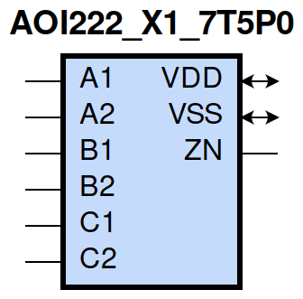
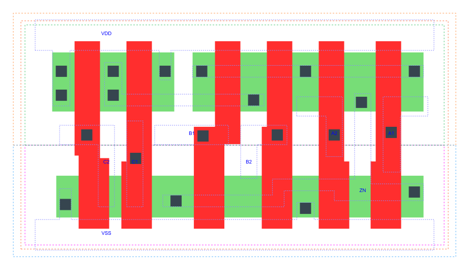

=======================================
gf180mcu_fd_sc_mcu7t5v0__aoi222_x1
=======================================

**gf180mcu_fd_sc_mcu7t5v0__aoi222_x1 symbol**

**gf180mcu_fd_sc_mcu7t5v0__aoi222_x1 schematic**

.. image:: sc7_sch/AOI222_X1_sch.png
    :height: 300px
    :width: 500 px
    :align: center
    :alt: gf180mcu_fd_sc_mcu7t5v0__aoi222_x1 schematic

**gf180mcu_fd_sc_mcu7t5v0__aoi222_x1 layout**

.. include:: images.rst

AOI222_X1 is a three 2-input AND into 3-input NOR, NOR[AND(A1,A2),AND(B1,B2),AND(C1,C2)], 1X drive strength

|
| Attributes

============= ======================
**Attribute** **Value**
area          30.732800 µm\ :sup:`2`
============= ======================

|
| OUTPUT FUNCTIONS

+----------------+-------------------------------------------------------------------------------------------------------------------------------------------------------------------+
| **Output Pin** | **Function**                                                                                                                                                      |
+----------------+-------------------------------------------------------------------------------------------------------------------------------------------------------------------+
| ZN             | (((!A1)&(!B1)&(!C1))|((!A1)&(!B1)&(!C2))|((!A1)&(!B2)&(!C1))|((!A1)&(!B2)&(!C2))|((!A2)&(!B1)&(!C1))|((!A2)&(!B1)&(!C2))|((!A2)&(!B2)&(!C1))|((!A2)&(!B2)&(!C2))) |
+----------------+-------------------------------------------------------------------------------------------------------------------------------------------------------------------+

|
| TRUTH TABLE FOR ZN

====== ====== ====== ====== ====== ====== ======
**A1** **A2** **B1** **B2** **C1** **C2** **ZN**
0      ?      0      ?      0      ?      1
0      ?      0      ?      ?      0      1
0      ?      ?      0      0      ?      1
0      ?      ?      0      ?      0      1
?      0      0      ?      0      ?      1
?      0      0      ?      ?      0      1
?      0      ?      0      0      ?      1
?      0      ?      0      ?      0      1
1      1      ?      ?      ?      ?      0
?      ?      1      1      ?      ?      0
?      ?      ?      ?      1      1      0
====== ====== ====== ====== ====== ====== ======

|
| FUNCTIONAL SCHEMATIC
| |image83|
| PIN CAPACITANCE (pf)

======= ======== ====================
**Pin** **Type** **Capacitance (pf)**
C2      input    0.0047
C1      input    0.0046
B1      input    0.0046
B2      input    0.0045
A2      input    0.0047
A1      input    0.0048
======= ======== ====================

|
| DELAY AND OUTPUT TRANSITION TIME corresponding to min slew and load

+---------------+------------+--------------------+--------------+-------------------+----------------+---------------+
| **Input Pin** | **Output** | **When Condition** | **Tin (ns)** | **Out Load (pf)** | **Delay (ns)** | **Tout (ns)** |
+---------------+------------+--------------------+--------------+-------------------+----------------+---------------+
| C2(LH)        | ZN(HL)     | !A1&!A2&!B1&!B2&C1 | 0.0100       | 0.0010            | 0.1736         | 0.1201        |
+---------------+------------+--------------------+--------------+-------------------+----------------+---------------+
| C2(LH)        | ZN(HL)     | !A1&!A2&!B1&B2&C1  | 0.0100       | 0.0010            | 0.1639         | 0.1134        |
+---------------+------------+--------------------+--------------+-------------------+----------------+---------------+
| C2(LH)        | ZN(HL)     | !A1&!A2&B1&!B2&C1  | 0.0100       | 0.0010            | 0.1781         | 0.1378        |
+---------------+------------+--------------------+--------------+-------------------+----------------+---------------+
| C2(LH)        | ZN(HL)     | !A1&A2&!B1&!B2&C1  | 0.0100       | 0.0010            | 0.1339         | 0.1034        |
+---------------+------------+--------------------+--------------+-------------------+----------------+---------------+
| C2(LH)        | ZN(HL)     | !A1&A2&!B1&B2&C1   | 0.0100       | 0.0010            | 0.1293         | 0.0979        |
+---------------+------------+--------------------+--------------+-------------------+----------------+---------------+
| C2(LH)        | ZN(HL)     | !A1&A2&B1&!B2&C1   | 0.0100       | 0.0010            | 0.1435         | 0.1247        |
+---------------+------------+--------------------+--------------+-------------------+----------------+---------------+
| C2(LH)        | ZN(HL)     | A1&!A2&!B1&!B2&C1  | 0.0100       | 0.0010            | 0.1480         | 0.1280        |
+---------------+------------+--------------------+--------------+-------------------+----------------+---------------+
| C2(LH)        | ZN(HL)     | A1&!A2&!B1&B2&C1   | 0.0100       | 0.0010            | 0.1426         | 0.1217        |
+---------------+------------+--------------------+--------------+-------------------+----------------+---------------+
| C2(LH)        | ZN(HL)     | A1&!A2&B1&!B2&C1   | 0.0100       | 0.0010            | 0.1580         | 0.1474        |
+---------------+------------+--------------------+--------------+-------------------+----------------+---------------+
| C2(HL)        | ZN(LH)     | !A1&!A2&!B1&!B2&C1 | 0.0100       | 0.0010            | 0.3003         | 0.1863        |
+---------------+------------+--------------------+--------------+-------------------+----------------+---------------+
| C2(HL)        | ZN(LH)     | !A1&!A2&!B1&B2&C1  | 0.0100       | 0.0010            | 0.3499         | 0.2310        |
+---------------+------------+--------------------+--------------+-------------------+----------------+---------------+
| C2(HL)        | ZN(LH)     | !A1&!A2&B1&!B2&C1  | 0.0100       | 0.0010            | 0.4067         | 0.2744        |
+---------------+------------+--------------------+--------------+-------------------+----------------+---------------+
| C2(HL)        | ZN(LH)     | !A1&A2&!B1&!B2&C1  | 0.0100       | 0.0010            | 0.3520         | 0.1946        |
+---------------+------------+--------------------+--------------+-------------------+----------------+---------------+
| C2(HL)        | ZN(LH)     | !A1&A2&!B1&B2&C1   | 0.0100       | 0.0010            | 0.3965         | 0.2329        |
+---------------+------------+--------------------+--------------+-------------------+----------------+---------------+
| C2(HL)        | ZN(LH)     | !A1&A2&B1&!B2&C1   | 0.0100       | 0.0010            | 0.4637         | 0.2845        |
+---------------+------------+--------------------+--------------+-------------------+----------------+---------------+
| C2(HL)        | ZN(LH)     | A1&!A2&!B1&!B2&C1  | 0.0100       | 0.0010            | 0.4029         | 0.2329        |
+---------------+------------+--------------------+--------------+-------------------+----------------+---------------+
| C2(HL)        | ZN(LH)     | A1&!A2&!B1&B2&C1   | 0.0100       | 0.0010            | 0.4566         | 0.2793        |
+---------------+------------+--------------------+--------------+-------------------+----------------+---------------+
| C2(HL)        | ZN(LH)     | A1&!A2&B1&!B2&C1   | 0.0100       | 0.0010            | 0.5237         | 0.3313        |
+---------------+------------+--------------------+--------------+-------------------+----------------+---------------+
| C1(LH)        | ZN(HL)     | !A1&!A2&!B1&!B2&C2 | 0.0100       | 0.0010            | 0.1628         | 0.1207        |
+---------------+------------+--------------------+--------------+-------------------+----------------+---------------+
| C1(LH)        | ZN(HL)     | !A1&!A2&!B1&B2&C2  | 0.0100       | 0.0010            | 0.1528         | 0.1134        |
+---------------+------------+--------------------+--------------+-------------------+----------------+---------------+
| C1(LH)        | ZN(HL)     | !A1&!A2&B1&!B2&C2  | 0.0100       | 0.0010            | 0.1672         | 0.1381        |
+---------------+------------+--------------------+--------------+-------------------+----------------+---------------+
| C1(LH)        | ZN(HL)     | !A1&A2&!B1&!B2&C2  | 0.0100       | 0.0010            | 0.1228         | 0.1039        |
+---------------+------------+--------------------+--------------+-------------------+----------------+---------------+
| C1(LH)        | ZN(HL)     | !A1&A2&!B1&B2&C2   | 0.0100       | 0.0010            | 0.1182         | 0.0985        |
+---------------+------------+--------------------+--------------+-------------------+----------------+---------------+
| C1(LH)        | ZN(HL)     | !A1&A2&B1&!B2&C2   | 0.0100       | 0.0010            | 0.1324         | 0.1251        |
+---------------+------------+--------------------+--------------+-------------------+----------------+---------------+
| C1(LH)        | ZN(HL)     | A1&!A2&!B1&!B2&C2  | 0.0100       | 0.0010            | 0.1370         | 0.1284        |
+---------------+------------+--------------------+--------------+-------------------+----------------+---------------+
| C1(LH)        | ZN(HL)     | A1&!A2&!B1&B2&C2   | 0.0100       | 0.0010            | 0.1315         | 0.1221        |
+---------------+------------+--------------------+--------------+-------------------+----------------+---------------+
| C1(LH)        | ZN(HL)     | A1&!A2&B1&!B2&C2   | 0.0100       | 0.0010            | 0.1470         | 0.1478        |
+---------------+------------+--------------------+--------------+-------------------+----------------+---------------+
| C1(HL)        | ZN(LH)     | !A1&!A2&!B1&!B2&C2 | 0.0100       | 0.0010            | 0.2694         | 0.1575        |
+---------------+------------+--------------------+--------------+-------------------+----------------+---------------+
| C1(HL)        | ZN(LH)     | !A1&!A2&!B1&B2&C2  | 0.0100       | 0.0010            | 0.3118         | 0.1948        |
+---------------+------------+--------------------+--------------+-------------------+----------------+---------------+
| C1(HL)        | ZN(LH)     | !A1&!A2&B1&!B2&C2  | 0.0100       | 0.0010            | 0.3698         | 0.2378        |
+---------------+------------+--------------------+--------------+-------------------+----------------+---------------+
| C1(HL)        | ZN(LH)     | !A1&A2&!B1&!B2&C2  | 0.0100       | 0.0010            | 0.3138         | 0.1588        |
+---------------+------------+--------------------+--------------+-------------------+----------------+---------------+
| C1(HL)        | ZN(LH)     | !A1&A2&!B1&B2&C2   | 0.0100       | 0.0010            | 0.3510         | 0.1890        |
+---------------+------------+--------------------+--------------+-------------------+----------------+---------------+
| C1(HL)        | ZN(LH)     | !A1&A2&B1&!B2&C2   | 0.0100       | 0.0010            | 0.4201         | 0.2407        |
+---------------+------------+--------------------+--------------+-------------------+----------------+---------------+
| C1(HL)        | ZN(LH)     | A1&!A2&!B1&!B2&C2  | 0.0100       | 0.0010            | 0.3662         | 0.1963        |
+---------------+------------+--------------------+--------------+-------------------+----------------+---------------+
| C1(HL)        | ZN(LH)     | A1&!A2&!B1&B2&C2   | 0.0100       | 0.0010            | 0.4131         | 0.2355        |
+---------------+------------+--------------------+--------------+-------------------+----------------+---------------+
| C1(HL)        | ZN(LH)     | A1&!A2&B1&!B2&C2   | 0.0100       | 0.0010            | 0.4810         | 0.2872        |
+---------------+------------+--------------------+--------------+-------------------+----------------+---------------+
| B1(LH)        | ZN(HL)     | !A1&!A2&B2&!C1&!C2 | 0.0100       | 0.0010            | 0.1340         | 0.0905        |
+---------------+------------+--------------------+--------------+-------------------+----------------+---------------+
| B1(LH)        | ZN(HL)     | !A1&!A2&B2&!C1&C2  | 0.0100       | 0.0010            | 0.1344         | 0.0902        |
+---------------+------------+--------------------+--------------+-------------------+----------------+---------------+
| B1(LH)        | ZN(HL)     | !A1&!A2&B2&C1&!C2  | 0.0100       | 0.0010            | 0.1442         | 0.1085        |
+---------------+------------+--------------------+--------------+-------------------+----------------+---------------+
| B1(LH)        | ZN(HL)     | !A1&A2&B2&!C1&!C2  | 0.0100       | 0.0010            | 0.1119         | 0.0813        |
+---------------+------------+--------------------+--------------+-------------------+----------------+---------------+
| B1(LH)        | ZN(HL)     | !A1&A2&B2&!C1&C2   | 0.0100       | 0.0010            | 0.1122         | 0.0814        |
+---------------+------------+--------------------+--------------+-------------------+----------------+---------------+
| B1(LH)        | ZN(HL)     | !A1&A2&B2&C1&!C2   | 0.0100       | 0.0010            | 0.1222         | 0.1003        |
+---------------+------------+--------------------+--------------+-------------------+----------------+---------------+
| B1(LH)        | ZN(HL)     | A1&!A2&B2&!C1&!C2  | 0.0100       | 0.0010            | 0.1223         | 0.1016        |
+---------------+------------+--------------------+--------------+-------------------+----------------+---------------+
| B1(LH)        | ZN(HL)     | A1&!A2&B2&!C1&C2   | 0.0100       | 0.0010            | 0.1225         | 0.1017        |
+---------------+------------+--------------------+--------------+-------------------+----------------+---------------+
| B1(LH)        | ZN(HL)     | A1&!A2&B2&C1&!C2   | 0.0100       | 0.0010            | 0.1338         | 0.1202        |
+---------------+------------+--------------------+--------------+-------------------+----------------+---------------+
| B1(HL)        | ZN(LH)     | !A1&!A2&B2&!C1&!C2 | 0.0100       | 0.0010            | 0.2136         | 0.1464        |
+---------------+------------+--------------------+--------------+-------------------+----------------+---------------+
| B1(HL)        | ZN(LH)     | !A1&!A2&B2&!C1&C2  | 0.0100       | 0.0010            | 0.2571         | 0.1941        |
+---------------+------------+--------------------+--------------+-------------------+----------------+---------------+
| B1(HL)        | ZN(LH)     | !A1&!A2&B2&C1&!C2  | 0.0100       | 0.0010            | 0.3057         | 0.2304        |
+---------------+------------+--------------------+--------------+-------------------+----------------+---------------+
| B1(HL)        | ZN(LH)     | !A1&A2&B2&!C1&!C2  | 0.0100       | 0.0010            | 0.2517         | 0.1504        |
+---------------+------------+--------------------+--------------+-------------------+----------------+---------------+
| B1(HL)        | ZN(LH)     | !A1&A2&B2&!C1&C2   | 0.0100       | 0.0010            | 0.2965         | 0.1885        |
+---------------+------------+--------------------+--------------+-------------------+----------------+---------------+
| B1(HL)        | ZN(LH)     | !A1&A2&B2&C1&!C2   | 0.0100       | 0.0010            | 0.3543         | 0.2322        |
+---------------+------------+--------------------+--------------+-------------------+----------------+---------------+
| B1(HL)        | ZN(LH)     | A1&!A2&B2&!C1&!C2  | 0.0100       | 0.0010            | 0.3029         | 0.1890        |
+---------------+------------+--------------------+--------------+-------------------+----------------+---------------+
| B1(HL)        | ZN(LH)     | A1&!A2&B2&!C1&C2   | 0.0100       | 0.0010            | 0.3582         | 0.2353        |
+---------------+------------+--------------------+--------------+-------------------+----------------+---------------+
| B1(HL)        | ZN(LH)     | A1&!A2&B2&C1&!C2   | 0.0100       | 0.0010            | 0.4156         | 0.2789        |
+---------------+------------+--------------------+--------------+-------------------+----------------+---------------+
| B2(HL)        | ZN(LH)     | !A1&!A2&B1&!C1&!C2 | 0.0100       | 0.0010            | 0.2522         | 0.1813        |
+---------------+------------+--------------------+--------------+-------------------+----------------+---------------+
| B2(HL)        | ZN(LH)     | !A1&!A2&B1&!C1&C2  | 0.0100       | 0.0010            | 0.3051         | 0.2376        |
+---------------+------------+--------------------+--------------+-------------------+----------------+---------------+
| B2(HL)        | ZN(LH)     | !A1&!A2&B1&C1&!C2  | 0.0100       | 0.0010            | 0.3527         | 0.2741        |
+---------------+------------+--------------------+--------------+-------------------+----------------+---------------+
| B2(HL)        | ZN(LH)     | !A1&A2&B1&!C1&!C2  | 0.0100       | 0.0010            | 0.2989         | 0.1937        |
+---------------+------------+--------------------+--------------+-------------------+----------------+---------------+
| B2(HL)        | ZN(LH)     | !A1&A2&B1&!C1&C2   | 0.0100       | 0.0010            | 0.3538         | 0.2407        |
+---------------+------------+--------------------+--------------+-------------------+----------------+---------------+
| B2(HL)        | ZN(LH)     | !A1&A2&B1&C1&!C2   | 0.0100       | 0.0010            | 0.4101         | 0.2842        |
+---------------+------------+--------------------+--------------+-------------------+----------------+---------------+
| B2(HL)        | ZN(LH)     | A1&!A2&B1&!C1&!C2  | 0.0100       | 0.0010            | 0.3495         | 0.2323        |
+---------------+------------+--------------------+--------------+-------------------+----------------+---------------+
| B2(HL)        | ZN(LH)     | A1&!A2&B1&!C1&C2   | 0.0100       | 0.0010            | 0.4142         | 0.2873        |
+---------------+------------+--------------------+--------------+-------------------+----------------+---------------+
| B2(HL)        | ZN(LH)     | A1&!A2&B1&C1&!C2   | 0.0100       | 0.0010            | 0.4704         | 0.3312        |
+---------------+------------+--------------------+--------------+-------------------+----------------+---------------+
| B2(LH)        | ZN(HL)     | !A1&!A2&B1&!C1&!C2 | 0.0100       | 0.0010            | 0.1478         | 0.0906        |
+---------------+------------+--------------------+--------------+-------------------+----------------+---------------+
| B2(LH)        | ZN(HL)     | !A1&!A2&B1&!C1&C2  | 0.0100       | 0.0010            | 0.1482         | 0.0903        |
+---------------+------------+--------------------+--------------+-------------------+----------------+---------------+
| B2(LH)        | ZN(HL)     | !A1&!A2&B1&C1&!C2  | 0.0100       | 0.0010            | 0.1580         | 0.1085        |
+---------------+------------+--------------------+--------------+-------------------+----------------+---------------+
| B2(LH)        | ZN(HL)     | !A1&A2&B1&!C1&!C2  | 0.0100       | 0.0010            | 0.1258         | 0.0810        |
+---------------+------------+--------------------+--------------+-------------------+----------------+---------------+
| B2(LH)        | ZN(HL)     | !A1&A2&B1&!C1&C2   | 0.0100       | 0.0010            | 0.1261         | 0.0810        |
+---------------+------------+--------------------+--------------+-------------------+----------------+---------------+
| B2(LH)        | ZN(HL)     | !A1&A2&B1&C1&!C2   | 0.0100       | 0.0010            | 0.1361         | 0.0999        |
+---------------+------------+--------------------+--------------+-------------------+----------------+---------------+
| B2(LH)        | ZN(HL)     | A1&!A2&B1&!C1&!C2  | 0.0100       | 0.0010            | 0.1362         | 0.1012        |
+---------------+------------+--------------------+--------------+-------------------+----------------+---------------+
| B2(LH)        | ZN(HL)     | A1&!A2&B1&!C1&C2   | 0.0100       | 0.0010            | 0.1365         | 0.1013        |
+---------------+------------+--------------------+--------------+-------------------+----------------+---------------+
| B2(LH)        | ZN(HL)     | A1&!A2&B1&C1&!C2   | 0.0100       | 0.0010            | 0.1477         | 0.1198        |
+---------------+------------+--------------------+--------------+-------------------+----------------+---------------+
| A2(HL)        | ZN(LH)     | A1&!B1&!B2&!C1&!C2 | 0.0100       | 0.0010            | 0.1601         | 0.1431        |
+---------------+------------+--------------------+--------------+-------------------+----------------+---------------+
| A2(HL)        | ZN(LH)     | A1&!B1&!B2&!C1&C2  | 0.0100       | 0.0010            | 0.1762         | 0.1798        |
+---------------+------------+--------------------+--------------+-------------------+----------------+---------------+
| A2(HL)        | ZN(LH)     | A1&!B1&!B2&C1&!C2  | 0.0100       | 0.0010            | 0.2216         | 0.2207        |
+---------------+------------+--------------------+--------------+-------------------+----------------+---------------+
| A2(HL)        | ZN(LH)     | A1&!B1&B2&!C1&!C2  | 0.0100       | 0.0010            | 0.1926         | 0.1842        |
+---------------+------------+--------------------+--------------+-------------------+----------------+---------------+
| A2(HL)        | ZN(LH)     | A1&!B1&B2&!C1&C2   | 0.0100       | 0.0010            | 0.2102         | 0.2237        |
+---------------+------------+--------------------+--------------+-------------------+----------------+---------------+
| A2(HL)        | ZN(LH)     | A1&!B1&B2&C1&!C2   | 0.0100       | 0.0010            | 0.2654         | 0.2721        |
+---------------+------------+--------------------+--------------+-------------------+----------------+---------------+
| A2(HL)        | ZN(LH)     | A1&B1&!B2&!C1&!C2  | 0.0100       | 0.0010            | 0.2480         | 0.2299        |
+---------------+------------+--------------------+--------------+-------------------+----------------+---------------+
| A2(HL)        | ZN(LH)     | A1&B1&!B2&!C1&C2   | 0.0100       | 0.0010            | 0.2762         | 0.2809        |
+---------------+------------+--------------------+--------------+-------------------+----------------+---------------+
| A2(HL)        | ZN(LH)     | A1&B1&!B2&C1&!C2   | 0.0100       | 0.0010            | 0.3320         | 0.3272        |
+---------------+------------+--------------------+--------------+-------------------+----------------+---------------+
| A2(LH)        | ZN(HL)     | A1&!B1&!B2&!C1&!C2 | 0.0100       | 0.0010            | 0.0895         | 0.0503        |
+---------------+------------+--------------------+--------------+-------------------+----------------+---------------+
| A2(LH)        | ZN(HL)     | A1&!B1&!B2&!C1&C2  | 0.0100       | 0.0010            | 0.0895         | 0.0503        |
+---------------+------------+--------------------+--------------+-------------------+----------------+---------------+
| A2(LH)        | ZN(HL)     | A1&!B1&!B2&C1&!C2  | 0.0100       | 0.0010            | 0.0952         | 0.0661        |
+---------------+------------+--------------------+--------------+-------------------+----------------+---------------+
| A2(LH)        | ZN(HL)     | A1&!B1&B2&!C1&!C2  | 0.0100       | 0.0010            | 0.0896         | 0.0503        |
+---------------+------------+--------------------+--------------+-------------------+----------------+---------------+
| A2(LH)        | ZN(HL)     | A1&!B1&B2&!C1&C2   | 0.0100       | 0.0010            | 0.0896         | 0.0503        |
+---------------+------------+--------------------+--------------+-------------------+----------------+---------------+
| A2(LH)        | ZN(HL)     | A1&!B1&B2&C1&!C2   | 0.0100       | 0.0010            | 0.0954         | 0.0661        |
+---------------+------------+--------------------+--------------+-------------------+----------------+---------------+
| A2(LH)        | ZN(HL)     | A1&B1&!B2&!C1&!C2  | 0.0100       | 0.0010            | 0.0955         | 0.0693        |
+---------------+------------+--------------------+--------------+-------------------+----------------+---------------+
| A2(LH)        | ZN(HL)     | A1&B1&!B2&!C1&C2   | 0.0100       | 0.0010            | 0.0955         | 0.0693        |
+---------------+------------+--------------------+--------------+-------------------+----------------+---------------+
| A2(LH)        | ZN(HL)     | A1&B1&!B2&C1&!C2   | 0.0100       | 0.0010            | 0.1035         | 0.0855        |
+---------------+------------+--------------------+--------------+-------------------+----------------+---------------+
| A1(HL)        | ZN(LH)     | A2&!B1&!B2&!C1&!C2 | 0.0100       | 0.0010            | 0.1285         | 0.1105        |
+---------------+------------+--------------------+--------------+-------------------+----------------+---------------+
| A1(HL)        | ZN(LH)     | A2&!B1&!B2&!C1&C2  | 0.0100       | 0.0010            | 0.1384         | 0.1359        |
+---------------+------------+--------------------+--------------+-------------------+----------------+---------------+
| A1(HL)        | ZN(LH)     | A2&!B1&!B2&C1&!C2  | 0.0100       | 0.0010            | 0.1829         | 0.1780        |
+---------------+------------+--------------------+--------------+-------------------+----------------+---------------+
| A1(HL)        | ZN(LH)     | A2&!B1&B2&!C1&!C2  | 0.0100       | 0.0010            | 0.1523         | 0.1427        |
+---------------+------------+--------------------+--------------+-------------------+----------------+---------------+
| A1(HL)        | ZN(LH)     | A2&!B1&B2&!C1&C2   | 0.0100       | 0.0010            | 0.1633         | 0.1715        |
+---------------+------------+--------------------+--------------+-------------------+----------------+---------------+
| A1(HL)        | ZN(LH)     | A2&!B1&B2&C1&!C2   | 0.0100       | 0.0010            | 0.2185         | 0.2216        |
+---------------+------------+--------------------+--------------+-------------------+----------------+---------------+
| A1(HL)        | ZN(LH)     | A2&B1&!B2&!C1&!C2  | 0.0100       | 0.0010            | 0.2085         | 0.1894        |
+---------------+------------+--------------------+--------------+-------------------+----------------+---------------+
| A1(HL)        | ZN(LH)     | A2&B1&!B2&!C1&C2   | 0.0100       | 0.0010            | 0.2289         | 0.2311        |
+---------------+------------+--------------------+--------------+-------------------+----------------+---------------+
| A1(HL)        | ZN(LH)     | A2&B1&!B2&C1&!C2   | 0.0100       | 0.0010            | 0.2853         | 0.2787        |
+---------------+------------+--------------------+--------------+-------------------+----------------+---------------+
| A1(LH)        | ZN(HL)     | A2&!B1&!B2&!C1&!C2 | 0.0100       | 0.0010            | 0.0774         | 0.0503        |
+---------------+------------+--------------------+--------------+-------------------+----------------+---------------+
| A1(LH)        | ZN(HL)     | A2&!B1&!B2&!C1&C2  | 0.0100       | 0.0010            | 0.0775         | 0.0503        |
+---------------+------------+--------------------+--------------+-------------------+----------------+---------------+
| A1(LH)        | ZN(HL)     | A2&!B1&!B2&C1&!C2  | 0.0100       | 0.0010            | 0.0833         | 0.0660        |
+---------------+------------+--------------------+--------------+-------------------+----------------+---------------+
| A1(LH)        | ZN(HL)     | A2&!B1&B2&!C1&!C2  | 0.0100       | 0.0010            | 0.0776         | 0.0503        |
+---------------+------------+--------------------+--------------+-------------------+----------------+---------------+
| A1(LH)        | ZN(HL)     | A2&!B1&B2&!C1&C2   | 0.0100       | 0.0010            | 0.0776         | 0.0503        |
+---------------+------------+--------------------+--------------+-------------------+----------------+---------------+
| A1(LH)        | ZN(HL)     | A2&!B1&B2&C1&!C2   | 0.0100       | 0.0010            | 0.0834         | 0.0662        |
+---------------+------------+--------------------+--------------+-------------------+----------------+---------------+
| A1(LH)        | ZN(HL)     | A2&B1&!B2&!C1&!C2  | 0.0100       | 0.0010            | 0.0835         | 0.0694        |
+---------------+------------+--------------------+--------------+-------------------+----------------+---------------+
| A1(LH)        | ZN(HL)     | A2&B1&!B2&!C1&C2   | 0.0100       | 0.0010            | 0.0835         | 0.0694        |
+---------------+------------+--------------------+--------------+-------------------+----------------+---------------+
| A1(LH)        | ZN(HL)     | A2&B1&!B2&C1&!C2   | 0.0100       | 0.0010            | 0.0915         | 0.0856        |
+---------------+------------+--------------------+--------------+-------------------+----------------+---------------+

|
| DYNAMIC ENERGY

+---------------+---------------------+--------------+------------+-------------------+---------------------+
| **Input Pin** | **When Condition**  | **Tin (ns)** | **Output** | **Out Load (pf)** | **Energy (uW/MHz)** |
+---------------+---------------------+--------------+------------+-------------------+---------------------+
| A1            | A2&!B1&!B2&!C1&!C2  | 0.0100       | ZN(LH)     | 0.0010            | 0.1634              |
+---------------+---------------------+--------------+------------+-------------------+---------------------+
| A1            | A2&!B1&!B2&!C1&C2   | 0.0100       | ZN(LH)     | 0.0010            | 0.1635              |
+---------------+---------------------+--------------+------------+-------------------+---------------------+
| A1            | A2&!B1&!B2&C1&!C2   | 0.0100       | ZN(LH)     | 0.0010            | 0.2041              |
+---------------+---------------------+--------------+------------+-------------------+---------------------+
| A1            | A2&!B1&B2&!C1&!C2   | 0.0100       | ZN(LH)     | 0.0010            | 0.1633              |
+---------------+---------------------+--------------+------------+-------------------+---------------------+
| A1            | A2&!B1&B2&!C1&C2    | 0.0100       | ZN(LH)     | 0.0010            | 0.1634              |
+---------------+---------------------+--------------+------------+-------------------+---------------------+
| A1            | A2&!B1&B2&C1&!C2    | 0.0100       | ZN(LH)     | 0.0010            | 0.2039              |
+---------------+---------------------+--------------+------------+-------------------+---------------------+
| A1            | A2&B1&!B2&!C1&!C2   | 0.0100       | ZN(LH)     | 0.0010            | 0.2119              |
+---------------+---------------------+--------------+------------+-------------------+---------------------+
| A1            | A2&B1&!B2&!C1&C2    | 0.0100       | ZN(LH)     | 0.0010            | 0.2120              |
+---------------+---------------------+--------------+------------+-------------------+---------------------+
| A1            | A2&B1&!B2&C1&!C2    | 0.0100       | ZN(LH)     | 0.0010            | 0.2523              |
+---------------+---------------------+--------------+------------+-------------------+---------------------+
| B2            | !A1&!A2&B1&!C1&!C2  | 0.0100       | ZN(LH)     | 0.0010            | 0.2856              |
+---------------+---------------------+--------------+------------+-------------------+---------------------+
| B2            | !A1&!A2&B1&!C1&C2   | 0.0100       | ZN(LH)     | 0.0010            | 0.2856              |
+---------------+---------------------+--------------+------------+-------------------+---------------------+
| B2            | !A1&!A2&B1&C1&!C2   | 0.0100       | ZN(LH)     | 0.0010            | 0.3255              |
+---------------+---------------------+--------------+------------+-------------------+---------------------+
| B2            | !A1&A2&B1&!C1&!C2   | 0.0100       | ZN(LH)     | 0.0010            | 0.2647              |
+---------------+---------------------+--------------+------------+-------------------+---------------------+
| B2            | !A1&A2&B1&!C1&C2    | 0.0100       | ZN(LH)     | 0.0010            | 0.2646              |
+---------------+---------------------+--------------+------------+-------------------+---------------------+
| B2            | !A1&A2&B1&C1&!C2    | 0.0100       | ZN(LH)     | 0.0010            | 0.3045              |
+---------------+---------------------+--------------+------------+-------------------+---------------------+
| B2            | A1&!A2&B1&!C1&!C2   | 0.0100       | ZN(LH)     | 0.0010            | 0.3075              |
+---------------+---------------------+--------------+------------+-------------------+---------------------+
| B2            | A1&!A2&B1&!C1&C2    | 0.0100       | ZN(LH)     | 0.0010            | 0.3075              |
+---------------+---------------------+--------------+------------+-------------------+---------------------+
| B2            | A1&!A2&B1&C1&!C2    | 0.0100       | ZN(LH)     | 0.0010            | 0.3473              |
+---------------+---------------------+--------------+------------+-------------------+---------------------+
| B1            | !A1&!A2&B2&!C1&!C2  | 0.0100       | ZN(HL)     | 0.0010            | 0.0654              |
+---------------+---------------------+--------------+------------+-------------------+---------------------+
| B1            | !A1&!A2&B2&!C1&C2   | 0.0100       | ZN(HL)     | 0.0010            | 0.0659              |
+---------------+---------------------+--------------+------------+-------------------+---------------------+
| B1            | !A1&!A2&B2&C1&!C2   | 0.0100       | ZN(HL)     | 0.0010            | 0.0659              |
+---------------+---------------------+--------------+------------+-------------------+---------------------+
| B1            | !A1&A2&B2&!C1&!C2   | 0.0100       | ZN(HL)     | 0.0010            | 0.0592              |
+---------------+---------------------+--------------+------------+-------------------+---------------------+
| B1            | !A1&A2&B2&!C1&C2    | 0.0100       | ZN(HL)     | 0.0010            | 0.0596              |
+---------------+---------------------+--------------+------------+-------------------+---------------------+
| B1            | !A1&A2&B2&C1&!C2    | 0.0100       | ZN(HL)     | 0.0010            | 0.0598              |
+---------------+---------------------+--------------+------------+-------------------+---------------------+
| B1            | A1&!A2&B2&!C1&!C2   | 0.0100       | ZN(HL)     | 0.0010            | 0.0593              |
+---------------+---------------------+--------------+------------+-------------------+---------------------+
| B1            | A1&!A2&B2&!C1&C2    | 0.0100       | ZN(HL)     | 0.0010            | 0.0598              |
+---------------+---------------------+--------------+------------+-------------------+---------------------+
| B1            | A1&!A2&B2&C1&!C2    | 0.0100       | ZN(HL)     | 0.0010            | 0.0597              |
+---------------+---------------------+--------------+------------+-------------------+---------------------+
| A2            | A1&!B1&!B2&!C1&!C2  | 0.0100       | ZN(LH)     | 0.0010            | 0.2006              |
+---------------+---------------------+--------------+------------+-------------------+---------------------+
| A2            | A1&!B1&!B2&!C1&C2   | 0.0100       | ZN(LH)     | 0.0010            | 0.2007              |
+---------------+---------------------+--------------+------------+-------------------+---------------------+
| A2            | A1&!B1&!B2&C1&!C2   | 0.0100       | ZN(LH)     | 0.0010            | 0.2405              |
+---------------+---------------------+--------------+------------+-------------------+---------------------+
| A2            | A1&!B1&B2&!C1&!C2   | 0.0100       | ZN(LH)     | 0.0010            | 0.2006              |
+---------------+---------------------+--------------+------------+-------------------+---------------------+
| A2            | A1&!B1&B2&!C1&C2    | 0.0100       | ZN(LH)     | 0.0010            | 0.2007              |
+---------------+---------------------+--------------+------------+-------------------+---------------------+
| A2            | A1&!B1&B2&C1&!C2    | 0.0100       | ZN(LH)     | 0.0010            | 0.2406              |
+---------------+---------------------+--------------+------------+-------------------+---------------------+
| A2            | A1&B1&!B2&!C1&!C2   | 0.0100       | ZN(LH)     | 0.0010            | 0.2485              |
+---------------+---------------------+--------------+------------+-------------------+---------------------+
| A2            | A1&B1&!B2&!C1&C2    | 0.0100       | ZN(LH)     | 0.0010            | 0.2485              |
+---------------+---------------------+--------------+------------+-------------------+---------------------+
| A2            | A1&B1&!B2&C1&!C2    | 0.0100       | ZN(LH)     | 0.0010            | 0.2884              |
+---------------+---------------------+--------------+------------+-------------------+---------------------+
| B1            | !A1&!A2&B2&!C1&!C2  | 0.0100       | ZN(LH)     | 0.0010            | 0.2428              |
+---------------+---------------------+--------------+------------+-------------------+---------------------+
| B1            | !A1&!A2&B2&!C1&C2   | 0.0100       | ZN(LH)     | 0.0010            | 0.2428              |
+---------------+---------------------+--------------+------------+-------------------+---------------------+
| B1            | !A1&!A2&B2&C1&!C2   | 0.0100       | ZN(LH)     | 0.0010            | 0.2835              |
+---------------+---------------------+--------------+------------+-------------------+---------------------+
| B1            | !A1&A2&B2&!C1&!C2   | 0.0100       | ZN(LH)     | 0.0010            | 0.2219              |
+---------------+---------------------+--------------+------------+-------------------+---------------------+
| B1            | !A1&A2&B2&!C1&C2    | 0.0100       | ZN(LH)     | 0.0010            | 0.2219              |
+---------------+---------------------+--------------+------------+-------------------+---------------------+
| B1            | !A1&A2&B2&C1&!C2    | 0.0100       | ZN(LH)     | 0.0010            | 0.2624              |
+---------------+---------------------+--------------+------------+-------------------+---------------------+
| B1            | A1&!A2&B2&!C1&!C2   | 0.0100       | ZN(LH)     | 0.0010            | 0.2654              |
+---------------+---------------------+--------------+------------+-------------------+---------------------+
| B1            | A1&!A2&B2&!C1&C2    | 0.0100       | ZN(LH)     | 0.0010            | 0.2654              |
+---------------+---------------------+--------------+------------+-------------------+---------------------+
| B1            | A1&!A2&B2&C1&!C2    | 0.0100       | ZN(LH)     | 0.0010            | 0.3056              |
+---------------+---------------------+--------------+------------+-------------------+---------------------+
| C1            | !A1&!A2&!B1&!B2&C2  | 0.0100       | ZN(HL)     | 0.0010            | 0.1103              |
+---------------+---------------------+--------------+------------+-------------------+---------------------+
| C1            | !A1&!A2&!B1&B2&C2   | 0.0100       | ZN(HL)     | 0.0010            | 0.1041              |
+---------------+---------------------+--------------+------------+-------------------+---------------------+
| C1            | !A1&!A2&B1&!B2&C2   | 0.0100       | ZN(HL)     | 0.0010            | 0.1042              |
+---------------+---------------------+--------------+------------+-------------------+---------------------+
| C1            | !A1&A2&!B1&!B2&C2   | 0.0100       | ZN(HL)     | 0.0010            | 0.1042              |
+---------------+---------------------+--------------+------------+-------------------+---------------------+
| C1            | !A1&A2&!B1&B2&C2    | 0.0100       | ZN(HL)     | 0.0010            | 0.0981              |
+---------------+---------------------+--------------+------------+-------------------+---------------------+
| C1            | !A1&A2&B1&!B2&C2    | 0.0100       | ZN(HL)     | 0.0010            | 0.0981              |
+---------------+---------------------+--------------+------------+-------------------+---------------------+
| C1            | A1&!A2&!B1&!B2&C2   | 0.0100       | ZN(HL)     | 0.0010            | 0.1042              |
+---------------+---------------------+--------------+------------+-------------------+---------------------+
| C1            | A1&!A2&!B1&B2&C2    | 0.0100       | ZN(HL)     | 0.0010            | 0.0981              |
+---------------+---------------------+--------------+------------+-------------------+---------------------+
| C1            | A1&!A2&B1&!B2&C2    | 0.0100       | ZN(HL)     | 0.0010            | 0.0981              |
+---------------+---------------------+--------------+------------+-------------------+---------------------+
| A2            | A1&!B1&!B2&!C1&!C2  | 0.0100       | ZN(HL)     | 0.0010            | 0.0064              |
+---------------+---------------------+--------------+------------+-------------------+---------------------+
| A2            | A1&!B1&!B2&!C1&C2   | 0.0100       | ZN(HL)     | 0.0010            | 0.0064              |
+---------------+---------------------+--------------+------------+-------------------+---------------------+
| A2            | A1&!B1&!B2&C1&!C2   | 0.0100       | ZN(HL)     | 0.0010            | 0.0064              |
+---------------+---------------------+--------------+------------+-------------------+---------------------+
| A2            | A1&!B1&B2&!C1&!C2   | 0.0100       | ZN(HL)     | 0.0010            | 0.0066              |
+---------------+---------------------+--------------+------------+-------------------+---------------------+
| A2            | A1&!B1&B2&!C1&C2    | 0.0100       | ZN(HL)     | 0.0010            | 0.0066              |
+---------------+---------------------+--------------+------------+-------------------+---------------------+
| A2            | A1&!B1&B2&C1&!C2    | 0.0100       | ZN(HL)     | 0.0010            | 0.0066              |
+---------------+---------------------+--------------+------------+-------------------+---------------------+
| A2            | A1&B1&!B2&!C1&!C2   | 0.0100       | ZN(HL)     | 0.0010            | 0.0067              |
+---------------+---------------------+--------------+------------+-------------------+---------------------+
| A2            | A1&B1&!B2&!C1&C2    | 0.0100       | ZN(HL)     | 0.0010            | 0.0067              |
+---------------+---------------------+--------------+------------+-------------------+---------------------+
| A2            | A1&B1&!B2&C1&!C2    | 0.0100       | ZN(HL)     | 0.0010            | 0.0066              |
+---------------+---------------------+--------------+------------+-------------------+---------------------+
| C2            | !A1&!A2&!B1&!B2&C1  | 0.0100       | ZN(HL)     | 0.0010            | 0.1103              |
+---------------+---------------------+--------------+------------+-------------------+---------------------+
| C2            | !A1&!A2&!B1&B2&C1   | 0.0100       | ZN(HL)     | 0.0010            | 0.1041              |
+---------------+---------------------+--------------+------------+-------------------+---------------------+
| C2            | !A1&!A2&B1&!B2&C1   | 0.0100       | ZN(HL)     | 0.0010            | 0.1042              |
+---------------+---------------------+--------------+------------+-------------------+---------------------+
| C2            | !A1&A2&!B1&!B2&C1   | 0.0100       | ZN(HL)     | 0.0010            | 0.1042              |
+---------------+---------------------+--------------+------------+-------------------+---------------------+
| C2            | !A1&A2&!B1&B2&C1    | 0.0100       | ZN(HL)     | 0.0010            | 0.0981              |
+---------------+---------------------+--------------+------------+-------------------+---------------------+
| C2            | !A1&A2&B1&!B2&C1    | 0.0100       | ZN(HL)     | 0.0010            | 0.0981              |
+---------------+---------------------+--------------+------------+-------------------+---------------------+
| C2            | A1&!A2&!B1&!B2&C1   | 0.0100       | ZN(HL)     | 0.0010            | 0.1042              |
+---------------+---------------------+--------------+------------+-------------------+---------------------+
| C2            | A1&!A2&!B1&B2&C1    | 0.0100       | ZN(HL)     | 0.0010            | 0.0981              |
+---------------+---------------------+--------------+------------+-------------------+---------------------+
| C2            | A1&!A2&B1&!B2&C1    | 0.0100       | ZN(HL)     | 0.0010            | 0.0981              |
+---------------+---------------------+--------------+------------+-------------------+---------------------+
| C1            | !A1&!A2&!B1&!B2&C2  | 0.0100       | ZN(LH)     | 0.0010            | 0.3168              |
+---------------+---------------------+--------------+------------+-------------------+---------------------+
| C1            | !A1&!A2&!B1&B2&C2   | 0.0100       | ZN(LH)     | 0.0010            | 0.2962              |
+---------------+---------------------+--------------+------------+-------------------+---------------------+
| C1            | !A1&!A2&B1&!B2&C2   | 0.0100       | ZN(LH)     | 0.0010            | 0.3449              |
+---------------+---------------------+--------------+------------+-------------------+---------------------+
| C1            | !A1&A2&!B1&!B2&C2   | 0.0100       | ZN(LH)     | 0.0010            | 0.2957              |
+---------------+---------------------+--------------+------------+-------------------+---------------------+
| C1            | !A1&A2&!B1&B2&C2    | 0.0100       | ZN(LH)     | 0.0010            | 0.2752              |
+---------------+---------------------+--------------+------------+-------------------+---------------------+
| C1            | !A1&A2&B1&!B2&C2    | 0.0100       | ZN(LH)     | 0.0010            | 0.3240              |
+---------------+---------------------+--------------+------------+-------------------+---------------------+
| C1            | A1&!A2&!B1&!B2&C2   | 0.0100       | ZN(LH)     | 0.0010            | 0.3393              |
+---------------+---------------------+--------------+------------+-------------------+---------------------+
| C1            | A1&!A2&!B1&B2&C2    | 0.0100       | ZN(LH)     | 0.0010            | 0.3188              |
+---------------+---------------------+--------------+------------+-------------------+---------------------+
| C1            | A1&!A2&B1&!B2&C2    | 0.0100       | ZN(LH)     | 0.0010            | 0.3671              |
+---------------+---------------------+--------------+------------+-------------------+---------------------+
| C2            | !A1&!A2&!B1&!B2&C1  | 0.0100       | ZN(LH)     | 0.0010            | 0.3510              |
+---------------+---------------------+--------------+------------+-------------------+---------------------+
| C2            | !A1&!A2&!B1&B2&C1   | 0.0100       | ZN(LH)     | 0.0010            | 0.3305              |
+---------------+---------------------+--------------+------------+-------------------+---------------------+
| C2            | !A1&!A2&B1&!B2&C1   | 0.0100       | ZN(LH)     | 0.0010            | 0.3784              |
+---------------+---------------------+--------------+------------+-------------------+---------------------+
| C2            | !A1&A2&!B1&!B2&C1   | 0.0100       | ZN(LH)     | 0.0010            | 0.3301              |
+---------------+---------------------+--------------+------------+-------------------+---------------------+
| C2            | !A1&A2&!B1&B2&C1    | 0.0100       | ZN(LH)     | 0.0010            | 0.3096              |
+---------------+---------------------+--------------+------------+-------------------+---------------------+
| C2            | !A1&A2&B1&!B2&C1    | 0.0100       | ZN(LH)     | 0.0010            | 0.3574              |
+---------------+---------------------+--------------+------------+-------------------+---------------------+
| C2            | A1&!A2&!B1&!B2&C1   | 0.0100       | ZN(LH)     | 0.0010            | 0.3728              |
+---------------+---------------------+--------------+------------+-------------------+---------------------+
| C2            | A1&!A2&!B1&B2&C1    | 0.0100       | ZN(LH)     | 0.0010            | 0.3523              |
+---------------+---------------------+--------------+------------+-------------------+---------------------+
| C2            | A1&!A2&B1&!B2&C1    | 0.0100       | ZN(LH)     | 0.0010            | 0.4001              |
+---------------+---------------------+--------------+------------+-------------------+---------------------+
| A1            | A2&!B1&!B2&!C1&!C2  | 0.0100       | ZN(HL)     | 0.0010            | 0.0065              |
+---------------+---------------------+--------------+------------+-------------------+---------------------+
| A1            | A2&!B1&!B2&!C1&C2   | 0.0100       | ZN(HL)     | 0.0010            | 0.0065              |
+---------------+---------------------+--------------+------------+-------------------+---------------------+
| A1            | A2&!B1&!B2&C1&!C2   | 0.0100       | ZN(HL)     | 0.0010            | 0.0065              |
+---------------+---------------------+--------------+------------+-------------------+---------------------+
| A1            | A2&!B1&B2&!C1&!C2   | 0.0100       | ZN(HL)     | 0.0010            | 0.0067              |
+---------------+---------------------+--------------+------------+-------------------+---------------------+
| A1            | A2&!B1&B2&!C1&C2    | 0.0100       | ZN(HL)     | 0.0010            | 0.0067              |
+---------------+---------------------+--------------+------------+-------------------+---------------------+
| A1            | A2&!B1&B2&C1&!C2    | 0.0100       | ZN(HL)     | 0.0010            | 0.0067              |
+---------------+---------------------+--------------+------------+-------------------+---------------------+
| A1            | A2&B1&!B2&!C1&!C2   | 0.0100       | ZN(HL)     | 0.0010            | 0.0067              |
+---------------+---------------------+--------------+------------+-------------------+---------------------+
| A1            | A2&B1&!B2&!C1&C2    | 0.0100       | ZN(HL)     | 0.0010            | 0.0067              |
+---------------+---------------------+--------------+------------+-------------------+---------------------+
| A1            | A2&B1&!B2&C1&!C2    | 0.0100       | ZN(HL)     | 0.0010            | 0.0067              |
+---------------+---------------------+--------------+------------+-------------------+---------------------+
| B2            | !A1&!A2&B1&!C1&!C2  | 0.0100       | ZN(HL)     | 0.0010            | 0.0654              |
+---------------+---------------------+--------------+------------+-------------------+---------------------+
| B2            | !A1&!A2&B1&!C1&C2   | 0.0100       | ZN(HL)     | 0.0010            | 0.0658              |
+---------------+---------------------+--------------+------------+-------------------+---------------------+
| B2            | !A1&!A2&B1&C1&!C2   | 0.0100       | ZN(HL)     | 0.0010            | 0.0659              |
+---------------+---------------------+--------------+------------+-------------------+---------------------+
| B2            | !A1&A2&B1&!C1&!C2   | 0.0100       | ZN(HL)     | 0.0010            | 0.0592              |
+---------------+---------------------+--------------+------------+-------------------+---------------------+
| B2            | !A1&A2&B1&!C1&C2    | 0.0100       | ZN(HL)     | 0.0010            | 0.0596              |
+---------------+---------------------+--------------+------------+-------------------+---------------------+
| B2            | !A1&A2&B1&C1&!C2    | 0.0100       | ZN(HL)     | 0.0010            | 0.0597              |
+---------------+---------------------+--------------+------------+-------------------+---------------------+
| B2            | A1&!A2&B1&!C1&!C2   | 0.0100       | ZN(HL)     | 0.0010            | 0.0593              |
+---------------+---------------------+--------------+------------+-------------------+---------------------+
| B2            | A1&!A2&B1&!C1&C2    | 0.0100       | ZN(HL)     | 0.0010            | 0.0597              |
+---------------+---------------------+--------------+------------+-------------------+---------------------+
| B2            | A1&!A2&B1&C1&!C2    | 0.0100       | ZN(HL)     | 0.0010            | 0.0596              |
+---------------+---------------------+--------------+------------+-------------------+---------------------+
| B2(LH)        | !A1&!A2&!B1&!C1&!C2 | 0.0100       | n/a        | n/a               | -0.0377             |
+---------------+---------------------+--------------+------------+-------------------+---------------------+
| B2(LH)        | !A1&!A2&!B1&!C1&C2  | 0.0100       | n/a        | n/a               | -0.0377             |
+---------------+---------------------+--------------+------------+-------------------+---------------------+
| B2(LH)        | !A1&!A2&!B1&C1&!C2  | 0.0100       | n/a        | n/a               | -0.0377             |
+---------------+---------------------+--------------+------------+-------------------+---------------------+
| B2(LH)        | !A1&A2&!B1&!C1&!C2  | 0.0100       | n/a        | n/a               | -0.0376             |
+---------------+---------------------+--------------+------------+-------------------+---------------------+
| B2(LH)        | !A1&A2&!B1&!C1&C2   | 0.0100       | n/a        | n/a               | -0.0377             |
+---------------+---------------------+--------------+------------+-------------------+---------------------+
| B2(LH)        | !A1&A2&!B1&C1&!C2   | 0.0100       | n/a        | n/a               | -0.0377             |
+---------------+---------------------+--------------+------------+-------------------+---------------------+
| B2(LH)        | A1&!A2&!B1&!C1&!C2  | 0.0100       | n/a        | n/a               | -0.0376             |
+---------------+---------------------+--------------+------------+-------------------+---------------------+
| B2(LH)        | A1&!A2&!B1&!C1&C2   | 0.0100       | n/a        | n/a               | -0.0376             |
+---------------+---------------------+--------------+------------+-------------------+---------------------+
| B2(LH)        | A1&!A2&!B1&C1&!C2   | 0.0100       | n/a        | n/a               | -0.0376             |
+---------------+---------------------+--------------+------------+-------------------+---------------------+
| B2(LH)        | !A1&!A2&!B1&C1&C2   | 0.0100       | n/a        | n/a               | -0.0112             |
+---------------+---------------------+--------------+------------+-------------------+---------------------+
| B2(LH)        | !A1&!A2&B1&C1&C2    | 0.0100       | n/a        | n/a               | -0.0115             |
+---------------+---------------------+--------------+------------+-------------------+---------------------+
| B2(LH)        | !A1&A2&!B1&C1&C2    | 0.0100       | n/a        | n/a               | -0.0113             |
+---------------+---------------------+--------------+------------+-------------------+---------------------+
| B2(LH)        | !A1&A2&B1&C1&C2     | 0.0100       | n/a        | n/a               | -0.0116             |
+---------------+---------------------+--------------+------------+-------------------+---------------------+
| B2(LH)        | A1&!A2&!B1&C1&C2    | 0.0100       | n/a        | n/a               | -0.0113             |
+---------------+---------------------+--------------+------------+-------------------+---------------------+
| B2(LH)        | A1&!A2&B1&C1&C2     | 0.0100       | n/a        | n/a               | -0.0116             |
+---------------+---------------------+--------------+------------+-------------------+---------------------+
| B2(LH)        | A1&A2&!B1&!C1&!C2   | 0.0100       | n/a        | n/a               | -0.0374             |
+---------------+---------------------+--------------+------------+-------------------+---------------------+
| B2(LH)        | A1&A2&!B1&!C1&C2    | 0.0100       | n/a        | n/a               | -0.0374             |
+---------------+---------------------+--------------+------------+-------------------+---------------------+
| B2(LH)        | A1&A2&!B1&C1&!C2    | 0.0100       | n/a        | n/a               | -0.0374             |
+---------------+---------------------+--------------+------------+-------------------+---------------------+
| B2(LH)        | A1&A2&!B1&C1&C2     | 0.0100       | n/a        | n/a               | -0.0213             |
+---------------+---------------------+--------------+------------+-------------------+---------------------+
| B2(LH)        | A1&A2&B1&!C1&!C2    | 0.0100       | n/a        | n/a               | -0.0297             |
+---------------+---------------------+--------------+------------+-------------------+---------------------+
| B2(LH)        | A1&A2&B1&!C1&C2     | 0.0100       | n/a        | n/a               | -0.0294             |
+---------------+---------------------+--------------+------------+-------------------+---------------------+
| B2(LH)        | A1&A2&B1&C1&!C2     | 0.0100       | n/a        | n/a               | -0.0294             |
+---------------+---------------------+--------------+------------+-------------------+---------------------+
| B2(LH)        | A1&A2&B1&C1&C2      | 0.0100       | n/a        | n/a               | -0.0223             |
+---------------+---------------------+--------------+------------+-------------------+---------------------+
| C2(HL)        | !A1&!A2&!B1&!B2&!C1 | 0.0100       | n/a        | n/a               | 0.0417              |
+---------------+---------------------+--------------+------------+-------------------+---------------------+
| C2(HL)        | !A1&!A2&!B1&B2&!C1  | 0.0100       | n/a        | n/a               | 0.0417              |
+---------------+---------------------+--------------+------------+-------------------+---------------------+
| C2(HL)        | !A1&!A2&B1&!B2&!C1  | 0.0100       | n/a        | n/a               | 0.0417              |
+---------------+---------------------+--------------+------------+-------------------+---------------------+
| C2(HL)        | !A1&A2&!B1&!B2&!C1  | 0.0100       | n/a        | n/a               | 0.0417              |
+---------------+---------------------+--------------+------------+-------------------+---------------------+
| C2(HL)        | !A1&A2&!B1&B2&!C1   | 0.0100       | n/a        | n/a               | 0.0417              |
+---------------+---------------------+--------------+------------+-------------------+---------------------+
| C2(HL)        | !A1&A2&B1&!B2&!C1   | 0.0100       | n/a        | n/a               | 0.0417              |
+---------------+---------------------+--------------+------------+-------------------+---------------------+
| C2(HL)        | A1&!A2&!B1&!B2&!C1  | 0.0100       | n/a        | n/a               | 0.0417              |
+---------------+---------------------+--------------+------------+-------------------+---------------------+
| C2(HL)        | A1&!A2&!B1&B2&!C1   | 0.0100       | n/a        | n/a               | 0.0417              |
+---------------+---------------------+--------------+------------+-------------------+---------------------+
| C2(HL)        | A1&!A2&B1&!B2&!C1   | 0.0100       | n/a        | n/a               | 0.0417              |
+---------------+---------------------+--------------+------------+-------------------+---------------------+
| C2(HL)        | !A1&!A2&B1&B2&!C1   | 0.0100       | n/a        | n/a               | 0.0375              |
+---------------+---------------------+--------------+------------+-------------------+---------------------+
| C2(HL)        | !A1&!A2&B1&B2&C1    | 0.0100       | n/a        | n/a               | 0.0374              |
+---------------+---------------------+--------------+------------+-------------------+---------------------+
| C2(HL)        | !A1&A2&B1&B2&!C1    | 0.0100       | n/a        | n/a               | 0.0375              |
+---------------+---------------------+--------------+------------+-------------------+---------------------+
| C2(HL)        | !A1&A2&B1&B2&C1     | 0.0100       | n/a        | n/a               | 0.0374              |
+---------------+---------------------+--------------+------------+-------------------+---------------------+
| C2(HL)        | A1&!A2&B1&B2&!C1    | 0.0100       | n/a        | n/a               | 0.0375              |
+---------------+---------------------+--------------+------------+-------------------+---------------------+
| C2(HL)        | A1&!A2&B1&B2&C1     | 0.0100       | n/a        | n/a               | 0.0374              |
+---------------+---------------------+--------------+------------+-------------------+---------------------+
| C2(HL)        | A1&A2&!B1&!B2&!C1   | 0.0100       | n/a        | n/a               | 0.0375              |
+---------------+---------------------+--------------+------------+-------------------+---------------------+
| C2(HL)        | A1&A2&!B1&!B2&C1    | 0.0100       | n/a        | n/a               | 0.0374              |
+---------------+---------------------+--------------+------------+-------------------+---------------------+
| C2(HL)        | A1&A2&!B1&B2&!C1    | 0.0100       | n/a        | n/a               | 0.0375              |
+---------------+---------------------+--------------+------------+-------------------+---------------------+
| C2(HL)        | A1&A2&!B1&B2&C1     | 0.0100       | n/a        | n/a               | 0.0374              |
+---------------+---------------------+--------------+------------+-------------------+---------------------+
| C2(HL)        | A1&A2&B1&!B2&!C1    | 0.0100       | n/a        | n/a               | 0.0375              |
+---------------+---------------------+--------------+------------+-------------------+---------------------+
| C2(HL)        | A1&A2&B1&!B2&C1     | 0.0100       | n/a        | n/a               | 0.0374              |
+---------------+---------------------+--------------+------------+-------------------+---------------------+
| C2(HL)        | A1&A2&B1&B2&!C1     | 0.0100       | n/a        | n/a               | 0.0375              |
+---------------+---------------------+--------------+------------+-------------------+---------------------+
| C2(HL)        | A1&A2&B1&B2&C1      | 0.0100       | n/a        | n/a               | 0.0374              |
+---------------+---------------------+--------------+------------+-------------------+---------------------+
| B2(HL)        | !A1&!A2&!B1&!C1&!C2 | 0.0100       | n/a        | n/a               | 0.0421              |
+---------------+---------------------+--------------+------------+-------------------+---------------------+
| B2(HL)        | !A1&!A2&!B1&!C1&C2  | 0.0100       | n/a        | n/a               | 0.0420              |
+---------------+---------------------+--------------+------------+-------------------+---------------------+
| B2(HL)        | !A1&!A2&!B1&C1&!C2  | 0.0100       | n/a        | n/a               | 0.0420              |
+---------------+---------------------+--------------+------------+-------------------+---------------------+
| B2(HL)        | !A1&A2&!B1&!C1&!C2  | 0.0100       | n/a        | n/a               | 0.0421              |
+---------------+---------------------+--------------+------------+-------------------+---------------------+
| B2(HL)        | !A1&A2&!B1&!C1&C2   | 0.0100       | n/a        | n/a               | 0.0421              |
+---------------+---------------------+--------------+------------+-------------------+---------------------+
| B2(HL)        | !A1&A2&!B1&C1&!C2   | 0.0100       | n/a        | n/a               | 0.0421              |
+---------------+---------------------+--------------+------------+-------------------+---------------------+
| B2(HL)        | A1&!A2&!B1&!C1&!C2  | 0.0100       | n/a        | n/a               | 0.0421              |
+---------------+---------------------+--------------+------------+-------------------+---------------------+
| B2(HL)        | A1&!A2&!B1&!C1&C2   | 0.0100       | n/a        | n/a               | 0.0420              |
+---------------+---------------------+--------------+------------+-------------------+---------------------+
| B2(HL)        | A1&!A2&!B1&C1&!C2   | 0.0100       | n/a        | n/a               | 0.0420              |
+---------------+---------------------+--------------+------------+-------------------+---------------------+
| B2(HL)        | !A1&!A2&!B1&C1&C2   | 0.0100       | n/a        | n/a               | 0.0119              |
+---------------+---------------------+--------------+------------+-------------------+---------------------+
| B2(HL)        | !A1&!A2&B1&C1&C2    | 0.0100       | n/a        | n/a               | 0.0396              |
+---------------+---------------------+--------------+------------+-------------------+---------------------+
| B2(HL)        | !A1&A2&!B1&C1&C2    | 0.0100       | n/a        | n/a               | 0.0119              |
+---------------+---------------------+--------------+------------+-------------------+---------------------+
| B2(HL)        | !A1&A2&B1&C1&C2     | 0.0100       | n/a        | n/a               | 0.0394              |
+---------------+---------------------+--------------+------------+-------------------+---------------------+
| B2(HL)        | A1&!A2&!B1&C1&C2    | 0.0100       | n/a        | n/a               | 0.0119              |
+---------------+---------------------+--------------+------------+-------------------+---------------------+
| B2(HL)        | A1&!A2&B1&C1&C2     | 0.0100       | n/a        | n/a               | 0.0394              |
+---------------+---------------------+--------------+------------+-------------------+---------------------+
| B2(HL)        | A1&A2&!B1&!C1&!C2   | 0.0100       | n/a        | n/a               | 0.0376              |
+---------------+---------------------+--------------+------------+-------------------+---------------------+
| B2(HL)        | A1&A2&!B1&!C1&C2    | 0.0100       | n/a        | n/a               | 0.0375              |
+---------------+---------------------+--------------+------------+-------------------+---------------------+
| B2(HL)        | A1&A2&!B1&C1&!C2    | 0.0100       | n/a        | n/a               | 0.0375              |
+---------------+---------------------+--------------+------------+-------------------+---------------------+
| B2(HL)        | A1&A2&!B1&C1&C2     | 0.0100       | n/a        | n/a               | 0.0200              |
+---------------+---------------------+--------------+------------+-------------------+---------------------+
| B2(HL)        | A1&A2&B1&!C1&!C2    | 0.0100       | n/a        | n/a               | 0.0375              |
+---------------+---------------------+--------------+------------+-------------------+---------------------+
| B2(HL)        | A1&A2&B1&!C1&C2     | 0.0100       | n/a        | n/a               | 0.0374              |
+---------------+---------------------+--------------+------------+-------------------+---------------------+
| B2(HL)        | A1&A2&B1&C1&!C2     | 0.0100       | n/a        | n/a               | 0.0374              |
+---------------+---------------------+--------------+------------+-------------------+---------------------+
| B2(HL)        | A1&A2&B1&C1&C2      | 0.0100       | n/a        | n/a               | 0.0211              |
+---------------+---------------------+--------------+------------+-------------------+---------------------+
| C2(LH)        | !A1&!A2&!B1&!B2&!C1 | 0.0100       | n/a        | n/a               | -0.0374             |
+---------------+---------------------+--------------+------------+-------------------+---------------------+
| C2(LH)        | !A1&!A2&!B1&B2&!C1  | 0.0100       | n/a        | n/a               | -0.0374             |
+---------------+---------------------+--------------+------------+-------------------+---------------------+
| C2(LH)        | !A1&!A2&B1&!B2&!C1  | 0.0100       | n/a        | n/a               | -0.0374             |
+---------------+---------------------+--------------+------------+-------------------+---------------------+
| C2(LH)        | !A1&A2&!B1&!B2&!C1  | 0.0100       | n/a        | n/a               | -0.0374             |
+---------------+---------------------+--------------+------------+-------------------+---------------------+
| C2(LH)        | !A1&A2&!B1&B2&!C1   | 0.0100       | n/a        | n/a               | -0.0374             |
+---------------+---------------------+--------------+------------+-------------------+---------------------+
| C2(LH)        | !A1&A2&B1&!B2&!C1   | 0.0100       | n/a        | n/a               | -0.0374             |
+---------------+---------------------+--------------+------------+-------------------+---------------------+
| C2(LH)        | A1&!A2&!B1&!B2&!C1  | 0.0100       | n/a        | n/a               | -0.0374             |
+---------------+---------------------+--------------+------------+-------------------+---------------------+
| C2(LH)        | A1&!A2&!B1&B2&!C1   | 0.0100       | n/a        | n/a               | -0.0374             |
+---------------+---------------------+--------------+------------+-------------------+---------------------+
| C2(LH)        | A1&!A2&B1&!B2&!C1   | 0.0100       | n/a        | n/a               | -0.0374             |
+---------------+---------------------+--------------+------------+-------------------+---------------------+
| C2(LH)        | !A1&!A2&B1&B2&!C1   | 0.0100       | n/a        | n/a               | -0.0372             |
+---------------+---------------------+--------------+------------+-------------------+---------------------+
| C2(LH)        | !A1&!A2&B1&B2&C1    | 0.0100       | n/a        | n/a               | -0.0313             |
+---------------+---------------------+--------------+------------+-------------------+---------------------+
| C2(LH)        | !A1&A2&B1&B2&!C1    | 0.0100       | n/a        | n/a               | -0.0372             |
+---------------+---------------------+--------------+------------+-------------------+---------------------+
| C2(LH)        | !A1&A2&B1&B2&C1     | 0.0100       | n/a        | n/a               | -0.0313             |
+---------------+---------------------+--------------+------------+-------------------+---------------------+
| C2(LH)        | A1&!A2&B1&B2&!C1    | 0.0100       | n/a        | n/a               | -0.0372             |
+---------------+---------------------+--------------+------------+-------------------+---------------------+
| C2(LH)        | A1&!A2&B1&B2&C1     | 0.0100       | n/a        | n/a               | -0.0313             |
+---------------+---------------------+--------------+------------+-------------------+---------------------+
| C2(LH)        | A1&A2&!B1&!B2&!C1   | 0.0100       | n/a        | n/a               | -0.0373             |
+---------------+---------------------+--------------+------------+-------------------+---------------------+
| C2(LH)        | A1&A2&!B1&!B2&C1    | 0.0100       | n/a        | n/a               | -0.0296             |
+---------------+---------------------+--------------+------------+-------------------+---------------------+
| C2(LH)        | A1&A2&!B1&B2&!C1    | 0.0100       | n/a        | n/a               | -0.0372             |
+---------------+---------------------+--------------+------------+-------------------+---------------------+
| C2(LH)        | A1&A2&!B1&B2&C1     | 0.0100       | n/a        | n/a               | -0.0303             |
+---------------+---------------------+--------------+------------+-------------------+---------------------+
| C2(LH)        | A1&A2&B1&!B2&!C1    | 0.0100       | n/a        | n/a               | -0.0372             |
+---------------+---------------------+--------------+------------+-------------------+---------------------+
| C2(LH)        | A1&A2&B1&!B2&C1     | 0.0100       | n/a        | n/a               | -0.0303             |
+---------------+---------------------+--------------+------------+-------------------+---------------------+
| C2(LH)        | A1&A2&B1&B2&!C1     | 0.0100       | n/a        | n/a               | -0.0372             |
+---------------+---------------------+--------------+------------+-------------------+---------------------+
| C2(LH)        | A1&A2&B1&B2&C1      | 0.0100       | n/a        | n/a               | -0.0319             |
+---------------+---------------------+--------------+------------+-------------------+---------------------+
| A2(LH)        | !A1&!B1&!B2&!C1&!C2 | 0.0100       | n/a        | n/a               | -0.0378             |
+---------------+---------------------+--------------+------------+-------------------+---------------------+
| A2(LH)        | !A1&!B1&!B2&!C1&C2  | 0.0100       | n/a        | n/a               | -0.0378             |
+---------------+---------------------+--------------+------------+-------------------+---------------------+
| A2(LH)        | !A1&!B1&!B2&C1&!C2  | 0.0100       | n/a        | n/a               | -0.0378             |
+---------------+---------------------+--------------+------------+-------------------+---------------------+
| A2(LH)        | !A1&!B1&B2&!C1&!C2  | 0.0100       | n/a        | n/a               | -0.0378             |
+---------------+---------------------+--------------+------------+-------------------+---------------------+
| A2(LH)        | !A1&!B1&B2&!C1&C2   | 0.0100       | n/a        | n/a               | -0.0378             |
+---------------+---------------------+--------------+------------+-------------------+---------------------+
| A2(LH)        | !A1&!B1&B2&C1&!C2   | 0.0100       | n/a        | n/a               | -0.0378             |
+---------------+---------------------+--------------+------------+-------------------+---------------------+
| A2(LH)        | !A1&B1&!B2&!C1&!C2  | 0.0100       | n/a        | n/a               | -0.0378             |
+---------------+---------------------+--------------+------------+-------------------+---------------------+
| A2(LH)        | !A1&B1&!B2&!C1&C2   | 0.0100       | n/a        | n/a               | -0.0378             |
+---------------+---------------------+--------------+------------+-------------------+---------------------+
| A2(LH)        | !A1&B1&!B2&C1&!C2   | 0.0100       | n/a        | n/a               | -0.0378             |
+---------------+---------------------+--------------+------------+-------------------+---------------------+
| A2(LH)        | !A1&!B1&!B2&C1&C2   | 0.0100       | n/a        | n/a               | -0.0095             |
+---------------+---------------------+--------------+------------+-------------------+---------------------+
| A2(LH)        | !A1&!B1&B2&C1&C2    | 0.0100       | n/a        | n/a               | -0.0095             |
+---------------+---------------------+--------------+------------+-------------------+---------------------+
| A2(LH)        | !A1&B1&!B2&C1&C2    | 0.0100       | n/a        | n/a               | -0.0095             |
+---------------+---------------------+--------------+------------+-------------------+---------------------+
| A2(LH)        | !A1&B1&B2&!C1&!C2   | 0.0100       | n/a        | n/a               | -0.0096             |
+---------------+---------------------+--------------+------------+-------------------+---------------------+
| A2(LH)        | !A1&B1&B2&!C1&C2    | 0.0100       | n/a        | n/a               | -0.0096             |
+---------------+---------------------+--------------+------------+-------------------+---------------------+
| A2(LH)        | !A1&B1&B2&C1&!C2    | 0.0100       | n/a        | n/a               | -0.0096             |
+---------------+---------------------+--------------+------------+-------------------+---------------------+
| A2(LH)        | !A1&B1&B2&C1&C2     | 0.0100       | n/a        | n/a               | -0.0096             |
+---------------+---------------------+--------------+------------+-------------------+---------------------+
| A2(LH)        | A1&!B1&!B2&C1&C2    | 0.0100       | n/a        | n/a               | -0.0098             |
+---------------+---------------------+--------------+------------+-------------------+---------------------+
| A2(LH)        | A1&!B1&B2&C1&C2     | 0.0100       | n/a        | n/a               | -0.0098             |
+---------------+---------------------+--------------+------------+-------------------+---------------------+
| A2(LH)        | A1&B1&!B2&C1&C2     | 0.0100       | n/a        | n/a               | -0.0098             |
+---------------+---------------------+--------------+------------+-------------------+---------------------+
| A2(LH)        | A1&B1&B2&!C1&!C2    | 0.0100       | n/a        | n/a               | -0.0098             |
+---------------+---------------------+--------------+------------+-------------------+---------------------+
| A2(LH)        | A1&B1&B2&!C1&C2     | 0.0100       | n/a        | n/a               | -0.0098             |
+---------------+---------------------+--------------+------------+-------------------+---------------------+
| A2(LH)        | A1&B1&B2&C1&!C2     | 0.0100       | n/a        | n/a               | -0.0098             |
+---------------+---------------------+--------------+------------+-------------------+---------------------+
| A2(LH)        | A1&B1&B2&C1&C2      | 0.0100       | n/a        | n/a               | -0.0098             |
+---------------+---------------------+--------------+------------+-------------------+---------------------+
| A1(LH)        | !A2&!B1&!B2&!C1&!C2 | 0.0100       | n/a        | n/a               | -0.0259             |
+---------------+---------------------+--------------+------------+-------------------+---------------------+
| A1(LH)        | !A2&!B1&!B2&!C1&C2  | 0.0100       | n/a        | n/a               | -0.0259             |
+---------------+---------------------+--------------+------------+-------------------+---------------------+
| A1(LH)        | !A2&!B1&!B2&C1&!C2  | 0.0100       | n/a        | n/a               | -0.0259             |
+---------------+---------------------+--------------+------------+-------------------+---------------------+
| A1(LH)        | !A2&!B1&B2&!C1&!C2  | 0.0100       | n/a        | n/a               | -0.0259             |
+---------------+---------------------+--------------+------------+-------------------+---------------------+
| A1(LH)        | !A2&!B1&B2&!C1&C2   | 0.0100       | n/a        | n/a               | -0.0259             |
+---------------+---------------------+--------------+------------+-------------------+---------------------+
| A1(LH)        | !A2&!B1&B2&C1&!C2   | 0.0100       | n/a        | n/a               | -0.0259             |
+---------------+---------------------+--------------+------------+-------------------+---------------------+
| A1(LH)        | !A2&B1&!B2&!C1&!C2  | 0.0100       | n/a        | n/a               | -0.0259             |
+---------------+---------------------+--------------+------------+-------------------+---------------------+
| A1(LH)        | !A2&B1&!B2&!C1&C2   | 0.0100       | n/a        | n/a               | -0.0259             |
+---------------+---------------------+--------------+------------+-------------------+---------------------+
| A1(LH)        | !A2&B1&!B2&C1&!C2   | 0.0100       | n/a        | n/a               | -0.0259             |
+---------------+---------------------+--------------+------------+-------------------+---------------------+
| A1(LH)        | !A2&!B1&!B2&C1&C2   | 0.0100       | n/a        | n/a               | -0.0095             |
+---------------+---------------------+--------------+------------+-------------------+---------------------+
| A1(LH)        | !A2&!B1&B2&C1&C2    | 0.0100       | n/a        | n/a               | -0.0094             |
+---------------+---------------------+--------------+------------+-------------------+---------------------+
| A1(LH)        | !A2&B1&!B2&C1&C2    | 0.0100       | n/a        | n/a               | -0.0094             |
+---------------+---------------------+--------------+------------+-------------------+---------------------+
| A1(LH)        | !A2&B1&B2&!C1&!C2   | 0.0100       | n/a        | n/a               | -0.0096             |
+---------------+---------------------+--------------+------------+-------------------+---------------------+
| A1(LH)        | !A2&B1&B2&!C1&C2    | 0.0100       | n/a        | n/a               | -0.0096             |
+---------------+---------------------+--------------+------------+-------------------+---------------------+
| A1(LH)        | !A2&B1&B2&C1&!C2    | 0.0100       | n/a        | n/a               | -0.0096             |
+---------------+---------------------+--------------+------------+-------------------+---------------------+
| A1(LH)        | !A2&B1&B2&C1&C2     | 0.0100       | n/a        | n/a               | -0.0096             |
+---------------+---------------------+--------------+------------+-------------------+---------------------+
| A1(LH)        | A2&!B1&!B2&C1&C2    | 0.0100       | n/a        | n/a               | -0.0097             |
+---------------+---------------------+--------------+------------+-------------------+---------------------+
| A1(LH)        | A2&!B1&B2&C1&C2     | 0.0100       | n/a        | n/a               | -0.0098             |
+---------------+---------------------+--------------+------------+-------------------+---------------------+
| A1(LH)        | A2&B1&!B2&C1&C2     | 0.0100       | n/a        | n/a               | -0.0098             |
+---------------+---------------------+--------------+------------+-------------------+---------------------+
| A1(LH)        | A2&B1&B2&!C1&!C2    | 0.0100       | n/a        | n/a               | -0.0098             |
+---------------+---------------------+--------------+------------+-------------------+---------------------+
| A1(LH)        | A2&B1&B2&!C1&C2     | 0.0100       | n/a        | n/a               | -0.0098             |
+---------------+---------------------+--------------+------------+-------------------+---------------------+
| A1(LH)        | A2&B1&B2&C1&!C2     | 0.0100       | n/a        | n/a               | -0.0098             |
+---------------+---------------------+--------------+------------+-------------------+---------------------+
| A1(LH)        | A2&B1&B2&C1&C2      | 0.0100       | n/a        | n/a               | -0.0098             |
+---------------+---------------------+--------------+------------+-------------------+---------------------+
| C1(LH)        | !A1&!A2&!B1&!B2&!C2 | 0.0100       | n/a        | n/a               | -0.0284             |
+---------------+---------------------+--------------+------------+-------------------+---------------------+
| C1(LH)        | !A1&!A2&!B1&B2&!C2  | 0.0100       | n/a        | n/a               | -0.0284             |
+---------------+---------------------+--------------+------------+-------------------+---------------------+
| C1(LH)        | !A1&!A2&B1&!B2&!C2  | 0.0100       | n/a        | n/a               | -0.0284             |
+---------------+---------------------+--------------+------------+-------------------+---------------------+
| C1(LH)        | !A1&A2&!B1&!B2&!C2  | 0.0100       | n/a        | n/a               | -0.0284             |
+---------------+---------------------+--------------+------------+-------------------+---------------------+
| C1(LH)        | !A1&A2&!B1&B2&!C2   | 0.0100       | n/a        | n/a               | -0.0284             |
+---------------+---------------------+--------------+------------+-------------------+---------------------+
| C1(LH)        | !A1&A2&B1&!B2&!C2   | 0.0100       | n/a        | n/a               | -0.0284             |
+---------------+---------------------+--------------+------------+-------------------+---------------------+
| C1(LH)        | A1&!A2&!B1&!B2&!C2  | 0.0100       | n/a        | n/a               | -0.0284             |
+---------------+---------------------+--------------+------------+-------------------+---------------------+
| C1(LH)        | A1&!A2&!B1&B2&!C2   | 0.0100       | n/a        | n/a               | -0.0284             |
+---------------+---------------------+--------------+------------+-------------------+---------------------+
| C1(LH)        | A1&!A2&B1&!B2&!C2   | 0.0100       | n/a        | n/a               | -0.0284             |
+---------------+---------------------+--------------+------------+-------------------+---------------------+
| C1(LH)        | !A1&!A2&B1&B2&!C2   | 0.0100       | n/a        | n/a               | -0.0372             |
+---------------+---------------------+--------------+------------+-------------------+---------------------+
| C1(LH)        | !A1&!A2&B1&B2&C2    | 0.0100       | n/a        | n/a               | -0.0313             |
+---------------+---------------------+--------------+------------+-------------------+---------------------+
| C1(LH)        | !A1&A2&B1&B2&!C2    | 0.0100       | n/a        | n/a               | -0.0372             |
+---------------+---------------------+--------------+------------+-------------------+---------------------+
| C1(LH)        | !A1&A2&B1&B2&C2     | 0.0100       | n/a        | n/a               | -0.0313             |
+---------------+---------------------+--------------+------------+-------------------+---------------------+
| C1(LH)        | A1&!A2&B1&B2&!C2    | 0.0100       | n/a        | n/a               | -0.0372             |
+---------------+---------------------+--------------+------------+-------------------+---------------------+
| C1(LH)        | A1&!A2&B1&B2&C2     | 0.0100       | n/a        | n/a               | -0.0313             |
+---------------+---------------------+--------------+------------+-------------------+---------------------+
| C1(LH)        | A1&A2&!B1&!B2&!C2   | 0.0100       | n/a        | n/a               | -0.0373             |
+---------------+---------------------+--------------+------------+-------------------+---------------------+
| C1(LH)        | A1&A2&!B1&!B2&C2    | 0.0100       | n/a        | n/a               | -0.0296             |
+---------------+---------------------+--------------+------------+-------------------+---------------------+
| C1(LH)        | A1&A2&!B1&B2&!C2    | 0.0100       | n/a        | n/a               | -0.0372             |
+---------------+---------------------+--------------+------------+-------------------+---------------------+
| C1(LH)        | A1&A2&!B1&B2&C2     | 0.0100       | n/a        | n/a               | -0.0303             |
+---------------+---------------------+--------------+------------+-------------------+---------------------+
| C1(LH)        | A1&A2&B1&!B2&!C2    | 0.0100       | n/a        | n/a               | -0.0372             |
+---------------+---------------------+--------------+------------+-------------------+---------------------+
| C1(LH)        | A1&A2&B1&!B2&C2     | 0.0100       | n/a        | n/a               | -0.0303             |
+---------------+---------------------+--------------+------------+-------------------+---------------------+
| C1(LH)        | A1&A2&B1&B2&!C2     | 0.0100       | n/a        | n/a               | -0.0372             |
+---------------+---------------------+--------------+------------+-------------------+---------------------+
| C1(LH)        | A1&A2&B1&B2&C2      | 0.0100       | n/a        | n/a               | -0.0319             |
+---------------+---------------------+--------------+------------+-------------------+---------------------+
| A2(HL)        | !A1&!B1&!B2&!C1&!C2 | 0.0100       | n/a        | n/a               | 0.0418              |
+---------------+---------------------+--------------+------------+-------------------+---------------------+
| A2(HL)        | !A1&!B1&!B2&!C1&C2  | 0.0100       | n/a        | n/a               | 0.0418              |
+---------------+---------------------+--------------+------------+-------------------+---------------------+
| A2(HL)        | !A1&!B1&!B2&C1&!C2  | 0.0100       | n/a        | n/a               | 0.0418              |
+---------------+---------------------+--------------+------------+-------------------+---------------------+
| A2(HL)        | !A1&!B1&B2&!C1&!C2  | 0.0100       | n/a        | n/a               | 0.0418              |
+---------------+---------------------+--------------+------------+-------------------+---------------------+
| A2(HL)        | !A1&!B1&B2&!C1&C2   | 0.0100       | n/a        | n/a               | 0.0418              |
+---------------+---------------------+--------------+------------+-------------------+---------------------+
| A2(HL)        | !A1&!B1&B2&C1&!C2   | 0.0100       | n/a        | n/a               | 0.0418              |
+---------------+---------------------+--------------+------------+-------------------+---------------------+
| A2(HL)        | !A1&B1&!B2&!C1&!C2  | 0.0100       | n/a        | n/a               | 0.0418              |
+---------------+---------------------+--------------+------------+-------------------+---------------------+
| A2(HL)        | !A1&B1&!B2&!C1&C2   | 0.0100       | n/a        | n/a               | 0.0418              |
+---------------+---------------------+--------------+------------+-------------------+---------------------+
| A2(HL)        | !A1&B1&!B2&C1&!C2   | 0.0100       | n/a        | n/a               | 0.0418              |
+---------------+---------------------+--------------+------------+-------------------+---------------------+
| A2(HL)        | !A1&!B1&!B2&C1&C2   | 0.0100       | n/a        | n/a               | 0.0097              |
+---------------+---------------------+--------------+------------+-------------------+---------------------+
| A2(HL)        | !A1&!B1&B2&C1&C2    | 0.0100       | n/a        | n/a               | 0.0097              |
+---------------+---------------------+--------------+------------+-------------------+---------------------+
| A2(HL)        | !A1&B1&!B2&C1&C2    | 0.0100       | n/a        | n/a               | 0.0097              |
+---------------+---------------------+--------------+------------+-------------------+---------------------+
| A2(HL)        | !A1&B1&B2&!C1&!C2   | 0.0100       | n/a        | n/a               | 0.0097              |
+---------------+---------------------+--------------+------------+-------------------+---------------------+
| A2(HL)        | !A1&B1&B2&!C1&C2    | 0.0100       | n/a        | n/a               | 0.0097              |
+---------------+---------------------+--------------+------------+-------------------+---------------------+
| A2(HL)        | !A1&B1&B2&C1&!C2    | 0.0100       | n/a        | n/a               | 0.0097              |
+---------------+---------------------+--------------+------------+-------------------+---------------------+
| A2(HL)        | !A1&B1&B2&C1&C2     | 0.0100       | n/a        | n/a               | 0.0097              |
+---------------+---------------------+--------------+------------+-------------------+---------------------+
| A2(HL)        | A1&!B1&!B2&C1&C2    | 0.0100       | n/a        | n/a               | 0.1006              |
+---------------+---------------------+--------------+------------+-------------------+---------------------+
| A2(HL)        | A1&!B1&B2&C1&C2     | 0.0100       | n/a        | n/a               | 0.0947              |
+---------------+---------------------+--------------+------------+-------------------+---------------------+
| A2(HL)        | A1&B1&!B2&C1&C2     | 0.0100       | n/a        | n/a               | 0.0947              |
+---------------+---------------------+--------------+------------+-------------------+---------------------+
| A2(HL)        | A1&B1&B2&!C1&!C2    | 0.0100       | n/a        | n/a               | 0.0545              |
+---------------+---------------------+--------------+------------+-------------------+---------------------+
| A2(HL)        | A1&B1&B2&!C1&C2     | 0.0100       | n/a        | n/a               | 0.0545              |
+---------------+---------------------+--------------+------------+-------------------+---------------------+
| A2(HL)        | A1&B1&B2&C1&!C2     | 0.0100       | n/a        | n/a               | 0.0545              |
+---------------+---------------------+--------------+------------+-------------------+---------------------+
| A2(HL)        | A1&B1&B2&C1&C2      | 0.0100       | n/a        | n/a               | 0.0545              |
+---------------+---------------------+--------------+------------+-------------------+---------------------+
| B1(HL)        | !A1&!A2&!B2&!C1&!C2 | 0.0100       | n/a        | n/a               | 0.0422              |
+---------------+---------------------+--------------+------------+-------------------+---------------------+
| B1(HL)        | !A1&!A2&!B2&!C1&C2  | 0.0100       | n/a        | n/a               | 0.0422              |
+---------------+---------------------+--------------+------------+-------------------+---------------------+
| B1(HL)        | !A1&!A2&!B2&C1&!C2  | 0.0100       | n/a        | n/a               | 0.0422              |
+---------------+---------------------+--------------+------------+-------------------+---------------------+
| B1(HL)        | !A1&A2&!B2&!C1&!C2  | 0.0100       | n/a        | n/a               | 0.0422              |
+---------------+---------------------+--------------+------------+-------------------+---------------------+
| B1(HL)        | !A1&A2&!B2&!C1&C2   | 0.0100       | n/a        | n/a               | 0.0422              |
+---------------+---------------------+--------------+------------+-------------------+---------------------+
| B1(HL)        | !A1&A2&!B2&C1&!C2   | 0.0100       | n/a        | n/a               | 0.0422              |
+---------------+---------------------+--------------+------------+-------------------+---------------------+
| B1(HL)        | A1&!A2&!B2&!C1&!C2  | 0.0100       | n/a        | n/a               | 0.0423              |
+---------------+---------------------+--------------+------------+-------------------+---------------------+
| B1(HL)        | A1&!A2&!B2&!C1&C2   | 0.0100       | n/a        | n/a               | 0.0422              |
+---------------+---------------------+--------------+------------+-------------------+---------------------+
| B1(HL)        | A1&!A2&!B2&C1&!C2   | 0.0100       | n/a        | n/a               | 0.0422              |
+---------------+---------------------+--------------+------------+-------------------+---------------------+
| B1(HL)        | !A1&!A2&!B2&C1&C2   | 0.0100       | n/a        | n/a               | 0.0119              |
+---------------+---------------------+--------------+------------+-------------------+---------------------+
| B1(HL)        | !A1&!A2&B2&C1&C2    | 0.0100       | n/a        | n/a               | 0.0395              |
+---------------+---------------------+--------------+------------+-------------------+---------------------+
| B1(HL)        | !A1&A2&!B2&C1&C2    | 0.0100       | n/a        | n/a               | 0.0119              |
+---------------+---------------------+--------------+------------+-------------------+---------------------+
| B1(HL)        | !A1&A2&B2&C1&C2     | 0.0100       | n/a        | n/a               | 0.0394              |
+---------------+---------------------+--------------+------------+-------------------+---------------------+
| B1(HL)        | A1&!A2&!B2&C1&C2    | 0.0100       | n/a        | n/a               | 0.0119              |
+---------------+---------------------+--------------+------------+-------------------+---------------------+
| B1(HL)        | A1&!A2&B2&C1&C2     | 0.0100       | n/a        | n/a               | 0.0394              |
+---------------+---------------------+--------------+------------+-------------------+---------------------+
| B1(HL)        | A1&A2&!B2&!C1&!C2   | 0.0100       | n/a        | n/a               | 0.0376              |
+---------------+---------------------+--------------+------------+-------------------+---------------------+
| B1(HL)        | A1&A2&!B2&!C1&C2    | 0.0100       | n/a        | n/a               | 0.0375              |
+---------------+---------------------+--------------+------------+-------------------+---------------------+
| B1(HL)        | A1&A2&!B2&C1&!C2    | 0.0100       | n/a        | n/a               | 0.0375              |
+---------------+---------------------+--------------+------------+-------------------+---------------------+
| B1(HL)        | A1&A2&!B2&C1&C2     | 0.0100       | n/a        | n/a               | 0.0200              |
+---------------+---------------------+--------------+------------+-------------------+---------------------+
| B1(HL)        | A1&A2&B2&!C1&!C2    | 0.0100       | n/a        | n/a               | 0.0375              |
+---------------+---------------------+--------------+------------+-------------------+---------------------+
| B1(HL)        | A1&A2&B2&!C1&C2     | 0.0100       | n/a        | n/a               | 0.0375              |
+---------------+---------------------+--------------+------------+-------------------+---------------------+
| B1(HL)        | A1&A2&B2&C1&!C2     | 0.0100       | n/a        | n/a               | 0.0375              |
+---------------+---------------------+--------------+------------+-------------------+---------------------+
| B1(HL)        | A1&A2&B2&C1&C2      | 0.0100       | n/a        | n/a               | 0.0212              |
+---------------+---------------------+--------------+------------+-------------------+---------------------+
| C1(HL)        | !A1&!A2&!B1&!B2&!C2 | 0.0100       | n/a        | n/a               | 0.0421              |
+---------------+---------------------+--------------+------------+-------------------+---------------------+
| C1(HL)        | !A1&!A2&!B1&B2&!C2  | 0.0100       | n/a        | n/a               | 0.0421              |
+---------------+---------------------+--------------+------------+-------------------+---------------------+
| C1(HL)        | !A1&!A2&B1&!B2&!C2  | 0.0100       | n/a        | n/a               | 0.0422              |
+---------------+---------------------+--------------+------------+-------------------+---------------------+
| C1(HL)        | !A1&A2&!B1&!B2&!C2  | 0.0100       | n/a        | n/a               | 0.0421              |
+---------------+---------------------+--------------+------------+-------------------+---------------------+
| C1(HL)        | !A1&A2&!B1&B2&!C2   | 0.0100       | n/a        | n/a               | 0.0421              |
+---------------+---------------------+--------------+------------+-------------------+---------------------+
| C1(HL)        | !A1&A2&B1&!B2&!C2   | 0.0100       | n/a        | n/a               | 0.0421              |
+---------------+---------------------+--------------+------------+-------------------+---------------------+
| C1(HL)        | A1&!A2&!B1&!B2&!C2  | 0.0100       | n/a        | n/a               | 0.0421              |
+---------------+---------------------+--------------+------------+-------------------+---------------------+
| C1(HL)        | A1&!A2&!B1&B2&!C2   | 0.0100       | n/a        | n/a               | 0.0421              |
+---------------+---------------------+--------------+------------+-------------------+---------------------+
| C1(HL)        | A1&!A2&B1&!B2&!C2   | 0.0100       | n/a        | n/a               | 0.0422              |
+---------------+---------------------+--------------+------------+-------------------+---------------------+
| C1(HL)        | !A1&!A2&B1&B2&!C2   | 0.0100       | n/a        | n/a               | 0.0375              |
+---------------+---------------------+--------------+------------+-------------------+---------------------+
| C1(HL)        | !A1&!A2&B1&B2&C2    | 0.0100       | n/a        | n/a               | 0.0374              |
+---------------+---------------------+--------------+------------+-------------------+---------------------+
| C1(HL)        | !A1&A2&B1&B2&!C2    | 0.0100       | n/a        | n/a               | 0.0375              |
+---------------+---------------------+--------------+------------+-------------------+---------------------+
| C1(HL)        | !A1&A2&B1&B2&C2     | 0.0100       | n/a        | n/a               | 0.0374              |
+---------------+---------------------+--------------+------------+-------------------+---------------------+
| C1(HL)        | A1&!A2&B1&B2&!C2    | 0.0100       | n/a        | n/a               | 0.0374              |
+---------------+---------------------+--------------+------------+-------------------+---------------------+
| C1(HL)        | A1&!A2&B1&B2&C2     | 0.0100       | n/a        | n/a               | 0.0374              |
+---------------+---------------------+--------------+------------+-------------------+---------------------+
| C1(HL)        | A1&A2&!B1&!B2&!C2   | 0.0100       | n/a        | n/a               | 0.0374              |
+---------------+---------------------+--------------+------------+-------------------+---------------------+
| C1(HL)        | A1&A2&!B1&!B2&C2    | 0.0100       | n/a        | n/a               | 0.0375              |
+---------------+---------------------+--------------+------------+-------------------+---------------------+
| C1(HL)        | A1&A2&!B1&B2&!C2    | 0.0100       | n/a        | n/a               | 0.0375              |
+---------------+---------------------+--------------+------------+-------------------+---------------------+
| C1(HL)        | A1&A2&!B1&B2&C2     | 0.0100       | n/a        | n/a               | 0.0374              |
+---------------+---------------------+--------------+------------+-------------------+---------------------+
| C1(HL)        | A1&A2&B1&!B2&!C2    | 0.0100       | n/a        | n/a               | 0.0375              |
+---------------+---------------------+--------------+------------+-------------------+---------------------+
| C1(HL)        | A1&A2&B1&!B2&C2     | 0.0100       | n/a        | n/a               | 0.0374              |
+---------------+---------------------+--------------+------------+-------------------+---------------------+
| C1(HL)        | A1&A2&B1&B2&!C2     | 0.0100       | n/a        | n/a               | 0.0375              |
+---------------+---------------------+--------------+------------+-------------------+---------------------+
| C1(HL)        | A1&A2&B1&B2&C2      | 0.0100       | n/a        | n/a               | 0.0374              |
+---------------+---------------------+--------------+------------+-------------------+---------------------+
| A1(HL)        | !A2&!B1&!B2&!C1&!C2 | 0.0100       | n/a        | n/a               | 0.0423              |
+---------------+---------------------+--------------+------------+-------------------+---------------------+
| A1(HL)        | !A2&!B1&!B2&!C1&C2  | 0.0100       | n/a        | n/a               | 0.0422              |
+---------------+---------------------+--------------+------------+-------------------+---------------------+
| A1(HL)        | !A2&!B1&!B2&C1&!C2  | 0.0100       | n/a        | n/a               | 0.0422              |
+---------------+---------------------+--------------+------------+-------------------+---------------------+
| A1(HL)        | !A2&!B1&B2&!C1&!C2  | 0.0100       | n/a        | n/a               | 0.0422              |
+---------------+---------------------+--------------+------------+-------------------+---------------------+
| A1(HL)        | !A2&!B1&B2&!C1&C2   | 0.0100       | n/a        | n/a               | 0.0422              |
+---------------+---------------------+--------------+------------+-------------------+---------------------+
| A1(HL)        | !A2&!B1&B2&C1&!C2   | 0.0100       | n/a        | n/a               | 0.0422              |
+---------------+---------------------+--------------+------------+-------------------+---------------------+
| A1(HL)        | !A2&B1&!B2&!C1&!C2  | 0.0100       | n/a        | n/a               | 0.0423              |
+---------------+---------------------+--------------+------------+-------------------+---------------------+
| A1(HL)        | !A2&B1&!B2&!C1&C2   | 0.0100       | n/a        | n/a               | 0.0422              |
+---------------+---------------------+--------------+------------+-------------------+---------------------+
| A1(HL)        | !A2&B1&!B2&C1&!C2   | 0.0100       | n/a        | n/a               | 0.0422              |
+---------------+---------------------+--------------+------------+-------------------+---------------------+
| A1(HL)        | !A2&!B1&!B2&C1&C2   | 0.0100       | n/a        | n/a               | 0.0097              |
+---------------+---------------------+--------------+------------+-------------------+---------------------+
| A1(HL)        | !A2&!B1&B2&C1&C2    | 0.0100       | n/a        | n/a               | 0.0097              |
+---------------+---------------------+--------------+------------+-------------------+---------------------+
| A1(HL)        | !A2&B1&!B2&C1&C2    | 0.0100       | n/a        | n/a               | 0.0097              |
+---------------+---------------------+--------------+------------+-------------------+---------------------+
| A1(HL)        | !A2&B1&B2&!C1&!C2   | 0.0100       | n/a        | n/a               | 0.0097              |
+---------------+---------------------+--------------+------------+-------------------+---------------------+
| A1(HL)        | !A2&B1&B2&!C1&C2    | 0.0100       | n/a        | n/a               | 0.0097              |
+---------------+---------------------+--------------+------------+-------------------+---------------------+
| A1(HL)        | !A2&B1&B2&C1&!C2    | 0.0100       | n/a        | n/a               | 0.0097              |
+---------------+---------------------+--------------+------------+-------------------+---------------------+
| A1(HL)        | !A2&B1&B2&C1&C2     | 0.0100       | n/a        | n/a               | 0.0097              |
+---------------+---------------------+--------------+------------+-------------------+---------------------+
| A1(HL)        | A2&!B1&!B2&C1&C2    | 0.0100       | n/a        | n/a               | 0.1006              |
+---------------+---------------------+--------------+------------+-------------------+---------------------+
| A1(HL)        | A2&!B1&B2&C1&C2     | 0.0100       | n/a        | n/a               | 0.0947              |
+---------------+---------------------+--------------+------------+-------------------+---------------------+
| A1(HL)        | A2&B1&!B2&C1&C2     | 0.0100       | n/a        | n/a               | 0.0947              |
+---------------+---------------------+--------------+------------+-------------------+---------------------+
| A1(HL)        | A2&B1&B2&!C1&!C2    | 0.0100       | n/a        | n/a               | 0.0545              |
+---------------+---------------------+--------------+------------+-------------------+---------------------+
| A1(HL)        | A2&B1&B2&!C1&C2     | 0.0100       | n/a        | n/a               | 0.0545              |
+---------------+---------------------+--------------+------------+-------------------+---------------------+
| A1(HL)        | A2&B1&B2&C1&!C2     | 0.0100       | n/a        | n/a               | 0.0545              |
+---------------+---------------------+--------------+------------+-------------------+---------------------+
| A1(HL)        | A2&B1&B2&C1&C2      | 0.0100       | n/a        | n/a               | 0.0545              |
+---------------+---------------------+--------------+------------+-------------------+---------------------+
| B1(LH)        | !A1&!A2&!B2&!C1&!C2 | 0.0100       | n/a        | n/a               | -0.0205             |
+---------------+---------------------+--------------+------------+-------------------+---------------------+
| B1(LH)        | !A1&!A2&!B2&!C1&C2  | 0.0100       | n/a        | n/a               | -0.0205             |
+---------------+---------------------+--------------+------------+-------------------+---------------------+
| B1(LH)        | !A1&!A2&!B2&C1&!C2  | 0.0100       | n/a        | n/a               | -0.0206             |
+---------------+---------------------+--------------+------------+-------------------+---------------------+
| B1(LH)        | !A1&A2&!B2&!C1&!C2  | 0.0100       | n/a        | n/a               | -0.0205             |
+---------------+---------------------+--------------+------------+-------------------+---------------------+
| B1(LH)        | !A1&A2&!B2&!C1&C2   | 0.0100       | n/a        | n/a               | -0.0205             |
+---------------+---------------------+--------------+------------+-------------------+---------------------+
| B1(LH)        | !A1&A2&!B2&C1&!C2   | 0.0100       | n/a        | n/a               | -0.0205             |
+---------------+---------------------+--------------+------------+-------------------+---------------------+
| B1(LH)        | A1&!A2&!B2&!C1&!C2  | 0.0100       | n/a        | n/a               | -0.0205             |
+---------------+---------------------+--------------+------------+-------------------+---------------------+
| B1(LH)        | A1&!A2&!B2&!C1&C2   | 0.0100       | n/a        | n/a               | -0.0205             |
+---------------+---------------------+--------------+------------+-------------------+---------------------+
| B1(LH)        | A1&!A2&!B2&C1&!C2   | 0.0100       | n/a        | n/a               | -0.0205             |
+---------------+---------------------+--------------+------------+-------------------+---------------------+
| B1(LH)        | !A1&!A2&!B2&C1&C2   | 0.0100       | n/a        | n/a               | -0.0112             |
+---------------+---------------------+--------------+------------+-------------------+---------------------+
| B1(LH)        | !A1&!A2&B2&C1&C2    | 0.0100       | n/a        | n/a               | -0.0115             |
+---------------+---------------------+--------------+------------+-------------------+---------------------+
| B1(LH)        | !A1&A2&!B2&C1&C2    | 0.0100       | n/a        | n/a               | -0.0113             |
+---------------+---------------------+--------------+------------+-------------------+---------------------+
| B1(LH)        | !A1&A2&B2&C1&C2     | 0.0100       | n/a        | n/a               | -0.0115             |
+---------------+---------------------+--------------+------------+-------------------+---------------------+
| B1(LH)        | A1&!A2&!B2&C1&C2    | 0.0100       | n/a        | n/a               | -0.0113             |
+---------------+---------------------+--------------+------------+-------------------+---------------------+
| B1(LH)        | A1&!A2&B2&C1&C2     | 0.0100       | n/a        | n/a               | -0.0115             |
+---------------+---------------------+--------------+------------+-------------------+---------------------+
| B1(LH)        | A1&A2&!B2&!C1&!C2   | 0.0100       | n/a        | n/a               | -0.0374             |
+---------------+---------------------+--------------+------------+-------------------+---------------------+
| B1(LH)        | A1&A2&!B2&!C1&C2    | 0.0100       | n/a        | n/a               | -0.0374             |
+---------------+---------------------+--------------+------------+-------------------+---------------------+
| B1(LH)        | A1&A2&!B2&C1&!C2    | 0.0100       | n/a        | n/a               | -0.0374             |
+---------------+---------------------+--------------+------------+-------------------+---------------------+
| B1(LH)        | A1&A2&!B2&C1&C2     | 0.0100       | n/a        | n/a               | -0.0213             |
+---------------+---------------------+--------------+------------+-------------------+---------------------+
| B1(LH)        | A1&A2&B2&!C1&!C2    | 0.0100       | n/a        | n/a               | -0.0297             |
+---------------+---------------------+--------------+------------+-------------------+---------------------+
| B1(LH)        | A1&A2&B2&!C1&C2     | 0.0100       | n/a        | n/a               | -0.0295             |
+---------------+---------------------+--------------+------------+-------------------+---------------------+
| B1(LH)        | A1&A2&B2&C1&!C2     | 0.0100       | n/a        | n/a               | -0.0294             |
+---------------+---------------------+--------------+------------+-------------------+---------------------+
| B1(LH)        | A1&A2&B2&C1&C2      | 0.0100       | n/a        | n/a               | -0.0223             |
+---------------+---------------------+--------------+------------+-------------------+---------------------+

|
| LEAKAGE POWER

======================= ==============
**When Condition**      **Power (nW)**
!A1&!A2&!B1&!B2&!C1&!C2 0.1257
!A1&!A2&!B1&!B2&!C1&C2  0.1259
!A1&!A2&!B1&!B2&C1&!C2  0.1658
!A1&!A2&!B1&B2&!C1&!C2  0.1259
!A1&!A2&!B1&B2&!C1&C2   0.1261
!A1&!A2&!B1&B2&C1&!C2   0.1660
!A1&!A2&B1&!B2&!C1&!C2  0.1658
!A1&!A2&B1&!B2&!C1&C2   0.1660
!A1&!A2&B1&!B2&C1&!C2   0.2059
!A1&A2&!B1&!B2&!C1&!C2  0.1259
!A1&A2&!B1&!B2&!C1&C2   0.1261
!A1&A2&!B1&!B2&C1&!C2   0.1660
!A1&A2&!B1&B2&!C1&!C2   0.1261
!A1&A2&!B1&B2&!C1&C2    0.1263
!A1&A2&!B1&B2&C1&!C2    0.1663
!A1&A2&B1&!B2&!C1&!C2   0.1660
!A1&A2&B1&!B2&!C1&C2    0.1663
!A1&A2&B1&!B2&C1&!C2    0.2062
A1&!A2&!B1&!B2&!C1&!C2  0.1658
A1&!A2&!B1&!B2&!C1&C2   0.1660
A1&!A2&!B1&!B2&C1&!C2   0.2059
A1&!A2&!B1&B2&!C1&!C2   0.1660
A1&!A2&!B1&B2&!C1&C2    0.1663
A1&!A2&!B1&B2&C1&!C2    0.2062
A1&!A2&B1&!B2&!C1&!C2   0.2059
A1&!A2&B1&!B2&!C1&C2    0.2062
A1&!A2&B1&!B2&C1&!C2    0.2461
!A1&!A2&!B1&!B2&C1&C2   0.2449
!A1&!A2&!B1&B2&C1&C2    0.2467
!A1&!A2&B1&!B2&C1&C2    0.2467
!A1&!A2&B1&B2&!C1&!C2   0.1742
!A1&!A2&B1&B2&!C1&C2    0.1742
!A1&!A2&B1&B2&C1&!C2    0.1742
!A1&!A2&B1&B2&C1&C2     0.1742
!A1&A2&!B1&!B2&C1&C2    0.2469
!A1&A2&!B1&B2&C1&C2     0.2487
!A1&A2&B1&!B2&C1&C2     0.2487
!A1&A2&B1&B2&!C1&!C2    0.1763
!A1&A2&B1&B2&!C1&C2     0.1763
!A1&A2&B1&B2&C1&!C2     0.1763
!A1&A2&B1&B2&C1&C2      0.1764
A1&!A2&!B1&!B2&C1&C2    0.2469
A1&!A2&!B1&B2&C1&C2     0.2487
A1&!A2&B1&!B2&C1&C2     0.2487
A1&!A2&B1&B2&!C1&!C2    0.1763
A1&!A2&B1&B2&!C1&C2     0.1763
A1&!A2&B1&B2&C1&!C2     0.1763
A1&!A2&B1&B2&C1&C2      0.1764
A1&A2&!B1&!B2&!C1&!C2   0.1029
A1&A2&!B1&!B2&!C1&C2    0.1029
A1&A2&!B1&!B2&C1&!C2    0.1029
A1&A2&!B1&!B2&C1&C2     0.1029
A1&A2&!B1&B2&!C1&!C2    0.1029
A1&A2&!B1&B2&!C1&C2     0.1029
A1&A2&!B1&B2&C1&!C2     0.1029
A1&A2&!B1&B2&C1&C2      0.1029
A1&A2&B1&!B2&!C1&!C2    0.1029
A1&A2&B1&!B2&!C1&C2     0.1029
A1&A2&B1&!B2&C1&!C2     0.1029
A1&A2&B1&!B2&C1&C2      0.1029
A1&A2&B1&B2&!C1&!C2     0.1029
A1&A2&B1&B2&!C1&C2      0.1029
A1&A2&B1&B2&C1&!C2      0.1029
A1&A2&B1&B2&C1&C2       0.1029
======================= ==============

