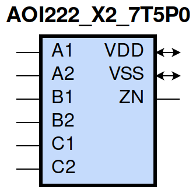
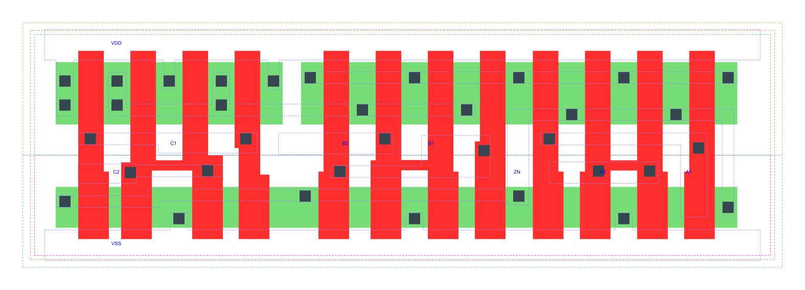

=======================================
gf180mcu_fd_sc_mcu7t5v0__aoi222_x2
=======================================

**gf180mcu_fd_sc_mcu7t5v0__aoi222_x2 symbol**

**gf180mcu_fd_sc_mcu7t5v0__aoi222_x2 schematic**

.. image:: sc7_sch/AOI222_X2_sch.png
    :height: 300px
    :width: 500 px
    :align: center
    :alt: gf180mcu_fd_sc_mcu7t5v0__aoi222_x2 schematic

**gf180mcu_fd_sc_mcu7t5v0__aoi222_x2 layout**

.. include:: images.rst

AOI222_X2 is a three 2-input AND into 3-input NOR, NOR[AND(A1,A2),AND(B1,B2),AND(C1,C2)], 2X drive strength

|
| Attributes

============= ======================
**Attribute** **Value**
area          54.880000 µm\ :sup:`2`
============= ======================

|
| OUTPUT FUNCTIONS

+----------------+-------------------------------------------------------------------------------------------------------------------------------------------------------------------+
| **Output Pin** | **Function**                                                                                                                                                      |
+----------------+-------------------------------------------------------------------------------------------------------------------------------------------------------------------+
| ZN             | (((!A1)&(!B1)&(!C1))|((!A1)&(!B1)&(!C2))|((!A1)&(!B2)&(!C1))|((!A1)&(!B2)&(!C2))|((!A2)&(!B1)&(!C1))|((!A2)&(!B1)&(!C2))|((!A2)&(!B2)&(!C1))|((!A2)&(!B2)&(!C2))) |
+----------------+-------------------------------------------------------------------------------------------------------------------------------------------------------------------+

|
| TRUTH TABLE FOR ZN

====== ====== ====== ====== ====== ====== ======
**A1** **A2** **B1** **B2** **C1** **C2** **ZN**
0      ?      0      ?      0      ?      1
0      ?      0      ?      ?      0      1
0      ?      ?      0      0      ?      1
0      ?      ?      0      ?      0      1
?      0      0      ?      0      ?      1
?      0      0      ?      ?      0      1
?      0      ?      0      0      ?      1
?      0      ?      0      ?      0      1
1      1      ?      ?      ?      ?      0
?      ?      1      1      ?      ?      0
?      ?      ?      ?      1      1      0
====== ====== ====== ====== ====== ====== ======

|
| FUNCTIONAL SCHEMATIC
| |image86|
| PIN CAPACITANCE (pf)

======= ======== ====================
**Pin** **Type** **Capacitance (pf)**
C2      input    0.0092
C1      input    0.0095
B2      input    0.0090
B1      input    0.0096
A1      input    0.0101
A2      input    0.0091
======= ======== ====================

|
| DELAY AND OUTPUT TRANSITION TIME corresponding to min slew and load

+---------------+------------+--------------------+--------------+-------------------+----------------+---------------+
| **Input Pin** | **Output** | **When Condition** | **Tin (ns)** | **Out Load (pf)** | **Delay (ns)** | **Tout (ns)** |
+---------------+------------+--------------------+--------------+-------------------+----------------+---------------+
| C2(LH)        | ZN(HL)     | !A1&!A2&!B1&!B2&C1 | 0.0100       | 0.0010            | 0.1784         | 0.1214        |
+---------------+------------+--------------------+--------------+-------------------+----------------+---------------+
| C2(LH)        | ZN(HL)     | !A1&!A2&!B1&B2&C1  | 0.0100       | 0.0010            | 0.1674         | 0.1135        |
+---------------+------------+--------------------+--------------+-------------------+----------------+---------------+
| C2(LH)        | ZN(HL)     | !A1&!A2&B1&!B2&C1  | 0.0100       | 0.0010            | 0.1804         | 0.1358        |
+---------------+------------+--------------------+--------------+-------------------+----------------+---------------+
| C2(LH)        | ZN(HL)     | !A1&A2&!B1&!B2&C1  | 0.0100       | 0.0010            | 0.1366         | 0.1049        |
+---------------+------------+--------------------+--------------+-------------------+----------------+---------------+
| C2(LH)        | ZN(HL)     | !A1&A2&!B1&B2&C1   | 0.0100       | 0.0010            | 0.1312         | 0.0986        |
+---------------+------------+--------------------+--------------+-------------------+----------------+---------------+
| C2(LH)        | ZN(HL)     | !A1&A2&B1&!B2&C1   | 0.0100       | 0.0010            | 0.1448         | 0.1222        |
+---------------+------------+--------------------+--------------+-------------------+----------------+---------------+
| C2(LH)        | ZN(HL)     | A1&!A2&!B1&!B2&C1  | 0.0100       | 0.0010            | 0.1508         | 0.1290        |
+---------------+------------+--------------------+--------------+-------------------+----------------+---------------+
| C2(LH)        | ZN(HL)     | A1&!A2&!B1&B2&C1   | 0.0100       | 0.0010            | 0.1445         | 0.1217        |
+---------------+------------+--------------------+--------------+-------------------+----------------+---------------+
| C2(LH)        | ZN(HL)     | A1&!A2&B1&!B2&C1   | 0.0100       | 0.0010            | 0.1585         | 0.1444        |
+---------------+------------+--------------------+--------------+-------------------+----------------+---------------+
| C2(HL)        | ZN(LH)     | !A1&!A2&!B1&!B2&C1 | 0.0100       | 0.0010            | 0.2802         | 0.1724        |
+---------------+------------+--------------------+--------------+-------------------+----------------+---------------+
| C2(HL)        | ZN(LH)     | !A1&!A2&!B1&B2&C1  | 0.0100       | 0.0010            | 0.3247         | 0.2125        |
+---------------+------------+--------------------+--------------+-------------------+----------------+---------------+
| C2(HL)        | ZN(LH)     | !A1&!A2&B1&!B2&C1  | 0.0100       | 0.0010            | 0.3715         | 0.2482        |
+---------------+------------+--------------------+--------------+-------------------+----------------+---------------+
| C2(HL)        | ZN(LH)     | !A1&A2&!B1&!B2&C1  | 0.0100       | 0.0010            | 0.3266         | 0.1780        |
+---------------+------------+--------------------+--------------+-------------------+----------------+---------------+
| C2(HL)        | ZN(LH)     | !A1&A2&!B1&B2&C1   | 0.0100       | 0.0010            | 0.3662         | 0.2123        |
+---------------+------------+--------------------+--------------+-------------------+----------------+---------------+
| C2(HL)        | ZN(LH)     | !A1&A2&B1&!B2&C1   | 0.0100       | 0.0010            | 0.4218         | 0.2548        |
+---------------+------------+--------------------+--------------+-------------------+----------------+---------------+
| C2(HL)        | ZN(LH)     | A1&!A2&!B1&!B2&C1  | 0.0100       | 0.0010            | 0.3728         | 0.2123        |
+---------------+------------+--------------------+--------------+-------------------+----------------+---------------+
| C2(HL)        | ZN(LH)     | A1&!A2&!B1&B2&C1   | 0.0100       | 0.0010            | 0.4206         | 0.2539        |
+---------------+------------+--------------------+--------------+-------------------+----------------+---------------+
| C2(HL)        | ZN(LH)     | A1&!A2&B1&!B2&C1   | 0.0100       | 0.0010            | 0.4757         | 0.2968        |
+---------------+------------+--------------------+--------------+-------------------+----------------+---------------+
| C1(LH)        | ZN(HL)     | !A1&!A2&!B1&!B2&C2 | 0.0100       | 0.0010            | 0.1672         | 0.1215        |
+---------------+------------+--------------------+--------------+-------------------+----------------+---------------+
| C1(LH)        | ZN(HL)     | !A1&!A2&!B1&B2&C2  | 0.0100       | 0.0010            | 0.1562         | 0.1140        |
+---------------+------------+--------------------+--------------+-------------------+----------------+---------------+
| C1(LH)        | ZN(HL)     | !A1&!A2&B1&!B2&C2  | 0.0100       | 0.0010            | 0.1693         | 0.1359        |
+---------------+------------+--------------------+--------------+-------------------+----------------+---------------+
| C1(LH)        | ZN(HL)     | !A1&A2&!B1&!B2&C2  | 0.0100       | 0.0010            | 0.1253         | 0.1053        |
+---------------+------------+--------------------+--------------+-------------------+----------------+---------------+
| C1(LH)        | ZN(HL)     | !A1&A2&!B1&B2&C2   | 0.0100       | 0.0010            | 0.1198         | 0.0990        |
+---------------+------------+--------------------+--------------+-------------------+----------------+---------------+
| C1(LH)        | ZN(HL)     | !A1&A2&B1&!B2&C2   | 0.0100       | 0.0010            | 0.1334         | 0.1229        |
+---------------+------------+--------------------+--------------+-------------------+----------------+---------------+
| C1(LH)        | ZN(HL)     | A1&!A2&!B1&!B2&C2  | 0.0100       | 0.0010            | 0.1395         | 0.1292        |
+---------------+------------+--------------------+--------------+-------------------+----------------+---------------+
| C1(LH)        | ZN(HL)     | A1&!A2&!B1&B2&C2   | 0.0100       | 0.0010            | 0.1331         | 0.1224        |
+---------------+------------+--------------------+--------------+-------------------+----------------+---------------+
| C1(LH)        | ZN(HL)     | A1&!A2&B1&!B2&C2   | 0.0100       | 0.0010            | 0.1471         | 0.1450        |
+---------------+------------+--------------------+--------------+-------------------+----------------+---------------+
| C1(HL)        | ZN(LH)     | !A1&!A2&!B1&!B2&C2 | 0.0100       | 0.0010            | 0.2501         | 0.1450        |
+---------------+------------+--------------------+--------------+-------------------+----------------+---------------+
| C1(HL)        | ZN(LH)     | !A1&!A2&!B1&B2&C2  | 0.0100       | 0.0010            | 0.2882         | 0.1785        |
+---------------+------------+--------------------+--------------+-------------------+----------------+---------------+
| C1(HL)        | ZN(LH)     | !A1&!A2&B1&!B2&C2  | 0.0100       | 0.0010            | 0.3360         | 0.2138        |
+---------------+------------+--------------------+--------------+-------------------+----------------+---------------+
| C1(HL)        | ZN(LH)     | !A1&A2&!B1&!B2&C2  | 0.0100       | 0.0010            | 0.2895         | 0.1444        |
+---------------+------------+--------------------+--------------+-------------------+----------------+---------------+
| C1(HL)        | ZN(LH)     | !A1&A2&!B1&B2&C2   | 0.0100       | 0.0010            | 0.3228         | 0.1711        |
+---------------+------------+--------------------+--------------+-------------------+----------------+---------------+
| C1(HL)        | ZN(LH)     | !A1&A2&B1&!B2&C2   | 0.0100       | 0.0010            | 0.3796         | 0.2134        |
+---------------+------------+--------------------+--------------+-------------------+----------------+---------------+
| C1(HL)        | ZN(LH)     | A1&!A2&!B1&!B2&C2  | 0.0100       | 0.0010            | 0.3374         | 0.1779        |
+---------------+------------+--------------------+--------------+-------------------+----------------+---------------+
| C1(HL)        | ZN(LH)     | A1&!A2&!B1&B2&C2   | 0.0100       | 0.0010            | 0.3786         | 0.2126        |
+---------------+------------+--------------------+--------------+-------------------+----------------+---------------+
| C1(HL)        | ZN(LH)     | A1&!A2&B1&!B2&C2   | 0.0100       | 0.0010            | 0.4346         | 0.2551        |
+---------------+------------+--------------------+--------------+-------------------+----------------+---------------+
| B2(HL)        | ZN(LH)     | !A1&!A2&B1&!C1&!C2 | 0.0100       | 0.0010            | 0.2256         | 0.1625        |
+---------------+------------+--------------------+--------------+-------------------+----------------+---------------+
| B2(HL)        | ZN(LH)     | !A1&!A2&B1&!C1&C2  | 0.0100       | 0.0010            | 0.2723         | 0.2134        |
+---------------+------------+--------------------+--------------+-------------------+----------------+---------------+
| B2(HL)        | ZN(LH)     | !A1&!A2&B1&C1&!C2  | 0.0100       | 0.0010            | 0.3173         | 0.2480        |
+---------------+------------+--------------------+--------------+-------------------+----------------+---------------+
| B2(HL)        | ZN(LH)     | !A1&A2&B1&!C1&!C2  | 0.0100       | 0.0010            | 0.2662         | 0.1715        |
+---------------+------------+--------------------+--------------+-------------------+----------------+---------------+
| B2(HL)        | ZN(LH)     | !A1&A2&B1&!C1&C2   | 0.0100       | 0.0010            | 0.3143         | 0.2136        |
+---------------+------------+--------------------+--------------+-------------------+----------------+---------------+
| B2(HL)        | ZN(LH)     | !A1&A2&B1&C1&!C2   | 0.0100       | 0.0010            | 0.3675         | 0.2545        |
+---------------+------------+--------------------+--------------+-------------------+----------------+---------------+
| B2(HL)        | ZN(LH)     | A1&!A2&B1&!C1&!C2  | 0.0100       | 0.0010            | 0.3117         | 0.2061        |
+---------------+------------+--------------------+--------------+-------------------+----------------+---------------+
| B2(HL)        | ZN(LH)     | A1&!A2&B1&!C1&C2   | 0.0100       | 0.0010            | 0.3684         | 0.2552        |
+---------------+------------+--------------------+--------------+-------------------+----------------+---------------+
| B2(HL)        | ZN(LH)     | A1&!A2&B1&C1&!C2   | 0.0100       | 0.0010            | 0.4214         | 0.2966        |
+---------------+------------+--------------------+--------------+-------------------+----------------+---------------+
| B2(LH)        | ZN(HL)     | !A1&!A2&B1&!C1&!C2 | 0.0100       | 0.0010            | 0.1468         | 0.0888        |
+---------------+------------+--------------------+--------------+-------------------+----------------+---------------+
| B2(LH)        | ZN(HL)     | !A1&!A2&B1&!C1&C2  | 0.0100       | 0.0010            | 0.1471         | 0.0888        |
+---------------+------------+--------------------+--------------+-------------------+----------------+---------------+
| B2(LH)        | ZN(HL)     | !A1&!A2&B1&C1&!C2  | 0.0100       | 0.0010            | 0.1570         | 0.1073        |
+---------------+------------+--------------------+--------------+-------------------+----------------+---------------+
| B2(LH)        | ZN(HL)     | !A1&A2&B1&!C1&!C2  | 0.0100       | 0.0010            | 0.1242         | 0.0792        |
+---------------+------------+--------------------+--------------+-------------------+----------------+---------------+
| B2(LH)        | ZN(HL)     | !A1&A2&B1&!C1&C2   | 0.0100       | 0.0010            | 0.1245         | 0.0790        |
+---------------+------------+--------------------+--------------+-------------------+----------------+---------------+
| B2(LH)        | ZN(HL)     | !A1&A2&B1&C1&!C2   | 0.0100       | 0.0010            | 0.1345         | 0.0983        |
+---------------+------------+--------------------+--------------+-------------------+----------------+---------------+
| B2(LH)        | ZN(HL)     | A1&!A2&B1&!C1&!C2  | 0.0100       | 0.0010            | 0.1343         | 0.0987        |
+---------------+------------+--------------------+--------------+-------------------+----------------+---------------+
| B2(LH)        | ZN(HL)     | A1&!A2&B1&!C1&C2   | 0.0100       | 0.0010            | 0.1346         | 0.0987        |
+---------------+------------+--------------------+--------------+-------------------+----------------+---------------+
| B2(LH)        | ZN(HL)     | A1&!A2&B1&C1&!C2   | 0.0100       | 0.0010            | 0.1458         | 0.1173        |
+---------------+------------+--------------------+--------------+-------------------+----------------+---------------+
| B1(LH)        | ZN(HL)     | !A1&!A2&B2&!C1&!C2 | 0.0100       | 0.0010            | 0.1350         | 0.0888        |
+---------------+------------+--------------------+--------------+-------------------+----------------+---------------+
| B1(LH)        | ZN(HL)     | !A1&!A2&B2&!C1&C2  | 0.0100       | 0.0010            | 0.1351         | 0.0893        |
+---------------+------------+--------------------+--------------+-------------------+----------------+---------------+
| B1(LH)        | ZN(HL)     | !A1&!A2&B2&C1&!C2  | 0.0100       | 0.0010            | 0.1451         | 0.1074        |
+---------------+------------+--------------------+--------------+-------------------+----------------+---------------+
| B1(LH)        | ZN(HL)     | !A1&A2&B2&!C1&!C2  | 0.0100       | 0.0010            | 0.1122         | 0.0796        |
+---------------+------------+--------------------+--------------+-------------------+----------------+---------------+
| B1(LH)        | ZN(HL)     | !A1&A2&B2&!C1&C2   | 0.0100       | 0.0010            | 0.1125         | 0.0793        |
+---------------+------------+--------------------+--------------+-------------------+----------------+---------------+
| B1(LH)        | ZN(HL)     | !A1&A2&B2&C1&!C2   | 0.0100       | 0.0010            | 0.1226         | 0.0986        |
+---------------+------------+--------------------+--------------+-------------------+----------------+---------------+
| B1(LH)        | ZN(HL)     | A1&!A2&B2&!C1&!C2  | 0.0100       | 0.0010            | 0.1224         | 0.0990        |
+---------------+------------+--------------------+--------------+-------------------+----------------+---------------+
| B1(LH)        | ZN(HL)     | A1&!A2&B2&!C1&C2   | 0.0100       | 0.0010            | 0.1227         | 0.0988        |
+---------------+------------+--------------------+--------------+-------------------+----------------+---------------+
| B1(LH)        | ZN(HL)     | A1&!A2&B2&C1&!C2   | 0.0100       | 0.0010            | 0.1339         | 0.1175        |
+---------------+------------+--------------------+--------------+-------------------+----------------+---------------+
| B1(HL)        | ZN(LH)     | !A1&!A2&B2&!C1&!C2 | 0.0100       | 0.0010            | 0.1949         | 0.1337        |
+---------------+------------+--------------------+--------------+-------------------+----------------+---------------+
| B1(HL)        | ZN(LH)     | !A1&!A2&B2&!C1&C2  | 0.0100       | 0.0010            | 0.2339         | 0.1775        |
+---------------+------------+--------------------+--------------+-------------------+----------------+---------------+
| B1(HL)        | ZN(LH)     | !A1&!A2&B2&C1&!C2  | 0.0100       | 0.0010            | 0.2799         | 0.2118        |
+---------------+------------+--------------------+--------------+-------------------+----------------+---------------+
| B1(HL)        | ZN(LH)     | !A1&A2&B2&!C1&!C2  | 0.0100       | 0.0010            | 0.2285         | 0.1357        |
+---------------+------------+--------------------+--------------+-------------------+----------------+---------------+
| B1(HL)        | ZN(LH)     | !A1&A2&B2&!C1&C2   | 0.0100       | 0.0010            | 0.2688         | 0.1704        |
+---------------+------------+--------------------+--------------+-------------------+----------------+---------------+
| B1(HL)        | ZN(LH)     | !A1&A2&B2&C1&!C2   | 0.0100       | 0.0010            | 0.3232         | 0.2114        |
+---------------+------------+--------------------+--------------+-------------------+----------------+---------------+
| B1(HL)        | ZN(LH)     | A1&!A2&B2&!C1&!C2  | 0.0100       | 0.0010            | 0.2744         | 0.1705        |
+---------------+------------+--------------------+--------------+-------------------+----------------+---------------+
| B1(HL)        | ZN(LH)     | A1&!A2&B2&!C1&C2   | 0.0100       | 0.0010            | 0.3243         | 0.2123        |
+---------------+------------+--------------------+--------------+-------------------+----------------+---------------+
| B1(HL)        | ZN(LH)     | A1&!A2&B2&C1&!C2   | 0.0100       | 0.0010            | 0.3784         | 0.2534        |
+---------------+------------+--------------------+--------------+-------------------+----------------+---------------+
| A1(HL)        | ZN(LH)     | A2&!B1&!B2&!C1&!C2 | 0.0100       | 0.0010            | 0.1159         | 0.0988        |
+---------------+------------+--------------------+--------------+-------------------+----------------+---------------+
| A1(HL)        | ZN(LH)     | A2&!B1&!B2&!C1&C2  | 0.0100       | 0.0010            | 0.1242         | 0.1209        |
+---------------+------------+--------------------+--------------+-------------------+----------------+---------------+
| A1(HL)        | ZN(LH)     | A2&!B1&!B2&C1&!C2  | 0.0100       | 0.0010            | 0.1657         | 0.1612        |
+---------------+------------+--------------------+--------------+-------------------+----------------+---------------+
| A1(HL)        | ZN(LH)     | A2&!B1&B2&!C1&!C2  | 0.0100       | 0.0010            | 0.1377         | 0.1282        |
+---------------+------------+--------------------+--------------+-------------------+----------------+---------------+
| A1(HL)        | ZN(LH)     | A2&!B1&B2&!C1&C2   | 0.0100       | 0.0010            | 0.1471         | 0.1538        |
+---------------+------------+--------------------+--------------+-------------------+----------------+---------------+
| A1(HL)        | ZN(LH)     | A2&!B1&B2&C1&!C2   | 0.0100       | 0.0010            | 0.1986         | 0.2014        |
+---------------+------------+--------------------+--------------+-------------------+----------------+---------------+
| A1(HL)        | ZN(LH)     | A2&B1&!B2&!C1&!C2  | 0.0100       | 0.0010            | 0.1836         | 0.1668        |
+---------------+------------+--------------------+--------------+-------------------+----------------+---------------+
| A1(HL)        | ZN(LH)     | A2&B1&!B2&!C1&C2   | 0.0100       | 0.0010            | 0.2007         | 0.2030        |
+---------------+------------+--------------------+--------------+-------------------+----------------+---------------+
| A1(HL)        | ZN(LH)     | A2&B1&!B2&C1&!C2   | 0.0100       | 0.0010            | 0.2538         | 0.2483        |
+---------------+------------+--------------------+--------------+-------------------+----------------+---------------+
| A1(LH)        | ZN(HL)     | A2&!B1&!B2&!C1&!C2 | 0.0100       | 0.0010            | 0.0762         | 0.0484        |
+---------------+------------+--------------------+--------------+-------------------+----------------+---------------+
| A1(LH)        | ZN(HL)     | A2&!B1&!B2&!C1&C2  | 0.0100       | 0.0010            | 0.0762         | 0.0484        |
+---------------+------------+--------------------+--------------+-------------------+----------------+---------------+
| A1(LH)        | ZN(HL)     | A2&!B1&!B2&C1&!C2  | 0.0100       | 0.0010            | 0.0818         | 0.0644        |
+---------------+------------+--------------------+--------------+-------------------+----------------+---------------+
| A1(LH)        | ZN(HL)     | A2&!B1&B2&!C1&!C2  | 0.0100       | 0.0010            | 0.0764         | 0.0484        |
+---------------+------------+--------------------+--------------+-------------------+----------------+---------------+
| A1(LH)        | ZN(HL)     | A2&!B1&B2&!C1&C2   | 0.0100       | 0.0010            | 0.0764         | 0.0484        |
+---------------+------------+--------------------+--------------+-------------------+----------------+---------------+
| A1(LH)        | ZN(HL)     | A2&!B1&B2&C1&!C2   | 0.0100       | 0.0010            | 0.0821         | 0.0644        |
+---------------+------------+--------------------+--------------+-------------------+----------------+---------------+
| A1(LH)        | ZN(HL)     | A2&B1&!B2&!C1&!C2  | 0.0100       | 0.0010            | 0.0820         | 0.0652        |
+---------------+------------+--------------------+--------------+-------------------+----------------+---------------+
| A1(LH)        | ZN(HL)     | A2&B1&!B2&!C1&C2   | 0.0100       | 0.0010            | 0.0821         | 0.0652        |
+---------------+------------+--------------------+--------------+-------------------+----------------+---------------+
| A1(LH)        | ZN(HL)     | A2&B1&!B2&C1&!C2   | 0.0100       | 0.0010            | 0.0899         | 0.0817        |
+---------------+------------+--------------------+--------------+-------------------+----------------+---------------+
| A2(HL)        | ZN(LH)     | A1&!B1&!B2&!C1&!C2 | 0.0100       | 0.0010            | 0.1442         | 0.1284        |
+---------------+------------+--------------------+--------------+-------------------+----------------+---------------+
| A2(HL)        | ZN(LH)     | A1&!B1&!B2&!C1&C2  | 0.0100       | 0.0010            | 0.1576         | 0.1603        |
+---------------+------------+--------------------+--------------+-------------------+----------------+---------------+
| A2(HL)        | ZN(LH)     | A1&!B1&!B2&C1&!C2  | 0.0100       | 0.0010            | 0.1999         | 0.1993        |
+---------------+------------+--------------------+--------------+-------------------+----------------+---------------+
| A2(HL)        | ZN(LH)     | A1&!B1&B2&!C1&!C2  | 0.0100       | 0.0010            | 0.1733         | 0.1654        |
+---------------+------------+--------------------+--------------+-------------------+----------------+---------------+
| A2(HL)        | ZN(LH)     | A1&!B1&B2&!C1&C2   | 0.0100       | 0.0010            | 0.1886         | 0.2006        |
+---------------+------------+--------------------+--------------+-------------------+----------------+---------------+
| A2(HL)        | ZN(LH)     | A1&!B1&B2&C1&!C2   | 0.0100       | 0.0010            | 0.2406         | 0.2464        |
+---------------+------------+--------------------+--------------+-------------------+----------------+---------------+
| A2(HL)        | ZN(LH)     | A1&B1&!B2&!C1&!C2  | 0.0100       | 0.0010            | 0.2192         | 0.2032        |
+---------------+------------+--------------------+--------------+-------------------+----------------+---------------+
| A2(HL)        | ZN(LH)     | A1&B1&!B2&!C1&C2   | 0.0100       | 0.0010            | 0.2424         | 0.2481        |
+---------------+------------+--------------------+--------------+-------------------+----------------+---------------+
| A2(HL)        | ZN(LH)     | A1&B1&!B2&C1&!C2   | 0.0100       | 0.0010            | 0.2950         | 0.2924        |
+---------------+------------+--------------------+--------------+-------------------+----------------+---------------+
| A2(LH)        | ZN(HL)     | A1&!B1&!B2&!C1&!C2 | 0.0100       | 0.0010            | 0.0876         | 0.0483        |
+---------------+------------+--------------------+--------------+-------------------+----------------+---------------+
| A2(LH)        | ZN(HL)     | A1&!B1&!B2&!C1&C2  | 0.0100       | 0.0010            | 0.0876         | 0.0483        |
+---------------+------------+--------------------+--------------+-------------------+----------------+---------------+
| A2(LH)        | ZN(HL)     | A1&!B1&!B2&C1&!C2  | 0.0100       | 0.0010            | 0.0933         | 0.0644        |
+---------------+------------+--------------------+--------------+-------------------+----------------+---------------+
| A2(LH)        | ZN(HL)     | A1&!B1&B2&!C1&!C2  | 0.0100       | 0.0010            | 0.0878         | 0.0483        |
+---------------+------------+--------------------+--------------+-------------------+----------------+---------------+
| A2(LH)        | ZN(HL)     | A1&!B1&B2&!C1&C2   | 0.0100       | 0.0010            | 0.0878         | 0.0483        |
+---------------+------------+--------------------+--------------+-------------------+----------------+---------------+
| A2(LH)        | ZN(HL)     | A1&!B1&B2&C1&!C2   | 0.0100       | 0.0010            | 0.0935         | 0.0644        |
+---------------+------------+--------------------+--------------+-------------------+----------------+---------------+
| A2(LH)        | ZN(HL)     | A1&B1&!B2&!C1&!C2  | 0.0100       | 0.0010            | 0.0935         | 0.0651        |
+---------------+------------+--------------------+--------------+-------------------+----------------+---------------+
| A2(LH)        | ZN(HL)     | A1&B1&!B2&!C1&C2   | 0.0100       | 0.0010            | 0.0935         | 0.0651        |
+---------------+------------+--------------------+--------------+-------------------+----------------+---------------+
| A2(LH)        | ZN(HL)     | A1&B1&!B2&C1&!C2   | 0.0100       | 0.0010            | 0.1014         | 0.0817        |
+---------------+------------+--------------------+--------------+-------------------+----------------+---------------+

|
| DYNAMIC ENERGY

+---------------+---------------------+--------------+------------+-------------------+---------------------+
| **Input Pin** | **When Condition**  | **Tin (ns)** | **Output** | **Out Load (pf)** | **Energy (uW/MHz)** |
+---------------+---------------------+--------------+------------+-------------------+---------------------+
| A1            | A2&!B1&!B2&!C1&!C2  | 0.0100       | ZN(LH)     | 0.0010            | 0.3369              |
+---------------+---------------------+--------------+------------+-------------------+---------------------+
| A1            | A2&!B1&!B2&!C1&C2   | 0.0100       | ZN(LH)     | 0.0010            | 0.3373              |
+---------------+---------------------+--------------+------------+-------------------+---------------------+
| A1            | A2&!B1&!B2&C1&!C2   | 0.0100       | ZN(LH)     | 0.0010            | 0.4177              |
+---------------+---------------------+--------------+------------+-------------------+---------------------+
| A1            | A2&!B1&B2&!C1&!C2   | 0.0100       | ZN(LH)     | 0.0010            | 0.3368              |
+---------------+---------------------+--------------+------------+-------------------+---------------------+
| A1            | A2&!B1&B2&!C1&C2    | 0.0100       | ZN(LH)     | 0.0010            | 0.3370              |
+---------------+---------------------+--------------+------------+-------------------+---------------------+
| A1            | A2&!B1&B2&C1&!C2    | 0.0100       | ZN(LH)     | 0.0010            | 0.4175              |
+---------------+---------------------+--------------+------------+-------------------+---------------------+
| A1            | A2&B1&!B2&!C1&!C2   | 0.0100       | ZN(LH)     | 0.0010            | 0.4207              |
+---------------+---------------------+--------------+------------+-------------------+---------------------+
| A1            | A2&B1&!B2&!C1&C2    | 0.0100       | ZN(LH)     | 0.0010            | 0.4209              |
+---------------+---------------------+--------------+------------+-------------------+---------------------+
| A1            | A2&B1&!B2&C1&!C2    | 0.0100       | ZN(LH)     | 0.0010            | 0.5009              |
+---------------+---------------------+--------------+------------+-------------------+---------------------+
| B2            | !A1&!A2&B1&!C1&!C2  | 0.0100       | ZN(LH)     | 0.0010            | 0.5717              |
+---------------+---------------------+--------------+------------+-------------------+---------------------+
| B2            | !A1&!A2&B1&!C1&C2   | 0.0100       | ZN(LH)     | 0.0010            | 0.5716              |
+---------------+---------------------+--------------+------------+-------------------+---------------------+
| B2            | !A1&!A2&B1&C1&!C2   | 0.0100       | ZN(LH)     | 0.0010            | 0.6507              |
+---------------+---------------------+--------------+------------+-------------------+---------------------+
| B2            | !A1&A2&B1&!C1&!C2   | 0.0100       | ZN(LH)     | 0.0010            | 0.5277              |
+---------------+---------------------+--------------+------------+-------------------+---------------------+
| B2            | !A1&A2&B1&!C1&C2    | 0.0100       | ZN(LH)     | 0.0010            | 0.5276              |
+---------------+---------------------+--------------+------------+-------------------+---------------------+
| B2            | !A1&A2&B1&C1&!C2    | 0.0100       | ZN(LH)     | 0.0010            | 0.6066              |
+---------------+---------------------+--------------+------------+-------------------+---------------------+
| B2            | A1&!A2&B1&!C1&!C2   | 0.0100       | ZN(LH)     | 0.0010            | 0.6081              |
+---------------+---------------------+--------------+------------+-------------------+---------------------+
| B2            | A1&!A2&B1&!C1&C2    | 0.0100       | ZN(LH)     | 0.0010            | 0.6081              |
+---------------+---------------------+--------------+------------+-------------------+---------------------+
| B2            | A1&!A2&B1&C1&!C2    | 0.0100       | ZN(LH)     | 0.0010            | 0.6872              |
+---------------+---------------------+--------------+------------+-------------------+---------------------+
| B1            | !A1&!A2&B2&!C1&!C2  | 0.0100       | ZN(HL)     | 0.0010            | 0.1195              |
+---------------+---------------------+--------------+------------+-------------------+---------------------+
| B1            | !A1&!A2&B2&!C1&C2   | 0.0100       | ZN(HL)     | 0.0010            | 0.1203              |
+---------------+---------------------+--------------+------------+-------------------+---------------------+
| B1            | !A1&!A2&B2&C1&!C2   | 0.0100       | ZN(HL)     | 0.0010            | 0.1205              |
+---------------+---------------------+--------------+------------+-------------------+---------------------+
| B1            | !A1&A2&B2&!C1&!C2   | 0.0100       | ZN(HL)     | 0.0010            | 0.1063              |
+---------------+---------------------+--------------+------------+-------------------+---------------------+
| B1            | !A1&A2&B2&!C1&C2    | 0.0100       | ZN(HL)     | 0.0010            | 0.1073              |
+---------------+---------------------+--------------+------------+-------------------+---------------------+
| B1            | !A1&A2&B2&C1&!C2    | 0.0100       | ZN(HL)     | 0.0010            | 0.1075              |
+---------------+---------------------+--------------+------------+-------------------+---------------------+
| B1            | A1&!A2&B2&!C1&!C2   | 0.0100       | ZN(HL)     | 0.0010            | 0.1066              |
+---------------+---------------------+--------------+------------+-------------------+---------------------+
| B1            | A1&!A2&B2&!C1&C2    | 0.0100       | ZN(HL)     | 0.0010            | 0.1074              |
+---------------+---------------------+--------------+------------+-------------------+---------------------+
| B1            | A1&!A2&B2&C1&!C2    | 0.0100       | ZN(HL)     | 0.0010            | 0.1074              |
+---------------+---------------------+--------------+------------+-------------------+---------------------+
| A2            | A1&!B1&!B2&!C1&!C2  | 0.0100       | ZN(LH)     | 0.0010            | 0.4068              |
+---------------+---------------------+--------------+------------+-------------------+---------------------+
| A2            | A1&!B1&!B2&!C1&C2   | 0.0100       | ZN(LH)     | 0.0010            | 0.4069              |
+---------------+---------------------+--------------+------------+-------------------+---------------------+
| A2            | A1&!B1&!B2&C1&!C2   | 0.0100       | ZN(LH)     | 0.0010            | 0.4863              |
+---------------+---------------------+--------------+------------+-------------------+---------------------+
| A2            | A1&!B1&B2&!C1&!C2   | 0.0100       | ZN(LH)     | 0.0010            | 0.4067              |
+---------------+---------------------+--------------+------------+-------------------+---------------------+
| A2            | A1&!B1&B2&!C1&C2    | 0.0100       | ZN(LH)     | 0.0010            | 0.4069              |
+---------------+---------------------+--------------+------------+-------------------+---------------------+
| A2            | A1&!B1&B2&C1&!C2    | 0.0100       | ZN(LH)     | 0.0010            | 0.4861              |
+---------------+---------------------+--------------+------------+-------------------+---------------------+
| A2            | A1&B1&!B2&!C1&!C2   | 0.0100       | ZN(LH)     | 0.0010            | 0.4893              |
+---------------+---------------------+--------------+------------+-------------------+---------------------+
| A2            | A1&B1&!B2&!C1&C2    | 0.0100       | ZN(LH)     | 0.0010            | 0.4894              |
+---------------+---------------------+--------------+------------+-------------------+---------------------+
| A2            | A1&B1&!B2&C1&!C2    | 0.0100       | ZN(LH)     | 0.0010            | 0.5684              |
+---------------+---------------------+--------------+------------+-------------------+---------------------+
| B1            | !A1&!A2&B2&!C1&!C2  | 0.0100       | ZN(LH)     | 0.0010            | 0.4995              |
+---------------+---------------------+--------------+------------+-------------------+---------------------+
| B1            | !A1&!A2&B2&!C1&C2   | 0.0100       | ZN(LH)     | 0.0010            | 0.4995              |
+---------------+---------------------+--------------+------------+-------------------+---------------------+
| B1            | !A1&!A2&B2&C1&!C2   | 0.0100       | ZN(LH)     | 0.0010            | 0.5802              |
+---------------+---------------------+--------------+------------+-------------------+---------------------+
| B1            | !A1&A2&B2&!C1&!C2   | 0.0100       | ZN(LH)     | 0.0010            | 0.4554              |
+---------------+---------------------+--------------+------------+-------------------+---------------------+
| B1            | !A1&A2&B2&!C1&C2    | 0.0100       | ZN(LH)     | 0.0010            | 0.4554              |
+---------------+---------------------+--------------+------------+-------------------+---------------------+
| B1            | !A1&A2&B2&C1&!C2    | 0.0100       | ZN(LH)     | 0.0010            | 0.5360              |
+---------------+---------------------+--------------+------------+-------------------+---------------------+
| B1            | A1&!A2&B2&!C1&!C2   | 0.0100       | ZN(LH)     | 0.0010            | 0.5376              |
+---------------+---------------------+--------------+------------+-------------------+---------------------+
| B1            | A1&!A2&B2&!C1&C2    | 0.0100       | ZN(LH)     | 0.0010            | 0.5376              |
+---------------+---------------------+--------------+------------+-------------------+---------------------+
| B1            | A1&!A2&B2&C1&!C2    | 0.0100       | ZN(LH)     | 0.0010            | 0.6176              |
+---------------+---------------------+--------------+------------+-------------------+---------------------+
| C1            | !A1&!A2&!B1&!B2&C2  | 0.0100       | ZN(HL)     | 0.0010            | 0.2137              |
+---------------+---------------------+--------------+------------+-------------------+---------------------+
| C1            | !A1&!A2&!B1&B2&C2   | 0.0100       | ZN(HL)     | 0.0010            | 0.2007              |
+---------------+---------------------+--------------+------------+-------------------+---------------------+
| C1            | !A1&!A2&B1&!B2&C2   | 0.0100       | ZN(HL)     | 0.0010            | 0.2007              |
+---------------+---------------------+--------------+------------+-------------------+---------------------+
| C1            | !A1&A2&!B1&!B2&C2   | 0.0100       | ZN(HL)     | 0.0010            | 0.2009              |
+---------------+---------------------+--------------+------------+-------------------+---------------------+
| C1            | !A1&A2&!B1&B2&C2    | 0.0100       | ZN(HL)     | 0.0010            | 0.1881              |
+---------------+---------------------+--------------+------------+-------------------+---------------------+
| C1            | !A1&A2&B1&!B2&C2    | 0.0100       | ZN(HL)     | 0.0010            | 0.1882              |
+---------------+---------------------+--------------+------------+-------------------+---------------------+
| C1            | A1&!A2&!B1&!B2&C2   | 0.0100       | ZN(HL)     | 0.0010            | 0.2010              |
+---------------+---------------------+--------------+------------+-------------------+---------------------+
| C1            | A1&!A2&!B1&B2&C2    | 0.0100       | ZN(HL)     | 0.0010            | 0.1882              |
+---------------+---------------------+--------------+------------+-------------------+---------------------+
| C1            | A1&!A2&B1&!B2&C2    | 0.0100       | ZN(HL)     | 0.0010            | 0.1881              |
+---------------+---------------------+--------------+------------+-------------------+---------------------+
| A2            | A1&!B1&!B2&!C1&!C2  | 0.0100       | ZN(HL)     | 0.0010            | 0.0077              |
+---------------+---------------------+--------------+------------+-------------------+---------------------+
| A2            | A1&!B1&!B2&!C1&C2   | 0.0100       | ZN(HL)     | 0.0010            | 0.0077              |
+---------------+---------------------+--------------+------------+-------------------+---------------------+
| A2            | A1&!B1&!B2&C1&!C2   | 0.0100       | ZN(HL)     | 0.0010            | 0.0078              |
+---------------+---------------------+--------------+------------+-------------------+---------------------+
| A2            | A1&!B1&B2&!C1&!C2   | 0.0100       | ZN(HL)     | 0.0010            | 0.0083              |
+---------------+---------------------+--------------+------------+-------------------+---------------------+
| A2            | A1&!B1&B2&!C1&C2    | 0.0100       | ZN(HL)     | 0.0010            | 0.0083              |
+---------------+---------------------+--------------+------------+-------------------+---------------------+
| A2            | A1&!B1&B2&C1&!C2    | 0.0100       | ZN(HL)     | 0.0010            | 0.0083              |
+---------------+---------------------+--------------+------------+-------------------+---------------------+
| A2            | A1&B1&!B2&!C1&!C2   | 0.0100       | ZN(HL)     | 0.0010            | 0.0083              |
+---------------+---------------------+--------------+------------+-------------------+---------------------+
| A2            | A1&B1&!B2&!C1&C2    | 0.0100       | ZN(HL)     | 0.0010            | 0.0083              |
+---------------+---------------------+--------------+------------+-------------------+---------------------+
| A2            | A1&B1&!B2&C1&!C2    | 0.0100       | ZN(HL)     | 0.0010            | 0.0084              |
+---------------+---------------------+--------------+------------+-------------------+---------------------+
| C2            | !A1&!A2&!B1&!B2&C1  | 0.0100       | ZN(HL)     | 0.0010            | 0.2135              |
+---------------+---------------------+--------------+------------+-------------------+---------------------+
| C2            | !A1&!A2&!B1&B2&C1   | 0.0100       | ZN(HL)     | 0.0010            | 0.2006              |
+---------------+---------------------+--------------+------------+-------------------+---------------------+
| C2            | !A1&!A2&B1&!B2&C1   | 0.0100       | ZN(HL)     | 0.0010            | 0.2007              |
+---------------+---------------------+--------------+------------+-------------------+---------------------+
| C2            | !A1&A2&!B1&!B2&C1   | 0.0100       | ZN(HL)     | 0.0010            | 0.2008              |
+---------------+---------------------+--------------+------------+-------------------+---------------------+
| C2            | !A1&A2&!B1&B2&C1    | 0.0100       | ZN(HL)     | 0.0010            | 0.1879              |
+---------------+---------------------+--------------+------------+-------------------+---------------------+
| C2            | !A1&A2&B1&!B2&C1    | 0.0100       | ZN(HL)     | 0.0010            | 0.1880              |
+---------------+---------------------+--------------+------------+-------------------+---------------------+
| C2            | A1&!A2&!B1&!B2&C1   | 0.0100       | ZN(HL)     | 0.0010            | 0.2009              |
+---------------+---------------------+--------------+------------+-------------------+---------------------+
| C2            | A1&!A2&!B1&B2&C1    | 0.0100       | ZN(HL)     | 0.0010            | 0.1880              |
+---------------+---------------------+--------------+------------+-------------------+---------------------+
| C2            | A1&!A2&B1&!B2&C1    | 0.0100       | ZN(HL)     | 0.0010            | 0.1879              |
+---------------+---------------------+--------------+------------+-------------------+---------------------+
| C1            | !A1&!A2&!B1&!B2&C2  | 0.0100       | ZN(LH)     | 0.0010            | 0.6546              |
+---------------+---------------------+--------------+------------+-------------------+---------------------+
| C1            | !A1&!A2&!B1&B2&C2   | 0.0100       | ZN(LH)     | 0.0010            | 0.6115              |
+---------------+---------------------+--------------+------------+-------------------+---------------------+
| C1            | !A1&!A2&B1&!B2&C2   | 0.0100       | ZN(LH)     | 0.0010            | 0.6957              |
+---------------+---------------------+--------------+------------+-------------------+---------------------+
| C1            | !A1&A2&!B1&!B2&C2   | 0.0100       | ZN(LH)     | 0.0010            | 0.6104              |
+---------------+---------------------+--------------+------------+-------------------+---------------------+
| C1            | !A1&A2&!B1&B2&C2    | 0.0100       | ZN(LH)     | 0.0010            | 0.5671              |
+---------------+---------------------+--------------+------------+-------------------+---------------------+
| C1            | !A1&A2&B1&!B2&C2    | 0.0100       | ZN(LH)     | 0.0010            | 0.6516              |
+---------------+---------------------+--------------+------------+-------------------+---------------------+
| C1            | A1&!A2&!B1&!B2&C2   | 0.0100       | ZN(LH)     | 0.0010            | 0.6927              |
+---------------+---------------------+--------------+------------+-------------------+---------------------+
| C1            | A1&!A2&!B1&B2&C2    | 0.0100       | ZN(LH)     | 0.0010            | 0.6496              |
+---------------+---------------------+--------------+------------+-------------------+---------------------+
| C1            | A1&!A2&B1&!B2&C2    | 0.0100       | ZN(LH)     | 0.0010            | 0.7329              |
+---------------+---------------------+--------------+------------+-------------------+---------------------+
| C2            | !A1&!A2&!B1&!B2&C1  | 0.0100       | ZN(LH)     | 0.0010            | 0.7234              |
+---------------+---------------------+--------------+------------+-------------------+---------------------+
| C2            | !A1&!A2&!B1&B2&C1   | 0.0100       | ZN(LH)     | 0.0010            | 0.6801              |
+---------------+---------------------+--------------+------------+-------------------+---------------------+
| C2            | !A1&!A2&B1&!B2&C1   | 0.0100       | ZN(LH)     | 0.0010            | 0.7625              |
+---------------+---------------------+--------------+------------+-------------------+---------------------+
| C2            | !A1&A2&!B1&!B2&C1   | 0.0100       | ZN(LH)     | 0.0010            | 0.6790              |
+---------------+---------------------+--------------+------------+-------------------+---------------------+
| C2            | !A1&A2&!B1&B2&C1    | 0.0100       | ZN(LH)     | 0.0010            | 0.6360              |
+---------------+---------------------+--------------+------------+-------------------+---------------------+
| C2            | !A1&A2&B1&!B2&C1    | 0.0100       | ZN(LH)     | 0.0010            | 0.7185              |
+---------------+---------------------+--------------+------------+-------------------+---------------------+
| C2            | A1&!A2&!B1&!B2&C1   | 0.0100       | ZN(LH)     | 0.0010            | 0.7597              |
+---------------+---------------------+--------------+------------+-------------------+---------------------+
| C2            | A1&!A2&!B1&B2&C1    | 0.0100       | ZN(LH)     | 0.0010            | 0.7166              |
+---------------+---------------------+--------------+------------+-------------------+---------------------+
| C2            | A1&!A2&B1&!B2&C1    | 0.0100       | ZN(LH)     | 0.0010            | 0.7990              |
+---------------+---------------------+--------------+------------+-------------------+---------------------+
| A1            | A2&!B1&!B2&!C1&!C2  | 0.0100       | ZN(HL)     | 0.0010            | 0.0079              |
+---------------+---------------------+--------------+------------+-------------------+---------------------+
| A1            | A2&!B1&!B2&!C1&C2   | 0.0100       | ZN(HL)     | 0.0010            | 0.0078              |
+---------------+---------------------+--------------+------------+-------------------+---------------------+
| A1            | A2&!B1&!B2&C1&!C2   | 0.0100       | ZN(HL)     | 0.0010            | 0.0078              |
+---------------+---------------------+--------------+------------+-------------------+---------------------+
| A1            | A2&!B1&B2&!C1&!C2   | 0.0100       | ZN(HL)     | 0.0010            | 0.0085              |
+---------------+---------------------+--------------+------------+-------------------+---------------------+
| A1            | A2&!B1&B2&!C1&C2    | 0.0100       | ZN(HL)     | 0.0010            | 0.0085              |
+---------------+---------------------+--------------+------------+-------------------+---------------------+
| A1            | A2&!B1&B2&C1&!C2    | 0.0100       | ZN(HL)     | 0.0010            | 0.0084              |
+---------------+---------------------+--------------+------------+-------------------+---------------------+
| A1            | A2&B1&!B2&!C1&!C2   | 0.0100       | ZN(HL)     | 0.0010            | 0.0084              |
+---------------+---------------------+--------------+------------+-------------------+---------------------+
| A1            | A2&B1&!B2&!C1&C2    | 0.0100       | ZN(HL)     | 0.0010            | 0.0084              |
+---------------+---------------------+--------------+------------+-------------------+---------------------+
| A1            | A2&B1&!B2&C1&!C2    | 0.0100       | ZN(HL)     | 0.0010            | 0.0084              |
+---------------+---------------------+--------------+------------+-------------------+---------------------+
| B2            | !A1&!A2&B1&!C1&!C2  | 0.0100       | ZN(HL)     | 0.0010            | 0.1195              |
+---------------+---------------------+--------------+------------+-------------------+---------------------+
| B2            | !A1&!A2&B1&!C1&C2   | 0.0100       | ZN(HL)     | 0.0010            | 0.1204              |
+---------------+---------------------+--------------+------------+-------------------+---------------------+
| B2            | !A1&!A2&B1&C1&!C2   | 0.0100       | ZN(HL)     | 0.0010            | 0.1205              |
+---------------+---------------------+--------------+------------+-------------------+---------------------+
| B2            | !A1&A2&B1&!C1&!C2   | 0.0100       | ZN(HL)     | 0.0010            | 0.1065              |
+---------------+---------------------+--------------+------------+-------------------+---------------------+
| B2            | !A1&A2&B1&!C1&C2    | 0.0100       | ZN(HL)     | 0.0010            | 0.1074              |
+---------------+---------------------+--------------+------------+-------------------+---------------------+
| B2            | !A1&A2&B1&C1&!C2    | 0.0100       | ZN(HL)     | 0.0010            | 0.1075              |
+---------------+---------------------+--------------+------------+-------------------+---------------------+
| B2            | A1&!A2&B1&!C1&!C2   | 0.0100       | ZN(HL)     | 0.0010            | 0.1066              |
+---------------+---------------------+--------------+------------+-------------------+---------------------+
| B2            | A1&!A2&B1&!C1&C2    | 0.0100       | ZN(HL)     | 0.0010            | 0.1075              |
+---------------+---------------------+--------------+------------+-------------------+---------------------+
| B2            | A1&!A2&B1&C1&!C2    | 0.0100       | ZN(HL)     | 0.0010            | 0.1074              |
+---------------+---------------------+--------------+------------+-------------------+---------------------+
| B2(LH)        | !A1&!A2&!B1&!C1&!C2 | 0.0100       | n/a        | n/a               | -0.0791             |
+---------------+---------------------+--------------+------------+-------------------+---------------------+
| B2(LH)        | !A1&!A2&!B1&!C1&C2  | 0.0100       | n/a        | n/a               | -0.0791             |
+---------------+---------------------+--------------+------------+-------------------+---------------------+
| B2(LH)        | !A1&!A2&!B1&C1&!C2  | 0.0100       | n/a        | n/a               | -0.0791             |
+---------------+---------------------+--------------+------------+-------------------+---------------------+
| B2(LH)        | !A1&A2&!B1&!C1&!C2  | 0.0100       | n/a        | n/a               | -0.0790             |
+---------------+---------------------+--------------+------------+-------------------+---------------------+
| B2(LH)        | !A1&A2&!B1&!C1&C2   | 0.0100       | n/a        | n/a               | -0.0790             |
+---------------+---------------------+--------------+------------+-------------------+---------------------+
| B2(LH)        | !A1&A2&!B1&C1&!C2   | 0.0100       | n/a        | n/a               | -0.0790             |
+---------------+---------------------+--------------+------------+-------------------+---------------------+
| B2(LH)        | A1&!A2&!B1&!C1&!C2  | 0.0100       | n/a        | n/a               | -0.0790             |
+---------------+---------------------+--------------+------------+-------------------+---------------------+
| B2(LH)        | A1&!A2&!B1&!C1&C2   | 0.0100       | n/a        | n/a               | -0.0790             |
+---------------+---------------------+--------------+------------+-------------------+---------------------+
| B2(LH)        | A1&!A2&!B1&C1&!C2   | 0.0100       | n/a        | n/a               | -0.0790             |
+---------------+---------------------+--------------+------------+-------------------+---------------------+
| B2(LH)        | !A1&!A2&!B1&C1&C2   | 0.0100       | n/a        | n/a               | -0.0230             |
+---------------+---------------------+--------------+------------+-------------------+---------------------+
| B2(LH)        | !A1&!A2&B1&C1&C2    | 0.0100       | n/a        | n/a               | -0.0237             |
+---------------+---------------------+--------------+------------+-------------------+---------------------+
| B2(LH)        | !A1&A2&!B1&C1&C2    | 0.0100       | n/a        | n/a               | -0.0231             |
+---------------+---------------------+--------------+------------+-------------------+---------------------+
| B2(LH)        | !A1&A2&B1&C1&C2     | 0.0100       | n/a        | n/a               | -0.0238             |
+---------------+---------------------+--------------+------------+-------------------+---------------------+
| B2(LH)        | A1&!A2&!B1&C1&C2    | 0.0100       | n/a        | n/a               | -0.0231             |
+---------------+---------------------+--------------+------------+-------------------+---------------------+
| B2(LH)        | A1&!A2&B1&C1&C2     | 0.0100       | n/a        | n/a               | -0.0238             |
+---------------+---------------------+--------------+------------+-------------------+---------------------+
| B2(LH)        | A1&A2&!B1&!C1&!C2   | 0.0100       | n/a        | n/a               | -0.0788             |
+---------------+---------------------+--------------+------------+-------------------+---------------------+
| B2(LH)        | A1&A2&!B1&!C1&C2    | 0.0100       | n/a        | n/a               | -0.0788             |
+---------------+---------------------+--------------+------------+-------------------+---------------------+
| B2(LH)        | A1&A2&!B1&C1&!C2    | 0.0100       | n/a        | n/a               | -0.0788             |
+---------------+---------------------+--------------+------------+-------------------+---------------------+
| B2(LH)        | A1&A2&!B1&C1&C2     | 0.0100       | n/a        | n/a               | -0.0434             |
+---------------+---------------------+--------------+------------+-------------------+---------------------+
| B2(LH)        | A1&A2&B1&!C1&!C2    | 0.0100       | n/a        | n/a               | -0.0617             |
+---------------+---------------------+--------------+------------+-------------------+---------------------+
| B2(LH)        | A1&A2&B1&!C1&C2     | 0.0100       | n/a        | n/a               | -0.0611             |
+---------------+---------------------+--------------+------------+-------------------+---------------------+
| B2(LH)        | A1&A2&B1&C1&!C2     | 0.0100       | n/a        | n/a               | -0.0611             |
+---------------+---------------------+--------------+------------+-------------------+---------------------+
| B2(LH)        | A1&A2&B1&C1&C2      | 0.0100       | n/a        | n/a               | -0.0454             |
+---------------+---------------------+--------------+------------+-------------------+---------------------+
| C2(HL)        | !A1&!A2&!B1&!B2&!C1 | 0.0100       | n/a        | n/a               | 0.0871              |
+---------------+---------------------+--------------+------------+-------------------+---------------------+
| C2(HL)        | !A1&!A2&!B1&B2&!C1  | 0.0100       | n/a        | n/a               | 0.0871              |
+---------------+---------------------+--------------+------------+-------------------+---------------------+
| C2(HL)        | !A1&!A2&B1&!B2&!C1  | 0.0100       | n/a        | n/a               | 0.0871              |
+---------------+---------------------+--------------+------------+-------------------+---------------------+
| C2(HL)        | !A1&A2&!B1&!B2&!C1  | 0.0100       | n/a        | n/a               | 0.0871              |
+---------------+---------------------+--------------+------------+-------------------+---------------------+
| C2(HL)        | !A1&A2&!B1&B2&!C1   | 0.0100       | n/a        | n/a               | 0.0871              |
+---------------+---------------------+--------------+------------+-------------------+---------------------+
| C2(HL)        | !A1&A2&B1&!B2&!C1   | 0.0100       | n/a        | n/a               | 0.0871              |
+---------------+---------------------+--------------+------------+-------------------+---------------------+
| C2(HL)        | A1&!A2&!B1&!B2&!C1  | 0.0100       | n/a        | n/a               | 0.0871              |
+---------------+---------------------+--------------+------------+-------------------+---------------------+
| C2(HL)        | A1&!A2&!B1&B2&!C1   | 0.0100       | n/a        | n/a               | 0.0871              |
+---------------+---------------------+--------------+------------+-------------------+---------------------+
| C2(HL)        | A1&!A2&B1&!B2&!C1   | 0.0100       | n/a        | n/a               | 0.0871              |
+---------------+---------------------+--------------+------------+-------------------+---------------------+
| C2(HL)        | !A1&!A2&B1&B2&!C1   | 0.0100       | n/a        | n/a               | 0.0788              |
+---------------+---------------------+--------------+------------+-------------------+---------------------+
| C2(HL)        | !A1&!A2&B1&B2&C1    | 0.0100       | n/a        | n/a               | 0.0788              |
+---------------+---------------------+--------------+------------+-------------------+---------------------+
| C2(HL)        | !A1&A2&B1&B2&!C1    | 0.0100       | n/a        | n/a               | 0.0788              |
+---------------+---------------------+--------------+------------+-------------------+---------------------+
| C2(HL)        | !A1&A2&B1&B2&C1     | 0.0100       | n/a        | n/a               | 0.0788              |
+---------------+---------------------+--------------+------------+-------------------+---------------------+
| C2(HL)        | A1&!A2&B1&B2&!C1    | 0.0100       | n/a        | n/a               | 0.0788              |
+---------------+---------------------+--------------+------------+-------------------+---------------------+
| C2(HL)        | A1&!A2&B1&B2&C1     | 0.0100       | n/a        | n/a               | 0.0788              |
+---------------+---------------------+--------------+------------+-------------------+---------------------+
| C2(HL)        | A1&A2&!B1&!B2&!C1   | 0.0100       | n/a        | n/a               | 0.0788              |
+---------------+---------------------+--------------+------------+-------------------+---------------------+
| C2(HL)        | A1&A2&!B1&!B2&C1    | 0.0100       | n/a        | n/a               | 0.0788              |
+---------------+---------------------+--------------+------------+-------------------+---------------------+
| C2(HL)        | A1&A2&!B1&B2&!C1    | 0.0100       | n/a        | n/a               | 0.0789              |
+---------------+---------------------+--------------+------------+-------------------+---------------------+
| C2(HL)        | A1&A2&!B1&B2&C1     | 0.0100       | n/a        | n/a               | 0.0788              |
+---------------+---------------------+--------------+------------+-------------------+---------------------+
| C2(HL)        | A1&A2&B1&!B2&!C1    | 0.0100       | n/a        | n/a               | 0.0789              |
+---------------+---------------------+--------------+------------+-------------------+---------------------+
| C2(HL)        | A1&A2&B1&!B2&C1     | 0.0100       | n/a        | n/a               | 0.0788              |
+---------------+---------------------+--------------+------------+-------------------+---------------------+
| C2(HL)        | A1&A2&B1&B2&!C1     | 0.0100       | n/a        | n/a               | 0.0789              |
+---------------+---------------------+--------------+------------+-------------------+---------------------+
| C2(HL)        | A1&A2&B1&B2&C1      | 0.0100       | n/a        | n/a               | 0.0788              |
+---------------+---------------------+--------------+------------+-------------------+---------------------+
| B2(HL)        | !A1&!A2&!B1&!C1&!C2 | 0.0100       | n/a        | n/a               | 0.0873              |
+---------------+---------------------+--------------+------------+-------------------+---------------------+
| B2(HL)        | !A1&!A2&!B1&!C1&C2  | 0.0100       | n/a        | n/a               | 0.0872              |
+---------------+---------------------+--------------+------------+-------------------+---------------------+
| B2(HL)        | !A1&!A2&!B1&C1&!C2  | 0.0100       | n/a        | n/a               | 0.0872              |
+---------------+---------------------+--------------+------------+-------------------+---------------------+
| B2(HL)        | !A1&A2&!B1&!C1&!C2  | 0.0100       | n/a        | n/a               | 0.0874              |
+---------------+---------------------+--------------+------------+-------------------+---------------------+
| B2(HL)        | !A1&A2&!B1&!C1&C2   | 0.0100       | n/a        | n/a               | 0.0873              |
+---------------+---------------------+--------------+------------+-------------------+---------------------+
| B2(HL)        | !A1&A2&!B1&C1&!C2   | 0.0100       | n/a        | n/a               | 0.0873              |
+---------------+---------------------+--------------+------------+-------------------+---------------------+
| B2(HL)        | A1&!A2&!B1&!C1&!C2  | 0.0100       | n/a        | n/a               | 0.0874              |
+---------------+---------------------+--------------+------------+-------------------+---------------------+
| B2(HL)        | A1&!A2&!B1&!C1&C2   | 0.0100       | n/a        | n/a               | 0.0873              |
+---------------+---------------------+--------------+------------+-------------------+---------------------+
| B2(HL)        | A1&!A2&!B1&C1&!C2   | 0.0100       | n/a        | n/a               | 0.0873              |
+---------------+---------------------+--------------+------------+-------------------+---------------------+
| B2(HL)        | !A1&!A2&!B1&C1&C2   | 0.0100       | n/a        | n/a               | 0.0248              |
+---------------+---------------------+--------------+------------+-------------------+---------------------+
| B2(HL)        | !A1&!A2&B1&C1&C2    | 0.0100       | n/a        | n/a               | 0.0835              |
+---------------+---------------------+--------------+------------+-------------------+---------------------+
| B2(HL)        | !A1&A2&!B1&C1&C2    | 0.0100       | n/a        | n/a               | 0.0249              |
+---------------+---------------------+--------------+------------+-------------------+---------------------+
| B2(HL)        | !A1&A2&B1&C1&C2     | 0.0100       | n/a        | n/a               | 0.0832              |
+---------------+---------------------+--------------+------------+-------------------+---------------------+
| B2(HL)        | A1&!A2&!B1&C1&C2    | 0.0100       | n/a        | n/a               | 0.0249              |
+---------------+---------------------+--------------+------------+-------------------+---------------------+
| B2(HL)        | A1&!A2&B1&C1&C2     | 0.0100       | n/a        | n/a               | 0.0832              |
+---------------+---------------------+--------------+------------+-------------------+---------------------+
| B2(HL)        | A1&A2&!B1&!C1&!C2   | 0.0100       | n/a        | n/a               | 0.0790              |
+---------------+---------------------+--------------+------------+-------------------+---------------------+
| B2(HL)        | A1&A2&!B1&!C1&C2    | 0.0100       | n/a        | n/a               | 0.0789              |
+---------------+---------------------+--------------+------------+-------------------+---------------------+
| B2(HL)        | A1&A2&!B1&C1&!C2    | 0.0100       | n/a        | n/a               | 0.0789              |
+---------------+---------------------+--------------+------------+-------------------+---------------------+
| B2(HL)        | A1&A2&!B1&C1&C2     | 0.0100       | n/a        | n/a               | 0.0413              |
+---------------+---------------------+--------------+------------+-------------------+---------------------+
| B2(HL)        | A1&A2&B1&!C1&!C2    | 0.0100       | n/a        | n/a               | 0.0790              |
+---------------+---------------------+--------------+------------+-------------------+---------------------+
| B2(HL)        | A1&A2&B1&!C1&C2     | 0.0100       | n/a        | n/a               | 0.0789              |
+---------------+---------------------+--------------+------------+-------------------+---------------------+
| B2(HL)        | A1&A2&B1&C1&!C2     | 0.0100       | n/a        | n/a               | 0.0789              |
+---------------+---------------------+--------------+------------+-------------------+---------------------+
| B2(HL)        | A1&A2&B1&C1&C2      | 0.0100       | n/a        | n/a               | 0.0437              |
+---------------+---------------------+--------------+------------+-------------------+---------------------+
| C2(LH)        | !A1&!A2&!B1&!B2&!C1 | 0.0100       | n/a        | n/a               | -0.0787             |
+---------------+---------------------+--------------+------------+-------------------+---------------------+
| C2(LH)        | !A1&!A2&!B1&B2&!C1  | 0.0100       | n/a        | n/a               | -0.0787             |
+---------------+---------------------+--------------+------------+-------------------+---------------------+
| C2(LH)        | !A1&!A2&B1&!B2&!C1  | 0.0100       | n/a        | n/a               | -0.0787             |
+---------------+---------------------+--------------+------------+-------------------+---------------------+
| C2(LH)        | !A1&A2&!B1&!B2&!C1  | 0.0100       | n/a        | n/a               | -0.0787             |
+---------------+---------------------+--------------+------------+-------------------+---------------------+
| C2(LH)        | !A1&A2&!B1&B2&!C1   | 0.0100       | n/a        | n/a               | -0.0787             |
+---------------+---------------------+--------------+------------+-------------------+---------------------+
| C2(LH)        | !A1&A2&B1&!B2&!C1   | 0.0100       | n/a        | n/a               | -0.0787             |
+---------------+---------------------+--------------+------------+-------------------+---------------------+
| C2(LH)        | A1&!A2&!B1&!B2&!C1  | 0.0100       | n/a        | n/a               | -0.0787             |
+---------------+---------------------+--------------+------------+-------------------+---------------------+
| C2(LH)        | A1&!A2&!B1&B2&!C1   | 0.0100       | n/a        | n/a               | -0.0787             |
+---------------+---------------------+--------------+------------+-------------------+---------------------+
| C2(LH)        | A1&!A2&B1&!B2&!C1   | 0.0100       | n/a        | n/a               | -0.0787             |
+---------------+---------------------+--------------+------------+-------------------+---------------------+
| C2(LH)        | !A1&!A2&B1&B2&!C1   | 0.0100       | n/a        | n/a               | -0.0785             |
+---------------+---------------------+--------------+------------+-------------------+---------------------+
| C2(LH)        | !A1&!A2&B1&B2&C1    | 0.0100       | n/a        | n/a               | -0.0658             |
+---------------+---------------------+--------------+------------+-------------------+---------------------+
| C2(LH)        | !A1&A2&B1&B2&!C1    | 0.0100       | n/a        | n/a               | -0.0785             |
+---------------+---------------------+--------------+------------+-------------------+---------------------+
| C2(LH)        | !A1&A2&B1&B2&C1     | 0.0100       | n/a        | n/a               | -0.0658             |
+---------------+---------------------+--------------+------------+-------------------+---------------------+
| C2(LH)        | A1&!A2&B1&B2&!C1    | 0.0100       | n/a        | n/a               | -0.0785             |
+---------------+---------------------+--------------+------------+-------------------+---------------------+
| C2(LH)        | A1&!A2&B1&B2&C1     | 0.0100       | n/a        | n/a               | -0.0658             |
+---------------+---------------------+--------------+------------+-------------------+---------------------+
| C2(LH)        | A1&A2&!B1&!B2&!C1   | 0.0100       | n/a        | n/a               | -0.0785             |
+---------------+---------------------+--------------+------------+-------------------+---------------------+
| C2(LH)        | A1&A2&!B1&!B2&C1    | 0.0100       | n/a        | n/a               | -0.0622             |
+---------------+---------------------+--------------+------------+-------------------+---------------------+
| C2(LH)        | A1&A2&!B1&B2&!C1    | 0.0100       | n/a        | n/a               | -0.0785             |
+---------------+---------------------+--------------+------------+-------------------+---------------------+
| C2(LH)        | A1&A2&!B1&B2&C1     | 0.0100       | n/a        | n/a               | -0.0636             |
+---------------+---------------------+--------------+------------+-------------------+---------------------+
| C2(LH)        | A1&A2&B1&!B2&!C1    | 0.0100       | n/a        | n/a               | -0.0785             |
+---------------+---------------------+--------------+------------+-------------------+---------------------+
| C2(LH)        | A1&A2&B1&!B2&C1     | 0.0100       | n/a        | n/a               | -0.0636             |
+---------------+---------------------+--------------+------------+-------------------+---------------------+
| C2(LH)        | A1&A2&B1&B2&!C1     | 0.0100       | n/a        | n/a               | -0.0785             |
+---------------+---------------------+--------------+------------+-------------------+---------------------+
| C2(LH)        | A1&A2&B1&B2&C1      | 0.0100       | n/a        | n/a               | -0.0673             |
+---------------+---------------------+--------------+------------+-------------------+---------------------+
| A2(LH)        | !A1&!B1&!B2&!C1&!C2 | 0.0100       | n/a        | n/a               | -0.0793             |
+---------------+---------------------+--------------+------------+-------------------+---------------------+
| A2(LH)        | !A1&!B1&!B2&!C1&C2  | 0.0100       | n/a        | n/a               | -0.0793             |
+---------------+---------------------+--------------+------------+-------------------+---------------------+
| A2(LH)        | !A1&!B1&!B2&C1&!C2  | 0.0100       | n/a        | n/a               | -0.0793             |
+---------------+---------------------+--------------+------------+-------------------+---------------------+
| A2(LH)        | !A1&!B1&B2&!C1&!C2  | 0.0100       | n/a        | n/a               | -0.0793             |
+---------------+---------------------+--------------+------------+-------------------+---------------------+
| A2(LH)        | !A1&!B1&B2&!C1&C2   | 0.0100       | n/a        | n/a               | -0.0793             |
+---------------+---------------------+--------------+------------+-------------------+---------------------+
| A2(LH)        | !A1&!B1&B2&C1&!C2   | 0.0100       | n/a        | n/a               | -0.0793             |
+---------------+---------------------+--------------+------------+-------------------+---------------------+
| A2(LH)        | !A1&B1&!B2&!C1&!C2  | 0.0100       | n/a        | n/a               | -0.0793             |
+---------------+---------------------+--------------+------------+-------------------+---------------------+
| A2(LH)        | !A1&B1&!B2&!C1&C2   | 0.0100       | n/a        | n/a               | -0.0793             |
+---------------+---------------------+--------------+------------+-------------------+---------------------+
| A2(LH)        | !A1&B1&!B2&C1&!C2   | 0.0100       | n/a        | n/a               | -0.0793             |
+---------------+---------------------+--------------+------------+-------------------+---------------------+
| A2(LH)        | !A1&!B1&!B2&C1&C2   | 0.0100       | n/a        | n/a               | -0.0195             |
+---------------+---------------------+--------------+------------+-------------------+---------------------+
| A2(LH)        | !A1&!B1&B2&C1&C2    | 0.0100       | n/a        | n/a               | -0.0194             |
+---------------+---------------------+--------------+------------+-------------------+---------------------+
| A2(LH)        | !A1&B1&!B2&C1&C2    | 0.0100       | n/a        | n/a               | -0.0194             |
+---------------+---------------------+--------------+------------+-------------------+---------------------+
| A2(LH)        | !A1&B1&B2&!C1&!C2   | 0.0100       | n/a        | n/a               | -0.0196             |
+---------------+---------------------+--------------+------------+-------------------+---------------------+
| A2(LH)        | !A1&B1&B2&!C1&C2    | 0.0100       | n/a        | n/a               | -0.0196             |
+---------------+---------------------+--------------+------------+-------------------+---------------------+
| A2(LH)        | !A1&B1&B2&C1&!C2    | 0.0100       | n/a        | n/a               | -0.0196             |
+---------------+---------------------+--------------+------------+-------------------+---------------------+
| A2(LH)        | !A1&B1&B2&C1&C2     | 0.0100       | n/a        | n/a               | -0.0196             |
+---------------+---------------------+--------------+------------+-------------------+---------------------+
| A2(LH)        | A1&!B1&!B2&C1&C2    | 0.0100       | n/a        | n/a               | -0.0203             |
+---------------+---------------------+--------------+------------+-------------------+---------------------+
| A2(LH)        | A1&!B1&B2&C1&C2     | 0.0100       | n/a        | n/a               | -0.0203             |
+---------------+---------------------+--------------+------------+-------------------+---------------------+
| A2(LH)        | A1&B1&!B2&C1&C2     | 0.0100       | n/a        | n/a               | -0.0204             |
+---------------+---------------------+--------------+------------+-------------------+---------------------+
| A2(LH)        | A1&B1&B2&!C1&!C2    | 0.0100       | n/a        | n/a               | -0.0204             |
+---------------+---------------------+--------------+------------+-------------------+---------------------+
| A2(LH)        | A1&B1&B2&!C1&C2     | 0.0100       | n/a        | n/a               | -0.0204             |
+---------------+---------------------+--------------+------------+-------------------+---------------------+
| A2(LH)        | A1&B1&B2&C1&!C2     | 0.0100       | n/a        | n/a               | -0.0204             |
+---------------+---------------------+--------------+------------+-------------------+---------------------+
| A2(LH)        | A1&B1&B2&C1&C2      | 0.0100       | n/a        | n/a               | -0.0204             |
+---------------+---------------------+--------------+------------+-------------------+---------------------+
| A1(LH)        | !A2&!B1&!B2&!C1&!C2 | 0.0100       | n/a        | n/a               | -0.0591             |
+---------------+---------------------+--------------+------------+-------------------+---------------------+
| A1(LH)        | !A2&!B1&!B2&!C1&C2  | 0.0100       | n/a        | n/a               | -0.0591             |
+---------------+---------------------+--------------+------------+-------------------+---------------------+
| A1(LH)        | !A2&!B1&!B2&C1&!C2  | 0.0100       | n/a        | n/a               | -0.0591             |
+---------------+---------------------+--------------+------------+-------------------+---------------------+
| A1(LH)        | !A2&!B1&B2&!C1&!C2  | 0.0100       | n/a        | n/a               | -0.0591             |
+---------------+---------------------+--------------+------------+-------------------+---------------------+
| A1(LH)        | !A2&!B1&B2&!C1&C2   | 0.0100       | n/a        | n/a               | -0.0591             |
+---------------+---------------------+--------------+------------+-------------------+---------------------+
| A1(LH)        | !A2&!B1&B2&C1&!C2   | 0.0100       | n/a        | n/a               | -0.0591             |
+---------------+---------------------+--------------+------------+-------------------+---------------------+
| A1(LH)        | !A2&B1&!B2&!C1&!C2  | 0.0100       | n/a        | n/a               | -0.0592             |
+---------------+---------------------+--------------+------------+-------------------+---------------------+
| A1(LH)        | !A2&B1&!B2&!C1&C2   | 0.0100       | n/a        | n/a               | -0.0592             |
+---------------+---------------------+--------------+------------+-------------------+---------------------+
| A1(LH)        | !A2&B1&!B2&C1&!C2   | 0.0100       | n/a        | n/a               | -0.0591             |
+---------------+---------------------+--------------+------------+-------------------+---------------------+
| A1(LH)        | !A2&!B1&!B2&C1&C2   | 0.0100       | n/a        | n/a               | -0.0195             |
+---------------+---------------------+--------------+------------+-------------------+---------------------+
| A1(LH)        | !A2&!B1&B2&C1&C2    | 0.0100       | n/a        | n/a               | -0.0194             |
+---------------+---------------------+--------------+------------+-------------------+---------------------+
| A1(LH)        | !A2&B1&!B2&C1&C2    | 0.0100       | n/a        | n/a               | -0.0194             |
+---------------+---------------------+--------------+------------+-------------------+---------------------+
| A1(LH)        | !A2&B1&B2&!C1&!C2   | 0.0100       | n/a        | n/a               | -0.0196             |
+---------------+---------------------+--------------+------------+-------------------+---------------------+
| A1(LH)        | !A2&B1&B2&!C1&C2    | 0.0100       | n/a        | n/a               | -0.0196             |
+---------------+---------------------+--------------+------------+-------------------+---------------------+
| A1(LH)        | !A2&B1&B2&C1&!C2    | 0.0100       | n/a        | n/a               | -0.0196             |
+---------------+---------------------+--------------+------------+-------------------+---------------------+
| A1(LH)        | !A2&B1&B2&C1&C2     | 0.0100       | n/a        | n/a               | -0.0196             |
+---------------+---------------------+--------------+------------+-------------------+---------------------+
| A1(LH)        | A2&!B1&!B2&C1&C2    | 0.0100       | n/a        | n/a               | -0.0203             |
+---------------+---------------------+--------------+------------+-------------------+---------------------+
| A1(LH)        | A2&!B1&B2&C1&C2     | 0.0100       | n/a        | n/a               | -0.0203             |
+---------------+---------------------+--------------+------------+-------------------+---------------------+
| A1(LH)        | A2&B1&!B2&C1&C2     | 0.0100       | n/a        | n/a               | -0.0203             |
+---------------+---------------------+--------------+------------+-------------------+---------------------+
| A1(LH)        | A2&B1&B2&!C1&!C2    | 0.0100       | n/a        | n/a               | -0.0204             |
+---------------+---------------------+--------------+------------+-------------------+---------------------+
| A1(LH)        | A2&B1&B2&!C1&C2     | 0.0100       | n/a        | n/a               | -0.0204             |
+---------------+---------------------+--------------+------------+-------------------+---------------------+
| A1(LH)        | A2&B1&B2&C1&!C2     | 0.0100       | n/a        | n/a               | -0.0204             |
+---------------+---------------------+--------------+------------+-------------------+---------------------+
| A1(LH)        | A2&B1&B2&C1&C2      | 0.0100       | n/a        | n/a               | -0.0204             |
+---------------+---------------------+--------------+------------+-------------------+---------------------+
| C1(LH)        | !A1&!A2&!B1&!B2&!C2 | 0.0100       | n/a        | n/a               | -0.0600             |
+---------------+---------------------+--------------+------------+-------------------+---------------------+
| C1(LH)        | !A1&!A2&!B1&B2&!C2  | 0.0100       | n/a        | n/a               | -0.0599             |
+---------------+---------------------+--------------+------------+-------------------+---------------------+
| C1(LH)        | !A1&!A2&B1&!B2&!C2  | 0.0100       | n/a        | n/a               | -0.0599             |
+---------------+---------------------+--------------+------------+-------------------+---------------------+
| C1(LH)        | !A1&A2&!B1&!B2&!C2  | 0.0100       | n/a        | n/a               | -0.0599             |
+---------------+---------------------+--------------+------------+-------------------+---------------------+
| C1(LH)        | !A1&A2&!B1&B2&!C2   | 0.0100       | n/a        | n/a               | -0.0599             |
+---------------+---------------------+--------------+------------+-------------------+---------------------+
| C1(LH)        | !A1&A2&B1&!B2&!C2   | 0.0100       | n/a        | n/a               | -0.0599             |
+---------------+---------------------+--------------+------------+-------------------+---------------------+
| C1(LH)        | A1&!A2&!B1&!B2&!C2  | 0.0100       | n/a        | n/a               | -0.0599             |
+---------------+---------------------+--------------+------------+-------------------+---------------------+
| C1(LH)        | A1&!A2&!B1&B2&!C2   | 0.0100       | n/a        | n/a               | -0.0599             |
+---------------+---------------------+--------------+------------+-------------------+---------------------+
| C1(LH)        | A1&!A2&B1&!B2&!C2   | 0.0100       | n/a        | n/a               | -0.0599             |
+---------------+---------------------+--------------+------------+-------------------+---------------------+
| C1(LH)        | !A1&!A2&B1&B2&!C2   | 0.0100       | n/a        | n/a               | -0.0783             |
+---------------+---------------------+--------------+------------+-------------------+---------------------+
| C1(LH)        | !A1&!A2&B1&B2&C2    | 0.0100       | n/a        | n/a               | -0.0656             |
+---------------+---------------------+--------------+------------+-------------------+---------------------+
| C1(LH)        | !A1&A2&B1&B2&!C2    | 0.0100       | n/a        | n/a               | -0.0783             |
+---------------+---------------------+--------------+------------+-------------------+---------------------+
| C1(LH)        | !A1&A2&B1&B2&C2     | 0.0100       | n/a        | n/a               | -0.0656             |
+---------------+---------------------+--------------+------------+-------------------+---------------------+
| C1(LH)        | A1&!A2&B1&B2&!C2    | 0.0100       | n/a        | n/a               | -0.0783             |
+---------------+---------------------+--------------+------------+-------------------+---------------------+
| C1(LH)        | A1&!A2&B1&B2&C2     | 0.0100       | n/a        | n/a               | -0.0656             |
+---------------+---------------------+--------------+------------+-------------------+---------------------+
| C1(LH)        | A1&A2&!B1&!B2&!C2   | 0.0100       | n/a        | n/a               | -0.0784             |
+---------------+---------------------+--------------+------------+-------------------+---------------------+
| C1(LH)        | A1&A2&!B1&!B2&C2    | 0.0100       | n/a        | n/a               | -0.0620             |
+---------------+---------------------+--------------+------------+-------------------+---------------------+
| C1(LH)        | A1&A2&!B1&B2&!C2    | 0.0100       | n/a        | n/a               | -0.0784             |
+---------------+---------------------+--------------+------------+-------------------+---------------------+
| C1(LH)        | A1&A2&!B1&B2&C2     | 0.0100       | n/a        | n/a               | -0.0634             |
+---------------+---------------------+--------------+------------+-------------------+---------------------+
| C1(LH)        | A1&A2&B1&!B2&!C2    | 0.0100       | n/a        | n/a               | -0.0784             |
+---------------+---------------------+--------------+------------+-------------------+---------------------+
| C1(LH)        | A1&A2&B1&!B2&C2     | 0.0100       | n/a        | n/a               | -0.0634             |
+---------------+---------------------+--------------+------------+-------------------+---------------------+
| C1(LH)        | A1&A2&B1&B2&!C2     | 0.0100       | n/a        | n/a               | -0.0783             |
+---------------+---------------------+--------------+------------+-------------------+---------------------+
| C1(LH)        | A1&A2&B1&B2&C2      | 0.0100       | n/a        | n/a               | -0.0671             |
+---------------+---------------------+--------------+------------+-------------------+---------------------+
| A2(HL)        | !A1&!B1&!B2&!C1&!C2 | 0.0100       | n/a        | n/a               | 0.0872              |
+---------------+---------------------+--------------+------------+-------------------+---------------------+
| A2(HL)        | !A1&!B1&!B2&!C1&C2  | 0.0100       | n/a        | n/a               | 0.0872              |
+---------------+---------------------+--------------+------------+-------------------+---------------------+
| A2(HL)        | !A1&!B1&!B2&C1&!C2  | 0.0100       | n/a        | n/a               | 0.0872              |
+---------------+---------------------+--------------+------------+-------------------+---------------------+
| A2(HL)        | !A1&!B1&B2&!C1&!C2  | 0.0100       | n/a        | n/a               | 0.0871              |
+---------------+---------------------+--------------+------------+-------------------+---------------------+
| A2(HL)        | !A1&!B1&B2&!C1&C2   | 0.0100       | n/a        | n/a               | 0.0871              |
+---------------+---------------------+--------------+------------+-------------------+---------------------+
| A2(HL)        | !A1&!B1&B2&C1&!C2   | 0.0100       | n/a        | n/a               | 0.0871              |
+---------------+---------------------+--------------+------------+-------------------+---------------------+
| A2(HL)        | !A1&B1&!B2&!C1&!C2  | 0.0100       | n/a        | n/a               | 0.0871              |
+---------------+---------------------+--------------+------------+-------------------+---------------------+
| A2(HL)        | !A1&B1&!B2&!C1&C2   | 0.0100       | n/a        | n/a               | 0.0871              |
+---------------+---------------------+--------------+------------+-------------------+---------------------+
| A2(HL)        | !A1&B1&!B2&C1&!C2   | 0.0100       | n/a        | n/a               | 0.0871              |
+---------------+---------------------+--------------+------------+-------------------+---------------------+
| A2(HL)        | !A1&!B1&!B2&C1&C2   | 0.0100       | n/a        | n/a               | 0.0202              |
+---------------+---------------------+--------------+------------+-------------------+---------------------+
| A2(HL)        | !A1&!B1&B2&C1&C2    | 0.0100       | n/a        | n/a               | 0.0202              |
+---------------+---------------------+--------------+------------+-------------------+---------------------+
| A2(HL)        | !A1&B1&!B2&C1&C2    | 0.0100       | n/a        | n/a               | 0.0202              |
+---------------+---------------------+--------------+------------+-------------------+---------------------+
| A2(HL)        | !A1&B1&B2&!C1&!C2   | 0.0100       | n/a        | n/a               | 0.0203              |
+---------------+---------------------+--------------+------------+-------------------+---------------------+
| A2(HL)        | !A1&B1&B2&!C1&C2    | 0.0100       | n/a        | n/a               | 0.0203              |
+---------------+---------------------+--------------+------------+-------------------+---------------------+
| A2(HL)        | !A1&B1&B2&C1&!C2    | 0.0100       | n/a        | n/a               | 0.0203              |
+---------------+---------------------+--------------+------------+-------------------+---------------------+
| A2(HL)        | !A1&B1&B2&C1&C2     | 0.0100       | n/a        | n/a               | 0.0203              |
+---------------+---------------------+--------------+------------+-------------------+---------------------+
| A2(HL)        | A1&!B1&!B2&C1&C2    | 0.0100       | n/a        | n/a               | 0.1986              |
+---------------+---------------------+--------------+------------+-------------------+---------------------+
| A2(HL)        | A1&!B1&B2&C1&C2     | 0.0100       | n/a        | n/a               | 0.1863              |
+---------------+---------------------+--------------+------------+-------------------+---------------------+
| A2(HL)        | A1&B1&!B2&C1&C2     | 0.0100       | n/a        | n/a               | 0.1864              |
+---------------+---------------------+--------------+------------+-------------------+---------------------+
| A2(HL)        | A1&B1&B2&!C1&!C2    | 0.0100       | n/a        | n/a               | 0.1021              |
+---------------+---------------------+--------------+------------+-------------------+---------------------+
| A2(HL)        | A1&B1&B2&!C1&C2     | 0.0100       | n/a        | n/a               | 0.1021              |
+---------------+---------------------+--------------+------------+-------------------+---------------------+
| A2(HL)        | A1&B1&B2&C1&!C2     | 0.0100       | n/a        | n/a               | 0.1021              |
+---------------+---------------------+--------------+------------+-------------------+---------------------+
| A2(HL)        | A1&B1&B2&C1&C2      | 0.0100       | n/a        | n/a               | 0.1021              |
+---------------+---------------------+--------------+------------+-------------------+---------------------+
| B1(HL)        | !A1&!A2&!B2&!C1&!C2 | 0.0100       | n/a        | n/a               | 0.0879              |
+---------------+---------------------+--------------+------------+-------------------+---------------------+
| B1(HL)        | !A1&!A2&!B2&!C1&C2  | 0.0100       | n/a        | n/a               | 0.0877              |
+---------------+---------------------+--------------+------------+-------------------+---------------------+
| B1(HL)        | !A1&!A2&!B2&C1&!C2  | 0.0100       | n/a        | n/a               | 0.0877              |
+---------------+---------------------+--------------+------------+-------------------+---------------------+
| B1(HL)        | !A1&A2&!B2&!C1&!C2  | 0.0100       | n/a        | n/a               | 0.0879              |
+---------------+---------------------+--------------+------------+-------------------+---------------------+
| B1(HL)        | !A1&A2&!B2&!C1&C2   | 0.0100       | n/a        | n/a               | 0.0877              |
+---------------+---------------------+--------------+------------+-------------------+---------------------+
| B1(HL)        | !A1&A2&!B2&C1&!C2   | 0.0100       | n/a        | n/a               | 0.0877              |
+---------------+---------------------+--------------+------------+-------------------+---------------------+
| B1(HL)        | A1&!A2&!B2&!C1&!C2  | 0.0100       | n/a        | n/a               | 0.0879              |
+---------------+---------------------+--------------+------------+-------------------+---------------------+
| B1(HL)        | A1&!A2&!B2&!C1&C2   | 0.0100       | n/a        | n/a               | 0.0877              |
+---------------+---------------------+--------------+------------+-------------------+---------------------+
| B1(HL)        | A1&!A2&!B2&C1&!C2   | 0.0100       | n/a        | n/a               | 0.0877              |
+---------------+---------------------+--------------+------------+-------------------+---------------------+
| B1(HL)        | !A1&!A2&!B2&C1&C2   | 0.0100       | n/a        | n/a               | 0.0247              |
+---------------+---------------------+--------------+------------+-------------------+---------------------+
| B1(HL)        | !A1&!A2&B2&C1&C2    | 0.0100       | n/a        | n/a               | 0.0835              |
+---------------+---------------------+--------------+------------+-------------------+---------------------+
| B1(HL)        | !A1&A2&!B2&C1&C2    | 0.0100       | n/a        | n/a               | 0.0248              |
+---------------+---------------------+--------------+------------+-------------------+---------------------+
| B1(HL)        | !A1&A2&B2&C1&C2     | 0.0100       | n/a        | n/a               | 0.0831              |
+---------------+---------------------+--------------+------------+-------------------+---------------------+
| B1(HL)        | A1&!A2&!B2&C1&C2    | 0.0100       | n/a        | n/a               | 0.0248              |
+---------------+---------------------+--------------+------------+-------------------+---------------------+
| B1(HL)        | A1&!A2&B2&C1&C2     | 0.0100       | n/a        | n/a               | 0.0831              |
+---------------+---------------------+--------------+------------+-------------------+---------------------+
| B1(HL)        | A1&A2&!B2&!C1&!C2   | 0.0100       | n/a        | n/a               | 0.0789              |
+---------------+---------------------+--------------+------------+-------------------+---------------------+
| B1(HL)        | A1&A2&!B2&!C1&C2    | 0.0100       | n/a        | n/a               | 0.0788              |
+---------------+---------------------+--------------+------------+-------------------+---------------------+
| B1(HL)        | A1&A2&!B2&C1&!C2    | 0.0100       | n/a        | n/a               | 0.0788              |
+---------------+---------------------+--------------+------------+-------------------+---------------------+
| B1(HL)        | A1&A2&!B2&C1&C2     | 0.0100       | n/a        | n/a               | 0.0412              |
+---------------+---------------------+--------------+------------+-------------------+---------------------+
| B1(HL)        | A1&A2&B2&!C1&!C2    | 0.0100       | n/a        | n/a               | 0.0788              |
+---------------+---------------------+--------------+------------+-------------------+---------------------+
| B1(HL)        | A1&A2&B2&!C1&C2     | 0.0100       | n/a        | n/a               | 0.0788              |
+---------------+---------------------+--------------+------------+-------------------+---------------------+
| B1(HL)        | A1&A2&B2&C1&!C2     | 0.0100       | n/a        | n/a               | 0.0788              |
+---------------+---------------------+--------------+------------+-------------------+---------------------+
| B1(HL)        | A1&A2&B2&C1&C2      | 0.0100       | n/a        | n/a               | 0.0436              |
+---------------+---------------------+--------------+------------+-------------------+---------------------+
| C1(HL)        | !A1&!A2&!B1&!B2&!C2 | 0.0100       | n/a        | n/a               | 0.0877              |
+---------------+---------------------+--------------+------------+-------------------+---------------------+
| C1(HL)        | !A1&!A2&!B1&B2&!C2  | 0.0100       | n/a        | n/a               | 0.0878              |
+---------------+---------------------+--------------+------------+-------------------+---------------------+
| C1(HL)        | !A1&!A2&B1&!B2&!C2  | 0.0100       | n/a        | n/a               | 0.0878              |
+---------------+---------------------+--------------+------------+-------------------+---------------------+
| C1(HL)        | !A1&A2&!B1&!B2&!C2  | 0.0100       | n/a        | n/a               | 0.0877              |
+---------------+---------------------+--------------+------------+-------------------+---------------------+
| C1(HL)        | !A1&A2&!B1&B2&!C2   | 0.0100       | n/a        | n/a               | 0.0876              |
+---------------+---------------------+--------------+------------+-------------------+---------------------+
| C1(HL)        | !A1&A2&B1&!B2&!C2   | 0.0100       | n/a        | n/a               | 0.0878              |
+---------------+---------------------+--------------+------------+-------------------+---------------------+
| C1(HL)        | A1&!A2&!B1&!B2&!C2  | 0.0100       | n/a        | n/a               | 0.0877              |
+---------------+---------------------+--------------+------------+-------------------+---------------------+
| C1(HL)        | A1&!A2&!B1&B2&!C2   | 0.0100       | n/a        | n/a               | 0.0876              |
+---------------+---------------------+--------------+------------+-------------------+---------------------+
| C1(HL)        | A1&!A2&B1&!B2&!C2   | 0.0100       | n/a        | n/a               | 0.0878              |
+---------------+---------------------+--------------+------------+-------------------+---------------------+
| C1(HL)        | !A1&!A2&B1&B2&!C2   | 0.0100       | n/a        | n/a               | 0.0788              |
+---------------+---------------------+--------------+------------+-------------------+---------------------+
| C1(HL)        | !A1&!A2&B1&B2&C2    | 0.0100       | n/a        | n/a               | 0.0785              |
+---------------+---------------------+--------------+------------+-------------------+---------------------+
| C1(HL)        | !A1&A2&B1&B2&!C2    | 0.0100       | n/a        | n/a               | 0.0788              |
+---------------+---------------------+--------------+------------+-------------------+---------------------+
| C1(HL)        | !A1&A2&B1&B2&C2     | 0.0100       | n/a        | n/a               | 0.0785              |
+---------------+---------------------+--------------+------------+-------------------+---------------------+
| C1(HL)        | A1&!A2&B1&B2&!C2    | 0.0100       | n/a        | n/a               | 0.0787              |
+---------------+---------------------+--------------+------------+-------------------+---------------------+
| C1(HL)        | A1&!A2&B1&B2&C2     | 0.0100       | n/a        | n/a               | 0.0785              |
+---------------+---------------------+--------------+------------+-------------------+---------------------+
| C1(HL)        | A1&A2&!B1&!B2&!C2   | 0.0100       | n/a        | n/a               | 0.0787              |
+---------------+---------------------+--------------+------------+-------------------+---------------------+
| C1(HL)        | A1&A2&!B1&!B2&C2    | 0.0100       | n/a        | n/a               | 0.0786              |
+---------------+---------------------+--------------+------------+-------------------+---------------------+
| C1(HL)        | A1&A2&!B1&B2&!C2    | 0.0100       | n/a        | n/a               | 0.0788              |
+---------------+---------------------+--------------+------------+-------------------+---------------------+
| C1(HL)        | A1&A2&!B1&B2&C2     | 0.0100       | n/a        | n/a               | 0.0786              |
+---------------+---------------------+--------------+------------+-------------------+---------------------+
| C1(HL)        | A1&A2&B1&!B2&!C2    | 0.0100       | n/a        | n/a               | 0.0787              |
+---------------+---------------------+--------------+------------+-------------------+---------------------+
| C1(HL)        | A1&A2&B1&!B2&C2     | 0.0100       | n/a        | n/a               | 0.0786              |
+---------------+---------------------+--------------+------------+-------------------+---------------------+
| C1(HL)        | A1&A2&B1&B2&!C2     | 0.0100       | n/a        | n/a               | 0.0788              |
+---------------+---------------------+--------------+------------+-------------------+---------------------+
| C1(HL)        | A1&A2&B1&B2&C2      | 0.0100       | n/a        | n/a               | 0.0785              |
+---------------+---------------------+--------------+------------+-------------------+---------------------+
| A1(HL)        | !A2&!B1&!B2&!C1&!C2 | 0.0100       | n/a        | n/a               | 0.0880              |
+---------------+---------------------+--------------+------------+-------------------+---------------------+
| A1(HL)        | !A2&!B1&!B2&!C1&C2  | 0.0100       | n/a        | n/a               | 0.0880              |
+---------------+---------------------+--------------+------------+-------------------+---------------------+
| A1(HL)        | !A2&!B1&!B2&C1&!C2  | 0.0100       | n/a        | n/a               | 0.0880              |
+---------------+---------------------+--------------+------------+-------------------+---------------------+
| A1(HL)        | !A2&!B1&B2&!C1&!C2  | 0.0100       | n/a        | n/a               | 0.0879              |
+---------------+---------------------+--------------+------------+-------------------+---------------------+
| A1(HL)        | !A2&!B1&B2&!C1&C2   | 0.0100       | n/a        | n/a               | 0.0880              |
+---------------+---------------------+--------------+------------+-------------------+---------------------+
| A1(HL)        | !A2&!B1&B2&C1&!C2   | 0.0100       | n/a        | n/a               | 0.0880              |
+---------------+---------------------+--------------+------------+-------------------+---------------------+
| A1(HL)        | !A2&B1&!B2&!C1&!C2  | 0.0100       | n/a        | n/a               | 0.0879              |
+---------------+---------------------+--------------+------------+-------------------+---------------------+
| A1(HL)        | !A2&B1&!B2&!C1&C2   | 0.0100       | n/a        | n/a               | 0.0880              |
+---------------+---------------------+--------------+------------+-------------------+---------------------+
| A1(HL)        | !A2&B1&!B2&C1&!C2   | 0.0100       | n/a        | n/a               | 0.0880              |
+---------------+---------------------+--------------+------------+-------------------+---------------------+
| A1(HL)        | !A2&!B1&!B2&C1&C2   | 0.0100       | n/a        | n/a               | 0.0201              |
+---------------+---------------------+--------------+------------+-------------------+---------------------+
| A1(HL)        | !A2&!B1&B2&C1&C2    | 0.0100       | n/a        | n/a               | 0.0202              |
+---------------+---------------------+--------------+------------+-------------------+---------------------+
| A1(HL)        | !A2&B1&!B2&C1&C2    | 0.0100       | n/a        | n/a               | 0.0202              |
+---------------+---------------------+--------------+------------+-------------------+---------------------+
| A1(HL)        | !A2&B1&B2&!C1&!C2   | 0.0100       | n/a        | n/a               | 0.0202              |
+---------------+---------------------+--------------+------------+-------------------+---------------------+
| A1(HL)        | !A2&B1&B2&!C1&C2    | 0.0100       | n/a        | n/a               | 0.0202              |
+---------------+---------------------+--------------+------------+-------------------+---------------------+
| A1(HL)        | !A2&B1&B2&C1&!C2    | 0.0100       | n/a        | n/a               | 0.0202              |
+---------------+---------------------+--------------+------------+-------------------+---------------------+
| A1(HL)        | !A2&B1&B2&C1&C2     | 0.0100       | n/a        | n/a               | 0.0202              |
+---------------+---------------------+--------------+------------+-------------------+---------------------+
| A1(HL)        | A2&!B1&!B2&C1&C2    | 0.0100       | n/a        | n/a               | 0.1985              |
+---------------+---------------------+--------------+------------+-------------------+---------------------+
| A1(HL)        | A2&!B1&B2&C1&C2     | 0.0100       | n/a        | n/a               | 0.1863              |
+---------------+---------------------+--------------+------------+-------------------+---------------------+
| A1(HL)        | A2&B1&!B2&C1&C2     | 0.0100       | n/a        | n/a               | 0.1863              |
+---------------+---------------------+--------------+------------+-------------------+---------------------+
| A1(HL)        | A2&B1&B2&!C1&!C2    | 0.0100       | n/a        | n/a               | 0.1020              |
+---------------+---------------------+--------------+------------+-------------------+---------------------+
| A1(HL)        | A2&B1&B2&!C1&C2     | 0.0100       | n/a        | n/a               | 0.1020              |
+---------------+---------------------+--------------+------------+-------------------+---------------------+
| A1(HL)        | A2&B1&B2&C1&!C2     | 0.0100       | n/a        | n/a               | 0.1020              |
+---------------+---------------------+--------------+------------+-------------------+---------------------+
| A1(HL)        | A2&B1&B2&C1&C2      | 0.0100       | n/a        | n/a               | 0.1020              |
+---------------+---------------------+--------------+------------+-------------------+---------------------+
| B1(LH)        | !A1&!A2&!B2&!C1&!C2 | 0.0100       | n/a        | n/a               | -0.0569             |
+---------------+---------------------+--------------+------------+-------------------+---------------------+
| B1(LH)        | !A1&!A2&!B2&!C1&C2  | 0.0100       | n/a        | n/a               | -0.0569             |
+---------------+---------------------+--------------+------------+-------------------+---------------------+
| B1(LH)        | !A1&!A2&!B2&C1&!C2  | 0.0100       | n/a        | n/a               | -0.0569             |
+---------------+---------------------+--------------+------------+-------------------+---------------------+
| B1(LH)        | !A1&A2&!B2&!C1&!C2  | 0.0100       | n/a        | n/a               | -0.0568             |
+---------------+---------------------+--------------+------------+-------------------+---------------------+
| B1(LH)        | !A1&A2&!B2&!C1&C2   | 0.0100       | n/a        | n/a               | -0.0569             |
+---------------+---------------------+--------------+------------+-------------------+---------------------+
| B1(LH)        | !A1&A2&!B2&C1&!C2   | 0.0100       | n/a        | n/a               | -0.0569             |
+---------------+---------------------+--------------+------------+-------------------+---------------------+
| B1(LH)        | A1&!A2&!B2&!C1&!C2  | 0.0100       | n/a        | n/a               | -0.0569             |
+---------------+---------------------+--------------+------------+-------------------+---------------------+
| B1(LH)        | A1&!A2&!B2&!C1&C2   | 0.0100       | n/a        | n/a               | -0.0569             |
+---------------+---------------------+--------------+------------+-------------------+---------------------+
| B1(LH)        | A1&!A2&!B2&C1&!C2   | 0.0100       | n/a        | n/a               | -0.0569             |
+---------------+---------------------+--------------+------------+-------------------+---------------------+
| B1(LH)        | !A1&!A2&!B2&C1&C2   | 0.0100       | n/a        | n/a               | -0.0230             |
+---------------+---------------------+--------------+------------+-------------------+---------------------+
| B1(LH)        | !A1&!A2&B2&C1&C2    | 0.0100       | n/a        | n/a               | -0.0237             |
+---------------+---------------------+--------------+------------+-------------------+---------------------+
| B1(LH)        | !A1&A2&!B2&C1&C2    | 0.0100       | n/a        | n/a               | -0.0231             |
+---------------+---------------------+--------------+------------+-------------------+---------------------+
| B1(LH)        | !A1&A2&B2&C1&C2     | 0.0100       | n/a        | n/a               | -0.0238             |
+---------------+---------------------+--------------+------------+-------------------+---------------------+
| B1(LH)        | A1&!A2&!B2&C1&C2    | 0.0100       | n/a        | n/a               | -0.0231             |
+---------------+---------------------+--------------+------------+-------------------+---------------------+
| B1(LH)        | A1&!A2&B2&C1&C2     | 0.0100       | n/a        | n/a               | -0.0238             |
+---------------+---------------------+--------------+------------+-------------------+---------------------+
| B1(LH)        | A1&A2&!B2&!C1&!C2   | 0.0100       | n/a        | n/a               | -0.0788             |
+---------------+---------------------+--------------+------------+-------------------+---------------------+
| B1(LH)        | A1&A2&!B2&!C1&C2    | 0.0100       | n/a        | n/a               | -0.0787             |
+---------------+---------------------+--------------+------------+-------------------+---------------------+
| B1(LH)        | A1&A2&!B2&C1&!C2    | 0.0100       | n/a        | n/a               | -0.0787             |
+---------------+---------------------+--------------+------------+-------------------+---------------------+
| B1(LH)        | A1&A2&!B2&C1&C2     | 0.0100       | n/a        | n/a               | -0.0433             |
+---------------+---------------------+--------------+------------+-------------------+---------------------+
| B1(LH)        | A1&A2&B2&!C1&!C2    | 0.0100       | n/a        | n/a               | -0.0616             |
+---------------+---------------------+--------------+------------+-------------------+---------------------+
| B1(LH)        | A1&A2&B2&!C1&C2     | 0.0100       | n/a        | n/a               | -0.0610             |
+---------------+---------------------+--------------+------------+-------------------+---------------------+
| B1(LH)        | A1&A2&B2&C1&!C2     | 0.0100       | n/a        | n/a               | -0.0611             |
+---------------+---------------------+--------------+------------+-------------------+---------------------+
| B1(LH)        | A1&A2&B2&C1&C2      | 0.0100       | n/a        | n/a               | -0.0454             |
+---------------+---------------------+--------------+------------+-------------------+---------------------+

|
| LEAKAGE POWER

======================= ==============
**When Condition**      **Power (nW)**
!A1&!A2&!B1&!B2&!C1&!C2 0.2013
!A1&!A2&!B1&!B2&!C1&C2  0.2018
!A1&!A2&!B1&!B2&C1&!C2  0.2816
!A1&!A2&!B1&B2&!C1&!C2  0.2018
!A1&!A2&!B1&B2&!C1&C2   0.2022
!A1&!A2&!B1&B2&C1&!C2   0.2821
!A1&!A2&B1&!B2&!C1&!C2  0.2816
!A1&!A2&B1&!B2&!C1&C2   0.2821
!A1&!A2&B1&!B2&C1&!C2   0.3619
!A1&A2&!B1&!B2&!C1&!C2  0.2018
!A1&A2&!B1&!B2&!C1&C2   0.2022
!A1&A2&!B1&!B2&C1&!C2   0.2821
!A1&A2&!B1&B2&!C1&!C2   0.2022
!A1&A2&!B1&B2&!C1&C2    0.2027
!A1&A2&!B1&B2&C1&!C2    0.2825
!A1&A2&B1&!B2&!C1&!C2   0.2821
!A1&A2&B1&!B2&!C1&C2    0.2825
!A1&A2&B1&!B2&C1&!C2    0.3623
A1&!A2&!B1&!B2&!C1&!C2  0.2816
A1&!A2&!B1&!B2&!C1&C2   0.2821
A1&!A2&!B1&!B2&C1&!C2   0.3619
A1&!A2&!B1&B2&!C1&!C2   0.2821
A1&!A2&!B1&B2&!C1&C2    0.2825
A1&!A2&!B1&B2&C1&!C2    0.3623
A1&!A2&B1&!B2&!C1&!C2   0.3619
A1&!A2&B1&!B2&!C1&C2    0.3623
A1&!A2&B1&!B2&C1&!C2    0.4422
!A1&!A2&!B1&!B2&C1&C2   0.4399
!A1&!A2&!B1&B2&C1&C2    0.4435
!A1&!A2&B1&!B2&C1&C2    0.4435
!A1&!A2&B1&B2&!C1&!C2   0.2985
!A1&!A2&B1&B2&!C1&C2    0.2985
!A1&!A2&B1&B2&C1&!C2    0.2985
!A1&!A2&B1&B2&C1&C2     0.2985
!A1&A2&!B1&!B2&C1&C2    0.4439
!A1&A2&!B1&B2&C1&C2     0.4476
!A1&A2&B1&!B2&C1&C2     0.4476
!A1&A2&B1&B2&!C1&!C2    0.3029
!A1&A2&B1&B2&!C1&C2     0.3029
!A1&A2&B1&B2&C1&!C2     0.3029
!A1&A2&B1&B2&C1&C2      0.3029
A1&!A2&!B1&!B2&C1&C2    0.4439
A1&!A2&!B1&B2&C1&C2     0.4476
A1&!A2&B1&!B2&C1&C2     0.4476
A1&!A2&B1&B2&!C1&!C2    0.3029
A1&!A2&B1&B2&!C1&C2     0.3029
A1&!A2&B1&B2&C1&!C2     0.3029
A1&!A2&B1&B2&C1&C2      0.3029
A1&A2&!B1&!B2&!C1&!C2   0.1560
A1&A2&!B1&!B2&!C1&C2    0.1560
A1&A2&!B1&!B2&C1&!C2    0.1560
A1&A2&!B1&!B2&C1&C2     0.1560
A1&A2&!B1&B2&!C1&!C2    0.1560
A1&A2&!B1&B2&!C1&C2     0.1560
A1&A2&!B1&B2&C1&!C2     0.1560
A1&A2&!B1&B2&C1&C2      0.1560
A1&A2&B1&!B2&!C1&!C2    0.1560
A1&A2&B1&!B2&!C1&C2     0.1560
A1&A2&B1&!B2&C1&!C2     0.1560
A1&A2&B1&!B2&C1&C2      0.1560
A1&A2&B1&B2&!C1&!C2     0.1560
A1&A2&B1&B2&!C1&C2      0.1560
A1&A2&B1&B2&C1&!C2      0.1560
A1&A2&B1&B2&C1&C2       0.1560
======================= ==============

