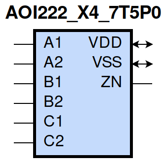
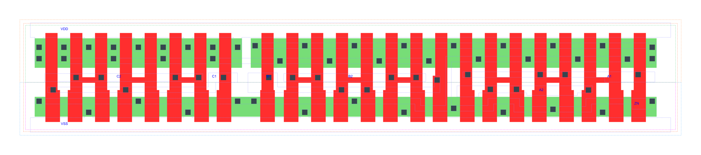

=======================================
gf180mcu_fd_sc_mcu7t5v0__aoi222_x4
=======================================

**gf180mcu_fd_sc_mcu7t5v0__aoi222_x4 symbol**

**gf180mcu_fd_sc_mcu7t5v0__aoi222_x4 schematic**

.. image:: sc7_sch/AOI222_X4_sch.png
    :height: 300px
    :width: 500 px
    :align: center
    :alt: gf180mcu_fd_sc_mcu7t5v0__aoi222_x4 schematic

**gf180mcu_fd_sc_mcu7t5v0__aoi222_x4 layout**

.. include:: images.rst

AOI222_X4 is a three 2-input AND into 3-input NOR, NOR[AND(A1,A2),AND(B1,B2),AND(C1,C2)], 4X drive strength

|
| Attributes

============= =======================
**Attribute** **Value**
area          103.174400 µm\ :sup:`2`
============= =======================

|
| OUTPUT FUNCTIONS

+----------------+-------------------------------------------------------------------------------------------------------------------------------------------------------------------+
| **Output Pin** | **Function**                                                                                                                                                      |
+----------------+-------------------------------------------------------------------------------------------------------------------------------------------------------------------+
| ZN             | (((!A1)&(!B1)&(!C1))|((!A1)&(!B1)&(!C2))|((!A1)&(!B2)&(!C1))|((!A1)&(!B2)&(!C2))|((!A2)&(!B1)&(!C1))|((!A2)&(!B1)&(!C2))|((!A2)&(!B2)&(!C1))|((!A2)&(!B2)&(!C2))) |
+----------------+-------------------------------------------------------------------------------------------------------------------------------------------------------------------+

|
| TRUTH TABLE FOR ZN

====== ====== ====== ====== ====== ====== ======
**A1** **A2** **B1** **B2** **C1** **C2** **ZN**
0      ?      0      ?      0      ?      1
0      ?      0      ?      ?      0      1
0      ?      ?      0      0      ?      1
0      ?      ?      0      ?      0      1
?      0      0      ?      0      ?      1
?      0      0      ?      ?      0      1
?      0      ?      0      0      ?      1
?      0      ?      0      ?      0      1
1      1      ?      ?      ?      ?      0
?      ?      1      1      ?      ?      0
?      ?      ?      ?      1      1      0
====== ====== ====== ====== ====== ====== ======

|
| FUNCTIONAL SCHEMATIC
| |image89|
| PIN CAPACITANCE (pf)

======= ======== ====================
**Pin** **Type** **Capacitance (pf)**
C2      input    0.0185
C1      input    0.0196
B1      input    0.0197
B2      input    0.0184
A2      input    0.0190
A1      input    0.0195
======= ======== ====================

|
| DELAY AND OUTPUT TRANSITION TIME corresponding to min slew and load

+---------------+------------+--------------------+--------------+-------------------+----------------+---------------+
| **Input Pin** | **Output** | **When Condition** | **Tin (ns)** | **Out Load (pf)** | **Delay (ns)** | **Tout (ns)** |
+---------------+------------+--------------------+--------------+-------------------+----------------+---------------+
| C2(LH)        | ZN(HL)     | !A1&!A2&!B1&!B2&C1 | 0.0100       | 0.0010            | 0.1716         | 0.1166        |
+---------------+------------+--------------------+--------------+-------------------+----------------+---------------+
| C2(LH)        | ZN(HL)     | !A1&!A2&!B1&B2&C1  | 0.0100       | 0.0010            | 0.1611         | 0.1089        |
+---------------+------------+--------------------+--------------+-------------------+----------------+---------------+
| C2(LH)        | ZN(HL)     | !A1&!A2&B1&!B2&C1  | 0.0100       | 0.0010            | 0.1740         | 0.1308        |
+---------------+------------+--------------------+--------------+-------------------+----------------+---------------+
| C2(LH)        | ZN(HL)     | !A1&A2&!B1&!B2&C1  | 0.0100       | 0.0010            | 0.1310         | 0.0999        |
+---------------+------------+--------------------+--------------+-------------------+----------------+---------------+
| C2(LH)        | ZN(HL)     | !A1&A2&!B1&B2&C1   | 0.0100       | 0.0010            | 0.1259         | 0.0940        |
+---------------+------------+--------------------+--------------+-------------------+----------------+---------------+
| C2(LH)        | ZN(HL)     | !A1&A2&B1&!B2&C1   | 0.0100       | 0.0010            | 0.1391         | 0.1172        |
+---------------+------------+--------------------+--------------+-------------------+----------------+---------------+
| C2(LH)        | ZN(HL)     | A1&!A2&!B1&!B2&C1  | 0.0100       | 0.0010            | 0.1450         | 0.1241        |
+---------------+------------+--------------------+--------------+-------------------+----------------+---------------+
| C2(LH)        | ZN(HL)     | A1&!A2&!B1&B2&C1   | 0.0100       | 0.0010            | 0.1391         | 0.1172        |
+---------------+------------+--------------------+--------------+-------------------+----------------+---------------+
| C2(LH)        | ZN(HL)     | A1&!A2&B1&!B2&C1   | 0.0100       | 0.0010            | 0.1529         | 0.1397        |
+---------------+------------+--------------------+--------------+-------------------+----------------+---------------+
| C2(HL)        | ZN(LH)     | !A1&!A2&!B1&!B2&C1 | 0.0100       | 0.0010            | 0.2782         | 0.1708        |
+---------------+------------+--------------------+--------------+-------------------+----------------+---------------+
| C2(HL)        | ZN(LH)     | !A1&!A2&!B1&B2&C1  | 0.0100       | 0.0010            | 0.3223         | 0.2104        |
+---------------+------------+--------------------+--------------+-------------------+----------------+---------------+
| C2(HL)        | ZN(LH)     | !A1&!A2&B1&!B2&C1  | 0.0100       | 0.0010            | 0.3694         | 0.2464        |
+---------------+------------+--------------------+--------------+-------------------+----------------+---------------+
| C2(HL)        | ZN(LH)     | !A1&A2&!B1&!B2&C1  | 0.0100       | 0.0010            | 0.3242         | 0.1762        |
+---------------+------------+--------------------+--------------+-------------------+----------------+---------------+
| C2(HL)        | ZN(LH)     | !A1&A2&!B1&B2&C1   | 0.0100       | 0.0010            | 0.3632         | 0.2100        |
+---------------+------------+--------------------+--------------+-------------------+----------------+---------------+
| C2(HL)        | ZN(LH)     | !A1&A2&B1&!B2&C1   | 0.0100       | 0.0010            | 0.4191         | 0.2526        |
+---------------+------------+--------------------+--------------+-------------------+----------------+---------------+
| C2(HL)        | ZN(LH)     | A1&!A2&!B1&!B2&C1  | 0.0100       | 0.0010            | 0.3715         | 0.2113        |
+---------------+------------+--------------------+--------------+-------------------+----------------+---------------+
| C2(HL)        | ZN(LH)     | A1&!A2&!B1&B2&C1   | 0.0100       | 0.0010            | 0.4188         | 0.2524        |
+---------------+------------+--------------------+--------------+-------------------+----------------+---------------+
| C2(HL)        | ZN(LH)     | A1&!A2&B1&!B2&C1   | 0.0100       | 0.0010            | 0.4746         | 0.2956        |
+---------------+------------+--------------------+--------------+-------------------+----------------+---------------+
| C1(LH)        | ZN(HL)     | !A1&!A2&!B1&!B2&C2 | 0.0100       | 0.0010            | 0.1603         | 0.1168        |
+---------------+------------+--------------------+--------------+-------------------+----------------+---------------+
| C1(LH)        | ZN(HL)     | !A1&!A2&!B1&B2&C2  | 0.0100       | 0.0010            | 0.1496         | 0.1092        |
+---------------+------------+--------------------+--------------+-------------------+----------------+---------------+
| C1(LH)        | ZN(HL)     | !A1&!A2&B1&!B2&C2  | 0.0100       | 0.0010            | 0.1625         | 0.1311        |
+---------------+------------+--------------------+--------------+-------------------+----------------+---------------+
| C1(LH)        | ZN(HL)     | !A1&A2&!B1&!B2&C2  | 0.0100       | 0.0010            | 0.1192         | 0.1005        |
+---------------+------------+--------------------+--------------+-------------------+----------------+---------------+
| C1(LH)        | ZN(HL)     | !A1&A2&!B1&B2&C2   | 0.0100       | 0.0010            | 0.1141         | 0.0945        |
+---------------+------------+--------------------+--------------+-------------------+----------------+---------------+
| C1(LH)        | ZN(HL)     | !A1&A2&B1&!B2&C2   | 0.0100       | 0.0010            | 0.1274         | 0.1181        |
+---------------+------------+--------------------+--------------+-------------------+----------------+---------------+
| C1(LH)        | ZN(HL)     | A1&!A2&!B1&!B2&C2  | 0.0100       | 0.0010            | 0.1334         | 0.1248        |
+---------------+------------+--------------------+--------------+-------------------+----------------+---------------+
| C1(LH)        | ZN(HL)     | A1&!A2&!B1&B2&C2   | 0.0100       | 0.0010            | 0.1273         | 0.1180        |
+---------------+------------+--------------------+--------------+-------------------+----------------+---------------+
| C1(LH)        | ZN(HL)     | A1&!A2&B1&!B2&C2   | 0.0100       | 0.0010            | 0.1412         | 0.1403        |
+---------------+------------+--------------------+--------------+-------------------+----------------+---------------+
| C1(HL)        | ZN(LH)     | !A1&!A2&!B1&!B2&C2 | 0.0100       | 0.0010            | 0.2465         | 0.1423        |
+---------------+------------+--------------------+--------------+-------------------+----------------+---------------+
| C1(HL)        | ZN(LH)     | !A1&!A2&!B1&B2&C2  | 0.0100       | 0.0010            | 0.2836         | 0.1743        |
+---------------+------------+--------------------+--------------+-------------------+----------------+---------------+
| C1(HL)        | ZN(LH)     | !A1&!A2&B1&!B2&C2  | 0.0100       | 0.0010            | 0.3321         | 0.2103        |
+---------------+------------+--------------------+--------------+-------------------+----------------+---------------+
| C1(HL)        | ZN(LH)     | !A1&A2&!B1&!B2&C2  | 0.0100       | 0.0010            | 0.2851         | 0.1411        |
+---------------+------------+--------------------+--------------+-------------------+----------------+---------------+
| C1(HL)        | ZN(LH)     | !A1&A2&!B1&B2&C2   | 0.0100       | 0.0010            | 0.3170         | 0.1670        |
+---------------+------------+--------------------+--------------+-------------------+----------------+---------------+
| C1(HL)        | ZN(LH)     | !A1&A2&B1&!B2&C2   | 0.0100       | 0.0010            | 0.3747         | 0.2096        |
+---------------+------------+--------------------+--------------+-------------------+----------------+---------------+
| C1(HL)        | ZN(LH)     | A1&!A2&!B1&!B2&C2  | 0.0100       | 0.0010            | 0.3340         | 0.1752        |
+---------------+------------+--------------------+--------------+-------------------+----------------+---------------+
| C1(HL)        | ZN(LH)     | A1&!A2&!B1&B2&C2   | 0.0100       | 0.0010            | 0.3743         | 0.2093        |
+---------------+------------+--------------------+--------------+-------------------+----------------+---------------+
| C1(HL)        | ZN(LH)     | A1&!A2&B1&!B2&C2   | 0.0100       | 0.0010            | 0.4312         | 0.2523        |
+---------------+------------+--------------------+--------------+-------------------+----------------+---------------+
| B1(LH)        | ZN(HL)     | !A1&!A2&B2&!C1&!C2 | 0.0100       | 0.0010            | 0.1295         | 0.0848        |
+---------------+------------+--------------------+--------------+-------------------+----------------+---------------+
| B1(LH)        | ZN(HL)     | !A1&!A2&B2&!C1&C2  | 0.0100       | 0.0010            | 0.1297         | 0.0854        |
+---------------+------------+--------------------+--------------+-------------------+----------------+---------------+
| B1(LH)        | ZN(HL)     | !A1&!A2&B2&C1&!C2  | 0.0100       | 0.0010            | 0.1397         | 0.1039        |
+---------------+------------+--------------------+--------------+-------------------+----------------+---------------+
| B1(LH)        | ZN(HL)     | !A1&A2&B2&!C1&!C2  | 0.0100       | 0.0010            | 0.1074         | 0.0757        |
+---------------+------------+--------------------+--------------+-------------------+----------------+---------------+
| B1(LH)        | ZN(HL)     | !A1&A2&B2&!C1&C2   | 0.0100       | 0.0010            | 0.1076         | 0.0756        |
+---------------+------------+--------------------+--------------+-------------------+----------------+---------------+
| B1(LH)        | ZN(HL)     | !A1&A2&B2&C1&!C2   | 0.0100       | 0.0010            | 0.1177         | 0.0951        |
+---------------+------------+--------------------+--------------+-------------------+----------------+---------------+
| B1(LH)        | ZN(HL)     | A1&!A2&B2&!C1&!C2  | 0.0100       | 0.0010            | 0.1174         | 0.0951        |
+---------------+------------+--------------------+--------------+-------------------+----------------+---------------+
| B1(LH)        | ZN(HL)     | A1&!A2&B2&!C1&C2   | 0.0100       | 0.0010            | 0.1177         | 0.0953        |
+---------------+------------+--------------------+--------------+-------------------+----------------+---------------+
| B1(LH)        | ZN(HL)     | A1&!A2&B2&C1&!C2   | 0.0100       | 0.0010            | 0.1291         | 0.1146        |
+---------------+------------+--------------------+--------------+-------------------+----------------+---------------+
| B1(HL)        | ZN(LH)     | !A1&!A2&B2&!C1&!C2 | 0.0100       | 0.0010            | 0.1913         | 0.1309        |
+---------------+------------+--------------------+--------------+-------------------+----------------+---------------+
| B1(HL)        | ZN(LH)     | !A1&!A2&B2&!C1&C2  | 0.0100       | 0.0010            | 0.2293         | 0.1736        |
+---------------+------------+--------------------+--------------+-------------------+----------------+---------------+
| B1(HL)        | ZN(LH)     | !A1&!A2&B2&C1&!C2  | 0.0100       | 0.0010            | 0.2776         | 0.2095        |
+---------------+------------+--------------------+--------------+-------------------+----------------+---------------+
| B1(HL)        | ZN(LH)     | !A1&A2&B2&!C1&!C2  | 0.0100       | 0.0010            | 0.2235         | 0.1322        |
+---------------+------------+--------------------+--------------+-------------------+----------------+---------------+
| B1(HL)        | ZN(LH)     | !A1&A2&B2&!C1&C2   | 0.0100       | 0.0010            | 0.2628         | 0.1662        |
+---------------+------------+--------------------+--------------+-------------------+----------------+---------------+
| B1(HL)        | ZN(LH)     | !A1&A2&B2&C1&!C2   | 0.0100       | 0.0010            | 0.3204         | 0.2091        |
+---------------+------------+--------------------+--------------+-------------------+----------------+---------------+
| B1(HL)        | ZN(LH)     | A1&!A2&B2&!C1&!C2  | 0.0100       | 0.0010            | 0.2712         | 0.1675        |
+---------------+------------+--------------------+--------------+-------------------+----------------+---------------+
| B1(HL)        | ZN(LH)     | A1&!A2&B2&!C1&C2   | 0.0100       | 0.0010            | 0.3203         | 0.2092        |
+---------------+------------+--------------------+--------------+-------------------+----------------+---------------+
| B1(HL)        | ZN(LH)     | A1&!A2&B2&C1&!C2   | 0.0100       | 0.0010            | 0.3767         | 0.2520        |
+---------------+------------+--------------------+--------------+-------------------+----------------+---------------+
| B2(HL)        | ZN(LH)     | !A1&!A2&B1&!C1&!C2 | 0.0100       | 0.0010            | 0.2223         | 0.1598        |
+---------------+------------+--------------------+--------------+-------------------+----------------+---------------+
| B2(HL)        | ZN(LH)     | !A1&!A2&B1&!C1&C2  | 0.0100       | 0.0010            | 0.2681         | 0.2100        |
+---------------+------------+--------------------+--------------+-------------------+----------------+---------------+
| B2(HL)        | ZN(LH)     | !A1&!A2&B1&C1&!C2  | 0.0100       | 0.0010            | 0.3151         | 0.2461        |
+---------------+------------+--------------------+--------------+-------------------+----------------+---------------+
| B2(HL)        | ZN(LH)     | !A1&A2&B1&!C1&!C2  | 0.0100       | 0.0010            | 0.2619         | 0.1680        |
+---------------+------------+--------------------+--------------+-------------------+----------------+---------------+
| B2(HL)        | ZN(LH)     | !A1&A2&B1&!C1&C2   | 0.0100       | 0.0010            | 0.3092         | 0.2097        |
+---------------+------------+--------------------+--------------+-------------------+----------------+---------------+
| B2(HL)        | ZN(LH)     | !A1&A2&B1&C1&!C2   | 0.0100       | 0.0010            | 0.3647         | 0.2525        |
+---------------+------------+--------------------+--------------+-------------------+----------------+---------------+
| B2(HL)        | ZN(LH)     | A1&!A2&B1&!C1&!C2  | 0.0100       | 0.0010            | 0.3084         | 0.2039        |
+---------------+------------+--------------------+--------------+-------------------+----------------+---------------+
| B2(HL)        | ZN(LH)     | A1&!A2&B1&!C1&C2   | 0.0100       | 0.0010            | 0.3647         | 0.2524        |
+---------------+------------+--------------------+--------------+-------------------+----------------+---------------+
| B2(HL)        | ZN(LH)     | A1&!A2&B1&C1&!C2   | 0.0100       | 0.0010            | 0.4202         | 0.2956        |
+---------------+------------+--------------------+--------------+-------------------+----------------+---------------+
| B2(LH)        | ZN(HL)     | !A1&!A2&B1&!C1&!C2 | 0.0100       | 0.0010            | 0.1409         | 0.0852        |
+---------------+------------+--------------------+--------------+-------------------+----------------+---------------+
| B2(LH)        | ZN(HL)     | !A1&!A2&B1&!C1&C2  | 0.0100       | 0.0010            | 0.1414         | 0.0849        |
+---------------+------------+--------------------+--------------+-------------------+----------------+---------------+
| B2(LH)        | ZN(HL)     | !A1&!A2&B1&C1&!C2  | 0.0100       | 0.0010            | 0.1512         | 0.1037        |
+---------------+------------+--------------------+--------------+-------------------+----------------+---------------+
| B2(LH)        | ZN(HL)     | !A1&A2&B1&!C1&!C2  | 0.0100       | 0.0010            | 0.1190         | 0.0752        |
+---------------+------------+--------------------+--------------+-------------------+----------------+---------------+
| B2(LH)        | ZN(HL)     | !A1&A2&B1&!C1&C2   | 0.0100       | 0.0010            | 0.1193         | 0.0755        |
+---------------+------------+--------------------+--------------+-------------------+----------------+---------------+
| B2(LH)        | ZN(HL)     | !A1&A2&B1&C1&!C2   | 0.0100       | 0.0010            | 0.1292         | 0.0950        |
+---------------+------------+--------------------+--------------+-------------------+----------------+---------------+
| B2(LH)        | ZN(HL)     | A1&!A2&B1&!C1&!C2  | 0.0100       | 0.0010            | 0.1290         | 0.0949        |
+---------------+------------+--------------------+--------------+-------------------+----------------+---------------+
| B2(LH)        | ZN(HL)     | A1&!A2&B1&!C1&C2   | 0.0100       | 0.0010            | 0.1292         | 0.0949        |
+---------------+------------+--------------------+--------------+-------------------+----------------+---------------+
| B2(LH)        | ZN(HL)     | A1&!A2&B1&C1&!C2   | 0.0100       | 0.0010            | 0.1406         | 0.1140        |
+---------------+------------+--------------------+--------------+-------------------+----------------+---------------+
| A2(HL)        | ZN(LH)     | A1&!B1&!B2&!C1&!C2 | 0.0100       | 0.0010            | 0.1427         | 0.1267        |
+---------------+------------+--------------------+--------------+-------------------+----------------+---------------+
| A2(HL)        | ZN(LH)     | A1&!B1&!B2&!C1&C2  | 0.0100       | 0.0010            | 0.1561         | 0.1577        |
+---------------+------------+--------------------+--------------+-------------------+----------------+---------------+
| A2(HL)        | ZN(LH)     | A1&!B1&!B2&C1&!C2  | 0.0100       | 0.0010            | 0.2002         | 0.1987        |
+---------------+------------+--------------------+--------------+-------------------+----------------+---------------+
| A2(HL)        | ZN(LH)     | A1&!B1&B2&!C1&!C2  | 0.0100       | 0.0010            | 0.1718         | 0.1630        |
+---------------+------------+--------------------+--------------+-------------------+----------------+---------------+
| A2(HL)        | ZN(LH)     | A1&!B1&B2&!C1&C2   | 0.0100       | 0.0010            | 0.1870         | 0.1978        |
+---------------+------------+--------------------+--------------+-------------------+----------------+---------------+
| A2(HL)        | ZN(LH)     | A1&!B1&B2&C1&!C2   | 0.0100       | 0.0010            | 0.2412         | 0.2454        |
+---------------+------------+--------------------+--------------+-------------------+----------------+---------------+
| A2(HL)        | ZN(LH)     | A1&B1&!B2&!C1&!C2  | 0.0100       | 0.0010            | 0.2181         | 0.2012        |
+---------------+------------+--------------------+--------------+-------------------+----------------+---------------+
| A2(HL)        | ZN(LH)     | A1&B1&!B2&!C1&C2   | 0.0100       | 0.0010            | 0.2414         | 0.2456        |
+---------------+------------+--------------------+--------------+-------------------+----------------+---------------+
| A2(HL)        | ZN(LH)     | A1&B1&!B2&C1&!C2   | 0.0100       | 0.0010            | 0.2965         | 0.2915        |
+---------------+------------+--------------------+--------------+-------------------+----------------+---------------+
| A2(LH)        | ZN(HL)     | A1&!B1&!B2&!C1&!C2 | 0.0100       | 0.0010            | 0.0845         | 0.0459        |
+---------------+------------+--------------------+--------------+-------------------+----------------+---------------+
| A2(LH)        | ZN(HL)     | A1&!B1&!B2&!C1&C2  | 0.0100       | 0.0010            | 0.0845         | 0.0459        |
+---------------+------------+--------------------+--------------+-------------------+----------------+---------------+
| A2(LH)        | ZN(HL)     | A1&!B1&!B2&C1&!C2  | 0.0100       | 0.0010            | 0.0901         | 0.0624        |
+---------------+------------+--------------------+--------------+-------------------+----------------+---------------+
| A2(LH)        | ZN(HL)     | A1&!B1&B2&!C1&!C2  | 0.0100       | 0.0010            | 0.0847         | 0.0459        |
+---------------+------------+--------------------+--------------+-------------------+----------------+---------------+
| A2(LH)        | ZN(HL)     | A1&!B1&B2&!C1&C2   | 0.0100       | 0.0010            | 0.0847         | 0.0459        |
+---------------+------------+--------------------+--------------+-------------------+----------------+---------------+
| A2(LH)        | ZN(HL)     | A1&!B1&B2&C1&!C2   | 0.0100       | 0.0010            | 0.0902         | 0.0624        |
+---------------+------------+--------------------+--------------+-------------------+----------------+---------------+
| A2(LH)        | ZN(HL)     | A1&B1&!B2&!C1&!C2  | 0.0100       | 0.0010            | 0.0903         | 0.0625        |
+---------------+------------+--------------------+--------------+-------------------+----------------+---------------+
| A2(LH)        | ZN(HL)     | A1&B1&!B2&!C1&C2   | 0.0100       | 0.0010            | 0.0903         | 0.0624        |
+---------------+------------+--------------------+--------------+-------------------+----------------+---------------+
| A2(LH)        | ZN(HL)     | A1&B1&!B2&C1&!C2   | 0.0100       | 0.0010            | 0.0979         | 0.0793        |
+---------------+------------+--------------------+--------------+-------------------+----------------+---------------+
| A1(HL)        | ZN(LH)     | A2&!B1&!B2&!C1&!C2 | 0.0100       | 0.0010            | 0.1135         | 0.0963        |
+---------------+------------+--------------------+--------------+-------------------+----------------+---------------+
| A1(HL)        | ZN(LH)     | A2&!B1&!B2&!C1&C2  | 0.0100       | 0.0010            | 0.1217         | 0.1176        |
+---------------+------------+--------------------+--------------+-------------------+----------------+---------------+
| A1(HL)        | ZN(LH)     | A2&!B1&!B2&C1&!C2  | 0.0100       | 0.0010            | 0.1652         | 0.1597        |
+---------------+------------+--------------------+--------------+-------------------+----------------+---------------+
| A1(HL)        | ZN(LH)     | A2&!B1&B2&!C1&!C2  | 0.0100       | 0.0010            | 0.1351         | 0.1248        |
+---------------+------------+--------------------+--------------+-------------------+----------------+---------------+
| A1(HL)        | ZN(LH)     | A2&!B1&B2&!C1&C2   | 0.0100       | 0.0010            | 0.1441         | 0.1498        |
+---------------+------------+--------------------+--------------+-------------------+----------------+---------------+
| A1(HL)        | ZN(LH)     | A2&!B1&B2&C1&!C2   | 0.0100       | 0.0010            | 0.1981         | 0.1993        |
+---------------+------------+--------------------+--------------+-------------------+----------------+---------------+
| A1(HL)        | ZN(LH)     | A2&B1&!B2&!C1&!C2  | 0.0100       | 0.0010            | 0.1814         | 0.1639        |
+---------------+------------+--------------------+--------------+-------------------+----------------+---------------+
| A1(HL)        | ZN(LH)     | A2&B1&!B2&!C1&C2   | 0.0100       | 0.0010            | 0.1983         | 0.1993        |
+---------------+------------+--------------------+--------------+-------------------+----------------+---------------+
| A1(HL)        | ZN(LH)     | A2&B1&!B2&C1&!C2   | 0.0100       | 0.0010            | 0.2538         | 0.2466        |
+---------------+------------+--------------------+--------------+-------------------+----------------+---------------+
| A1(LH)        | ZN(HL)     | A2&!B1&!B2&!C1&!C2 | 0.0100       | 0.0010            | 0.0731         | 0.0460        |
+---------------+------------+--------------------+--------------+-------------------+----------------+---------------+
| A1(LH)        | ZN(HL)     | A2&!B1&!B2&!C1&C2  | 0.0100       | 0.0010            | 0.0731         | 0.0460        |
+---------------+------------+--------------------+--------------+-------------------+----------------+---------------+
| A1(LH)        | ZN(HL)     | A2&!B1&!B2&C1&!C2  | 0.0100       | 0.0010            | 0.0786         | 0.0623        |
+---------------+------------+--------------------+--------------+-------------------+----------------+---------------+
| A1(LH)        | ZN(HL)     | A2&!B1&B2&!C1&!C2  | 0.0100       | 0.0010            | 0.0733         | 0.0460        |
+---------------+------------+--------------------+--------------+-------------------+----------------+---------------+
| A1(LH)        | ZN(HL)     | A2&!B1&B2&!C1&C2   | 0.0100       | 0.0010            | 0.0733         | 0.0460        |
+---------------+------------+--------------------+--------------+-------------------+----------------+---------------+
| A1(LH)        | ZN(HL)     | A2&!B1&B2&C1&!C2   | 0.0100       | 0.0010            | 0.0787         | 0.0624        |
+---------------+------------+--------------------+--------------+-------------------+----------------+---------------+
| A1(LH)        | ZN(HL)     | A2&B1&!B2&!C1&!C2  | 0.0100       | 0.0010            | 0.0788         | 0.0624        |
+---------------+------------+--------------------+--------------+-------------------+----------------+---------------+
| A1(LH)        | ZN(HL)     | A2&B1&!B2&!C1&C2   | 0.0100       | 0.0010            | 0.0788         | 0.0624        |
+---------------+------------+--------------------+--------------+-------------------+----------------+---------------+
| A1(LH)        | ZN(HL)     | A2&B1&!B2&C1&!C2   | 0.0100       | 0.0010            | 0.0864         | 0.0793        |
+---------------+------------+--------------------+--------------+-------------------+----------------+---------------+

|
| DYNAMIC ENERGY

+---------------+---------------------+--------------+------------+-------------------+---------------------+
| **Input Pin** | **When Condition**  | **Tin (ns)** | **Output** | **Out Load (pf)** | **Energy (uW/MHz)** |
+---------------+---------------------+--------------+------------+-------------------+---------------------+
| A1            | A2&!B1&!B2&!C1&!C2  | 0.0100       | ZN(LH)     | 0.0010            | 0.6808              |
+---------------+---------------------+--------------+------------+-------------------+---------------------+
| A1            | A2&!B1&!B2&!C1&C2   | 0.0100       | ZN(LH)     | 0.0010            | 0.6815              |
+---------------+---------------------+--------------+------------+-------------------+---------------------+
| A1            | A2&!B1&!B2&C1&!C2   | 0.0100       | ZN(LH)     | 0.0010            | 0.8499              |
+---------------+---------------------+--------------+------------+-------------------+---------------------+
| A1            | A2&!B1&B2&!C1&!C2   | 0.0100       | ZN(LH)     | 0.0010            | 0.6806              |
+---------------+---------------------+--------------+------------+-------------------+---------------------+
| A1            | A2&!B1&B2&!C1&C2    | 0.0100       | ZN(LH)     | 0.0010            | 0.6809              |
+---------------+---------------------+--------------+------------+-------------------+---------------------+
| A1            | A2&!B1&B2&C1&!C2    | 0.0100       | ZN(LH)     | 0.0010            | 0.8494              |
+---------------+---------------------+--------------+------------+-------------------+---------------------+
| A1            | A2&B1&!B2&!C1&!C2   | 0.0100       | ZN(LH)     | 0.0010            | 0.8500              |
+---------------+---------------------+--------------+------------+-------------------+---------------------+
| A1            | A2&B1&!B2&!C1&C2    | 0.0100       | ZN(LH)     | 0.0010            | 0.8503              |
+---------------+---------------------+--------------+------------+-------------------+---------------------+
| A1            | A2&B1&!B2&C1&!C2    | 0.0100       | ZN(LH)     | 0.0010            | 1.0174              |
+---------------+---------------------+--------------+------------+-------------------+---------------------+
| B2            | !A1&!A2&B1&!C1&!C2  | 0.0100       | ZN(LH)     | 0.0010            | 1.1563              |
+---------------+---------------------+--------------+------------+-------------------+---------------------+
| B2            | !A1&!A2&B1&!C1&C2   | 0.0100       | ZN(LH)     | 0.0010            | 1.1561              |
+---------------+---------------------+--------------+------------+-------------------+---------------------+
| B2            | !A1&!A2&B1&C1&!C2   | 0.0100       | ZN(LH)     | 0.0010            | 1.3214              |
+---------------+---------------------+--------------+------------+-------------------+---------------------+
| B2            | !A1&A2&B1&!C1&!C2   | 0.0100       | ZN(LH)     | 0.0010            | 1.0683              |
+---------------+---------------------+--------------+------------+-------------------+---------------------+
| B2            | !A1&A2&B1&!C1&C2    | 0.0100       | ZN(LH)     | 0.0010            | 1.0681              |
+---------------+---------------------+--------------+------------+-------------------+---------------------+
| B2            | !A1&A2&B1&C1&!C2    | 0.0100       | ZN(LH)     | 0.0010            | 1.2333              |
+---------------+---------------------+--------------+------------+-------------------+---------------------+
| B2            | A1&!A2&B1&!C1&!C2   | 0.0100       | ZN(LH)     | 0.0010            | 1.2333              |
+---------------+---------------------+--------------+------------+-------------------+---------------------+
| B2            | A1&!A2&B1&!C1&C2    | 0.0100       | ZN(LH)     | 0.0010            | 1.2332              |
+---------------+---------------------+--------------+------------+-------------------+---------------------+
| B2            | A1&!A2&B1&C1&!C2    | 0.0100       | ZN(LH)     | 0.0010            | 1.3981              |
+---------------+---------------------+--------------+------------+-------------------+---------------------+
| B1            | !A1&!A2&B2&!C1&!C2  | 0.0100       | ZN(HL)     | 0.0010            | 0.2260              |
+---------------+---------------------+--------------+------------+-------------------+---------------------+
| B1            | !A1&!A2&B2&!C1&C2   | 0.0100       | ZN(HL)     | 0.0010            | 0.2279              |
+---------------+---------------------+--------------+------------+-------------------+---------------------+
| B1            | !A1&!A2&B2&C1&!C2   | 0.0100       | ZN(HL)     | 0.0010            | 0.2283              |
+---------------+---------------------+--------------+------------+-------------------+---------------------+
| B1            | !A1&A2&B2&!C1&!C2   | 0.0100       | ZN(HL)     | 0.0010            | 0.2000              |
+---------------+---------------------+--------------+------------+-------------------+---------------------+
| B1            | !A1&A2&B2&!C1&C2    | 0.0100       | ZN(HL)     | 0.0010            | 0.2020              |
+---------------+---------------------+--------------+------------+-------------------+---------------------+
| B1            | !A1&A2&B2&C1&!C2    | 0.0100       | ZN(HL)     | 0.0010            | 0.2022              |
+---------------+---------------------+--------------+------------+-------------------+---------------------+
| B1            | A1&!A2&B2&!C1&!C2   | 0.0100       | ZN(HL)     | 0.0010            | 0.2002              |
+---------------+---------------------+--------------+------------+-------------------+---------------------+
| B1            | A1&!A2&B2&!C1&C2    | 0.0100       | ZN(HL)     | 0.0010            | 0.2023              |
+---------------+---------------------+--------------+------------+-------------------+---------------------+
| B1            | A1&!A2&B2&C1&!C2    | 0.0100       | ZN(HL)     | 0.0010            | 0.2023              |
+---------------+---------------------+--------------+------------+-------------------+---------------------+
| A2            | A1&!B1&!B2&!C1&!C2  | 0.0100       | ZN(LH)     | 0.0010            | 0.8246              |
+---------------+---------------------+--------------+------------+-------------------+---------------------+
| A2            | A1&!B1&!B2&!C1&C2   | 0.0100       | ZN(LH)     | 0.0010            | 0.8251              |
+---------------+---------------------+--------------+------------+-------------------+---------------------+
| A2            | A1&!B1&!B2&C1&!C2   | 0.0100       | ZN(LH)     | 0.0010            | 0.9905              |
+---------------+---------------------+--------------+------------+-------------------+---------------------+
| A2            | A1&!B1&B2&!C1&!C2   | 0.0100       | ZN(LH)     | 0.0010            | 0.8246              |
+---------------+---------------------+--------------+------------+-------------------+---------------------+
| A2            | A1&!B1&B2&!C1&C2    | 0.0100       | ZN(LH)     | 0.0010            | 0.8247              |
+---------------+---------------------+--------------+------------+-------------------+---------------------+
| A2            | A1&!B1&B2&C1&!C2    | 0.0100       | ZN(LH)     | 0.0010            | 0.9900              |
+---------------+---------------------+--------------+------------+-------------------+---------------------+
| A2            | A1&B1&!B2&!C1&!C2   | 0.0100       | ZN(LH)     | 0.0010            | 0.9904              |
+---------------+---------------------+--------------+------------+-------------------+---------------------+
| A2            | A1&B1&!B2&!C1&C2    | 0.0100       | ZN(LH)     | 0.0010            | 0.9908              |
+---------------+---------------------+--------------+------------+-------------------+---------------------+
| A2            | A1&B1&!B2&C1&!C2    | 0.0100       | ZN(LH)     | 0.0010            | 1.1562              |
+---------------+---------------------+--------------+------------+-------------------+---------------------+
| B1            | !A1&!A2&B2&!C1&!C2  | 0.0100       | ZN(LH)     | 0.0010            | 1.0112              |
+---------------+---------------------+--------------+------------+-------------------+---------------------+
| B1            | !A1&!A2&B2&!C1&C2   | 0.0100       | ZN(LH)     | 0.0010            | 1.0108              |
+---------------+---------------------+--------------+------------+-------------------+---------------------+
| B1            | !A1&!A2&B2&C1&!C2   | 0.0100       | ZN(LH)     | 0.0010            | 1.1797              |
+---------------+---------------------+--------------+------------+-------------------+---------------------+
| B1            | !A1&A2&B2&!C1&!C2   | 0.0100       | ZN(LH)     | 0.0010            | 0.9224              |
+---------------+---------------------+--------------+------------+-------------------+---------------------+
| B1            | !A1&A2&B2&!C1&C2    | 0.0100       | ZN(LH)     | 0.0010            | 0.9223              |
+---------------+---------------------+--------------+------------+-------------------+---------------------+
| B1            | !A1&A2&B2&C1&!C2    | 0.0100       | ZN(LH)     | 0.0010            | 1.0912              |
+---------------+---------------------+--------------+------------+-------------------+---------------------+
| B1            | A1&!A2&B2&!C1&!C2   | 0.0100       | ZN(LH)     | 0.0010            | 1.0915              |
+---------------+---------------------+--------------+------------+-------------------+---------------------+
| B1            | A1&!A2&B2&!C1&C2    | 0.0100       | ZN(LH)     | 0.0010            | 1.0913              |
+---------------+---------------------+--------------+------------+-------------------+---------------------+
| B1            | A1&!A2&B2&C1&!C2    | 0.0100       | ZN(LH)     | 0.0010            | 1.2582              |
+---------------+---------------------+--------------+------------+-------------------+---------------------+
| C1            | !A1&!A2&!B1&!B2&C2  | 0.0100       | ZN(HL)     | 0.0010            | 0.4145              |
+---------------+---------------------+--------------+------------+-------------------+---------------------+
| C1            | !A1&!A2&!B1&B2&C2   | 0.0100       | ZN(HL)     | 0.0010            | 0.3886              |
+---------------+---------------------+--------------+------------+-------------------+---------------------+
| C1            | !A1&!A2&B1&!B2&C2   | 0.0100       | ZN(HL)     | 0.0010            | 0.3889              |
+---------------+---------------------+--------------+------------+-------------------+---------------------+
| C1            | !A1&A2&!B1&!B2&C2   | 0.0100       | ZN(HL)     | 0.0010            | 0.3892              |
+---------------+---------------------+--------------+------------+-------------------+---------------------+
| C1            | !A1&A2&!B1&B2&C2    | 0.0100       | ZN(HL)     | 0.0010            | 0.3634              |
+---------------+---------------------+--------------+------------+-------------------+---------------------+
| C1            | !A1&A2&B1&!B2&C2    | 0.0100       | ZN(HL)     | 0.0010            | 0.3637              |
+---------------+---------------------+--------------+------------+-------------------+---------------------+
| C1            | A1&!A2&!B1&!B2&C2   | 0.0100       | ZN(HL)     | 0.0010            | 0.3893              |
+---------------+---------------------+--------------+------------+-------------------+---------------------+
| C1            | A1&!A2&!B1&B2&C2    | 0.0100       | ZN(HL)     | 0.0010            | 0.3637              |
+---------------+---------------------+--------------+------------+-------------------+---------------------+
| C1            | A1&!A2&B1&!B2&C2    | 0.0100       | ZN(HL)     | 0.0010            | 0.3635              |
+---------------+---------------------+--------------+------------+-------------------+---------------------+
| A2            | A1&!B1&!B2&!C1&!C2  | 0.0100       | ZN(HL)     | 0.0010            | 0.0152              |
+---------------+---------------------+--------------+------------+-------------------+---------------------+
| A2            | A1&!B1&!B2&!C1&C2   | 0.0100       | ZN(HL)     | 0.0010            | 0.0152              |
+---------------+---------------------+--------------+------------+-------------------+---------------------+
| A2            | A1&!B1&!B2&C1&!C2   | 0.0100       | ZN(HL)     | 0.0010            | 0.0153              |
+---------------+---------------------+--------------+------------+-------------------+---------------------+
| A2            | A1&!B1&B2&!C1&!C2   | 0.0100       | ZN(HL)     | 0.0010            | 0.0165              |
+---------------+---------------------+--------------+------------+-------------------+---------------------+
| A2            | A1&!B1&B2&!C1&C2    | 0.0100       | ZN(HL)     | 0.0010            | 0.0165              |
+---------------+---------------------+--------------+------------+-------------------+---------------------+
| A2            | A1&!B1&B2&C1&!C2    | 0.0100       | ZN(HL)     | 0.0010            | 0.0166              |
+---------------+---------------------+--------------+------------+-------------------+---------------------+
| A2            | A1&B1&!B2&!C1&!C2   | 0.0100       | ZN(HL)     | 0.0010            | 0.0166              |
+---------------+---------------------+--------------+------------+-------------------+---------------------+
| A2            | A1&B1&!B2&!C1&C2    | 0.0100       | ZN(HL)     | 0.0010            | 0.0166              |
+---------------+---------------------+--------------+------------+-------------------+---------------------+
| A2            | A1&B1&!B2&C1&!C2    | 0.0100       | ZN(HL)     | 0.0010            | 0.0166              |
+---------------+---------------------+--------------+------------+-------------------+---------------------+
| C2            | !A1&!A2&!B1&!B2&C1  | 0.0100       | ZN(HL)     | 0.0010            | 0.4145              |
+---------------+---------------------+--------------+------------+-------------------+---------------------+
| C2            | !A1&!A2&!B1&B2&C1   | 0.0100       | ZN(HL)     | 0.0010            | 0.3885              |
+---------------+---------------------+--------------+------------+-------------------+---------------------+
| C2            | !A1&!A2&B1&!B2&C1   | 0.0100       | ZN(HL)     | 0.0010            | 0.3886              |
+---------------+---------------------+--------------+------------+-------------------+---------------------+
| C2            | !A1&A2&!B1&!B2&C1   | 0.0100       | ZN(HL)     | 0.0010            | 0.3891              |
+---------------+---------------------+--------------+------------+-------------------+---------------------+
| C2            | !A1&A2&!B1&B2&C1    | 0.0100       | ZN(HL)     | 0.0010            | 0.3633              |
+---------------+---------------------+--------------+------------+-------------------+---------------------+
| C2            | !A1&A2&B1&!B2&C1    | 0.0100       | ZN(HL)     | 0.0010            | 0.3635              |
+---------------+---------------------+--------------+------------+-------------------+---------------------+
| C2            | A1&!A2&!B1&!B2&C1   | 0.0100       | ZN(HL)     | 0.0010            | 0.3892              |
+---------------+---------------------+--------------+------------+-------------------+---------------------+
| C2            | A1&!A2&!B1&B2&C1    | 0.0100       | ZN(HL)     | 0.0010            | 0.3635              |
+---------------+---------------------+--------------+------------+-------------------+---------------------+
| C2            | A1&!A2&B1&!B2&C1    | 0.0100       | ZN(HL)     | 0.0010            | 0.3634              |
+---------------+---------------------+--------------+------------+-------------------+---------------------+
| C1            | !A1&!A2&!B1&!B2&C2  | 0.0100       | ZN(LH)     | 0.0010            | 1.3198              |
+---------------+---------------------+--------------+------------+-------------------+---------------------+
| C1            | !A1&!A2&!B1&B2&C2   | 0.0100       | ZN(LH)     | 0.0010            | 1.2334              |
+---------------+---------------------+--------------+------------+-------------------+---------------------+
| C1            | !A1&!A2&B1&!B2&C2   | 0.0100       | ZN(LH)     | 0.0010            | 1.4035              |
+---------------+---------------------+--------------+------------+-------------------+---------------------+
| C1            | !A1&A2&!B1&!B2&C2   | 0.0100       | ZN(LH)     | 0.0010            | 1.2313              |
+---------------+---------------------+--------------+------------+-------------------+---------------------+
| C1            | !A1&A2&!B1&B2&C2    | 0.0100       | ZN(LH)     | 0.0010            | 1.1449              |
+---------------+---------------------+--------------+------------+-------------------+---------------------+
| C1            | !A1&A2&B1&!B2&C2    | 0.0100       | ZN(LH)     | 0.0010            | 1.3154              |
+---------------+---------------------+--------------+------------+-------------------+---------------------+
| C1            | A1&!A2&!B1&!B2&C2   | 0.0100       | ZN(LH)     | 0.0010            | 1.4005              |
+---------------+---------------------+--------------+------------+-------------------+---------------------+
| C1            | A1&!A2&!B1&B2&C2    | 0.0100       | ZN(LH)     | 0.0010            | 1.3142              |
+---------------+---------------------+--------------+------------+-------------------+---------------------+
| C1            | A1&!A2&B1&!B2&C2    | 0.0100       | ZN(LH)     | 0.0010            | 1.4822              |
+---------------+---------------------+--------------+------------+-------------------+---------------------+
| C2            | !A1&!A2&!B1&!B2&C1  | 0.0100       | ZN(LH)     | 0.0010            | 1.4657              |
+---------------+---------------------+--------------+------------+-------------------+---------------------+
| C2            | !A1&!A2&!B1&B2&C1   | 0.0100       | ZN(LH)     | 0.0010            | 1.3789              |
+---------------+---------------------+--------------+------------+-------------------+---------------------+
| C2            | !A1&!A2&B1&!B2&C1   | 0.0100       | ZN(LH)     | 0.0010            | 1.5450              |
+---------------+---------------------+--------------+------------+-------------------+---------------------+
| C2            | !A1&A2&!B1&!B2&C1   | 0.0100       | ZN(LH)     | 0.0010            | 1.3772              |
+---------------+---------------------+--------------+------------+-------------------+---------------------+
| C2            | !A1&A2&!B1&B2&C1    | 0.0100       | ZN(LH)     | 0.0010            | 1.2908              |
+---------------+---------------------+--------------+------------+-------------------+---------------------+
| C2            | !A1&A2&B1&!B2&C1    | 0.0100       | ZN(LH)     | 0.0010            | 1.4567              |
+---------------+---------------------+--------------+------------+-------------------+---------------------+
| C2            | A1&!A2&!B1&!B2&C1   | 0.0100       | ZN(LH)     | 0.0010            | 1.5423              |
+---------------+---------------------+--------------+------------+-------------------+---------------------+
| C2            | A1&!A2&!B1&B2&C1    | 0.0100       | ZN(LH)     | 0.0010            | 1.4557              |
+---------------+---------------------+--------------+------------+-------------------+---------------------+
| C2            | A1&!A2&B1&!B2&C1    | 0.0100       | ZN(LH)     | 0.0010            | 1.6216              |
+---------------+---------------------+--------------+------------+-------------------+---------------------+
| A1            | A2&!B1&!B2&!C1&!C2  | 0.0100       | ZN(HL)     | 0.0010            | 0.0153              |
+---------------+---------------------+--------------+------------+-------------------+---------------------+
| A1            | A2&!B1&!B2&!C1&C2   | 0.0100       | ZN(HL)     | 0.0010            | 0.0153              |
+---------------+---------------------+--------------+------------+-------------------+---------------------+
| A1            | A2&!B1&!B2&C1&!C2   | 0.0100       | ZN(HL)     | 0.0010            | 0.0151              |
+---------------+---------------------+--------------+------------+-------------------+---------------------+
| A1            | A2&!B1&B2&!C1&!C2   | 0.0100       | ZN(HL)     | 0.0010            | 0.0167              |
+---------------+---------------------+--------------+------------+-------------------+---------------------+
| A1            | A2&!B1&B2&!C1&C2    | 0.0100       | ZN(HL)     | 0.0010            | 0.0167              |
+---------------+---------------------+--------------+------------+-------------------+---------------------+
| A1            | A2&!B1&B2&C1&!C2    | 0.0100       | ZN(HL)     | 0.0010            | 0.0166              |
+---------------+---------------------+--------------+------------+-------------------+---------------------+
| A1            | A2&B1&!B2&!C1&!C2   | 0.0100       | ZN(HL)     | 0.0010            | 0.0166              |
+---------------+---------------------+--------------+------------+-------------------+---------------------+
| A1            | A2&B1&!B2&!C1&C2    | 0.0100       | ZN(HL)     | 0.0010            | 0.0166              |
+---------------+---------------------+--------------+------------+-------------------+---------------------+
| A1            | A2&B1&!B2&C1&!C2    | 0.0100       | ZN(HL)     | 0.0010            | 0.0166              |
+---------------+---------------------+--------------+------------+-------------------+---------------------+
| B2            | !A1&!A2&B1&!C1&!C2  | 0.0100       | ZN(HL)     | 0.0010            | 0.2261              |
+---------------+---------------------+--------------+------------+-------------------+---------------------+
| B2            | !A1&!A2&B1&!C1&C2   | 0.0100       | ZN(HL)     | 0.0010            | 0.2277              |
+---------------+---------------------+--------------+------------+-------------------+---------------------+
| B2            | !A1&!A2&B1&C1&!C2   | 0.0100       | ZN(HL)     | 0.0010            | 0.2281              |
+---------------+---------------------+--------------+------------+-------------------+---------------------+
| B2            | !A1&A2&B1&!C1&!C2   | 0.0100       | ZN(HL)     | 0.0010            | 0.2002              |
+---------------+---------------------+--------------+------------+-------------------+---------------------+
| B2            | !A1&A2&B1&!C1&C2    | 0.0100       | ZN(HL)     | 0.0010            | 0.2017              |
+---------------+---------------------+--------------+------------+-------------------+---------------------+
| B2            | !A1&A2&B1&C1&!C2    | 0.0100       | ZN(HL)     | 0.0010            | 0.2020              |
+---------------+---------------------+--------------+------------+-------------------+---------------------+
| B2            | A1&!A2&B1&!C1&!C2   | 0.0100       | ZN(HL)     | 0.0010            | 0.2004              |
+---------------+---------------------+--------------+------------+-------------------+---------------------+
| B2            | A1&!A2&B1&!C1&C2    | 0.0100       | ZN(HL)     | 0.0010            | 0.2021              |
+---------------+---------------------+--------------+------------+-------------------+---------------------+
| B2            | A1&!A2&B1&C1&!C2    | 0.0100       | ZN(HL)     | 0.0010            | 0.2019              |
+---------------+---------------------+--------------+------------+-------------------+---------------------+
| B2(LH)        | !A1&!A2&!B1&!C1&!C2 | 0.0100       | n/a        | n/a               | -0.1579             |
+---------------+---------------------+--------------+------------+-------------------+---------------------+
| B2(LH)        | !A1&!A2&!B1&!C1&C2  | 0.0100       | n/a        | n/a               | -0.1578             |
+---------------+---------------------+--------------+------------+-------------------+---------------------+
| B2(LH)        | !A1&!A2&!B1&C1&!C2  | 0.0100       | n/a        | n/a               | -0.1578             |
+---------------+---------------------+--------------+------------+-------------------+---------------------+
| B2(LH)        | !A1&A2&!B1&!C1&!C2  | 0.0100       | n/a        | n/a               | -0.1577             |
+---------------+---------------------+--------------+------------+-------------------+---------------------+
| B2(LH)        | !A1&A2&!B1&!C1&C2   | 0.0100       | n/a        | n/a               | -0.1577             |
+---------------+---------------------+--------------+------------+-------------------+---------------------+
| B2(LH)        | !A1&A2&!B1&C1&!C2   | 0.0100       | n/a        | n/a               | -0.1577             |
+---------------+---------------------+--------------+------------+-------------------+---------------------+
| B2(LH)        | A1&!A2&!B1&!C1&!C2  | 0.0100       | n/a        | n/a               | -0.1577             |
+---------------+---------------------+--------------+------------+-------------------+---------------------+
| B2(LH)        | A1&!A2&!B1&!C1&C2   | 0.0100       | n/a        | n/a               | -0.1577             |
+---------------+---------------------+--------------+------------+-------------------+---------------------+
| B2(LH)        | A1&!A2&!B1&C1&!C2   | 0.0100       | n/a        | n/a               | -0.1577             |
+---------------+---------------------+--------------+------------+-------------------+---------------------+
| B2(LH)        | !A1&!A2&!B1&C1&C2   | 0.0100       | n/a        | n/a               | -0.0454             |
+---------------+---------------------+--------------+------------+-------------------+---------------------+
| B2(LH)        | !A1&!A2&B1&C1&C2    | 0.0100       | n/a        | n/a               | -0.0468             |
+---------------+---------------------+--------------+------------+-------------------+---------------------+
| B2(LH)        | !A1&A2&!B1&C1&C2    | 0.0100       | n/a        | n/a               | -0.0456             |
+---------------+---------------------+--------------+------------+-------------------+---------------------+
| B2(LH)        | !A1&A2&B1&C1&C2     | 0.0100       | n/a        | n/a               | -0.0470             |
+---------------+---------------------+--------------+------------+-------------------+---------------------+
| B2(LH)        | A1&!A2&!B1&C1&C2    | 0.0100       | n/a        | n/a               | -0.0456             |
+---------------+---------------------+--------------+------------+-------------------+---------------------+
| B2(LH)        | A1&!A2&B1&C1&C2     | 0.0100       | n/a        | n/a               | -0.0470             |
+---------------+---------------------+--------------+------------+-------------------+---------------------+
| B2(LH)        | A1&A2&!B1&!C1&!C2   | 0.0100       | n/a        | n/a               | -0.1576             |
+---------------+---------------------+--------------+------------+-------------------+---------------------+
| B2(LH)        | A1&A2&!B1&!C1&C2    | 0.0100       | n/a        | n/a               | -0.1576             |
+---------------+---------------------+--------------+------------+-------------------+---------------------+
| B2(LH)        | A1&A2&!B1&C1&!C2    | 0.0100       | n/a        | n/a               | -0.1576             |
+---------------+---------------------+--------------+------------+-------------------+---------------------+
| B2(LH)        | A1&A2&!B1&C1&C2     | 0.0100       | n/a        | n/a               | -0.0851             |
+---------------+---------------------+--------------+------------+-------------------+---------------------+
| B2(LH)        | A1&A2&B1&!C1&!C2    | 0.0100       | n/a        | n/a               | -0.1219             |
+---------------+---------------------+--------------+------------+-------------------+---------------------+
| B2(LH)        | A1&A2&B1&!C1&C2     | 0.0100       | n/a        | n/a               | -0.1208             |
+---------------+---------------------+--------------+------------+-------------------+---------------------+
| B2(LH)        | A1&A2&B1&C1&!C2     | 0.0100       | n/a        | n/a               | -0.1208             |
+---------------+---------------------+--------------+------------+-------------------+---------------------+
| B2(LH)        | A1&A2&B1&C1&C2      | 0.0100       | n/a        | n/a               | -0.0889             |
+---------------+---------------------+--------------+------------+-------------------+---------------------+
| C2(HL)        | !A1&!A2&!B1&!B2&!C1 | 0.0100       | n/a        | n/a               | 0.1747              |
+---------------+---------------------+--------------+------------+-------------------+---------------------+
| C2(HL)        | !A1&!A2&!B1&B2&!C1  | 0.0100       | n/a        | n/a               | 0.1748              |
+---------------+---------------------+--------------+------------+-------------------+---------------------+
| C2(HL)        | !A1&!A2&B1&!B2&!C1  | 0.0100       | n/a        | n/a               | 0.1748              |
+---------------+---------------------+--------------+------------+-------------------+---------------------+
| C2(HL)        | !A1&A2&!B1&!B2&!C1  | 0.0100       | n/a        | n/a               | 0.1747              |
+---------------+---------------------+--------------+------------+-------------------+---------------------+
| C2(HL)        | !A1&A2&!B1&B2&!C1   | 0.0100       | n/a        | n/a               | 0.1748              |
+---------------+---------------------+--------------+------------+-------------------+---------------------+
| C2(HL)        | !A1&A2&B1&!B2&!C1   | 0.0100       | n/a        | n/a               | 0.1748              |
+---------------+---------------------+--------------+------------+-------------------+---------------------+
| C2(HL)        | A1&!A2&!B1&!B2&!C1  | 0.0100       | n/a        | n/a               | 0.1747              |
+---------------+---------------------+--------------+------------+-------------------+---------------------+
| C2(HL)        | A1&!A2&!B1&B2&!C1   | 0.0100       | n/a        | n/a               | 0.1748              |
+---------------+---------------------+--------------+------------+-------------------+---------------------+
| C2(HL)        | A1&!A2&B1&!B2&!C1   | 0.0100       | n/a        | n/a               | 0.1748              |
+---------------+---------------------+--------------+------------+-------------------+---------------------+
| C2(HL)        | !A1&!A2&B1&B2&!C1   | 0.0100       | n/a        | n/a               | 0.1577              |
+---------------+---------------------+--------------+------------+-------------------+---------------------+
| C2(HL)        | !A1&!A2&B1&B2&C1    | 0.0100       | n/a        | n/a               | 0.1574              |
+---------------+---------------------+--------------+------------+-------------------+---------------------+
| C2(HL)        | !A1&A2&B1&B2&!C1    | 0.0100       | n/a        | n/a               | 0.1577              |
+---------------+---------------------+--------------+------------+-------------------+---------------------+
| C2(HL)        | !A1&A2&B1&B2&C1     | 0.0100       | n/a        | n/a               | 0.1574              |
+---------------+---------------------+--------------+------------+-------------------+---------------------+
| C2(HL)        | A1&!A2&B1&B2&!C1    | 0.0100       | n/a        | n/a               | 0.1577              |
+---------------+---------------------+--------------+------------+-------------------+---------------------+
| C2(HL)        | A1&!A2&B1&B2&C1     | 0.0100       | n/a        | n/a               | 0.1574              |
+---------------+---------------------+--------------+------------+-------------------+---------------------+
| C2(HL)        | A1&A2&!B1&!B2&!C1   | 0.0100       | n/a        | n/a               | 0.1576              |
+---------------+---------------------+--------------+------------+-------------------+---------------------+
| C2(HL)        | A1&A2&!B1&!B2&C1    | 0.0100       | n/a        | n/a               | 0.1576              |
+---------------+---------------------+--------------+------------+-------------------+---------------------+
| C2(HL)        | A1&A2&!B1&B2&!C1    | 0.0100       | n/a        | n/a               | 0.1577              |
+---------------+---------------------+--------------+------------+-------------------+---------------------+
| C2(HL)        | A1&A2&!B1&B2&C1     | 0.0100       | n/a        | n/a               | 0.1574              |
+---------------+---------------------+--------------+------------+-------------------+---------------------+
| C2(HL)        | A1&A2&B1&!B2&!C1    | 0.0100       | n/a        | n/a               | 0.1576              |
+---------------+---------------------+--------------+------------+-------------------+---------------------+
| C2(HL)        | A1&A2&B1&!B2&C1     | 0.0100       | n/a        | n/a               | 0.1574              |
+---------------+---------------------+--------------+------------+-------------------+---------------------+
| C2(HL)        | A1&A2&B1&B2&!C1     | 0.0100       | n/a        | n/a               | 0.1577              |
+---------------+---------------------+--------------+------------+-------------------+---------------------+
| C2(HL)        | A1&A2&B1&B2&C1      | 0.0100       | n/a        | n/a               | 0.1574              |
+---------------+---------------------+--------------+------------+-------------------+---------------------+
| B2(HL)        | !A1&!A2&!B1&!C1&!C2 | 0.0100       | n/a        | n/a               | 0.1750              |
+---------------+---------------------+--------------+------------+-------------------+---------------------+
| B2(HL)        | !A1&!A2&!B1&!C1&C2  | 0.0100       | n/a        | n/a               | 0.1746              |
+---------------+---------------------+--------------+------------+-------------------+---------------------+
| B2(HL)        | !A1&!A2&!B1&C1&!C2  | 0.0100       | n/a        | n/a               | 0.1746              |
+---------------+---------------------+--------------+------------+-------------------+---------------------+
| B2(HL)        | !A1&A2&!B1&!C1&!C2  | 0.0100       | n/a        | n/a               | 0.1751              |
+---------------+---------------------+--------------+------------+-------------------+---------------------+
| B2(HL)        | !A1&A2&!B1&!C1&C2   | 0.0100       | n/a        | n/a               | 0.1747              |
+---------------+---------------------+--------------+------------+-------------------+---------------------+
| B2(HL)        | !A1&A2&!B1&C1&!C2   | 0.0100       | n/a        | n/a               | 0.1747              |
+---------------+---------------------+--------------+------------+-------------------+---------------------+
| B2(HL)        | A1&!A2&!B1&!C1&!C2  | 0.0100       | n/a        | n/a               | 0.1751              |
+---------------+---------------------+--------------+------------+-------------------+---------------------+
| B2(HL)        | A1&!A2&!B1&!C1&C2   | 0.0100       | n/a        | n/a               | 0.1747              |
+---------------+---------------------+--------------+------------+-------------------+---------------------+
| B2(HL)        | A1&!A2&!B1&C1&!C2   | 0.0100       | n/a        | n/a               | 0.1747              |
+---------------+---------------------+--------------+------------+-------------------+---------------------+
| B2(HL)        | !A1&!A2&!B1&C1&C2   | 0.0100       | n/a        | n/a               | 0.0490              |
+---------------+---------------------+--------------+------------+-------------------+---------------------+
| B2(HL)        | !A1&!A2&B1&C1&C2    | 0.0100       | n/a        | n/a               | 0.1679              |
+---------------+---------------------+--------------+------------+-------------------+---------------------+
| B2(HL)        | !A1&A2&!B1&C1&C2    | 0.0100       | n/a        | n/a               | 0.0492              |
+---------------+---------------------+--------------+------------+-------------------+---------------------+
| B2(HL)        | !A1&A2&B1&C1&C2     | 0.0100       | n/a        | n/a               | 0.1672              |
+---------------+---------------------+--------------+------------+-------------------+---------------------+
| B2(HL)        | A1&!A2&!B1&C1&C2    | 0.0100       | n/a        | n/a               | 0.0492              |
+---------------+---------------------+--------------+------------+-------------------+---------------------+
| B2(HL)        | A1&!A2&B1&C1&C2     | 0.0100       | n/a        | n/a               | 0.1672              |
+---------------+---------------------+--------------+------------+-------------------+---------------------+
| B2(HL)        | A1&A2&!B1&!C1&!C2   | 0.0100       | n/a        | n/a               | 0.1581              |
+---------------+---------------------+--------------+------------+-------------------+---------------------+
| B2(HL)        | A1&A2&!B1&!C1&C2    | 0.0100       | n/a        | n/a               | 0.1579              |
+---------------+---------------------+--------------+------------+-------------------+---------------------+
| B2(HL)        | A1&A2&!B1&C1&!C2    | 0.0100       | n/a        | n/a               | 0.1578              |
+---------------+---------------------+--------------+------------+-------------------+---------------------+
| B2(HL)        | A1&A2&!B1&C1&C2     | 0.0100       | n/a        | n/a               | 0.0811              |
+---------------+---------------------+--------------+------------+-------------------+---------------------+
| B2(HL)        | A1&A2&B1&!C1&!C2    | 0.0100       | n/a        | n/a               | 0.1579              |
+---------------+---------------------+--------------+------------+-------------------+---------------------+
| B2(HL)        | A1&A2&B1&!C1&C2     | 0.0100       | n/a        | n/a               | 0.1577              |
+---------------+---------------------+--------------+------------+-------------------+---------------------+
| B2(HL)        | A1&A2&B1&C1&!C2     | 0.0100       | n/a        | n/a               | 0.1577              |
+---------------+---------------------+--------------+------------+-------------------+---------------------+
| B2(HL)        | A1&A2&B1&C1&C2      | 0.0100       | n/a        | n/a               | 0.0857              |
+---------------+---------------------+--------------+------------+-------------------+---------------------+
| C2(LH)        | !A1&!A2&!B1&!B2&!C1 | 0.0100       | n/a        | n/a               | -0.1572             |
+---------------+---------------------+--------------+------------+-------------------+---------------------+
| C2(LH)        | !A1&!A2&!B1&B2&!C1  | 0.0100       | n/a        | n/a               | -0.1572             |
+---------------+---------------------+--------------+------------+-------------------+---------------------+
| C2(LH)        | !A1&!A2&B1&!B2&!C1  | 0.0100       | n/a        | n/a               | -0.1572             |
+---------------+---------------------+--------------+------------+-------------------+---------------------+
| C2(LH)        | !A1&A2&!B1&!B2&!C1  | 0.0100       | n/a        | n/a               | -0.1571             |
+---------------+---------------------+--------------+------------+-------------------+---------------------+
| C2(LH)        | !A1&A2&!B1&B2&!C1   | 0.0100       | n/a        | n/a               | -0.1571             |
+---------------+---------------------+--------------+------------+-------------------+---------------------+
| C2(LH)        | !A1&A2&B1&!B2&!C1   | 0.0100       | n/a        | n/a               | -0.1571             |
+---------------+---------------------+--------------+------------+-------------------+---------------------+
| C2(LH)        | A1&!A2&!B1&!B2&!C1  | 0.0100       | n/a        | n/a               | -0.1571             |
+---------------+---------------------+--------------+------------+-------------------+---------------------+
| C2(LH)        | A1&!A2&!B1&B2&!C1   | 0.0100       | n/a        | n/a               | -0.1572             |
+---------------+---------------------+--------------+------------+-------------------+---------------------+
| C2(LH)        | A1&!A2&B1&!B2&!C1   | 0.0100       | n/a        | n/a               | -0.1571             |
+---------------+---------------------+--------------+------------+-------------------+---------------------+
| C2(LH)        | !A1&!A2&B1&B2&!C1   | 0.0100       | n/a        | n/a               | -0.1569             |
+---------------+---------------------+--------------+------------+-------------------+---------------------+
| C2(LH)        | !A1&!A2&B1&B2&C1    | 0.0100       | n/a        | n/a               | -0.1310             |
+---------------+---------------------+--------------+------------+-------------------+---------------------+
| C2(LH)        | !A1&A2&B1&B2&!C1    | 0.0100       | n/a        | n/a               | -0.1569             |
+---------------+---------------------+--------------+------------+-------------------+---------------------+
| C2(LH)        | !A1&A2&B1&B2&C1     | 0.0100       | n/a        | n/a               | -0.1311             |
+---------------+---------------------+--------------+------------+-------------------+---------------------+
| C2(LH)        | A1&!A2&B1&B2&!C1    | 0.0100       | n/a        | n/a               | -0.1568             |
+---------------+---------------------+--------------+------------+-------------------+---------------------+
| C2(LH)        | A1&!A2&B1&B2&C1     | 0.0100       | n/a        | n/a               | -0.1311             |
+---------------+---------------------+--------------+------------+-------------------+---------------------+
| C2(LH)        | A1&A2&!B1&!B2&!C1   | 0.0100       | n/a        | n/a               | -0.1570             |
+---------------+---------------------+--------------+------------+-------------------+---------------------+
| C2(LH)        | A1&A2&!B1&!B2&C1    | 0.0100       | n/a        | n/a               | -0.1235             |
+---------------+---------------------+--------------+------------+-------------------+---------------------+
| C2(LH)        | A1&A2&!B1&B2&!C1    | 0.0100       | n/a        | n/a               | -0.1570             |
+---------------+---------------------+--------------+------------+-------------------+---------------------+
| C2(LH)        | A1&A2&!B1&B2&C1     | 0.0100       | n/a        | n/a               | -0.1263             |
+---------------+---------------------+--------------+------------+-------------------+---------------------+
| C2(LH)        | A1&A2&B1&!B2&!C1    | 0.0100       | n/a        | n/a               | -0.1569             |
+---------------+---------------------+--------------+------------+-------------------+---------------------+
| C2(LH)        | A1&A2&B1&!B2&C1     | 0.0100       | n/a        | n/a               | -0.1263             |
+---------------+---------------------+--------------+------------+-------------------+---------------------+
| C2(LH)        | A1&A2&B1&B2&!C1     | 0.0100       | n/a        | n/a               | -0.1568             |
+---------------+---------------------+--------------+------------+-------------------+---------------------+
| C2(LH)        | A1&A2&B1&B2&C1      | 0.0100       | n/a        | n/a               | -0.1342             |
+---------------+---------------------+--------------+------------+-------------------+---------------------+
| A2(LH)        | !A1&!B1&!B2&!C1&!C2 | 0.0100       | n/a        | n/a               | -0.1584             |
+---------------+---------------------+--------------+------------+-------------------+---------------------+
| A2(LH)        | !A1&!B1&!B2&!C1&C2  | 0.0100       | n/a        | n/a               | -0.1584             |
+---------------+---------------------+--------------+------------+-------------------+---------------------+
| A2(LH)        | !A1&!B1&!B2&C1&!C2  | 0.0100       | n/a        | n/a               | -0.1584             |
+---------------+---------------------+--------------+------------+-------------------+---------------------+
| A2(LH)        | !A1&!B1&B2&!C1&!C2  | 0.0100       | n/a        | n/a               | -0.1583             |
+---------------+---------------------+--------------+------------+-------------------+---------------------+
| A2(LH)        | !A1&!B1&B2&!C1&C2   | 0.0100       | n/a        | n/a               | -0.1582             |
+---------------+---------------------+--------------+------------+-------------------+---------------------+
| A2(LH)        | !A1&!B1&B2&C1&!C2   | 0.0100       | n/a        | n/a               | -0.1582             |
+---------------+---------------------+--------------+------------+-------------------+---------------------+
| A2(LH)        | !A1&B1&!B2&!C1&!C2  | 0.0100       | n/a        | n/a               | -0.1583             |
+---------------+---------------------+--------------+------------+-------------------+---------------------+
| A2(LH)        | !A1&B1&!B2&!C1&C2   | 0.0100       | n/a        | n/a               | -0.1582             |
+---------------+---------------------+--------------+------------+-------------------+---------------------+
| A2(LH)        | !A1&B1&!B2&C1&!C2   | 0.0100       | n/a        | n/a               | -0.1582             |
+---------------+---------------------+--------------+------------+-------------------+---------------------+
| A2(LH)        | !A1&!B1&!B2&C1&C2   | 0.0100       | n/a        | n/a               | -0.0384             |
+---------------+---------------------+--------------+------------+-------------------+---------------------+
| A2(LH)        | !A1&!B1&B2&C1&C2    | 0.0100       | n/a        | n/a               | -0.0383             |
+---------------+---------------------+--------------+------------+-------------------+---------------------+
| A2(LH)        | !A1&B1&!B2&C1&C2    | 0.0100       | n/a        | n/a               | -0.0383             |
+---------------+---------------------+--------------+------------+-------------------+---------------------+
| A2(LH)        | !A1&B1&B2&!C1&!C2   | 0.0100       | n/a        | n/a               | -0.0386             |
+---------------+---------------------+--------------+------------+-------------------+---------------------+
| A2(LH)        | !A1&B1&B2&!C1&C2    | 0.0100       | n/a        | n/a               | -0.0386             |
+---------------+---------------------+--------------+------------+-------------------+---------------------+
| A2(LH)        | !A1&B1&B2&C1&!C2    | 0.0100       | n/a        | n/a               | -0.0386             |
+---------------+---------------------+--------------+------------+-------------------+---------------------+
| A2(LH)        | !A1&B1&B2&C1&C2     | 0.0100       | n/a        | n/a               | -0.0386             |
+---------------+---------------------+--------------+------------+-------------------+---------------------+
| A2(LH)        | A1&!B1&!B2&C1&C2    | 0.0100       | n/a        | n/a               | -0.0401             |
+---------------+---------------------+--------------+------------+-------------------+---------------------+
| A2(LH)        | A1&!B1&B2&C1&C2     | 0.0100       | n/a        | n/a               | -0.0402             |
+---------------+---------------------+--------------+------------+-------------------+---------------------+
| A2(LH)        | A1&B1&!B2&C1&C2     | 0.0100       | n/a        | n/a               | -0.0402             |
+---------------+---------------------+--------------+------------+-------------------+---------------------+
| A2(LH)        | A1&B1&B2&!C1&!C2    | 0.0100       | n/a        | n/a               | -0.0403             |
+---------------+---------------------+--------------+------------+-------------------+---------------------+
| A2(LH)        | A1&B1&B2&!C1&C2     | 0.0100       | n/a        | n/a               | -0.0403             |
+---------------+---------------------+--------------+------------+-------------------+---------------------+
| A2(LH)        | A1&B1&B2&C1&!C2     | 0.0100       | n/a        | n/a               | -0.0403             |
+---------------+---------------------+--------------+------------+-------------------+---------------------+
| A2(LH)        | A1&B1&B2&C1&C2      | 0.0100       | n/a        | n/a               | -0.0403             |
+---------------+---------------------+--------------+------------+-------------------+---------------------+
| A1(LH)        | !A2&!B1&!B2&!C1&!C2 | 0.0100       | n/a        | n/a               | -0.1173             |
+---------------+---------------------+--------------+------------+-------------------+---------------------+
| A1(LH)        | !A2&!B1&!B2&!C1&C2  | 0.0100       | n/a        | n/a               | -0.1173             |
+---------------+---------------------+--------------+------------+-------------------+---------------------+
| A1(LH)        | !A2&!B1&!B2&C1&!C2  | 0.0100       | n/a        | n/a               | -0.1173             |
+---------------+---------------------+--------------+------------+-------------------+---------------------+
| A1(LH)        | !A2&!B1&B2&!C1&!C2  | 0.0100       | n/a        | n/a               | -0.1172             |
+---------------+---------------------+--------------+------------+-------------------+---------------------+
| A1(LH)        | !A2&!B1&B2&!C1&C2   | 0.0100       | n/a        | n/a               | -0.1172             |
+---------------+---------------------+--------------+------------+-------------------+---------------------+
| A1(LH)        | !A2&!B1&B2&C1&!C2   | 0.0100       | n/a        | n/a               | -0.1172             |
+---------------+---------------------+--------------+------------+-------------------+---------------------+
| A1(LH)        | !A2&B1&!B2&!C1&!C2  | 0.0100       | n/a        | n/a               | -0.1172             |
+---------------+---------------------+--------------+------------+-------------------+---------------------+
| A1(LH)        | !A2&B1&!B2&!C1&C2   | 0.0100       | n/a        | n/a               | -0.1172             |
+---------------+---------------------+--------------+------------+-------------------+---------------------+
| A1(LH)        | !A2&B1&!B2&C1&!C2   | 0.0100       | n/a        | n/a               | -0.1172             |
+---------------+---------------------+--------------+------------+-------------------+---------------------+
| A1(LH)        | !A2&!B1&!B2&C1&C2   | 0.0100       | n/a        | n/a               | -0.0384             |
+---------------+---------------------+--------------+------------+-------------------+---------------------+
| A1(LH)        | !A2&!B1&B2&C1&C2    | 0.0100       | n/a        | n/a               | -0.0382             |
+---------------+---------------------+--------------+------------+-------------------+---------------------+
| A1(LH)        | !A2&B1&!B2&C1&C2    | 0.0100       | n/a        | n/a               | -0.0382             |
+---------------+---------------------+--------------+------------+-------------------+---------------------+
| A1(LH)        | !A2&B1&B2&!C1&!C2   | 0.0100       | n/a        | n/a               | -0.0386             |
+---------------+---------------------+--------------+------------+-------------------+---------------------+
| A1(LH)        | !A2&B1&B2&!C1&C2    | 0.0100       | n/a        | n/a               | -0.0385             |
+---------------+---------------------+--------------+------------+-------------------+---------------------+
| A1(LH)        | !A2&B1&B2&C1&!C2    | 0.0100       | n/a        | n/a               | -0.0385             |
+---------------+---------------------+--------------+------------+-------------------+---------------------+
| A1(LH)        | !A2&B1&B2&C1&C2     | 0.0100       | n/a        | n/a               | -0.0385             |
+---------------+---------------------+--------------+------------+-------------------+---------------------+
| A1(LH)        | A2&!B1&!B2&C1&C2    | 0.0100       | n/a        | n/a               | -0.0400             |
+---------------+---------------------+--------------+------------+-------------------+---------------------+
| A1(LH)        | A2&!B1&B2&C1&C2     | 0.0100       | n/a        | n/a               | -0.0401             |
+---------------+---------------------+--------------+------------+-------------------+---------------------+
| A1(LH)        | A2&B1&!B2&C1&C2     | 0.0100       | n/a        | n/a               | -0.0401             |
+---------------+---------------------+--------------+------------+-------------------+---------------------+
| A1(LH)        | A2&B1&B2&!C1&!C2    | 0.0100       | n/a        | n/a               | -0.0402             |
+---------------+---------------------+--------------+------------+-------------------+---------------------+
| A1(LH)        | A2&B1&B2&!C1&C2     | 0.0100       | n/a        | n/a               | -0.0402             |
+---------------+---------------------+--------------+------------+-------------------+---------------------+
| A1(LH)        | A2&B1&B2&C1&!C2     | 0.0100       | n/a        | n/a               | -0.0402             |
+---------------+---------------------+--------------+------------+-------------------+---------------------+
| A1(LH)        | A2&B1&B2&C1&C2      | 0.0100       | n/a        | n/a               | -0.0402             |
+---------------+---------------------+--------------+------------+-------------------+---------------------+
| C1(LH)        | !A1&!A2&!B1&!B2&!C2 | 0.0100       | n/a        | n/a               | -0.1159             |
+---------------+---------------------+--------------+------------+-------------------+---------------------+
| C1(LH)        | !A1&!A2&!B1&B2&!C2  | 0.0100       | n/a        | n/a               | -0.1159             |
+---------------+---------------------+--------------+------------+-------------------+---------------------+
| C1(LH)        | !A1&!A2&B1&!B2&!C2  | 0.0100       | n/a        | n/a               | -0.1159             |
+---------------+---------------------+--------------+------------+-------------------+---------------------+
| C1(LH)        | !A1&A2&!B1&!B2&!C2  | 0.0100       | n/a        | n/a               | -0.1159             |
+---------------+---------------------+--------------+------------+-------------------+---------------------+
| C1(LH)        | !A1&A2&!B1&B2&!C2   | 0.0100       | n/a        | n/a               | -0.1158             |
+---------------+---------------------+--------------+------------+-------------------+---------------------+
| C1(LH)        | !A1&A2&B1&!B2&!C2   | 0.0100       | n/a        | n/a               | -0.1158             |
+---------------+---------------------+--------------+------------+-------------------+---------------------+
| C1(LH)        | A1&!A2&!B1&!B2&!C2  | 0.0100       | n/a        | n/a               | -0.1159             |
+---------------+---------------------+--------------+------------+-------------------+---------------------+
| C1(LH)        | A1&!A2&!B1&B2&!C2   | 0.0100       | n/a        | n/a               | -0.1158             |
+---------------+---------------------+--------------+------------+-------------------+---------------------+
| C1(LH)        | A1&!A2&B1&!B2&!C2   | 0.0100       | n/a        | n/a               | -0.1158             |
+---------------+---------------------+--------------+------------+-------------------+---------------------+
| C1(LH)        | !A1&!A2&B1&B2&!C2   | 0.0100       | n/a        | n/a               | -0.1568             |
+---------------+---------------------+--------------+------------+-------------------+---------------------+
| C1(LH)        | !A1&!A2&B1&B2&C2    | 0.0100       | n/a        | n/a               | -0.1310             |
+---------------+---------------------+--------------+------------+-------------------+---------------------+
| C1(LH)        | !A1&A2&B1&B2&!C2    | 0.0100       | n/a        | n/a               | -0.1568             |
+---------------+---------------------+--------------+------------+-------------------+---------------------+
| C1(LH)        | !A1&A2&B1&B2&C2     | 0.0100       | n/a        | n/a               | -0.1310             |
+---------------+---------------------+--------------+------------+-------------------+---------------------+
| C1(LH)        | A1&!A2&B1&B2&!C2    | 0.0100       | n/a        | n/a               | -0.1568             |
+---------------+---------------------+--------------+------------+-------------------+---------------------+
| C1(LH)        | A1&!A2&B1&B2&C2     | 0.0100       | n/a        | n/a               | -0.1311             |
+---------------+---------------------+--------------+------------+-------------------+---------------------+
| C1(LH)        | A1&A2&!B1&!B2&!C2   | 0.0100       | n/a        | n/a               | -0.1569             |
+---------------+---------------------+--------------+------------+-------------------+---------------------+
| C1(LH)        | A1&A2&!B1&!B2&C2    | 0.0100       | n/a        | n/a               | -0.1235             |
+---------------+---------------------+--------------+------------+-------------------+---------------------+
| C1(LH)        | A1&A2&!B1&B2&!C2    | 0.0100       | n/a        | n/a               | -0.1568             |
+---------------+---------------------+--------------+------------+-------------------+---------------------+
| C1(LH)        | A1&A2&!B1&B2&C2     | 0.0100       | n/a        | n/a               | -0.1263             |
+---------------+---------------------+--------------+------------+-------------------+---------------------+
| C1(LH)        | A1&A2&B1&!B2&!C2    | 0.0100       | n/a        | n/a               | -0.1569             |
+---------------+---------------------+--------------+------------+-------------------+---------------------+
| C1(LH)        | A1&A2&B1&!B2&C2     | 0.0100       | n/a        | n/a               | -0.1263             |
+---------------+---------------------+--------------+------------+-------------------+---------------------+
| C1(LH)        | A1&A2&B1&B2&!C2     | 0.0100       | n/a        | n/a               | -0.1568             |
+---------------+---------------------+--------------+------------+-------------------+---------------------+
| C1(LH)        | A1&A2&B1&B2&C2      | 0.0100       | n/a        | n/a               | -0.1342             |
+---------------+---------------------+--------------+------------+-------------------+---------------------+
| A2(HL)        | !A1&!B1&!B2&!C1&!C2 | 0.0100       | n/a        | n/a               | 0.1748              |
+---------------+---------------------+--------------+------------+-------------------+---------------------+
| A2(HL)        | !A1&!B1&!B2&!C1&C2  | 0.0100       | n/a        | n/a               | 0.1746              |
+---------------+---------------------+--------------+------------+-------------------+---------------------+
| A2(HL)        | !A1&!B1&!B2&C1&!C2  | 0.0100       | n/a        | n/a               | 0.1746              |
+---------------+---------------------+--------------+------------+-------------------+---------------------+
| A2(HL)        | !A1&!B1&B2&!C1&!C2  | 0.0100       | n/a        | n/a               | 0.1745              |
+---------------+---------------------+--------------+------------+-------------------+---------------------+
| A2(HL)        | !A1&!B1&B2&!C1&C2   | 0.0100       | n/a        | n/a               | 0.1744              |
+---------------+---------------------+--------------+------------+-------------------+---------------------+
| A2(HL)        | !A1&!B1&B2&C1&!C2   | 0.0100       | n/a        | n/a               | 0.1744              |
+---------------+---------------------+--------------+------------+-------------------+---------------------+
| A2(HL)        | !A1&B1&!B2&!C1&!C2  | 0.0100       | n/a        | n/a               | 0.1745              |
+---------------+---------------------+--------------+------------+-------------------+---------------------+
| A2(HL)        | !A1&B1&!B2&!C1&C2   | 0.0100       | n/a        | n/a               | 0.1744              |
+---------------+---------------------+--------------+------------+-------------------+---------------------+
| A2(HL)        | !A1&B1&!B2&C1&!C2   | 0.0100       | n/a        | n/a               | 0.1744              |
+---------------+---------------------+--------------+------------+-------------------+---------------------+
| A2(HL)        | !A1&!B1&!B2&C1&C2   | 0.0100       | n/a        | n/a               | 0.0397              |
+---------------+---------------------+--------------+------------+-------------------+---------------------+
| A2(HL)        | !A1&!B1&B2&C1&C2    | 0.0100       | n/a        | n/a               | 0.0398              |
+---------------+---------------------+--------------+------------+-------------------+---------------------+
| A2(HL)        | !A1&B1&!B2&C1&C2    | 0.0100       | n/a        | n/a               | 0.0398              |
+---------------+---------------------+--------------+------------+-------------------+---------------------+
| A2(HL)        | !A1&B1&B2&!C1&!C2   | 0.0100       | n/a        | n/a               | 0.0399              |
+---------------+---------------------+--------------+------------+-------------------+---------------------+
| A2(HL)        | !A1&B1&B2&!C1&C2    | 0.0100       | n/a        | n/a               | 0.0399              |
+---------------+---------------------+--------------+------------+-------------------+---------------------+
| A2(HL)        | !A1&B1&B2&C1&!C2    | 0.0100       | n/a        | n/a               | 0.0399              |
+---------------+---------------------+--------------+------------+-------------------+---------------------+
| A2(HL)        | !A1&B1&B2&C1&C2     | 0.0100       | n/a        | n/a               | 0.0399              |
+---------------+---------------------+--------------+------------+-------------------+---------------------+
| A2(HL)        | A1&!B1&!B2&C1&C2    | 0.0100       | n/a        | n/a               | 0.3843              |
+---------------+---------------------+--------------+------------+-------------------+---------------------+
| A2(HL)        | A1&!B1&B2&C1&C2     | 0.0100       | n/a        | n/a               | 0.3598              |
+---------------+---------------------+--------------+------------+-------------------+---------------------+
| A2(HL)        | A1&B1&!B2&C1&C2     | 0.0100       | n/a        | n/a               | 0.3599              |
+---------------+---------------------+--------------+------------+-------------------+---------------------+
| A2(HL)        | A1&B1&B2&!C1&!C2    | 0.0100       | n/a        | n/a               | 0.1914              |
+---------------+---------------------+--------------+------------+-------------------+---------------------+
| A2(HL)        | A1&B1&B2&!C1&C2     | 0.0100       | n/a        | n/a               | 0.1914              |
+---------------+---------------------+--------------+------------+-------------------+---------------------+
| A2(HL)        | A1&B1&B2&C1&!C2     | 0.0100       | n/a        | n/a               | 0.1914              |
+---------------+---------------------+--------------+------------+-------------------+---------------------+
| A2(HL)        | A1&B1&B2&C1&C2      | 0.0100       | n/a        | n/a               | 0.1914              |
+---------------+---------------------+--------------+------------+-------------------+---------------------+
| B1(HL)        | !A1&!A2&!B2&!C1&!C2 | 0.0100       | n/a        | n/a               | 0.1761              |
+---------------+---------------------+--------------+------------+-------------------+---------------------+
| B1(HL)        | !A1&!A2&!B2&!C1&C2  | 0.0100       | n/a        | n/a               | 0.1756              |
+---------------+---------------------+--------------+------------+-------------------+---------------------+
| B1(HL)        | !A1&!A2&!B2&C1&!C2  | 0.0100       | n/a        | n/a               | 0.1756              |
+---------------+---------------------+--------------+------------+-------------------+---------------------+
| B1(HL)        | !A1&A2&!B2&!C1&!C2  | 0.0100       | n/a        | n/a               | 0.1761              |
+---------------+---------------------+--------------+------------+-------------------+---------------------+
| B1(HL)        | !A1&A2&!B2&!C1&C2   | 0.0100       | n/a        | n/a               | 0.1758              |
+---------------+---------------------+--------------+------------+-------------------+---------------------+
| B1(HL)        | !A1&A2&!B2&C1&!C2   | 0.0100       | n/a        | n/a               | 0.1758              |
+---------------+---------------------+--------------+------------+-------------------+---------------------+
| B1(HL)        | A1&!A2&!B2&!C1&!C2  | 0.0100       | n/a        | n/a               | 0.1761              |
+---------------+---------------------+--------------+------------+-------------------+---------------------+
| B1(HL)        | A1&!A2&!B2&!C1&C2   | 0.0100       | n/a        | n/a               | 0.1757              |
+---------------+---------------------+--------------+------------+-------------------+---------------------+
| B1(HL)        | A1&!A2&!B2&C1&!C2   | 0.0100       | n/a        | n/a               | 0.1757              |
+---------------+---------------------+--------------+------------+-------------------+---------------------+
| B1(HL)        | !A1&!A2&!B2&C1&C2   | 0.0100       | n/a        | n/a               | 0.0489              |
+---------------+---------------------+--------------+------------+-------------------+---------------------+
| B1(HL)        | !A1&!A2&B2&C1&C2    | 0.0100       | n/a        | n/a               | 0.1677              |
+---------------+---------------------+--------------+------------+-------------------+---------------------+
| B1(HL)        | !A1&A2&!B2&C1&C2    | 0.0100       | n/a        | n/a               | 0.0490              |
+---------------+---------------------+--------------+------------+-------------------+---------------------+
| B1(HL)        | !A1&A2&B2&C1&C2     | 0.0100       | n/a        | n/a               | 0.1671              |
+---------------+---------------------+--------------+------------+-------------------+---------------------+
| B1(HL)        | A1&!A2&!B2&C1&C2    | 0.0100       | n/a        | n/a               | 0.0490              |
+---------------+---------------------+--------------+------------+-------------------+---------------------+
| B1(HL)        | A1&!A2&B2&C1&C2     | 0.0100       | n/a        | n/a               | 0.1671              |
+---------------+---------------------+--------------+------------+-------------------+---------------------+
| B1(HL)        | A1&A2&!B2&!C1&!C2   | 0.0100       | n/a        | n/a               | 0.1578              |
+---------------+---------------------+--------------+------------+-------------------+---------------------+
| B1(HL)        | A1&A2&!B2&!C1&C2    | 0.0100       | n/a        | n/a               | 0.1576              |
+---------------+---------------------+--------------+------------+-------------------+---------------------+
| B1(HL)        | A1&A2&!B2&C1&!C2    | 0.0100       | n/a        | n/a               | 0.1576              |
+---------------+---------------------+--------------+------------+-------------------+---------------------+
| B1(HL)        | A1&A2&!B2&C1&C2     | 0.0100       | n/a        | n/a               | 0.0809              |
+---------------+---------------------+--------------+------------+-------------------+---------------------+
| B1(HL)        | A1&A2&B2&!C1&!C2    | 0.0100       | n/a        | n/a               | 0.1577              |
+---------------+---------------------+--------------+------------+-------------------+---------------------+
| B1(HL)        | A1&A2&B2&!C1&C2     | 0.0100       | n/a        | n/a               | 0.1576              |
+---------------+---------------------+--------------+------------+-------------------+---------------------+
| B1(HL)        | A1&A2&B2&C1&!C2     | 0.0100       | n/a        | n/a               | 0.1576              |
+---------------+---------------------+--------------+------------+-------------------+---------------------+
| B1(HL)        | A1&A2&B2&C1&C2      | 0.0100       | n/a        | n/a               | 0.0855              |
+---------------+---------------------+--------------+------------+-------------------+---------------------+
| C1(HL)        | !A1&!A2&!B1&!B2&!C2 | 0.0100       | n/a        | n/a               | 0.1760              |
+---------------+---------------------+--------------+------------+-------------------+---------------------+
| C1(HL)        | !A1&!A2&!B1&B2&!C2  | 0.0100       | n/a        | n/a               | 0.1759              |
+---------------+---------------------+--------------+------------+-------------------+---------------------+
| C1(HL)        | !A1&!A2&B1&!B2&!C2  | 0.0100       | n/a        | n/a               | 0.1759              |
+---------------+---------------------+--------------+------------+-------------------+---------------------+
| C1(HL)        | !A1&A2&!B1&!B2&!C2  | 0.0100       | n/a        | n/a               | 0.1760              |
+---------------+---------------------+--------------+------------+-------------------+---------------------+
| C1(HL)        | !A1&A2&!B1&B2&!C2   | 0.0100       | n/a        | n/a               | 0.1759              |
+---------------+---------------------+--------------+------------+-------------------+---------------------+
| C1(HL)        | !A1&A2&B1&!B2&!C2   | 0.0100       | n/a        | n/a               | 0.1759              |
+---------------+---------------------+--------------+------------+-------------------+---------------------+
| C1(HL)        | A1&!A2&!B1&!B2&!C2  | 0.0100       | n/a        | n/a               | 0.1760              |
+---------------+---------------------+--------------+------------+-------------------+---------------------+
| C1(HL)        | A1&!A2&!B1&B2&!C2   | 0.0100       | n/a        | n/a               | 0.1759              |
+---------------+---------------------+--------------+------------+-------------------+---------------------+
| C1(HL)        | A1&!A2&B1&!B2&!C2   | 0.0100       | n/a        | n/a               | 0.1759              |
+---------------+---------------------+--------------+------------+-------------------+---------------------+
| C1(HL)        | !A1&!A2&B1&B2&!C2   | 0.0100       | n/a        | n/a               | 0.1575              |
+---------------+---------------------+--------------+------------+-------------------+---------------------+
| C1(HL)        | !A1&!A2&B1&B2&C2    | 0.0100       | n/a        | n/a               | 0.1575              |
+---------------+---------------------+--------------+------------+-------------------+---------------------+
| C1(HL)        | !A1&A2&B1&B2&!C2    | 0.0100       | n/a        | n/a               | 0.1574              |
+---------------+---------------------+--------------+------------+-------------------+---------------------+
| C1(HL)        | !A1&A2&B1&B2&C2     | 0.0100       | n/a        | n/a               | 0.1574              |
+---------------+---------------------+--------------+------------+-------------------+---------------------+
| C1(HL)        | A1&!A2&B1&B2&!C2    | 0.0100       | n/a        | n/a               | 0.1574              |
+---------------+---------------------+--------------+------------+-------------------+---------------------+
| C1(HL)        | A1&!A2&B1&B2&C2     | 0.0100       | n/a        | n/a               | 0.1575              |
+---------------+---------------------+--------------+------------+-------------------+---------------------+
| C1(HL)        | A1&A2&!B1&!B2&!C2   | 0.0100       | n/a        | n/a               | 0.1574              |
+---------------+---------------------+--------------+------------+-------------------+---------------------+
| C1(HL)        | A1&A2&!B1&!B2&C2    | 0.0100       | n/a        | n/a               | 0.1574              |
+---------------+---------------------+--------------+------------+-------------------+---------------------+
| C1(HL)        | A1&A2&!B1&B2&!C2    | 0.0100       | n/a        | n/a               | 0.1574              |
+---------------+---------------------+--------------+------------+-------------------+---------------------+
| C1(HL)        | A1&A2&!B1&B2&C2     | 0.0100       | n/a        | n/a               | 0.1575              |
+---------------+---------------------+--------------+------------+-------------------+---------------------+
| C1(HL)        | A1&A2&B1&!B2&!C2    | 0.0100       | n/a        | n/a               | 0.1575              |
+---------------+---------------------+--------------+------------+-------------------+---------------------+
| C1(HL)        | A1&A2&B1&!B2&C2     | 0.0100       | n/a        | n/a               | 0.1575              |
+---------------+---------------------+--------------+------------+-------------------+---------------------+
| C1(HL)        | A1&A2&B1&B2&!C2     | 0.0100       | n/a        | n/a               | 0.1574              |
+---------------+---------------------+--------------+------------+-------------------+---------------------+
| C1(HL)        | A1&A2&B1&B2&C2      | 0.0100       | n/a        | n/a               | 0.1574              |
+---------------+---------------------+--------------+------------+-------------------+---------------------+
| A1(HL)        | !A2&!B1&!B2&!C1&!C2 | 0.0100       | n/a        | n/a               | 0.1764              |
+---------------+---------------------+--------------+------------+-------------------+---------------------+
| A1(HL)        | !A2&!B1&!B2&!C1&C2  | 0.0100       | n/a        | n/a               | 0.1764              |
+---------------+---------------------+--------------+------------+-------------------+---------------------+
| A1(HL)        | !A2&!B1&!B2&C1&!C2  | 0.0100       | n/a        | n/a               | 0.1764              |
+---------------+---------------------+--------------+------------+-------------------+---------------------+
| A1(HL)        | !A2&!B1&B2&!C1&!C2  | 0.0100       | n/a        | n/a               | 0.1761              |
+---------------+---------------------+--------------+------------+-------------------+---------------------+
| A1(HL)        | !A2&!B1&B2&!C1&C2   | 0.0100       | n/a        | n/a               | 0.1761              |
+---------------+---------------------+--------------+------------+-------------------+---------------------+
| A1(HL)        | !A2&!B1&B2&C1&!C2   | 0.0100       | n/a        | n/a               | 0.1760              |
+---------------+---------------------+--------------+------------+-------------------+---------------------+
| A1(HL)        | !A2&B1&!B2&!C1&!C2  | 0.0100       | n/a        | n/a               | 0.1761              |
+---------------+---------------------+--------------+------------+-------------------+---------------------+
| A1(HL)        | !A2&B1&!B2&!C1&C2   | 0.0100       | n/a        | n/a               | 0.1760              |
+---------------+---------------------+--------------+------------+-------------------+---------------------+
| A1(HL)        | !A2&B1&!B2&C1&!C2   | 0.0100       | n/a        | n/a               | 0.1760              |
+---------------+---------------------+--------------+------------+-------------------+---------------------+
| A1(HL)        | !A2&!B1&!B2&C1&C2   | 0.0100       | n/a        | n/a               | 0.0397              |
+---------------+---------------------+--------------+------------+-------------------+---------------------+
| A1(HL)        | !A2&!B1&B2&C1&C2    | 0.0100       | n/a        | n/a               | 0.0398              |
+---------------+---------------------+--------------+------------+-------------------+---------------------+
| A1(HL)        | !A2&B1&!B2&C1&C2    | 0.0100       | n/a        | n/a               | 0.0398              |
+---------------+---------------------+--------------+------------+-------------------+---------------------+
| A1(HL)        | !A2&B1&B2&!C1&!C2   | 0.0100       | n/a        | n/a               | 0.0399              |
+---------------+---------------------+--------------+------------+-------------------+---------------------+
| A1(HL)        | !A2&B1&B2&!C1&C2    | 0.0100       | n/a        | n/a               | 0.0399              |
+---------------+---------------------+--------------+------------+-------------------+---------------------+
| A1(HL)        | !A2&B1&B2&C1&!C2    | 0.0100       | n/a        | n/a               | 0.0399              |
+---------------+---------------------+--------------+------------+-------------------+---------------------+
| A1(HL)        | !A2&B1&B2&C1&C2     | 0.0100       | n/a        | n/a               | 0.0398              |
+---------------+---------------------+--------------+------------+-------------------+---------------------+
| A1(HL)        | A2&!B1&!B2&C1&C2    | 0.0100       | n/a        | n/a               | 0.3840              |
+---------------+---------------------+--------------+------------+-------------------+---------------------+
| A1(HL)        | A2&!B1&B2&C1&C2     | 0.0100       | n/a        | n/a               | 0.3596              |
+---------------+---------------------+--------------+------------+-------------------+---------------------+
| A1(HL)        | A2&B1&!B2&C1&C2     | 0.0100       | n/a        | n/a               | 0.3598              |
+---------------+---------------------+--------------+------------+-------------------+---------------------+
| A1(HL)        | A2&B1&B2&!C1&!C2    | 0.0100       | n/a        | n/a               | 0.1913              |
+---------------+---------------------+--------------+------------+-------------------+---------------------+
| A1(HL)        | A2&B1&B2&!C1&C2     | 0.0100       | n/a        | n/a               | 0.1913              |
+---------------+---------------------+--------------+------------+-------------------+---------------------+
| A1(HL)        | A2&B1&B2&C1&!C2     | 0.0100       | n/a        | n/a               | 0.1914              |
+---------------+---------------------+--------------+------------+-------------------+---------------------+
| A1(HL)        | A2&B1&B2&C1&C2      | 0.0100       | n/a        | n/a               | 0.1913              |
+---------------+---------------------+--------------+------------+-------------------+---------------------+
| B1(LH)        | !A1&!A2&!B2&!C1&!C2 | 0.0100       | n/a        | n/a               | -0.1157             |
+---------------+---------------------+--------------+------------+-------------------+---------------------+
| B1(LH)        | !A1&!A2&!B2&!C1&C2  | 0.0100       | n/a        | n/a               | -0.1158             |
+---------------+---------------------+--------------+------------+-------------------+---------------------+
| B1(LH)        | !A1&!A2&!B2&C1&!C2  | 0.0100       | n/a        | n/a               | -0.1158             |
+---------------+---------------------+--------------+------------+-------------------+---------------------+
| B1(LH)        | !A1&A2&!B2&!C1&!C2  | 0.0100       | n/a        | n/a               | -0.1156             |
+---------------+---------------------+--------------+------------+-------------------+---------------------+
| B1(LH)        | !A1&A2&!B2&!C1&C2   | 0.0100       | n/a        | n/a               | -0.1158             |
+---------------+---------------------+--------------+------------+-------------------+---------------------+
| B1(LH)        | !A1&A2&!B2&C1&!C2   | 0.0100       | n/a        | n/a               | -0.1158             |
+---------------+---------------------+--------------+------------+-------------------+---------------------+
| B1(LH)        | A1&!A2&!B2&!C1&!C2  | 0.0100       | n/a        | n/a               | -0.1157             |
+---------------+---------------------+--------------+------------+-------------------+---------------------+
| B1(LH)        | A1&!A2&!B2&!C1&C2   | 0.0100       | n/a        | n/a               | -0.1158             |
+---------------+---------------------+--------------+------------+-------------------+---------------------+
| B1(LH)        | A1&!A2&!B2&C1&!C2   | 0.0100       | n/a        | n/a               | -0.1158             |
+---------------+---------------------+--------------+------------+-------------------+---------------------+
| B1(LH)        | !A1&!A2&!B2&C1&C2   | 0.0100       | n/a        | n/a               | -0.0453             |
+---------------+---------------------+--------------+------------+-------------------+---------------------+
| B1(LH)        | !A1&!A2&B2&C1&C2    | 0.0100       | n/a        | n/a               | -0.0468             |
+---------------+---------------------+--------------+------------+-------------------+---------------------+
| B1(LH)        | !A1&A2&!B2&C1&C2    | 0.0100       | n/a        | n/a               | -0.0455             |
+---------------+---------------------+--------------+------------+-------------------+---------------------+
| B1(LH)        | !A1&A2&B2&C1&C2     | 0.0100       | n/a        | n/a               | -0.0469             |
+---------------+---------------------+--------------+------------+-------------------+---------------------+
| B1(LH)        | A1&!A2&!B2&C1&C2    | 0.0100       | n/a        | n/a               | -0.0455             |
+---------------+---------------------+--------------+------------+-------------------+---------------------+
| B1(LH)        | A1&!A2&B2&C1&C2     | 0.0100       | n/a        | n/a               | -0.0470             |
+---------------+---------------------+--------------+------------+-------------------+---------------------+
| B1(LH)        | A1&A2&!B2&!C1&!C2   | 0.0100       | n/a        | n/a               | -0.1576             |
+---------------+---------------------+--------------+------------+-------------------+---------------------+
| B1(LH)        | A1&A2&!B2&!C1&C2    | 0.0100       | n/a        | n/a               | -0.1575             |
+---------------+---------------------+--------------+------------+-------------------+---------------------+
| B1(LH)        | A1&A2&!B2&C1&!C2    | 0.0100       | n/a        | n/a               | -0.1575             |
+---------------+---------------------+--------------+------------+-------------------+---------------------+
| B1(LH)        | A1&A2&!B2&C1&C2     | 0.0100       | n/a        | n/a               | -0.0850             |
+---------------+---------------------+--------------+------------+-------------------+---------------------+
| B1(LH)        | A1&A2&B2&!C1&!C2    | 0.0100       | n/a        | n/a               | -0.1219             |
+---------------+---------------------+--------------+------------+-------------------+---------------------+
| B1(LH)        | A1&A2&B2&!C1&C2     | 0.0100       | n/a        | n/a               | -0.1208             |
+---------------+---------------------+--------------+------------+-------------------+---------------------+
| B1(LH)        | A1&A2&B2&C1&!C2     | 0.0100       | n/a        | n/a               | -0.1208             |
+---------------+---------------------+--------------+------------+-------------------+---------------------+
| B1(LH)        | A1&A2&B2&C1&C2      | 0.0100       | n/a        | n/a               | -0.0889             |
+---------------+---------------------+--------------+------------+-------------------+---------------------+

|
| LEAKAGE POWER

======================= ==============
**When Condition**      **Power (nW)**
!A1&!A2&!B1&!B2&!C1&!C2 0.3526
!A1&!A2&!B1&!B2&!C1&C2  0.3535
!A1&!A2&!B1&!B2&C1&!C2  0.5132
!A1&!A2&!B1&B2&!C1&!C2  0.3535
!A1&!A2&!B1&B2&!C1&C2   0.3545
!A1&!A2&!B1&B2&C1&!C2   0.5141
!A1&!A2&B1&!B2&!C1&!C2  0.5132
!A1&!A2&B1&!B2&!C1&C2   0.5141
!A1&!A2&B1&!B2&C1&!C2   0.6737
!A1&A2&!B1&!B2&!C1&!C2  0.3535
!A1&A2&!B1&!B2&!C1&C2   0.3545
!A1&A2&!B1&!B2&C1&!C2   0.5141
!A1&A2&!B1&B2&!C1&!C2   0.3545
!A1&A2&!B1&B2&!C1&C2    0.3554
!A1&A2&!B1&B2&C1&!C2    0.5150
!A1&A2&B1&!B2&!C1&!C2   0.5141
!A1&A2&B1&!B2&!C1&C2    0.5150
!A1&A2&B1&!B2&C1&!C2    0.6746
A1&!A2&!B1&!B2&!C1&!C2  0.5132
A1&!A2&!B1&!B2&!C1&C2   0.5141
A1&!A2&!B1&!B2&C1&!C2   0.6737
A1&!A2&!B1&B2&!C1&!C2   0.5141
A1&!A2&!B1&B2&!C1&C2    0.5150
A1&!A2&!B1&B2&C1&!C2    0.6746
A1&!A2&B1&!B2&!C1&!C2   0.6737
A1&!A2&B1&!B2&!C1&C2    0.6746
A1&!A2&B1&!B2&C1&!C2    0.8342
!A1&!A2&!B1&!B2&C1&C2   0.8297
!A1&!A2&!B1&B2&C1&C2    0.8369
!A1&!A2&B1&!B2&C1&C2    0.8369
!A1&!A2&B1&B2&!C1&!C2   0.5470
!A1&!A2&B1&B2&!C1&C2    0.5470
!A1&!A2&B1&B2&C1&!C2    0.5470
!A1&!A2&B1&B2&C1&C2     0.5470
!A1&A2&!B1&!B2&C1&C2    0.8379
!A1&A2&!B1&B2&C1&C2     0.8452
!A1&A2&B1&!B2&C1&C2     0.8452
!A1&A2&B1&B2&!C1&!C2    0.5557
!A1&A2&B1&B2&!C1&C2     0.5557
!A1&A2&B1&B2&C1&!C2     0.5557
!A1&A2&B1&B2&C1&C2      0.5557
A1&!A2&!B1&!B2&C1&C2    0.8379
A1&!A2&!B1&B2&C1&C2     0.8452
A1&!A2&B1&!B2&C1&C2     0.8452
A1&!A2&B1&B2&!C1&!C2    0.5557
A1&!A2&B1&B2&!C1&C2     0.5557
A1&!A2&B1&B2&C1&!C2     0.5557
A1&!A2&B1&B2&C1&C2      0.5557
A1&A2&!B1&!B2&!C1&!C2   0.2620
A1&A2&!B1&!B2&!C1&C2    0.2620
A1&A2&!B1&!B2&C1&!C2    0.2620
A1&A2&!B1&!B2&C1&C2     0.2620
A1&A2&!B1&B2&!C1&!C2    0.2620
A1&A2&!B1&B2&!C1&C2     0.2620
A1&A2&!B1&B2&C1&!C2     0.2620
A1&A2&!B1&B2&C1&C2      0.2620
A1&A2&B1&!B2&!C1&!C2    0.2620
A1&A2&B1&!B2&!C1&C2     0.2620
A1&A2&B1&!B2&C1&!C2     0.2620
A1&A2&B1&!B2&C1&C2      0.2620
A1&A2&B1&B2&!C1&!C2     0.2620
A1&A2&B1&B2&!C1&C2      0.2620
A1&A2&B1&B2&C1&!C2      0.2620
A1&A2&B1&B2&C1&C2       0.2620
======================= ==============

