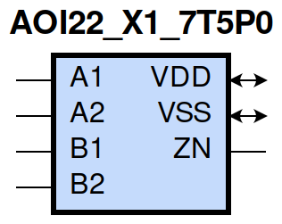
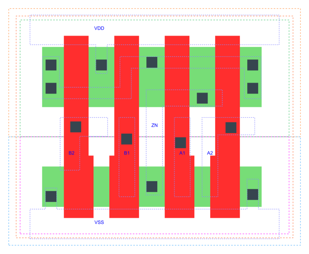

=======================================
gf180mcu_fd_sc_mcu7t5v0__aoi22_x1
=======================================

**gf180mcu_fd_sc_mcu7t5v0__aoi22_x1 symbol**

**gf180mcu_fd_sc_mcu7t5v0__aoi22_x1 schematic**

.. image:: sc7_sch/AOI22_X1_sch.png
    :height: 300px
    :width: 500 px
    :align: center
    :alt: gf180mcu_fd_sc_mcu7t5v0__aoi22_x1 schematic

**gf180mcu_fd_sc_mcu7t5v0__aoi22_x1 layout**

.. include:: images.rst

AOI22_X1 is a two 2-input AND into 2-input NOR, NOR[AND(A1,A2),AND(B1,B2)], 1X drive strength

|
| Attributes

============= ======================
**Attribute** **Value**
area          19.756800 µm\ :sup:`2`
============= ======================

|
| OUTPUT FUNCTIONS

============== =========================================================
**Output Pin** **Function**
ZN             (((!A1)&(!B1))|((!A1)&(!B2))|((!A2)&(!B1))|((!A2)&(!B2)))
============== =========================================================

|
| TRUTH TABLE FOR ZN

====== ====== ====== ====== ======
**A1** **A2** **B1** **B2** **ZN**
0      ?      0      ?      1
0      ?      ?      0      1
?      0      0      ?      1
?      0      ?      0      1
1      1      ?      ?      0
?      ?      1      1      0
====== ====== ====== ====== ======

|
| FUNCTIONAL SCHEMATIC
| |image92|
| PIN CAPACITANCE (pf)

======= ======== ====================
**Pin** **Type** **Capacitance (pf)**
B2      input    0.0046
B1      input    0.0047
A1      input    0.0049
A2      input    0.0049
======= ======== ====================

|
| DELAY AND OUTPUT TRANSITION TIME corresponding to min slew and load

+---------------+------------+--------------------+--------------+-------------------+----------------+---------------+
| **Input Pin** | **Output** | **When Condition** | **Tin (ns)** | **Out Load (pf)** | **Delay (ns)** | **Tout (ns)** |
+---------------+------------+--------------------+--------------+-------------------+----------------+---------------+
| B2(HL)        | ZN(LH)     | !A1&!A2&B1         | 0.0100       | 0.0010            | 0.1623         | 0.1044        |
+---------------+------------+--------------------+--------------+-------------------+----------------+---------------+
| B2(HL)        | ZN(LH)     | !A1&A2&B1          | 0.0100       | 0.0010            | 0.1960         | 0.1150        |
+---------------+------------+--------------------+--------------+-------------------+----------------+---------------+
| B2(HL)        | ZN(LH)     | A1&!A2&B1          | 0.0100       | 0.0010            | 0.2337         | 0.1432        |
+---------------+------------+--------------------+--------------+-------------------+----------------+---------------+
| B2(LH)        | ZN(HL)     | !A1&!A2&B1         | 0.0100       | 0.0010            | 0.1330         | 0.0783        |
+---------------+------------+--------------------+--------------+-------------------+----------------+---------------+
| B2(LH)        | ZN(HL)     | !A1&A2&B1          | 0.0100       | 0.0010            | 0.1083         | 0.0684        |
+---------------+------------+--------------------+--------------+-------------------+----------------+---------------+
| B2(LH)        | ZN(HL)     | A1&!A2&B1          | 0.0100       | 0.0010            | 0.1187         | 0.0889        |
+---------------+------------+--------------------+--------------+-------------------+----------------+---------------+
| B1(HL)        | ZN(LH)     | !A1&!A2&B2         | 0.0100       | 0.0010            | 0.1376         | 0.0830        |
+---------------+------------+--------------------+--------------+-------------------+----------------+---------------+
| B1(HL)        | ZN(LH)     | !A1&A2&B2          | 0.0100       | 0.0010            | 0.1633         | 0.0866        |
+---------------+------------+--------------------+--------------+-------------------+----------------+---------------+
| B1(HL)        | ZN(LH)     | A1&!A2&B2          | 0.0100       | 0.0010            | 0.2029         | 0.1146        |
+---------------+------------+--------------------+--------------+-------------------+----------------+---------------+
| B1(LH)        | ZN(HL)     | !A1&!A2&B2         | 0.0100       | 0.0010            | 0.1216         | 0.0784        |
+---------------+------------+--------------------+--------------+-------------------+----------------+---------------+
| B1(LH)        | ZN(HL)     | !A1&A2&B2          | 0.0100       | 0.0010            | 0.0967         | 0.0685        |
+---------------+------------+--------------------+--------------+-------------------+----------------+---------------+
| B1(LH)        | ZN(HL)     | A1&!A2&B2          | 0.0100       | 0.0010            | 0.1072         | 0.0892        |
+---------------+------------+--------------------+--------------+-------------------+----------------+---------------+
| A1(HL)        | ZN(LH)     | A2&!B1&!B2         | 0.0100       | 0.0010            | 0.0815         | 0.0593        |
+---------------+------------+--------------------+--------------+-------------------+----------------+---------------+
| A1(HL)        | ZN(LH)     | A2&!B1&B2          | 0.0100       | 0.0010            | 0.0969         | 0.0808        |
+---------------+------------+--------------------+--------------+-------------------+----------------+---------------+
| A1(HL)        | ZN(LH)     | A2&B1&!B2          | 0.0100       | 0.0010            | 0.1349         | 0.1117        |
+---------------+------------+--------------------+--------------+-------------------+----------------+---------------+
| A1(LH)        | ZN(HL)     | A2&!B1&!B2         | 0.0100       | 0.0010            | 0.0630         | 0.0371        |
+---------------+------------+--------------------+--------------+-------------------+----------------+---------------+
| A1(LH)        | ZN(HL)     | A2&!B1&B2          | 0.0100       | 0.0010            | 0.0632         | 0.0371        |
+---------------+------------+--------------------+--------------+-------------------+----------------+---------------+
| A1(LH)        | ZN(HL)     | A2&B1&!B2          | 0.0100       | 0.0010            | 0.0682         | 0.0535        |
+---------------+------------+--------------------+--------------+-------------------+----------------+---------------+
| A2(HL)        | ZN(LH)     | A1&!B1&!B2         | 0.0100       | 0.0010            | 0.1048         | 0.0814        |
+---------------+------------+--------------------+--------------+-------------------+----------------+---------------+
| A2(HL)        | ZN(LH)     | A1&!B1&B2          | 0.0100       | 0.0010            | 0.1274         | 0.1111        |
+---------------+------------+--------------------+--------------+-------------------+----------------+---------------+
| A2(HL)        | ZN(LH)     | A1&B1&!B2          | 0.0100       | 0.0010            | 0.1649         | 0.1412        |
+---------------+------------+--------------------+--------------+-------------------+----------------+---------------+
| A2(LH)        | ZN(HL)     | A1&!B1&!B2         | 0.0100       | 0.0010            | 0.0743         | 0.0372        |
+---------------+------------+--------------------+--------------+-------------------+----------------+---------------+
| A2(LH)        | ZN(HL)     | A1&!B1&B2          | 0.0100       | 0.0010            | 0.0745         | 0.0372        |
+---------------+------------+--------------------+--------------+-------------------+----------------+---------------+
| A2(LH)        | ZN(HL)     | A1&B1&!B2          | 0.0100       | 0.0010            | 0.0796         | 0.0535        |
+---------------+------------+--------------------+--------------+-------------------+----------------+---------------+

|
| DYNAMIC ENERGY

+---------------+--------------------+--------------+------------+-------------------+---------------------+
| **Input Pin** | **When Condition** | **Tin (ns)** | **Output** | **Out Load (pf)** | **Energy (uW/MHz)** |
+---------------+--------------------+--------------+------------+-------------------+---------------------+
| A1            | A2&!B1&!B2         | 0.0100       | ZN(LH)     | 0.0010            | 0.1198              |
+---------------+--------------------+--------------+------------+-------------------+---------------------+
| A1            | A2&!B1&B2          | 0.0100       | ZN(LH)     | 0.0010            | 0.1198              |
+---------------+--------------------+--------------+------------+-------------------+---------------------+
| A1            | A2&B1&!B2          | 0.0100       | ZN(LH)     | 0.0010            | 0.1622              |
+---------------+--------------------+--------------+------------+-------------------+---------------------+
| B2            | !A1&!A2&B1         | 0.0100       | ZN(LH)     | 0.0010            | 0.2423              |
+---------------+--------------------+--------------+------------+-------------------+---------------------+
| B2            | !A1&A2&B1          | 0.0100       | ZN(LH)     | 0.0010            | 0.2204              |
+---------------+--------------------+--------------+------------+-------------------+---------------------+
| B2            | A1&!A2&B1          | 0.0100       | ZN(LH)     | 0.0010            | 0.2613              |
+---------------+--------------------+--------------+------------+-------------------+---------------------+
| B1            | !A1&!A2&B2         | 0.0100       | ZN(LH)     | 0.0010            | 0.2053              |
+---------------+--------------------+--------------+------------+-------------------+---------------------+
| B1            | !A1&A2&B2          | 0.0100       | ZN(LH)     | 0.0010            | 0.1832              |
+---------------+--------------------+--------------+------------+-------------------+---------------------+
| B1            | A1&!A2&B2          | 0.0100       | ZN(LH)     | 0.0010            | 0.2258              |
+---------------+--------------------+--------------+------------+-------------------+---------------------+
| A2            | A1&!B1&!B2         | 0.0100       | ZN(LH)     | 0.0010            | 0.1562              |
+---------------+--------------------+--------------+------------+-------------------+---------------------+
| A2            | A1&!B1&B2          | 0.0100       | ZN(LH)     | 0.0010            | 0.1562              |
+---------------+--------------------+--------------+------------+-------------------+---------------------+
| A2            | A1&B1&!B2          | 0.0100       | ZN(LH)     | 0.0010            | 0.1975              |
+---------------+--------------------+--------------+------------+-------------------+---------------------+
| B1            | !A1&!A2&B2         | 0.0100       | ZN(HL)     | 0.0010            | 0.0644              |
+---------------+--------------------+--------------+------------+-------------------+---------------------+
| B1            | !A1&A2&B2          | 0.0100       | ZN(HL)     | 0.0010            | 0.0580              |
+---------------+--------------------+--------------+------------+-------------------+---------------------+
| B1            | A1&!A2&B2          | 0.0100       | ZN(HL)     | 0.0010            | 0.0580              |
+---------------+--------------------+--------------+------------+-------------------+---------------------+
| A1            | A2&!B1&!B2         | 0.0100       | ZN(HL)     | 0.0010            | 0.0032              |
+---------------+--------------------+--------------+------------+-------------------+---------------------+
| A1            | A2&!B1&B2          | 0.0100       | ZN(HL)     | 0.0010            | 0.0036              |
+---------------+--------------------+--------------+------------+-------------------+---------------------+
| A1            | A2&B1&!B2          | 0.0100       | ZN(HL)     | 0.0010            | 0.0036              |
+---------------+--------------------+--------------+------------+-------------------+---------------------+
| B2            | !A1&!A2&B1         | 0.0100       | ZN(HL)     | 0.0010            | 0.0643              |
+---------------+--------------------+--------------+------------+-------------------+---------------------+
| B2            | !A1&A2&B1          | 0.0100       | ZN(HL)     | 0.0010            | 0.0579              |
+---------------+--------------------+--------------+------------+-------------------+---------------------+
| B2            | A1&!A2&B1          | 0.0100       | ZN(HL)     | 0.0010            | 0.0579              |
+---------------+--------------------+--------------+------------+-------------------+---------------------+
| A2            | A1&!B1&!B2         | 0.0100       | ZN(HL)     | 0.0010            | 0.0032              |
+---------------+--------------------+--------------+------------+-------------------+---------------------+
| A2            | A1&!B1&B2          | 0.0100       | ZN(HL)     | 0.0010            | 0.0036              |
+---------------+--------------------+--------------+------------+-------------------+---------------------+
| A2            | A1&B1&!B2          | 0.0100       | ZN(HL)     | 0.0010            | 0.0036              |
+---------------+--------------------+--------------+------------+-------------------+---------------------+
| A1(LH)        | !A2&!B1&!B2        | 0.0100       | n/a        | n/a               | -0.0294             |
+---------------+--------------------+--------------+------------+-------------------+---------------------+
| A1(LH)        | !A2&!B1&B2         | 0.0100       | n/a        | n/a               | -0.0294             |
+---------------+--------------------+--------------+------------+-------------------+---------------------+
| A1(LH)        | !A2&B1&!B2         | 0.0100       | n/a        | n/a               | -0.0294             |
+---------------+--------------------+--------------+------------+-------------------+---------------------+
| A1(LH)        | !A2&B1&B2          | 0.0100       | n/a        | n/a               | -0.0100             |
+---------------+--------------------+--------------+------------+-------------------+---------------------+
| A1(LH)        | A2&B1&B2           | 0.0100       | n/a        | n/a               | -0.0102             |
+---------------+--------------------+--------------+------------+-------------------+---------------------+
| B2(LH)        | !A1&!A2&!B1        | 0.0100       | n/a        | n/a               | -0.0392             |
+---------------+--------------------+--------------+------------+-------------------+---------------------+
| B2(LH)        | !A1&A2&!B1         | 0.0100       | n/a        | n/a               | -0.0392             |
+---------------+--------------------+--------------+------------+-------------------+---------------------+
| B2(LH)        | A1&!A2&!B1         | 0.0100       | n/a        | n/a               | -0.0392             |
+---------------+--------------------+--------------+------------+-------------------+---------------------+
| B2(LH)        | A1&A2&!B1          | 0.0100       | n/a        | n/a               | -0.0390             |
+---------------+--------------------+--------------+------------+-------------------+---------------------+
| B2(LH)        | A1&A2&B1           | 0.0100       | n/a        | n/a               | -0.0317             |
+---------------+--------------------+--------------+------------+-------------------+---------------------+
| A2(HL)        | !A1&!B1&!B2        | 0.0100       | n/a        | n/a               | 0.0436              |
+---------------+--------------------+--------------+------------+-------------------+---------------------+
| A2(HL)        | !A1&!B1&B2         | 0.0100       | n/a        | n/a               | 0.0436              |
+---------------+--------------------+--------------+------------+-------------------+---------------------+
| A2(HL)        | !A1&B1&!B2         | 0.0100       | n/a        | n/a               | 0.0436              |
+---------------+--------------------+--------------+------------+-------------------+---------------------+
| A2(HL)        | !A1&B1&B2          | 0.0100       | n/a        | n/a               | 0.0101              |
+---------------+--------------------+--------------+------------+-------------------+---------------------+
| A2(HL)        | A1&B1&B2           | 0.0100       | n/a        | n/a               | 0.0567              |
+---------------+--------------------+--------------+------------+-------------------+---------------------+
| B1(HL)        | !A1&!A2&!B2        | 0.0100       | n/a        | n/a               | 0.0439              |
+---------------+--------------------+--------------+------------+-------------------+---------------------+
| B1(HL)        | !A1&A2&!B2         | 0.0100       | n/a        | n/a               | 0.0440              |
+---------------+--------------------+--------------+------------+-------------------+---------------------+
| B1(HL)        | A1&!A2&!B2         | 0.0100       | n/a        | n/a               | 0.0440              |
+---------------+--------------------+--------------+------------+-------------------+---------------------+
| B1(HL)        | A1&A2&!B2          | 0.0100       | n/a        | n/a               | 0.0392              |
+---------------+--------------------+--------------+------------+-------------------+---------------------+
| B1(HL)        | A1&A2&B2           | 0.0100       | n/a        | n/a               | 0.0392              |
+---------------+--------------------+--------------+------------+-------------------+---------------------+
| B2(HL)        | !A1&!A2&!B1        | 0.0100       | n/a        | n/a               | 0.0434              |
+---------------+--------------------+--------------+------------+-------------------+---------------------+
| B2(HL)        | !A1&A2&!B1         | 0.0100       | n/a        | n/a               | 0.0435              |
+---------------+--------------------+--------------+------------+-------------------+---------------------+
| B2(HL)        | A1&!A2&!B1         | 0.0100       | n/a        | n/a               | 0.0435              |
+---------------+--------------------+--------------+------------+-------------------+---------------------+
| B2(HL)        | A1&A2&!B1          | 0.0100       | n/a        | n/a               | 0.0393              |
+---------------+--------------------+--------------+------------+-------------------+---------------------+
| B2(HL)        | A1&A2&B1           | 0.0100       | n/a        | n/a               | 0.0392              |
+---------------+--------------------+--------------+------------+-------------------+---------------------+
| A1(HL)        | !A2&!B1&!B2        | 0.0100       | n/a        | n/a               | 0.0441              |
+---------------+--------------------+--------------+------------+-------------------+---------------------+
| A1(HL)        | !A2&!B1&B2         | 0.0100       | n/a        | n/a               | 0.0441              |
+---------------+--------------------+--------------+------------+-------------------+---------------------+
| A1(HL)        | !A2&B1&!B2         | 0.0100       | n/a        | n/a               | 0.0441              |
+---------------+--------------------+--------------+------------+-------------------+---------------------+
| A1(HL)        | !A2&B1&B2          | 0.0100       | n/a        | n/a               | 0.0101              |
+---------------+--------------------+--------------+------------+-------------------+---------------------+
| A1(HL)        | A2&B1&B2           | 0.0100       | n/a        | n/a               | 0.0567              |
+---------------+--------------------+--------------+------------+-------------------+---------------------+
| B1(LH)        | !A1&!A2&!B2        | 0.0100       | n/a        | n/a               | -0.0288             |
+---------------+--------------------+--------------+------------+-------------------+---------------------+
| B1(LH)        | !A1&A2&!B2         | 0.0100       | n/a        | n/a               | -0.0288             |
+---------------+--------------------+--------------+------------+-------------------+---------------------+
| B1(LH)        | A1&!A2&!B2         | 0.0100       | n/a        | n/a               | -0.0288             |
+---------------+--------------------+--------------+------------+-------------------+---------------------+
| B1(LH)        | A1&A2&!B2          | 0.0100       | n/a        | n/a               | -0.0390             |
+---------------+--------------------+--------------+------------+-------------------+---------------------+
| B1(LH)        | A1&A2&B2           | 0.0100       | n/a        | n/a               | -0.0317             |
+---------------+--------------------+--------------+------------+-------------------+---------------------+
| A2(LH)        | !A1&!B1&!B2        | 0.0100       | n/a        | n/a               | -0.0396             |
+---------------+--------------------+--------------+------------+-------------------+---------------------+
| A2(LH)        | !A1&!B1&B2         | 0.0100       | n/a        | n/a               | -0.0396             |
+---------------+--------------------+--------------+------------+-------------------+---------------------+
| A2(LH)        | !A1&B1&!B2         | 0.0100       | n/a        | n/a               | -0.0396             |
+---------------+--------------------+--------------+------------+-------------------+---------------------+
| A2(LH)        | !A1&B1&B2          | 0.0100       | n/a        | n/a               | -0.0100             |
+---------------+--------------------+--------------+------------+-------------------+---------------------+
| A2(LH)        | A1&B1&B2           | 0.0100       | n/a        | n/a               | -0.0102             |
+---------------+--------------------+--------------+------------+-------------------+---------------------+

|
| LEAKAGE POWER

================== ==============
**When Condition** **Power (nW)**
!A1&!A2&!B1&!B2    0.1004
!A1&!A2&!B1&B2     0.1007
!A1&!A2&B1&!B2     0.1406
!A1&A2&!B1&!B2     0.1007
!A1&A2&!B1&B2      0.1009
!A1&A2&B1&!B2      0.1408
A1&!A2&!B1&!B2     0.1406
A1&!A2&!B1&B2      0.1408
A1&!A2&B1&!B2      0.1807
!A1&!A2&B1&B2      0.1742
!A1&A2&B1&B2       0.1764
A1&!A2&B1&B2       0.1764
A1&A2&!B1&!B2      0.1030
A1&A2&!B1&B2       0.1030
A1&A2&B1&!B2       0.1030
A1&A2&B1&B2        0.1030
================== ==============

