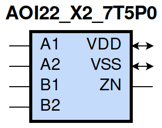
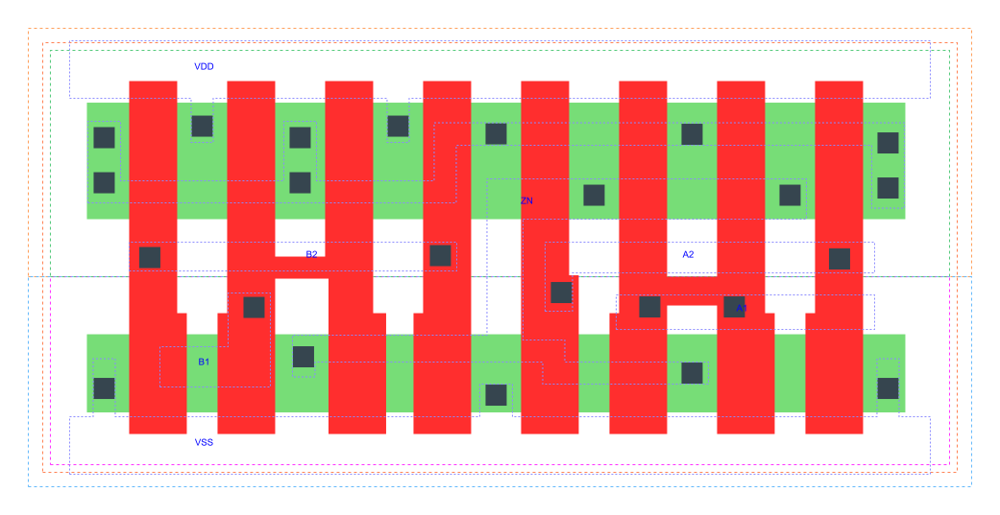

=======================================
gf180mcu_fd_sc_mcu7t5v0__aoi22_x2
=======================================

**gf180mcu_fd_sc_mcu7t5v0__aoi22_x2 symbol**

**gf180mcu_fd_sc_mcu7t5v0__aoi22_x2 schematic**

.. image:: sc7_sch/AOI22_X2_sch.png
    :height: 300px
    :width: 500 px
    :align: center
    :alt: gf180mcu_fd_sc_mcu7t5v0__aoi22_x2 schematic

**gf180mcu_fd_sc_mcu7t5v0__aoi22_x2 layout**

.. include:: images.rst

AOI22_X2 is a two 2-input AND into 2-input NOR, NOR[AND(A1,A2),AND(B1,B2)], 2X drive strength

|
| Attributes

============= ======================
**Attribute** **Value**
area          35.123200 µm\ :sup:`2`
============= ======================

|
| OUTPUT FUNCTIONS

============== =========================================================
**Output Pin** **Function**
ZN             (((!A1)&(!B1))|((!A1)&(!B2))|((!A2)&(!B1))|((!A2)&(!B2)))
============== =========================================================

|
| TRUTH TABLE FOR ZN

====== ====== ====== ====== ======
**A1** **A2** **B1** **B2** **ZN**
0      ?      0      ?      1
0      ?      ?      0      1
?      0      0      ?      1
?      0      ?      0      1
1      1      ?      ?      0
?      ?      1      1      0
====== ====== ====== ====== ======

|
| FUNCTIONAL SCHEMATIC
| |image95|
| PIN CAPACITANCE (pf)

======= ======== ====================
**Pin** **Type** **Capacitance (pf)**
B2      input    0.0093
B1      input    0.0090
A2      input    0.0099
A1      input    0.0095
======= ======== ====================

|
| DELAY AND OUTPUT TRANSITION TIME corresponding to min slew and load

+---------------+------------+--------------------+--------------+-------------------+----------------+---------------+
| **Input Pin** | **Output** | **When Condition** | **Tin (ns)** | **Out Load (pf)** | **Delay (ns)** | **Tout (ns)** |
+---------------+------------+--------------------+--------------+-------------------+----------------+---------------+
| B2(HL)        | ZN(LH)     | !A1&!A2&B1         | 0.0100       | 0.0010            | 0.1544         | 0.0997        |
+---------------+------------+--------------------+--------------+-------------------+----------------+---------------+
| B2(HL)        | ZN(LH)     | !A1&A2&B1          | 0.0100       | 0.0010            | 0.1862         | 0.1093        |
+---------------+------------+--------------------+--------------+-------------------+----------------+---------------+
| B2(HL)        | ZN(LH)     | A1&!A2&B1          | 0.0100       | 0.0010            | 0.2238         | 0.1376        |
+---------------+------------+--------------------+--------------+-------------------+----------------+---------------+
| B2(LH)        | ZN(HL)     | !A1&!A2&B1         | 0.0100       | 0.0010            | 0.1273         | 0.0738        |
+---------------+------------+--------------------+--------------+-------------------+----------------+---------------+
| B2(LH)        | ZN(HL)     | !A1&A2&B1          | 0.0100       | 0.0010            | 0.1036         | 0.0638        |
+---------------+------------+--------------------+--------------+-------------------+----------------+---------------+
| B2(LH)        | ZN(HL)     | A1&!A2&B1          | 0.0100       | 0.0010            | 0.1137         | 0.0845        |
+---------------+------------+--------------------+--------------+-------------------+----------------+---------------+
| B1(HL)        | ZN(LH)     | !A1&!A2&B2         | 0.0100       | 0.0010            | 0.1299         | 0.0786        |
+---------------+------------+--------------------+--------------+-------------------+----------------+---------------+
| B1(HL)        | ZN(LH)     | !A1&A2&B2          | 0.0100       | 0.0010            | 0.1540         | 0.0815        |
+---------------+------------+--------------------+--------------+-------------------+----------------+---------------+
| B1(HL)        | ZN(LH)     | A1&!A2&B2          | 0.0100       | 0.0010            | 0.1936         | 0.1094        |
+---------------+------------+--------------------+--------------+-------------------+----------------+---------------+
| B1(LH)        | ZN(HL)     | !A1&!A2&B2         | 0.0100       | 0.0010            | 0.1161         | 0.0738        |
+---------------+------------+--------------------+--------------+-------------------+----------------+---------------+
| B1(LH)        | ZN(HL)     | !A1&A2&B2          | 0.0100       | 0.0010            | 0.0924         | 0.0644        |
+---------------+------------+--------------------+--------------+-------------------+----------------+---------------+
| B1(LH)        | ZN(HL)     | A1&!A2&B2          | 0.0100       | 0.0010            | 0.1025         | 0.0848        |
+---------------+------------+--------------------+--------------+-------------------+----------------+---------------+
| A2(HL)        | ZN(LH)     | A1&!B1&!B2         | 0.0100       | 0.0010            | 0.1014         | 0.0779        |
+---------------+------------+--------------------+--------------+-------------------+----------------+---------------+
| A2(HL)        | ZN(LH)     | A1&!B1&B2          | 0.0100       | 0.0010            | 0.1240         | 0.1066        |
+---------------+------------+--------------------+--------------+-------------------+----------------+---------------+
| A2(HL)        | ZN(LH)     | A1&B1&!B2          | 0.0100       | 0.0010            | 0.1610         | 0.1361        |
+---------------+------------+--------------------+--------------+-------------------+----------------+---------------+
| A2(LH)        | ZN(HL)     | A1&!B1&!B2         | 0.0100       | 0.0010            | 0.0717         | 0.0350        |
+---------------+------------+--------------------+--------------+-------------------+----------------+---------------+
| A2(LH)        | ZN(HL)     | A1&!B1&B2          | 0.0100       | 0.0010            | 0.0719         | 0.0350        |
+---------------+------------+--------------------+--------------+-------------------+----------------+---------------+
| A2(LH)        | ZN(HL)     | A1&B1&!B2          | 0.0100       | 0.0010            | 0.0769         | 0.0511        |
+---------------+------------+--------------------+--------------+-------------------+----------------+---------------+
| A1(HL)        | ZN(LH)     | A2&!B1&!B2         | 0.0100       | 0.0010            | 0.0781         | 0.0559        |
+---------------+------------+--------------------+--------------+-------------------+----------------+---------------+
| A1(HL)        | ZN(LH)     | A2&!B1&B2          | 0.0100       | 0.0010            | 0.0931         | 0.0765        |
+---------------+------------+--------------------+--------------+-------------------+----------------+---------------+
| A1(HL)        | ZN(LH)     | A2&B1&!B2          | 0.0100       | 0.0010            | 0.1309         | 0.1067        |
+---------------+------------+--------------------+--------------+-------------------+----------------+---------------+
| A1(LH)        | ZN(HL)     | A2&!B1&!B2         | 0.0100       | 0.0010            | 0.0604         | 0.0350        |
+---------------+------------+--------------------+--------------+-------------------+----------------+---------------+
| A1(LH)        | ZN(HL)     | A2&!B1&B2          | 0.0100       | 0.0010            | 0.0605         | 0.0349        |
+---------------+------------+--------------------+--------------+-------------------+----------------+---------------+
| A1(LH)        | ZN(HL)     | A2&B1&!B2          | 0.0100       | 0.0010            | 0.0654         | 0.0511        |
+---------------+------------+--------------------+--------------+-------------------+----------------+---------------+

|
| DYNAMIC ENERGY

+---------------+--------------------+--------------+------------+-------------------+---------------------+
| **Input Pin** | **When Condition** | **Tin (ns)** | **Output** | **Out Load (pf)** | **Energy (uW/MHz)** |
+---------------+--------------------+--------------+------------+-------------------+---------------------+
| A1            | A2&!B1&!B2         | 0.0100       | ZN(LH)     | 0.0010            | 0.2495              |
+---------------+--------------------+--------------+------------+-------------------+---------------------+
| A1            | A2&!B1&B2          | 0.0100       | ZN(LH)     | 0.0010            | 0.2493              |
+---------------+--------------------+--------------+------------+-------------------+---------------------+
| A1            | A2&B1&!B2          | 0.0100       | ZN(LH)     | 0.0010            | 0.3333              |
+---------------+--------------------+--------------+------------+-------------------+---------------------+
| B2            | !A1&!A2&B1         | 0.0100       | ZN(LH)     | 0.0010            | 0.4887              |
+---------------+--------------------+--------------+------------+-------------------+---------------------+
| B2            | !A1&A2&B1          | 0.0100       | ZN(LH)     | 0.0010            | 0.4447              |
+---------------+--------------------+--------------+------------+-------------------+---------------------+
| B2            | A1&!A2&B1          | 0.0100       | ZN(LH)     | 0.0010            | 0.5268              |
+---------------+--------------------+--------------+------------+-------------------+---------------------+
| B1            | !A1&!A2&B2         | 0.0100       | ZN(LH)     | 0.0010            | 0.4150              |
+---------------+--------------------+--------------+------------+-------------------+---------------------+
| B1            | !A1&A2&B2          | 0.0100       | ZN(LH)     | 0.0010            | 0.3708              |
+---------------+--------------------+--------------+------------+-------------------+---------------------+
| B1            | A1&!A2&B2          | 0.0100       | ZN(LH)     | 0.0010            | 0.4565              |
+---------------+--------------------+--------------+------------+-------------------+---------------------+
| A2            | A1&!B1&!B2         | 0.0100       | ZN(LH)     | 0.0010            | 0.3229              |
+---------------+--------------------+--------------+------------+-------------------+---------------------+
| A2            | A1&!B1&B2          | 0.0100       | ZN(LH)     | 0.0010            | 0.3229              |
+---------------+--------------------+--------------+------------+-------------------+---------------------+
| A2            | A1&B1&!B2          | 0.0100       | ZN(LH)     | 0.0010            | 0.4044              |
+---------------+--------------------+--------------+------------+-------------------+---------------------+
| B1            | !A1&!A2&B2         | 0.0100       | ZN(HL)     | 0.0010            | 0.1165              |
+---------------+--------------------+--------------+------------+-------------------+---------------------+
| B1            | !A1&A2&B2          | 0.0100       | ZN(HL)     | 0.0010            | 0.1035              |
+---------------+--------------------+--------------+------------+-------------------+---------------------+
| B1            | A1&!A2&B2          | 0.0100       | ZN(HL)     | 0.0010            | 0.1035              |
+---------------+--------------------+--------------+------------+-------------------+---------------------+
| A1            | A2&!B1&!B2         | 0.0100       | ZN(HL)     | 0.0010            | 0.0065              |
+---------------+--------------------+--------------+------------+-------------------+---------------------+
| A1            | A2&!B1&B2          | 0.0100       | ZN(HL)     | 0.0010            | 0.0072              |
+---------------+--------------------+--------------+------------+-------------------+---------------------+
| A1            | A2&B1&!B2          | 0.0100       | ZN(HL)     | 0.0010            | 0.0072              |
+---------------+--------------------+--------------+------------+-------------------+---------------------+
| B2            | !A1&!A2&B1         | 0.0100       | ZN(HL)     | 0.0010            | 0.1165              |
+---------------+--------------------+--------------+------------+-------------------+---------------------+
| B2            | !A1&A2&B1          | 0.0100       | ZN(HL)     | 0.0010            | 0.1037              |
+---------------+--------------------+--------------+------------+-------------------+---------------------+
| B2            | A1&!A2&B1          | 0.0100       | ZN(HL)     | 0.0010            | 0.1037              |
+---------------+--------------------+--------------+------------+-------------------+---------------------+
| A2            | A1&!B1&!B2         | 0.0100       | ZN(HL)     | 0.0010            | 0.0062              |
+---------------+--------------------+--------------+------------+-------------------+---------------------+
| A2            | A1&!B1&B2          | 0.0100       | ZN(HL)     | 0.0010            | 0.0070              |
+---------------+--------------------+--------------+------------+-------------------+---------------------+
| A2            | A1&B1&!B2          | 0.0100       | ZN(HL)     | 0.0010            | 0.0070              |
+---------------+--------------------+--------------+------------+-------------------+---------------------+
| A1(LH)        | !A2&!B1&!B2        | 0.0100       | n/a        | n/a               | -0.0585             |
+---------------+--------------------+--------------+------------+-------------------+---------------------+
| A1(LH)        | !A2&!B1&B2         | 0.0100       | n/a        | n/a               | -0.0585             |
+---------------+--------------------+--------------+------------+-------------------+---------------------+
| A1(LH)        | !A2&B1&!B2         | 0.0100       | n/a        | n/a               | -0.0585             |
+---------------+--------------------+--------------+------------+-------------------+---------------------+
| A1(LH)        | !A2&B1&B2          | 0.0100       | n/a        | n/a               | -0.0195             |
+---------------+--------------------+--------------+------------+-------------------+---------------------+
| A1(LH)        | A2&B1&B2           | 0.0100       | n/a        | n/a               | -0.0202             |
+---------------+--------------------+--------------+------------+-------------------+---------------------+
| B2(LH)        | !A1&!A2&!B1        | 0.0100       | n/a        | n/a               | -0.0784             |
+---------------+--------------------+--------------+------------+-------------------+---------------------+
| B2(LH)        | !A1&A2&!B1         | 0.0100       | n/a        | n/a               | -0.0783             |
+---------------+--------------------+--------------+------------+-------------------+---------------------+
| B2(LH)        | A1&!A2&!B1         | 0.0100       | n/a        | n/a               | -0.0783             |
+---------------+--------------------+--------------+------------+-------------------+---------------------+
| B2(LH)        | A1&A2&!B1          | 0.0100       | n/a        | n/a               | -0.0781             |
+---------------+--------------------+--------------+------------+-------------------+---------------------+
| B2(LH)        | A1&A2&B1           | 0.0100       | n/a        | n/a               | -0.0624             |
+---------------+--------------------+--------------+------------+-------------------+---------------------+
| A2(HL)        | !A1&!B1&!B2        | 0.0100       | n/a        | n/a               | 0.0871              |
+---------------+--------------------+--------------+------------+-------------------+---------------------+
| A2(HL)        | !A1&!B1&B2         | 0.0100       | n/a        | n/a               | 0.0870              |
+---------------+--------------------+--------------+------------+-------------------+---------------------+
| A2(HL)        | !A1&B1&!B2         | 0.0100       | n/a        | n/a               | 0.0870              |
+---------------+--------------------+--------------+------------+-------------------+---------------------+
| A2(HL)        | !A1&B1&B2          | 0.0100       | n/a        | n/a               | 0.0200              |
+---------------+--------------------+--------------+------------+-------------------+---------------------+
| A2(HL)        | A1&B1&B2           | 0.0100       | n/a        | n/a               | 0.1014              |
+---------------+--------------------+--------------+------------+-------------------+---------------------+
| B1(HL)        | !A1&!A2&!B2        | 0.0100       | n/a        | n/a               | 0.0876              |
+---------------+--------------------+--------------+------------+-------------------+---------------------+
| B1(HL)        | !A1&A2&!B2         | 0.0100       | n/a        | n/a               | 0.0876              |
+---------------+--------------------+--------------+------------+-------------------+---------------------+
| B1(HL)        | A1&!A2&!B2         | 0.0100       | n/a        | n/a               | 0.0876              |
+---------------+--------------------+--------------+------------+-------------------+---------------------+
| B1(HL)        | A1&A2&!B2          | 0.0100       | n/a        | n/a               | 0.0784              |
+---------------+--------------------+--------------+------------+-------------------+---------------------+
| B1(HL)        | A1&A2&B2           | 0.0100       | n/a        | n/a               | 0.0784              |
+---------------+--------------------+--------------+------------+-------------------+---------------------+
| B2(HL)        | !A1&!A2&!B1        | 0.0100       | n/a        | n/a               | 0.0868              |
+---------------+--------------------+--------------+------------+-------------------+---------------------+
| B2(HL)        | !A1&A2&!B1         | 0.0100       | n/a        | n/a               | 0.0869              |
+---------------+--------------------+--------------+------------+-------------------+---------------------+
| B2(HL)        | A1&!A2&!B1         | 0.0100       | n/a        | n/a               | 0.0869              |
+---------------+--------------------+--------------+------------+-------------------+---------------------+
| B2(HL)        | A1&A2&!B1          | 0.0100       | n/a        | n/a               | 0.0786              |
+---------------+--------------------+--------------+------------+-------------------+---------------------+
| B2(HL)        | A1&A2&B1           | 0.0100       | n/a        | n/a               | 0.0784              |
+---------------+--------------------+--------------+------------+-------------------+---------------------+
| A1(HL)        | !A2&!B1&!B2        | 0.0100       | n/a        | n/a               | 0.0880              |
+---------------+--------------------+--------------+------------+-------------------+---------------------+
| A1(HL)        | !A2&!B1&B2         | 0.0100       | n/a        | n/a               | 0.0878              |
+---------------+--------------------+--------------+------------+-------------------+---------------------+
| A1(HL)        | !A2&B1&!B2         | 0.0100       | n/a        | n/a               | 0.0878              |
+---------------+--------------------+--------------+------------+-------------------+---------------------+
| A1(HL)        | !A2&B1&B2          | 0.0100       | n/a        | n/a               | 0.0200              |
+---------------+--------------------+--------------+------------+-------------------+---------------------+
| A1(HL)        | A2&B1&B2           | 0.0100       | n/a        | n/a               | 0.1014              |
+---------------+--------------------+--------------+------------+-------------------+---------------------+
| B1(LH)        | !A1&!A2&!B2        | 0.0100       | n/a        | n/a               | -0.0586             |
+---------------+--------------------+--------------+------------+-------------------+---------------------+
| B1(LH)        | !A1&A2&!B2         | 0.0100       | n/a        | n/a               | -0.0586             |
+---------------+--------------------+--------------+------------+-------------------+---------------------+
| B1(LH)        | A1&!A2&!B2         | 0.0100       | n/a        | n/a               | -0.0586             |
+---------------+--------------------+--------------+------------+-------------------+---------------------+
| B1(LH)        | A1&A2&!B2          | 0.0100       | n/a        | n/a               | -0.0781             |
+---------------+--------------------+--------------+------------+-------------------+---------------------+
| B1(LH)        | A1&A2&B2           | 0.0100       | n/a        | n/a               | -0.0625             |
+---------------+--------------------+--------------+------------+-------------------+---------------------+
| A2(LH)        | !A1&!B1&!B2        | 0.0100       | n/a        | n/a               | -0.0790             |
+---------------+--------------------+--------------+------------+-------------------+---------------------+
| A2(LH)        | !A1&!B1&B2         | 0.0100       | n/a        | n/a               | -0.0789             |
+---------------+--------------------+--------------+------------+-------------------+---------------------+
| A2(LH)        | !A1&B1&!B2         | 0.0100       | n/a        | n/a               | -0.0789             |
+---------------+--------------------+--------------+------------+-------------------+---------------------+
| A2(LH)        | !A1&B1&B2          | 0.0100       | n/a        | n/a               | -0.0195             |
+---------------+--------------------+--------------+------------+-------------------+---------------------+
| A2(LH)        | A1&B1&B2           | 0.0100       | n/a        | n/a               | -0.0202             |
+---------------+--------------------+--------------+------------+-------------------+---------------------+

|
| LEAKAGE POWER

================== ==============
**When Condition** **Power (nW)**
!A1&!A2&!B1&!B2    0.1509
!A1&!A2&!B1&B2     0.1513
!A1&!A2&B1&!B2     0.2312
!A1&A2&!B1&!B2     0.1513
!A1&A2&!B1&B2      0.1518
!A1&A2&B1&!B2      0.2316
A1&!A2&!B1&!B2     0.2312
A1&!A2&!B1&B2      0.2316
A1&!A2&B1&!B2      0.3114
!A1&!A2&B1&B2      0.2985
!A1&A2&B1&B2       0.3028
A1&!A2&B1&B2       0.3028
A1&A2&!B1&!B2      0.1560
A1&A2&!B1&B2       0.1560
A1&A2&B1&!B2       0.1560
A1&A2&B1&B2        0.1560
================== ==============

