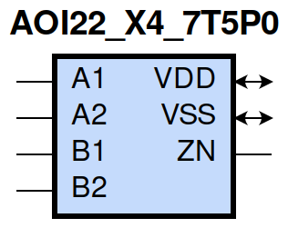
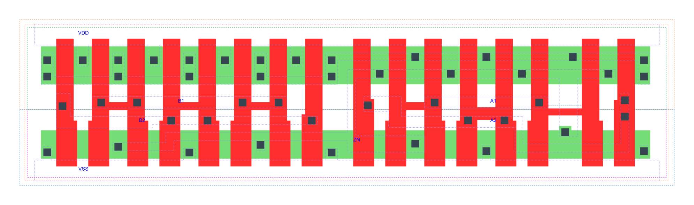

=======================================
gf180mcu_fd_sc_mcu7t5v0__aoi22_x4
=======================================

**gf180mcu_fd_sc_mcu7t5v0__aoi22_x4 symbol**

**gf180mcu_fd_sc_mcu7t5v0__aoi22_x4 schematic**

.. image:: sc7_sch/AOI22_X4_sch.png
    :height: 300px
    :width: 500 px
    :align: center
    :alt: gf180mcu_fd_sc_mcu7t5v0__aoi22_x4 schematic

**gf180mcu_fd_sc_mcu7t5v0__aoi22_x4 layout**

.. include:: images.rst

AOI22_X4 is a two 2-input AND into 2-input NOR, NOR[AND(A1,A2),AND(B1,B2)], 4X drive strength

|
| Attributes

============= ======================
**Attribute** **Value**
area          70.246400 µm\ :sup:`2`
============= ======================

|
| OUTPUT FUNCTIONS

============== =========================================================
**Output Pin** **Function**
ZN             (((!A1)&(!B1))|((!A1)&(!B2))|((!A2)&(!B1))|((!A2)&(!B2)))
============== =========================================================

|
| TRUTH TABLE FOR ZN

====== ====== ====== ====== ======
**A1** **A2** **B1** **B2** **ZN**
0      ?      0      ?      1
0      ?      ?      0      1
?      0      0      ?      1
?      0      ?      0      1
1      1      ?      ?      0
?      ?      1      1      0
====== ====== ====== ====== ======

|
| FUNCTIONAL SCHEMATIC
| |image98|
| PIN CAPACITANCE (pf)

======= ======== ====================
**Pin** **Type** **Capacitance (pf)**
B2      input    0.0184
B1      input    0.0179
A2      input    0.0188
A1      input    0.0180
======= ======== ====================

|
| DELAY AND OUTPUT TRANSITION TIME corresponding to min slew and load

+---------------+------------+--------------------+--------------+-------------------+----------------+---------------+
| **Input Pin** | **Output** | **When Condition** | **Tin (ns)** | **Out Load (pf)** | **Delay (ns)** | **Tout (ns)** |
+---------------+------------+--------------------+--------------+-------------------+----------------+---------------+
| B2(HL)        | ZN(LH)     | !A1&!A2&B1         | 0.0100       | 0.0010            | 0.1658         | 0.1063        |
+---------------+------------+--------------------+--------------+-------------------+----------------+---------------+
| B2(HL)        | ZN(LH)     | !A1&A2&B1          | 0.0100       | 0.0010            | 0.2007         | 0.1176        |
+---------------+------------+--------------------+--------------+-------------------+----------------+---------------+
| B2(HL)        | ZN(LH)     | A1&!A2&B1          | 0.0100       | 0.0010            | 0.2430         | 0.1494        |
+---------------+------------+--------------------+--------------+-------------------+----------------+---------------+
| B2(LH)        | ZN(HL)     | !A1&!A2&B1         | 0.0100       | 0.0010            | 0.1185         | 0.0692        |
+---------------+------------+--------------------+--------------+-------------------+----------------+---------------+
| B2(LH)        | ZN(HL)     | !A1&A2&B1          | 0.0100       | 0.0010            | 0.0964         | 0.0601        |
+---------------+------------+--------------------+--------------+-------------------+----------------+---------------+
| B2(LH)        | ZN(HL)     | A1&!A2&B1          | 0.0100       | 0.0010            | 0.1061         | 0.0807        |
+---------------+------------+--------------------+--------------+-------------------+----------------+---------------+
| B1(HL)        | ZN(LH)     | !A1&!A2&B2         | 0.0100       | 0.0010            | 0.1375         | 0.0823        |
+---------------+------------+--------------------+--------------+-------------------+----------------+---------------+
| B1(HL)        | ZN(LH)     | !A1&A2&B2          | 0.0100       | 0.0010            | 0.1636         | 0.0859        |
+---------------+------------+--------------------+--------------+-------------------+----------------+---------------+
| B1(HL)        | ZN(LH)     | A1&!A2&B2          | 0.0100       | 0.0010            | 0.2083         | 0.1173        |
+---------------+------------+--------------------+--------------+-------------------+----------------+---------------+
| B1(LH)        | ZN(HL)     | !A1&!A2&B2         | 0.0100       | 0.0010            | 0.1071         | 0.0697        |
+---------------+------------+--------------------+--------------+-------------------+----------------+---------------+
| B1(LH)        | ZN(HL)     | !A1&A2&B2          | 0.0100       | 0.0010            | 0.0849         | 0.0605        |
+---------------+------------+--------------------+--------------+-------------------+----------------+---------------+
| B1(LH)        | ZN(HL)     | A1&!A2&B2          | 0.0100       | 0.0010            | 0.0947         | 0.0812        |
+---------------+------------+--------------------+--------------+-------------------+----------------+---------------+
| A2(HL)        | ZN(LH)     | A1&!B1&!B2         | 0.0100       | 0.0010            | 0.1097         | 0.0839        |
+---------------+------------+--------------------+--------------+-------------------+----------------+---------------+
| A2(HL)        | ZN(LH)     | A1&!B1&B2          | 0.0100       | 0.0010            | 0.1342         | 0.1146        |
+---------------+------------+--------------------+--------------+-------------------+----------------+---------------+
| A2(HL)        | ZN(LH)     | A1&B1&!B2          | 0.0100       | 0.0010            | 0.1763         | 0.1481        |
+---------------+------------+--------------------+--------------+-------------------+----------------+---------------+
| A2(LH)        | ZN(HL)     | A1&!B1&!B2         | 0.0100       | 0.0010            | 0.0685         | 0.0334        |
+---------------+------------+--------------------+--------------+-------------------+----------------+---------------+
| A2(LH)        | ZN(HL)     | A1&!B1&B2          | 0.0100       | 0.0010            | 0.0687         | 0.0334        |
+---------------+------------+--------------------+--------------+-------------------+----------------+---------------+
| A2(LH)        | ZN(HL)     | A1&B1&!B2          | 0.0100       | 0.0010            | 0.0735         | 0.0497        |
+---------------+------------+--------------------+--------------+-------------------+----------------+---------------+
| A1(HL)        | ZN(LH)     | A2&!B1&!B2         | 0.0100       | 0.0010            | 0.0834         | 0.0591        |
+---------------+------------+--------------------+--------------+-------------------+----------------+---------------+
| A1(HL)        | ZN(LH)     | A2&!B1&B2          | 0.0100       | 0.0010            | 0.0993         | 0.0808        |
+---------------+------------+--------------------+--------------+-------------------+----------------+---------------+
| A1(HL)        | ZN(LH)     | A2&B1&!B2          | 0.0100       | 0.0010            | 0.1423         | 0.1150        |
+---------------+------------+--------------------+--------------+-------------------+----------------+---------------+
| A1(LH)        | ZN(HL)     | A2&!B1&!B2         | 0.0100       | 0.0010            | 0.0572         | 0.0335        |
+---------------+------------+--------------------+--------------+-------------------+----------------+---------------+
| A1(LH)        | ZN(HL)     | A2&!B1&B2          | 0.0100       | 0.0010            | 0.0573         | 0.0335        |
+---------------+------------+--------------------+--------------+-------------------+----------------+---------------+
| A1(LH)        | ZN(HL)     | A2&B1&!B2          | 0.0100       | 0.0010            | 0.0621         | 0.0497        |
+---------------+------------+--------------------+--------------+-------------------+----------------+---------------+

|
| DYNAMIC ENERGY

+---------------+--------------------+--------------+------------+-------------------+---------------------+
| **Input Pin** | **When Condition** | **Tin (ns)** | **Output** | **Out Load (pf)** | **Energy (uW/MHz)** |
+---------------+--------------------+--------------+------------+-------------------+---------------------+
| A1            | A2&!B1&!B2         | 0.0100       | ZN(LH)     | 0.0010            | 0.4972              |
+---------------+--------------------+--------------+------------+-------------------+---------------------+
| A1            | A2&!B1&B2          | 0.0100       | ZN(LH)     | 0.0010            | 0.4971              |
+---------------+--------------------+--------------+------------+-------------------+---------------------+
| A1            | A2&B1&!B2          | 0.0100       | ZN(LH)     | 0.0010            | 0.6680              |
+---------------+--------------------+--------------+------------+-------------------+---------------------+
| B2            | !A1&!A2&B1         | 0.0100       | ZN(LH)     | 0.0010            | 0.9612              |
+---------------+--------------------+--------------+------------+-------------------+---------------------+
| B2            | !A1&A2&B1          | 0.0100       | ZN(LH)     | 0.0010            | 0.8820              |
+---------------+--------------------+--------------+------------+-------------------+---------------------+
| B2            | A1&!A2&B1          | 0.0100       | ZN(LH)     | 0.0010            | 1.0473              |
+---------------+--------------------+--------------+------------+-------------------+---------------------+
| B1            | !A1&!A2&B2         | 0.0100       | ZN(LH)     | 0.0010            | 0.8097              |
+---------------+--------------------+--------------+------------+-------------------+---------------------+
| B1            | !A1&A2&B2          | 0.0100       | ZN(LH)     | 0.0010            | 0.7300              |
+---------------+--------------------+--------------+------------+-------------------+---------------------+
| B1            | A1&!A2&B2          | 0.0100       | ZN(LH)     | 0.0010            | 0.9031              |
+---------------+--------------------+--------------+------------+-------------------+---------------------+
| A2            | A1&!B1&!B2         | 0.0100       | ZN(LH)     | 0.0010            | 0.6456              |
+---------------+--------------------+--------------+------------+-------------------+---------------------+
| A2            | A1&!B1&B2          | 0.0100       | ZN(LH)     | 0.0010            | 0.6457              |
+---------------+--------------------+--------------+------------+-------------------+---------------------+
| A2            | A1&B1&!B2          | 0.0100       | ZN(LH)     | 0.0010            | 0.8113              |
+---------------+--------------------+--------------+------------+-------------------+---------------------+
| B1            | !A1&!A2&B2         | 0.0100       | ZN(HL)     | 0.0010            | 0.2163              |
+---------------+--------------------+--------------+------------+-------------------+---------------------+
| B1            | !A1&A2&B2          | 0.0100       | ZN(HL)     | 0.0010            | 0.1928              |
+---------------+--------------------+--------------+------------+-------------------+---------------------+
| B1            | A1&!A2&B2          | 0.0100       | ZN(HL)     | 0.0010            | 0.1929              |
+---------------+--------------------+--------------+------------+-------------------+---------------------+
| A1            | A2&!B1&!B2         | 0.0100       | ZN(HL)     | 0.0010            | 0.0133              |
+---------------+--------------------+--------------+------------+-------------------+---------------------+
| A1            | A2&!B1&B2          | 0.0100       | ZN(HL)     | 0.0010            | 0.0145              |
+---------------+--------------------+--------------+------------+-------------------+---------------------+
| A1            | A2&B1&!B2          | 0.0100       | ZN(HL)     | 0.0010            | 0.0144              |
+---------------+--------------------+--------------+------------+-------------------+---------------------+
| B2            | !A1&!A2&B1         | 0.0100       | ZN(HL)     | 0.0010            | 0.2159              |
+---------------+--------------------+--------------+------------+-------------------+---------------------+
| B2            | !A1&A2&B1          | 0.0100       | ZN(HL)     | 0.0010            | 0.1928              |
+---------------+--------------------+--------------+------------+-------------------+---------------------+
| B2            | A1&!A2&B1          | 0.0100       | ZN(HL)     | 0.0010            | 0.1929              |
+---------------+--------------------+--------------+------------+-------------------+---------------------+
| A2            | A1&!B1&!B2         | 0.0100       | ZN(HL)     | 0.0010            | 0.0131              |
+---------------+--------------------+--------------+------------+-------------------+---------------------+
| A2            | A1&!B1&B2          | 0.0100       | ZN(HL)     | 0.0010            | 0.0143              |
+---------------+--------------------+--------------+------------+-------------------+---------------------+
| A2            | A1&B1&!B2          | 0.0100       | ZN(HL)     | 0.0010            | 0.0144              |
+---------------+--------------------+--------------+------------+-------------------+---------------------+
| A1(LH)        | !A2&!B1&!B2        | 0.0100       | n/a        | n/a               | -0.1009             |
+---------------+--------------------+--------------+------------+-------------------+---------------------+
| A1(LH)        | !A2&!B1&B2         | 0.0100       | n/a        | n/a               | -0.1009             |
+---------------+--------------------+--------------+------------+-------------------+---------------------+
| A1(LH)        | !A2&B1&!B2         | 0.0100       | n/a        | n/a               | -0.1009             |
+---------------+--------------------+--------------+------------+-------------------+---------------------+
| A1(LH)        | !A2&B1&B2          | 0.0100       | n/a        | n/a               | -0.0351             |
+---------------+--------------------+--------------+------------+-------------------+---------------------+
| A1(LH)        | A2&B1&B2           | 0.0100       | n/a        | n/a               | -0.0359             |
+---------------+--------------------+--------------+------------+-------------------+---------------------+
| B2(LH)        | !A1&!A2&!B1        | 0.0100       | n/a        | n/a               | -0.1410             |
+---------------+--------------------+--------------+------------+-------------------+---------------------+
| B2(LH)        | !A1&A2&!B1         | 0.0100       | n/a        | n/a               | -0.1407             |
+---------------+--------------------+--------------+------------+-------------------+---------------------+
| B2(LH)        | A1&!A2&!B1         | 0.0100       | n/a        | n/a               | -0.1406             |
+---------------+--------------------+--------------+------------+-------------------+---------------------+
| B2(LH)        | A1&A2&!B1          | 0.0100       | n/a        | n/a               | -0.1404             |
+---------------+--------------------+--------------+------------+-------------------+---------------------+
| B2(LH)        | A1&A2&B1           | 0.0100       | n/a        | n/a               | -0.1120             |
+---------------+--------------------+--------------+------------+-------------------+---------------------+
| A2(HL)        | !A1&!B1&!B2        | 0.0100       | n/a        | n/a               | 0.1586              |
+---------------+--------------------+--------------+------------+-------------------+---------------------+
| A2(HL)        | !A1&!B1&B2         | 0.0100       | n/a        | n/a               | 0.1581              |
+---------------+--------------------+--------------+------------+-------------------+---------------------+
| A2(HL)        | !A1&B1&!B2         | 0.0100       | n/a        | n/a               | 0.1581              |
+---------------+--------------------+--------------+------------+-------------------+---------------------+
| A2(HL)        | !A1&B1&B2          | 0.0100       | n/a        | n/a               | 0.0357              |
+---------------+--------------------+--------------+------------+-------------------+---------------------+
| A2(HL)        | A1&B1&B2           | 0.0100       | n/a        | n/a               | 0.1893              |
+---------------+--------------------+--------------+------------+-------------------+---------------------+
| B1(HL)        | !A1&!A2&!B2        | 0.0100       | n/a        | n/a               | 0.1591              |
+---------------+--------------------+--------------+------------+-------------------+---------------------+
| B1(HL)        | !A1&A2&!B2         | 0.0100       | n/a        | n/a               | 0.1591              |
+---------------+--------------------+--------------+------------+-------------------+---------------------+
| B1(HL)        | A1&!A2&!B2         | 0.0100       | n/a        | n/a               | 0.1591              |
+---------------+--------------------+--------------+------------+-------------------+---------------------+
| B1(HL)        | A1&A2&!B2          | 0.0100       | n/a        | n/a               | 0.1409              |
+---------------+--------------------+--------------+------------+-------------------+---------------------+
| B1(HL)        | A1&A2&B2           | 0.0100       | n/a        | n/a               | 0.1395              |
+---------------+--------------------+--------------+------------+-------------------+---------------------+
| B2(HL)        | !A1&!A2&!B1        | 0.0100       | n/a        | n/a               | 0.1578              |
+---------------+--------------------+--------------+------------+-------------------+---------------------+
| B2(HL)        | !A1&A2&!B1         | 0.0100       | n/a        | n/a               | 0.1579              |
+---------------+--------------------+--------------+------------+-------------------+---------------------+
| B2(HL)        | A1&!A2&!B1         | 0.0100       | n/a        | n/a               | 0.1579              |
+---------------+--------------------+--------------+------------+-------------------+---------------------+
| B2(HL)        | A1&A2&!B1          | 0.0100       | n/a        | n/a               | 0.1411              |
+---------------+--------------------+--------------+------------+-------------------+---------------------+
| B2(HL)        | A1&A2&B1           | 0.0100       | n/a        | n/a               | 0.1393              |
+---------------+--------------------+--------------+------------+-------------------+---------------------+
| A1(HL)        | !A2&!B1&!B2        | 0.0100       | n/a        | n/a               | 0.1602              |
+---------------+--------------------+--------------+------------+-------------------+---------------------+
| A1(HL)        | !A2&!B1&B2         | 0.0100       | n/a        | n/a               | 0.1598              |
+---------------+--------------------+--------------+------------+-------------------+---------------------+
| A1(HL)        | !A2&B1&!B2         | 0.0100       | n/a        | n/a               | 0.1598              |
+---------------+--------------------+--------------+------------+-------------------+---------------------+
| A1(HL)        | !A2&B1&B2          | 0.0100       | n/a        | n/a               | 0.0357              |
+---------------+--------------------+--------------+------------+-------------------+---------------------+
| A1(HL)        | A2&B1&B2           | 0.0100       | n/a        | n/a               | 0.1892              |
+---------------+--------------------+--------------+------------+-------------------+---------------------+
| B1(LH)        | !A1&!A2&!B2        | 0.0100       | n/a        | n/a               | -0.0994             |
+---------------+--------------------+--------------+------------+-------------------+---------------------+
| B1(LH)        | !A1&A2&!B2         | 0.0100       | n/a        | n/a               | -0.0994             |
+---------------+--------------------+--------------+------------+-------------------+---------------------+
| B1(LH)        | A1&!A2&!B2         | 0.0100       | n/a        | n/a               | -0.0994             |
+---------------+--------------------+--------------+------------+-------------------+---------------------+
| B1(LH)        | A1&A2&!B2          | 0.0100       | n/a        | n/a               | -0.1403             |
+---------------+--------------------+--------------+------------+-------------------+---------------------+
| B1(LH)        | A1&A2&B2           | 0.0100       | n/a        | n/a               | -0.1120             |
+---------------+--------------------+--------------+------------+-------------------+---------------------+
| A2(LH)        | !A1&!B1&!B2        | 0.0100       | n/a        | n/a               | -0.1419             |
+---------------+--------------------+--------------+------------+-------------------+---------------------+
| A2(LH)        | !A1&!B1&B2         | 0.0100       | n/a        | n/a               | -0.1417             |
+---------------+--------------------+--------------+------------+-------------------+---------------------+
| A2(LH)        | !A1&B1&!B2         | 0.0100       | n/a        | n/a               | -0.1418             |
+---------------+--------------------+--------------+------------+-------------------+---------------------+
| A2(LH)        | !A1&B1&B2          | 0.0100       | n/a        | n/a               | -0.0351             |
+---------------+--------------------+--------------+------------+-------------------+---------------------+
| A2(LH)        | A1&B1&B2           | 0.0100       | n/a        | n/a               | -0.0360             |
+---------------+--------------------+--------------+------------+-------------------+---------------------+

|
| LEAKAGE POWER

================== ==============
**When Condition** **Power (nW)**
!A1&!A2&!B1&!B2    0.2518
!A1&!A2&!B1&B2     0.2527
!A1&!A2&B1&!B2     0.4123
!A1&A2&!B1&!B2     0.2527
!A1&A2&!B1&B2      0.2536
!A1&A2&B1&!B2      0.4132
A1&!A2&!B1&!B2     0.4123
A1&!A2&!B1&B2      0.4132
A1&!A2&B1&!B2      0.5728
!A1&!A2&B1&B2      0.5471
!A1&A2&B1&B2       0.5552
A1&!A2&B1&B2       0.5552
A1&A2&!B1&!B2      0.2613
A1&A2&!B1&B2       0.2613
A1&A2&B1&!B2       0.2613
A1&A2&B1&B2        0.2603
================== ==============

