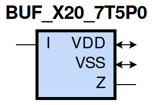
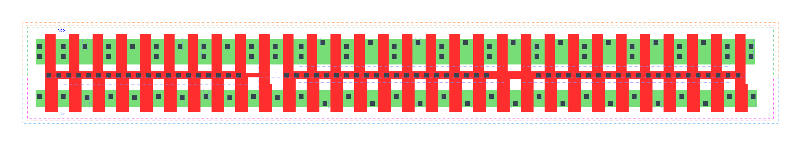

=======================================
gf180mcu_fd_sc_mcu7t5v0__buf_x20
=======================================

**gf180mcu_fd_sc_mcu7t5v0__buf_x20 symbol**

**gf180mcu_fd_sc_mcu7t5v0__buf_x20 schematic**

.. image:: sc7_sch/BUF_X20_sch.png
    :height: 300px
    :width: 500 px
    :align: center
    :alt: gf180mcu_fd_sc_mcu7t5v0__buf_x20 schematic

**gf180mcu_fd_sc_mcu7t5v0__buf_x20 layout**

.. include:: images.rst

BUF_X20 is a buffer, 20X drive strength

|
| Attributes

============= =======================
**Attribute** **Value**
area          136.102400 µm\ :sup:`2`
============= =======================

|
| OUTPUT FUNCTIONS

============== ============
**Output Pin** **Function**
Z              I
============== ============

|
| TRUTH TABLE FOR Z

===== =====
**I** **Z**
1     1
0     0
===== =====

|
| FUNCTIONAL SCHEMATIC
| |image131|
| PIN CAPACITANCE (pf)

======= ======== ====================
**Pin** **Type** **Capacitance (pf)**
I       input    0.0461
======= ======== ====================

|
| DELAY AND OUTPUT TRANSITION TIME corresponding to min slew and load

+---------------+------------+--------------------+--------------+-------------------+----------------+---------------+
| **Input Pin** | **Output** | **When Condition** | **Tin (ns)** | **Out Load (pf)** | **Delay (ns)** | **Tout (ns)** |
+---------------+------------+--------------------+--------------+-------------------+----------------+---------------+
| I(LH)         | Z(LH)      | default            | 0.0100       | 0.0010            | 0.1252         | 0.0261        |
+---------------+------------+--------------------+--------------+-------------------+----------------+---------------+
| I(HL)         | Z(HL)      | default            | 0.0100       | 0.0010            | 0.1430         | 0.0264        |
+---------------+------------+--------------------+--------------+-------------------+----------------+---------------+

|
| DYNAMIC ENERGY

+---------------+--------------------+--------------+------------+-------------------+---------------------+
| **Input Pin** | **When Condition** | **Tin (ns)** | **Output** | **Out Load (pf)** | **Energy (uW/MHz)** |
+---------------+--------------------+--------------+------------+-------------------+---------------------+
| I             | default            | 0.0100       | Z(LH)      | 0.0010            | 1.7820              |
+---------------+--------------------+--------------+------------+-------------------+---------------------+
| I             | default            | 0.0100       | Z(HL)      | 0.0010            | 3.0101              |
+---------------+--------------------+--------------+------------+-------------------+---------------------+

|
| LEAKAGE POWER

================== ==============
**When Condition** **Power (nW)**
!I                 0.8343
I                  0.8239
================== ==============

