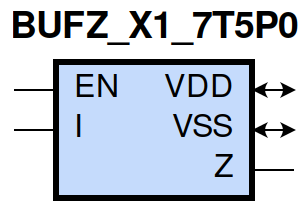
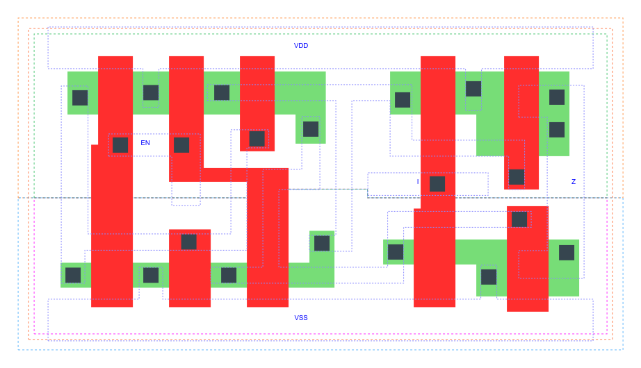

=======================================
gf180mcu_fd_sc_mcu7t5v0__bufz_x1
=======================================

**gf180mcu_fd_sc_mcu7t5v0__bufz_x1 symbol**

**gf180mcu_fd_sc_mcu7t5v0__bufz_x1 schematic**

.. image:: sc7_sch/BUFZ_X1_sch.png
    :height: 300px
    :width: 500 px
    :align: center
    :alt: gf180mcu_fd_sc_mcu7t5v0__bufz_x1 schematic

**gf180mcu_fd_sc_mcu7t5v0__bufz_x1 layout**

.. include:: images.rst

BUFZ_X1 is a tri-state buffer, 1X drive strength

|
| Attributes

============= ======================
**Attribute** **Value**
area          30.732800 µm\ :sup:`2`
============= ======================

|
| OUTPUT FUNCTIONS

============== ============
**Output Pin** **Function**
Z              I
============== ============

|
| TRUTH TABLE FOR Z

====== ===== =====
**EN** **I** **Z**
1      1     1
1      0     0
0      ?     z
====== ===== =====

|
| FUNCTIONAL SCHEMATIC
| |image107|
| PIN CAPACITANCE (pf)

======= ======== ====================
**Pin** **Type** **Capacitance (pf)**
EN      input    0.0057
I       input    0.0031
======= ======== ====================

|
| DELAY AND OUTPUT TRANSITION TIME corresponding to min slew and load

+---------------+------------+--------------------+--------------+-------------------+----------------+---------------+
| **Input Pin** | **Output** | **When Condition** | **Tin (ns)** | **Out Load (pf)** | **Delay (ns)** | **Tout (ns)** |
+---------------+------------+--------------------+--------------+-------------------+----------------+---------------+
| EN(LH)        | Z(ZL)      | !I                 | 0.0100       | 0.0010            | 0.1925         | 0.0540        |
+---------------+------------+--------------------+--------------+-------------------+----------------+---------------+
| EN(LH)        | Z(ZH)      | I                  | 0.0100       | 0.0010            | 0.1691         | 0.0535        |
+---------------+------------+--------------------+--------------+-------------------+----------------+---------------+
| EN(HL)        | Z(LZ)      | !I                 | 0.0100       |                   | 0.2490         | 0.0000        |
+---------------+------------+--------------------+--------------+-------------------+----------------+---------------+
| EN(HL)        | Z(HZ)      | I                  | 0.0100       |                   | 0.1650         | 0.0000        |
+---------------+------------+--------------------+--------------+-------------------+----------------+---------------+
| I(HL)         | Z(HL)      | EN                 | 0.0100       | 0.0010            | 0.3173         | 0.0606        |
+---------------+------------+--------------------+--------------+-------------------+----------------+---------------+
| I(LH)         | Z(LH)      | EN                 | 0.0100       | 0.0010            | 0.2960         | 0.0562        |
+---------------+------------+--------------------+--------------+-------------------+----------------+---------------+

|
| DYNAMIC ENERGY

+---------------+--------------------+--------------+------------+-------------------+---------------------+
| **Input Pin** | **When Condition** | **Tin (ns)** | **Output** | **Out Load (pf)** | **Energy (uW/MHz)** |
+---------------+--------------------+--------------+------------+-------------------+---------------------+
| I             | EN                 | 0.0100       | Z(HL)      | 0.0010            | 0.3276              |
+---------------+--------------------+--------------+------------+-------------------+---------------------+
| I             | EN                 | 0.0100       | Z(LH)      | 0.0010            | 0.1472              |
+---------------+--------------------+--------------+------------+-------------------+---------------------+
| EN(HL)        | !I                 | 0.0100       | n/a        | n/a               | 0.1673              |
+---------------+--------------------+--------------+------------+-------------------+---------------------+
| EN(HL)        | I                  | 0.0100       | n/a        | n/a               | 0.2343              |
+---------------+--------------------+--------------+------------+-------------------+---------------------+
| I(LH)         | !EN                | 0.0100       | n/a        | n/a               | -0.0198             |
+---------------+--------------------+--------------+------------+-------------------+---------------------+
| EN            | I                  | 0.0100       | Z(LH)      | 0.0010            | 0.1122              |
+---------------+--------------------+--------------+------------+-------------------+---------------------+
| I(HL)         | !EN                | 0.0100       | n/a        | n/a               | 0.0199              |
+---------------+--------------------+--------------+------------+-------------------+---------------------+
| EN            | !I                 | 0.0100       | Z(HL)      | 0.0010            | 0.1977              |
+---------------+--------------------+--------------+------------+-------------------+---------------------+

|
| LEAKAGE POWER

================== ==============
**When Condition** **Power (nW)**
!EN&!I             0.1442
!EN&I              0.1442
EN&!I              0.2078
EN&I               0.2038
================== ==============

