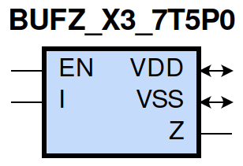
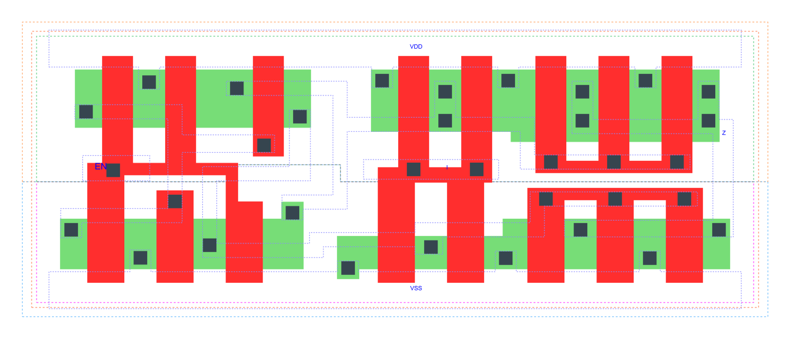

=======================================
gf180mcu_fd_sc_mcu7t5v0__bufz_x3
=======================================

**gf180mcu_fd_sc_mcu7t5v0__bufz_x3 symbol**

**gf180mcu_fd_sc_mcu7t5v0__bufz_x3 schematic**

.. image:: sc7_sch/BUFZ_X3_sch.png
    :height: 300px
    :width: 500 px
    :align: center
    :alt: gf180mcu_fd_sc_mcu7t5v0__bufz_x3 schematic

**gf180mcu_fd_sc_mcu7t5v0__bufz_x3 layout**

.. include:: images.rst

BUFZ_X3 is a tri-state buffer, 3X drive strength

|
| Attributes

============= ======================
**Attribute** **Value**
area          43.904000 µm\ :sup:`2`
============= ======================

|
| OUTPUT FUNCTIONS

============== ============
**Output Pin** **Function**
Z              I
============== ============

|
| TRUTH TABLE FOR Z

====== ===== =====
**EN** **I** **Z**
1      1     1
1      0     0
0      ?     z
====== ===== =====

|
| FUNCTIONAL SCHEMATIC
| |image113|
| PIN CAPACITANCE (pf)

======= ======== ====================
**Pin** **Type** **Capacitance (pf)**
EN      input    0.0084
I       input    0.0075
======= ======== ====================

|
| DELAY AND OUTPUT TRANSITION TIME corresponding to min slew and load

+---------------+------------+--------------------+--------------+-------------------+----------------+---------------+
| **Input Pin** | **Output** | **When Condition** | **Tin (ns)** | **Out Load (pf)** | **Delay (ns)** | **Tout (ns)** |
+---------------+------------+--------------------+--------------+-------------------+----------------+---------------+
| EN(LH)        | Z(ZL)      | !I                 | 0.0100       | 0.0010            | 0.1404         | 0.0365        |
+---------------+------------+--------------------+--------------+-------------------+----------------+---------------+
| EN(LH)        | Z(ZH)      | I                  | 0.0100       | 0.0010            | 0.1383         | 0.0400        |
+---------------+------------+--------------------+--------------+-------------------+----------------+---------------+
| EN(HL)        | Z(LZ)      | !I                 | 0.0100       |                   | 0.2280         | 0.0000        |
+---------------+------------+--------------------+--------------+-------------------+----------------+---------------+
| EN(HL)        | Z(HZ)      | I                  | 0.0100       |                   | 0.2100         | 0.0000        |
+---------------+------------+--------------------+--------------+-------------------+----------------+---------------+
| I(HL)         | Z(HL)      | EN                 | 0.0100       | 0.0010            | 0.2095         | 0.0386        |
+---------------+------------+--------------------+--------------+-------------------+----------------+---------------+
| I(LH)         | Z(LH)      | EN                 | 0.0100       | 0.0010            | 0.2210         | 0.0401        |
+---------------+------------+--------------------+--------------+-------------------+----------------+---------------+

|
| DYNAMIC ENERGY

+---------------+--------------------+--------------+------------+-------------------+---------------------+
| **Input Pin** | **When Condition** | **Tin (ns)** | **Output** | **Out Load (pf)** | **Energy (uW/MHz)** |
+---------------+--------------------+--------------+------------+-------------------+---------------------+
| I             | EN                 | 0.0100       | Z(HL)      | 0.0010            | 0.6480              |
+---------------+--------------------+--------------+------------+-------------------+---------------------+
| I             | EN                 | 0.0100       | Z(LH)      | 0.0010            | 0.2788              |
+---------------+--------------------+--------------+------------+-------------------+---------------------+
| EN(HL)        | !I                 | 0.0100       | n/a        | n/a               | 0.2271              |
+---------------+--------------------+--------------+------------+-------------------+---------------------+
| EN(HL)        | I                  | 0.0100       | n/a        | n/a               | 0.3606              |
+---------------+--------------------+--------------+------------+-------------------+---------------------+
| I(LH)         | !EN                | 0.0100       | n/a        | n/a               | -0.0646             |
+---------------+--------------------+--------------+------------+-------------------+---------------------+
| EN            | I                  | 0.0100       | Z(LH)      | 0.0010            | 0.2673              |
+---------------+--------------------+--------------+------------+-------------------+---------------------+
| I(HL)         | !EN                | 0.0100       | n/a        | n/a               | 0.0648              |
+---------------+--------------------+--------------+------------+-------------------+---------------------+
| EN            | !I                 | 0.0100       | Z(HL)      | 0.0010            | 0.3783              |
+---------------+--------------------+--------------+------------+-------------------+---------------------+

|
| LEAKAGE POWER

================== ==============
**When Condition** **Power (nW)**
!EN&!I             0.1660
!EN&I              0.1660
EN&!I              0.2822
EN&I               0.2817
================== ==============

