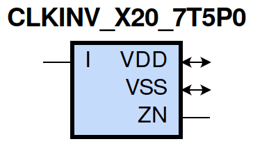
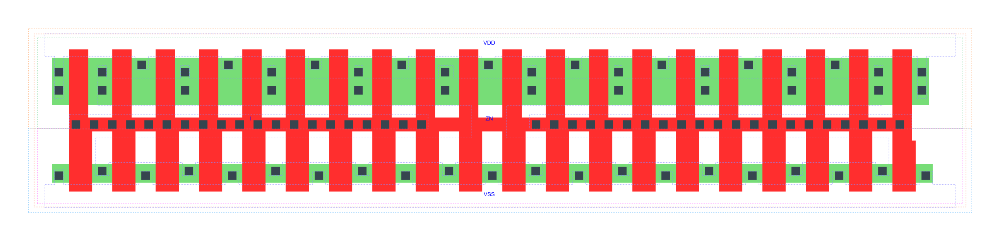

=======================================
gf180mcu_fd_sc_mcu7t5v0__clkinv_x20
=======================================

**gf180mcu_fd_sc_mcu7t5v0__clkinv_x20 symbol**

**gf180mcu_fd_sc_mcu7t5v0__clkinv_x20 schematic**

.. image:: sc7_sch/CLKINV_X20_sch.png
    :height: 300px
    :width: 500 px
    :align: center
    :alt: gf180mcu_fd_sc_mcu7t5v0__clkinv_x20 schematic

**gf180mcu_fd_sc_mcu7t5v0__clkinv_x20 layout**

.. include:: images.rst

CLKINV_X20 is a clock inverter, 20X drive strength
|
| Attributes

============= ======================
**Attribute** **Value**
area          92.198400 µm\ :sup:`2`
============= ======================

|
| OUTPUT FUNCTIONS

============== ============
**Output Pin** **Function**
ZN             (!I)
============== ============

|
| TRUTH TABLE FOR ZN

===== ======
**I** **ZN**
0     1
1     0
===== ======

|
| FUNCTIONAL SCHEMATIC
| |image179|
| PIN CAPACITANCE (pf)

======= ======== ====================
**Pin** **Type** **Capacitance (pf)**
I       input    0.0801
======= ======== ====================

|
| DELAY AND OUTPUT TRANSITION TIME corresponding to min slew and load

+---------------+------------+--------------------+--------------+-------------------+----------------+---------------+
| **Input Pin** | **Output** | **When Condition** | **Tin (ns)** | **Out Load (pf)** | **Delay (ns)** | **Tout (ns)** |
+---------------+------------+--------------------+--------------+-------------------+----------------+---------------+
| I(LH)         | ZN(HL)     | default            | 0.0100       | 0.0010            | 0.0393         | 0.0166        |
+---------------+------------+--------------------+--------------+-------------------+----------------+---------------+
| I(HL)         | ZN(LH)     | default            | 0.0100       | 0.0010            | 0.0317         | 0.0190        |
+---------------+------------+--------------------+--------------+-------------------+----------------+---------------+

|
| DYNAMIC ENERGY

+---------------+--------------------+--------------+------------+-------------------+---------------------+
| **Input Pin** | **When Condition** | **Tin (ns)** | **Output** | **Out Load (pf)** | **Energy (uW/MHz)** |
+---------------+--------------------+--------------+------------+-------------------+---------------------+
| I             | default            | 0.0100       | ZN(HL)     | 0.0010            | -0.2132             |
+---------------+--------------------+--------------+------------+-------------------+---------------------+
| I             | default            | 0.0100       | ZN(LH)     | 0.0010            | 1.5822              |
+---------------+--------------------+--------------+------------+-------------------+---------------------+

|
| LEAKAGE POWER

================== ==============
**When Condition** **Power (nW)**
!I                 0.5635
I                  0.5799
================== ==============

