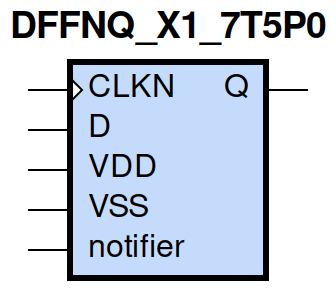
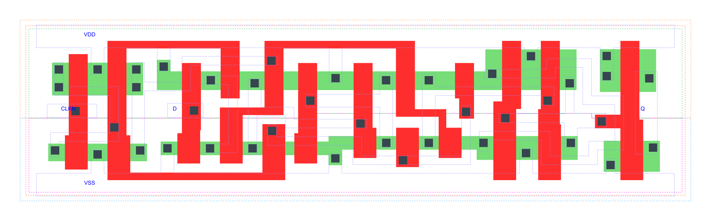

=======================================
gf180mcu_fd_sc_mcu7t5v0__dffnq_x1
=======================================

**gf180mcu_fd_sc_mcu7t5v0__dffnq_x1 symbol**

**gf180mcu_fd_sc_mcu7t5v0__dffnq_x1 schematic**

.. image:: sc7_sch/DFFNQ_X1_sch.png
    :height: 300px
    :width: 500 px
    :align: center
    :alt: gf180mcu_fd_sc_mcu7t5v0__dffnq_x1 schematic

**gf180mcu_fd_sc_mcu7t5v0__dffnq_x1 layout**

.. include:: images.rst

DFFNQ_X1 is a negative edge triggered D-type flip flop, 1X drive strength

|
| Attributes

============= ======================
**Attribute** **Value**
area          65.856000 µm\ :sup:`2`
============= ======================

|

TRUTH TABLE

===== ==== ======
Input      Output
D     CLKN Q
L     ↓    L
H     ↓    H
===== ==== ======

|
| FUNCTIONAL SCHEMATIC
| |image194|
| CONSTRAINTS

================== =============== ============= ============
**Constraint Pin** **Related Pin** **setup(ns)** **hold(ns)**
D(HL)              CLKN(HL)        0.2630        0.0400
D(LH)              CLKN(HL)        0.1490        0.1430
================== =============== ============= ============

|

================== =============== ===========================
**Constraint Pin** **Related Pin** **Minimum Pulse Width(ns)**
CLKN(LHL)          CLKN(LH)        0.4060
CLKN(LHL)          CLKN(LH)        0.3510
CLKN(HLH)          CLKN(HL)        0.3680
CLKN(HLH)          CLKN(HL)        0.4460
================== =============== ===========================

|
| PIN CAPACITANCE (pf)

======= ======== ====================
**Pin** **Type** **Capacitance (pf)**
CLKN    input    0.0035
D       input    0.0024
======= ======== ====================

|
| DELAY AND OUTPUT TRANSITION TIME corresponding to min slew and load

+---------------+------------+--------------------+--------------+-------------------+----------------+---------------+
| **Input Pin** | **Output** | **When Condition** | **Tin (ns)** | **Out Load (pf)** | **Delay (ns)** | **Tout (ns)** |
+---------------+------------+--------------------+--------------+-------------------+----------------+---------------+
| CLKN(HL)      | Q(LH)      | D                  | 0.0100       | 0.0010            | 0.6896         | 0.0451        |
+---------------+------------+--------------------+--------------+-------------------+----------------+---------------+
| CLKN(HL)      | Q(HL)      | !D                 | 0.0100       | 0.0010            | 0.5447         | 0.0379        |
+---------------+------------+--------------------+--------------+-------------------+----------------+---------------+

|
| DYNAMIC ENERGY

+---------------+--------------------+--------------+------------+-------------------+---------------------+
| **Input Pin** | **When Condition** | **Tin (ns)** | **Output** | **Out Load (pf)** | **Energy (uW/MHz)** |
+---------------+--------------------+--------------+------------+-------------------+---------------------+
| CLKN          | D                  | 0.0100       | Q(LH)      | 0.0010            | 0.8160              |
+---------------+--------------------+--------------+------------+-------------------+---------------------+
| CLKN          | !D                 | 0.0100       | Q(HL)      | 0.0010            | 0.6809              |
+---------------+--------------------+--------------+------------+-------------------+---------------------+
| D(LH)         | !CLKN              | 0.0100       | n/a        | n/a               | 0.0050              |
+---------------+--------------------+--------------+------------+-------------------+---------------------+
| D(LH)         | CLKN               | 0.0100       | n/a        | n/a               | 0.1310              |
+---------------+--------------------+--------------+------------+-------------------+---------------------+
| CLKN(LH)      | !D                 | 0.0100       | n/a        | n/a               | 0.1986              |
+---------------+--------------------+--------------+------------+-------------------+---------------------+
| CLKN(LH)      | D                  | 0.0100       | n/a        | n/a               | 0.1989              |
+---------------+--------------------+--------------+------------+-------------------+---------------------+
| CLKN(HL)      | !D                 | 0.0100       | n/a        | n/a               | 0.3085              |
+---------------+--------------------+--------------+------------+-------------------+---------------------+
| CLKN(HL)      | D                  | 0.0100       | n/a        | n/a               | 0.3085              |
+---------------+--------------------+--------------+------------+-------------------+---------------------+
| D(HL)         | !CLKN              | 0.0100       | n/a        | n/a               | 0.0571              |
+---------------+--------------------+--------------+------------+-------------------+---------------------+
| D(HL)         | CLKN               | 0.0100       | n/a        | n/a               | 0.2043              |
+---------------+--------------------+--------------+------------+-------------------+---------------------+

|
| LEAKAGE POWER

================== ==============
**When Condition** **Power (nW)**
!CLKN&!D           0.4766
CLKN&!D            0.4110
!CLKN&D            0.4801
CLKN&D             0.4093
================== ==============

