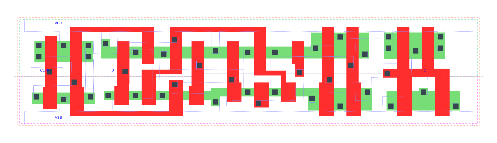

=======================================
gf180mcu_fd_sc_mcu7t5v0__dffnq_x2
=======================================

**gf180mcu_fd_sc_mcu7t5v0__dffnq_x2 symbol**

.. image:: sc7_sym/DFFNQ_X2_sym.png
    :height: 250px
    :width: 400 px
    :align: center
    :alt: gf180mcu_fd_sc_mcu7t5v0__dffnq_x2 symbol

**gf180mcu_fd_sc_mcu7t5v0__dffnq_x2 schematic**

.. image:: sc7_sch/DFFNQ_X2_sch.png
    :height: 300px
    :width: 500 px
    :align: center
    :alt: gf180mcu_fd_sc_mcu7t5v0__dffnq_x2 schematic

**gf180mcu_fd_sc_mcu7t5v0__dffnq_x2 layout**

.. include:: images.rst

DFFNQ_X2 is a negative edge triggered D-type flip flop, 2X drive strength

|
| Attributes

============= ======================
**Attribute** **Value**
area          72.441600 µm\ :sup:`2`
============= ======================

|

TRUTH TABLE

===== ==== ======
Input      Output
D     CLKN Q
L     ↓    L
H     ↓    H
===== ==== ======

|
| FUNCTIONAL SCHEMATIC
| |image197|
| CONSTRAINTS

================== =============== ============= ============
**Constraint Pin** **Related Pin** **setup(ns)** **hold(ns)**
D(HL)              CLKN(HL)        0.2690        0.0630
D(LH)              CLKN(HL)        0.1550        0.1490
================== =============== ============= ============

|

================== =============== ===========================
**Constraint Pin** **Related Pin** **Minimum Pulse Width(ns)**
CLKN(LHL)          CLKN(LH)        0.4120
CLKN(LHL)          CLKN(LH)        0.3570
CLKN(HLH)          CLKN(HL)        0.3980
CLKN(HLH)          CLKN(HL)        0.4560
================== =============== ===========================

|
| PIN CAPACITANCE (pf)

======= ======== ====================
**Pin** **Type** **Capacitance (pf)**
CLKN    input    0.0035
D       input    0.0024
======= ======== ====================

|
| DELAY AND OUTPUT TRANSITION TIME corresponding to min slew and load

+---------------+------------+--------------------+--------------+-------------------+----------------+---------------+
| **Input Pin** | **Output** | **When Condition** | **Tin (ns)** | **Out Load (pf)** | **Delay (ns)** | **Tout (ns)** |
+---------------+------------+--------------------+--------------+-------------------+----------------+---------------+
| CLKN(HL)      | Q(LH)      | D                  | 0.0100       | 0.0010            | 0.6753         | 0.0373        |
+---------------+------------+--------------------+--------------+-------------------+----------------+---------------+
| CLKN(HL)      | Q(HL)      | !D                 | 0.0100       | 0.0010            | 0.5954         | 0.0393        |
+---------------+------------+--------------------+--------------+-------------------+----------------+---------------+

|
| DYNAMIC ENERGY

+---------------+--------------------+--------------+------------+-------------------+---------------------+
| **Input Pin** | **When Condition** | **Tin (ns)** | **Output** | **Out Load (pf)** | **Energy (uW/MHz)** |
+---------------+--------------------+--------------+------------+-------------------+---------------------+
| CLKN          | D                  | 0.0100       | Q(LH)      | 0.0010            | 0.9501              |
+---------------+--------------------+--------------+------------+-------------------+---------------------+
| CLKN          | !D                 | 0.0100       | Q(HL)      | 0.0010            | 0.8506              |
+---------------+--------------------+--------------+------------+-------------------+---------------------+
| D(LH)         | !CLKN              | 0.0100       | n/a        | n/a               | 0.0050              |
+---------------+--------------------+--------------+------------+-------------------+---------------------+
| D(LH)         | CLKN               | 0.0100       | n/a        | n/a               | 0.1310              |
+---------------+--------------------+--------------+------------+-------------------+---------------------+
| CLKN(LH)      | !D                 | 0.0100       | n/a        | n/a               | 0.1984              |
+---------------+--------------------+--------------+------------+-------------------+---------------------+
| CLKN(LH)      | D                  | 0.0100       | n/a        | n/a               | 0.1987              |
+---------------+--------------------+--------------+------------+-------------------+---------------------+
| CLKN(HL)      | !D                 | 0.0100       | n/a        | n/a               | 0.3093              |
+---------------+--------------------+--------------+------------+-------------------+---------------------+
| CLKN(HL)      | D                  | 0.0100       | n/a        | n/a               | 0.3094              |
+---------------+--------------------+--------------+------------+-------------------+---------------------+
| D(HL)         | !CLKN              | 0.0100       | n/a        | n/a               | 0.0571              |
+---------------+--------------------+--------------+------------+-------------------+---------------------+
| D(HL)         | CLKN               | 0.0100       | n/a        | n/a               | 0.2043              |
+---------------+--------------------+--------------+------------+-------------------+---------------------+

|
| LEAKAGE POWER

================== ==============
**When Condition** **Power (nW)**
!CLKN&!D           0.5030
CLKN&!D            0.4375
!CLKN&D            0.5055
CLKN&D             0.4348
================== ==============

