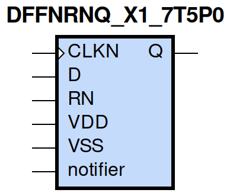
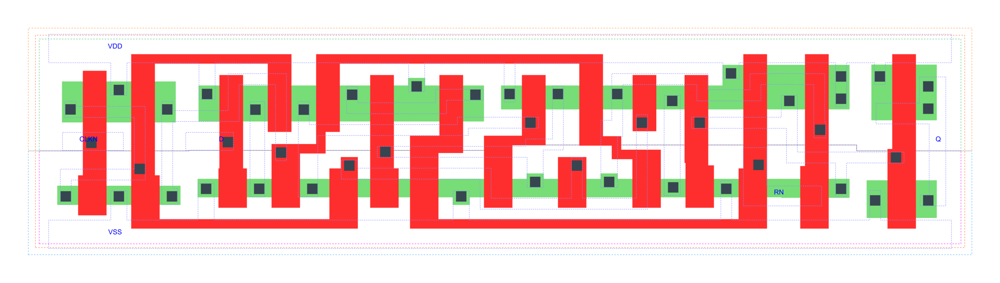

=======================================
gf180mcu_fd_sc_mcu7t5v0__dffnrnq_x1
=======================================

**gf180mcu_fd_sc_mcu7t5v0__dffnrnq_x1 symbol**

**gf180mcu_fd_sc_mcu7t5v0__dffnrnq_x1 schematic**

.. image:: sc7_sch/DFFNRNQ_X1_sch.png
    :height: 300px
    :width: 500 px
    :align: center
    :alt: gf180mcu_fd_sc_mcu7t5v0__dffnrnq_x1 schematic

**gf180mcu_fd_sc_mcu7t5v0__dffnrnq_x1 layout**

.. include:: images.rst

DFFNRNQ_X1 is a negative edge triggered D-type flip flop, active low reset and 1X drive strength

|
| Attributes

============= ======================
**Attribute** **Value**
area          74.636800 µm\ :sup:`2`
============= ======================

|

TRUTH TABLE

===== = ==== ======
Input        Output
RN    D CLKN Q
H     L ↓    L
H     H ↓    H
L     X X    L
===== = ==== ======

|
| FUNCTIONAL SCHEMATIC
| |image203|
| CONSTRAINTS

================== =============== ============= ============
**Constraint Pin** **Related Pin** **setup(ns)** **hold(ns)**
D(HL)              CLKN(HL)        0.2180        0.1720
D(LH)              CLKN(HL)        0.2180        0.1370
================== =============== ============= ============

|

================== =============== ================ ===============
**Constraint Pin** **Related Pin** **recovery(ns)** **removal(ns)**
RN(LH)             CLKN(HL)        -0.3840          0.5150
================== =============== ================ ===============

|

================== =============== ===========================
**Constraint Pin** **Related Pin** **Minimum Pulse Width(ns)**
CLKN(LHL)          CLKN(LH)        0.3940
CLKN(LHL)          CLKN(LH)        0.4610
CLKN(HLH)          CLKN(HL)        0.3490
CLKN(HLH)          CLKN(HL)        0.5440
RN(HLH)            RN(HL)          0.3580
RN(HLH)            RN(HL)          0.2900
RN(HLH)            RN(HL)          0.3580
RN(HLH)            RN(HL)          0.2900
================== =============== ===========================

|
| PIN CAPACITANCE (pf)

======= ======== ====================
**Pin** **Type** **Capacitance (pf)**
CLKN    input    0.0033
D       input    0.0030
RN      input    0.0072
======= ======== ====================

|
| DELAY AND OUTPUT TRANSITION TIME corresponding to min slew and load

+---------------+------------+--------------------+--------------+-------------------+----------------+---------------+
| **Input Pin** | **Output** | **When Condition** | **Tin (ns)** | **Out Load (pf)** | **Delay (ns)** | **Tout (ns)** |
+---------------+------------+--------------------+--------------+-------------------+----------------+---------------+
| CLKN(HL)      | Q(LH)      | D&RN               | 0.0100       | 0.0010            | 0.8508         | 0.0591        |
+---------------+------------+--------------------+--------------+-------------------+----------------+---------------+
| CLKN(HL)      | Q(HL)      | !D&RN              | 0.0100       | 0.0010            | 0.5509         | 0.0403        |
+---------------+------------+--------------------+--------------+-------------------+----------------+---------------+
| RN(HL)        | Q(HL)      | !CLKN&!D           | 0.0100       | 0.0010            | 0.1855         | 0.0403        |
+---------------+------------+--------------------+--------------+-------------------+----------------+---------------+
| RN(HL)        | Q(HL)      | CLKN&!D            | 0.0100       | 0.0010            | 0.1853         | 0.0400        |
+---------------+------------+--------------------+--------------+-------------------+----------------+---------------+
| RN(HL)        | Q(HL)      | !CLKN&D            | 0.0100       | 0.0010            | 0.1855         | 0.0403        |
+---------------+------------+--------------------+--------------+-------------------+----------------+---------------+
| RN(HL)        | Q(HL)      | CLKN&D             | 0.0100       | 0.0010            | 0.1853         | 0.0403        |
+---------------+------------+--------------------+--------------+-------------------+----------------+---------------+

|
| DYNAMIC ENERGY

+---------------+--------------------+--------------+------------+-------------------+---------------------+
| **Input Pin** | **When Condition** | **Tin (ns)** | **Output** | **Out Load (pf)** | **Energy (uW/MHz)** |
+---------------+--------------------+--------------+------------+-------------------+---------------------+
| RN            | !CLKN&!D           | 0.0100       | Q(HL)      | 0.0010            | 0.5955              |
+---------------+--------------------+--------------+------------+-------------------+---------------------+
| RN            | CLKN&!D            | 0.0100       | Q(HL)      | 0.0010            | 0.3688              |
+---------------+--------------------+--------------+------------+-------------------+---------------------+
| RN            | !CLKN&D            | 0.0100       | Q(HL)      | 0.0010            | 0.5954              |
+---------------+--------------------+--------------+------------+-------------------+---------------------+
| RN            | CLKN&D             | 0.0100       | Q(HL)      | 0.0010            | 0.3861              |
+---------------+--------------------+--------------+------------+-------------------+---------------------+
| CLKN          | D&RN               | 0.0100       | Q(LH)      | 0.0010            | 0.8125              |
+---------------+--------------------+--------------+------------+-------------------+---------------------+
| CLKN          | !D&RN              | 0.0100       | Q(HL)      | 0.0010            | 0.6323              |
+---------------+--------------------+--------------+------------+-------------------+---------------------+
| CLKN(LH)      | !D&!RN             | 0.0100       | n/a        | n/a               | 0.2151              |
+---------------+--------------------+--------------+------------+-------------------+---------------------+
| CLKN(LH)      | D&!RN              | 0.0100       | n/a        | n/a               | 0.3952              |
+---------------+--------------------+--------------+------------+-------------------+---------------------+
| CLKN(LH)      | !D&RN              | 0.0100       | n/a        | n/a               | 0.2152              |
+---------------+--------------------+--------------+------------+-------------------+---------------------+
| CLKN(LH)      | D&RN               | 0.0100       | n/a        | n/a               | 0.2112              |
+---------------+--------------------+--------------+------------+-------------------+---------------------+
| CLKN(HL)      | !D&!RN             | 0.0100       | n/a        | n/a               | 0.3243              |
+---------------+--------------------+--------------+------------+-------------------+---------------------+
| CLKN(HL)      | D&!RN              | 0.0100       | n/a        | n/a               | 0.6334              |
+---------------+--------------------+--------------+------------+-------------------+---------------------+
| CLKN(HL)      | !D&RN              | 0.0100       | n/a        | n/a               | 0.3243              |
+---------------+--------------------+--------------+------------+-------------------+---------------------+
| CLKN(HL)      | D&RN               | 0.0100       | n/a        | n/a               | 0.3134              |
+---------------+--------------------+--------------+------------+-------------------+---------------------+
| D(HL)         | !CLKN&!RN          | 0.0100       | n/a        | n/a               | 0.0659              |
+---------------+--------------------+--------------+------------+-------------------+---------------------+
| D(HL)         | CLKN&!RN           | 0.0100       | n/a        | n/a               | 0.2512              |
+---------------+--------------------+--------------+------------+-------------------+---------------------+
| D(HL)         | !CLKN&RN           | 0.0100       | n/a        | n/a               | 0.0659              |
+---------------+--------------------+--------------+------------+-------------------+---------------------+
| D(HL)         | CLKN&RN            | 0.0100       | n/a        | n/a               | 0.2400              |
+---------------+--------------------+--------------+------------+-------------------+---------------------+
| RN(HL)        | !CLKN&!D           | 0.0100       | n/a        | n/a               | 0.0584              |
+---------------+--------------------+--------------+------------+-------------------+---------------------+
| RN(HL)        | CLKN&!D            | 0.0100       | n/a        | n/a               | 0.0569              |
+---------------+--------------------+--------------+------------+-------------------+---------------------+
| RN(HL)        | !CLKN&D            | 0.0100       | n/a        | n/a               | 0.0582              |
+---------------+--------------------+--------------+------------+-------------------+---------------------+
| RN(HL)        | CLKN&D             | 0.0100       | n/a        | n/a               | 0.0556              |
+---------------+--------------------+--------------+------------+-------------------+---------------------+
| D(LH)         | !CLKN&!RN          | 0.0100       | n/a        | n/a               | 0.0057              |
+---------------+--------------------+--------------+------------+-------------------+---------------------+
| D(LH)         | CLKN&!RN           | 0.0100       | n/a        | n/a               | 0.1543              |
+---------------+--------------------+--------------+------------+-------------------+---------------------+
| D(LH)         | !CLKN&RN           | 0.0100       | n/a        | n/a               | 0.0056              |
+---------------+--------------------+--------------+------------+-------------------+---------------------+
| D(LH)         | CLKN&RN            | 0.0100       | n/a        | n/a               | 0.1614              |
+---------------+--------------------+--------------+------------+-------------------+---------------------+
| RN(LH)        | !CLKN&!D           | 0.0100       | n/a        | n/a               | -0.0543             |
+---------------+--------------------+--------------+------------+-------------------+---------------------+
| RN(LH)        | !CLKN&D            | 0.0100       | n/a        | n/a               | -0.0543             |
+---------------+--------------------+--------------+------------+-------------------+---------------------+
| RN(LH)        | CLKN&!D            | 0.0100       | n/a        | n/a               | -0.0544             |
+---------------+--------------------+--------------+------------+-------------------+---------------------+
| RN(LH)        | CLKN&D             | 0.0100       | n/a        | n/a               | -0.0504             |
+---------------+--------------------+--------------+------------+-------------------+---------------------+

|
| LEAKAGE POWER

================== ==============
**When Condition** **Power (nW)**
!CLKN&!D&!RN       0.4512
!CLKN&D&!RN        0.4537
CLKN&!D&!RN        0.4107
CLKN&D&!RN         0.4121
!CLKN&!D&RN        0.4788
CLKN&!D&RN         0.4116
CLKN&D&RN          0.5250
!CLKN&D&RN         0.6195
================== ==============

