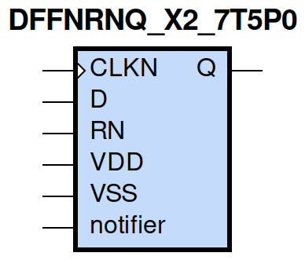
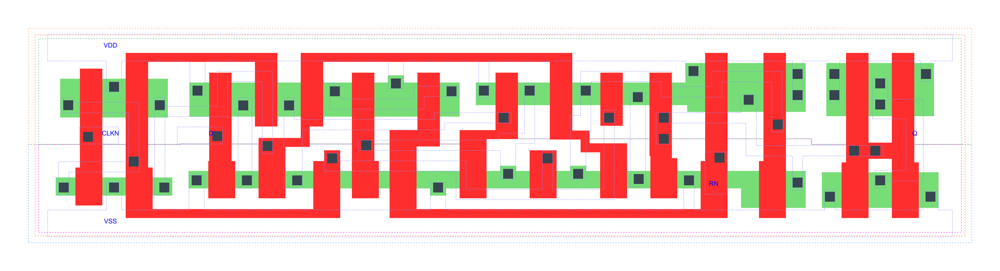

=======================================
gf180mcu_fd_sc_mcu7t5v0__dffnrnq_x2
=======================================

**gf180mcu_fd_sc_mcu7t5v0__dffnrnq_x2 symbol**

**gf180mcu_fd_sc_mcu7t5v0__dffnrnq_x2 schematic**

.. image:: sc7_sch/DFFNRNQ_X2_sch.png
    :height: 300px
    :width: 500 px
    :align: center
    :alt: gf180mcu_fd_sc_mcu7t5v0__dffnrnq_x2 schematic

**gf180mcu_fd_sc_mcu7t5v0__dffnrnq_x2 layout**

.. include:: images.rst

DFFNRNQ_X2 is a negative edge triggered D-type flip flop, active low reset and 2X drive strength

|
| Attributes

============= ======================
**Attribute** **Value**
area          79.027200 µm\ :sup:`2`
============= ======================

|

TRUTH TABLE

===== = ==== ======
Input        Output
RN    D CLKN Q
H     L ↓    L
H     H ↓    H
L     X X    L
===== = ==== ======

|
| FUNCTIONAL SCHEMATIC
| |image206|
| CONSTRAINTS

================== =============== ============= ============
**Constraint Pin** **Related Pin** **setup(ns)** **hold(ns)**
D(HL)              CLKN(HL)        0.2290        0.1830
D(LH)              CLKN(HL)        0.2350        0.1490
================== =============== ============= ============

|

================== =============== ================ ===============
**Constraint Pin** **Related Pin** **recovery(ns)** **removal(ns)**
RN(LH)             CLKN(HL)        -0.3720          0.5100
================== =============== ================ ===============

|

================== =============== ===========================
**Constraint Pin** **Related Pin** **Minimum Pulse Width(ns)**
CLKN(LHL)          CLKN(LH)        0.4000
CLKN(LHL)          CLKN(LH)        0.4730
CLKN(HLH)          CLKN(HL)        0.3780
CLKN(HLH)          CLKN(HL)        0.5540
RN(HLH)            RN(HL)          0.3580
RN(HLH)            RN(HL)          0.3000
RN(HLH)            RN(HL)          0.3580
RN(HLH)            RN(HL)          0.3000
================== =============== ===========================

|
| PIN CAPACITANCE (pf)

======= ======== ====================
**Pin** **Type** **Capacitance (pf)**
CLKN    input    0.0032
D       input    0.0030
RN      input    0.0071
======= ======== ====================

|
| DELAY AND OUTPUT TRANSITION TIME corresponding to min slew and load

+---------------+------------+--------------------+--------------+-------------------+----------------+---------------+
| **Input Pin** | **Output** | **When Condition** | **Tin (ns)** | **Out Load (pf)** | **Delay (ns)** | **Tout (ns)** |
+---------------+------------+--------------------+--------------+-------------------+----------------+---------------+
| CLKN(HL)      | Q(LH)      | D&RN               | 0.0100       | 0.0010            | 0.8466         | 0.0498        |
+---------------+------------+--------------------+--------------+-------------------+----------------+---------------+
| CLKN(HL)      | Q(HL)      | !D&RN              | 0.0100       | 0.0010            | 0.5925         | 0.0364        |
+---------------+------------+--------------------+--------------+-------------------+----------------+---------------+
| RN(HL)        | Q(HL)      | !CLKN&!D           | 0.0100       | 0.0010            | 0.2032         | 0.0371        |
+---------------+------------+--------------------+--------------+-------------------+----------------+---------------+
| RN(HL)        | Q(HL)      | CLKN&!D            | 0.0100       | 0.0010            | 0.2034         | 0.0374        |
+---------------+------------+--------------------+--------------+-------------------+----------------+---------------+
| RN(HL)        | Q(HL)      | !CLKN&D            | 0.0100       | 0.0010            | 0.2033         | 0.0371        |
+---------------+------------+--------------------+--------------+-------------------+----------------+---------------+
| RN(HL)        | Q(HL)      | CLKN&D             | 0.0100       | 0.0010            | 0.2034         | 0.0373        |
+---------------+------------+--------------------+--------------+-------------------+----------------+---------------+

|
| DYNAMIC ENERGY

+---------------+--------------------+--------------+------------+-------------------+---------------------+
| **Input Pin** | **When Condition** | **Tin (ns)** | **Output** | **Out Load (pf)** | **Energy (uW/MHz)** |
+---------------+--------------------+--------------+------------+-------------------+---------------------+
| RN            | !CLKN&!D           | 0.0100       | Q(HL)      | 0.0010            | 0.7631              |
+---------------+--------------------+--------------+------------+-------------------+---------------------+
| RN            | CLKN&!D            | 0.0100       | Q(HL)      | 0.0010            | 0.5355              |
+---------------+--------------------+--------------+------------+-------------------+---------------------+
| RN            | !CLKN&D            | 0.0100       | Q(HL)      | 0.0010            | 0.7630              |
+---------------+--------------------+--------------+------------+-------------------+---------------------+
| RN            | CLKN&D             | 0.0100       | Q(HL)      | 0.0010            | 0.5524              |
+---------------+--------------------+--------------+------------+-------------------+---------------------+
| CLKN          | D&RN               | 0.0100       | Q(LH)      | 0.0010            | 0.9855              |
+---------------+--------------------+--------------+------------+-------------------+---------------------+
| CLKN          | !D&RN              | 0.0100       | Q(HL)      | 0.0010            | 0.7843              |
+---------------+--------------------+--------------+------------+-------------------+---------------------+
| CLKN(LH)      | !D&!RN             | 0.0100       | n/a        | n/a               | 0.2151              |
+---------------+--------------------+--------------+------------+-------------------+---------------------+
| CLKN(LH)      | D&!RN              | 0.0100       | n/a        | n/a               | 0.3950              |
+---------------+--------------------+--------------+------------+-------------------+---------------------+
| CLKN(LH)      | !D&RN              | 0.0100       | n/a        | n/a               | 0.2149              |
+---------------+--------------------+--------------+------------+-------------------+---------------------+
| CLKN(LH)      | D&RN               | 0.0100       | n/a        | n/a               | 0.2113              |
+---------------+--------------------+--------------+------------+-------------------+---------------------+
| CLKN(HL)      | !D&!RN             | 0.0100       | n/a        | n/a               | 0.3224              |
+---------------+--------------------+--------------+------------+-------------------+---------------------+
| CLKN(HL)      | D&!RN              | 0.0100       | n/a        | n/a               | 0.6340              |
+---------------+--------------------+--------------+------------+-------------------+---------------------+
| CLKN(HL)      | !D&RN              | 0.0100       | n/a        | n/a               | 0.3224              |
+---------------+--------------------+--------------+------------+-------------------+---------------------+
| CLKN(HL)      | D&RN               | 0.0100       | n/a        | n/a               | 0.3115              |
+---------------+--------------------+--------------+------------+-------------------+---------------------+
| D(HL)         | !CLKN&!RN          | 0.0100       | n/a        | n/a               | 0.0659              |
+---------------+--------------------+--------------+------------+-------------------+---------------------+
| D(HL)         | CLKN&!RN           | 0.0100       | n/a        | n/a               | 0.2512              |
+---------------+--------------------+--------------+------------+-------------------+---------------------+
| D(HL)         | !CLKN&RN           | 0.0100       | n/a        | n/a               | 0.0659              |
+---------------+--------------------+--------------+------------+-------------------+---------------------+
| D(HL)         | CLKN&RN            | 0.0100       | n/a        | n/a               | 0.2400              |
+---------------+--------------------+--------------+------------+-------------------+---------------------+
| RN(HL)        | !CLKN&!D           | 0.0100       | n/a        | n/a               | 0.0632              |
+---------------+--------------------+--------------+------------+-------------------+---------------------+
| RN(HL)        | CLKN&!D            | 0.0100       | n/a        | n/a               | 0.0617              |
+---------------+--------------------+--------------+------------+-------------------+---------------------+
| RN(HL)        | !CLKN&D            | 0.0100       | n/a        | n/a               | 0.0631              |
+---------------+--------------------+--------------+------------+-------------------+---------------------+
| RN(HL)        | CLKN&D             | 0.0100       | n/a        | n/a               | 0.0605              |
+---------------+--------------------+--------------+------------+-------------------+---------------------+
| D(LH)         | !CLKN&!RN          | 0.0100       | n/a        | n/a               | 0.0056              |
+---------------+--------------------+--------------+------------+-------------------+---------------------+
| D(LH)         | CLKN&!RN           | 0.0100       | n/a        | n/a               | 0.1542              |
+---------------+--------------------+--------------+------------+-------------------+---------------------+
| D(LH)         | !CLKN&RN           | 0.0100       | n/a        | n/a               | 0.0056              |
+---------------+--------------------+--------------+------------+-------------------+---------------------+
| D(LH)         | CLKN&RN            | 0.0100       | n/a        | n/a               | 0.1614              |
+---------------+--------------------+--------------+------------+-------------------+---------------------+
| RN(LH)        | !CLKN&!D           | 0.0100       | n/a        | n/a               | -0.0593             |
+---------------+--------------------+--------------+------------+-------------------+---------------------+
| RN(LH)        | !CLKN&D            | 0.0100       | n/a        | n/a               | -0.0593             |
+---------------+--------------------+--------------+------------+-------------------+---------------------+
| RN(LH)        | CLKN&!D            | 0.0100       | n/a        | n/a               | -0.0592             |
+---------------+--------------------+--------------+------------+-------------------+---------------------+
| RN(LH)        | CLKN&D             | 0.0100       | n/a        | n/a               | -0.0554             |
+---------------+--------------------+--------------+------------+-------------------+---------------------+

|
| LEAKAGE POWER

================== ==============
**When Condition** **Power (nW)**
!CLKN&!D&!RN       0.4775
!CLKN&D&!RN        0.4800
CLKN&!D&!RN        0.4369
CLKN&D&!RN         0.4384
!CLKN&!D&RN        0.5044
CLKN&!D&RN         0.4372
CLKN&D&RN          0.5506
!CLKN&D&RN         0.6452
================== ==============

