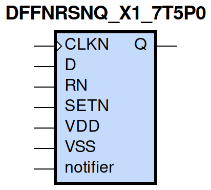
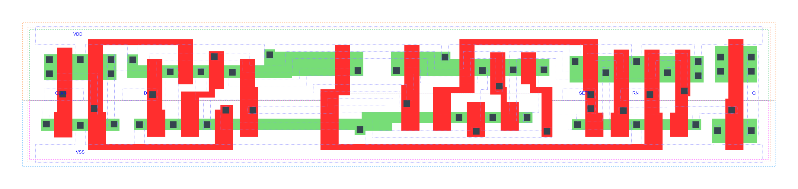

=======================================
gf180mcu_fd_sc_mcu7t5v0__dffnrsnq_x1
=======================================

**gf180mcu_fd_sc_mcu7t5v0__dffnrsnq_x1 symbol**

**gf180mcu_fd_sc_mcu7t5v0__dffnrsnq_x1 schematic**

.. image:: sc7_sch/DFFNRSNQ_X1_sch.png
    :height: 300px
    :width: 500 px
    :align: center
    :alt: gf180mcu_fd_sc_mcu7t5v0__dffnrsnq_x1 schematic

**gf180mcu_fd_sc_mcu7t5v0__dffnrsnq_x1 layout**

.. include:: images.rst

DFFNRSNQ_X1 is a negative edge triggered D-type flip flop, active low set/reset and 1X drive strength

|
| Attributes

============= ======================
**Attribute** **Value**
area          94.393600 µm\ :sup:`2`
============= ======================

|

TRUTH TABLE

===== ==== = ==== ======
Input             Output
RN    SETN D CLKN Q
H     H    L ↓    L
H     H    H ↓    H
L     H    X X    L
H     L    X X    H
L     L    X X    L
===== ==== = ==== ======

|
| FUNCTIONAL SCHEMATIC
| |image212|
| CONSTRAINTS

================== =============== ============= ============
**Constraint Pin** **Related Pin** **setup(ns)** **hold(ns)**
D(HL)              CLKN(HL)        0.5150        -0.0170
D(LH)              CLKN(HL)        0.1140        0.1950
SETN(LH)           RN(LH)          -0.0170       0.1090
SETN(LH)           RN(LH)          0.0170        0.0740
SETN(LH)           RN(LH)          -0.0170       0.1090
SETN(LH)           RN(LH)          0.0170        0.0740
RN(LH)             SETN(LH)        0.1090        -0.0170
RN(LH)             SETN(LH)        0.0740        0.0170
RN(LH)             SETN(LH)        0.1090        -0.0170
RN(LH)             SETN(LH)        0.0740        0.0170
================== =============== ============= ============

|

================== =============== ================ ===============
**Constraint Pin** **Related Pin** **recovery(ns)** **removal(ns)**
SETN(LH)           CLKN(HL)        0.1490           0.1490
RN(LH)             CLKN(HL)        -0.4580          0.8590
================== =============== ================ ===============

|

================== =============== ===========================
**Constraint Pin** **Related Pin** **Minimum Pulse Width(ns)**
CLKN(LHL)          CLKN(LH)        0.7300
CLKN(LHL)          CLKN(LH)        0.3760
CLKN(HLH)          CLKN(HL)        0.4460
CLKN(HLH)          CLKN(HL)        0.5150
SETN(HLH)          SETN(HL)        0.5150
SETN(HLH)          SETN(HL)        0.3780
SETN(HLH)          SETN(HL)        0.5150
SETN(HLH)          SETN(HL)        0.3780
RN(HLH)            RN(HL)          0.5930
RN(HLH)            RN(HL)          0.3490
RN(HLH)            RN(HL)          0.5930
RN(HLH)            RN(HL)          0.3490
================== =============== ===========================

|
| PIN CAPACITANCE (pf)

======= ======== ====================
**Pin** **Type** **Capacitance (pf)**
CLKN    input    0.0034
D       input    0.0024
SETN    input    0.0065
RN      input    0.0076
======= ======== ====================

|
| DELAY AND OUTPUT TRANSITION TIME corresponding to min slew and load

+---------------+------------+--------------------+--------------+-------------------+----------------+---------------+
| **Input Pin** | **Output** | **When Condition** | **Tin (ns)** | **Out Load (pf)** | **Delay (ns)** | **Tout (ns)** |
+---------------+------------+--------------------+--------------+-------------------+----------------+---------------+
| CLKN(HL)      | Q(LH)      | D&RN&SETN          | 0.0100       | 0.0010            | 0.8515         | 0.0589        |
+---------------+------------+--------------------+--------------+-------------------+----------------+---------------+
| CLKN(HL)      | Q(HL)      | !D&RN&SETN         | 0.0100       | 0.0010            | 0.6474         | 0.0445        |
+---------------+------------+--------------------+--------------+-------------------+----------------+---------------+
| SETN(HL)      | Q(LH)      | !CLKN&!D&RN        | 0.0100       | 0.0010            | 0.7576         | 0.0582        |
+---------------+------------+--------------------+--------------+-------------------+----------------+---------------+
| SETN(HL)      | Q(LH)      | CLKN&!D&RN         | 0.0100       | 0.0010            | 0.5859         | 0.0578        |
+---------------+------------+--------------------+--------------+-------------------+----------------+---------------+
| SETN(HL)      | Q(LH)      | !CLKN&D&RN         | 0.0100       | 0.0010            | 0.7577         | 0.0585        |
+---------------+------------+--------------------+--------------+-------------------+----------------+---------------+
| SETN(HL)      | Q(LH)      | CLKN&D&RN          | 0.0100       | 0.0010            | 0.5862         | 0.0575        |
+---------------+------------+--------------------+--------------+-------------------+----------------+---------------+
| RN(HL)        | Q(HL)      | !CLKN&!D&SETN      | 0.0100       | 0.0010            | 0.1937         | 0.0409        |
+---------------+------------+--------------------+--------------+-------------------+----------------+---------------+
| RN(HL)        | Q(HL)      | CLKN&!D&SETN       | 0.0100       | 0.0010            | 0.1935         | 0.0411        |
+---------------+------------+--------------------+--------------+-------------------+----------------+---------------+
| RN(HL)        | Q(HL)      | !CLKN&D&SETN       | 0.0100       | 0.0010            | 0.1937         | 0.0409        |
+---------------+------------+--------------------+--------------+-------------------+----------------+---------------+
| RN(HL)        | Q(HL)      | CLKN&D&SETN        | 0.0100       | 0.0010            | 0.1935         | 0.0411        |
+---------------+------------+--------------------+--------------+-------------------+----------------+---------------+
| RN(HL)        | Q(HL)      | !CLKN&!D&!SETN     | 0.0100       | 0.0010            | 0.1934         | 0.0405        |
+---------------+------------+--------------------+--------------+-------------------+----------------+---------------+
| RN(HL)        | Q(HL)      | !CLKN&D&!SETN      | 0.0100       | 0.0010            | 0.1934         | 0.0405        |
+---------------+------------+--------------------+--------------+-------------------+----------------+---------------+
| RN(HL)        | Q(HL)      | CLKN&!D&!SETN      | 0.0100       | 0.0010            | 0.1933         | 0.0405        |
+---------------+------------+--------------------+--------------+-------------------+----------------+---------------+
| RN(HL)        | Q(HL)      | CLKN&D&!SETN       | 0.0100       | 0.0010            | 0.1933         | 0.0405        |
+---------------+------------+--------------------+--------------+-------------------+----------------+---------------+
| RN(LH)        | Q(LH)      | !CLKN&!D&!SETN     | 0.0100       | 0.0010            | 0.3156         | 0.0560        |
+---------------+------------+--------------------+--------------+-------------------+----------------+---------------+
| RN(LH)        | Q(LH)      | !CLKN&D&!SETN      | 0.0100       | 0.0010            | 0.3156         | 0.0560        |
+---------------+------------+--------------------+--------------+-------------------+----------------+---------------+
| RN(LH)        | Q(LH)      | CLKN&!D&!SETN      | 0.0100       | 0.0010            | 0.3130         | 0.0561        |
+---------------+------------+--------------------+--------------+-------------------+----------------+---------------+
| RN(LH)        | Q(LH)      | CLKN&D&!SETN       | 0.0100       | 0.0010            | 0.3130         | 0.0561        |
+---------------+------------+--------------------+--------------+-------------------+----------------+---------------+

|
| DYNAMIC ENERGY

+---------------+--------------------+--------------+------------+-------------------+---------------------+
| **Input Pin** | **When Condition** | **Tin (ns)** | **Output** | **Out Load (pf)** | **Energy (uW/MHz)** |
+---------------+--------------------+--------------+------------+-------------------+---------------------+
| SETN          | !CLKN&!D&RN        | 0.0100       | Q(LH)      | 0.0010            | 0.7102              |
+---------------+--------------------+--------------+------------+-------------------+---------------------+
| SETN          | CLKN&!D&RN         | 0.0100       | Q(LH)      | 0.0010            | 0.6061              |
+---------------+--------------------+--------------+------------+-------------------+---------------------+
| SETN          | !CLKN&D&RN         | 0.0100       | Q(LH)      | 0.0010            | 0.7103              |
+---------------+--------------------+--------------+------------+-------------------+---------------------+
| SETN          | CLKN&D&RN          | 0.0100       | Q(LH)      | 0.0010            | 0.4718              |
+---------------+--------------------+--------------+------------+-------------------+---------------------+
| RN            | !CLKN&!D&SETN      | 0.0100       | Q(HL)      | 0.0010            | 0.6477              |
+---------------+--------------------+--------------+------------+-------------------+---------------------+
| RN            | CLKN&!D&SETN       | 0.0100       | Q(HL)      | 0.0010            | 0.3848              |
+---------------+--------------------+--------------+------------+-------------------+---------------------+
| RN            | !CLKN&D&SETN       | 0.0100       | Q(HL)      | 0.0010            | 0.6466              |
+---------------+--------------------+--------------+------------+-------------------+---------------------+
| RN            | CLKN&D&SETN        | 0.0100       | Q(HL)      | 0.0010            | 0.3857              |
+---------------+--------------------+--------------+------------+-------------------+---------------------+
| RN            | !CLKN&!D&!SETN     | 0.0100       | Q(HL)      | 0.0010            | 0.4463              |
+---------------+--------------------+--------------+------------+-------------------+---------------------+
| RN            | !CLKN&D&!SETN      | 0.0100       | Q(HL)      | 0.0010            | 0.4463              |
+---------------+--------------------+--------------+------------+-------------------+---------------------+
| RN            | CLKN&!D&!SETN      | 0.0100       | Q(HL)      | 0.0010            | 0.2639              |
+---------------+--------------------+--------------+------------+-------------------+---------------------+
| RN            | CLKN&D&!SETN       | 0.0100       | Q(HL)      | 0.0010            | 0.2627              |
+---------------+--------------------+--------------+------------+-------------------+---------------------+
| RN            | !CLKN&!D&!SETN     | 0.0100       | Q(LH)      | 0.0010            | 0.2484              |
+---------------+--------------------+--------------+------------+-------------------+---------------------+
| RN            | !CLKN&D&!SETN      | 0.0100       | Q(LH)      | 0.0010            | 0.2484              |
+---------------+--------------------+--------------+------------+-------------------+---------------------+
| RN            | CLKN&!D&!SETN      | 0.0100       | Q(LH)      | 0.0010            | 0.1570              |
+---------------+--------------------+--------------+------------+-------------------+---------------------+
| RN            | CLKN&D&!SETN       | 0.0100       | Q(LH)      | 0.0010            | 0.1584              |
+---------------+--------------------+--------------+------------+-------------------+---------------------+
| CLKN          | D&RN&SETN          | 0.0100       | Q(LH)      | 0.0010            | 0.8873              |
+---------------+--------------------+--------------+------------+-------------------+---------------------+
| CLKN          | !D&RN&SETN         | 0.0100       | Q(HL)      | 0.0010            | 0.7079              |
+---------------+--------------------+--------------+------------+-------------------+---------------------+
| SETN(HL)      | !CLKN&!D&!RN       | 0.0100       | n/a        | n/a               | 0.3943              |
+---------------+--------------------+--------------+------------+-------------------+---------------------+
| SETN(HL)      | !CLKN&D&!RN        | 0.0100       | n/a        | n/a               | 0.3943              |
+---------------+--------------------+--------------+------------+-------------------+---------------------+
| SETN(HL)      | CLKN&!D&!RN        | 0.0100       | n/a        | n/a               | 0.3782              |
+---------------+--------------------+--------------+------------+-------------------+---------------------+
| SETN(HL)      | CLKN&D&!RN         | 0.0100       | n/a        | n/a               | 0.2485              |
+---------------+--------------------+--------------+------------+-------------------+---------------------+
| SETN(HL)      | !CLKN&!D&RN        | 0.0100       | n/a        | n/a               | 0.0502              |
+---------------+--------------------+--------------+------------+-------------------+---------------------+
| SETN(HL)      | CLKN&!D&RN         | 0.0100       | n/a        | n/a               | 0.1843              |
+---------------+--------------------+--------------+------------+-------------------+---------------------+
| SETN(HL)      | !CLKN&D&RN         | 0.0100       | n/a        | n/a               | 0.0501              |
+---------------+--------------------+--------------+------------+-------------------+---------------------+
| SETN(HL)      | CLKN&D&RN          | 0.0100       | n/a        | n/a               | 0.0500              |
+---------------+--------------------+--------------+------------+-------------------+---------------------+
| CLKN(LH)      | !D&!RN&!SETN       | 0.0100       | n/a        | n/a               | 0.2506              |
+---------------+--------------------+--------------+------------+-------------------+---------------------+
| CLKN(LH)      | !D&!RN&SETN        | 0.0100       | n/a        | n/a               | 0.2484              |
+---------------+--------------------+--------------+------------+-------------------+---------------------+
| CLKN(LH)      | D&!RN&!SETN        | 0.0100       | n/a        | n/a               | 0.3199              |
+---------------+--------------------+--------------+------------+-------------------+---------------------+
| CLKN(LH)      | D&!RN&SETN         | 0.0100       | n/a        | n/a               | 0.4781              |
+---------------+--------------------+--------------+------------+-------------------+---------------------+
| CLKN(LH)      | !D&RN&!SETN        | 0.0100       | n/a        | n/a               | 0.3661              |
+---------------+--------------------+--------------+------------+-------------------+---------------------+
| CLKN(LH)      | D&RN&!SETN         | 0.0100       | n/a        | n/a               | 0.2530              |
+---------------+--------------------+--------------+------------+-------------------+---------------------+
| CLKN(LH)      | !D&RN&SETN         | 0.0100       | n/a        | n/a               | 0.2484              |
+---------------+--------------------+--------------+------------+-------------------+---------------------+
| CLKN(LH)      | D&RN&SETN          | 0.0100       | n/a        | n/a               | 0.2532              |
+---------------+--------------------+--------------+------------+-------------------+---------------------+
| CLKN(HL)      | !D&!RN&!SETN       | 0.0100       | n/a        | n/a               | 0.3846              |
+---------------+--------------------+--------------+------------+-------------------+---------------------+
| CLKN(HL)      | !D&!RN&SETN        | 0.0100       | n/a        | n/a               | 0.3554              |
+---------------+--------------------+--------------+------------+-------------------+---------------------+
| CLKN(HL)      | D&!RN&!SETN        | 0.0100       | n/a        | n/a               | 0.5074              |
+---------------+--------------------+--------------+------------+-------------------+---------------------+
| CLKN(HL)      | D&!RN&SETN         | 0.0100       | n/a        | n/a               | 0.7671              |
+---------------+--------------------+--------------+------------+-------------------+---------------------+
| CLKN(HL)      | !D&RN&!SETN        | 0.0100       | n/a        | n/a               | 0.4221              |
+---------------+--------------------+--------------+------------+-------------------+---------------------+
| CLKN(HL)      | D&RN&!SETN         | 0.0100       | n/a        | n/a               | 0.3705              |
+---------------+--------------------+--------------+------------+-------------------+---------------------+
| CLKN(HL)      | !D&RN&SETN         | 0.0100       | n/a        | n/a               | 0.3555              |
+---------------+--------------------+--------------+------------+-------------------+---------------------+
| CLKN(HL)      | D&RN&SETN          | 0.0100       | n/a        | n/a               | 0.3705              |
+---------------+--------------------+--------------+------------+-------------------+---------------------+
| D(HL)         | !CLKN&!RN&!SETN    | 0.0100       | n/a        | n/a               | 0.0526              |
+---------------+--------------------+--------------+------------+-------------------+---------------------+
| D(HL)         | !CLKN&!RN&SETN     | 0.0100       | n/a        | n/a               | 0.0526              |
+---------------+--------------------+--------------+------------+-------------------+---------------------+
| D(HL)         | CLKN&!RN&!SETN     | 0.0100       | n/a        | n/a               | 0.1681              |
+---------------+--------------------+--------------+------------+-------------------+---------------------+
| D(HL)         | CLKN&!RN&SETN      | 0.0100       | n/a        | n/a               | 0.2561              |
+---------------+--------------------+--------------+------------+-------------------+---------------------+
| D(HL)         | !CLKN&RN&!SETN     | 0.0100       | n/a        | n/a               | 0.0526              |
+---------------+--------------------+--------------+------------+-------------------+---------------------+
| D(HL)         | CLKN&RN&!SETN      | 0.0100       | n/a        | n/a               | 0.1681              |
+---------------+--------------------+--------------+------------+-------------------+---------------------+
| D(HL)         | !CLKN&RN&SETN      | 0.0100       | n/a        | n/a               | 0.0526              |
+---------------+--------------------+--------------+------------+-------------------+---------------------+
| D(HL)         | CLKN&RN&SETN       | 0.0100       | n/a        | n/a               | 0.2493              |
+---------------+--------------------+--------------+------------+-------------------+---------------------+
| RN(HL)        | !CLKN&!D&SETN      | 0.0100       | n/a        | n/a               | 0.0576              |
+---------------+--------------------+--------------+------------+-------------------+---------------------+
| RN(HL)        | CLKN&!D&SETN       | 0.0100       | n/a        | n/a               | 0.0558              |
+---------------+--------------------+--------------+------------+-------------------+---------------------+
| RN(HL)        | !CLKN&D&SETN       | 0.0100       | n/a        | n/a               | 0.0574              |
+---------------+--------------------+--------------+------------+-------------------+---------------------+
| RN(HL)        | CLKN&D&SETN        | 0.0100       | n/a        | n/a               | 0.0535              |
+---------------+--------------------+--------------+------------+-------------------+---------------------+
| D(LH)         | !CLKN&!RN&!SETN    | 0.0100       | n/a        | n/a               | 0.0046              |
+---------------+--------------------+--------------+------------+-------------------+---------------------+
| D(LH)         | !CLKN&!RN&SETN     | 0.0100       | n/a        | n/a               | 0.0047              |
+---------------+--------------------+--------------+------------+-------------------+---------------------+
| D(LH)         | CLKN&!RN&!SETN     | 0.0100       | n/a        | n/a               | 0.0561              |
+---------------+--------------------+--------------+------------+-------------------+---------------------+
| D(LH)         | CLKN&!RN&SETN      | 0.0100       | n/a        | n/a               | 0.2135              |
+---------------+--------------------+--------------+------------+-------------------+---------------------+
| D(LH)         | !CLKN&RN&!SETN     | 0.0100       | n/a        | n/a               | 0.0046              |
+---------------+--------------------+--------------+------------+-------------------+---------------------+
| D(LH)         | CLKN&RN&!SETN      | 0.0100       | n/a        | n/a               | 0.0561              |
+---------------+--------------------+--------------+------------+-------------------+---------------------+
| D(LH)         | !CLKN&RN&SETN      | 0.0100       | n/a        | n/a               | 0.0046              |
+---------------+--------------------+--------------+------------+-------------------+---------------------+
| D(LH)         | CLKN&RN&SETN       | 0.0100       | n/a        | n/a               | 0.2183              |
+---------------+--------------------+--------------+------------+-------------------+---------------------+
| RN(LH)        | !CLKN&!D&SETN      | 0.0100       | n/a        | n/a               | -0.0537             |
+---------------+--------------------+--------------+------------+-------------------+---------------------+
| RN(LH)        | !CLKN&D&SETN       | 0.0100       | n/a        | n/a               | -0.0537             |
+---------------+--------------------+--------------+------------+-------------------+---------------------+
| RN(LH)        | CLKN&!D&SETN       | 0.0100       | n/a        | n/a               | -0.0537             |
+---------------+--------------------+--------------+------------+-------------------+---------------------+
| RN(LH)        | CLKN&D&SETN        | 0.0100       | n/a        | n/a               | -0.0486             |
+---------------+--------------------+--------------+------------+-------------------+---------------------+
| SETN(LH)      | !CLKN&!D&!RN       | 0.0100       | n/a        | n/a               | 0.1172              |
+---------------+--------------------+--------------+------------+-------------------+---------------------+
| SETN(LH)      | !CLKN&D&!RN        | 0.0100       | n/a        | n/a               | 0.1172              |
+---------------+--------------------+--------------+------------+-------------------+---------------------+
| SETN(LH)      | CLKN&!D&!RN        | 0.0100       | n/a        | n/a               | 0.1222              |
+---------------+--------------------+--------------+------------+-------------------+---------------------+
| SETN(LH)      | CLKN&D&!RN         | 0.0100       | n/a        | n/a               | 0.0670              |
+---------------+--------------------+--------------+------------+-------------------+---------------------+
| SETN(LH)      | !CLKN&!D&RN        | 0.0100       | n/a        | n/a               | -0.0342             |
+---------------+--------------------+--------------+------------+-------------------+---------------------+
| SETN(LH)      | !CLKN&D&RN         | 0.0100       | n/a        | n/a               | -0.0342             |
+---------------+--------------------+--------------+------------+-------------------+---------------------+
| SETN(LH)      | CLKN&!D&RN         | 0.0100       | n/a        | n/a               | 0.0148              |
+---------------+--------------------+--------------+------------+-------------------+---------------------+
| SETN(LH)      | CLKN&D&RN          | 0.0100       | n/a        | n/a               | -0.0342             |
+---------------+--------------------+--------------+------------+-------------------+---------------------+

|
| LEAKAGE POWER

================== ==============
**When Condition** **Power (nW)**
!CLKN&!D&!RN&!SETN 0.5357
!CLKN&!D&!RN&SETN  0.5046
!CLKN&D&!RN&!SETN  0.5377
!CLKN&D&!RN&SETN   0.5066
CLKN&!D&!RN&!SETN  0.4546
CLKN&!D&!RN&SETN   0.4640
CLKN&D&!RN&!SETN   0.4521
CLKN&D&!RN&SETN    0.4809
!CLKN&D&RN&SETN    0.7068
!CLKN&!D&RN&!SETN  0.4925
!CLKN&D&RN&!SETN   0.4908
CLKN&!D&RN&!SETN   0.4379
CLKN&D&RN&!SETN    0.4343
!CLKN&!D&RN&SETN   0.5317
CLKN&!D&RN&SETN    0.6085
CLKN&D&RN&SETN     0.5926
================== ==============

