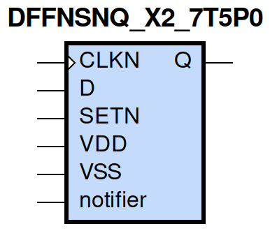
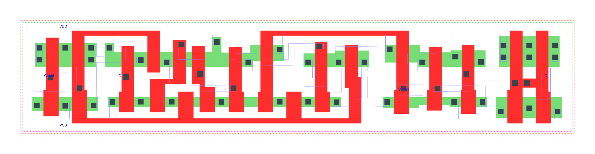

=======================================
gf180mcu_fd_sc_mcu7t5v0__dffnsnq_x2
=======================================

**gf180mcu_fd_sc_mcu7t5v0__dffnsnq_x2 symbol**

**gf180mcu_fd_sc_mcu7t5v0__dffnsnq_x2 schematic**

.. image:: sc7_sch/DFFNSNQ_X2_sch.png
    :height: 300px
    :width: 500 px
    :align: center
    :alt: gf180mcu_fd_sc_mcu7t5v0__dffnsnq_x2 schematic

**gf180mcu_fd_sc_mcu7t5v0__dffnsnq_x2 layout**

.. include:: images.rst

DFFNSNQ_X2 is a negative edge triggered D-type flip flop, active low set and 2X drive strength

|
| Attributes

============= ======================
**Attribute** **Value**
area          83.417600 µm\ :sup:`2`
============= ======================

|

TRUTH TABLE

===== = ==== ======
Input        Output
SETN  D CLKN Q
H     L ↓    L
H     H ↓    H
L     X X    H
===== = ==== ======

|
| FUNCTIONAL SCHEMATIC
| |image224|
| CONSTRAINTS

================== =============== ============= ============
**Constraint Pin** **Related Pin** **setup(ns)** **hold(ns)**
D(HL)              CLKN(HL)        0.3320        0.0230
D(LH)              CLKN(HL)        0.2290        0.1370
================== =============== ============= ============

|

================== =============== ================ ===============
**Constraint Pin** **Related Pin** **recovery(ns)** **removal(ns)**
SETN(LH)           CLKN(HL)        0.1030           0.1140
================== =============== ================ ===============

|

================== =============== ===========================
**Constraint Pin** **Related Pin** **Minimum Pulse Width(ns)**
CLKN(LHL)          CLKN(LH)        0.4610
CLKN(LHL)          CLKN(LH)        0.4310
CLKN(HLH)          CLKN(HL)        0.4760
CLKN(HLH)          CLKN(HL)        0.4850
SETN(HLH)          SETN(HL)        0.3880
SETN(HLH)          SETN(HL)        0.3880
SETN(HLH)          SETN(HL)        0.3880
SETN(HLH)          SETN(HL)        0.3880
================== =============== ===========================

|
| PIN CAPACITANCE (pf)

======= ======== ====================
**Pin** **Type** **Capacitance (pf)**
CLKN    input    0.0038
D       input    0.0026
SETN    input    0.0064
======= ======== ====================

|
| DELAY AND OUTPUT TRANSITION TIME corresponding to min slew and load

+---------------+------------+--------------------+--------------+-------------------+----------------+---------------+
| **Input Pin** | **Output** | **When Condition** | **Tin (ns)** | **Out Load (pf)** | **Delay (ns)** | **Tout (ns)** |
+---------------+------------+--------------------+--------------+-------------------+----------------+---------------+
| CLKN(HL)      | Q(LH)      | D&SETN             | 0.0100       | 0.0010            | 0.7110         | 0.0431        |
+---------------+------------+--------------------+--------------+-------------------+----------------+---------------+
| CLKN(HL)      | Q(HL)      | !D&SETN            | 0.0100       | 0.0010            | 0.6654         | 0.0486        |
+---------------+------------+--------------------+--------------+-------------------+----------------+---------------+
| SETN(HL)      | Q(LH)      | !CLKN&!D           | 0.0100       | 0.0010            | 0.5939         | 0.0419        |
+---------------+------------+--------------------+--------------+-------------------+----------------+---------------+
| SETN(HL)      | Q(LH)      | CLKN&!D            | 0.0100       | 0.0010            | 0.5331         | 0.0413        |
+---------------+------------+--------------------+--------------+-------------------+----------------+---------------+
| SETN(HL)      | Q(LH)      | !CLKN&D            | 0.0100       | 0.0010            | 0.5939         | 0.0418        |
+---------------+------------+--------------------+--------------+-------------------+----------------+---------------+
| SETN(HL)      | Q(LH)      | CLKN&D             | 0.0100       | 0.0010            | 0.5334         | 0.0417        |
+---------------+------------+--------------------+--------------+-------------------+----------------+---------------+

|
| DYNAMIC ENERGY

+---------------+--------------------+--------------+------------+-------------------+---------------------+
| **Input Pin** | **When Condition** | **Tin (ns)** | **Output** | **Out Load (pf)** | **Energy (uW/MHz)** |
+---------------+--------------------+--------------+------------+-------------------+---------------------+
| SETN          | !CLKN&!D           | 0.0100       | Q(LH)      | 0.0010            | 0.7160              |
+---------------+--------------------+--------------+------------+-------------------+---------------------+
| SETN          | CLKN&!D            | 0.0100       | Q(LH)      | 0.0010            | 0.6351              |
+---------------+--------------------+--------------+------------+-------------------+---------------------+
| SETN          | !CLKN&D            | 0.0100       | Q(LH)      | 0.0010            | 0.7160              |
+---------------+--------------------+--------------+------------+-------------------+---------------------+
| SETN          | CLKN&D             | 0.0100       | Q(LH)      | 0.0010            | 0.5386              |
+---------------+--------------------+--------------+------------+-------------------+---------------------+
| CLKN          | D&SETN             | 0.0100       | Q(LH)      | 0.0010            | 0.8951              |
+---------------+--------------------+--------------+------------+-------------------+---------------------+
| CLKN          | !D&SETN            | 0.0100       | Q(HL)      | 0.0010            | 0.8245              |
+---------------+--------------------+--------------+------------+-------------------+---------------------+
| SETN(HL)      | !CLKN&!D           | 0.0100       | n/a        | n/a               | 0.0473              |
+---------------+--------------------+--------------+------------+-------------------+---------------------+
| SETN(HL)      | CLKN&!D            | 0.0100       | n/a        | n/a               | 0.1425              |
+---------------+--------------------+--------------+------------+-------------------+---------------------+
| SETN(HL)      | !CLKN&D            | 0.0100       | n/a        | n/a               | 0.0473              |
+---------------+--------------------+--------------+------------+-------------------+---------------------+
| SETN(HL)      | CLKN&D             | 0.0100       | n/a        | n/a               | 0.0472              |
+---------------+--------------------+--------------+------------+-------------------+---------------------+
| CLKN(LH)      | !D&!SETN           | 0.0100       | n/a        | n/a               | 0.3092              |
+---------------+--------------------+--------------+------------+-------------------+---------------------+
| CLKN(LH)      | D&!SETN            | 0.0100       | n/a        | n/a               | 0.2258              |
+---------------+--------------------+--------------+------------+-------------------+---------------------+
| CLKN(LH)      | !D&SETN            | 0.0100       | n/a        | n/a               | 0.2240              |
+---------------+--------------------+--------------+------------+-------------------+---------------------+
| CLKN(LH)      | D&SETN             | 0.0100       | n/a        | n/a               | 0.2258              |
+---------------+--------------------+--------------+------------+-------------------+---------------------+
| CLKN(HL)      | !D&!SETN           | 0.0100       | n/a        | n/a               | 0.3753              |
+---------------+--------------------+--------------+------------+-------------------+---------------------+
| CLKN(HL)      | D&!SETN            | 0.0100       | n/a        | n/a               | 0.3241              |
+---------------+--------------------+--------------+------------+-------------------+---------------------+
| CLKN(HL)      | !D&SETN            | 0.0100       | n/a        | n/a               | 0.3190              |
+---------------+--------------------+--------------+------------+-------------------+---------------------+
| CLKN(HL)      | D&SETN             | 0.0100       | n/a        | n/a               | 0.3240              |
+---------------+--------------------+--------------+------------+-------------------+---------------------+
| D(HL)         | !CLKN&!SETN        | 0.0100       | n/a        | n/a               | 0.0609              |
+---------------+--------------------+--------------+------------+-------------------+---------------------+
| D(HL)         | CLKN&!SETN         | 0.0100       | n/a        | n/a               | 0.1478              |
+---------------+--------------------+--------------+------------+-------------------+---------------------+
| D(HL)         | !CLKN&SETN         | 0.0100       | n/a        | n/a               | 0.0609              |
+---------------+--------------------+--------------+------------+-------------------+---------------------+
| D(HL)         | CLKN&SETN          | 0.0100       | n/a        | n/a               | 0.2183              |
+---------------+--------------------+--------------+------------+-------------------+---------------------+
| D(LH)         | !CLKN&!SETN        | 0.0100       | n/a        | n/a               | 0.0053              |
+---------------+--------------------+--------------+------------+-------------------+---------------------+
| D(LH)         | CLKN&!SETN         | 0.0100       | n/a        | n/a               | 0.0537              |
+---------------+--------------------+--------------+------------+-------------------+---------------------+
| D(LH)         | !CLKN&SETN         | 0.0100       | n/a        | n/a               | 0.0054              |
+---------------+--------------------+--------------+------------+-------------------+---------------------+
| D(LH)         | CLKN&SETN          | 0.0100       | n/a        | n/a               | 0.1750              |
+---------------+--------------------+--------------+------------+-------------------+---------------------+
| SETN(LH)      | !CLKN&!D           | 0.0100       | n/a        | n/a               | -0.0251             |
+---------------+--------------------+--------------+------------+-------------------+---------------------+
| SETN(LH)      | !CLKN&D            | 0.0100       | n/a        | n/a               | -0.0251             |
+---------------+--------------------+--------------+------------+-------------------+---------------------+
| SETN(LH)      | CLKN&!D            | 0.0100       | n/a        | n/a               | 0.0304              |
+---------------+--------------------+--------------+------------+-------------------+---------------------+
| SETN(LH)      | CLKN&D             | 0.0100       | n/a        | n/a               | -0.0252             |
+---------------+--------------------+--------------+------------+-------------------+---------------------+

|
| LEAKAGE POWER

================== ==============
**When Condition** **Power (nW)**
!CLKN&!D&!SETN     0.4718
!CLKN&D&!SETN      0.4704
CLKN&!D&!SETN      0.4349
CLKN&D&!SETN       0.4322
!CLKN&!D&SETN      0.5572
CLKN&!D&SETN       0.6398
CLKN&D&SETN        0.6296
!CLKN&D&SETN       0.6633
================== ==============

